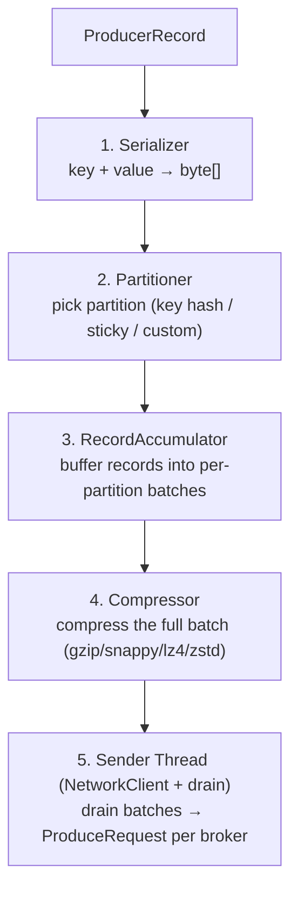
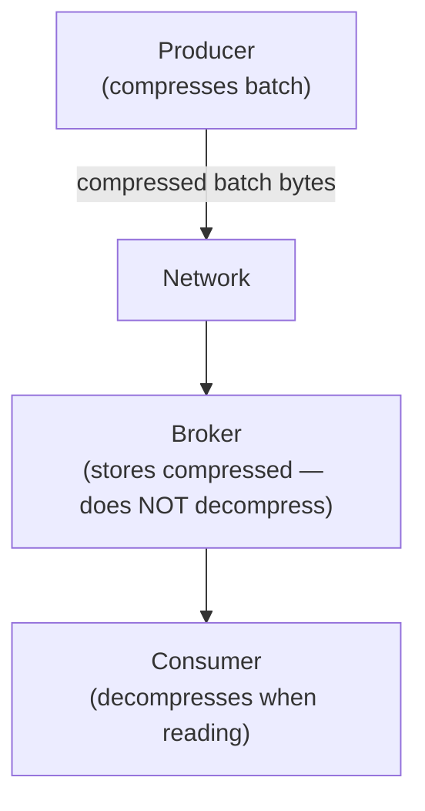
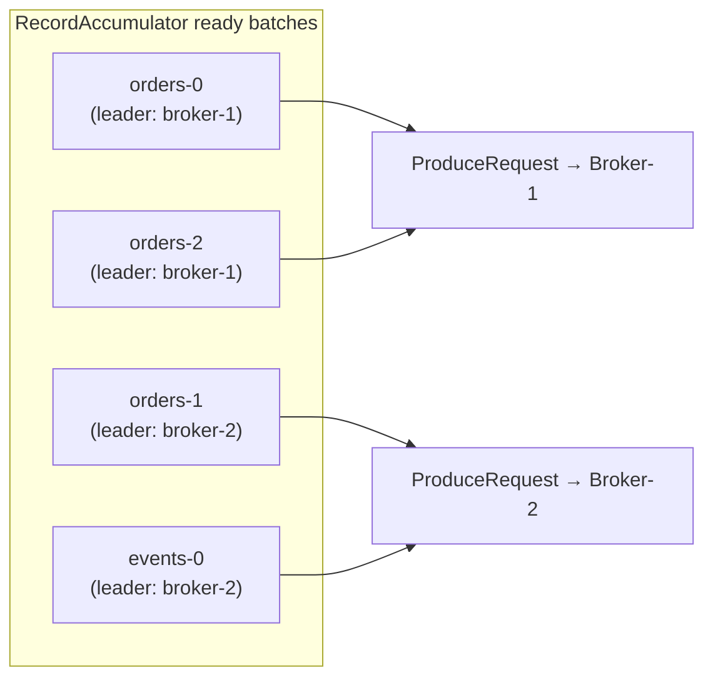
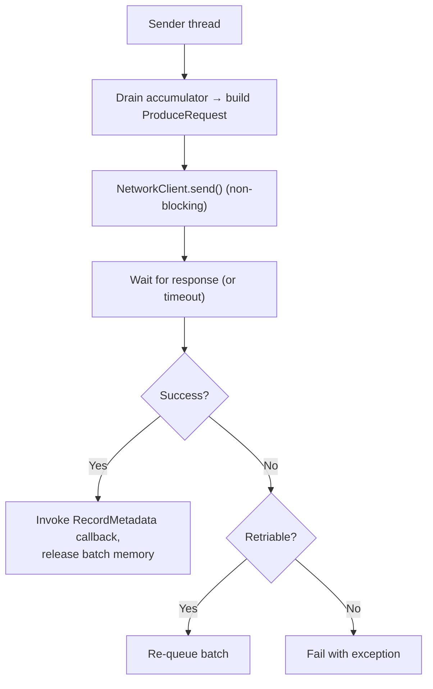
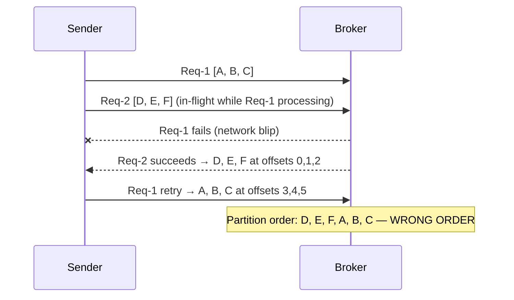

# Kafka — Chapter 8: Producer Internals

> How a `producer.send(record)` call travels through five pipeline stages before bytes hit the network.

---

## Overview — The 5-Stage Pipeline



---

## Stage 1 — Serializer

### Why
Kafka is a language-agnostic messaging system. The broker has zero knowledge of your Java types — it stores and routes raw bytes. A Java producer and a Python consumer must agree on the same byte layout, and the only way to guarantee that without coupling them to a JVM class loader is to convert at the edge. Separating serialization into its own stage also means you can swap JSON → Avro → Protobuf without touching any other part of the pipeline.

### What
Converts the record's key and value Java objects into raw `byte[]`. Kafka is bytes-on-the-wire; the serializer is the bridge between your domain types and the wire format.

### Built-in serializers

| Class | Handles |
|-------|---------|
| `StringSerializer` | UTF-8 strings |
| `IntegerSerializer` / `LongSerializer` | primitives (big-endian 4/8 bytes) |
| `ByteArraySerializer` | pass-through — already bytes |
| `ByteBufferSerializer` | NIO ByteBuffer |

### Custom serializer
Implement `org.apache.kafka.common.serialization.Serializer<T>`:

```java
public class OrderSerializer implements Serializer<Order> {
    private final ObjectMapper mapper = new ObjectMapper();

    @Override
    public byte[] serialize(String topic, Order data) {
        try {
            return mapper.writeValueAsBytes(data);
        } catch (JsonProcessingException e) {
            throw new SerializationException(e);
        }
    }
}
```

### Schema Registry path (Avro/Protobuf)
When you use `KafkaAvroSerializer`, the serializer:
1. Registers the schema with the Schema Registry (or fetches the existing schema ID).
2. Writes a 5-byte magic header (`0x00` + 4-byte schema ID).
3. Appends the Avro-binary payload.

The consumer's `KafkaAvroDeserializer` reads the schema ID and fetches the schema to decode. This is still just a Serializer — the pipeline stage is the same.

### Key config
```properties
key.serializer=org.apache.kafka.common.serialization.StringSerializer
value.serializer=com.example.OrderSerializer
```

---

## Stage 2 — Partitioner

### Why
The partition is Kafka's unit of parallelism, ordering, and replication — not the topic. The accumulator buffers records in per-partition deques, so partition assignment must happen **before** buffering. Two reasons you need a deterministic policy:

1. **Ordering**: hash(key) % N ensures every event for `order-123` lands on the same partition → consumers see a strict per-key sequence with zero coordination overhead.
2. **Batching efficiency**: the old round-robin strategy put one record per batch per partition. With 100 partitions that's 100 ProduceRequests for 100 records. Sticky packs N records into one batch, cutting requests by a factor of N.

### What
Assigns each serialized record to a partition number. This determines which broker receives the batch (the partition leader lives on exactly one broker).

### Default strategy — Sticky Partitioner (Kafka 2.4+)

Before 2.4 the default was **round-robin**:
- No key → records spread one-by-one across partitions → many tiny batches → poor throughput.

From 2.4 the default is **Sticky**:
- Pick a partition and fill its batch until `batch.size` is reached **or** `linger.ms` expires.
- Then "stick" to the next partition.
- Result: fewer, larger batches → much better throughput and compression ratio.

### Keyed records
When a key is present the partitioner uses **murmur2 hash**:

```
partition = murmur2(keyBytes) % numPartitions
```

Same key → same partition → total ordering guaranteed for that key. This is the standard guarantee for event sourcing / changelog topics.

### Custom partitioner
Implement `org.apache.kafka.clients.producer.Partitioner`:

```java
public class RegionPartitioner implements Partitioner {
    @Override
    public int partition(String topic, Object key, byte[] keyBytes,
                         Object value, byte[] valueBytes, Cluster cluster) {
        int numPartitions = cluster.partitionCountForTopic(topic);
        String region = (String) key;
        return switch (region) {
            case "EU" -> 0;
            case "US" -> 1;
            default   -> 2 % numPartitions;
        };
    }
}
```

```properties
partitioner.class=com.example.RegionPartitioner
```

### Explicit partition
You can bypass the partitioner entirely:
```java
new ProducerRecord<>("orders", 2, key, value); // always partition 2
```

---

## Stage 3 — RecordAccumulator

### Why
`producer.send()` must return immediately — the application thread cannot block on network I/O. The accumulator is the buffer that decouples "application appends record" from "network sends bytes":

- **Throughput**: one TCP round trip for a batch of 1000 records costs the same fixed overhead as one round trip for 1 record. Without batching, every record is its own ProduceRequest → throughput collapses under ACK latency.
- **Compression**: you need a full batch of similar records for compression to work well. A batch of 1000 JSON orders with repeated field names compresses at ~10:1. A single record barely compresses at all.
- **Backpressure**: when the buffer fills, `send()` blocks instead of silently dropping. The producer slows down naturally to match broker throughput.

### What
An in-memory buffer that accumulates serialized records into **ProducerBatch** objects — one deque of batches per partition. The Sender Thread only drains when a batch is ready, not per-record. This is the core of Kafka producer's high-throughput design.

### Internal structure

```
RecordAccumulator.batches (ConcurrentMap)
  ├── TopicPartition("orders", 0)  →  Deque[ [batch-A: 12KB], [batch-B: 4KB filling] ]
  ├── TopicPartition("orders", 1)  →  Deque[ [batch-C: 16KB FULL] ]
  └── TopicPartition("orders", 2)  →  Deque[ [batch-D: 1KB filling] ]
```

When `send()` is called:
1. Find (or create) the active ProducerBatch for the target partition.
2. Append the serialized record to the batch.
3. If the batch is now full (`batch.size`) → mark it ready for drain.

### Key configs

| Config | Default | Effect |
|--------|---------|--------|
| `batch.size` | 16384 (16 KB) | Max bytes per batch. Larger → fewer requests, more memory per batch. |
| `linger.ms` | 0 | Extra wait time before declaring a partial batch ready. 0 = send as soon as Sender thread is free. Set to 5–20ms to improve batching at the cost of latency. |
| `buffer.memory` | 33554432 (32 MB) | Total memory for all batches. When full, `send()` blocks. |
| `max.block.ms` | 60000 (60 s) | How long `send()` blocks when buffer is full before throwing `BufferExhaustedException`. |

### linger.ms vs batch.size — interaction
A batch is sent when **either** condition is met first:
- The batch has accumulated `batch.size` bytes.
- `linger.ms` milliseconds have elapsed since the first record was added.

Set `linger.ms=0` for lowest latency (IoT, interactive). Set `linger.ms=10–20` for throughput (log ingestion, analytics pipelines).

---

## Stage 4 — Compression

### Why
Network bandwidth and disk I/O are the bottleneck in Kafka, not CPU. Compressing **the full batch** (not per-record) is the key insight:

- A batch of 1000 JSON orders all share the same field names (`orderId`, `region`, `item`). The compressor exploits cross-record repetition and can eliminate 80–90% of the bytes. Compressing each record individually misses this entirely.
- The broker **never decompresses**. It stores and replicates compressed bytes as-is. Compression therefore cuts: producer→broker bandwidth, broker disk usage, leader→follower replication bandwidth, and broker→consumer bandwidth. The consumer pays the decompression cost, but its CPU is typically idle compared to the broker's.

### What
Before the Sender Thread sends a batch, the batch bytes are optionally compressed as a whole. Compressing the full batch (not individual records) is critical — compression ratios improve dramatically when many similar records are packed together.

### Algorithms

| Codec | Ratio | CPU | Good for |
|-------|-------|-----|----------|
| `none` (default) | 1× | zero | binary/already-compressed data |
| `gzip` | best | high | archival, low-throughput topics |
| `snappy` | good | low | general-purpose, Google default |
| `lz4` | good | very low | high-throughput, recommended |
| `zstd` | best | medium | modern replacement for gzip |

### Where compression happens


The broker stores and replicates the compressed batch as-is. Zero decompression cost on the broker.

### Config
```properties
compression.type=lz4
```

Brokers and topics can also set `compression.type`. If the broker's setting differs from the producer's, the broker **recompresses** — this is expensive and should be avoided by aligning configs.

---

## Stage 5 — Sender Thread

### Why
Two design goals drive the Sender Thread:

1. **Non-blocking API**: `producer.send()` returns a Future immediately. If the Sender ran inline, every `send()` call would block for a network round trip (1–10 ms) — at 100K msg/s that's the entire CPU budget just waiting on sockets. The background thread lets the application thread stay at full speed.
2. **Broker-grouped multiplexing**: instead of N sockets for N partitions, the Sender groups all ready batches for one broker into a single ProduceRequest over one TCP connection. 100 partitions on 3 brokers = 3 write syscalls, not 100.

### What
A single background daemon thread (`KafkaProducer` internal) that:
1. Polls the RecordAccumulator for **ready** batches (full or `linger.ms` expired).
2. **Groups batches by broker** (not partition). One `ProduceRequest` per broker per poll cycle can carry many partition batches.
3. Sends requests via `NetworkClient` (non-blocking NIO).
4. Handles responses, calls callbacks, triggers retries on failure.

### Grouping by broker



Fewer, larger network calls → higher throughput.

### Acknowledgement modes (`acks`)

| acks | Meaning | Durability | Throughput |
|------|---------|-----------|-----------|
| `0` | Fire and forget — no broker response | Lowest — data can be lost | Highest |
| `1` | Leader writes to its local log, responds | Middle — lost if leader crashes before replication | High |
| `all` / `-1` | Leader waits for all **ISR** members to acknowledge | Highest — no data loss as long as ≥ `min.insync.replicas` are up | Lower |

`acks=all` + `min.insync.replicas=2` + `replication.factor=3` is the standard production durability recipe.

### Inflight requests

| Config | Default | Effect |
|--------|---------|--------|
| `max.in.flight.requests.per.connection` | 5 | How many unacknowledged ProduceRequests can be outstanding to one broker at once. Higher = more parallelism. |
| `retries` | `Integer.MAX_VALUE` (2.1+) | Number of retry attempts on retriable errors (network timeout, leader change). |
| `retry.backoff.ms` | 100 | Wait before retry. |
| `delivery.timeout.ms` | 120000 | Hard deadline from `send()` to final ack/failure — caps total retry time. |

### Request lifecycle



---

## Reordering Issue — Sender Thread + In-Flight Requests

### Why it matters
For event-sourced systems, CDC pipelines, or any ordered changelog, offset order **is** the truth. If a retry causes Request 1 to land after Request 2, consumers reconstruct the wrong sequence of state transitions. There is no way to detect or fix this at the consumer — the damage is invisible in the log.

Setting `max.in.flight=1` prevents reordering but serializes every request: Batch N+1 cannot be sent until Batch N is acked. At 5 ms round-trip latency that caps throughput to 200 batches/s no matter how large the batches are — a 10x–20x throughput cliff.

Idempotence was added precisely to escape this trade-off: sequence numbers let the broker enforce ordering AND deduplicate retries while still allowing 5 concurrent in-flight requests.

### The problem

With `max.in.flight.requests.per.connection > 1` and `retries > 0`, message ordering can be violated:



### Fix 1 — `enable.idempotence=true` (recommended)

```properties
enable.idempotence=true
# auto-enforces: acks=all, retries=Integer.MAX_VALUE
# allows max.in.flight.requests.per.connection up to 5
```

The broker assigns each producer a **Producer ID (PID)** and tracks a **sequence number** per partition. On retry:
- If the broker already has the sequence → duplicate → silently dropped.
- Ordering is preserved because the broker rejects out-of-order sequences until the gap is filled.

This is **at-least-once delivery made exactly-once** for a single producer session (PID is re-assigned on restart unless you use transactions).

### Fix 2 — `max.in.flight.requests.per.connection=1` (legacy, not recommended)

Forces strictly sequential delivery to each broker. Safe ordering, but:
- One batch must fully ack before the next is sent.
- Throughput drops significantly (head-of-line blocking).
- Still at-least-once (duplicates possible on retry without idempotence).

Use idempotence instead.

### Summary table

| Config combo | Ordering safe? | Duplicates? | Throughput |
|---|---|---|---|
| retries=0 | Yes (no retry = no reorder) | No (but data loss on failure) | High |
| retries>0, inflight>1, idempotence=false | No | Yes | High |
| retries>0, inflight=1, idempotence=false | Yes | Yes | Low |
| `enable.idempotence=true` | Yes | No | High |

---

## Configs Quick Reference

```properties
# Serialization
key.serializer=org.apache.kafka.common.serialization.StringSerializer
value.serializer=org.apache.kafka.common.serialization.StringSerializer

# Partitioning
partitioner.class=                          # omit = sticky default

# Accumulator
batch.size=16384                            # bytes — increase for throughput
linger.ms=5                                 # ms — 0 for low latency, 5-20 for throughput
buffer.memory=33554432                      # 32 MB
max.block.ms=60000

# Compression
compression.type=lz4                        # none | gzip | snappy | lz4 | zstd

# Sender / durability
acks=all
retries=2147483647
retry.backoff.ms=100
delivery.timeout.ms=120000
max.in.flight.requests.per.connection=5

# Idempotence (sets acks=all + retries=MAX automatically)
enable.idempotence=true
```

---

## Interview Angles

**Q: Walk me through what happens internally when you call `producer.send(record)`.**
A: The record goes through 5 pipeline stages: (1) Serializer converts key/value to bytes; (2) Partitioner assigns a partition (key hash, sticky, or custom); (3) RecordAccumulator buffers the record into a ProducerBatch for that partition; (4) the full batch is compressed before draining; (5) the Sender Thread wakes up, groups ready batches by broker, and sends one ProduceRequest per broker. Callbacks fire once the broker acknowledges.

**Q: What is the Sticky Partitioner and why was it introduced?**
A: Before Kafka 2.4, keyless records were distributed round-robin — one record per partition per call — creating many small batches and poor compression. The Sticky Partitioner fills a single partition's batch until `batch.size` or `linger.ms`, then moves to the next. This reduces the number of ProduceRequests and improves compression ratio significantly for high-throughput producers.

**Q: What are `batch.size` and `linger.ms` and how do they interact?**
A: `batch.size` caps the maximum bytes in one batch; `linger.ms` is how long to wait for a batch to fill before sending it anyway. A batch is drained when *either* condition is satisfied first. `linger.ms=0` (default) means send as soon as the Sender thread has capacity — lowest latency, smaller batches. `linger.ms=10` adds artificial wait to accumulate more records — better throughput, slight extra latency.

**Q: How does the Sender Thread group requests?**
A: It groups ready batches by broker (the partition leader for each batch). All partitions whose leader is on Broker-1 are bundled into one ProduceRequest. This reduces the number of TCP round trips and is why Kafka can sustain millions of messages/sec on modest hardware.

**Q: Explain the reordering problem with `max.in.flight.requests.per.connection > 1`.**
A: When multiple requests are in-flight simultaneously and a retry happens, a later request can be acknowledged before an earlier retried one, breaking per-partition ordering. Request 2 succeeds at offsets 0-5, then Request 1 retries and lands at offsets 6-10 — consumers see out-of-order data.

**Q: How does `enable.idempotence=true` fix the reordering problem without sacrificing throughput?**
A: The broker assigns the producer a unique Producer ID (PID) and tracks a monotonically increasing sequence number per partition. On retry the broker checks: if the sequence was already written, it drops the duplicate. If the sequence arrives out of order, it buffers it until the gap is filled. This preserves ordering and eliminates duplicates while still allowing up to 5 in-flight requests. The producer automatically enables `acks=all` and max retries when idempotence is set.

**Q: What is the difference between `acks=1` and `acks=all`?**
A: `acks=1` means only the partition leader has written the record before responding. If the leader crashes before replicating, the record is lost. `acks=all` means all ISR members have written the record before the leader responds. Combined with `min.insync.replicas=2`, even if the leader crashes, at least one follower has the data and can be elected as new leader with no data loss.

**Q: Where does compression happen and who decompresses?**
A: The producer compresses the full batch (not individual records) before sending. The broker stores and replicates the compressed bytes without decompressing. The consumer decompresses when it reads the batch. This means zero CPU cost on the broker and the best compression ratio (full batch = many similar records = great ratio vs. compressing each record individually).

**Q: What happens when `buffer.memory` is exhausted?**
A: `producer.send()` blocks for up to `max.block.ms` (default 60 s) waiting for space to free up as the Sender Thread drains batches. If space doesn't free in time, a `BufferExhaustedException` is thrown. This is a backpressure mechanism — the producer slows down rather than silently dropping records.
