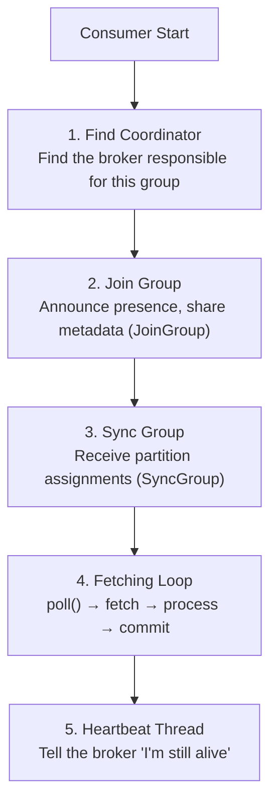
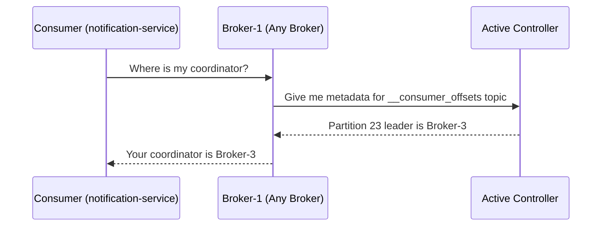
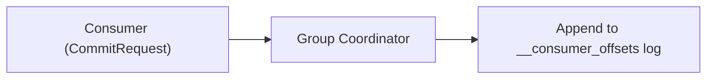

# Kafka — Chapter 9: Consumer Internals & Group Coordination

> How a consumer joins a group, claims partitions, and keeps the data flowing reliably.

---

## Overview — The Consumer Lifecycle

While the producer is simple (serialize, buffer, send), the consumer is a complex state machine. A `consumer.poll()` call isn't just about fetching bytes; it's the heartbeat that keeps the entire consumer group healthy.

---

## Stage 1 — Finding the Coordinator (The Metadata Flow)

### Why
A consumer group needs a "referee" (Coordinator) to manage memberships and store offsets. Kafka distributes this responsibility across brokers to avoid a single point of failure.

### The Metadata Discovery Flow
Before a consumer can join a group, it must find which broker is its coordinator.

### The Hashing Formula
Kafka determines the coordinator by hashing the `group.id`:
1. The internal topic `__consumer_offsets` has **50 partitions** (default).
2. `partition = abs(hash("notification-service")) % 50`
3. **Example**: `hash("notification-service") % 50 = 23`.
4. The **Leader of Partition 23** is the designated **Group Coordinator** for this group.

---

## Detailed Step-by-Step Flow Example

Following the journey of a consumer in the `notification-service` group:

### Step 1: Initialization
Consumer starts. It needs to join the `notification-service` group to consume `order-events`.

### Step 2: Discovery
It finds the coordinator using the formula above. It discovers that **Broker-3** is the leader for `__consumer_offsets` partition 23.

### Step 3: Metadata Request
The consumer requests metadata for the target topic (`order-events`). It learns that **Partition-2** of `order-events` is led by **Broker-X**.

### Step 4: Joining the Group
Consumer sends a `JoinGroup` request to **Broker-3** (Coordinator). Broker-3 waits for other members to join, performs the assignment, and **waits for the assignment update to replicate to its ISR followers** in the `__consumer_offsets` topic. Once replicated, it responds: **"You are assigned Partition-2"**.

### Step 5: Fetching the Last Offset
Before fetching data, the consumer needs to know where it left off.

> **⚠️ Common Misconception:** The target topic's Partition Leader (e.g., Broker-X) does **not** store your offsets! Only the **Group Coordinator** (e.g., Broker-3) stores and reads bookmarks from the `__consumer_offsets` topic.

- **Request**: Consumer asks **Broker-3 (Group Coordinator)**, *"What is the last committed offset for `notification-service` on `order-events` Partition-2?"*
- **Response**: Broker-3 reads from its `__consumer_offsets` partition and returns **"Offset 100"**.

### Step 6: Fetching Data
Now the consumer knows it needs to read starting from **101**.
- **Request**: Consumer sends a `FetchRequest` to **Broker-X (the Partition Leader of `order-events` Partition-2)**.
- **Details**: *"Give me messages starting from offset 101, max 200KB."*
- **Response**: Broker-X uses its local sparse index (`.index` file) on its hard drive to quickly find the byte location of offset 101, reads the raw message log (`.log` file), and streams events **101 to 501** back to the consumer.

---

## Stage 2 — The Rebalance Protocol (JoinGroup & SyncGroup)

When a consumer joins, leaves, or partitions change, the group must **rebalance**.

### Step A: JoinGroup (The Membership Phase)
1. Every consumer in the group sends a `JoinGroup` request to the Coordinator.
2. The Coordinator waits for `rebalance.timeout.ms` to collect all members.
3. The Coordinator picks one consumer to be the **Leader** (usually the first one that joined).
4. The Coordinator sends a response back to everyone. The Leader's response includes a list of all members; other members get an empty list.

### Step B: SyncGroup (The Assignment Phase)
1. **The Leader** runs the assignment logic locally (e.g., `RangeAssignor`, `StickyAssignor`). It decides who gets which partition.
2. Every consumer (including the leader) sends a `SyncGroup` request. The Leader includes the calculated assignments in its request; others send empty requests.
3. The Coordinator receives the leader's plan and propagates the specific assignment to each consumer in the `SyncGroup` response.

**Key Insight:** The Broker (Coordinator) does NOT decide partition assignments. It only facilitates the communication. The *Consumer Leader* decides. This allows you to upgrade assignment logic by just updating your app code, without changing the broker.

> **Caveat:** This describes the *classic* client-side model (consumer-leader-driven assignment) used by the existing consumer protocol. The new consumer group protocol introduced in **KIP-848** (Kafka 3.7+ preview, GA in 4.x) moves assignment to the **broker (coordinator) side**, removing the consumer-leader role and eager stop-the-world rebalances.

---

## Stage 3 — The poll() Loop & Fetcher

Once the consumer knows its partitions, it starts the main loop.

### How it works
1. **The Fetcher**: A background component that prepares `FetchRequests`. It keeps a local buffer of records so that `poll()` can return data instantly.
2. **Subscription State**: Tracks the current offsets for each assigned partition.
3. **The poll() call**:
   - Checks if there are records in the local Fetcher buffer.
   - If yes → returns them immediately.
   - If no → sends FetchRequests to the partition leaders, waits up to `Duration timeout`.
   - **Critical**: `poll()` also handles heartbeats and rebalance signals. If you don't call `poll()`, the broker thinks you're dead.

### Key Fetch Configs
| Config | Default | Effect |
|--------|---------|--------|
| `fetch.min.bytes` | 1 | Wait until X bytes are ready before responding. Higher = better throughput, more latency. |
| `fetch.max.wait.ms` | 500 | Max time the broker waits if `fetch.min.bytes` isn't met. |
| `max.partition.fetch.bytes` | 1 MB | Max data returned per partition per request. |
| `max.poll.records` | 500 | Max records returned in a single `poll()` call. |

---

## Stage 4 — Offset Management

Kafka tracks where you are in a stream using **offsets** stored in the `__consumer_offsets` topic.

### 1. Automatic Commit (`enable.auto.commit=true`)
The consumer commits the highest offset returned by the previous `poll()` every `auto.commit.interval.ms` (default 5s).
- **Pros**: Easy to use.
- **Cons**: Risk of **At-Least-Once** delivery. If your app crashes after processing but before the 5s timer hits, you will re-process those records on restart.

### 2. Manual Commit
- `commitSync()`: Blocks until the broker ACKs. Reliable but slow (adds latency to your loop).
- `commitAsync()`: Sends the commit and moves on. High performance, but if it fails, you won't know unless you use a callback.

### 3. The Commit Flow

Offsets are just messages! Compaction ensures only the latest offset per `group + topic + partition` is kept.

---

## Stage 5 — Keeping the Group Alive

How does the broker know a consumer hasn't crashed?

1. **Heartbeat Thread**: A background thread sends "pings" to the coordinator every `heartbeat.interval.ms` (default 3s).
2. **Session Timeout**: If the coordinator doesn't hear a heartbeat for `session.timeout.ms` (default 45s), it kicks the consumer out and triggers a rebalance.
3. **Max Poll Interval**: If your processing logic is too slow and you don't call `poll()` within `max.poll.interval.ms` (default 5 min), the consumer proactively leaves the group. This prevents "livelock" where a consumer is heartbeating but not actually processing data.

---

## Modern Improvements: Static Membership & Incremental Rebalances

### Static Membership (`group.instance.id`)
In Kubernetes/Cloud environments, pods restart frequently. Usually, a restart triggers two rebalances (one on leave, one on join). 
By setting a `group.instance.id`, the coordinator "remembers" the member. If it comes back within the session timeout, it gets its old partitions back **without a group rebalance**.

### Cooperative Sticky Assignor
Legacy rebalances are "Stop-the-World" (Eager). Everyone gives up partitions, waits for new ones, then resumes.
The `CooperativeStickyAssignor` allows consumers to **keep** their current partitions during a rebalance if they aren't being moved. Only the partitions that actually need to move are paused.

---

## Interview Angles

**Q: What is the Group Coordinator and how is it chosen?**
A: The Group Coordinator is a broker responsible for managing a consumer group's state. It is chosen by hashing the `group.id` and finding the leader of the corresponding partition in the internal `__consumer_offsets` topic.

**Q: Who decides which consumer gets which partition?**
A: The **Consumer Leader**, not the broker. The first consumer to join the group is designated the leader. It receives the list of all members from the coordinator, runs the assignment algorithm (like Range or Sticky), and sends the plan back to the coordinator to distribute.

**Q: Explain the difference between `session.timeout.ms` and `max.poll.interval.ms`.**
A: `session.timeout.ms` is the deadline for the background heartbeat thread. If the heartbeat fails, it usually means a network issue or a hard crash. `max.poll.interval.ms` is the deadline for the main application thread to call `poll()`. If this expires, it means the processing logic is too slow or stuck, and the consumer will gracefully leave the group to let others take over.

**Q: Why is `__consumer_offsets` a compacted topic?**
A: Because we only care about the *latest* committed offset for any given partition. Old commits are redundant. Compaction keeps the topic size small while preserving the current state of every consumer group.

**Q: What is a "Stop-the-World" rebalance?**
A: It's the eager rebalance protocol where all consumers in a group stop fetching data and give up their partition ownership before a new assignment is agreed upon. This causes a "lag spike" during the rebalance. Incremental (Cooperative) rebalancing fixes this by only pausing the specific partitions being moved.

**Q: What happens if a consumer crashes and `enable.auto.commit` is true?**
A: You likely get **at-least-once** delivery. Since offsets are committed periodically (e.g., every 5s), if the consumer crashes 4 seconds after the last commit, it will have processed 4 seconds of data that the broker doesn't know about. On restart, it will resume from the last successful commit and re-process that data.
