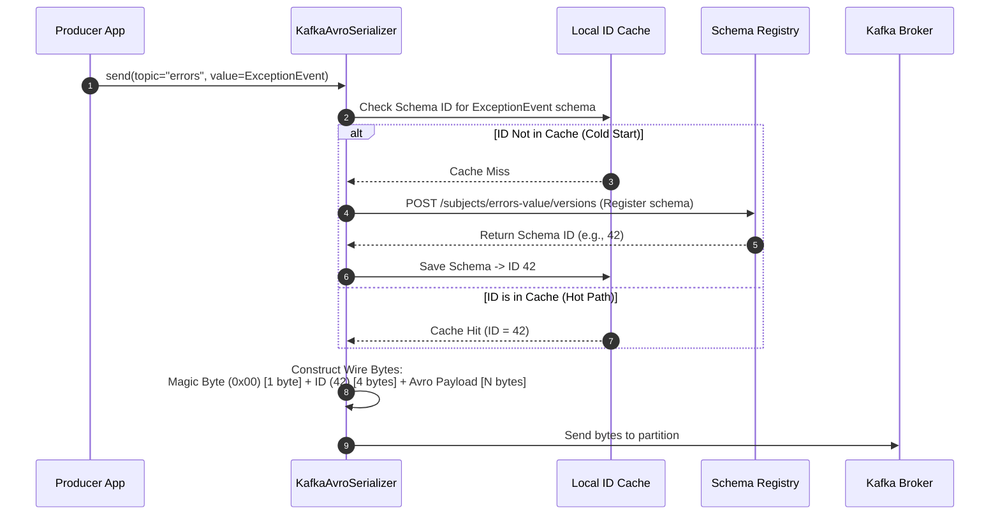
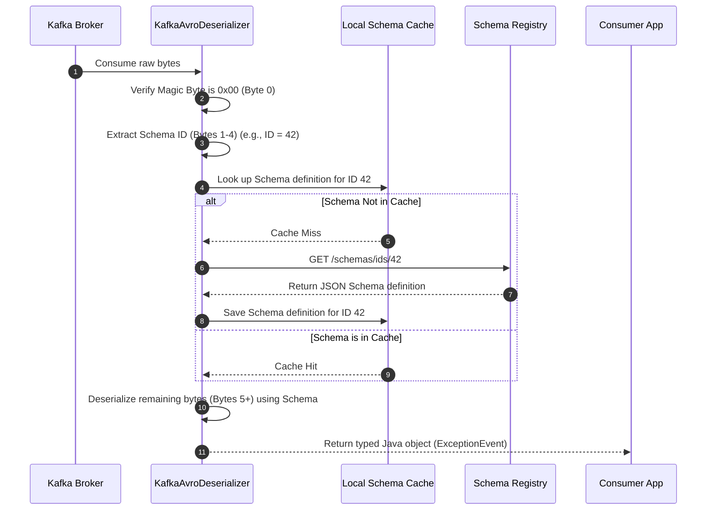
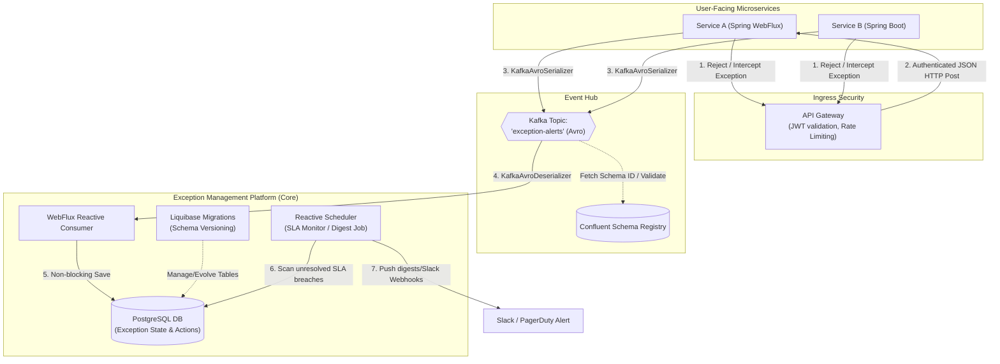

# Kafka Avro & Schema Registry — Complete "Noob-to-Pro" Guide & Project Integration

> **Resume Line:** *"Authored the Technical Design & Integration Guide for a new Proactive Exception Management platform using Spring Boot, WebFlux, Kafka Avro events, Liquibase migrations, JWT-secured APIs, and reactive scheduling for event-driven backend services."*

---

## Table of Contents

1. [The "Noob" Problem — Kafka & Avro WITHOUT Schema Registry](#1-the-noob-problem--kafka--avro-without-schema-registry)
2. [What Is a Schema and Schema Registry? (08:04)](#2-what-is-a-schema-and-schema-registry-0804)
3. [Download Schema Registry & Run (12:38 & 16:22)](#3-download-schema-registry--run-1238--1622)
4. [Producer Flow with Schema Registry & Avro Serializer (18:34 & 36:43)](#4-producer-flow-with-schema-registry--avro-serializer-1834--3643)
5. [Consumer Flow with Schema Registry & Avro Deserializer (55:05 & 01:06:19)](#5-consumer-flow-with-schema-registry--avro-deserializer-5505--010619)
6. [Compatibility Checks: Backward vs. Forward (01:08:33)](#6-compatibility-checks-backward-vs-forward-010833)
7. [Project Case Study: Proactive Exception Management Platform](#7-project-case-study-proactive-exception-management-platform)
8. [Under the Hood: Tech Stack Integration (WebFlux, Liquibase, JWT, Scheduling)](#8-under-the-hood-tech-stack-integration-webflux-liquibase-jwt-scheduling)
9. [Interview Q&A (Grill Prep)](#9-interview-qa-grill-prep)

---

## 1. The "Noob" Problem — Kafka & Avro WITHOUT Schema Registry

To understand why Schema Registry exists, you must first understand the pain of using Avro without it.

### How Kafka Stores Data
Kafka is **dumb** when it comes to data types. It doesn't know what Java, Python, or JSON is. Kafka brokers store and transmit **raw bytes (`byte[]`)** for both keys and values.

```
[Producer] ──(Java Object: Order)──► [Serializer] ──(byte[])──► [Kafka Broker]
```

### What is Avro?
Apache Avro is a data serialization system. It is:
1. **Binary-only**: Data is serialized into a highly compressed binary format (no space wasted on formatting like `{}` or `[]`).
2. **Schema-driven**: Every write and read operation requires a **schema** (a JSON file describing the fields and their types, e.g., `Order.avsc`).

### The Crisis of Avro WITHOUT Schema Registry
If you use Avro to serialize an object and send it to Kafka without a registry, you encounter three massive bottlenecks:

#### Problem 1: Payload Bloat (The Schema must travel with the data)
In order for a consumer to deserialize Avro binary bytes back into an object, it **must** have the exact schema that was used to write it. If you don't have a centralized registry, you are forced to attach the **entire JSON schema** (which can easily be 2KB to 10KB) to the front of **every single message** (which might only contain 100 bytes of actual data). 
* *Result:* Your network bandwidth and disk space usage skyrocket, making Avro *less* efficient than raw JSON!

#### Problem 2: Hard Code-Coupling
Without a registry, the producer and consumer must share the exact same generated Java class files (compiled from the same `.avsc` file). If the producer changes a field (e.g., adding an optional `middleName`), the consumer's code will instantly crash with deserialization errors because it has no way to map the new binary layout.

---

## 2. What Is a Schema and Schema Registry? (08:04)

### The Schema (The Contract)
A schema defines the structure of your data. Here is a simple Avro schema definition (`ExceptionEvent.avsc`):

```json
{
  "type": "record",
  "name": "ExceptionEvent",
  "namespace": "com.example.exception.avro",
  "fields": [
    { "name": "exceptionId", "type": "string" },
    { "name": "serviceName", "type": "string" },
    { "name": "errorMessage", "type": "string" },
    { "name": "occurredAt", "type": "long" }
  ]
}
```

### The Schema Registry (The Central Contract Manager)
The **Schema Registry** is a separate, lightweight HTTP service that runs alongside your Kafka cluster. 

It solves the "Crisis of Avro without Schema Registry" through three core principles:
1. **Stores Schemas Centrally**: Producers upload their schemas to the registry. The registry assigns each schema a unique **4-byte Schema ID** (integer).
2. **Keeps Messages Tiny**: Instead of prepending the entire schema, the producer only prepends the **4-byte Schema ID** to the binary payload.
3. **Enforces Compatibility Rules**: It ensures that a producer cannot publish a schema change that would break existing consumers.

```
[Producer] ──(Registers Schema)──► [Schema Registry (ID = 101)]
     │
     └─(Sends Magic Byte '0' + ID '101' + Compact Bytes)─► [Kafka Broker]
                                                                │
[Consumer] ◄─(Reads ID '101', fetches Schema if not cached)─────┘
```

---

## 3. Download Schema Registry & Run (12:38 & 16:22)

To run Confluent Schema Registry locally, the easiest approach is using **Docker Compose**.

### The `docker-compose.yml`
Create a file named `docker-compose.yml` to spin up a KRaft-based Kafka broker and Confluent Schema Registry:

```yaml
version: '3.8'
services:
  # 1. Kafka Broker (using KRaft mode - no Zookeeper required)
  kafka:
    image: confluentinc/cp-kafka:7.5.0
    container_name: kafka-local
    ports:
      - "9092:9092"
    environment:
      KAFKA_NODE_ID: 1
      KAFKA_LISTENER_SECURITY_PROTOCOL_MAP: 'CONTROLLER:PLAINTEXT,PLAINTEXT:PLAINTEXT,PLAINTEXT_HOST:PLAINTEXT'
      KAFKA_ADVERTISED_LISTENERS: 'PLAINTEXT://kafka:29092,PLAINTEXT_HOST://localhost:9092'
      KAFKA_OFFSETS_TOPIC_REPLICATION_FACTOR: 1
      KAFKA_GROUP_INITIAL_REBALANCE_DELAY_MS: 0
      KAFKA_TRANSACTION_STATE_LOG_MIN_ISR: 1
      KAFKA_TRANSACTION_STATE_LOG_REREPLICATION_FACTOR: 1
      KAFKA_PROCESS_ROLES: 'broker,controller'
      KAFKA_CONTROLLER_QUORUM_VOTERS: '1@kafka:29093'
      KAFKA_LISTENERS: 'PLAINTEXT://0.0.0.0:29092,CONTROLLER://0.0.0.0:29093,PLAINTEXT_HOST://0.0.0.0:9092'
      KAFKA_INTER_BROKER_LISTENER_NAME: 'PLAINTEXT'
      KAFKA_CONTROLLER_LISTENER_NAMES: 'CONTROLLER'
      KAFKA_LOG_DIRS: '/tmp/kraft-combined-logs'
      CLUSTER_ID: 'MkU3OEVBNTcwNTJENDM2Qk'

  # 2. Confluent Schema Registry
  schema-registry:
    image: confluentinc/cp-schema-registry:7.5.0
    container_name: schema-registry-local
    depends_on:
      - kafka
    ports:
      - "8081:8081"
    environment:
      SCHEMA_REGISTRY_HOST_NAME: schema-registry
      SCHEMA_REGISTRY_KAFKASTORE_BOOTSTRAP_SERVERS: 'PLAINTEXT://kafka:29092'
      SCHEMA_REGISTRY_LISTENERS: 'http://0.0.0.0:8081'
```

### Commands to Run & Verify

1. **Start the containers:**
   ```bash
   docker compose up -d
   ```
2. **Verify Schema Registry is running (returns registered subjects - initially empty `[]`):**
   ```bash
   curl http://localhost:8081/subjects
   ```
3. **Check Global Compatibility Mode (defaults to `BACKWARD`):**
   ```bash
   curl http://localhost:8081/config
   # Returns: {"compatibilityLevel":"BACKWARD"}
   ```

---

## 4. Producer Flow with Schema Registry & Avro Serializer (18:34 & 36:43)

### The Write Path (Step-by-Step)



### The 5-Byte Wire Format (Crucial Interview Detail)
When `KafkaAvroSerializer` serializes your Java object, it constructs the byte payload using a specific prefix layout:

| Byte Offset | Size | Value/Meaning |
|-------------|------|---------------|
| **Byte 0** | 1 byte | **Magic Byte (`0x00`)** - Tells the deserializer this is Confluent Avro wire format. |
| **Bytes 1–4** | 4 bytes | **Schema ID (big-endian Integer)** - Unique ID of the schema in Schema Registry. |
| **Bytes 5+** | N bytes | **Actual Avro binary payload** - The serialized data fields. |

### Producer Code Configuration (Spring Boot)

```java
@Configuration
public class KafkaProducerConfig {

    @Bean
    public ProducerFactory<String, ExceptionEvent> producerFactory() {
        Map<String, Object> config = new HashMap<>();
        config.put(ProducerConfig.BOOTSTRAP_SERVERS_CONFIG, "localhost:9092");
        
        // Key is serialized as a plain string
        config.put(ProducerConfig.KEY_SERIALIZER_CLASS_CONFIG, StringSerializer.class);
        
        // Value is serialized using the Confluent Avro Serializer
        config.put(ProducerConfig.VALUE_SERIALIZER_CLASS_CONFIG, KafkaAvroSerializer.class);
        
        // MANDATORY: URL to find the Schema Registry
        config.put("schema.registry.url", "http://localhost:8081");
        
        // OPTIONAL: Automatically registers schema if not present
        config.put("auto.register.schemas", "true");

        return new DefaultKafkaProducerFactory<>(config);
    }

    @Bean
    public KafkaTemplate<String, ExceptionEvent> kafkaTemplate() {
        return new KafkaTemplate<>(producerFactory());
    }
}
```

---

## 5. Consumer Flow with Schema Registry & Avro Deserializer (55:05 & 01:06:19)

### The Read Path (Step-by-Step)



### Consumer Code Configuration (Spring Boot)

```java
@Configuration
@EnableKafka
public class KafkaConsumerConfig {

    @Bean
    public ConsumerFactory<String, ExceptionEvent> consumerFactory() {
        Map<String, Object> config = new HashMap<>();
        config.put(ConsumerConfig.BOOTSTRAP_SERVERS_CONFIG, "localhost:9092");
        config.put(ConsumerConfig.GROUP_ID_CONFIG, "exception-processor-group");
        
        config.put(ConsumerConfig.KEY_DESERIALIZER_CLASS_CONFIG, StringDeserializer.class);
        config.put(ConsumerConfig.VALUE_DESERIALIZER_CLASS_CONFIG, KafkaAvroDeserializer.class);
        
        // MANDATORY configs
        config.put("schema.registry.url", "http://localhost:8081");
        
        // CRITICAL: Tells Avro to build a specific class (SpecificRecord) instead of GenericRecord
        config.put(KafkaAvroDeserializerConfig.SPECIFIC_AVRO_READER_CONFIG, "true");

        return new DefaultKafkaConsumerFactory<>(config);
    }

    @Bean
    public ConcurrentKafkaListenerContainerFactory<String, ExceptionEvent> kafkaListenerContainerFactory() {
        ConcurrentKafkaListenerContainerFactory<String, ExceptionEvent> factory = 
            new ConcurrentKafkaListenerContainerFactory<>();
        factory.setConsumerFactory(consumerFactory());
        return factory;
    }
}
```

---

## 6. Compatibility Checks: Backward vs. Forward (01:08:33)

When upgrading services, you will inevitably change your data models. Schema Registry ensures upgrades do not crash your pipeline by validating schemas against compatibility rules.

### Compatibility Modes

| Mode | Upgrading Strategy | Rules | Allowed Changes |
|------|--------------------|-------|-----------------|
| **BACKWARD** *(Default)* | **Consumers first** | New schema can read data written with old schemas. | • Delete fields<br>• Add optional fields (with defaults) |
| **FORWARD** | **Producers first** | Old schema can read data written with new schemas. | • Add fields<br>• Delete optional fields (must have defaults) |
| **FULL** | **Any order** | Backward + Forward compatibility. | • Add optional fields (with defaults)<br>• Delete optional fields (with defaults) |
| **NONE** | **Lock-step** | No checks enforced. | Anything. |

### How to Change Compatibility via REST API
To change the compatibility level for a topic's value schema (e.g., `exception-alerts-value`):

```bash
curl -X PUT -H "Content-Type: application/json" \
  --data '{"compatibility": "FORWARD"}' \
  http://localhost:8081/config/exception-alerts-value
```

---

## 7. Project Case Study: Proactive Exception Management Platform

Let's ground these concepts in your resume project: **The Proactive Exception Management Platform**.

### Platform Overview & Architectural Flow
Instead of waiting for customers to report errors or support teams to search raw text logs, you designed a platform that proactively catches microservice exceptions, categorizes them, handles alerts, and runs reactive cleanups.



### The Avro Schema Contract: `ExceptionAlertEvent.avsc`
To ensure all microservices publish structured exception reports without breaking changes, you authored this schema contract:

```json
{
  "type": "record",
  "name": "ExceptionAlertEvent",
  "namespace": "com.example.exception.avro",
  "fields": [
    { "name": "eventId", "type": "string", "doc": "UUID representation of this exception instance" },
    { "name": "serviceName", "type": "string", "doc": "Name of microservice throwing error" },
    { "name": "environment", "type": "string", "doc": "dev, staging, production" },
    { "name": "exceptionClass", "type": "string", "doc": "Fully qualified Java exception class (e.g. NullPointerException)" },
    { "name": "errorMessage", "type": "string" },
    { "name": "stackTrace", "type": "string" },
    { "name": "severity", "type": {
        "type": "enum",
        "name": "SeverityLevel",
        "symbols": ["LOW", "MEDIUM", "HIGH", "CRITICAL"]
      }
    },
    { "name": "occurredAt", "type": "long", "doc": "Epoch millisecond timestamp" },
    { "name": "contextMetadata", "type": {
        "type": "map",
        "values": "string"
      },
      "default": {},
      "doc": "Key-value baggage for context (e.g. tenantId, userId, tracingId)"
    }
  ]
}
```

---

## 8. Under the Hood: Tech Stack Integration (WebFlux, Liquibase, JWT, Scheduling)

Here is how the distinct pieces of your platform work together seamlessly.

### 1. Spring WebFlux (Reactive Execution Engine)
* **High-Throughput Ingestion:** The platform exposes an HTTP endpoint for systems that can't use Kafka. By using WebFlux (built on Netty's event loop), the ingestion endpoint accepts incoming exception reports reactively without spawning a thread per request.
* **Server-Sent Events (SSE) Alert Dashboard:** The UI subscribes to real-time notification streams. WebFlux exposes a `GET /api/v1/exceptions/stream` endpoint returning `Flux<ServerSentEvent<ExceptionAlertEvent>>` so active alerts pop up in real-time.

### 2. Liquibase Migrations (Database Versioning)
Because the platform tracks resolving statuses (e.g., `UNASSIGNED` -> `UNDER_INVESTIGATION` -> `RESOLVED`), you use PostgreSQL to maintain current state.
* **Why Liquibase?** Instead of writing raw SQL scripts, you managed the database schema changes (creating the `exception_records` table, adding indices on `serviceName` and `severity`) using Liquibase changeSets. This ensures standard, repeatable migrations across local developer, staging, and production databases.

### 3. JWT-Secured APIs
* **Machine-to-Machine JWT:** Microservices publishing exceptions to the ingestion HTTP endpoint must pass a signed JWT token representing their service credentials, validated using an API Gateway filter.
* **User/Role JWT:** The management portal APIs (e.g., assigning a ticket, marking as resolved) require a user token. The platform extracts the user's role (e.g., `ROLE_SUPPORT`) and tenant ID (`tenantId`) from the JWT context reactively using `ReactiveSecurityContextHolder` to enforce Multi-Tenant isolation.

### 4. Reactive Scheduling
Instead of standard blocking scheduling (`@Scheduled` which uses a pool of blocking threads), you used Reactor's non-blocking scheduler:
* **SLA Breach Monitoring:** A reactive cron job runs periodically, executing non-blocking database queries to check for unresolved CRITICAL exceptions that have exceeded the 15-minute SLA.
* **Code Example:**
  ```java
  @Component
  public class SLAAlertScheduler {
      private final ExceptionRepository repository;
      private final SlackAlertService slackService;

      public SLAAlertScheduler(ExceptionRepository repository, SlackAlertService slackService) {
          this.repository = repository;
          this.slackService = slackService;
      }

      @PostConstruct
      public void startReactiveScheduling() {
          // Reactively polls database for high-severity breaches every 1 minute
          Flux.interval(Duration.ofMinutes(1))
              .flatMap(tick -> repository.findUnresolvedCriticalBreachingSLA(Instant.now().minus(15, ChronoUnit.MINUTES)))
              .flatMap(breachRecord -> slackService.sendSLAAlert(breachRecord)
                  .onErrorResume(ex -> Mono.empty())) // Gracefully handle network failures
              .subscribeOn(Schedulers.boundedElastic())
              .subscribe();
      }
  }
  ```

---

## 9. Interview Q&A (Grill Prep)

### Q1: "Explain how you designed the Exception Management platform to handle high volume without losing data."
**Answer:** *"We took a dual ingestion approach. The primary ingestion pipeline is purely event-driven using Apache Kafka with Avro. Microservices use standard Kafka interceptors or logs appenders to publish error events to our `exception-alerts` Kafka topic. Because Kafka persists the event log, the platform can go offline (for deployment or DB maintenance) and catch up without losing a single exception. For non-Kafka services, we exposed a Spring WebFlux API. WebFlux uses Netty's reactive event loops, allowing us to ingest thousands of concurrent alerts with a tiny thread footprint. These alerts are pushed to the same Kafka topic, unifying our ingestion."*

### Q2: "Why did you choose Avro over JSON for the exception events?"
**Answer:** *"Three core reasons. First: **Schema Contract Governance**. We had dozens of microservices emitting exceptions. If any team changed their error formats, it would crash our parser. Avro schemas enforced compatibility at the Schema Registry level. Second: **Data Size**. Exceptions can contain massive stack traces. Avro compresses data into binary format, reducing our network and disk overhead by over 50% compared to verbose JSON strings. Third: **Compatibility**. The Schema Registry allowed us to evolutionize schemas—for example, adding new contextual metadata fields—without forcing us to upgrade all consumers and producers in lock-step."*

### Q3: "What happens under the hood when your producer sends an Avro record?"
**Answer:** *"Our producer uses the `KafkaAvroSerializer`. When a message is sent, the serializer first checks its local JVM cache to see if it has registered the schema for that topic. If not, it registers it with the Confluent Schema Registry (or fetches the ID if it already exists). The registry returns a unique 4-byte Schema ID. The serializer then builds the byte array: byte 0 is set to the magic byte `0x00`, bytes 1-4 contain the 4-byte Schema ID, and the remaining bytes contain the actual Avro binary payload. The broker only receives this compact, ID-prefixed byte array."*

### Q4: "How does the consumer know how to parse the message if the schema isn't sent with it?"
**Answer:** *"The consumer uses `KafkaAvroDeserializer`. When it reads the bytes from the Kafka partition, it inspects the first 5 bytes. First, it validates the magic byte `0x00`, confirming it is a Confluent Avro record. It then reads bytes 1-4 as an integer to extract the Schema ID (e.g., ID 42). The deserializer looks up ID 42 in its local cache. If it is a cache miss, it makes a quick HTTP REST call to the Schema Registry (`GET /schemas/ids/42`) to retrieve the JSON schema definition, and caches it. The deserializer then uses this schema to decode the remaining bytes of the payload into our Java class."*

### Q5: "What compatibility level did you choose for the Exception platform, and why?"
**Answer:** *"We chose the default **BACKWARD** compatibility. This means that if we evolve the schema—such as deleting an obsolete tracking field or adding a new field that has a default value—new versions of our Exception Platform code (the consumer) can still read older exception records produced by microservices that haven't been redeployed yet. It allows us to upgrade our central platform first, and let the upstream services upgrade at their own pace."*

### Q6: "How did you manage database schema changes in this reactive architecture?"
**Answer:** *"We used **Liquibase** migrations. Because we were storing exception events and ticket resolution logs in a PostgreSQL database, managing version control of the database schema was vital. All changes—like adding columns, modifying constraints, or creating indexes—were declared in Liquibase YAML changelog files. During deployment, the application executes these migrations before startup, ensuring the database state matches our code's expected schema. It prevents database mismatch issues across our multi-environment pipeline."*

### Q7: "Why reactive scheduling instead of standard `@Scheduled`?"
**Answer:** *"In Spring WebFlux, the application runs on a fixed number of CPU-bound event-loop threads (usually equal to the number of CPU cores). If we use Spring's default `@Scheduled` scheduler, it runs tasks using a thread pool. If we execute blocking actions inside the scheduled task (like waiting for database calls or sending emails), it blocks Netty's event loop, starving the API endpoints. By using Reactor's reactive scheduling (`Flux.interval`), the scheduler runs asynchronously and non-blockingly. Database queries return reactive streams (`Mono` or `Flux`) and Netty delegates thread assignments dynamically, allowing our SLA breach scans to run safely alongside high-throughput API traffic."*
