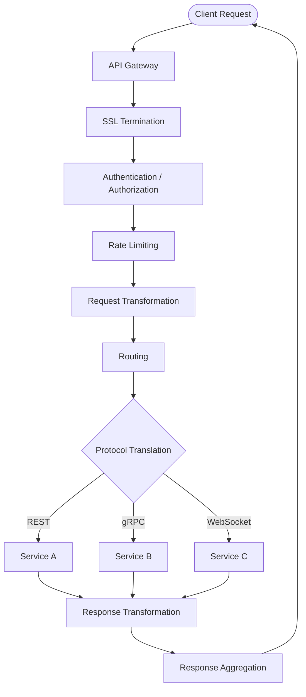
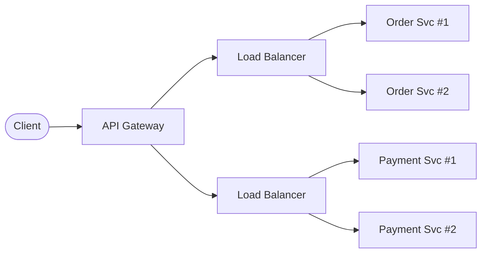
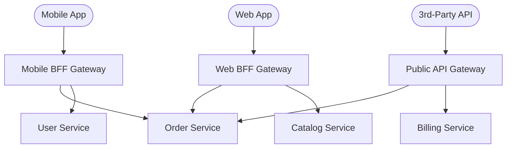

# API Gateway (HLD)

## Quick Summary (TL;DR)

- An API Gateway is the **single entry point** for all client requests into a microservices backend, handling cross-cutting concerns like auth, rate limiting, and routing.
- It **decouples clients from internal service topology** -- clients never need to know how many services exist or where they live.
- Gateways are **not load balancers** -- a load balancer distributes traffic; a gateway handles request-level intelligence. In practice, you use both together.
- The **BFF (Backend for Frontend)** pattern deploys separate gateway instances tailored to each client type (mobile, web, third-party).
- A gateway is a **single point of failure** by design -- you must make it highly available through redundancy, circuit breakers, and graceful degradation.

---

## Real-World Analogy

Think of an API Gateway as a **hotel concierge**. Guests (clients) don't wander the hotel asking the kitchen for breakfast, housekeeping for towels, and the valet for their car. Instead, they go to the concierge (gateway), who:

1. **Verifies identity** -- "Are you a guest here?" (authentication)
2. **Checks permissions** -- "Is room service included in your plan?" (authorization)
3. **Routes the request** -- Calls the kitchen, housekeeping, or valet on your behalf (routing)
4. **Aggregates responses** -- Brings you breakfast AND your car keys in one trip (request aggregation)
5. **Controls pace** -- "Sir, you've already called five times this hour" (rate limiting)

Without a concierge, every guest would need to know the hotel's internal layout -- which is exactly the mess you get without an API Gateway.

---

## What and Why

In a monolith, the client talks to one server. In microservices, there could be 50+ services. Without a gateway, every client must:

- Know the address of every service
- Handle authentication with each service independently
- Deal with different protocols (REST, gRPC, WebSocket)
- Implement retry logic, timeouts, and error handling per service

The API Gateway solves this by providing a **unified facade** that absorbs all cross-cutting concerns.

---

## Core Responsibilities



| Responsibility | What It Does |
|---|---|
| **Routing** | Maps `/api/orders/123` to the Order Service based on path, headers, or query params |
| **Authentication/Authorization** | Validates JWT tokens, API keys, OAuth scopes before the request ever hits a service |
| **Rate Limiting** | Throttles abusive clients (per-user, per-IP, per-API-key) |
| **Request/Response Transformation** | Renames fields, strips internal headers, adds correlation IDs |
| **Protocol Translation** | Accepts REST from the client, forwards as gRPC to internal services |
| **SSL Termination** | Handles TLS at the edge so internal traffic can be plain HTTP (within a trusted network) |
| **Request Aggregation** | Fans out one client call to multiple services, merges results into a single response |
| **Caching** | Caches frequent read-only responses to reduce backend load |
| **Logging and Observability** | Centralized access logs, distributed trace propagation, metrics emission |

---

## API Gateway vs Load Balancer

This is one of the most commonly confused comparisons.

| Dimension | Load Balancer | API Gateway |
|---|---|---|
| **Layer** | L4 (TCP/UDP) or L7 (HTTP) | L7 (HTTP/Application) |
| **Primary Job** | Distribute traffic across instances | Handle cross-cutting request logic |
| **Auth** | No | Yes |
| **Rate Limiting** | Basic (connection-level) | Advanced (per-user, per-key) |
| **Request Transformation** | No | Yes |
| **Protocol Translation** | No | Yes (REST to gRPC, etc.) |
| **Service Awareness** | Knows about instances | Knows about services and APIs |
| **Typical Placement** | In front of a service cluster | In front of all services |

**In production, you use both**: Client hits the API Gateway, which routes to a Load Balancer in front of each service cluster.



---

## API Gateway vs Reverse Proxy

| Dimension | Reverse Proxy | API Gateway |
|---|---|---|
| **Core Function** | Forwards requests, hides origin servers | Full request lifecycle management |
| **Auth / Rate Limiting** | Not built-in (plugins possible) | First-class feature |
| **Request Aggregation** | No | Yes |
| **Protocol Translation** | Limited | Yes |
| **Examples** | Nginx, HAProxy | Kong, AWS API Gateway |

**Key insight**: An API Gateway IS a reverse proxy with extra capabilities. Every API Gateway acts as a reverse proxy, but not every reverse proxy is an API Gateway. Nginx can be configured to behave like a basic gateway, blurring the line further.

---

## Rate Limiting at the Gateway

Rate limiting protects backends from abuse and ensures fair resource usage. It belongs at the gateway because it is the earliest choke point.

### Common Algorithms

| Algorithm | How It Works | Pros | Cons |
|---|---|---|---|
| **Token Bucket** | Bucket fills at a fixed rate; each request consumes a token | Allows bursts, simple | Burst can still overwhelm |
| **Sliding Window Log** | Tracks timestamps of each request in a sliding time window | Precise | Memory-heavy at scale |
| **Sliding Window Counter** | Hybrid: splits time into slots, interpolates across boundary | Memory-efficient, accurate enough | Slight approximation |
| **Fixed Window Counter** | Counts requests in fixed time intervals (e.g., per minute) | Simplest | Boundary burst problem (2x spike at window edges) |

### Rate Limit Dimensions

- **Per-user**: Authenticated users get individual quotas
- **Per-IP**: Catches unauthenticated abuse
- **Per-API-key**: Different tiers (free = 100 req/min, premium = 10,000 req/min)

### HTTP 429 Response

When a client exceeds the limit, the gateway returns:

```
HTTP/1.1 429 Too Many Requests
Retry-After: 30
X-RateLimit-Limit: 100
X-RateLimit-Remaining: 0
X-RateLimit-Reset: 1717084800
```

Always include `Retry-After` so clients can back off intelligently.

---

## BFF Pattern (Backend for Frontend)

A single API Gateway serving mobile, web, and third-party clients inevitably becomes a bloated compromise. The **BFF pattern** deploys a dedicated gateway per client type.



### Why One-Size-Fits-All Fails

| Concern | Mobile | Web | Third-Party |
|---|---|---|---|
| **Payload size** | Minimal (bandwidth costs) | Can be richer | Strict contract |
| **Auth model** | OAuth + biometrics | Session cookies / JWT | API key + OAuth |
| **Aggregation needs** | Heavy (fewer round trips) | Moderate | Minimal |
| **Versioning pressure** | App store release cycles | Continuous deployment | Must not break |

Each BFF can independently evolve its response shapes, caching strategies, and rate limits without affecting other clients.

---

## Popular Implementations

| Tool | Type | Best For |
|---|---|---|
| **Kong** | Open-source / self-hosted | Plugin ecosystem, Lua extensibility |
| **AWS API Gateway** | Managed (serverless) | Lambda integration, pay-per-request |
| **Spring Cloud Gateway** | JVM / Spring ecosystem | Spring Boot shops, reactive (Netty) |
| **Zuul (Netflix)** | JVM (legacy) | Older Netflix stack, replaced by SCG |
| **Nginx** | Reverse proxy + gateway | Raw performance, config-driven |
| **Envoy** | Service mesh sidecar | L7 proxy, gRPC-native, Istio integration |
| **Traefik** | Cloud-native | Auto-discovery, Docker/K8s native |

**For interviews**: Know that Spring Cloud Gateway replaced Zuul, and that Envoy is the data plane behind Istio service meshes.

---

## Gateway as Single Point of Failure

By definition, if all traffic flows through the gateway and it goes down, everything goes down. Mitigations:

1. **Horizontal scaling**: Run multiple gateway instances behind a load balancer (yes, an LB in front of the gateway).
2. **Health checks**: LB actively probes gateway instances and removes unhealthy ones.
3. **Circuit breakers**: If a downstream service is failing, the gateway should fail fast (HTTP 503) instead of hanging and exhausting thread pools.
4. **Graceful degradation**: Serve cached responses or partial results when backends are unreachable.
5. **Regional redundancy**: Deploy gateways in multiple availability zones or regions.
6. **Keep gateways thin**: Business logic belongs in services, not the gateway. A fat gateway is a fragile gateway.

---

## Interview Angles

1. **"Design an API Gateway for an e-commerce platform."** -- Start with routing, add auth, rate limiting, then discuss BFF for mobile vs web.
2. **"How would you implement rate limiting?"** -- Pick token bucket, explain the algorithm, mention Redis for distributed counters, discuss per-user vs per-IP dimensions.
3. **"API Gateway vs Service Mesh (Istio/Envoy)?"** -- Gateway handles north-south traffic (client to cluster). Service mesh handles east-west traffic (service to service). They complement each other.
4. **"Where does SSL terminate?"** -- At the gateway for external traffic. Optionally mTLS between services for zero-trust.
5. **"How do you avoid the gateway becoming a bottleneck?"** -- Keep it stateless, horizontally scale, offload heavy transformations to services, use async I/O (e.g., Spring Cloud Gateway on Netty).
6. **"What happens if the gateway goes down?"** -- Explain LB in front of multiple gateway instances, health checks, and regional failover.

---

## Traps

- **Putting business logic in the gateway**: The gateway routes and protects. If you're writing `if (order.total > 500)` in the gateway, you've gone too far. That logic belongs in the Order Service.
- **Confusing gateway with load balancer in interviews**: They're complementary, not interchangeable. Always clarify the distinction.
- **Ignoring the gateway's own scalability**: Candidates design elaborate microservices but forget the gateway itself needs to scale. It's the funnel everything flows through.
- **Skipping rate limiting headers**: Just returning 429 without `Retry-After` or `X-RateLimit-*` headers is poor API design. Clients need to know when they can retry.
- **One gateway for all clients**: If the interviewer mentions mobile + web + third-party, bring up BFF proactively. It shows depth.
- **Forgetting about WebSocket/streaming**: Not all traffic is request-response. A good gateway must handle long-lived connections too.
