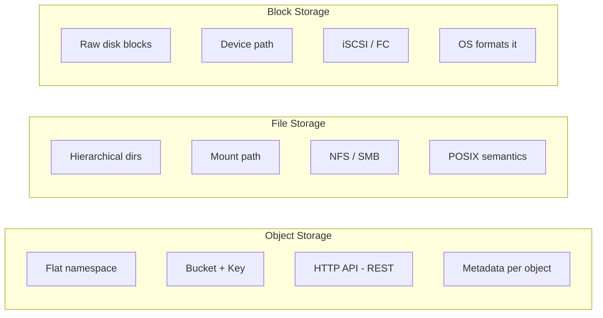
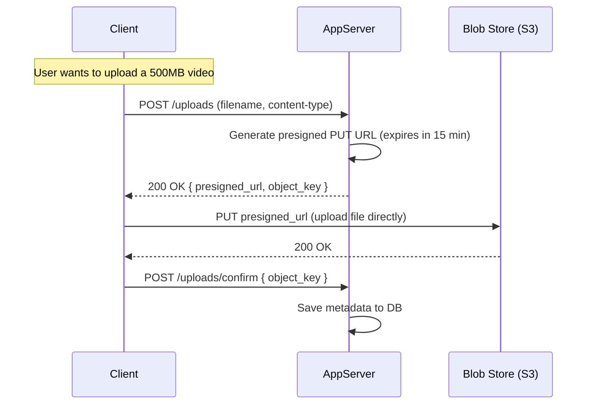
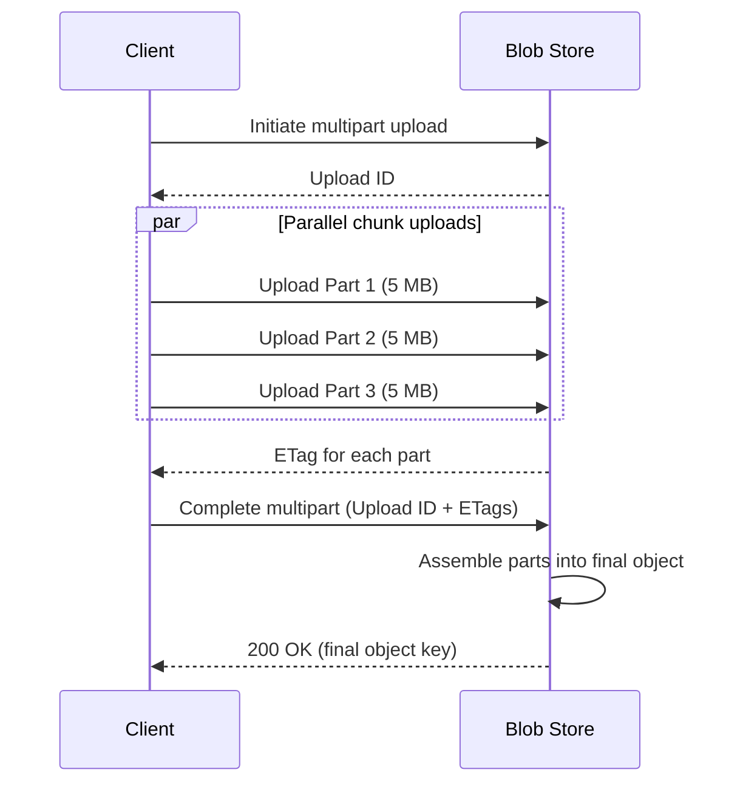

# Blob Storage (HLD)

---

## Quick Summary (TL;DR)

- **Blob = Binary Large Object** -- the go-to solution for storing unstructured data (images, videos, logs, backups) at scale.
- Object storage (S3-style) uses a **flat namespace** of buckets + keys -- no directories, no hierarchy, infinite scale.
- **Presigned URLs** let clients upload/download directly to storage, keeping large payloads off your application servers.
- **Multipart upload** splits large files into chunks for parallel transfer and resumable uploads.
- In interviews, **reference** blob storage as a building block; don't design it from scratch unless explicitly asked.

---

## Real-World Analogy

Think of blob storage as a **massive warehouse of numbered lockers**. You hand the warehouse a label (key), it gives you a locker. You don't care which shelf or aisle the locker is on -- you just need the label to retrieve your stuff. The warehouse handles replication, fire safety (durability), and can even move rarely-accessed items to a cheaper basement (storage tiers).

---

## What & Why

| Question | Answer |
|----------|--------|
| What is a blob? | Any chunk of binary data -- an image, a video, a PDF, a database backup. |
| Why not store in a relational DB? | DBs are optimized for structured, queryable rows. BLOBs bloat tables, kill query performance, complicate backups, and are expensive at scale. |
| Why not a regular filesystem? | Filesystems don't scale horizontally, lack built-in replication, and have no HTTP API for distributed access. |
| When to use blob storage? | File uploads, media assets, static content, ML training data, log archives, backups. |

---

## Object Storage vs File Storage vs Block Storage



| Dimension | Object (S3) | File (EFS/NFS) | Block (EBS) |
|-----------|-------------|----------------|-------------|
| **Namespace** | Flat (bucket/key) | Hierarchical (dirs) | None (raw blocks) |
| **Access** | HTTP REST API | Mount as filesystem | Attach to single VM |
| **Scalability** | Virtually infinite | Limited by server | Limited by volume size |
| **Latency** | Higher (HTTP overhead) | Medium | Lowest |
| **Use case** | Images, videos, backups | Shared home dirs, CMS | Databases, boot volumes |
| **Mutability** | Immutable (replace whole object) | Mutable (in-place edits) | Mutable (block-level) |

**Rule of thumb**: If you need to serve files over HTTP at massive scale, use object storage. If you need POSIX mounts, use file storage. If you need raw disk for a database, use block storage.

---

## Key Concepts

| Concept | Description |
|---------|-------------|
| **Bucket** | Top-level container (like a namespace). Globally unique name in S3. |
| **Key** | Unique identifier within a bucket. The full "path" is `bucket/key`. Looks hierarchical but is flat. |
| **Metadata** | Key-value pairs attached to each object (content-type, custom headers, timestamps). |
| **Content addressing** | Some systems derive the key from a hash of the content (e.g., SHA-256). Guarantees deduplication and integrity. |
| **Immutability** | Objects are typically write-once, replace-whole. No partial updates. Versioning is layered on top. |
| **Versioning** | Bucket-level setting. Every overwrite creates a new version; old versions are retained until explicitly deleted. |

---

## Presigned URLs

This is the single most important blob storage pattern for system design interviews.

**Problem**: If every upload/download flows through your application server, it becomes a bottleneck for large files.

**Solution**: Your server generates a **time-limited, signed URL** that grants the client direct access to the storage backend.



**Why it matters**:
- App server handles only lightweight metadata requests, not multi-GB file transfers.
- Horizontally scaling your app tier becomes trivial.
- Works for both uploads (presigned PUT) and downloads (presigned GET).

---

## Multipart / Chunked Upload

For files over ~100 MB, a single PUT request is fragile. Multipart upload solves this.



| Benefit | Explanation |
|---------|-------------|
| **Parallel uploads** | Multiple chunks upload simultaneously, saturating bandwidth. |
| **Resume on failure** | Only retry the failed chunk, not the entire file. |
| **Large file support** | S3 allows objects up to 5 TB via multipart (single PUT caps at 5 GB). |
| **Progress tracking** | Track completion per chunk for progress bars. |

---

## Storage Tiers

| Tier | Access Pattern | Latency | Cost | Example (AWS) |
|------|---------------|---------|------|---------------|
| **Hot** | Frequent reads/writes | Milliseconds | $$$ | S3 Standard |
| **Warm** | Infrequent (once/month) | Milliseconds | $$ | S3 Standard-IA |
| **Cold** | Rare (once/quarter) | Milliseconds | $ | S3 Glacier Instant Retrieval |
| **Archive** | Almost never (compliance) | Minutes to hours | cents | S3 Glacier Deep Archive |

**Lifecycle policies** automatically transition objects between tiers:
- Day 0-30: Hot
- Day 30-90: Warm
- Day 90-365: Cold
- Day 365+: Archive

This is a common interview mention: "We'd set lifecycle policies to move older media to cold storage, reducing costs by 60-80%."

---

## Replication & Durability

**S3 guarantees 99.999999999% (11 nines) durability** -- that means if you store 10 million objects, you'd statistically lose one every 10,000 years.

| Strategy | How it works | Trade-off |
|----------|-------------|-----------|
| **Simple replication** | Store 3 full copies across different racks/AZs. | Simple but 3x storage cost. |
| **Erasure coding** | Split data into fragments, add parity shards. Reconstruct from any k-of-n fragments. | More storage efficient (1.5x vs 3x) but higher CPU cost for encode/decode. |
| **Cross-region replication** | Async copy to a different geographic region. | Disaster recovery. Adds latency and cost. |

Most production systems use **erasure coding within a region** and **cross-region replication** for DR.

---

## CDN Integration

For read-heavy workloads (media, static assets), front your blob store with a CDN.

```
Client --> CDN Edge (cache hit?) --> Origin (Blob Store)
```

- CDN caches popular objects at edge locations close to users.
- Reduces latency from hundreds of milliseconds to single-digit milliseconds.
- Reduces egress costs from blob storage (CDN egress is cheaper).
- Use cache-control headers and versioned keys (e.g., `images/v2/logo.png`) for cache invalidation.

---

## In System Design Interviews

**When to bring it up**:
- Any system that handles file uploads (Instagram, Dropbox, YouTube, Slack).
- Static asset serving (profile pictures, thumbnails).
- Backup and archival systems.

**How to mention it** (don't over-design):
> "For file storage, I'd use a managed blob store like S3. Clients get presigned URLs from our API server and upload directly. We store the object key in our metadata DB. For serving, we front S3 with a CDN."

That's usually sufficient. Only go deeper if the interviewer probes.

**Key things to mention when probed**:
1. Presigned URLs for direct upload/download.
2. Multipart upload for large files.
3. Storage tiers + lifecycle policies for cost optimization.
4. CDN for read-heavy access patterns.
5. Erasure coding for durability (shows depth).

---

## Interview Angles

| Question | Key Point |
|----------|-----------|
| "How would you handle file uploads at scale?" | Presigned URLs + multipart upload. App server never touches the payload. |
| "How does S3 achieve 11 nines of durability?" | Erasure coding + replication across AZs. Data is split into fragments with parity. |
| "Object storage vs block storage?" | Object = HTTP API, flat namespace, immutable. Block = raw disk, mounted to one VM, mutable. |
| "How to reduce storage costs?" | Lifecycle policies: hot -> warm -> cold -> archive. Compression. Deduplication via content addressing. |
| "How to serve media globally with low latency?" | CDN in front of blob storage. Cache at edge. Versioned keys for invalidation. |
| "Why not store images in the database?" | Bloats DB, kills query perf, hard to cache, expensive to replicate. Blob store is purpose-built for this. |

---

## Traps

| Trap | Why it's wrong | Correct approach |
|------|---------------|-----------------|
| Routing uploads through your app server | Creates a bottleneck; your server copies GBs of data it doesn't need to see. | Use presigned URLs for direct client-to-storage transfer. |
| Treating S3 keys as a real directory hierarchy | S3 has no directories. The `/` in keys is just a naming convention. Listing "directories" is a prefix scan. | Understand the flat namespace model. |
| Assuming blob storage has low latency | Object storage has HTTP overhead. First-byte latency is typically 50-200ms. | Use CDN for latency-sensitive reads. Block storage for DB-like latency. |
| Ignoring storage costs in design | Storing everything in hot tier at petabyte scale gets expensive fast. | Mention lifecycle policies and tiering. |
| Designing blob storage internals in an interview | Unless asked to "design S3", you should treat it as a black box building block. | Reference it, don't reinvent it. Name the properties you rely on (durability, presigned URLs, multipart). |
| Forgetting to store metadata separately | The blob store holds the file; your DB holds the metadata (owner, timestamps, references). | Always pair blob storage with a metadata DB. |
