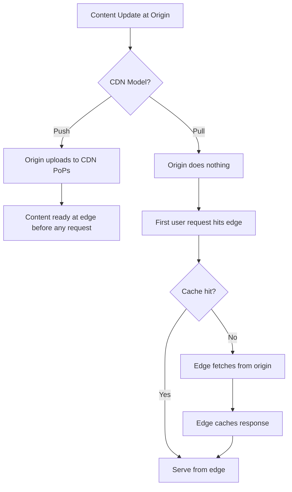
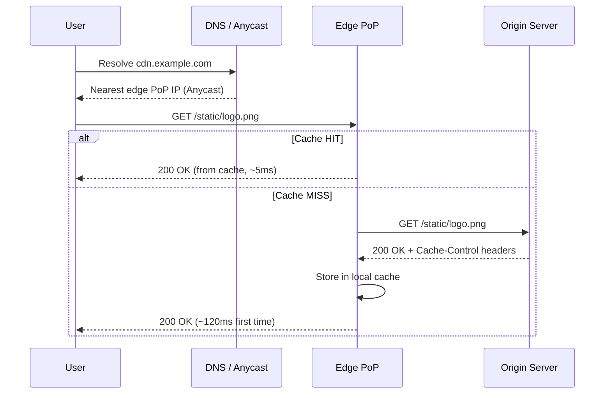
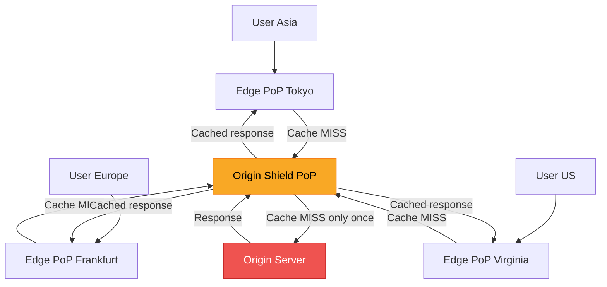

# CDN — Content Delivery Network (HLD)

## Quick Summary (TL;DR)

- A CDN is a geographically distributed network of **edge servers** that cache and serve content closer to end users, slashing latency from hundreds of milliseconds to single digits.
- Two models: **Push CDN** (origin proactively uploads content) vs **Pull CDN** (edge fetches on first request, then caches).
- CDNs handle **static assets** (images, JS, CSS, video) trivially; **dynamic content** is possible via edge compute (Cloudflare Workers, Lambda@Edge).
- An **Origin Shield** adds a mid-tier cache between edge PoPs and the origin, dramatically reducing origin load during cache storms.
- In system design interviews, mentioning CDN placement for read-heavy, latency-sensitive content is expected — skipping it signals a gap.

---

## Real-World Analogy

Think of a CDN like a franchise coffee chain. The **origin server** is the central roastery. Each **edge server** is a local store. When a customer orders (request), the local store serves from its own stock (cache hit). If the item is out of stock (cache miss), the store orders from the roastery (origin fetch), stocks it locally, and serves the customer. An **Origin Shield** is like a regional warehouse — local stores check there before bothering the roastery.

---

## What & Why

| Problem without CDN | How CDN solves it |
|---|---|
| High latency for distant users | Edge servers in 200+ PoPs worldwide |
| Origin bandwidth costs | Edge absorbs 90%+ of read traffic |
| Origin overload during traffic spikes | Distributed caching absorbs load |
| Single point of failure | Anycast routing + failover across PoPs |
| DDoS vulnerability | Edge network absorbs volumetric attacks at the perimeter |

**Key metrics a CDN improves**: TTFB (Time to First Byte), cache hit ratio, origin offload %, P99 latency.

---

## Push vs Pull CDN

### Pull CDN (Lazy — Most Common)

Origin does nothing proactively. The CDN fetches content **on the first request** (cache miss), caches it at the edge, and serves subsequent requests from cache until TTL expires.

```
User request → Edge PoP (cache miss) → Origin → Edge caches → Response
User request → Edge PoP (cache hit) → Response (fast)
```

**Best for**: Most web applications, dynamic catalogs, content that changes unpredictably.

### Push CDN

Origin **proactively uploads** content to CDN nodes before any user requests it. You control exactly what is cached and when.

**Best for**: Large static assets (video, firmware updates), content with predictable publish schedules, cases where the first-request penalty is unacceptable.

### Comparison

| Aspect | Pull CDN | Push CDN |
|---|---|---|
| Cache population | Lazy, on first request | Proactive, origin pushes |
| First-request latency | Higher (cache miss) | Low (pre-warmed) |
| Storage cost | Only caches popular content | You pay for everything pushed |
| Operational complexity | Low — CDN manages cache | Higher — you manage uploads |
| Stale content risk | TTL-based expiry | You control invalidation |
| Use case | General web, APIs | Video streaming, large binaries |



---

## Pull CDN Request Flow (Detailed)



---

## Cache Invalidation at CDN

Cache invalidation is one of the two hard problems in computer science. CDNs give you several levers:

### 1. TTL (Time-To-Live)

Set via `Cache-Control` headers from origin:

```
Cache-Control: public, max-age=86400, s-maxage=3600
```

- `max-age` — browser cache duration
- `s-maxage` — CDN/shared cache duration (overrides max-age for CDN)
- `stale-while-revalidate=60` — serve stale for 60s while fetching fresh copy in background

### 2. Purge APIs

Force-invalidate specific URLs or patterns:

```bash
# Cloudflare example
curl -X POST "https://api.cloudflare.com/client/v4/zones/{zone}/purge_cache" \
  -H "Authorization: Bearer TOKEN" \
  -d '{"files":["https://example.com/style.css"]}'
```

**Trade-off**: Purge propagation takes seconds to minutes across all PoPs. Not instant.

### 3. Versioned URLs (Recommended for Static Assets)

Append a version or content hash to the filename:

```
/static/style.v2.css
/static/bundle.a3f8b2c1.js
/images/hero.png?v=20260530
```

**Why this wins**: You set a very long TTL (1 year), and "invalidate" by deploying a new filename. No purge needed. Cache hit ratio stays near 100%.

### 4. Cache-Control: no-cache vs no-store

| Header | Meaning |
|---|---|
| `no-cache` | Cache it, but **revalidate** with origin every time (conditional GET with ETag/If-Modified-Since) |
| `no-store` | Do **not** cache at all — every request goes to origin |
| `private` | Only browser can cache, CDN must not |

---

## CDN for Dynamic Content

CDNs are not just for static files anymore.

### Edge Compute

Run code **at the edge PoP** itself, eliminating the round-trip to your origin:

| Platform | Runtime | Cold start | Use cases |
|---|---|---|---|
| Cloudflare Workers | V8 isolates | ~0ms | A/B testing, auth, redirects, API gateway |
| AWS Lambda@Edge | Node.js/Python | ~5-50ms | Request/response transformation, SEO |
| Fastly Compute | Wasm | ~0ms | Personalization, geo-routing |

### Edge Side Includes (ESI)

Assemble pages at the edge from cached fragments:

```html
<html>
  <header><!-- cached for 24h --></header>
  <esi:include src="/api/user-greeting" />  <!-- fetched per request -->
  <body><!-- cached for 1h --></body>
</html>
```

**Use when**: A page is 90% cacheable but has small personalized fragments (greeting, cart count).

---

## Origin Shield

An **Origin Shield** is an additional caching layer between edge PoPs and the origin server.

### Without Origin Shield

If you have 200 edge PoPs, a cache miss at each PoP means **200 requests to origin** for the same object.

### With Origin Shield

All edge PoPs route cache misses through a **single designated PoP** (the shield). Only the shield talks to origin.



**Benefits**:
- Origin sees 1 request instead of N (where N = number of edge PoPs)
- Protects origin during cache stampedes (e.g., TTL expiry on popular object)
- Especially valuable for expensive-to-generate responses

**Trade-off**: Adds one extra hop for edge → shield, slightly increases cache-miss latency.

---

## Multi-CDN Strategy

Large-scale systems (Netflix, Apple, major e-commerce) use **multiple CDN providers** simultaneously.

| Benefit | How |
|---|---|
| **Failover** | If Cloudflare has an outage, traffic shifts to Akamai |
| **Cost optimization** | Route traffic to cheapest provider per region |
| **Performance** | Use the fastest CDN per geography via real-time measurements |
| **Vendor leverage** | Avoid lock-in, negotiate better pricing |

### Implementation

- **DNS-based switching**: Use a traffic management DNS (e.g., NS1, Route 53 weighted routing) to split or failover traffic between CDN providers.
- **Client-side measurement**: Real User Monitoring (RUM) beacons measure CDN performance; a controller shifts traffic toward the faster provider.
- **CDN broker services**: Citrix NetScaler, Cedexis (now part of Citrix) automate multi-CDN routing decisions.

---

## CDN in System Design Interviews

### When to Mention CDN

- The system serves **static content** (images, video, JS/CSS bundles) to geographically distributed users
- **Read-heavy** workloads with high read:write ratio (e.g., news sites, e-commerce product pages)
- Latency requirements are strict (sub-100ms globally)
- The system needs to handle **traffic spikes** (flash sales, viral content)

### What Types of Content Benefit

| Content type | CDN benefit | Cache strategy |
|---|---|---|
| Static assets (JS, CSS, images) | Very high | Long TTL + versioned URLs |
| Video/audio streaming | Very high | Chunked delivery, adaptive bitrate |
| API responses (read-heavy) | Medium | Short TTL + stale-while-revalidate |
| Personalized content | Low (without edge compute) | ESI or edge compute |
| Real-time data (chat, stock tickers) | None | WebSocket to origin, skip CDN |

### Sample Interview Statement

> "For serving product images and the JS bundle, I'd place a pull CDN (e.g., CloudFront) in front of our S3 origin. Static assets get versioned filenames with a 1-year max-age. For the product detail API, I'd use a short TTL (30s) with stale-while-revalidate so users see near-fresh data while the edge revalidates asynchronously."

---

## Interview Angles

1. **"How do you invalidate a cached asset globally?"** — Versioned URLs for static assets (preferred), purge API for emergencies, TTL as a safety net.
2. **"Push or Pull CDN for a video platform?"** — Push for the catalog (pre-warm popular titles), Pull for long-tail content.
3. **"How does a CDN help with DDoS?"** — Absorbs volumetric attacks at the edge; Anycast distributes traffic across PoPs; WAF rules at edge block application-layer attacks.
4. **"What happens during a CDN outage?"** — Multi-CDN with DNS failover; fallback to origin (ensure origin can handle the load); circuit breaker pattern.
5. **"CDN for authenticated content?"** — Use signed URLs/cookies (CloudFront signed URLs, Akamai token auth) so the CDN caches content but only serves to authorized users.

---

## Traps

1. **"CDN caches everything automatically"** — Wrong. Only responses with appropriate `Cache-Control` headers get cached. `Set-Cookie`, `Authorization`, and `Cache-Control: private` responses are typically not cached.
2. **"Purge is instant"** — Purge propagation across 200+ PoPs takes seconds to minutes. Design for eventual consistency, not instant invalidation.
3. **"CDN eliminates the need for origin scaling"** — Cache misses, purges, and cache stampedes still hit origin. Origin Shield helps but does not eliminate origin load entirely.
4. **"One CDN is enough"** — For most startups, yes. At scale, single-CDN is a single point of failure. Know when to discuss multi-CDN.
5. **"CDN only for static files"** — Modern CDNs support edge compute, dynamic content acceleration, WebSocket proxying, and API caching. Saying "CDN is only for images" sounds outdated.
6. **"Setting max-age=31536000 on API responses"** — Long TTLs on dynamic data cause stale reads. Use short TTLs + `stale-while-revalidate` for APIs, long TTLs only for immutable/versioned assets.
