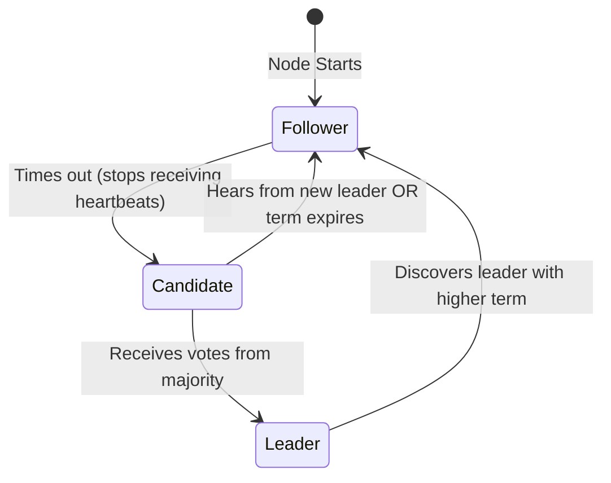
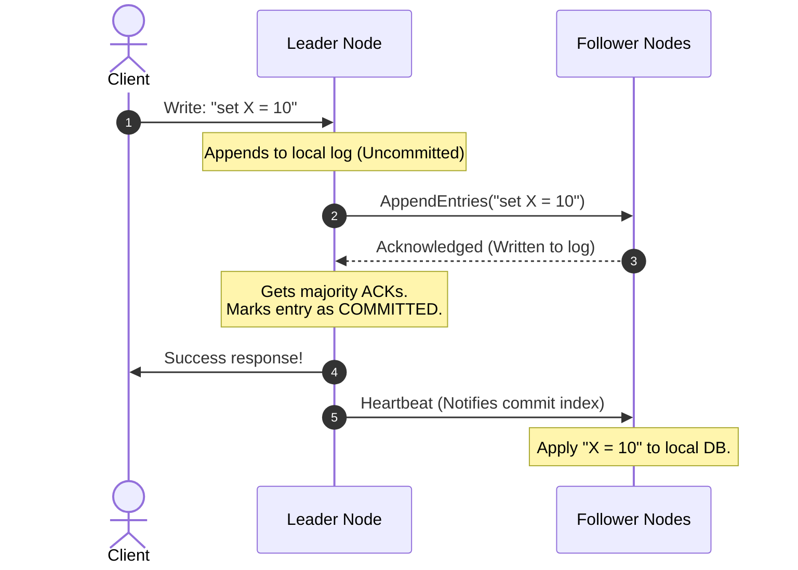

# HLD Core: Distributed Consensus (Paxos & Raft for Noobs)

## Quick Summary (TL;DR)
* **Goal**: Enable a cluster of independent nodes to **agree on a single value or state** (like a transaction log) even when network splits happen or nodes crash.
* **The Quorum Rule**: To make any change (or elect a leader), a node must get approval from a **majority of nodes**: 
  $$Q = \lfloor N/2 \rfloor + 1$$
* **Split-Brain**: A network split that divides a cluster into two parts. Quorums prevent both parts from accepting writes simultaneously, protecting data from corruption.
* **Paxos**: The mathematically proven pioneer of consensus, but notoriously complex and hard to implement.
* **Raft**: A consensus protocol designed to be easy to understand. It achieves consensus by splitting it into three subproblems: **Leader Election**, **Log Replication**, and **Safety**.
* **etcd vs. ZooKeeper**:
  - `etcd` uses the **Raft** protocol (written in Go; powers Kubernetes).
  - `ZooKeeper` uses the **ZAB** (ZooKeeper Atomic Broadcast) protocol (written in Java; powers Hadoop/Kafka).

---

## 1. What is Distributed Consensus?

Imagine you and 4 friends are deciding on a restaurant for dinner.
* **If you are all in the same room**: Decisions are easy. Someone suggests Pizza, everyone agrees, and you go.
* **If you are communicating via SMS**: It gets complicated. Friend A loses network connection in a subway. Friend B's battery dies. Friend C takes 30 minutes to reply. How do you guarantee that everyone eventually drives to the **exact same restaurant** without some showing up at a Pizza place and others at a Burger joint?

In distributed databases, **Consensus** is the protocol that ensures all server replicas agree on the exact sequence of data writes, even when nodes crash, network cables are cut, or messages are delayed.

---

## 2. Quorums & Split-Brain Prevention 🧠

How do we prevent two parts of a cluster from acting independently and corrupting data? We use **Quorums**.

A **Quorum** is the minimum number of votes required to make any decision.

### The Quorum Majority Formula
If you have $N$ nodes, a quorum requires:
$$\text{Quorum (Q)} = \lfloor N/2 \rfloor + 1$$
* For a **3-node** cluster, majority is **2**.
* For a **5-node** cluster, majority is **3**.

### Why Clusters Use an Odd Number of Nodes (3, 5, 7)
* **3 Nodes**: Can tolerate **1 crash** (since $3 - 1 = 2$, which is still a majority).
* **4 Nodes**: Can tolerate **1 crash** (since $4 - 1 = 3$, which is a majority. If 2 nodes crash, you only have 2 left, which is not a majority of 4).
* *Takeaway*: Adding a 4th node does **not** increase your crash tolerance (it remains 1), but it increases network coordination overhead. Hence, clusters are always odd!

---

### How Quorums Prevent Split-Brain (Network Partition)
Imagine a 5-node cluster is split by a network partition into two groups: a **3-node group** (left) and a **2-node group** (right).

```mermaid
flowchart TD
    subgraph Left Partition "3-Node Group (Has Quorum)"
        N1[Node 1: Follower]
        N2[Node 2: Leader]
        N3[Node 3: Follower]
    end
    
    subgraph Right Partition "2-Node Group (No Quorum)"
        N4[Node 4: Follower]
        N5[Node 5: Follower]
    end
    
    N1 --- N2 --- N3
    N4 --- N5
    
    N2 -.x. Network Cut .x.-> N4
    N3 -.x. Network Cut .x.-> N5
```

1. **The Left Group (Nodes 1, 2, 3)**: Since $3 \ge 3$, they have a majority. They can elect a leader and accept read/write requests from clients.
2. **The Right Group (Nodes 4, 5)**: Since $2 < 3$, they cannot reach a majority. They cannot elect a new leader and will **reject all incoming writes**.
3. **Outcome**: When the network heals, the left group's state will overwrite the right group's stale state. The data remains consistent!

---

## 3. Paxos: The Theoretical Pioneer

Created by Leslie Lamport, Paxos is the foundational consensus protocol.

### Basic Paxos Phases:
1. **Phase 1 (Prepare & Promise)**:
   - A proposer node sends a `Prepare(n)` message to all nodes (where $n$ is a unique proposal number).
   - If nodes receive a proposal number larger than any they've seen, they return a `Promise` not to accept any proposals numbered less than $n$.
2. **Phase 2 (Propose & Accept)**:
   - Once the proposer gets a majority of promises, it sends an `Accept(n, value)` message.
   - If nodes haven't promised to ignore it, they accept the value and notify the proposer and listeners.

### The Drawback:
Paxos is mathematically brilliant but **incredibly hard to implement in code**. The original paper did not define how to handle continuous logs (Multi-Paxos) or node membership changes clearly. This led to many engineering bugs, prompting researchers to create Raft.

---

## 4. Raft: Consensus Designed for Humans ⛵

Raft divides distributed consensus into three clean subproblems:

### 1. Leader Election
At any time, a node in Raft is in one of three states:
* **Follower**: Passive. Only responds to incoming heartbeats from the Leader.
* **Candidate**: Transitions here if it stops receiving heartbeats. Tries to get elected.
* **Leader**: Processes all client writes, replicates them, and sends heartbeats.



#### How the Election Works:
1. **Randomized Election Timeouts**: Followers wait for a random timeout (typically between 150ms and 300ms) for a heartbeat. This prevents "split votes" where multiple nodes become candidates at the exact same moment.
2. **RequestVotes**: The first node whose timeout expires becomes a **Candidate**, increments the **Term** (logical clock), votes for itself, and broadcasts `RequestVote` to others.
3. **Majority Rules**: If it receives votes from a majority of nodes, it becomes the **Leader** and immediately starts sending `AppendEntries` heartbeats to keep other nodes in the Follower state.

---

### 2. Log Replication
All writes from clients must flow through the **Leader**.



1. The client sends a write request to the Leader.
2. The Leader appends the entry to its own log and broadcasts an `AppendEntries` RPC to all Followers.
3. Once a **majority (quorum)** of Followers acknowledge writing the log entry to disk, the Leader marks the entry as **Committed**.
4. The Leader applies it to its local state machine (database) and returns success to the client.
5. Followers apply the entry to their local databases upon receiving the next heartbeat containing the updated committed index.

---

### 3. Safety Rule (Log Completeness)
* **Rule**: If a candidate's log is less up-to-date than a voter's log, the voter **denies its vote**.
* **Why**: This guarantees that a newly elected leader **always contains all committed entries** from previous terms, preventing data loss during failovers.

---

## 5. etcd (Raft) vs. ZooKeeper (ZAB) 🦖

Coordination engines like `etcd` and `ZooKeeper` are distributed key-value stores used for configuration management, service discovery, and distributed locking. They must be highly consistent, so they use consensus protocols.

| Feature | etcd | ZooKeeper |
| :--- | :--- | :--- |
| **Consensus Protocol**| **Raft** | **ZAB** (ZooKeeper Atomic Broadcast) |
| **Language** | Go | Java |
| **API** | gRPC / HTTP | Custom TCP Client API |
| **Primary Use Case** | Kubernetes cluster state engine | Kafka metadata (pre-KRaft), Hadoop, HBase |
| **Key Difference** | ZAB is custom-built and tightly coupled with ZooKeeper. Raft is a generic, modular protocol used across many independent databases. |

### How ZAB (ZooKeeper) differs from Raft:
* While very similar, ZAB is designed specifically for primary-backup systems. 
* ZAB separates execution into **Recovery Phase** (leader election) and **Broadcast Phase** (log replication).
* ZAB uses **Epochs** instead of Raft's **Terms**.
* In ZAB, a leader remains active until it loses its connection to the majority. In Raft, a leader can be stepped down dynamically if a follower with a newer term starts an election.
