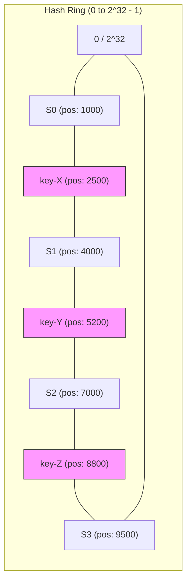
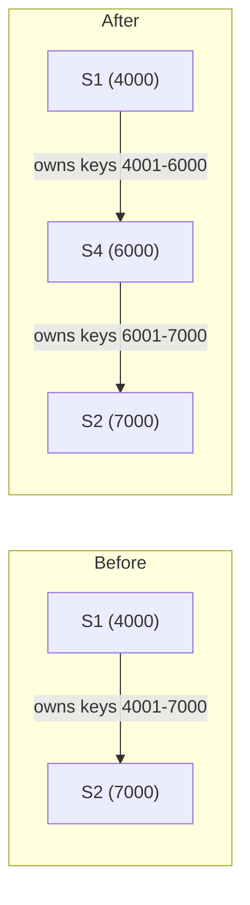
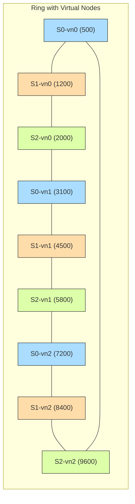

# Consistent Hashing (HLD)

## Quick Summary (TL;DR)

- **Naive hashing** (`hash(key) % N`) breaks catastrophically when you add or remove servers -- almost every key gets remapped.
- **Consistent hashing** maps both servers and keys onto a virtual ring so that adding/removing a node only redistributes keys from its immediate neighbors.
- **Virtual nodes (vnodes)** solve the uneven-distribution problem by giving each physical node 100-200 positions on the ring.
- Used in DynamoDB, Cassandra, Memcached, CDN routing, and most distributed key-value stores.
- The core implementation fits in ~30 lines using a sorted map (`TreeMap` in Java) with `ceilingKey` for clockwise lookup.

---

## The Problem with Naive Hashing

With `N` servers, the classic approach is:

```
server = hash(key) % N
```

Suppose N = 4 and we have 8 keys:

| Key   | hash(key) | hash % 4 | Server |
|-------|-----------|-----------|--------|
| userA | 17        | 1         | S1     |
| userB | 22        | 2         | S2     |
| userC | 35        | 3         | S3     |
| userD | 44        | 0         | S0     |
| userE | 51        | 3         | S3     |
| userF | 60        | 0         | S0     |
| userG | 73        | 1         | S1     |
| userH | 88        | 0         | S0     |

Now add one server (N = 5). Recompute `hash % 5`:

| Key   | hash(key) | hash % 5 | Server | Moved? |
|-------|-----------|-----------|--------|--------|
| userA | 17        | 2         | S2     | YES    |
| userB | 22        | 2         | S2     | NO     |
| userC | 35        | 0         | S0     | YES    |
| userD | 44        | 4         | S4     | YES    |
| userE | 51        | 1         | S1     | YES    |
| userF | 60        | 0         | S0     | NO     |
| userG | 73        | 3         | S3     | YES    |
| userH | 88        | 3         | S3     | YES    |

**6 out of 8 keys moved (75%).** In general, ~(N-1)/N keys get remapped -- a cache stampede waiting to happen.

> **Real-world analogy:** Imagine 4 librarians split the alphabet evenly (A-F, G-L, M-R, S-Z). A 5th librarian joins, so you re-divide into 5 equal slices. Almost every book changes hands. Consistent hashing is like saying "the new librarian only takes a slice from one neighbor's shelf."

---

## How Consistent Hashing Works

### The Hash Ring

1. Map the hash space onto a circle (0 to 2^32 - 1).
2. Hash each server ID to place it on the ring.
3. Hash each key and walk **clockwise** until you hit the first server -- that server owns the key.



- `key-X` (pos 2500) --> walks clockwise --> lands on **S1** (pos 4000)
- `key-Y` (pos 5200) --> walks clockwise --> lands on **S2** (pos 7000)
- `key-Z` (pos 8800) --> walks clockwise --> lands on **S3** (pos 9500)

### Adding a Node -- Minimal Redistribution

When S4 joins at position 6000 (between S1 at 4000 and S2 at 7000):



Only keys in the range (4000, 6000] move from S2 to S4. **All other keys stay put.** On average, only `K/N` keys move (where K = total keys, N = total nodes).

### Removing a Node

If S1 (pos 4000) goes down, its keys (1000, 4000] simply fall through to the next clockwise node (S4 or S2). Again, only one node's worth of keys is affected.

---

## Virtual Nodes (Vnodes)

### The Problem with Few Physical Nodes

With only 3 physical nodes, the ring is divided into 3 arcs. Random hash positions rarely produce equal-sized arcs, so one node might own 50% of the keys while another owns 15%.

### How Vnodes Fix It

Each physical node gets **multiple positions** on the ring (typically 100-200 vnodes each). More positions = more uniform distribution by the law of large numbers.



Blue = S0, Orange = S1, Green = S2. Each physical node appears 3 times here (in practice, 100-200 times).

| Vnodes per Node | Standard Deviation of Load |
|-----------------|---------------------------|
| 1               | ~60% imbalance             |
| 10              | ~20% imbalance             |
| 100             | ~5% imbalance              |
| 200             | ~3% imbalance              |

**Trade-off:** More vnodes = more metadata and slower ring rebalancing.

---

## Real-World Usage

| System           | How It Uses Consistent Hashing                                           |
|------------------|--------------------------------------------------------------------------|
| Amazon DynamoDB  | Partitions data across storage nodes; vnodes for even distribution       |
| Apache Cassandra | Token ring with vnodes (default 256 per node); each vnode is a partition |
| Memcached        | Client-side consistent hashing for cache key routing                     |
| Akamai CDN       | Routes requests to the nearest/optimal edge server                       |
| Discord          | Routes users to gateway servers                                          |
| Maglev (Google)  | Load balancer uses a consistent-hashing lookup table                     |

## Implementation Sketch

A minimal consistent hashing ring in Java using `TreeMap`. 

> [!NOTE]
> **Noob Explanation**: A `TreeMap` is a sorted map. We use it because it maintains elements sorted by their hash value (keys). This allows us to quickly find the "next clockwise" server using the `ceilingEntry(hash)` method.

```java
import java.security.MessageDigest;
import java.security.NoSuchAlgorithmException;
import java.util.Map;
import java.util.TreeMap;

public class ConsistentHashRing<T> {
    private final TreeMap<Long, T> ring = new TreeMap<>();
    private final int vnodeCount;
    private final MessageDigest md;

    public ConsistentHashRing(int vnodeCount) {
        this.vnodeCount = vnodeCount;
        try {
            // MD5 provides a good distribution of hashes
            this.md = MessageDigest.getInstance("MD5");
        } catch (NoSuchAlgorithmException e) {
            throw new RuntimeException("MD5 digest not found", e);
        }
    }

    public void addNode(T node) {
        for (int i = 0; i < vnodeCount; i++) {
            long hash = hash(node.toString() + "-vn" + i);
            ring.put(hash, node);
        }
    }

    public void removeNode(T node) {
        for (int i = 0; i < vnodeCount; i++) {
            long hash = hash(node.toString() + "-vn" + i);
            ring.remove(hash);
        }
    }

    public T getNode(String key) {
        if (ring.isEmpty()) return null;
        long hash = hash(key);
        
        // ceilingEntry(hash) returns the least key greater than or equal to the given hash.
        // This is the O(log N) equivalent of walking clockwise on the ring!
        Map.Entry<Long, T> entry = ring.ceilingEntry(hash);
        
        // Wrap around: If we're past the highest hash on the ring, wrap around to the first node
        return (entry != null) ? entry.getValue() : ring.firstEntry().getValue();
    }

    private long hash(String key) {
        md.reset();
        byte[] digest = md.digest(key.getBytes());
        // Extract 4 bytes from MD5 digest and convert to a positive 32-bit integer (stored in long)
        return ((long)(digest[0] & 0xFF) << 24) 
             | ((digest[1] & 0xFF) << 16)
             | ((digest[2] & 0xFF) << 8)  
             |  (digest[3] & 0xFF);
    }
}
```

**Key insights for interviews:**
- **Why TreeMap?** Finding the next node takes `O(log V)` where `V` is the number of virtual nodes on the ring.
- **Why Wrap-around?** If `ceilingEntry(hash)` is null, it means the hash is larger than any node's hash on the ring. The circular ring concept dictates we route to the very first node (`ring.firstEntry()`).
- **Memory Overhead:** Storing `N * vnodes` entries in memory is negligible (e.g., 1000 nodes * 200 vnodes = 200,000 entries, which is just a few megabytes in memory).

---

## Replication with Consistent Hashing

To achieve fault tolerance, replicate each key to the next **R** distinct *physical* nodes clockwise on the ring.

**Algorithm:**
1. Find the primary node for the key (first clockwise node).
2. Walk clockwise, collecting nodes. Skip vnodes belonging to a physical node you already picked.
3. Stop after collecting R distinct physical nodes.

| Replication Factor | Behavior                                                |
|--------------------|---------------------------------------------------------|
| R = 1              | No replication. Node failure = data loss.               |
| R = 3              | Standard (DynamoDB, Cassandra). Survives 2 node failures. |
| R = 5              | High durability. Higher write latency and storage cost. |

**Consistency trade-off:** With R replicas, you can tune quorum reads/writes (W + R > N for strong consistency).

---

## Hotspot Mitigation

Even with vnodes, hotspots happen when a single key (or narrow key range) gets disproportionate traffic -- think a viral tweet or a celebrity's profile.

| Strategy                    | How It Helps                                                     |
|-----------------------------|------------------------------------------------------------------|
| Virtual nodes               | Spread a node's ownership across many arcs, reducing per-arc size |
| Key splitting / salting      | Append a random suffix (e.g., `key#1`, `key#2`, ..., `key#10`) to distribute a hot key across 10 ring positions |
| Read replicas / caching      | Cache hot keys in a separate layer (Redis/local cache) in front of the ring |
| Dynamic vnode rebalancing    | Monitor load; temporarily assign more vnodes to underloaded nodes |
| Application-level sharding   | Recognize "celebrity" keys and route them to a dedicated cluster  |

> **Vnodes help but are not a silver bullet.** They solve *uniform distribution of many keys* but cannot help when a *single key* is the bottleneck. For that, you need key splitting or caching.

---

## Comparison: Naive Hashing vs. Consistent Hashing

| Property                  | Naive (`hash % N`)     | Consistent Hashing          |
|---------------------------|------------------------|-----------------------------|
| Keys moved on node add    | ~(N-1)/N (almost all)  | ~K/N (minimal)              |
| Keys moved on node remove | ~(N-1)/N               | ~K/N                        |
| Load balance              | Perfect (with good hash)| Uneven without vnodes       |
| Implementation complexity | Trivial                | Moderate (sorted map + vnodes) |
| Lookup time               | O(1)                   | O(log V) where V = total vnodes |
| Metadata overhead         | None                   | O(V) ring entries           |

---

## Interview Angles

1. **"Design a distributed cache"** -- Consistent hashing is the go-to answer for how keys are mapped to cache servers. Always mention vnodes and replication.
2. **"How does Cassandra partition data?"** -- Token ring with consistent hashing + vnodes (default 256). Mention how adding a node only steals token ranges from neighbors.
3. **"How would you handle a node failure?"** -- Keys automatically fall to the next node. Combined with replication factor R = 3, no data is lost.
4. **"What happens during scaling?"** -- Only K/N keys move. Mention that data transfer is bounded and can be done as background streaming.
5. **"Hash ring vs. hash slot (Redis Cluster)"** -- Redis uses fixed 16384 hash slots (not a ring). Slots are assigned to nodes manually. Trade-off: simpler rebalancing, less automatic.

---

## Traps

- **Forgetting vnodes.** Never present consistent hashing without mentioning vnodes -- the interviewer will ask "what about uneven distribution?"
- **Saying O(1) lookup.** It is O(log V) for a tree-based ring. Only Maglev-style lookup tables achieve O(1).
- **Ignoring the wrap-around.** If you hash past the last node, you must wrap to the first node on the ring. Forgetting this is a classic implementation bug.
- **Confusing replication with partitioning.** Consistent hashing decides *which node owns a key* (partitioning). Replication is a separate layer that copies data to neighboring nodes.
- **Assuming vnodes eliminate hotspots.** Vnodes fix *distribution skew* across many keys. A single ultra-hot key still hammers one node -- you need key splitting or caching for that.
- **Not knowing real numbers.** Cassandra defaults to 256 vnodes per node. DynamoDB uses consistent hashing internally but abstracts it away. Know at least one concrete system.
