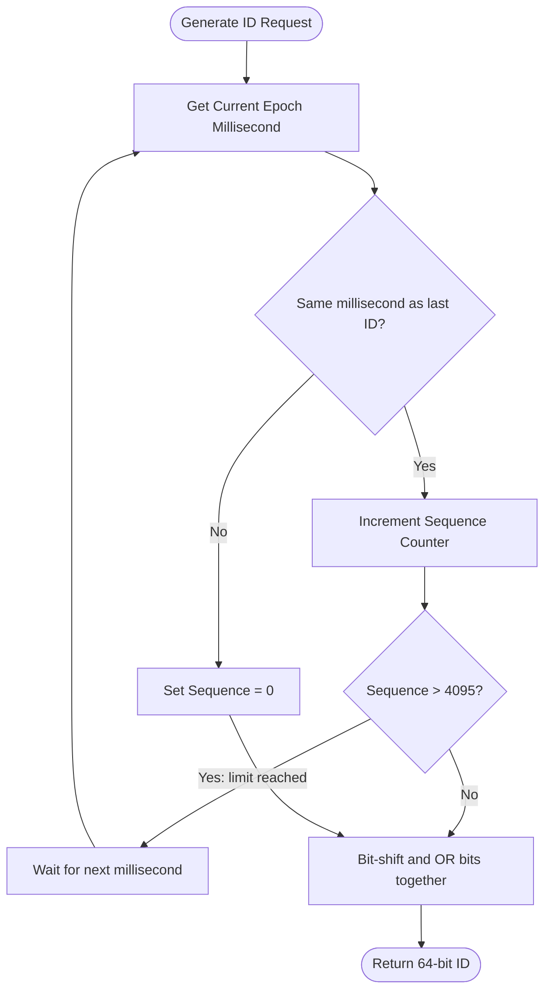

# Distributed ID Generator (HLD)

## Quick Summary (TL;DR)
- Distributed systems need **globally unique IDs** to identify entities (users, posts, messages) across partitioned databases.
- The ID generator must be **highly available, scalable, fast (< 1ms generation time)**, and ideally **chronologically sortable**.
- Three primary options exist:
  1. **UUID**: 128-bit random strings. (Pros: Zero orchestration, locally generated. Cons: Non-sortable, 128-bit size bloats DB indexes).
  2. **Database Auto-Increment (Ticket Server)**: Central database using `REPLACE INTO`. (Pros: Simple, incremental. Cons: Single point of failure, network bottleneck).
  3. **Twitter Snowflake**: 64-bit custom bitwise integers. (Pros: Sortable, fast, distributed, fits in 64-bit long. Cons: Requires clock synchronization via NTP).

---

## 🤓 Noob Jargon Buster

* **64-bit Integer**: In Java/Go, this is a standard `long` data type. It is faster to index and query in databases than string-based IDs.
* **UUID (Universally Unique Identifier)**: A 128-bit value containing random characters (e.g., `123e4567-e89b-12d3-a456-426614174000`).
* **NTP (Network Time Protocol)**: A protocol used to synchronize the computer clocks of servers across a network.
* **Clock Drift**: A situation where a server's internal clock runs slightly faster or slower than other servers or real-world time.

---

## Real-World Analogy

Imagine a chain of ticket booths at a theme park selling tickets:
- **UUID**: Each booth clerk generates a ticket ID by throwing 32 dice on the table. The chances of two booths rolling the exact same sequence are astronomically low. But the ticket IDs are long, random sequences of numbers, making them hard to file in sequential order.
- **Ticket Server (Database-backed)**: Every booth must call a single central office radio operator to ask for the next ticket number (1, 2, 3...). It guarantees sequential IDs, but if the radio link goes down, no one can buy tickets.
- **Snowflake**: Each clerk has a special machine that stamps the ticket with:
  `[The current millisecond] - [The clerk's booth number] - [A count of tickets sold in this millisecond]`.
  Since the time moves forward and booth numbers are unique, no two tickets can ever have the same ID, and tickets are naturally sorted by purchase time.

---

## The Snowflake Bitwise Structure

The standard Snowflake ID fits into a **64-bit integer** and is divided into sections:

```
+-----------------------------------------------------------------------+
| 1 bit |  41 bits (Timestamp)  | 10 bits (Node ID) | 12 bits (Sequence)|
+-----------------------------------------------------------------------+
```

1. **Sign bit (1 bit)**: Reserved (always set to 0 to keep the number positive).
2. **Timestamp (41 bits)**: Epoch milliseconds (e.g., milliseconds since a custom epoch, like Jan 1, 2026). 41 bits can represent up to **69 years** of unique timestamps.
3. **Node/Worker ID (10 bits)**: Allows up to $2^{10} = 1024$ distinct worker nodes (servers) to generate IDs simultaneously without coordinating.
4. **Sequence Number (12 bits)**: A local counter for IDs generated on the same server during the same millisecond. Resets to 0 every millisecond. Supports up to $2^{12} = 4096$ IDs per node per millisecond.

---

## Comparison of Strategies

| Strategy | Size | Chronologically Sortable? | Coordination Required? | High Availability | DB Index Friendly? |
| :--- | :--- | :--- | :--- | :--- | :--- |
| **UUID (v4)** | 128-bit String | No | None (generated locally) | Excellent | Poor (frays B-Trees) |
| **Ticket Server** | 64-bit Long | Yes | High (calls database) | Poor (SPOF) | Excellent |
| **Snowflake** | 64-bit Long | Yes (rough sort by time) | Low (only to assign Node IDs) | Excellent | Excellent |

---

## Snowflake Logic Flow



---

## Deep Concepts

### Why random UUIDs destroy B-Tree DB Index Performance
Relational databases (like PostgreSQL, MySQL) use B-Trees to index primary keys.
- **Sequential IDs**: Are appended to the end of the tree. This is fast and keeps the index clean.
- **Random IDs (UUIDs)**: Are inserted in random locations in the B-Tree index. This causes **page splits** — where the database must reorganize database pages on disk. This heavily degrades write performance at scale.

---

## Interview Angles (System Design Scenarios)

* **Question**: "Design a global unique ID generator for a Twitter clone."
  - **Noob Answer**: Just use standard auto-incrementing integer IDs in our database. (Fails when the database is sharded). Or just use UUIDs. (Disregards DB performance and sorting needs).
  - **Pro Answer**: Recommend a Snowflake-like bitwise ID generator. Explain the division of the 64 bits (timestamp, machine ID, sequence). Highlight that it guarantees uniqueness across shards, fits in a 64-bit index, and is chronologically sortable so we can easily query recent tweets.

---

## Common Traps

1. **Clock Drift**: Snowflake depends heavily on the system clock. If a node's clock drifts backward (due to NTP sync or leap seconds), it could generate duplicate IDs.
   - *Mitigation*: The ID generator code must store the `lastTimestamp`. If `currentTimestamp < lastTimestamp`, reject ID requests with an error until the clock catches up.
2. **Node ID Exhaustion**: If you scale beyond 1024 servers, you exhaust the 10-bit Node ID space.
   - *Mitigation*: Dynamically register/deregister worker IDs using ZooKeeper or Consul.
3. **Epoch Millisecond Limit**: After 69 years, the 41-bit timestamp space overflows.
   - *Mitigation*: Use a custom, modern epoch starting point (e.g., your company's founding date) to extend the lifespan of the bit space.
