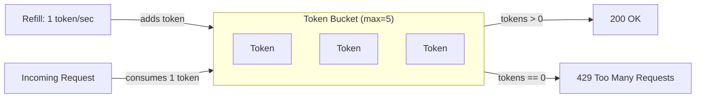
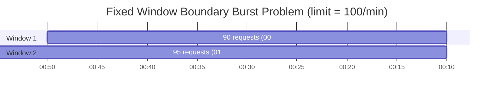
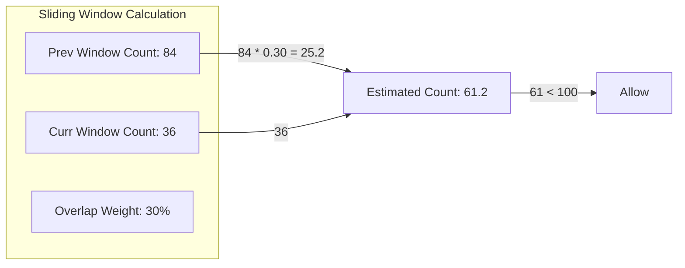
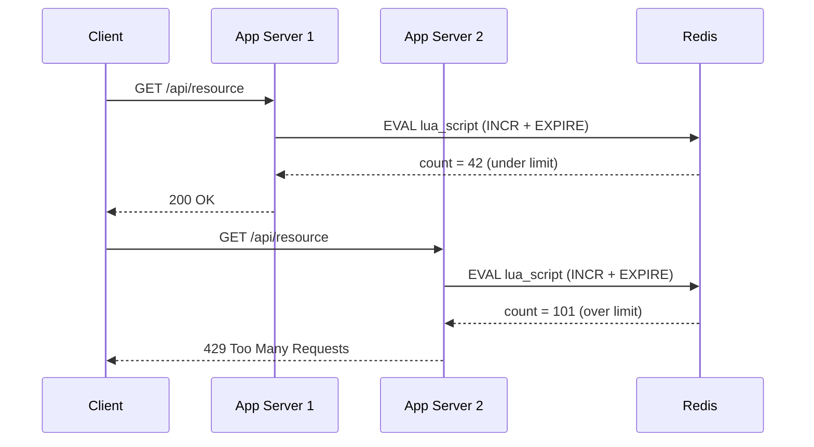

# Rate Limiter (HLD)

## Quick Summary (TL;DR)

- A rate limiter controls how many requests a client can send in a given time window, protecting backends from abuse, overload, and runaway costs.
- Five classic algorithms exist: Token Bucket, Leaky Bucket, Fixed Window Counter, Sliding Window Log, and Sliding Window Counter -- each trading off memory, accuracy, and burst tolerance.
- In distributed systems, a centralized store like Redis (with Lua scripts for atomicity) is the standard approach to enforce limits across multiple servers.
- Rate limiting can happen at the client, API gateway, or application layer -- gateway-level is the most common in production.
- Always return standard headers (`X-RateLimit-Remaining`, `Retry-After`) so clients can self-throttle gracefully.

---

## Real-World Analogy

Think of a nightclub with a bouncer. The club has a max capacity (the limit). The bouncer counts people entering (requests). Once the club is full, new arrivals are turned away (HTTP 429). VIP guests might have a separate, higher quota (per-user tiers). The bouncer resets the count at a regular interval (time window).

---

## What and Why

**What**: A mechanism that tracks and controls the rate of incoming requests, rejecting or deferring those that exceed a configured threshold.

**Why**:
| Goal | Explanation |
|------|-------------|
| Prevent abuse | Stop malicious actors or buggy clients from overwhelming the system |
| Protect resources | Keep CPU, memory, DB connections within safe limits |
| Ensure fairness | No single tenant hogs shared capacity |
| Cost control | Cloud bills scale with traffic -- unbounded requests = unbounded cost |
| Compliance | Some APIs enforce contractual rate limits (e.g., Stripe, GitHub) |

---

## Where to Rate Limit

```
Client --> API Gateway --> Load Balancer --> App Server --> DB
  (1)         (2)                              (3)
```

| Location | Pros | Cons |
|----------|------|------|
| **Client-side (1)** | Reduces unnecessary network calls | Easily bypassed; you don't control the client |
| **API Gateway (2)** | Centralized, language-agnostic, offloads app logic | Single point of config; may lack app-level context |
| **Application / Middleware (3)** | Fine-grained (per-endpoint, per-user logic) | Every service must implement it; duplicated effort |

**Recommendation for interviews**: "We place rate limiting at the API gateway for broad protection, with optional application-level limits for business-critical endpoints."

---

## Algorithms

### 1. Token Bucket

Tokens are added to a bucket at a fixed refill rate. Each request consumes one token. If the bucket is empty, the request is rejected. The bucket has a max capacity, allowing short bursts up to that cap.



**Key properties**:
- Allows bursts up to bucket capacity.
- After burst, rate converges to the refill rate.
- Used by: AWS API Gateway, Stripe.

**Pseudocode**:
```
tokens = min(max_tokens, tokens + (now - last_refill) * refill_rate)
last_refill = now
if tokens >= 1:
    tokens -= 1
    allow()
else:
    reject()
```

---

### 2. Leaky Bucket

Requests enter a FIFO queue (the bucket). The queue drains at a constant rate. If the queue is full, new requests are dropped.

**Key properties**:
- Produces a perfectly smooth outflow -- no bursts.
- Good for APIs that need a strict constant processing rate.
- Downside: a burst of requests fills the queue, adding latency for later arrivals.

---

### 3. Fixed Window Counter

Divide time into fixed windows (e.g., every minute). Keep a counter per window. Increment on each request; reject if counter exceeds the limit.



**Boundary burst problem**: A client sends 90 requests at `0:50-1:00` and 95 requests at `1:00-1:10`. Both pass (each window sees < 100), but the server handled 185 requests in 20 seconds -- nearly 2x the intended rate.

---

### 4. Sliding Window Log

Store the timestamp of every request. To check the limit, count timestamps within `[now - window_size, now]`. Remove expired entries.

**Key properties**:
- Perfectly accurate -- no boundary burst issue.
- Memory-heavy: stores every timestamp. At 10K req/s with a 1-minute window, that is 600K entries per user.

---

### 5. Sliding Window Counter

A hybrid approach. Combine the current window count with a weighted portion of the previous window count.



**Formula**: `count = prev_window_count * overlap_fraction + current_window_count`

Where `overlap_fraction = (window_size - elapsed_in_current_window) / window_size`.

**Key properties**:
- Low memory (two counters per window).
- Good accuracy -- smooths out boundary bursts.
- Used by Cloudflare.

---

## Algorithm Comparison

| Algorithm | Memory | Accuracy | Burst Handling | Complexity | Best For |
|-----------|--------|----------|----------------|------------|----------|
| **Token Bucket** | Low (2 vars) | High | Allows controlled bursts | Low | General-purpose, most popular |
| **Leaky Bucket** | Low (queue + pointer) | High | No bursts (smooth) | Low | Strict constant-rate processing |
| **Fixed Window Counter** | Very Low (1 counter) | Medium -- boundary burst | Poor at edges | Very Low | Simple, non-critical use cases |
| **Sliding Window Log** | High (all timestamps) | Perfect | Accurate | Medium | When precision matters, low traffic |
| **Sliding Window Counter** | Low (2 counters) | Good (approximate) | Handles well | Low | Production systems needing balance |

---

## Distributed Rate Limiting

In a multi-server deployment, each server must share rate-limit state. Without coordination, a user hitting N servers effectively gets N x the limit.

### Redis-Based Approach



### Why Lua Scripts?

A naive approach of `GET` then `INCR` has a race condition: two servers read the same count, both see it as under-limit, both increment. A Lua script executes atomically on Redis:

```lua
local key = KEYS[1]
local limit = tonumber(ARGV[1])
local window = tonumber(ARGV[2])

local current = redis.call('INCR', key)
if current == 1 then
    redis.call('EXPIRE', key, window)
end

if current > limit then
    return 0  -- rejected
end
return 1      -- allowed
```

### Trade-offs

| Concern | Detail |
|---------|--------|
| **Latency** | Every request now requires a Redis round-trip (~0.5-1 ms) |
| **Redis failure** | If Redis is down, decide: fail-open (allow all) or fail-closed (reject all). Most systems fail-open. |
| **Consistency** | Redis is single-threaded, so Lua scripts are atomic. In a Redis Cluster, keys shard by hash slot -- use hash tags `{user_123}` to colocate. |
| **Synchronization lag** | With local caches + periodic sync, you trade accuracy for lower latency. |

---

## Rate Limit Headers

Standard HTTP headers that well-behaved APIs return:

| Header | Meaning | Example |
|--------|---------|---------|
| `X-RateLimit-Limit` | Max requests allowed in the window | `100` |
| `X-RateLimit-Remaining` | Requests left in current window | `57` |
| `X-RateLimit-Reset` | Unix timestamp when the window resets | `1717027200` |
| `Retry-After` | Seconds to wait before retrying (on 429) | `30` |

**Response on rejection**:
```http
HTTP/1.1 429 Too Many Requests
X-RateLimit-Limit: 100
X-RateLimit-Remaining: 0
X-RateLimit-Reset: 1717027200
Retry-After: 30
Content-Type: application/json

{"error": "Rate limit exceeded. Try again in 30 seconds."}
```

---

## Hard vs Soft Rate Limiting

| Type | Behavior | Use Case |
|------|----------|----------|
| **Hard** | Strictly reject anything over the limit | Payment APIs, auth endpoints |
| **Soft** | Allow a small overflow (e.g., 5-10% above limit) before rejecting | General APIs where brief spikes are acceptable |

Soft limiting is often implemented with Token Bucket (the burst capacity acts as the soft buffer).

---

## Rate Limiting by Dimension

You can apply different limits based on different dimensions simultaneously:

| Dimension | Key | Example Limit |
|-----------|-----|---------------|
| Per user | `user_id:12345` | 1000 req/min |
| Per IP | `ip:203.0.113.5` | 500 req/min |
| Per API key | `api_key:sk_live_abc` | 5000 req/min |
| Per endpoint | `POST:/api/orders` | 50 req/min |
| Combined | `user:123:POST:/api/orders` | 10 req/min |

**Layered approach**: Apply broad IP-level limits first (cheap check), then per-user limits (requires auth), then per-endpoint limits (most specific).

---

## Interview Angles

1. **"Design a rate limiter"** -- Start with requirements (single-server vs distributed, which dimension, hard vs soft). Choose Token Bucket for most cases. Mention Redis + Lua for distributed.
2. **"Why not just use a load balancer?"** -- Load balancers distribute traffic; they don't count per-user request rates. Rate limiting is about fairness, not distribution.
3. **"How do you handle a Redis failure?"** -- Fail-open with local in-memory fallback. Accept brief over-limit traffic rather than full outage.
4. **"What about rate limiting in microservices?"** -- Place it at the API gateway (Kong, Envoy, AWS API Gateway). For inter-service calls, use circuit breakers (Resilience4j) rather than rate limiters.
5. **"Token Bucket vs Sliding Window Counter?"** -- Token Bucket is simpler and allows bursts (good for user-facing APIs). Sliding Window Counter is more predictable (good for billing/metering).
6. **"How do you set the right limits?"** -- Analyze traffic patterns, set limits based on P99 usage + buffer. Monitor 429 rates. Offer tiered plans.

---

## Traps

- **Forgetting boundary burst**: If you pick Fixed Window Counter, the interviewer will ask about the boundary problem. Always acknowledge it and suggest Sliding Window Counter as the fix.
- **Ignoring distributed concerns**: A single-server solution is incomplete. Always mention Redis or a shared store.
- **Not mentioning headers**: Production rate limiters MUST return `Retry-After` and `X-RateLimit-Remaining`. Forgetting this signals lack of production experience.
- **Over-engineering**: Do not jump to a Sliding Window Log for a system doing 100K req/s -- the memory cost is prohibitive. Match the algorithm to the scale.
- **Fail-closed by default**: Saying "reject all requests if Redis is down" will raise eyebrows. Most systems fail-open to preserve availability.
- **Single dimension only**: Limiting only by IP misses authenticated abuse. Limiting only by user misses DDoS. Always layer dimensions.
- **Conflating rate limiting with throttling**: Rate limiting rejects excess requests. Throttling slows them down (queuing). Know the difference.
