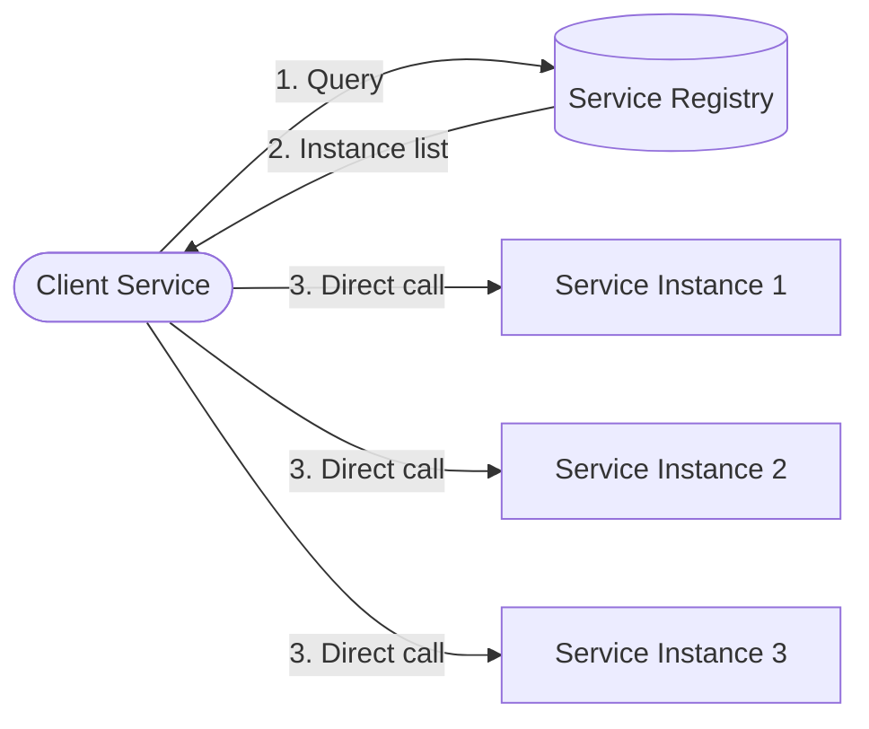
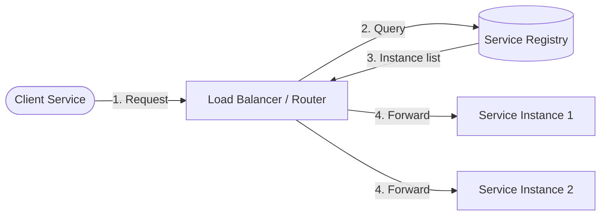
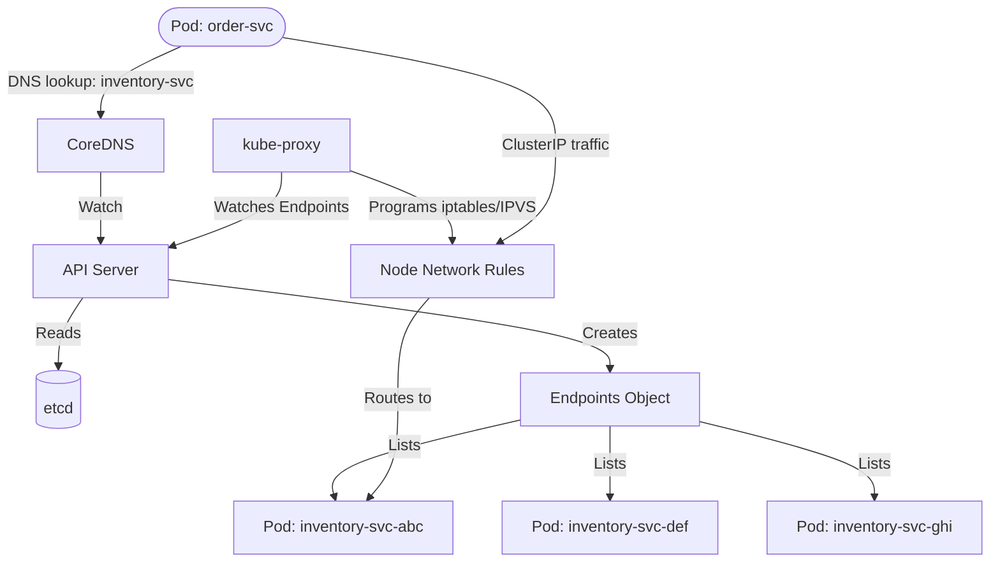

# Service Discovery (HLD)

## Quick Summary (TL;DR)

- Service discovery is the mechanism by which microservices **find each other at runtime** without hardcoding network locations -- essential when instances scale up/down or move across hosts.
- There are two fundamental patterns: **client-side discovery** (the caller picks an instance from the registry) and **server-side discovery** (a load balancer/proxy resolves instances on behalf of the caller).
- A **service registry** (Eureka, Consul, ZooKeeper, etcd) is the single source of truth for which instances are alive and where they listen.
- Health checks and heartbeats are the **immune system** of service discovery -- without them, the registry serves stale addresses and clients hit dead endpoints.
- In Kubernetes, service discovery is **built-in** via `kube-dns` and `Service` objects, largely replacing standalone registries for K8s-native workloads.

---

## Real-World Analogy

Think of service discovery as the **contact list on your phone**. In a small company (monolith), you only have one number to call -- the main office line. But in a large organization (microservices), there are hundreds of people, and their phone numbers (IP:port) change when they switch desks, get new phones, or leave the company.

A **service registry** is like a company-wide phone directory that updates in real time:

1. **Registration** -- When a new employee joins, they register their name and phone number in the directory.
2. **Discovery** -- When you need to call the finance department, you look up "finance" in the directory and get a list of current numbers.
3. **Health checks** -- The directory periodically pings everyone; if someone doesn't answer for 3 consecutive checks, their entry is removed.
4. **Deregistration** -- When someone leaves, they (or their manager) removes their entry.

Without this directory, you'd have to maintain a personal contact list (hardcoded config) and pray nobody changes their number.

---

## What and Why

In a monolithic architecture, all modules live in the same process, so inter-module calls are just function invocations. In microservices:

- Services run on **dynamically assigned** hosts and ports
- **Auto-scaling** adds/removes instances constantly
- **Container orchestrators** reschedule containers across nodes
- **Deployments** create new instances and destroy old ones

Hardcoding `http://192.168.1.42:8080` in a config file breaks the moment that instance moves. Service discovery solves this by providing a **dynamic, real-time lookup** for service locations.

---

## Client-Side vs Server-Side Discovery

These are the two fundamental patterns, and understanding the trade-offs is critical for interviews.

### Client-Side Discovery

The client queries the service registry directly, receives a list of available instances, and applies a load-balancing algorithm (round robin, random, weighted) to pick one.

**Examples**: Netflix Eureka + Ribbon/Spring Cloud LoadBalancer, HashiCorp Consul + custom client.

| Pros | Cons |
|---|---|
| No extra network hop (direct call) | Client coupled to registry API |
| Client controls LB algorithm | Every language/framework needs a discovery library |
| Registry cache survives brief registry outages | More complex client logic |

### Server-Side Discovery

The client sends requests to a load balancer or router, which queries the registry and forwards the request to an appropriate instance. The client has no idea how many instances exist.

**Examples**: AWS ALB + ECS service discovery, Kubernetes Services + kube-proxy, Nginx + Consul Template.

| Pros | Cons |
|---|---|
| Client stays simple (just a URL) | Extra network hop through LB |
| Language-agnostic (any client works) | LB is a potential bottleneck / SPOF |
| Centralized LB policy | More infrastructure to manage |

**Interview tip**: Most production systems use a hybrid. Kubernetes uses server-side discovery (Services), while Spring Cloud historically uses client-side (Eureka + LoadBalancer). Know both.

---

## Service Registry Patterns

The registry is the heart of service discovery. Here are the major implementations:

| Registry | Consensus Protocol | Health Checks | K/V Store | Language | Used By |
|---|---|---|---|---|---|
| **Eureka** (Netflix) | Peer-to-peer replication (AP) | Client heartbeat | No | Java | Netflix, Spring Cloud |
| **Consul** (HashiCorp) | Raft (CP with graceful degradation) | Agent-based (HTTP, TCP, gRPC, script) | Yes | Go | HashiCorp stack |
| **ZooKeeper** (Apache) | ZAB (CP) | Ephemeral znodes + session heartbeat | Yes (znode tree) | Java | Hadoop, Kafka (legacy), Solr |
| **etcd** (CNCF) | Raft (CP) | Lease-based TTL | Yes | Go | Kubernetes (backing store) |

### Eureka (AP -- Availability over Consistency)

- Services send heartbeats every 30 seconds; if Eureka misses 3 consecutive heartbeats (90s), it evicts the instance.
- **Self-preservation mode**: If Eureka detects that too many instances are failing heartbeats simultaneously (likely a network partition, not mass failure), it stops evicting and preserves the registry. This prevents cascading false evictions.
- Eureka servers replicate registrations peer-to-peer (no leader election), so every node can accept writes. This means **eventual consistency** -- a newly registered service might not appear on all Eureka nodes for a few seconds.
- **Runnable demo**: See `microservices/service-discovery-eureka/` in this repo for a working Eureka Server + clients (Inventory and Order services) with manual `DiscoveryClient` lookup.

### Consul (CP with Service Mesh)

- Uses Raft consensus for strong consistency of the service catalog.
- Agents run on every node (client mode) and forward to server nodes.
- Rich health checks: HTTP endpoint, TCP socket, gRPC health, TTL, script-based.
- Built-in DNS interface: `inventory.service.consul` resolves to healthy instances.
- Also provides service mesh (Consul Connect) with mTLS and intentions (authorization policies).

### ZooKeeper (CP -- Strong Consistency)

- Services create **ephemeral znodes** under a path like `/services/inventory/instance-1`.
- When the service's session expires (heartbeat failure), the ephemeral znode is automatically deleted.
- Clients set **watches** on the `/services/inventory` path and get notified of changes.
- Strong consistency via ZAB protocol, but operationally complex (requires 3+ node quorum, sensitive to GC pauses).
- Being phased out of many systems (Kafka replaced ZK with KRaft, newer systems prefer etcd or Consul).

### etcd (CP -- Kubernetes Backbone)

- Kubernetes stores ALL cluster state (including Service/Endpoint objects) in etcd.
- Supports **watch API** for real-time change notifications (how kube-proxy and CoreDNS stay updated).
- Lease-based TTL for ephemeral registrations.
- Simpler than ZooKeeper, but still requires careful capacity planning (etcd is sensitive to disk latency).

---

## Health Checking and Heartbeats

A registry that doesn't verify instance health is worse than useless -- it actively directs traffic to dead endpoints.

### Heartbeat Models

| Model | How It Works | Failure Detection | Example |
|---|---|---|---|
| **Client heartbeat (push)** | Service periodically sends "I'm alive" to the registry | Registry evicts after N missed beats | Eureka (30s interval, 90s eviction) |
| **Server health check (pull)** | Registry/agent actively probes the service endpoint | Marks unhealthy after N failed probes | Consul (HTTP/TCP/gRPC checks) |
| **Session-based** | Service holds a session; session expiry = death | Session timeout triggers cleanup | ZooKeeper (ephemeral znodes) |
| **Lease-based TTL** | Service acquires a lease with a TTL; must renew before expiry | Lease expiry = deregistration | etcd (lease grant + keep-alive) |

### What a Health Check Should Verify

A simple "200 OK" from `/health` is not enough. A robust health check should verify:

1. **Application readiness** -- Can the service actually handle requests? (not just "is the JVM running?")
2. **Dependency connectivity** -- Can it reach its database, cache, and downstream services?
3. **Resource availability** -- Is the thread pool exhausted? Is the disk full?

Spring Boot Actuator's `/actuator/health` endpoint does this well, aggregating checks for DB, Redis, disk space, and custom components.

### Graceful Shutdown

When a service shuts down (deployment, scaling down), it should:

1. **Deregister** from the registry immediately (don't wait for heartbeat expiry)
2. **Stop accepting new requests** (return 503 or remove from LB)
3. **Drain in-flight requests** (finish currently processing requests)
4. **Close connections** (database pools, message consumers)

Without graceful shutdown, clients will hit the dying instance for the entire heartbeat timeout window (up to 90 seconds in Eureka's default config).

---

## DNS-Based vs Registry-Based Discovery

| Dimension | DNS-Based | Registry-Based |
|---|---|---|
| **Mechanism** | Standard DNS SRV/A records | Custom API (REST, gRPC) |
| **TTL / Staleness** | DNS TTL caching (30s-300s typical) | Near real-time (watch/push) |
| **Client support** | Every language has a DNS resolver | Needs a client library |
| **Health integration** | Requires external health checker to update DNS | Built-in health checks |
| **Metadata** | Limited (just IP:port) | Rich (version, tags, weight, zone) |
| **Examples** | AWS Route 53, Consul DNS, CoreDNS | Eureka API, Consul HTTP API |

**Key insight**: DNS-based discovery is simpler and more universal, but the caching/TTL delay makes it unsuitable for highly dynamic environments. Registry-based discovery offers real-time updates and richer metadata but requires client-side integration.

**Hybrid approach**: Many systems expose both. Consul provides a full HTTP API AND a DNS interface. Kubernetes uses CoreDNS backed by the API server's Endpoints.

---

## How Kubernetes Does Service Discovery

In Kubernetes, service discovery is a **first-class platform feature**, not an add-on. Understanding this is essential for any modern system design interview.

### The Kubernetes Model

### Key Components

| Component | Role |
|---|---|
| **Service** (K8s object) | Stable virtual IP (ClusterIP) + DNS name for a set of Pods |
| **Endpoints / EndpointSlices** | Lists the actual Pod IPs backing a Service (auto-updated) |
| **CoreDNS** | Cluster DNS server; resolves `inventory-svc.default.svc.cluster.local` to ClusterIP |
| **kube-proxy** | Watches Endpoints, programs iptables/IPVS rules on each node to route ClusterIP traffic to Pods |
| **etcd** | Stores all Service/Endpoint state (the "registry") |

### DNS Resolution in K8s

A Pod can reach another service using:

- **Short name**: `inventory-svc` (within same namespace)
- **Namespaced**: `inventory-svc.production`
- **FQDN**: `inventory-svc.production.svc.cluster.local`

CoreDNS resolves these to the Service's ClusterIP. kube-proxy then load-balances across backing Pods using iptables (random) or IPVS (round-robin, least-connections, etc.).

### Headless Services

Setting `clusterIP: None` creates a **headless Service** -- DNS returns the individual Pod IPs directly instead of a virtual IP. This is used when clients need to know all instances (e.g., StatefulSets like Kafka brokers, Cassandra nodes).

### K8s vs Standalone Registries

| Aspect | Kubernetes Native | Standalone (Eureka/Consul) |
|---|---|---|
| **Registration** | Automatic (Pod creation = registration) | Application must register itself |
| **Health checks** | Liveness/readiness probes (kubelet) | Application heartbeat or agent probe |
| **DNS** | Built-in (CoreDNS) | Consul DNS or none |
| **Cross-cluster** | Needs federation or service mesh | Multi-datacenter built into Consul |
| **Non-K8s workloads** | Not supported natively | Full support |

**Interview tip**: If the system runs on Kubernetes, you typically don't need Eureka or Consul for service discovery -- K8s handles it natively. Mention standalone registries when discussing hybrid or non-K8s environments.

---

## Noob Jargon Buster

| Term | Plain English |
|---|---|
| **Service Registry** | A database of "which services are running and where" |
| **Heartbeat** | A periodic "I'm still alive" signal from a service to the registry |
| **Self-preservation** | Eureka's safety mode that stops evicting services during network partitions |
| **Ephemeral znode** | A ZooKeeper entry that auto-deletes when the creator disconnects |
| **ClusterIP** | A virtual IP address inside Kubernetes that routes to a set of Pods |
| **Headless Service** | A K8s Service that returns Pod IPs directly instead of a virtual IP |
| **SRV record** | A DNS record type that includes port information alongside IP addresses |
| **Sidecar proxy** | A helper process (like Envoy) running next to your service that handles discovery and routing |
| **AP vs CP** | CAP theorem trade-off: AP = stays available during partitions (Eureka); CP = stays consistent (ZooKeeper, etcd) |
| **Lease** | A time-limited ownership token; if not renewed, the system assumes the holder is dead |

---

## Interview Angles

1. **"You're designing a microservices platform. How would you handle service discovery?"**
   Start by clarifying the deployment environment. If Kubernetes, explain that K8s Services + CoreDNS handle it natively -- no external registry needed. If non-K8s (e.g., bare EC2), propose a registry like Consul or Eureka. Discuss client-side vs server-side discovery trade-offs. Mention health checks, graceful shutdown, and what happens during deployments (rolling updates).

2. **"Client-side vs server-side discovery -- when would you pick each?"**
   Client-side (Eureka + Spring Cloud LoadBalancer) gives you direct instance-to-instance calls with no extra hop, and the client can make intelligent LB decisions (e.g., zone-aware routing). Server-side (K8s Services, AWS ALB) is simpler for clients and language-agnostic but adds a network hop and centralizes the LB. Pick client-side when you need fine-grained LB control in a homogeneous tech stack; pick server-side when you have polyglot services or want operational simplicity.

3. **"What happens when a service goes down but hasn't deregistered?"**
   The registry relies on health checks to detect this. In Eureka, after 90 seconds of missed heartbeats, the instance is evicted -- unless self-preservation kicks in (Eureka thinks it's a network partition, not a real failure). In Consul, the agent's health check fails and the instance is marked critical. In ZooKeeper, the session expires and the ephemeral znode is deleted. The key follow-up: during this detection window, clients may still route to the dead instance, so clients should implement **retries with circuit breakers** to handle this gracefully.

4. **"Eureka is AP, ZooKeeper is CP. Which would you choose and why?"**
   For service discovery, **availability matters more than consistency**. A stale registry entry (pointing to an instance that just died) causes one failed request that a retry can fix. But a registry that's unavailable (CP system during a partition) means no discovery at all -- every new request fails. This is why Netflix chose AP (Eureka) over CP (ZooKeeper) for discovery. However, for leader election or distributed locking, CP is the right choice.

5. **"How does Kubernetes handle service discovery differently from Spring Cloud Eureka?"**
   In K8s, discovery is a platform concern: Pod creation automatically registers endpoints, CoreDNS resolves service names, and kube-proxy handles routing -- zero application code needed. In Spring Cloud Eureka, discovery is an application concern: each service must include the Eureka client library, register itself, send heartbeats, and query the registry. K8s is operationally simpler but only works for K8s workloads. Eureka works anywhere a JVM runs but adds code-level coupling.

---

## Traps

- **Saying "just use Eureka" without considering the deployment platform**: If you're on Kubernetes, Eureka is redundant overhead. Always ask about the infrastructure first.
- **Ignoring the heartbeat/health check window**: The time between an instance dying and the registry detecting it is a critical failure window. Not mentioning retries and circuit breakers here is a gap.
- **Confusing service discovery with load balancing**: Discovery answers "where are the instances?" Load balancing answers "which instance should handle this request?" They're related but distinct concerns.
- **Forgetting about cross-datacenter discovery**: Single-region discovery is easy. Multi-region discovery (Consul's WAN federation, K8s multi-cluster) is where complexity explodes. Mention it proactively.
- **Not mentioning graceful shutdown**: Candidates talk about registration but forget deregistration. A service that dies without deregistering causes avoidable errors for the entire heartbeat timeout.
- **Treating DNS-based discovery as a silver bullet**: DNS caching means stale entries. If your services scale rapidly, DNS TTL delays will cause traffic to hit non-existent instances.
