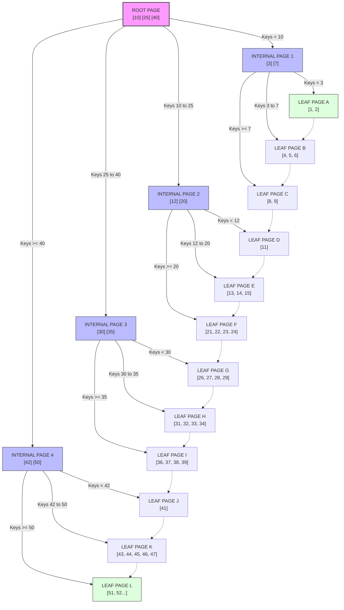

# Indexing & Storage Engines (DB Internals)

---

## Quick Summary (TL;DR)

- Databases store data on disk, and reading disk is **slow**. An **index** is a shortcut structure that helps the database find your data without scanning every single row.
- **Hash Index**: Think of a dictionary/phonebook — you know exactly which page to turn to. Lightning-fast for "give me this one thing" but useless for "give me everything between A and M."
- **B-Tree Index**: Think of a library filing system — organized, sorted, and great for both finding one thing and browsing a range. This is what PostgreSQL and MySQL use.
- **LSM Tree + SSTable**: Think of a "write first, sort later" system — blazing fast for writing tons of data, but reads need a bit more work. This is what Cassandra and RocksDB use.
- **No index is free** — every index speeds up reads but slows down writes, because the database has to update the index every time you insert/update/delete.

---

## 🤓 Noob Jargon Buster

* **Index**: A helper data structure that the database maintains *alongside* your actual data. Its only job is to make lookups faster. Like the index at the back of a textbook — it tells you which page to go to.
* **Byte Offset**: Just a number that says "the data you want starts at position X in the file." Think of it as a page number in a book.
* **Page (Block)**: Databases don't read one byte at a time from disk — they read in chunks called "pages" (usually 4 KB). Think of it like reading a full page of a book instead of one letter at a time.
* **Sequential I/O**: Reading/writing data that's right next to each other on disk (fast — like reading a book page by page).
* **Random I/O**: Reading/writing data scattered across the disk (slow — like flipping to random pages in a book).
* **WAL (Write-Ahead Log)**: Before the database changes anything, it writes "I'm about to do X" to a log file. If the database crashes, it can read this log and recover. Think of it as a diary that says "today I plan to do X" — even if you forget, you can check your diary.

---

## Real-World Analogy

Imagine you work at a massive warehouse with millions of parcels:

🏷️ **Hash Index** = You have a notebook where you've written: `parcel #12345 → shelf 7, slot 3`. Someone asks for parcel #12345? Flip open the notebook, find the entry, walk straight to shelf 7. **Instant.** But if someone asks "give me all parcels from shelf 1 to shelf 10"... your notebook entries are in random order, so you'd have to read the entire notebook. **Useless for ranges.**

📚 **B-Tree** = Your warehouse has a proper filing system. There's a main directory: "Parcels 1–1000 are in Aisle A, 1001–2000 in Aisle B..." You walk to Aisle A, and there's a sub-directory: "1–100 are on Shelf 1, 101–200 on Shelf 2..." Two or three steps and you've found your parcel. **Also great for ranges** — "all parcels 500–700" means just walk through part of Aisle A.

📦 **LSM Tree** = You have a small table at the entrance (the memtable). New parcels get dropped on this table. When the table fills up, you sort everything on it and move the whole batch to a shelf as a neat, sorted stack (an SSTable). Later, a worker merges multiple stacks into bigger, cleaner stacks (compaction). **Writing is super fast** (just toss it on the table), but finding something means checking the table first, then the newest stack, then the next newest stack...

---

## 1. Hash Index

### The Problem It Solves

You have a file on disk with key-value pairs (like `user:1 → Alice`). Without an index, finding user:1 means reading the **entire file** from start to finish. For a 100 GB file, that's terrible.

### How It Works (Step by Step)

**The idea is dead simple:** keep a hash map (dictionary) in memory that maps each key to its location in the file.

**Step 1 — Writing data:**

```
You want to store: user:1 = "Alice"

1. Append to the end of the data file:
   File: [...previous data...] [user:1 = "Alice" at byte position 5000]

2. Update the in-memory hash map:
   Hash Map: { "user:1" → 5000 }
               ↑ key       ↑ byte offset in file
```

**Step 2 — Reading data:**

```
You want to find: user:1

1. Look up "user:1" in the hash map → gets byte offset 5000
2. Jump to byte 5000 in the file → read "Alice"
Done! Just 1 disk read.
```

**Step 3 — Updating data:**

```
You want to update: user:1 = "Alice_v2"

1. DON'T overwrite the old entry (that would be random I/O, slow!)
2. Instead, APPEND to the end of the file:
   File: [...] [user:1 = "Alice" at 5000] [...] [user:1 = "Alice_v2" at 9200]

3. Update the hash map to point to the NEW location:
   Hash Map: { "user:1" → 9200 }  (was 5000, now 9200)
```

The old entry at byte 5000 is now "garbage" — it'll be cleaned up later.

**Step 4 — Deleting data:**

```
You want to delete: user:1

1. Append a special "tombstone" marker to the file:
   File: [...] [user:1 = TOMBSTONE at 12000]

2. Remove "user:1" from the hash map
```

The actual data is still on disk, but nothing points to it anymore.

### What About the File Growing Forever?

Great question! The file keeps growing because we only append. Two mechanisms handle this:

**Segment files:** When the data file gets too big, close it and start a new one.

```
Segment 1 (closed, read-only): [user:1=Alice, user:2=Bob, user:1=Alice_v2]
Segment 2 (active, writing):   [user:3=Charlie, ...]
```

**Compaction:** A background process merges old segments, keeping only the latest value for each key:

```
Before compaction:
  Segment 1: [user:1=Alice, user:2=Bob, user:1=Alice_v2]
  Segment 2: [user:2=Bobby, user:3=Charlie]

After compaction:
  Merged Segment: [user:1=Alice_v2, user:2=Bobby, user:3=Charlie]
  (only latest values survive)
```

### Why Can't Hash Index Do Range Queries?

Because hashing **destroys order**:

```
hash("user:1") = 7294
hash("user:2") = 3841
hash("user:3") = 9102

Even though user:1, user:2, user:3 are logically sequential,
their hash values are scattered randomly.

So "find all users from 1 to 100" means checking ALL entries
in the hash map — no better than a full scan.
```

### When to Use Hash Index

| ✅ Great For | ❌ Bad For |
|-------------|-----------|
| Key-value lookups ("get me user:42") | Range queries ("users 1 to 100") |
| Lots of updates to the same keys | When the number of distinct keys exceeds RAM |
| URL shortener, session store, caching | Sorting or ordering results |

**Real-world example:** **Bitcask** (Riak's storage engine) uses exactly this design.

---

## 2. B-Tree Index

### The Problem It Solves

We need an index that supports **both** point lookups ("find user 42") **and** range queries ("find all users between 20 and 50"). Hash indexes can't do ranges. B-Trees can.

### How It Works (Step by Step)

Think of a B-Tree as a **sorted tree of pages**. Each page is a fixed-size block on disk (usually 4 KB).

**The tree has three types of pages:**



**Finding a value (e.g., key = 12):**

```
Step 1: Start at ROOT page [10, 25, 40]
        12 is between 10 and 25 → follow the middle pointer
        (1 disk read)

Step 2: Land on INTERNAL page [12, 20]
        12 matches! → follow its pointer
        (1 disk read)

Step 3: Land on LEAF page → find key 12 → get pointer to actual row
        (1 disk read)

Total: 3 disk reads to find ANY key in a potentially billion-row table!
```

**Why only 3–4 reads?** A 4 KB page can hold ~500 key-pointer pairs. So:
- Level 1 (root): 500 pointers
- Level 2: 500 × 500 = 250,000 pointers
- Level 3: 500³ = 125,000,000 pointers
- Level 4: 500⁴ = **62.5 billion** pointers

So a 4-level B-Tree can index 62.5 billion rows — and the root is always cached in memory, so it's really just 2–3 disk reads.

**Range queries ("find keys 12 to 20"):**

```
Step 1: Find key 12 using the tree (same as above)
Step 2: Since leaf pages are linked together in sorted order,
        just walk forward through the leaf pages until you pass 20.

Leaf page 1: [..., 12, 13, 14, 15] → next page →
Leaf page 2: [16, 17, 18, 19, 20, ...] → done!
```

That's why B-Trees are amazing for range queries — the data is **sorted**.

### How Writes Work (In-Place Updates)

Unlike hash indexes (which append), B-Trees **update pages in place**:

```
INSERT key = 8:

Step 1: Find the correct leaf page (the one with [3, 7])
Step 2: Insert 8 in sorted order → [3, 7, 8]
Step 3: Write the modified page back to disk

But what if the page is FULL?
```

**Page splitting** (this is the tricky part):

```
Leaf page is full: [3, 5, 7, 8, 9]  (max 5 keys)
We need to insert key 6.

Step 1: Split the page in half:
  Left page:  [3, 5, 6]
  Right page: [7, 8, 9]

Step 2: Push the middle key (7) up to the parent:
  Parent: [..., 7, ...]  ← new separator key
            ↙     ↘
  [3, 5, 6]    [7, 8, 9]
```

### Crash Safety: Write-Ahead Log (WAL)

What if the database crashes mid-write while a page is half-updated? The data would be corrupted.

**Solution:** Before modifying any page, write the intended change to a **WAL file** first.

```
1. Write to WAL: "I'm going to change page 42: insert key 8"
2. Actually modify page 42 on disk
3. If crash happens between steps 1 and 2:
   → On restart, replay the WAL and complete the change
```

### When to Use B-Tree

| ✅ Great For | ❌ Drawbacks |
|-------------|-------------|
| Point lookups (find one key) | Writes are slower (random I/O to update pages) |
| Range queries (find keys 10 to 50) | Page splits cause write amplification |
| Sorting and ORDER BY | Each index slows down INSERT/UPDATE/DELETE |
| The default choice for most databases | Pages can become partially empty (fragmentation) |

**Used by:** PostgreSQL, MySQL (InnoDB), Oracle, SQL Server — virtually every relational database.

---

## 3. LSM Tree + SSTable

### The Problem It Solves

B-Trees do random I/O on every write (jump to a specific page and update it). For **write-heavy workloads** (logs, time-series data, IoT sensors), this becomes a bottleneck. We want writes to be as fast as possible.

**Key insight:** Sequential I/O (writing data one after another) is 100–1000× faster than random I/O on both HDDs and SSDs.

### How It Works (Step by Step)

#### The Write Path (this is the clever part)


**Step 1 — Write arrives:**

```
INSERT user:42 = "Alice"
```

**Step 2 — Write to WAL (for crash safety):**

```
WAL file (append-only): 
  [...previous entries...]
  [INSERT user:42 = "Alice"]
  
This is fast because it's just appending (sequential I/O).
If we crash, we can reconstruct from the WAL.
```

**Step 3 — Insert into the Memtable (in-memory sorted structure):**

```
Memtable (a red-black tree or skip list in RAM):

     user:20 = "Bob"
    /                \
user:10 = "Dan"   user:42 = "Alice"  ← just inserted
                      \
                   user:55 = "Eve"

Data is kept SORTED in memory. This is fast because it's RAM.
```

**Step 4 — When the Memtable gets too big, FLUSH it to disk as an SSTable:**

```
Memtable is full (e.g., 64 MB)!

1. Freeze the current memtable (no more writes to it)
2. Create a new empty memtable for incoming writes
3. Write the frozen memtable to disk as a SORTED file:

SSTable file on disk:
  [user:10 = "Dan"]
  [user:20 = "Bob"]
  [user:42 = "Alice"]
  [user:55 = "Eve"]
  ... (all sorted by key)

This is FAST because we're writing the entire file sequentially!
```

#### What's Inside an SSTable?

An SSTable is just a sorted, immutable file with some helper structures:

```
┌─────────────────────────────────────────────┐
│  SSTable File                               │
│                                             │
│  📦 Data blocks: sorted key-value pairs     │
│     Block 1: [alice, bob, charlie]          │
│     Block 2: [dave, eve, frank]             │
│                                             │
│  📍 Sparse index: "Block 1 starts at        │
│     byte 0, Block 2 at byte 4096"           │
│     (so you can binary search)              │
│                                             │
│  🌸 Bloom filter: a compact structure that  │
│     can quickly tell you "this key is        │
│     DEFINITELY NOT in this file"            │
│                                             │
│  📋 Footer: metadata                        │
└─────────────────────────────────────────────┘
```

**Key property: SSTables are IMMUTABLE** — once written, they never change. This means:
- No locking needed for reads (multiple threads can read safely)
- Great for compression (sorted data compresses well)
- Simple to reason about (a file is either there or it isn't)

#### The Read Path (this is the tricky part)

When you read a key, the database has to check multiple places:

```
Looking for user:42...

Step 1: Check the MEMTABLE (in-memory, fast)
        → Found? Return it. Done!
        → Not found? Continue...

Step 2: Check the most RECENT SSTable on disk
        a) Ask the Bloom filter: "Is user:42 in this file?"
           → "Definitely NOT here" → skip this file entirely
           → "Maybe here" → continue
        b) Use the sparse index to find the right data block
        c) Scan the data block for user:42
        → Found? Return it. Done!
        → Not found? Continue...

Step 3: Check the next SSTable (older one)
        → Repeat Bloom filter → sparse index → scan

Step 4: Keep going through older and older SSTables...
```

**This is why reads can be slower** — in the worst case, you check the memtable + every SSTable on disk. Bloom filters help a LOT by skipping SSTables that definitely don't have your key.

#### What is a Bloom Filter? (Simple Explanation)

Think of it as a bouncer at a club:
- If the bouncer says **"You're NOT on the list"** → you're definitely not on the list (no false negatives)
- If the bouncer says **"You MIGHT be on the list"** → you need to actually check inside (possible false positive)

A Bloom filter uses very little memory and can eliminate 99%+ of unnecessary SSTable lookups.

#### Compaction (Keeping Things Tidy)

Over time, you accumulate many SSTables. This causes two problems:
1. **Reads get slower** (more files to check)
2. **Space wasted** (old versions of updated keys still on disk)

**Compaction** solves this by merging SSTables:

```
Before compaction:
  SSTable 1 (old): [a=1, b=2, c=3]
  SSTable 2 (new): [b=5, d=7]       ← b was updated

After compaction (merge-sort, keep latest):
  Merged SSTable:  [a=1, b=5, c=3, d=7]
                         ↑ latest value of b wins

Old SSTables are deleted.
```

This is like **merge sort** — because both files are already sorted, merging is efficient (just walk through both files simultaneously).

**Two compaction strategies:**

| Strategy | Plain English | Used By |
|----------|-------------|---------|
| **Size-Tiered** | Merge files of similar size together | Cassandra |
| **Leveled** | Organize files into levels; each level has a size limit | RocksDB, LevelDB |

### When to Use LSM Tree

| ✅ Great For | ❌ Drawbacks |
|-------------|-------------|
| Write-heavy workloads (logs, events, IoT) | Reads can be slower (check multiple SSTables) |
| Sequential I/O = very fast writes | Compaction uses CPU and disk in the background |
| Great compression (sorted data) | Latency can spike during compaction |
| Immutable files = simple concurrency | Space temporarily doubles during compaction |

**Used by:** LevelDB (Google), RocksDB (Meta), Cassandra, HBase, ScyllaDB, CockroachDB.

---

## 4. Side-by-Side Comparison

| Question | Hash Index | B-Tree | LSM Tree + SSTable |
|----------|-----------|--------|-------------------|
| **"Find user:42"** | ⚡ Fastest (O(1) hash lookup) | 🔵 Fast (3–4 page reads) | 🟡 Slower (check memtable + SSTables) |
| **"Find users 10 to 50"** | ❌ Can't do this | ⚡ Excellent (sorted leaves) | 🔵 Good (SSTables are sorted) |
| **"Write 1 million rows"** | 🔵 Fast (append to file) | 🟡 Moderate (random I/O per write) | ⚡ Fastest (sequential writes) |
| **Must fit in RAM?** | ⚠️ Yes (hash map in memory) | ✅ No (only top levels cached) | ✅ No (only memtable in RAM) |
| **Crash recovery** | Rebuild hash map from file | Replay WAL | Replay WAL → rebuild memtable |
| **Typical use case** | Session store, cache | PostgreSQL, MySQL (OLTP) | Cassandra, time-series DBs |

### Decision Helper

```
Q: What's your main need?

→ "I just do simple key lookups, keys fit in RAM"
  → Hash Index (Bitcask, Redis)

→ "I need both lookups AND range queries, read-heavy"
  → B-Tree (PostgreSQL, MySQL)

→ "I have tons of writes (logs, events, IoT)"
  → LSM Tree (Cassandra, RocksDB)
```

---

## Interview Angles

1. **"When would you choose LSM over B-Tree?"**
   → When the workload is **write-heavy** (time-series, event logs, IoT). LSM's sequential writes can be 10–100× faster. Trade-off: reads are less predictable.

2. **"Why can't a hash index support range queries?"**
   → Hashing destroys key order. `hash("user:5")` and `hash("user:6")` end up at completely unrelated positions, so scanning from 5 to 6 requires checking everything.

3. **"What is compaction and why does it matter?"**
   → Compaction merges SSTables, keeps only the latest value per key, and reclaims space. Without it, you'd accumulate thousands of small files and reads would be painfully slow.

4. **"Walk me through the write path of an LSM Tree."**
   → Write → append to WAL (durability) → insert into memtable (sorted, in-memory) → when memtable is full, flush to disk as sorted SSTable → background compaction merges SSTables.

5. **"What is a Bloom filter and how does it help?"**
   → A space-efficient probabilistic structure. It can say "this key is definitely NOT in this SSTable" without reading the file. Eliminates 99%+ of unnecessary disk reads during point lookups.

6. **"What's the difference between a clustered and non-clustered index?"**
   → Clustered index (e.g., InnoDB primary key): leaf pages store the **actual row data**. Non-clustered (secondary) index: leaf pages store a pointer → requires a second lookup to get the full row.

---

## Common Traps (Don't Say This in Interviews!)

1. ❌ **"LSM Trees are always faster than B-Trees"**
   ✅ Only for writes. B-Trees have more predictable read latency.

2. ❌ **"Bloom filters guarantee a key exists"**
   ✅ Bloom filters can have false positives ("maybe yes") but never false negatives ("definitely no").

3. ❌ **"Compaction is free"**
   ✅ Compaction eats CPU and disk bandwidth. Misconfigured compaction is a top cause of latency spikes in production.

4. ❌ **"B-Tree writes are just one disk I/O"**
   ✅ A write touches WAL (sequential) + leaf page (random) + possibly parent pages (if split). That's 2+ I/Os.

5. ❌ **"More indexes = faster database"**
   ✅ Each index speeds up reads for specific queries but slows down ALL writes. Every INSERT/UPDATE/DELETE must update every index.

---
