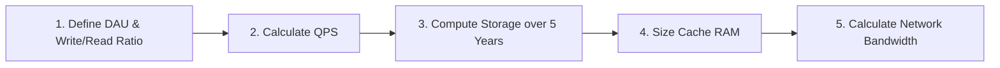

# Back-of-the-Envelope Estimation (HLD)

## Quick Summary (TL;DR)
- SDE-2 interviews require you to estimate QPS, storage, bandwidth, and memory before writing down your architecture.
- **QPS Rule of Thumb**: 1 Million requests per day $\approx 12$ QPS.
- **Power of Two Rule**: 
  - $2^{10} = \text{1 KB}$ (Thousand)
  - $2^{20} = \text{1 MB}$ (Million)
  - $2^{30} = \text{1 GB}$ (Billion)
  - $2^{40} = \text{1 TB}$ (Trillion)
- **Cache sizing**: Sizing for the hot working set using the **80/20 rule** (cache 20% of the active data).
- **Latency Rule of Thumb**: Memory reads are in nanoseconds (ns), SSD reads in milliseconds (ms), HDD reads and global network roundtrips in tens/hundreds of milliseconds.

---

## 🤓 Noob Jargon Buster

* **Throughput (QPS)**: The number of queries/requests processed by a system per second.
* **Ingress**: Incoming traffic to your servers (uploads/writes).
* **Egress**: Outgoing traffic from your servers (downloads/reads).
* **Working Set**: The active subset of data that is frequently accessed by clients (typically cached in RAM).

---

## 1. Quick QPS Conversions (Cheat Sheet)

Instead of doing long division during the interview, memorize these pre-calculated benchmarks for daily active traffic:

| Requests per Day | Average QPS | Peak QPS (Average $\times$ 2) |
| :--- | :--- | :--- |
| **1 Million** | $\approx 12$ QPS | $\approx 24$ QPS |
| **10 Million** | $\approx 116$ QPS | $\approx 232$ QPS |
| **100 Million** | $\approx 1,160$ QPS | $\approx 2,320$ QPS |
| **1 Billion** | $\approx 11,600$ QPS | $\approx 23,200$ QPS |

### How to calculate QPS on-the-fly:
$$\text{Average QPS} = \frac{\text{Total Requests per Day}}{86,400 \text{ seconds}}$$
*Interview Shortcut*: Round $86,400$ to **$100,000$** to do quick mental math (e.g., $100\text{M} / 100,000 = 1,000\text{ QPS}$ — very close to the actual $1,160$).

---

## 2. Data Type & Payload Sizes (Standard Estimates)

When estimating database storage or cache capacity, use these standard sizes:

| Data Type | Estimated Size | Notes |
| :--- | :--- | :--- |
| **Boolean** | 1 byte | |
| **Integer** | 4 bytes | |
| **Long / Timestamp** | 8 bytes | |
| **UUID** | 36 bytes | Stored as string |
| **Short text (Username, email)**| 100 bytes | |
| **Long URL** | 500 bytes | |
| **Average DB Row (Metadata)** | 500 bytes to 1 KB | User profiles, message schemas, metadata |
| **Compressed Photo** | 200 KB to 500 KB | High-resolution can reach 2 MB+ |
| **Streaming Video (1 min)** | 5 MB to 20 MB | Varies heavily by bitrate/compression |

---

## 3. Latency Numbers Every Programmer Must Know

Understanding scale means knowing how slow hardware really is. Reading from disk is like traveling across the country compared to reading from RAM.

```
+-------------------------------------------------------------+
| L1 Cache Reference              | 0.5 ns                    |
| L2 Cache Reference              | 7 ns                      |
| Main Memory (RAM) Reference     | 100 ns                    |
| Read 1 MB Sequentially from RAM | 250,000 ns   (0.25 ms)    |
| Read 1 MB Sequentially from SSD | 1,000,000 ns (1.0 ms)     |
| Read 1 MB Sequentially from HDD | 20,000,000 ns (20.0 ms)   |
| Round Trip Network (US -> EU)   | 150,000,000 ns (150 ms)   |
+-------------------------------------------------------------+
```

### Key takeaways for design choices:
1. **RAM is 10,000x faster than disk**. This is why caching layers (Redis/Memcached) are vital for `< 10ms` response times.
2. **Sequential reads are faster than random reads**. This is why LSM-Trees (used in Cassandra/RocksDB) write data sequentially, outperforming B-Trees (used in Postgres/MySQL) on write-heavy workloads.
3. **Avoid cross-region network calls**. Direct network roundtrips across regions add $\approx 150\text{ ms}$ overhead, which defeats low-latency goals. (Mitigate by replicating database read replicas locally).

---

## 4. The 5-Step Estimation Framework

If the interviewer asks you to estimate scale, follow this structured pattern:



### Step 1: Establish Scale
Define your daily active users (DAU) and their activity ratio:
* *"Assume 100 million DAU. On average, 10% of users write data, and each active user reads 10 times a day."*

### Step 2: Compute QPS
Calculate both read and write QPS:
* Write QPS: $\frac{100\text{M} \times 10\%}{100,000} = 100\text{ writes/sec}$.
* Read QPS: $\frac{100\text{M} \times 10 \text{ reads}}{100,000} = 10,000\text{ reads/sec}$.

### Step 3: Compute Storage (5 Years)
Find your data ingress per day and scale it:
* **Writes**: 10 Million items per day.
* **Item size**: 500 bytes.
* **Daily Ingress**: $10\text{M} \times 500 \text{ bytes} = 5\text{ GB/day}$.
* **5-Year Storage**: $5\text{ GB/day} \times 365 \text{ days} \times 5 \text{ years} \approx 9 \text{ TB}$.
* *SDE-2 Tip*: Add 30% overhead for database indexing and replication replication metadata = $\approx 11.7\text{ TB}$.

### Step 4: Compute Cache Memory (80/20 Rule)
Cache 20% of your daily read traffic volume:
* **Daily Reads**: 1 Billion reads/day.
* **Record Size**: 500 bytes.
* **Total Daily Read Payload**: $1\text{B} \times 500 \text{ bytes} = 500\text{ GB}$.
* **Cache Requirement (20%)**: $20\% \times 500\text{ GB} = 100\text{ GB}$ of RAM.

### Step 5: Compute Network Bandwidth
Calculate the network connection throughput needed:
* **Egress (Download)**: $10,000\text{ read requests/sec} \times 500\text{ bytes/request} = 5\text{ MB/sec}$.
* **Bandwidth (in bits)**: $5\text{ MB/sec} \times 8 = 40\text{ Mbps}$ (Megabits per second).

---

## 5. Common Interview Traps

1. **Precision Overkill**: Trying to calculate exact numbers (e.g. dividing by $86,400$ manually). It wastes time. Always round to $100,000$ or simplify fractions ($365 \times 5 \approx 1,800$).
2. **Forgetting Egress Bandwidth**: Only calculating storage writes but ignoring how much outbound data your network interface cards (NICs) must handle.
3. **Ignoring Database Replication Overhead**: Estimating storage capacity for only one database node. In production, with a replication factor of 3, you need $3\text{x}$ the estimated storage capacity.
