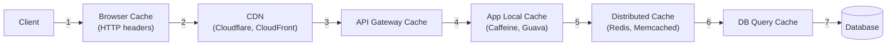
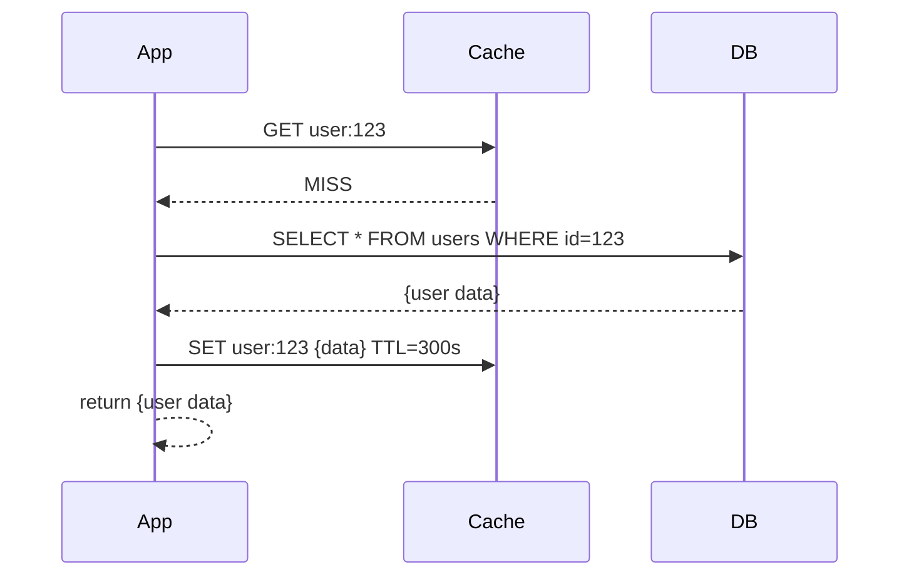
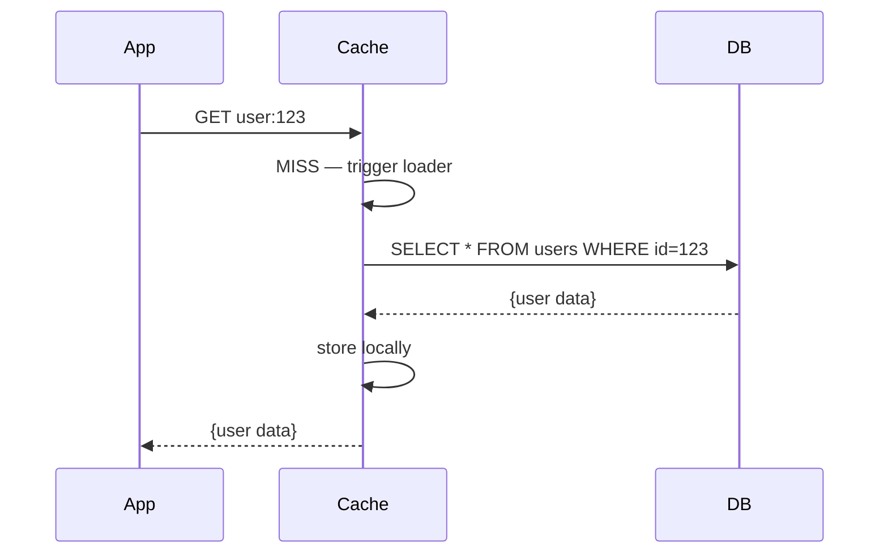
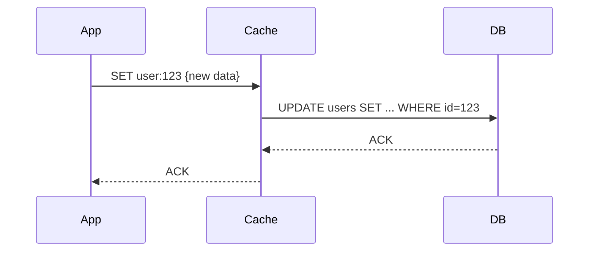
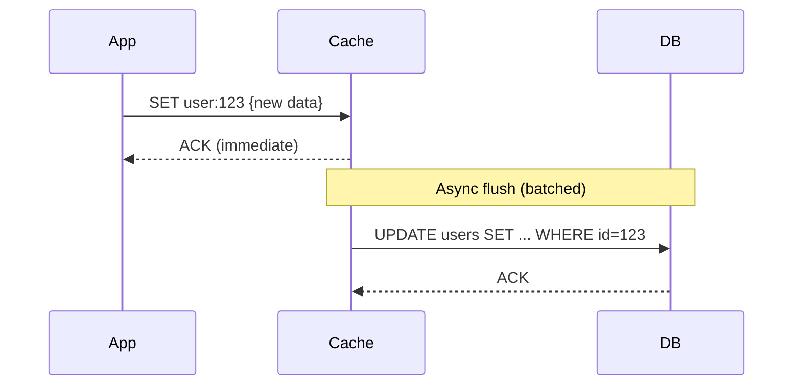
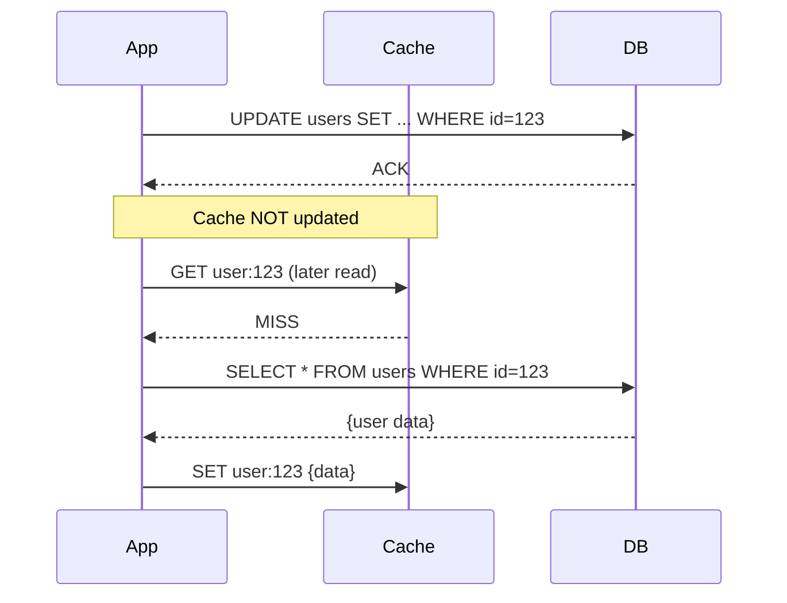
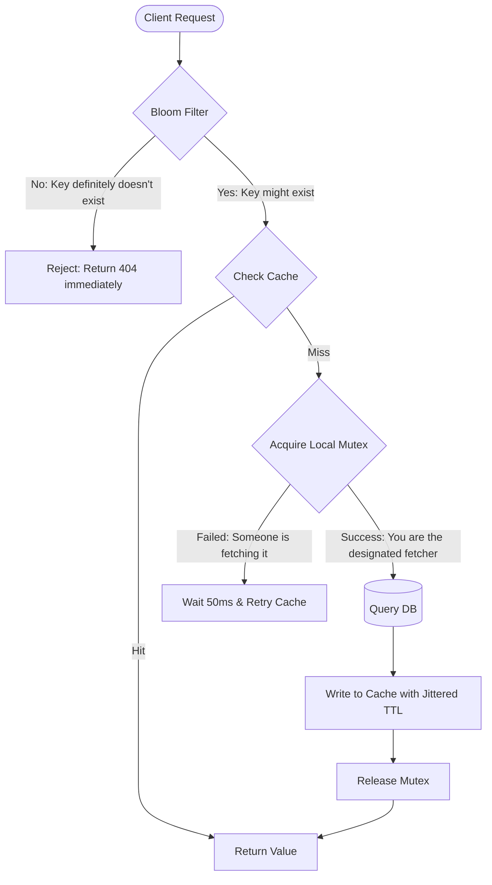

# Caching (HLD)

## Quick Summary (TL;DR)

- Caching stores frequently accessed data closer to the consumer, reducing latency from hundreds of milliseconds to sub-millisecond reads.
- The most common pattern is **Cache-Aside (Lazy Loading)** -- the application checks the cache first, falls back to DB on a miss, then populates the cache.
- Cache invalidation is genuinely hard; prefer short TTLs with event-driven invalidation over manual purging.
- **Thundering herd** (cache stampede) can take down your DB after a popular key expires -- solve with locking, request coalescing, or staggered TTLs.
- Redis is the default choice for most distributed caching needs; Memcached still wins for simple, multi-threaded, flat key-value workloads.

---

## Real-World Analogy

Think of a **kitchen counter** vs. a **pantry** vs. a **grocery store**.

You keep the ingredients you use most often on the counter (L1 / local cache). Less frequent items go in the pantry (distributed cache / Redis). The grocery store (database) has everything, but each trip is expensive and slow. You restock the counter from the pantry, and the pantry from the store -- only when you actually need something.

---

## What and Why

| Problem | How Caching Helps |
|---------|-------------------|
| High read latency | Serve from memory instead of disk/network |
| Database overload on read-heavy workloads | Offload repeated queries to cache |
| Expensive computations | Store computed results (e.g., recommendation scores) |
| Cost | Fewer DB read replicas needed; CDN reduces origin traffic |
| User experience | Sub-millisecond responses for hot data |

**Rule of thumb**: If your read:write ratio exceeds 10:1 on a dataset, caching will likely pay off.

---

## Caching Layers

Requests pass through multiple caching layers before hitting the database.

| Layer | Scope | Typical TTL | Example |
|-------|-------|-------------|---------|
| Browser cache | Per user | Minutes to days | `Cache-Control: max-age=3600` |
| CDN | Global edge | Seconds to hours | Static assets, API responses |
| API Gateway | Per route | Seconds | Rate-limited endpoints |
| Application (local) | Per instance | Seconds to minutes | Caffeine / Guava in-process |
| Distributed cache | Cluster-wide | Minutes to hours | Redis, Memcached |
| DB query cache | Per DB node | Varies | MySQL query cache (deprecated in 8.0) |

---

## Cache Strategies

### 1. Cache-Aside (Lazy Loading)

The **most common** pattern. The application owns the caching logic.

- **Read**: Check cache -> miss -> read DB -> write to cache -> return.
- **Write**: Write to DB -> invalidate (delete) cache key.

**Pros**: Only caches what is actually requested; simple to implement.
**Cons**: Cache miss = 3 round trips; potential for stale data between write and invalidation.

### 2. Read-Through

The cache itself is responsible for loading data on a miss. The application always talks to the cache.

**Pros**: Application code is simpler (no DB fallback logic).
**Cons**: Cache library must support data-loader plugins; harder to debug.

### 3. Write-Through

Every write goes to the cache **and** DB synchronously before acknowledging.

**Pros**: Cache is always consistent with DB; no stale reads.
**Cons**: Higher write latency (two synchronous writes); cache may hold data that is never read.

### 4. Write-Behind (Write-Back)

Write to cache immediately; flush to DB asynchronously in batches.

**Pros**: Very fast writes; batching reduces DB load.
**Cons**: Risk of data loss if cache node crashes before flush; eventual consistency.

### 5. Write-Around

Write directly to DB; cache is only populated on subsequent reads (cache-aside on the read path).

**Pros**: Avoids polluting cache with write-heavy data that may never be read.
**Cons**: First read after a write is always a miss.

### Strategy Comparison

| Strategy | Read Latency | Write Latency | Consistency | Data Loss Risk | Best For |
|----------|-------------|---------------|-------------|----------------|----------|
| Cache-Aside | Miss = slow, Hit = fast | N/A (write goes to DB) | Eventual | None | General purpose, read-heavy |
| Read-Through | Miss = slow, Hit = fast | N/A | Eventual | None | Simplified app code |
| Write-Through | Always fast | High (sync 2x) | Strong | None | Consistency-critical writes |
| Write-Behind | Always fast | Low (async) | Eventual | **Yes** (crash) | Write-heavy, loss-tolerant |
| Write-Around | Miss = slow, Hit = fast | Normal (DB only) | Eventual | None | Write-heavy, infrequent re-reads |

---

## Eviction Policies

When cache memory is full, something must be evicted.

| Policy | How It Works | Best For |
|--------|-------------|----------|
| **LRU** (Least Recently Used) | Evicts the key not accessed for the longest time | General purpose (default in Redis) |
| **LFU** (Least Frequently Used) | Evicts the key with the lowest access count | Hot/cold data with stable access patterns |
| **FIFO** (First In First Out) | Evicts the oldest inserted key | Simple, time-ordered data |
| **TTL-based** | Keys expire after a fixed duration | Session data, tokens, rate-limit counters |
| **Random** | Evicts a random key | When access patterns are uniform |

**Interview tip**: Redis supports `volatile-lru`, `allkeys-lru`, `volatile-lfu`, `allkeys-lfu`, `volatile-ttl`, `volatile-random`, `allkeys-random`, and `noeviction`. Know at least LRU vs LFU and when you would pick each.

---

## Cache Invalidation

> "There are only two hard things in Computer Science: cache invalidation and naming things." -- Phil Karlton

### Approaches

| Approach | Mechanism | Trade-off |
|----------|-----------|-----------|
| **TTL-based** | Key expires after N seconds | Simple but stale window = TTL duration |
| **Event-driven** | Publish invalidation event on write (Kafka, Redis Pub/Sub) | Near real-time; adds infra complexity |
| **Version-based** | Append version to cache key (`user:123:v7`) | Never stale; old versions waste memory |
| **Manual purge** | API call or admin tool deletes keys | Last resort; error-prone at scale |

**Best practice**: Combine short TTL (safety net) with event-driven invalidation (freshness).

---

## Thundering Herd / Cache Stampede

**What happens**: A popular cache key expires. Hundreds of concurrent requests see a miss simultaneously and all hit the DB, potentially causing a cascading failure.

### Solutions

| Solution | How It Works |
|----------|-------------|
| **Mutex / distributed lock** | First request acquires a lock, fetches from DB, populates cache. Others wait or get stale data. |
| **Request coalescing** | Deduplicate in-flight requests for the same key; only one actually queries the DB. |
| **Staggered TTL** | Add random jitter to TTL (`base_ttl + random(0, 60s)`) so keys don't expire at the same instant. |
| **Early recomputation** | Background refresh before TTL expires (probabilistic early expiration). |

**Interview tip**: Mention that Redis does not natively solve stampede -- you need application-level locking (e.g., Redisson `RLock`, or a simple `SETNX` guard).

---

## Redis vs Memcached

| Feature | Redis | Memcached |
|---------|-------|-----------| 
| Data structures | Strings, Hashes, Lists, Sets, Sorted Sets, Streams, HyperLogLog | Strings only (flat key-value) |
| Persistence | RDB snapshots + AOF | None (pure in-memory) |
| Replication | Master-replica with automatic failover (Sentinel / Cluster) | No built-in replication |
| Clustering | Redis Cluster (hash-slot sharding) | Client-side consistent hashing |
| Pub/Sub | Yes | No |
| Lua scripting | Yes | No |
| Threading model | Single-threaded event loop (I/O threads in 6.0+) | Multi-threaded |
| Max value size | 512 MB | 1 MB (default) |
| Best for | Rich data models, pub/sub, persistence, sorted leaderboards | Simple, high-throughput, multi-threaded flat caching |

**When to pick Memcached**: You need a simple, multi-threaded cache for flat string values and your workload is embarrassingly parallel (e.g., session store with no cross-key operations).

**When to pick Redis**: Almost everything else -- you need data structures, persistence, pub/sub, or Lua scripting.

---

## Cache Consistency

Caches introduce **eventual consistency** by definition. Strategies to manage staleness:

| Technique | Description |
|-----------|-------------|
| **Delete-on-write** | On DB write, delete the cache key. Next read repopulates. Simple and safe. |
| **Update-on-write** | On DB write, update the cache key. Risks race conditions if two writers conflict. |
| **Double-delete** | Delete cache key, write to DB, sleep briefly, delete again. Handles race where a stale read repopulates cache between DB write and invalidation. |
| **Read-your-writes** | After a write, subsequent reads from the same session bypass cache and read DB directly. |

**Preferred pattern**: Delete-on-write + short TTL. Avoid update-on-write unless you can guarantee single-writer semantics.

### The Classic Race Condition

1. Thread A reads cache -- MISS.
2. Thread A reads DB (gets old value).
3. Thread B writes new value to DB.
4. Thread B deletes cache key.
5. Thread A writes old value to cache.

Result: Cache now holds stale data. **Solution**: Double-delete or versioned keys.

---

## SDE-2 Caching Deep Dive (The Details)

In an SDE-2 interview, you must be ready to do the math to size your cache, select the correct eviction policy, and defend against security and scaling traps.

### 1. Back-of-the-Envelope Cache Sizing
*Scenario*: Cache the product catalog for an e-commerce platform.
- **Data Size**: 10 million products.
- **Metadata Size**: Average cached payload is a JSON string of 2 KB.
- **Pareto Principle**: 20% of the products (2 million) generate 80% of the traffic.
- **Cache Strategy**: Cache the hot 20% working set.

**Calculation**:
$$\text{Memory} = 2,000,000 \text{ products} \times 2 \text{ KB/product} = 4,000,000 \text{ KB} \approx 4 \text{ GB}$$
- **Redis Overhead Factor**: Redis metadata structures (dict entries, robj headers) and buffer pools add ~30% overhead.
- **Total RAM Needed**: $4 \text{ GB} \times 1.3 = 5.2 \text{ GB}$.
- **Hardware Selection**: Pick an AWS `cache.m6g.large` instance (6.38 GB RAM) rather than sizing a massive 32 GB server unnecessarily.

---

### 2. Redis Eviction Policies: When to Use What
When the memory limit (`maxmemory`) is reached, Redis evicts keys according to your configured policy:

| Policy | How It Works | Best Use Case |
| :--- | :--- | :--- |
| **`allkeys-lru`** | Evicts least recently used keys across the entire dataset. | Default choice for standard web caches. |
| **`volatile-lru`** | Evicts least recently used keys *only* if they have an expiration (TTL) set. | Used when Redis acts as a shared database AND a cache (avoid evicting keys that must persist). |
| **`allkeys-lfu`** | Evicts least *frequently* used keys. Prevents eviction of hot keys if they were just read, solving the "one-time scan" cache pollution problem. | Best when traffic has clear, long-term popular items (e.g., viral videos, top products). |
| **`noeviction`** | Returns an out-of-memory error on writes. | Use only when Redis is a database and data loss is unacceptable. |

---

### 3. Cache Defense Architectures

#### Cache Penetration (Malicious queries for non-existent keys)
- **Problem**: Attacker queries `/users/invalid_id` repeatedly. Since it doesn't exist, it misses the cache every time and strikes the DB.
- **SDE-2 Mitigation**:
  1. **Cache Empty Results**: Store a placeholder (e.g., `key -> "NULL"`) in Redis with a short TTL (e.g., 5 mins).
  2. **Bloom Filter**: Use a space-efficient probabilistic data structure at the API Gateway. If the Bloom filter says the key does not exist, reject the request immediately without checking Redis or the DB.

#### Cache Avalanche (Simultaneous expiration or cluster crash)
- **Problem**: A cache instance crashes or a batch job sets a fixed 24-hour expiration on 1M items, causing all items to expire at midnight, flooding the DB.
- **SDE-2 Mitigation**:
  1. **TTL Jitter**: Add a small random noise (jitter) to the expiration: `TTL = Base_TTL + Random(-30s, +30s)`.
  2. **High Availability (HA)**: Use Redis Cluster with master-follower replication across availability zones.

---

## Interview Angles

- **"Design a caching layer for X"**: Start with cache-aside + Redis. Justify TTL choice. Mention invalidation strategy (event-driven + TTL safety net). Address thundering herd.
- **"How do you keep cache consistent with DB?"**: Delete-on-write + TTL. Mention the double-delete pattern if pressed. Acknowledge eventual consistency is usually acceptable.
- **"Cache-aside vs read-through?"**: Cache-aside gives the app full control and is easier to reason about. Read-through simplifies app code but couples you to the cache library's loader mechanism.
- **"What happens when your Redis node goes down?"**: Requests fall through to DB (graceful degradation). Use Redis Sentinel or Cluster for HA. Application should handle cache misses as a normal path, not an exception.
- **"How would you size your cache?"**: Estimate working set (hot data). Use the 80/20 rule -- 20% of keys serve 80% of traffic. Monitor hit ratio; target above 95%.
- **"Local cache vs distributed cache?"**: Local is faster (no network hop) but inconsistent across instances. Use local for immutable/config data with short TTL. Use distributed for shared mutable state.

---

## Traps

- **Caching everything**: Not all data benefits from caching. Write-heavy, rarely-read data pollutes the cache and wastes memory.
- **Infinite TTL**: Leads to stale data that never refreshes. Always set a TTL, even if it is long (hours/days).
- **Cache as source of truth**: Cache is ephemeral. It can be evicted, the node can crash. Never treat the cache as durable storage.
- **Ignoring cold-start**: After a deploy or cache flush, all requests hit the DB simultaneously. Pre-warm critical keys.
- **Serialization overhead**: JSON serialization/deserialization can negate caching benefits for complex objects. Consider binary formats (Protobuf, Kryo) for large payloads.
- **Single large Redis instance**: Vertical scaling has limits. Use Redis Cluster or application-level sharding before you hit memory ceilings.
- **Not monitoring hit ratio**: If your hit ratio drops below 80%, your cache is not effective. Instrument with metrics (Redis `INFO stats` gives `keyspace_hits` and `keyspace_misses`).
- **Confusing delete-on-write with update-on-write**: Update-on-write has subtle race conditions (two concurrent writers can leave cache in a state that matches neither). Delete-on-write is almost always safer.
