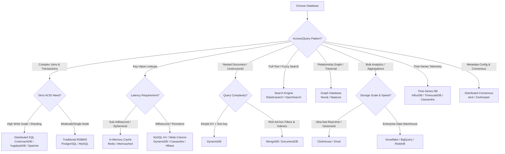
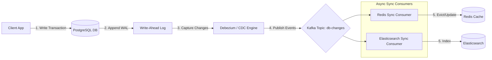

# Database Picker — Which DB, When, and Why

## Quick Summary (TL;DR)
* Don't pick a database by name — pick it by **access patterns, consistency constraints (PACELC), and scaling limits**.
* Most modern architectures are **polyglot** — using 2-3 databases where each handles a specific access pattern (e.g., PostgreSQL for orders, Redis for caching, ClickHouse for analytics).
* When in doubt, start with **PostgreSQL**. It handles 90% of use cases (including JSON, geospatial, and search). Introduce specialized datastores only when Postgres hits performance or scaling bottlenecks.

---

## 🤓 Noob Jargon Buster

* **ACID**: Atomicity (all-or-nothing), Consistency (rules enforced), Isolation (concurrent execution limits), Durability (written to disk). Non-negotiable for money/payments.
* **CAP Theorem**: A distributed system can guarantee at most two of: Consistency (all nodes see same data), Availability (every request receives a response), and Partition Tolerance (system works despite network drops).
* **PACELC Theorem**: An extension of CAP. If there is a Partition (**P**), how does the system choose between Availability (**A**) and Consistency (**C**)? Else (**E**), how does the system trade off Latency (**L**) against Consistency (**C**)?
* **LSM-Tree (Log-Structured Merge-Tree)**: A write-optimized storage engine. Appends updates to an in-memory `MemTable` and flushes them sequentially to disk as immutable `SSTables`. High write throughput, slower reads.
* **B-Tree**: A read-optimized storage engine. Keeps data sorted and balanced in blocks on disk, allowing fast point lookups and range scans. Slow writes due to random disk page splits.
* **Columnar Layout**: Stores data grouped by columns rather than rows. Enables high compression and high-speed aggregation queries (OLAP) by reading only target columns.
* **Consensus Engine**: distributed state management (Raft, Paxos) used for coordinator nodes (e.g., etcd, ZooKeeper) where consistency is guaranteed via node voting.
* **Write Amplification**: The ratio of bytes written to physical storage compared to bytes written by the application. High write amplification exhausts disk life and I/O limits.

---

## The Master Decision Table

| Access Pattern | Target Storage Engine | Best Fit | PACELC | Real-World Example |
|----------------|----------------------|----------|---------|-------------------|
| **Multi-row Transactions** | B-Tree / Raft | **PostgreSQL / MySQL** | **PC/EC** | Payments, ledger, order checkouts |
| **Global Scale Transactions** | LSM + Paxos / Spanner | **CockroachDB / Spanner** | **PC/EC** | Global inventory, multi-region auth |
| **Sub-ms Key Lookup** | In-Memory Hash Map | **Redis / Memcached** | **PA/EL** | Rate limiters, user sessions, hot caches |
| **Massive Write Telemetry** | LSM-Tree / Wide-Column | **Cassandra / ScyllaDB** | **PA/EL** | IoT sensors, clickstreams, log ingestion |
| **Rich Nested Documents** | B-Tree JSON document | **MongoDB / DocumentDB** | **PC/EC** | Product catalog, dynamic CMS profiles |
| **Hierarchical Traversals** | Index-free Adjacency | **Neo4j / Amazon Neptune** | **PC/EC** | Friends-of-friends, fraud rings |
| **Full-Text & Fuzzy Search** | Inverted Index | **Elasticsearch / OpenSearch** | **PA/EL** | E-commerce search bars, autocomplete |
| **Bulk Analytical OLAP** | Columnar vector scans | **ClickHouse / BigQuery** | **PA/EL** | Sales dashboard, usage billing meters |
| **Durable Replay Log** | Segmented Append-Only | **Kafka / Pulsar** | **PC/EC** | Event-driven event streams, CDC logs |
| **Durable Blob Storage** | Object Blob Store | **S3 / GCS** | **PA/EL** | Video files, PDF invoices, backups |
| **Distributed Consensus** | Raft / Paxos State Machine | **etcd / ZooKeeper** | **PC/EC** | Leader election, k8s cluster config |

---

## Decision Flowchart

---

## Under the Hood: Storage Engine Comparison

An SDE-2 must explain *why* a database fits a pattern based on its underlying storage mechanics.

### 1. B-Trees (Read-Optimized)
- **Used by**: PostgreSQL, MySQL, MongoDB, Oracle.
- **Layout**: Tree structure of fixed-size blocks (usually 4KB-8KB). Nodes reference other nodes.
- **Write Path**: In-place updates. If a block is full, a **page split** occurs, forcing random write operations across the disk to rebalance the tree. Writes log first to a Write-Ahead Log (WAL) for safety.
- **Read Path**: $O(\log N)$ tree traversal. Highly efficient for range scans and single point queries.
- **Trade-off**: Random write bottlenecks under high write throughput.

### 2. LSM-Trees (Write-Optimized)
- **Used by**: Cassandra, RocksDB, ScyllaDB, HBase.
- **Layout**: In-memory sorted buffer (`MemTable`) + immutable disk files (`SSTables`).
- **Write Path**: Append-only. Writes append to a commit log (WAL) and write to the in-memory `MemTable`. Once full, the `MemTable` flushes to disk as a sorted, immutable `SSTable`. No random write page splits.
- **Read Path**: Reads search the `MemTable` first, then scan multiple disk `SSTables`. Uses **Bloom Filters** to check if a key exists in an SSTable without loading it, reducing read amplification.
- **Trade-off**: Read amplification (slower reads) and background compaction CPU spikes.

### 3. Columnar (Analytical OLAP)
- **Used by**: ClickHouse, BigQuery, Snowflake, Amazon Redshift.
- **Layout**: Grouped by column, not row.
- **Write Path**: Appending individual rows is extremely slow (requires opening and writing to multiple column files). Data must be loaded in batch operations (e.g., 10,000+ rows).
- **Read Path**: Reads scan only the files containing the columns requested. If a table has 100 columns and you run `SELECT sum(revenue)`, the engine reads only the `revenue` files, skipping the other 99 columns entirely.
- **Trade-off**: Inefficient for transactional single-row CRUD operations.

---

## PACELC Classification

CAP theorem is too coarse for standard databases. SDE-2 designs evaluate systems using PACELC:

- **PC/EC (Consistent / Consistent)**: MongoDB, etcd, PostgreSQL (with sync replication). During partitions (P), they sacrifice availability for consistency (**C**). Else (E), they choose consistency (**C**) over latency.
- **PA/EL (Available / Latency)**: Cassandra, DynamoDB (eventual reads), Redis, PostgreSQL (async replication). During partitions (P), they stay available (**A**). Else (E), they return data quickly (**L**) without waiting for replica confirmation.

---

## SDE-2 Polyglot Sync Strategy (CDC Pattern)

When combining SQL, Redis, and Elasticsearch, writing to all three from the application layer causes data corruption due to partial write failures. Use **Change Data Capture (CDC)**:

1. **Transaction Isolation**: The client writes to PostgreSQL only.
2. **Event Capture**: Debezium tails the PostgreSQL WAL (Write-Ahead Log) and translates raw SQL updates into structured change events.
3. **Queue Ingress**: Change events publish to a Kafka queue.
4. **Target Alignment**: Consumer groups parse Kafka events to update Redis caches and index documents into Elasticsearch asynchronously.

---

## Cheat Sheet: Case Study Architectures

### 1. E-Commerce (Amazon, Flipkart)
- **Orders & Payments**: PostgreSQL (ACID transactions for checkout/balance updates).
- **Product Catalog**: MongoDB or DynamoDB (flexible schema handles dynamic product attributes).
- **Sessions & Cart**: Redis (sub-ms reads, TTL-based cart auto-eviction).
- **Search Engine**: Elasticsearch (faceted search, fuzziness, auto-suggest filters).
- **Analytics**: ClickHouse / BigQuery (vectorized aggregations for sales forecasting).

### 2. Social Media (Instagram, Twitter)
- **User Profiles & Relationships**: PostgreSQL (structured, highly normalized schemas).
- **Social Graph Traversals**: Neo4j / AWS Neptune (handles friend-of-friend lookups without deep recursive SQL joins).
- **Pre-computed Timelines**: Redis (Redis Sorted Sets storing user feed indexes ranked by timestamp).
- **Media Ingestion**: S3 / GCS + Cloudflare CDN (blob storage for media files, edge cached globally).

### 3. Chat System (WhatsApp, Slack)
- **Message Log Storage**: Cassandra / HBase (write-heavy LSM engine partitioned by `chat_id` and clustering keys sorted by time).
- **Online Presence**: Redis (in-memory hash structures with 10-second TTL heartbeats).
- **User Directories**: PostgreSQL (acid profile credentials and OAuth tokens).

---

## System Design Interview Q&A

### Q1: "Why not use MongoDB for transactions if it supports multi-document transactions now?"
> **Answer**: "While MongoDB added multi-document ACID transactions, they are bolted on top of a B-tree document layout that does not enforce relational constraints (like foreign keys) at the engine level. Running multi-document transactions in MongoDB introduces high lock contention and degrades performance. For applications where strict transactional integrity, schema consistency, and complex relational analytics are primary requirements, a relational engine like PostgreSQL is more mature and performant."

### Q2: "When would you pick a Distributed SQL DB (like CockroachDB) over sharded PostgreSQL?"
> **Answer**: "I would choose CockroachDB when the write throughput exceeds the limits of a single massive PostgreSQL instance, and the system requires multi-region deployments with low-latency reads. Sharding PostgreSQL manually at the application layer introduces high operational complexity, requires writing custom routing logic, and makes cross-shard transactions or re-sharding extremely difficult. CockroachDB automates horizontal range partitioning and implements consensus-based transactions (Raft/Paxos) natively, preserving SQL compatibility with horizontal scalability."

### Q3: "How does ClickHouse handle analytical queries so much faster than MySQL?"
> **Answer**: "ClickHouse is a columnar database designed for OLAP. MySQL organizes data as rows on disk, meaning a query summarizing revenue must load entire customer rows into memory. ClickHouse stores each column in a separate file on disk and reads only the columns query requires. Additionally, ClickHouse utilizes vectorized query execution, processing chunks of data using SIMD CPU instructions, and applies aggressive compression codecs on column data, outperforming traditional row-based databases on big-data aggregations by orders of magnitude."
