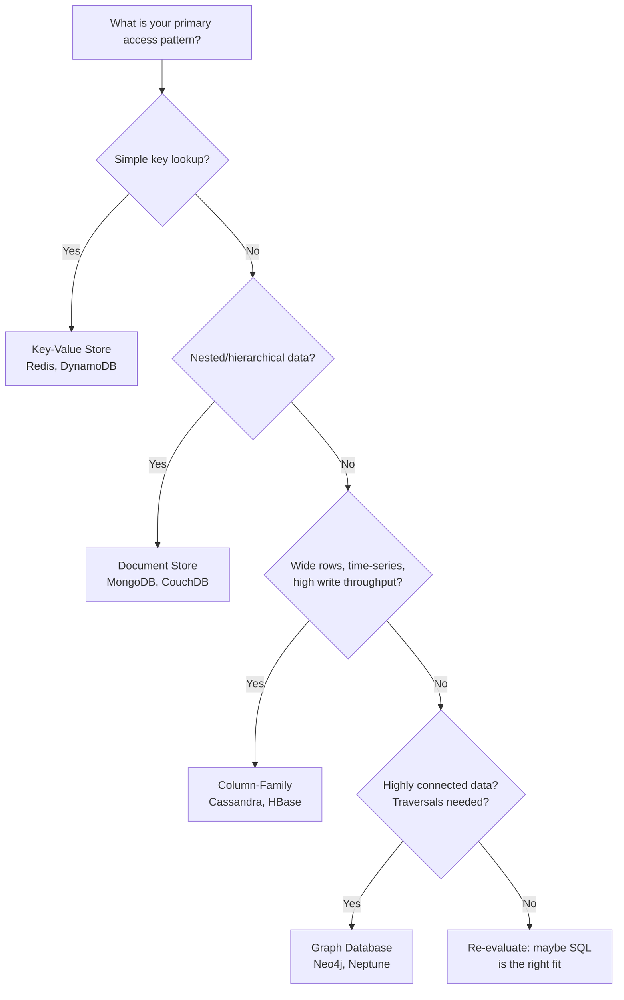
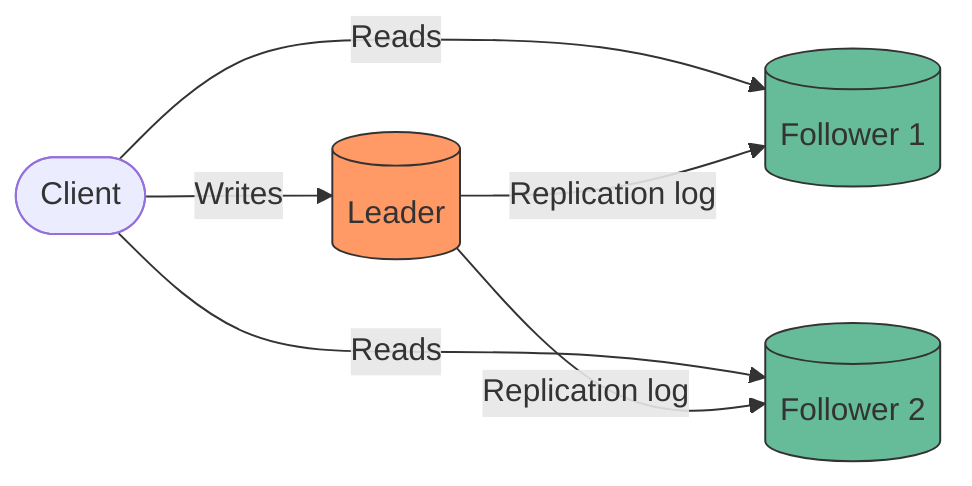
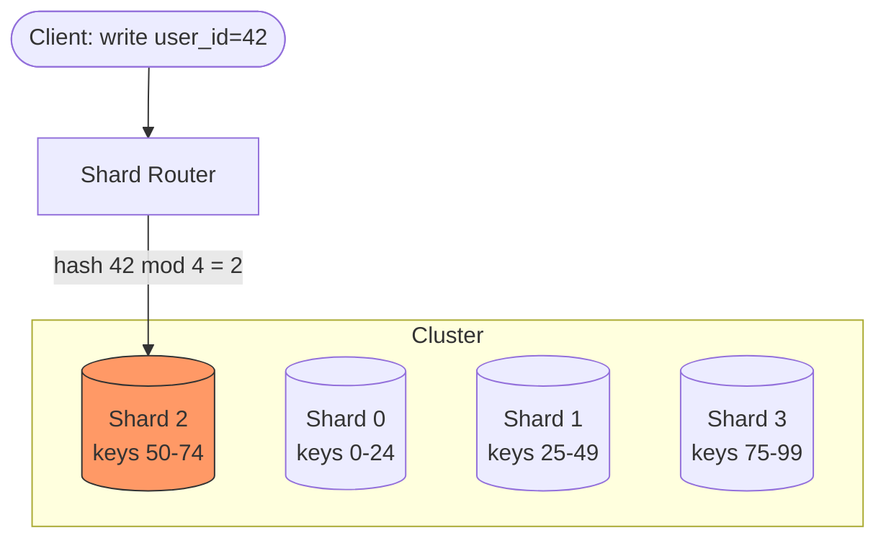
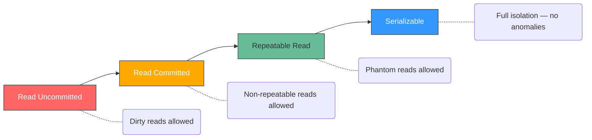

# Databases (HLD)

---

## Quick Summary (TL;DR)

- **SQL** databases guarantee ACID transactions and work best for structured, relational data; **NoSQL** trades strict consistency for horizontal scalability and flexible schemas.
- **Replication** (leader-follower, multi-leader, leaderless) improves read throughput and fault tolerance; **sharding** splits data across nodes to scale writes.
- Choosing the right **shard key** is the single most impactful database design decision at scale — a bad key creates hot spots that no amount of hardware can fix.
- **Indexing** speeds up reads dramatically but slows down writes; every index is a trade-off, not a free lunch.
- Use a **decision framework** (read/write ratio, consistency needs, data model, scale) instead of picking a database based on hype.

---

## 🤓 Noob Jargon Buster

* **ACID**: A set of properties (Atomicity, Consistency, Isolation, Durability) that guarantee database transactions are processed reliably (all-or-nothing, no partial failures).
* **BASE**: A set of properties (Basically Available, Soft state, Eventual consistency) common in NoSQL systems that trade strict consistency for high availability and scaling.
* **Replication**: Copying data across multiple machines so if one node dies, the data is still safe and readable on others.
* **Sharding**: Splitting a large dataset into smaller parts (shards) and spreading them across different database servers to scale writes.
* **WAL (Write-Ahead Log)**: An append-only log file where database changes are written *before* they are applied to the actual database tables, guaranteeing durability during crashes.

---

## Real-World Analogy

Think of databases like libraries:

- **SQL** is a traditional library — books are catalogued by a strict system (Dewey Decimal). Finding anything is fast if you follow the rules, but adding a new category requires reorganizing shelves.
- **NoSQL** is a warehouse of labeled boxes. Each box can hold anything. Finding a specific item is easy if you know the label, but cross-referencing across boxes is painful.
- **Replication** is photocopying popular books so multiple reading rooms can serve them simultaneously.
- **Sharding** is splitting the library across buildings by genre — the mystery section is in Building A, sci-fi in Building B.

---

## 1. SQL vs NoSQL

| Dimension | SQL (Relational) | NoSQL |
|-----------|-------------------|-------|
| **Data model** | Tables, rows, columns | Documents, key-value, column-family, graph |
| **Schema** | Fixed schema (schema-on-write) | Flexible (schema-on-read) |
| **Consistency** | ACID | BASE (Basically Available, Soft-state, Eventually consistent) |
| **Scaling** | Vertical (scale-up) | Horizontal (scale-out) |
| **Joins** | Native, efficient | Application-level or denormalized |
| **Best for** | Transactions, complex queries, relationships | High throughput, flexible data, massive scale |
| **Examples** | PostgreSQL, MySQL, Oracle | MongoDB, Cassandra, Redis, DynamoDB |

**When to use SQL:** Banking, order management, inventory — anywhere you need multi-row transactions and data integrity.

**When to use NoSQL:** User sessions, product catalogs, real-time analytics, IoT telemetry — high write volume, flexible schema, horizontal scale.

---

## 2. Types of NoSQL

### NoSQL Decision Tree



### Comparison Table

| Type | Data Model | Strengths | Weaknesses | Use Cases |
|------|-----------|-----------|------------|-----------|
| **Key-Value** | Hash map | Sub-ms latency, simple API | No complex queries | Caching, sessions, rate limiting |
| **Document** | JSON/BSON docs | Flexible schema, rich queries | Poor for joins | Product catalogs, CMS, user profiles |
| **Column-Family** | Wide columns, row key | High write throughput, time-series | Complex data modeling | Analytics, event logs, IoT |
| **Graph** | Nodes + edges | Relationship traversal | Poor for bulk scans | Social networks, fraud detection, recommendations |

---

## 3. Replication

### Leader-Follower (Single Leader)



**How it works:** All writes go to one leader. Followers replicate the leader's write-ahead log (WAL). Reads can go to any replica.

### Sync vs Async Replication

| Aspect | Synchronous | Asynchronous |
|--------|------------|--------------|
| **Write latency** | Higher (waits for follower ACK) | Lower (leader returns immediately) |
| **Durability** | Guaranteed on N nodes | Risk of data loss if leader crashes |
| **Common setup** | Semi-sync (1 sync + N async) | Fully async (most common) |

### Replication Strategies Compared

| Strategy | Write Scalability | Conflict Handling | Consistency |
|----------|-------------------|-------------------|-------------|
| **Single-Leader** | Single node bottleneck | No conflicts (one writer) | Strong (if sync) |
| **Multi-Leader** | Multiple write nodes | Conflict resolution required | Eventual |
| **Leaderless (Quorum)** | Any node accepts writes | Version vectors, LWW | Tunable (W + R > N) |

**Quorum formula:** For N replicas, require W writes + R reads where `W + R > N` to guarantee reading the latest value.

Example: N=3, W=2, R=2 — tolerates 1 node failure for both reads and writes.

---

## 4. Sharding (Partitioning)

### Hash-Based Sharding



### Sharding Strategies

| Strategy | How It Works | Pros | Cons |
|----------|-------------|------|------|
| **Range-based** | Split by key ranges (A-M, N-Z) | Range queries efficient | Hot spots (e.g., recent dates) |
| **Hash-based** | `hash(key) mod N` | Even distribution | Range queries scatter across shards |
| **Directory-based** | Lookup table maps key → shard | Flexible, supports resharding | Lookup table is a SPOF and bottleneck |

### Shard Key Selection (Critical Interview Topic)

**Good shard key properties:**
- High cardinality (many distinct values)
- Even distribution (no single value dominates)
- Matches query patterns (queries hit one shard, not all)

**Classic bad choices:**
- `country_code` — 80% traffic from 2-3 countries → hot spot
- `created_date` — all recent writes hit one shard
- `boolean` fields — only 2 partitions

**Rebalancing approaches:**
- **Fixed partitions:** Create more partitions than nodes, reassign partitions when nodes change (Cassandra, DynamoDB)
- **Dynamic splitting:** Split a partition when it exceeds a threshold (HBase)
- **Consistent hashing:** Minimize data movement when adding/removing nodes

---

## 5. Indexing

### B-Tree vs LSM-Tree

| Aspect | B-Tree | LSM-Tree |
|--------|--------|----------|
| **Used by** | PostgreSQL, MySQL (InnoDB) | Cassandra, RocksDB, LevelDB |
| **Write pattern** | In-place update | Append-only (write to memtable → flush to SSTable) |
| **Read performance** | Faster for point lookups | Slower (may check multiple SSTables) |
| **Write performance** | Slower (random I/O) | Faster (sequential I/O) |
| **Space amplification** | Lower | Higher (compaction needed) |
| **Best for** | Read-heavy OLTP | Write-heavy workloads |

### Index Types

| Index Type | Description | Example |
|-----------|-------------|---------|
| **Primary** | Built on the primary key, determines physical row order (clustered) | `id` column in InnoDB |
| **Secondary** | Additional index on non-PK columns | Index on `email` for user lookups |
| **Composite** | Multi-column index | `(country, city)` — leftmost prefix rule applies |
| **Covering** | Index contains all columns needed by the query — avoids table lookup | `CREATE INDEX idx ON orders(user_id) INCLUDE (total)` |

**Why indexing everything is bad:**
- Each index adds a B-Tree that must be updated on every write (INSERT/UPDATE/DELETE)
- More indexes = more disk space, larger WAL, slower replication
- The optimizer may ignore indexes if table is small or selectivity is low
- Rule of thumb: index columns that appear in WHERE, JOIN, ORDER BY — not every column

---

## 6. ACID Transactions

| Property | Meaning | What Breaks Without It |
|----------|---------|----------------------|
| **Atomicity** | All or nothing — partial failures roll back | Half-completed transfers (money debited but not credited) |
| **Consistency** | DB moves from one valid state to another | Violated constraints, orphan records |
| **Isolation** | Concurrent transactions don't interfere | Dirty reads, lost updates, phantom rows |
| **Durability** | Committed data survives crashes | Data loss after power failure |

### Isolation Levels



| Isolation Level | Dirty Read | Non-Repeatable Read | Phantom Read | Performance |
|----------------|------------|---------------------|--------------|-------------|
| **Read Uncommitted** | Possible | Possible | Possible | Fastest |
| **Read Committed** | Prevented | Possible | Possible | Fast |
| **Repeatable Read** | Prevented | Prevented | Possible | Moderate |
| **Serializable** | Prevented | Prevented | Prevented | Slowest |

**Defaults:** PostgreSQL uses Read Committed. MySQL InnoDB uses Repeatable Read.

**Key insight for interviews:** Most applications run at Read Committed or Repeatable Read. Serializable is rarely used in production due to performance — instead, applications use optimistic concurrency control (version columns) or explicit locking.

---

## 7. Database Selection Framework

| Factor | Leans SQL | Leans NoSQL |
|--------|-----------|-------------|
| **Read/Write ratio** | Read-heavy with complex joins | Write-heavy, simple lookups |
| **Consistency** | Strong consistency required | Eventual consistency acceptable |
| **Schema** | Well-defined, stable schema | Evolving or polymorphic data |
| **Scale** | Vertical scaling sufficient (<10TB) | Horizontal scale needed (>10TB) |
| **Query complexity** | Complex aggregations, multi-table joins | Key-based access, denormalized reads |
| **Transactions** | Multi-row ACID transactions | Single-document atomicity sufficient |

**Decision shortcut for interviews:**

1. Need ACID across multiple entities? → **SQL** (PostgreSQL)
2. Need sub-ms latency cache? → **Redis**
3. Need flexible documents + decent queries? → **MongoDB**
4. Need massive write throughput + availability? → **Cassandra / DynamoDB**
5. Need relationship traversals? → **Neo4j**
6. Not sure? → Start with **PostgreSQL** — it handles 90% of use cases

---

## 8. SDE-2 Schema Design & Modeling (Deep Dive)

In an SDE-2 interview, you cannot just list table names; you must write the table structures, define keys, and explain query routing. Here are the two most common modeling exercises:

### Case Study A: Real-Time Chat System (NoSQL Column-Family / Cassandra)

If your chat system requires massive scale (e.g., WhatsApp), a relational database will fail under write pressure. You should use a wide-column store like Cassandra.

#### The Cassandra Schema Design
```sql
CREATE TABLE group_messages (
    group_id uuid,
    message_id timeuuid,
    sender_id uuid,
    content text,
    PRIMARY KEY (group_id, message_id)
) WITH CLUSTERING ORDER BY (message_id DESC);
```

#### 💡 The SDE-2 Key Insights:
- **Partition Key (`group_id`)**: Determines which node in the cluster stores the chat history. All messages for a group are co-located on the same partition for ultra-fast reads.
- **Clustering Key (`message_id`)**: Sorts the messages physically on disk within that partition. Since we use `timeuuid` (which embeds a timestamp) and order it `DESC`, querying the latest 50 messages is a sequential disk scan (extremely fast `O(1)` read).
- **No Joins**: We store the `sender_id` directly in the message row. If we need the sender's username, the application fetches it from a cached User Profile service (denormalization over query-time joins).

---

### Case Study B: E-Commerce Inventory & Orders (SQL / Relational)

For money-critical applications (payment transactions, inventory counts), SQL is non-negotiable because you need multi-row ACID transactions.

#### The SQL Schema Design
```sql
-- Represents the checkout cart
CREATE TABLE orders (
    id VARCHAR(64) PRIMARY KEY,
    user_id VARCHAR(64) NOT NULL,
    total_amount DECIMAL(10, 2) NOT NULL,
    status VARCHAR(20) NOT NULL, -- PENDING, COMPLETED, FAILED
    version INT NOT NULL DEFAULT 0, -- Used for Optimistic Concurrency Control
    created_at TIMESTAMP NOT NULL DEFAULT CURRENT_TIMESTAMP
);

-- Represents items in the cart
CREATE TABLE order_items (
    id VARCHAR(64) PRIMARY KEY,
    order_id VARCHAR(64) REFERENCES orders(id) ON DELETE CASCADE,
    product_id VARCHAR(64) NOT NULL,
    quantity INT NOT NULL,
    price DECIMAL(10, 2) NOT NULL
);

-- Indexing query patterns
CREATE INDEX idx_orders_user_id ON orders(user_id);
```

#### 💡 The SDE-2 Key Insights:
- **Foreign Key Constraints**: We use `REFERENCES orders(id) ON DELETE CASCADE` to prevent orphan items when an order is deleted, preserving integrity.
- **Index Selection**: We index `user_id` because the main query pattern is fetching a user's purchase history (`WHERE user_id = ?`). We do *not* index `status` because low cardinality (only 3 values) makes index lookup useless for the optimizer.
- **Concurrency Control (Optimistic Locking)**: When checking out inventory, two users might try to buy the last item simultaneously. Instead of lock blocks, we use the `version` column:
  ```sql
  UPDATE orders 
  SET status = 'COMPLETED', version = version + 1 
  WHERE id = 'ord_123' AND version = 5;
  ```
  If another transaction updated the order first, the version is now `6`, the query updates `0` rows, and our application triggers a clean retry instead of corrupted state.

---

## Interview Angles

1. **"How would you choose a database for X system?"** — Walk through the decision framework: data model, access patterns, consistency needs, scale. Never jump to a database name without reasoning.

2. **"How does sharding work? What problems does it introduce?"** — Explain hash vs range, then discuss: cross-shard queries, distributed transactions, rebalancing complexity, shard key selection.

3. **"What happens when the leader goes down in a replicated setup?"** — Follower promotion (automatic via consensus or manual), split-brain risk, data loss window (async replication lag).

4. **"Why not just add an index on every column?"** — Write amplification, storage overhead, optimizer confusion, maintenance cost during schema changes.

5. **"Explain isolation levels with a real scenario."** — Use a bank transfer example: dirty read = seeing uncommitted debit, phantom read = COUNT(*) changing between two reads in same transaction.

6. **"SQL vs NoSQL for an e-commerce platform?"** — Hybrid: SQL (PostgreSQL) for orders/payments (ACID), NoSQL (Redis) for sessions/cart, Document store (MongoDB or DynamoDB) for product catalog.

---

## Traps

1. **"NoSQL is faster than SQL"** — Wrong. Speed depends on access patterns. PostgreSQL with proper indexing beats MongoDB on complex queries. NoSQL wins on specific patterns it's optimized for.

2. **"Sharding solves all scaling problems"** — Sharding introduces enormous complexity: distributed joins, cross-shard transactions, rebalancing. Always exhaust vertical scaling and read replicas first.

3. **"CAP theorem means pick 2 of 3"** — Misleading. In practice, network partitions will happen (P is not optional). The real choice is CP vs AP during a partition. And most of the time there is no partition, so you get all three.

4. **"Eventual consistency means data is always stale"** — In practice, replication lag is usually milliseconds. "Eventually" typically means "within a few hundred ms." Design for the rare case where it matters.

5. **"MongoDB has no transactions"** — Outdated since MongoDB 4.0 (2018). It supports multi-document ACID transactions. But if you need them frequently, you probably want a relational database.

6. **"More replicas = more throughput"** — True for reads, but write throughput stays the same (or decreases) because every replica must process every write.

7. **"Consistent hashing eliminates all rebalancing"** — It minimizes data movement (only K/N keys move), but doesn't eliminate it. Virtual nodes are needed to handle uneven distribution.

---
