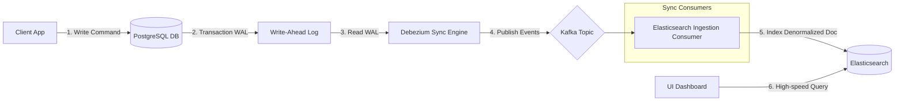

# Inverted Indexes, Elasticsearch vs. PostgreSQL, and Database Scalability (100M+ Scale)

## Quick Summary (TL;DR)
* **Inverted Index:** A data structure that maps words/terms to the documents containing them, enabling instantaneous full-text searches.
* **Why Elasticsearch is faster than Postgres at scale:**
  1. **Index Merging:** ES uses Roaring Bitmaps and Skip Lists to merge search lists at the binary level.
  2. **In-Memory Dictionary:** The term dictionary is kept in RAM using Finite State Transducers (FST).
  3. **Sharding:** ES distributes search queries across multiple shards in parallel.
  4. **Doc Values:** Columnar storage optimized for high-speed aggregations.
* **Why not ES everywhere?** It lacks ACID compliance, multi-document transactions, relational foreign key constraints, and joins. Updates are also highly expensive (requires document rewriting).
* **The SDE-2 Pattern:** Write to PostgreSQL (ACID Source of Truth) $\rightarrow$ sync via Kafka/CDC $\rightarrow$ query/aggregate from Elasticsearch (CQRS Pattern).

---

## 🤓 Noob Jargon Buster

* **Posting List:** The list of document/record IDs associated with a specific term in an inverted index.
* **Tokenization:** The process of splitting text (like `"Yantian Port"`) into individual search terms (e.g., `["yantian", "port"]`).
* **Finite State Transducers (FST):** A compressed, graph-like data structure that allows Elasticsearch to keep its entire term directory in memory.
* **Doc Values:** A columnar disk-based storage format generated during indexing for sorting and aggregations.
* **Lucene Segment:** An immutable, self-contained mini-inverted index. Multiple segments are merged periodically in the background.

---

## 1. What is an Inverted Index? (With a Booking Example)

In a relational database, records are retrieved by looking up rows (Forward Index). In a search engine, records are retrieved by looking up terms (Inverted Index).

### The Scenario
Suppose we ingest three booking events from Maersk's GCSS stream:
* **Booking 1 (`B001`):** `{"polName": "Yantian Port", "status": "CANCELLED BY CUSTOMER"}`
* **Booking 2 (`B002`):** `{"polName": "Shanghai Port", "status": "RELEASED"}`
* **Booking 3 (`B003`):** `{"polName": "Shanghai Port", "status": "CANCELLED BY CARRIER"}`

### Inverted Index Construction
During indexing, text fields undergo analysis (tokenization, lowercasing, stemming). Elasticsearch builds inverted indexes for these fields:

#### Inverted Index for `polName` (Text type, analyzed)
| Term | Posting List (Booking IDs) | Positions in Docs |
| :--- | :--- | :--- |
| **port** | `[B001, B002, B003]` | `B001:[1]`, `B002:[1]`, `B003:[1]` |
| **shanghai** | `[B002, B003]` | `B002:[0]`, `B003:[0]` |
| **yantian** | `[B001]` | `B001:[0]` |

#### Inverted Index for `status` (Keyword type, unanalyzed)
For filters and exact matches, the field is stored as a single term:
| Term | Posting List (Booking IDs) |
| :--- | :--- |
| **CANCELLED BY CARRIER** | `[B003]` |
| **CANCELLED BY CUSTOMER** | `[B001]` |
| **RELEASED** | `[B002]` |

### Query Execution (Logic Merging)
If a user filters by **"Port = Shanghai"** `AND` **"Status = CANCELLED BY CARRIER"**:
1. Lookup term **"shanghai"** $\rightarrow$ Posting List: `[B002, B003]`
2. Lookup term **"CANCELLED BY CARRIER"** $\rightarrow$ Posting List: `[B003]`
3. Perform binary intersection:
   $$\{B002, B003\} \cap \{B003\} = \{B003\}$$
4. Instantly return booking `B003`.

---

## 2. Why is Elasticsearch faster than PostgreSQL at 100M+ Scale?

Suppose we have **100 Million rows** of bookings, and PostgreSQL has indexes on both the `polName` and `status` columns. Why does Elasticsearch still vastly outperform Postgres?

```mermaid
grid
  android[PostgreSQL B-Tree]
  ios[Elasticsearch Inverted Index]
```

### A. Index Merging (Roaring Bitmaps vs. Bitmap Index Scans)
* **PostgreSQL:** When searching multiple indexed columns (e.g., `WHERE pol_name = 'Shanghai' AND status = 'RELEASED'`), Postgres traverses separate B-Tree indexes, builds bitmaps in memory, and performs a bitmap AND operation. Under high concurrency and big data sizes, this causes severe RAM and CPU bottlenecks. 
* **Elasticsearch:** ES inverted indexes are optimized natively for set intersections. Posting lists are stored as **Roaring Bitmaps** (a compressed bitset representation) and **Skip Lists**. Set operations (AND, OR, NOT) are evaluated at the CPU register/bit level, requiring negligible memory overhead.

### B. In-Memory Term Dictionary (FST)
* **PostgreSQL:** B-Tree index pages must be loaded from disk into the database buffer cache (`shared_buffers`). If your indexes for 100M rows are too large to fit in memory, Postgres must read index blocks from disk, leading to massive I/O delays.
* **Elasticsearch:** ES holds its entire term directory in RAM using **Finite State Transducers (FST)**. FST is an extremely compressed graph that tells ES instantly if a term exists and where its posting list is on disk. ES decides which documents match a query *before* doing any disk I/O.

### C. Distributed Sharding (Parallel Execution)
* **PostgreSQL:** Mostly runs as a single-node database. Even with partition scaling, a single query runs sequentially on a single node's CPU.
* **Elasticsearch:** An index is split into multiple physical chunks called **Shards** spread across different servers. 100M documents split across 5 shards means that when a query arrives:
  1. All 5 servers execute the query on **20 million documents** in parallel.
  2. The coordinating node aggregates the top scores.
  3. The query returns in one-fifth of the time.

### D. Doc Values (Columnar Analytics)
Dashboards require complex analytical aggregations (e.g., "Group total containers by status and month").
* **PostgreSQL:** Uses row-oriented storage. To aggregate 100M rows, it must read entire records (even fields it doesn't need) into memory and sort/group them, causing OOM errors or high CPU load.
* **Elasticsearch:** Writes a columnar representation called **Doc Values** alongside the inverted index. For aggregations, ES only reads the specific columns from disk sequentially, leading to sub-second aggregations across millions of documents.

---

## 3. Why Don't We Use Elasticsearch Everywhere? (The Trade-offs)

If Elasticsearch is so fast and scales horizontally, why not discard Postgres and use ES as our sole database?

### A. Lack of ACID Transactions
ES is designed for eventual consistency, not system-of-record durability:
* **No multi-document transactions:** If you need to update a booking table and deduct inventory/credit balance simultaneously, ES cannot guarantee that either both succeed or both fail.
* **Eventual Consistency:** When a document is written, it is stored in an in-memory buffer. It only becomes searchable after a `refresh` operation (by default every 1 second). This delay is unacceptable for transactional APIs (like payments or placing an order).

### B. No Relational Joins & Schema Rigidity
* **No Native Joins:** ES does not support relational joins at scale. To query relationships (e.g., Bookings $\rightarrow$ Containers $\rightarrow$ Port details), you must **denormalize** and duplicate data across documents.
* **Expensive Updates:** If a port name changes, Postgres updates one record in a `ports` table. ES must scan and rewrite millions of documents containing that port name.

### C. Write Amplification & Immutable Segments
Under the hood, Lucene index segments are **immutable** (cannot be modified).
* When you update a booking status, ES marks the old document as "deleted" and writes a brand-new document to a new segment.
* A background "Segment Merge" thread continuously rewrites these segments to purge deleted entries.
* In write-heavy/update-heavy scenarios, this causes high **Write Amplification**, consuming massive CPU and disk I/O.

---

## 4. SDE-2 Design Pattern: CQRS & Change Data Capture (CDC)

To get the transactional safety of PostgreSQL and the search speed of Elasticsearch, use the **CQRS (Command Query Responsibility Segregation)** pattern backed by **CDC (Change Data Capture)**:



1. **Transactional Command:** The application writes solely to PostgreSQL.
2. **Change Capture:** Debezium reads the Postgres WAL (Write-Ahead Log) asynchronously.
3. **Event Streaming:** Debezium publishes change events to a Kafka topic.
4. **Denormalization & Ingestion:** A consumer listens to Kafka, merges related database records (e.g., booking + container data), and writes a flattened document to Elasticsearch.
5. **Fast Reads:** The dashboard UI queries Elasticsearch for lightning-fast search and aggregations.

---

## 5. System Design Interview Q&A

### Q1: "If I have an index in PostgreSQL, why do I need Elasticsearch?"
> **Answer:** "PostgreSQL B-Tree indexes are optimized for transactional point lookups and range scans. However, they struggle at scale when queries require complex multi-field filtering, full-text fuzzy matching, or real-time aggregations over millions of rows. PostgreSQL would require complex composite indexes for every filter combination, which degrades write throughput. Elasticsearch's inverted index, combined with in-memory FST and columnar Doc Values, is designed natively to merge filters and run aggregations in parallel across distributed nodes, making it far more performant for read-heavy dashboards at scale."

### Q2: "What is the difference between Text and Keyword field types in Elasticsearch?"
> **Answer:** "A `text` field is analyzed and tokenized during indexing (e.g., 'Yantian Port' is broken into 'yantian' and 'port'), making it optimized for full-text search. A `keyword` field is stored exactly as-is without tokenization (e.g., 'CANCELLED BY CUSTOMER' remains one term). Keyword fields are optimized for exact matches, filtering, sorting, and aggregations (group-by queries)."

### Q3: "How does Elasticsearch handle write concurrency without transactions?"
> **Answer:** "Elasticsearch uses **Optimistic Concurrency Control (OCC)**. Every document is assigned an auto-incrementing `_seq_no` and a `_primary_term`. When updating a document, ES checks if the version match exists. If another thread updated the document in the meantime, the versions will mismatch, and ES rejects the update with a `VersionConflictEngineException`, forcing the application layer to fetch the updated document and retry the write."
