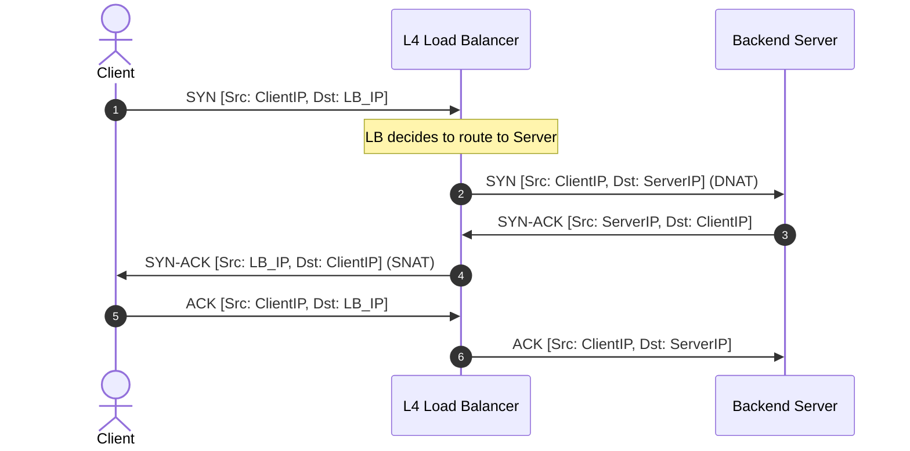
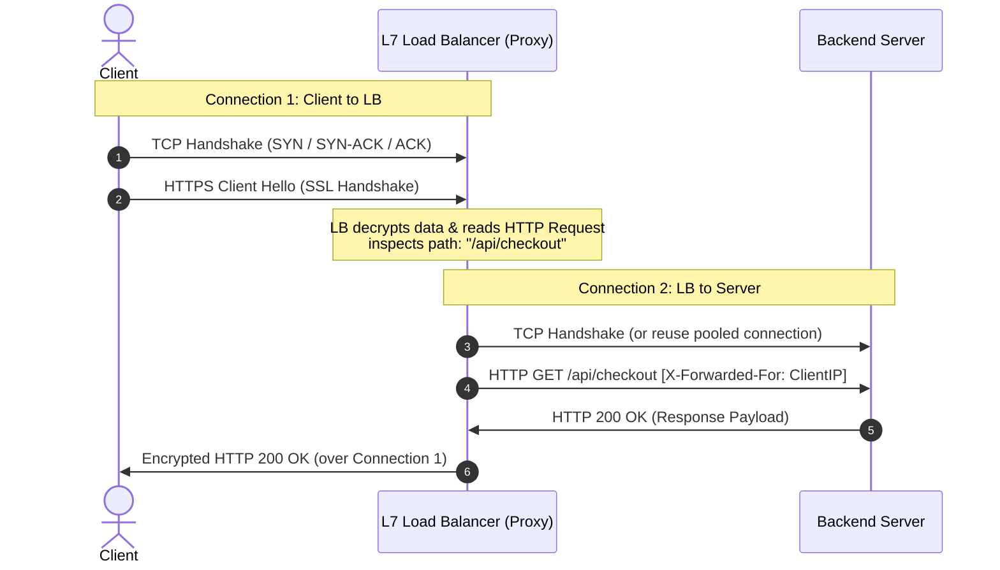
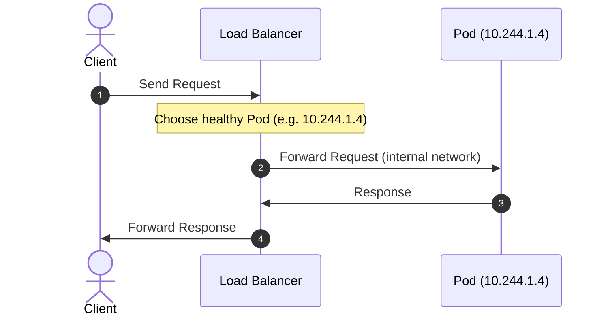
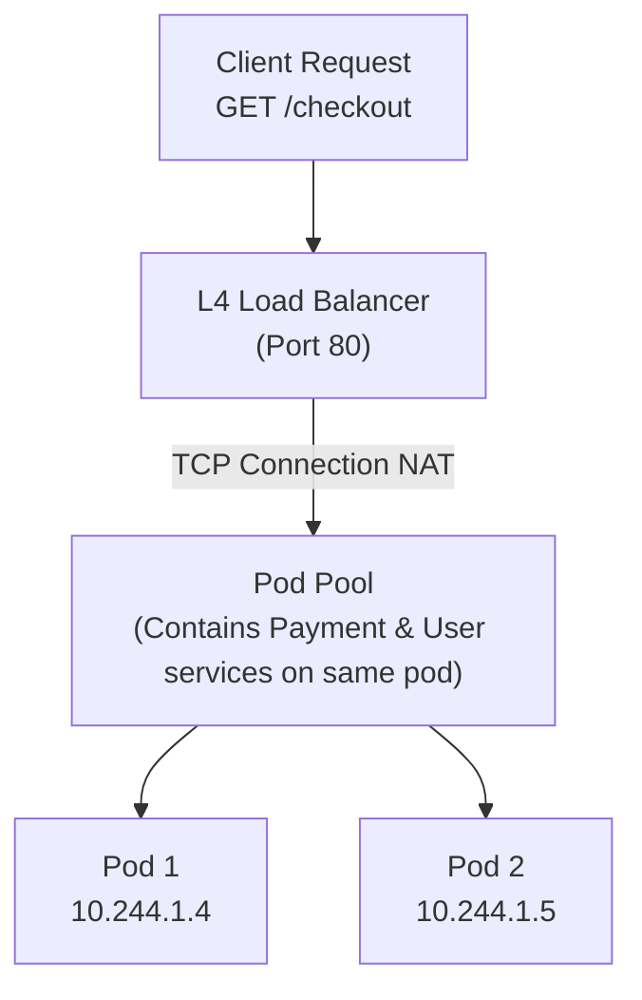
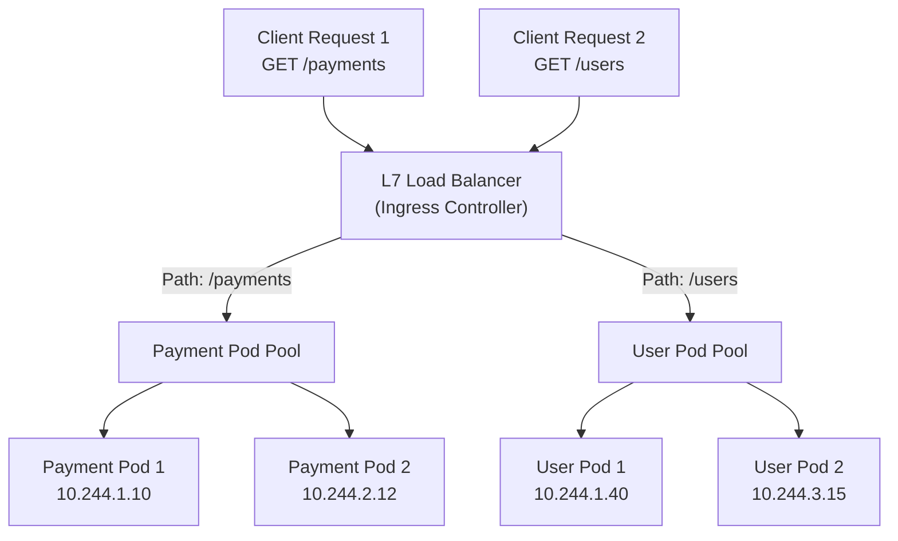
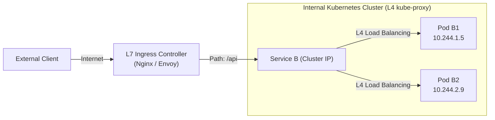

# Layer 4 (L4) vs Layer 7 (L7) Load Balancing: The Ultimate Guide

When building large-scale systems, load balancers (LBs) are the traffic cops that keep services running smoothly. But in system design interviews and real-world engineering, you'll constantly hear: *"Should we use an L4 or an L7 load balancer?"*

Here is the noob-friendly, deeply detailed explanation of what they are, how they actually work under the hood, and how to choose between them.

---

## 💡 The "Noob" Analogy

Imagine you are ordering a package from an online store.

### Layer 4: The Mail Carrier 📬
* **How they act**: The mail carrier looks at the **outside of the cardboard box**. They see the shipping label: **To: Building 4, Apartment B**.
* **What they don't do**: They do *not* open your box. They don't know (or care) if you ordered a t-shirt, a laptop, or a book.
* **Their job**: They route the package purely based on the **destination address** (IP) and **apartment number** (Port). This is super fast because they never stop to open and inspect boxes.

### Layer 7: The Security Guard & Personal Concierge 🕵️‍♂️
* **How they act**: The concierge stops the delivery person at the lobby, **opens the box**, inspects the contents, reads your invoice, and checks your ID.
* **What they do**:
  * "Oh, this is a box of fresh vegetables? Take it to the kitchen fridge."
  * "Oh, this is a luxury watch? Put it in the high-security safe."
  * "Wait, this client doesn't have a valid security badge? Reject it immediately."
* **Their job**: They make decisions based on the **actual contents** (HTTP headers, URLs, cookies, request body). This is slower and takes more effort because they have to unpack and read everything, but it is infinitely smarter.

---

## 🏗️ The Technical Foundation: OSI Layers

To understand L4 vs L7, we need a quick look at the **OSI (Open Systems Interconnection) Model**:

```
+---------------------------+
|  Layer 7: Application     | <-- L7 LB (inspects HTTP, HTTPS, gRPC, Headers, Cookies)
|  Layer 6: Presentation    |
|  Layer 5: Session         |
+---------------------------+
|  Layer 4: Transport       | <-- L4 LB (inspects TCP, UDP, Ports)
+---------------------------+
|  Layer 3: Network         | <-- Routers (IP Addresses)
|  Layer 2: Data Link       | <-- Switches (MAC Addresses)
|  Layer 1: Physical        | <-- Cables, Fiber, Radio
+---------------------------+
```

* **L4 operates at the Transport Layer (TCP/UDP).** It is protocol-agnostic. It routes raw bytes of data.
* **L7 operates at the Application Layer (HTTP/HTTPS/gRPC).** It understands web application protocols.

---

## ⚙️ How L4 Load Balancing Actually Works (Under the Hood)

An L4 load balancer acts like a high-speed router. It works using **Packet Forwarding** or **Network Address Translation (NAT)**.

### Step-by-Step Packet Flow (NAT Mode)
1. **Client Handshake**: The client initiates a TCP handshake targeting the Load Balancer's IP (Virtual IP or **VIP**).
2. **Inspection**: The L4 LB inspects the packet header to find the **Source IP/Port** and **Destination IP/Port**.
3. **Decision**: The LB uses a simple algorithm (e.g., Round Robin or Least Connections) to choose a backend server.
4. **Translation (DNAT)**: The LB rewrites the destination IP of the packet from the **LB's IP** to the **selected server's IP**. It recalculates the packet checksum.
5. **Forwarding**: The LB sends the packet to the server.
6. **Return Path**: When the server replies, the return packet goes back to the LB. The LB rewrites the source IP (reversing the NAT) so the client thinks it's still talking to the LB.



> [!IMPORTANT]
> **TCP Connection is Direct**: In L4, the TCP connection is established directly between the client and the backend server. The load balancer just plays "middleman" rewriting packet addresses. It **does not terminate** the connection.

### 🚀 Advanced L4: Direct Server Return (DSR)
In high-traffic systems, the biggest bottleneck is often the return traffic (sending gigabytes of images/video back to the client).
* With **DSR**, the L4 LB only handles the incoming requests.
* It rewrites the destination MAC address to the backend server but leaves the destination IP as the LB's IP.
* The backend server processes the request and replies **directly to the client**, bypassing the load balancer entirely! This allows L4 LBs to handle astronomical amounts of traffic.

---

## ⚙️ How L7 Load Balancing Actually Works (Under the Hood)

An L7 load balancer is a **Proxy**. It performs **Connection Termination**.

### Step-by-Step Packet Flow (Proxy Mode)
1. **TCP Handshake 1 (Client to LB)**: The L7 LB completes a full TCP handshake with the client first.
2. **TLS Decryption (SSL Termination)**: If the traffic is HTTPS, the LB decrypts the data using SSL certificates hosted on the LB.
3. **Parsing**: The LB reads the raw HTTP request data. It parses:
   * The URL Path (e.g., `/api/v1/checkout` vs `/static/logo.png`)
   * Headers (e.g., `User-Agent: Mobile`, `Authorization`)
   * Cookies (e.g., `session_id=123`)
4. **Decision**: Based on rules (e.g., route `/api/*` to the Payment Service, route `/static/*` to S3 Bucket/CDN), the LB selects the correct backend service.
5. **TCP Handshake 2 (LB to Server)**: The LB opens a *new* TCP connection (or reuses a pooled connection) to the target backend server.
6. **Forwarding**: The LB forwards the request (often adding headers like `X-Forwarded-For` so the backend knows the original client's IP).
7. **Response**: The server replies to the LB, and the LB forwards it back to the client.



> [!WARNING]
> **Double Handshake Overhead**: Because the L7 LB manages two separate connections (Client-to-LB and LB-to-Server) and decrypts/encrypts traffic, it requires significantly more CPU and memory than an L4 LB.

---

## ☸️ Pod Routing: Can L4 and L7 Both Route to Multiple Pods? (e.g. Kubernetes)

Yes! Both L4 and L7 can distribute traffic to multiple pods (in a Kubernetes or containerized environment), but they do it very differently and with different levels of intelligence.

### 1. HTTP Redirecting vs. Proxy Forwarding
First, let's clear up a common misconception: **neither L4 nor L7 LBs use HTTP redirects (302 Found) to route traffic to pods.**
* **If they redirected (302) ❌**: The LB would tell the browser, *"Go talk to Pod A at `10.244.1.4` directly."* This would fail because pod IPs are private and inaccessible from the internet.
* **Proxy Forwarding (What they actually do) ✅**: The client talks **only** to the Load Balancer IP. The LB chooses a pod, establishes a connection, forwards the request, gets the reply, and forwards it back to the client. The pod's internal IP remains hidden.



---

### 2. How L4 Routes to Multiple Pods (TCP/UDP level)
An L4 LB routes raw TCP/UDP streams to your pods. It does not look at the HTTP content.

* **How it works**: When TCP packets arrive, the L4 LB picks a target pod (e.g., using Round Robin or IP Hash), rewrites the destination IP from the LB's IP to the chosen Pod IP, and forwards the packets.
* **The Catch**: All traffic on a given port (e.g., port 80) must go to the **same** pod pool. It cannot route `/payments` to one pod and `/users` to another.



---

### 3. How L7 Routes to Multiple Pods (Application level)
An L7 LB terminates the TCP connection, reads the HTTP headers/paths, and routes dynamically to different pod pools based on content.

* **How it works**: The L7 LB parses the URL path (`/payments` vs `/users`). It routes `/payments` to the Payments pod pool and `/users` to the Users pod pool.
* **Dynamic Endpoint Tracking**: Since pods are ephemeral (recreated with new IPs frequently), the L7 LB syncs with a Service Discovery registry (like the K8s API) to maintain a live list of pod IPs.



---

### 4. Real-World Kubernetes Example: `kube-proxy` (L4) vs `Ingress` (L7)
In Kubernetes, both L4 and L7 are used in tandem:
1. **`kube-proxy` (L4 LB)**: Routes traffic *inside* the cluster. When Pod A wants to talk to Service B, `kube-proxy` uses L4 iptables/IPVS rules to distribute the TCP connections to the backend pods of Service B.
2. **Ingress Controller (L7 LB)**: Routes traffic entering *from the outside*. A tool like Nginx Ingress or Traefik acts as the L7 entry point, handling domain routing (`api.app.com` vs `web.app.com`), path routing, and SSL termination before routing to the correct service's pods.



---

## 📊 Side-by-Side Comparison

| Feature | Layer 4 (L4) | Layer 7 (L7) |
| :--- | :--- | :--- |
| **OSI Layer** | Transport Layer (TCP/UDP) | Application Layer (HTTP/HTTPS/gRPC) |
| **Data Visibility** | Inspects IP addresses, Ports, Protocol | Inspects URL, Headers, Cookies, Request Body |
| **TCP Connections** | **Pass-through**: Single connection from client to server | **Terminated**: Separate connections (Client-to-LB, LB-to-Server) |
| **Speed & Throughput** | **Extremely Fast**: Microsecond latency, low CPU usage | **Slower**: Millisecond latency, high CPU usage |
| **Routing Decisions** | Static algorithms (Round Robin, IP Hashing) | Smart routing (path-based, cookie-based, header-based) |
| **SSL/TLS Handling** | Pass-through (cannot decrypt HTTPS payload) | Decrypts (SSL Termination) and acts on plaintext |
| **Security features** | Basic IP blocking / DDOS mitigation | Web Application Firewall (WAF), SQL injection prevention, Rate Limiting |
| **AWS Example** | Network Load Balancer (NLB) | Application Load Balancer (ALB) |
| **Software Examples** | HAProxy (TCP mode), IPVS | Nginx, Envoy, HAProxy (HTTP mode) |

---

## 🎯 When to Use Which? (System Design Cheatsheet)

### Choose Layer 4 (L4) if:
1. **You need raw speed & throughput**: E.g., Database clusters (Postgres/MySQL replication), Redis clusters, SMTP (Email), or Game Servers (UDP).
2. **You want Static IPs**: Since L4 operates simply, AWS NLBs can bind to a fixed Elastic IP address (ALBs cannot, they use DNS).
3. **No HTTP protocol**: If you are using custom protocols, raw TCP, or RTMP (video streaming).
4. **TLS Pass-through is required**: If the backend servers must decrypt the SSL traffic themselves for compliance/security.

### Choose Layer 7 (L7) if:
1. **You have a Microservices Architecture**: You want `/users` to go to User Service, and `/payments` to go to Payment Service.
2. **You need Sticky Sessions**: You want to route users with `session_id=A` to Server 1 using cookies.
3. **You want to offload SSL/TLS**: Centrally manage certificates on the LB, keeping backend code simple and fast.
4. **Smart Security**: You want to inspect incoming payloads for malicious payloads, block bots using User-Agent, or rate-limit requests.
5. **Modern Protocols**: You need WebSocket upgrades, HTTP/2 multiplexing, or gRPC routing.

---

## 🙋‍♂️ Interview Pro-Tips & Common Trap Questions

### Q1: "Why not just use L7 for everything since it is smarter?"
* **Answer**: Resource constraints and throughput limits. Since L7 decrypts SSL and parses strings (URLs, Headers), it is CPU-bound. An L4 load balancer can handle millions of packets per second on standard hardware, whereas an L7 balancer will require scaling out to many instances to handle the same load.

### Q2: "Can we use both L4 and L7 together?"
* **Answer**: **Yes, this is standard enterprise architecture.** You place a high-throughput L4 load balancer (like AWS NLB) at the entry point to handle TCP handshake distribution and direct traffic to a pool of L7 load balancers (like Nginx/Envoy). The L7 balancers then handle SSL termination, routing rules, and talk to the backend microservices.

```
Client ---> [ Layer 4 LB (NLB) ] 
                 |---> [ Layer 7 LB 1 (Envoy) ] ---> Microservices
                 |---> [ Layer 7 LB 2 (Envoy) ] ---> Microservices
```

### Q3: "What is the difference between a Reverse Proxy and an L7 Load Balancer?"
* **Answer**: All L7 load balancers are reverse proxies, but not all reverse proxies are load balancers. A reverse proxy sits in front of a single server to handle caching, SSL termination, or compression. An L7 load balancer adds the capability to distribute traffic across a *pool* of multiple backend servers using load-balancing algorithms and health checks.
