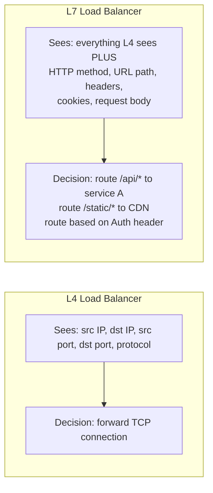
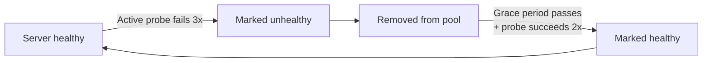
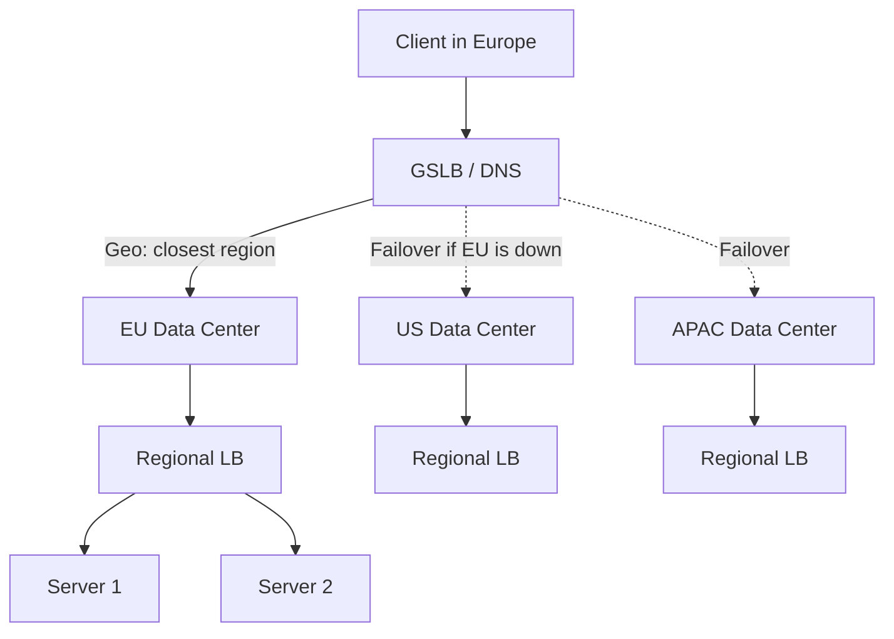
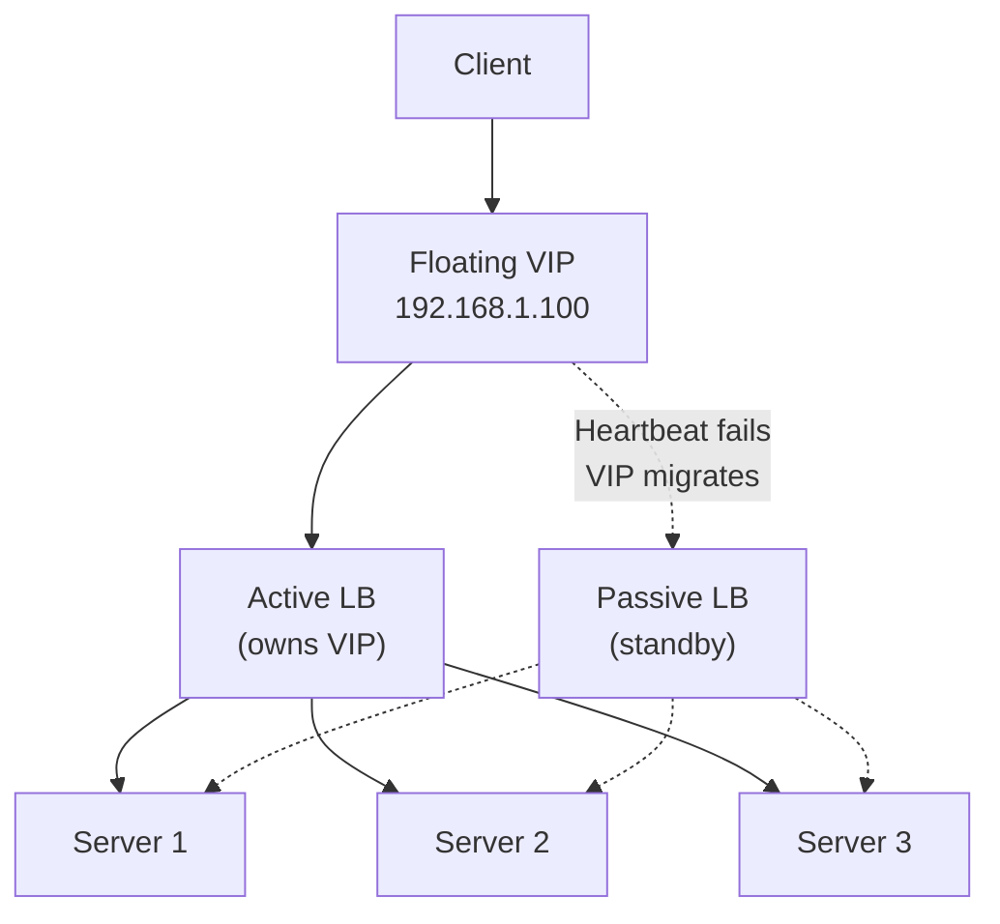
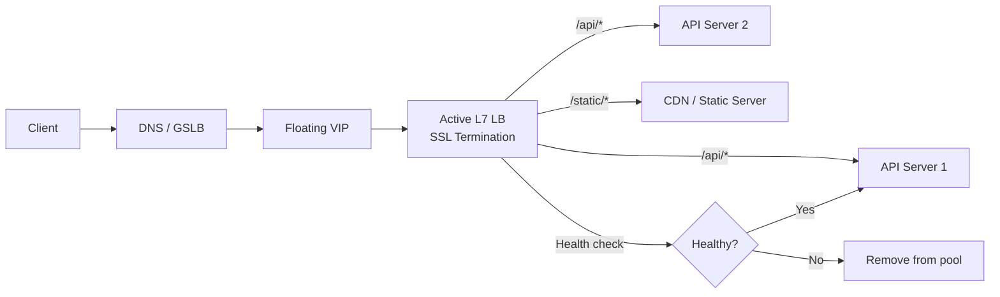

# Load Balancing (HLD)

## Quick Summary (TL;DR)

- A load balancer sits between clients and servers, distributing incoming traffic so no single server is overwhelmed or becomes a single point of failure (SPOF).
- **L4 (transport)** LBs route by IP/port and are fast; **L7 (application)** LBs inspect HTTP headers, cookies, and URL paths for smarter routing.
- Common algorithms: Round Robin, Weighted Round Robin, Least Connections, IP Hash, Consistent Hashing, Random.
- Health checks (active probes + passive observation) remove unhealthy nodes automatically.
- For high availability, LBs themselves run in **active-passive pairs** behind a floating Virtual IP (VIP).

---

## 🤓 Noob Jargon Buster

* **Reverse Proxy**: A server that stands in front of web servers and forwards client requests to those web servers. (A Load Balancer is a type of reverse proxy).
* **SPOF (Single Point of Failure)**: A part of a system that, if it fails, will stop the entire system from working.
* **SSL/TLS Termination**: The process of decrypting encrypted HTTPS traffic at the load balancer level before forwarding it as plain HTTP to backend servers, saving CPU cycles on backend servers.
* **Active-Passive / Floating VIP**: Two load balancers running together. The Active one processes all traffic, while the Passive one watches. If the Active one fails, the "Floating Virtual IP" instantly points to the Passive one, so clients don't experience downtime.

---

## Real-World Analogy

Think of a busy restaurant with a **host at the front desk**. Guests (requests) arrive and the host (load balancer) seats them at tables (servers) based on which tables have open capacity. If a table's waiter calls in sick (health check fails), the host stops seating guests there. If the host themselves gets sick, a backup host (passive LB) steps in using the same podium (floating VIP) so guests never notice.

---

## What & Why

**What**: A load balancer is a reverse proxy that distributes network or application traffic across multiple backend servers.

**Why you need one**:

| Problem without LB | How LB solves it |
|---|---|
| Single server = SPOF | Traffic rerouted to healthy nodes on failure |
| Uneven load distribution | Algorithms spread requests evenly |
| Cannot scale horizontally | Add/remove servers behind LB transparently |
| Poor latency for global users | GSLB routes to nearest region |
| SSL termination on every server | Offload TLS at the LB layer |

---

## L4 vs L7 Load Balancing

**L4 (Transport Layer)** operates on TCP/UDP. It sees source/destination IP and port, makes routing decisions without inspecting the payload. Fast, low overhead.

**L7 (Application Layer)** operates on HTTP/HTTPS. It can inspect headers, cookies, URL path, query params, and even request body. Smarter but slightly more latency.

| Aspect | L4 | L7 |
|---|---|---|
| OSI Layer | Transport (TCP/UDP) | Application (HTTP/gRPC) |
| Speed | Faster (no payload inspection) | Slightly slower |
| Routing intelligence | IP + port only | URL path, headers, cookies |
| SSL termination | No (pass-through) | Yes |
| Use case | High-throughput, TCP services, databases | Microservices, API gateways, content-based routing |
| AWS product | NLB | ALB |
| Example | HAProxy in TCP mode | Nginx, Envoy |

**When to use which**:
- **L4**: You need raw throughput, your protocol is not HTTP (e.g., database connections, gRPC without HTTP routing), or you want TLS pass-through.
- **L7**: You need path-based routing (`/api` vs `/web`), A/B testing via headers, cookie-based sticky sessions, or WebSocket upgrade handling.

---

## Load Balancing Algorithms

| Algorithm | How it works | Pros | Cons |
|---|---|---|---|
| **Round Robin** | Rotate through servers sequentially | Simple, even distribution if servers are identical | Ignores server capacity and current load |
| **Weighted Round Robin** | Like RR but servers get proportional share by weight | Handles heterogeneous hardware | Weights are static; doesn't adapt to live load |
| **Least Connections** | Route to server with fewest active connections | Adapts to real-time load | Slightly more overhead to track connection counts |
| **IP Hash** | Hash client IP to deterministically pick a server | Same client hits same server (pseudo-sticky) | Uneven distribution if IP space is skewed; breaks with NAT |
| **Consistent Hashing** | Hash ring minimizes remapping when nodes join/leave | Great for caches (minimizes cache misses on scaling) | More complex to implement (see separate file) |
| **Random** | Pick a server at random | Zero state, simple | Statistically even only at scale |

**Interview tip**: "Least Connections" is the safest default answer for most web services. Mention Consistent Hashing when discussing caching layers (Memcached, Redis cluster).

---

## Health Checks

Health checks ensure the LB only sends traffic to servers that can actually handle it.

### Active vs Passive

| Type | Mechanism | Example |
|---|---|---|
| **Active** | LB periodically pings each backend (HTTP GET `/health`, TCP connect, or script) | Every 10s, hit `GET /healthz`; 3 consecutive failures = mark down |
| **Passive** | LB monitors live traffic responses for errors | 5xx responses exceed threshold in 30s window = mark down |

### Lifecycle of a failed node

**Grace period**: After a server recovers, don't immediately send full traffic. Ramp up gradually (some LBs call this "slow start") to avoid overwhelming a cold JVM or empty cache.

**Key config knobs**: check interval, unhealthy threshold (consecutive failures), healthy threshold (consecutive successes), timeout per probe.

---

## Sticky Sessions (Session Affinity)

**What**: Route all requests from the same client to the same backend server. Implemented via:
- Cookie injection (LB sets a cookie like `SERVERID=backend-2`)
- IP hash (less reliable due to NAT/proxies)

**Why they hurt scalability**:
- Uneven load: one server may accumulate heavy sessions while others idle.
- Cannot freely remove servers; draining sticky sessions takes time.
- Horizontal scaling becomes harder: new servers get zero traffic from existing sessions.

**Alternatives** (strongly preferred):

| Alternative | How |
|---|---|
| **Externalized sessions** | Store session state in Redis / Memcached; any server can serve any request |
| **Stateless design** | JWT tokens carry state client-side; server needs nothing |
| **Client-side storage** | Encrypted cookies hold small state |

**Interview answer**: "I'd avoid sticky sessions entirely. Externalize state to Redis so servers remain stateless and horizontally scalable."

---

## DNS-based vs Hardware vs Software LB

| Type | Examples | Pros | Cons |
|---|---|---|---|
| **DNS-based** | Route 53, Cloudflare DNS | Global distribution, no infra to manage | TTL caching delays failover, no health-check granularity |
| **Hardware** | F5 BIG-IP, Citrix ADC | Extremely high throughput, ASIC-optimized | Expensive, vendor lock-in, hard to scale |
| **Software** | Nginx, HAProxy, Envoy | Cheap, flexible, easy to automate | Uses CPU (but modern hardware handles millions of RPS) |
| **Cloud-managed** | AWS ALB/NLB/ELB, GCP Cloud LB | Zero ops, auto-scaling, native integrations | Cloud lock-in, cost at scale |

### AWS Load Balancer Cheat Sheet

| Product | Layer | Key use case |
|---|---|---|
| **CLB** (Classic) | L4 + L7 | Legacy; avoid for new designs |
| **ALB** (Application) | L7 | HTTP/HTTPS, path-based routing, gRPC, WebSockets |
| **NLB** (Network) | L4 | Ultra-low latency, static IP, TCP/UDP, TLS passthrough |
| **GWLB** (Gateway) | L3 | Inline network appliances (firewalls, IDS) |

---

## Global Server Load Balancing (GSLB)

GSLB distributes traffic across **geographically distributed data centers**, not just servers within one DC.

**Techniques**:
- **Geo-routing**: Route users to the nearest data center based on client IP geolocation.
- **Latency-based routing**: Measure actual latency from the client to each region; pick the lowest.
- **Failover**: If an entire region goes down, DNS resolves to the next-closest healthy region.

**How it works**: Typically implemented at the **DNS layer**. The authoritative DNS server returns different IP addresses based on the client's location or measured latency.

**GSLB + Regional LB** is the standard two-tier architecture: GSLB picks the region, regional LB picks the server.

---

## Redundancy: Active-Passive LB Pairs

The LB itself can be a SPOF. Solution: run two LB instances sharing a **floating Virtual IP (VIP)**.

**How failover works**:
1. Active and Passive LBs exchange **heartbeats** (e.g., VRRP protocol).
2. If the Active LB stops responding, the Passive LB claims the VIP via a gratuitous ARP.
3. Clients still connect to the same VIP -- failover is transparent.
4. Existing TCP connections are dropped (unless using connection state sync, which adds complexity).

**Protocols**: VRRP (Virtual Router Redundancy Protocol), Keepalived (Linux), AWS uses multi-AZ with automatic failover built in.

---

## Request Flow: Full Picture

---

## Interview Angles

1. **"Design the load balancing for a system handling 100k RPS"** -- Two-tier: GSLB (Route 53 latency-based) + regional ALBs. Least Connections algorithm. Auto-scaling target groups.
2. **"How do you handle session state with load balancers?"** -- Externalize to Redis. Avoid sticky sessions. Use JWTs for auth state.
3. **"What happens when a load balancer itself goes down?"** -- Active-passive pair with VRRP, floating VIP. Cloud LBs handle this internally (multi-AZ).
4. **"L4 or L7 for a microservices architecture?"** -- L7 (ALB) for HTTP path-based routing between services. L4 (NLB) in front if you need static IPs or non-HTTP protocols.
5. **"How does consistent hashing relate to load balancing?"** -- Used in caching layers and stateful services to minimize redistribution when nodes are added/removed.
6. **"Why not just use DNS round robin?"** -- No health checks, TTL caching causes stale routing, no load awareness, uneven distribution due to client-side caching.

---

## Traps

| Trap | Why it's wrong | Correct answer |
|---|---|---|
| "Just use sticky sessions for state" | Kills horizontal scalability, creates hotspots | Externalize state to Redis/Memcached |
| "DNS load balancing is enough" | No real health checks, TTL delays failover by minutes | DNS for GSLB + software/cloud LB for real-time balancing |
| "Add more LBs to handle more traffic" | LBs themselves need to be managed; cascading failure risk | Scale vertically (NLB handles millions of RPS) or use cloud-managed LB with auto-scaling |
| "L7 is always better than L4" | L7 adds latency and has lower throughput ceiling | Use L4 when you don't need content inspection |
| "Round Robin is good enough" | Ignores server health and current load | Least Connections or Weighted RR for production |
| "Health checks are optional" | One bad server tanks user experience for a fraction of traffic | Always configure both active and passive health checks |
| Forgetting LB is itself a SPOF | Single LB = single point of failure | Active-passive pair with floating VIP or cloud-managed HA |

---

## Key Numbers to Remember

| Metric | Approximate value |
|---|---|
| AWS NLB throughput | Millions of RPS, single-digit ms latency |
| AWS ALB throughput | Tens of thousands of RPS per instance (auto-scales) |
| Typical health check interval | 5-30 seconds |
| DNS TTL for GSLB | 60-300 seconds (trade-off: failover speed vs DNS load) |
| VRRP failover time | 1-3 seconds |
