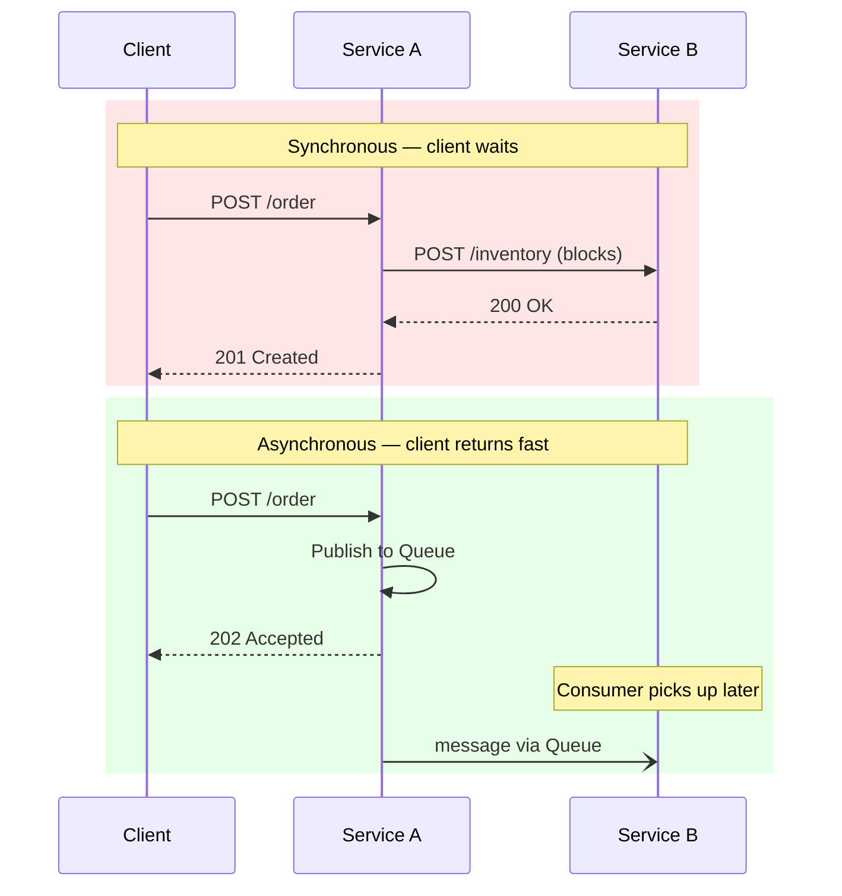
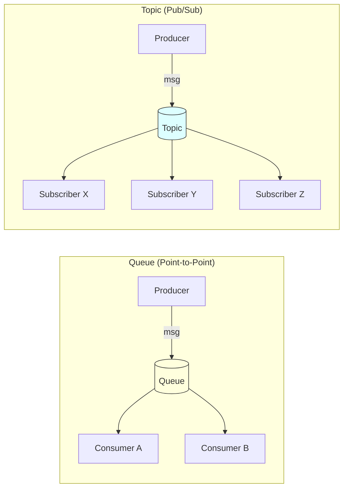
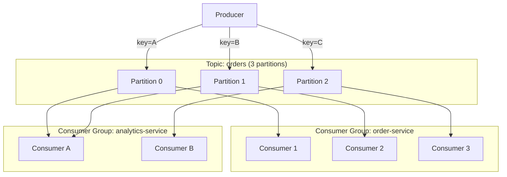
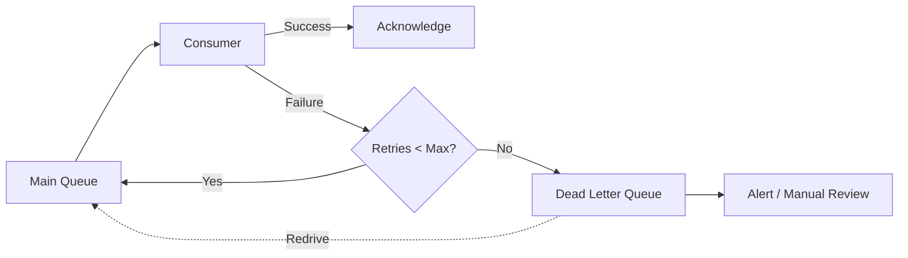
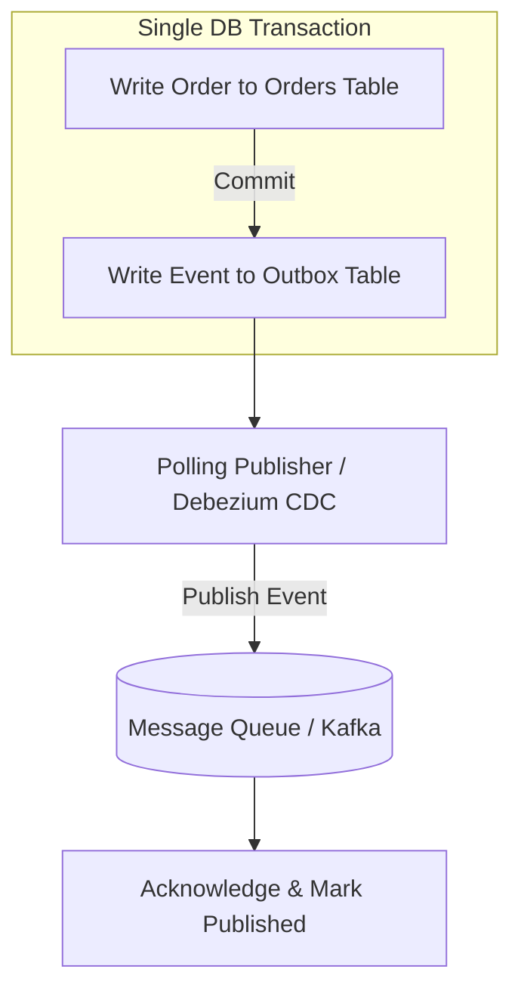

# Message Queues (HLD)

## Quick Summary (TL;DR)

- Message queues **decouple** producers from consumers, enabling async processing, load leveling, and fault tolerance.
- **Queue = point-to-point** (one consumer gets each message); **Topic = pub/sub** (every subscriber gets a copy).
- **Exactly-once delivery is nearly impossible** in distributed systems; design for at-least-once + idempotency instead.
- **Ordering is expensive** — Kafka gives partition-level ordering; global ordering does not scale.
- Pick the right tool: **Kafka** for high-throughput event streaming, **RabbitMQ** for flexible routing, **SQS** for zero-ops simplicity.

---

## 🤓 Noob Jargon Buster

* **Decoupling**: Separating software services so that they don't depend directly on one another's immediate availability or technology stack.
* **Producers & Consumers**: *Producers* are services that send/publish messages. *Consumers* are services that receive and process those messages.
* **Idempotency**: An operation is idempotent if performing it multiple times has the exact same result as performing it once (crucial when queues deliver duplicate messages).
* **DLQ (Dead Letter Queue)**: A service queue where messages that fail to process successfully after multiple attempts are stored for debugging/inspection.
* **Backpressure**: When a consumer is overwhelmed by message volume, backpressure allows it to signal the queue/producer to slow down the rate of incoming messages.

---

## Real-World Analogy

Think of a **restaurant kitchen**. The waiter (producer) pins order slips on a rail (queue). Cooks (consumers) grab slips one at a time — the waiter never waits for the food to be cooked before taking the next table's order. If a cook is slow, slips pile up on the rail (backpressure). If a slip is unreadable, it goes into a "problem orders" bin (dead letter queue). The rail decouples the dining room from the kitchen.

---

## 1. What and Why

| Problem | How Queues Help |
|---------|----------------|
| **Tight coupling** | Producer does not need to know who consumes the message or whether consumer is even running |
| **Sync bottlenecks** | Producer fires-and-forgets; consumer processes at its own pace |
| **Traffic spikes** | Queue absorbs bursts (load leveling) — consumer drains at a steady rate |
| **Fault tolerance** | If consumer crashes, messages persist in the queue and are reprocessed after recovery |

### Sync vs Async Flow



---

## 2. Queue vs Topic (Pub/Sub)



| Aspect | Queue (Point-to-Point) | Topic (Pub/Sub) |
|--------|----------------------|-----------------|
| **Delivery** | Each message consumed by exactly one consumer | Each message delivered to all subscribers |
| **Use case** | Task distribution, work queues | Event broadcasting, notifications |
| **Scaling** | Add consumers to share load (competing consumers) | Each subscriber gets full copy |
| **Example** | SQS standard queue, RabbitMQ queue | Kafka topic, SNS topic |

**Consumer Groups** (Kafka model): subscribers within the same group share partitions (queue semantics), while different groups each get every message (topic semantics). This gives you both patterns in one abstraction.

---

## 3. Delivery Guarantees

| Guarantee | Meaning | Risk | Example |
|-----------|---------|------|---------|
| **At-most-once** | Fire and forget; no retry | Message loss | UDP-style logging |
| **At-least-once** | Retry until acknowledged | Duplicate processing | Kafka default, SQS |
| **Exactly-once** | Each message processed once | Extremely hard to achieve | Kafka transactions (within Kafka only) |

### Why Exactly-Once Is Hard

In a distributed system, the producer, broker, and consumer are separate processes. Any of these can crash between "process message" and "commit offset." You end up with:

1. **Producer duplicates** — network timeout after broker persists but before ack reaches producer.
2. **Consumer duplicates** — consumer processes message, crashes before committing offset.

The broker can deduplicate producer retries (Kafka idempotent producer), but the consumer side requires **end-to-end idempotency**.

### The Practical Solution: Idempotency

```
// Pseudocode — idempotent consumer
void handlePayment(PaymentEvent event) {
    if (db.exists(event.idempotencyKey)) {
        return; // already processed — skip
    }
    db.executeInTransaction(() -> {
        processPayment(event);
        db.saveIdempotencyKey(event.idempotencyKey);
    });
}
```

Design every consumer so that processing the same message twice produces the same result. Use a unique **idempotency key** (event ID, request ID, or natural key).

---

## 4. Ordering Guarantees

| Level | How | Trade-off |
|-------|-----|-----------|
| **No ordering** | Messages processed in any order | Maximum throughput |
| **Partition-level (Kafka)** | Messages with same key go to same partition; ordered within partition | Good balance — scales with partitions |
| **FIFO (SQS FIFO)** | Strict ordering within a message group ID | 300 msg/s per group (3000 with batching) |
| **Global ordering** | Single partition / single queue | Does not scale — bottleneck |

**Key insight**: if you need ordering for "all events for order #123," use `order-123` as the partition key. You get ordering where it matters without sacrificing throughput.

---

## 5. Kafka vs RabbitMQ vs SQS

| Feature | Kafka | RabbitMQ | SQS |
|---------|-------|----------|-----|
| **Model** | Distributed log (append-only) | Broker with exchanges and queues | Managed queue service |
| **Throughput** | Millions msg/s | Tens of thousands msg/s | Scales automatically |
| **Ordering** | Per-partition | Per-queue (not guaranteed with competing consumers) | FIFO variant available |
| **Replay** | Yes — consumers control offset | No — message deleted after ack | No (unless you use DLQ redrive) |
| **Routing** | Topic + partitions | Exchanges: direct, fanout, topic, headers | Simple queue or FIFO |
| **Ops burden** | High (ZK/KRaft, brokers, partitions) | Medium (Erlang cluster) | Zero (AWS managed) |
| **Best for** | Event streaming, audit logs, high-throughput pipelines | Complex routing, RPC patterns, priority queues | Simple decoupling in AWS, serverless |

### Kafka Architecture: Partitions and Consumer Groups



**Key points:**
- Within a consumer group, each partition is assigned to exactly one consumer.
- Adding more consumers than partitions means some consumers sit idle.
- Different consumer groups independently read the same topic (pub/sub behavior).

---

## 6. Dead Letter Queue (DLQ)

A DLQ is a separate queue where messages land after exceeding the maximum retry count. Without a DLQ, a **poison pill** message (one that always fails) blocks the queue forever.

### DLQ Retry Flow



### Retry Strategies

| Strategy | Description | Use When |
|----------|-------------|----------|
| **Immediate retry** | Retry right away | Transient network blip |
| **Exponential backoff** | 1s, 2s, 4s, 8s... | Downstream temporarily overloaded |
| **Exponential + jitter** | Backoff with random offset | Prevents thundering herd |
| **Fixed delay queue** | Park message for N seconds before retry | Rate-limited APIs |

**Poison pill**: a message that will never succeed no matter how many times you retry (malformed payload, schema mismatch). Always cap retries and route to DLQ.

---

## 7. Backpressure

Backpressure occurs when **consumers cannot keep up** with the rate of incoming messages.

| Signal | Solution |
|--------|----------|
| Queue depth growing | Scale out consumers (auto-scaling group) |
| Consumer lag increasing (Kafka) | Add partitions + consumers |
| OOM on consumer | Limit prefetch / batch size |
| Producer overwhelming broker | Rate-limit producer, enable flow control |

**Strategies:**
1. **Scale consumers horizontally** — most common; works well with Kafka consumer groups and SQS.
2. **Rate-limit the producer** — push back via HTTP 429 or broker flow control (RabbitMQ credit flow).
3. **Buffering** — accept temporary lag if SLA allows it; queue is the buffer.
4. **Drop or sample** — acceptable for metrics/logs, never for payments.

---

## 8. Event-Driven Architecture Basics

| Pattern | Description | Example |
|---------|-------------|---------|
| **Event Notification** | Service emits thin event ("OrderCreated, id=42"); consumers query for details | Loose coupling, but can cause event storms |
| **Event-Carried State Transfer** | Event contains full payload; consumers do not call back | Reduces coupling further; larger messages |
| **Event Sourcing** | Persist every state change as an immutable event; rebuild state by replaying | Audit logs, financial systems |
| **CQRS** | Separate write model (commands) from read model (queries) | Optimized read views, eventual consistency |

**Event Sourcing vs Event Notification**: Event sourcing is a storage pattern (your source of truth is the event log). Event notification is an integration pattern (you are telling other services something happened). They are complementary, not alternatives.

---

## SDE-2 Message Queues Deep Dive (The Details)

In an SDE-2 interview, you must know how to handle message duplication (guaranteeing idempotency) and how to reliably publish messages without data loss (the Outbox Pattern).

### 1. Reliable Publishing: The Transactional Outbox Pattern
*Problem*: In microservices, when a user orders a product, Service A writes the order to the database AND publishes an event to Kafka. If Service A crashes *after* writing to the database but *before* publishing to Kafka, the message is lost forever. If it publishes to Kafka first and the database write fails, the consumer acts on invalid data.



*Solution*: 
1. The application updates the business entity (e.g., `orders` table) AND writes an event record to an `outbox` table **inside the same database transaction**. This guarantees that either both succeed or both fail.
2. A separate background publisher (either a polling worker or a log reader like Debezium CDC) reads from the `outbox` table, publishes the messages to Kafka, and marks them as `published` upon receiving the MQ broker's ACK.

---

### 2. Idempotent Consumers (Deduplication)
Since queues guarantee **at-least-once** delivery, you *will* receive duplicate messages. The consumer must be idempotent.

```sql
-- Represents a table to track processed event IDs
CREATE TABLE processed_events (
    event_id VARCHAR(64) PRIMARY KEY,
    processed_at TIMESTAMP DEFAULT CURRENT_TIMESTAMP
);
```

#### The Idempotency Check Flow:
1. When a message arrives with `event_id = "evt_998"`:
2. The consumer attempts to insert `"evt_998"` into the `processed_events` table within its database transaction.
3. **If the insert fails** due to a unique key violation (primary key constraint):
   - The consumer recognizes this is a duplicate event.
   - It immediately logs the event, ACKs it to the queue (to stop retries), and **skips processing**.
4. **If the insert succeeds**:
   - The consumer processes the business logic (e.g., updates user balance).
   - It commits the transaction and ACKs the message.

---

### 3. Kafka Partitioning & Message Ordering
*Problem*: If a user triggers two events: (1) `CreateOrder` followed by (2) `CancelOrder`, they must be processed in order. If they land on different partitions, Consumer A might process `CancelOrder` before Consumer B processes `CreateOrder`.

*SDE-2 Solution*: Use a custom **Partition Key** like `order_id` (not a random key or round-robin routing). Kafka guarantees message order *only* within a single partition. Specifying `order_id` as the key forces all updates for that specific order to route to the exact same partition, ensuring sequential processing by a single consumer thread.

---

## Interview Angles

1. **"Design a notification system"** — Classic queue use case. Discuss queue per channel (email, SMS, push), DLQ for failed sends, idempotency to avoid duplicate notifications.
2. **"How would you handle 10x traffic spike?"** — Queue absorbs burst (load leveling), auto-scale consumers, monitor queue depth.
3. **"Kafka vs RabbitMQ for X?"** — Kafka if you need replay, high throughput, event sourcing. RabbitMQ if you need flexible routing, priority, or RPC.
4. **"How do you ensure messages are processed exactly once?"** — Explain why true exactly-once is near-impossible across systems. Pivot to at-least-once + idempotent consumers.
5. **"What happens if a consumer is slow?"** — Backpressure discussion: queue depth grows, lag increases, solutions are scale out or rate-limit producer.
6. **"How do you handle message ordering?"** — Partition key strategy, trade-offs of global vs partition-level ordering.

---

## Traps

| Trap | Why It Is Wrong | Correct Answer |
|------|----------------|----------------|
| "We will use exactly-once delivery" | Exactly-once across distributed systems is not practically achievable end-to-end | Design for at-least-once + idempotency |
| "Just add more partitions for ordering" | More partitions = more parallelism but ordering only within a partition; must co-locate related messages via key | Use consistent partition key for related events |
| "Queue solves all latency problems" | Queues add latency (async); not suitable when you need sync response | Use sync calls for real-time reads; async for background work |
| "DLQ means we handle all errors" | DLQ is a parking lot, not a solution; someone must monitor and redrive | Set up alerts, dashboards, and redrive policies |
| "Kafka is always better than RabbitMQ" | Kafka is overkill for simple task queues; RabbitMQ is simpler for routing/priority | Choose based on requirements, not hype |
| "Global ordering with Kafka" | Single partition = no parallelism | Accept partition-level ordering; design partition keys carefully |
| "Consumer can just retry forever" | Poison pill blocks the queue; infinite retries waste resources | Cap retries, use exponential backoff, route to DLQ |
