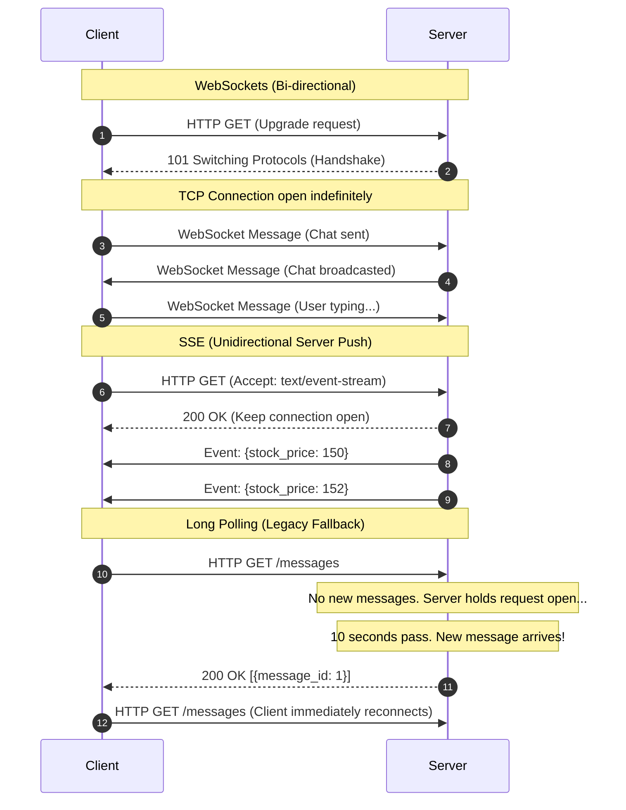

# Communication Protocols (HLD)

## Quick Summary (TL;DR)
- Choose **REST** or **GraphQL** for standard client-to-server APIs (GraphQL if clients need to query dynamic/custom nested structures; REST for simple resources).
- Use **gRPC** (over HTTP/2) for internal server-to-server communication due to high performance, low payload size (binary Protobuf), and contract enforcement.
- Use **WebSockets** for persistent, low-latency, bi-directional communication (e.g., chat systems, multiplayer gaming).
- Use **Server-Sent Events (SSE)** for unidirectional server-to-client streaming (e.g., notifications, live news feeds, dashboard updates).
- **Long Polling** is a legacy fallback where clients hold HTTP connections open until the server responds with data.

---

## 🤓 Noob Jargon Buster

* **Unidirectional**: One-way traffic. Either only the client can send data, or only the server can push data.
* **Bi-directional**: Two-way traffic. Both client and server can send data simultaneously over the same connection.
* **Multiplexing**: Sending multiple requests/responses over a single TCP connection at the same time (supported natively in HTTP/2).
* **Protobuf (Protocol Buffers)**: Google's binary serialization format. It is much smaller and faster to parse than JSON or XML.
* **Keep-Alive (Persistent Connection)**: Keeping a single TCP connection open for multiple requests/responses instead of closing it after one exchange.

---

## Real-World Analogy

Think of ways to communicate:
- **REST**: Ordering by mail. You send a specific form (request) to a warehouse, and they mail you back a pre-packaged box (JSON response). If you need more items, you send more mail forms.
- **GraphQL**: Submitting a custom grocery list. Instead of buying standard boxes, you list exactly what items and attributes you want, and the store compiles them into a single bag.
- **gRPC**: Two walkie-talkies in the same company. They speak a private shorthand code (binary Protobuf) and talk directly over a dedicated frequency (HTTP/2) for rapid updates.
- **WebSockets**: A continuous phone call. Both parties keep the line open and can talk to each other at any moment without redialing.
- **SSE**: Listening to a radio broadcast. You tune in once (single request), and the station streams continuous updates to you (unidirectional server push).
- **Long Polling**: Ordering food at a drive-thru and being told to park and wait. The worker holds your order open and only comes to your car when the food is ready.

---

## Technical Comparison Matrix

| Protocol | Transport | Direction | Latency | Payload | Use Cases |
| :--- | :--- | :--- | :--- | :--- | :--- |
| **REST** | HTTP/1.1 or 2 | Request-Response | Medium | Text (JSON/XML) | Public CRUD APIs, standard web clients |
| **GraphQL** | HTTP/1.1 or 2 | Request-Response | Medium | Text (JSON queries) | Mobile app gateways, aggregating diverse queries |
| **gRPC** | HTTP/2 | Bi-directional streaming | Very Low | Binary (Protobuf) | Microservices communication, IoT pipelines |
| **WebSockets** | TCP (custom handshake) | Bi-directional persistent | Extremely Low | Text/Binary | Real-time chat, gaming, collab tools (Figma) |
| **SSE** | HTTP | Unidirectional (Server -> Client) | Low | Text (Event-stream) | Stock tickers, notifications, social feeds |
| **Long Polling** | HTTP/1.1 | Request-Response (delayed) | High (overhead of reconnects) | Text (JSON) | Legacy chat clients, fallback systems |

---

## Architecture Flow

### WebSockets vs SSE vs Long Polling



---

## Deep Concepts

### 1. gRPC & HTTP/2
gRPC achieves its speed by using HTTP/2 features:
- **Header Compression (HPACK)**: Reduces HTTP header overhead.
- **Multiplexing**: Eliminates the "head-of-line blocking" problem on TCP connections by allowing multiple concurrent requests.
- **Strong Typing**: APIs are defined in a `.proto` file. The compiler generates client stubs and server skeletons in multiple languages (Java, Go, Python), ensuring type safety across teams.

### 2. Overfetching vs Underfetching (GraphQL)
In REST, calling `/users/1` returns the entire user payload (overfetching). If you also want their posts, you make a second call to `/users/1/posts` (underfetching). 
GraphQL solves this by allowing the client to request precisely what it needs:
```graphql
query {
  user(id: 1) {
    name
    posts {
      title
    }
  }
}
```

---

## Interview Angles (How to choose)

* **Question**: "Design a real-time multiplayer document editor (like Google Docs)."
  - **Noob Answer**: REST endpoints called every 500 milliseconds (short polling).
  - **Pro Answer**: Establish a WebSocket connection so both clients and the server can stream collaborative operational transformation (OT) updates bi-directionally with sub-millisecond overhead.
* **Question**: "How do your microservices talk to one another?"
  - **Noob Answer**: Standard HTTP/JSON REST clients.
  - **Pro Answer**: We use gRPC. The binary serialization minimizes internal network bandwidth, and code generation enforces compile-time contracts between different service teams.

---

## Common Traps

1. **Firewalls and WebSockets**: Many corporate firewalls block non-HTTP traffic. WebSockets starts as an HTTP connection but upgrades to a custom TCP socket, which can cause connection drops. (Mitigate by using HTTPS/WSS secure connections).
2. **GraphQL N+1 Query Problem**: If a GraphQL resolver is poorly written, querying a list of users and their posts might execute 1 query to fetch $N$ users, followed by $N$ separate queries to fetch posts for each user.
3. **No gRPC Load Balancing out of the box**: Because gRPC reuses a single persistent HTTP/2 connection, standard L4 connection-level load balancers fail. You need L7 load balancers (like Envoy) that can balance requests at the frame/stream level.
