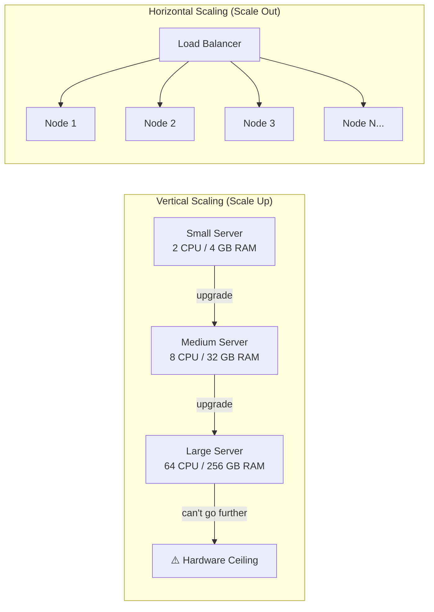
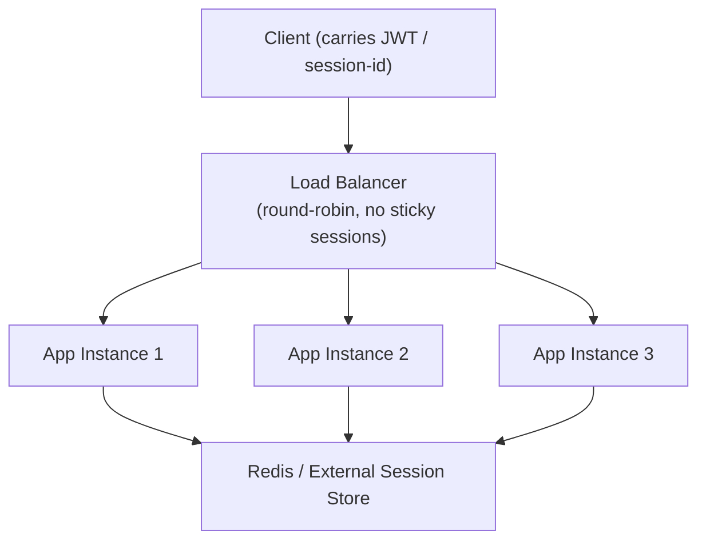
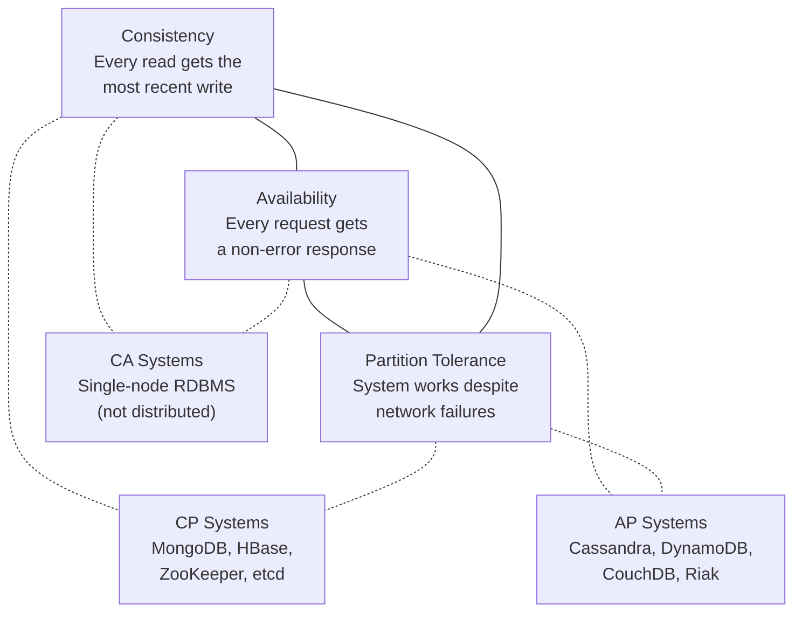

# Scaling 101 — The Foundation (HLD)

## Quick Summary (TL;DR)
- **Vertical scaling** (bigger machine) is simple but has a ceiling; **horizontal scaling** (more machines) is how real systems grow.
- Horizontal scaling demands **stateless services** — externalize all session/state to Redis, a DB, or a shared store.
- **CAP Theorem**: In a distributed system you can only guarantee two of Consistency, Availability, and Partition Tolerance — and since network partitions *will* happen, the real choice is CP vs AP.
- **PACELC** extends CAP: even when there is *no* partition, you still trade off **latency vs consistency**.
- **p99 latency** matters more than averages; **99.9% uptime** still allows 8.76 hours of downtime per year.

---

## 🤓 Noob Jargon Buster

If you are new to high-level design, here are a few terms to know:
* **Latency**: The time it takes for a request to go from client to server and back. (Averages can hide slow requests, which is why we look at **p99 latency** — meaning 99% of requests are faster than this number, and only 1% are slower).
* **Statelessness**: Designing a service so it does not store any user session data in its own memory. This allows any instance of the service to handle any request.
* **SLA (Service Level Agreement)**: A contract defining the expected performance/uptime (e.g., "our system will be online 99.9% of the time").
* **Network Partition**: A network failure that prevents communication between two or more nodes in a cluster.

---

## 1. Vertical vs Horizontal Scaling

### The Restaurant Analogy

Imagine you run a small restaurant with one chef.

- **Vertical scaling**: You replace the chef with a superhuman chef who can cook 10x faster. Works great... until even the superhuman maxes out. You cannot keep making one chef infinitely faster.
- **Horizontal scaling**: You hire more chefs and add more stoves. Each chef handles a portion of the orders. You can keep adding chefs as demand grows.

### Technical Breakdown

**Vertical scaling (scale up)**: Add more CPU, RAM, or faster disks to a single machine.
- Simple — no code changes needed.
- Single point of failure.
- Hardware ceiling: you cannot buy a machine with 10 TB RAM forever.
- Cost grows non-linearly (a 2x bigger AWS instance is often 3-4x the price).

**Horizontal scaling (scale out)**: Add more machines behind a load balancer.
- Near-infinite scaling potential.
- Requires stateless design (more below).
- Adds operational complexity: load balancing, service discovery, data partitioning.
- Commodity hardware — cheaper per unit.



### When to Use Each

| Factor | Vertical | Horizontal |
| :--- | :--- | :--- |
| **Complexity** | Low — drop-in upgrade | High — need LB, stateless design, distributed data |
| **Cost curve** | Exponential (diminishing returns) | Linear (add commodity nodes) |
| **Downtime risk** | Single point of failure | Fault-tolerant if designed right |
| **Data consistency** | Trivially consistent (one node) | Requires consensus protocols |
| **Best for** | Databases (short-term), early-stage startups | Web/API tier, microservices, read-heavy workloads |

**Real-world pattern**: Most production systems use *both*. You scale the DB vertically (bigger RDS instance) while scaling the API tier horizontally (more pods behind a load balancer). Eventually even the DB needs horizontal scaling via read replicas or sharding.

---

## 2. Stateless vs Stateful Services

### Why This Matters for Scaling

A **stateful** service stores client session data in memory (e.g., a shopping cart stored in the JVM heap). If you add a second instance, a user routed to instance B won't find the session created on instance A. This forces you into sticky sessions, which defeats the purpose of horizontal scaling.

A **stateless** service keeps zero client-specific state in memory. Every request carries all the information needed (JWT token, session ID pointing to an external store). Any instance can serve any request.



### Session Externalization Strategies

| Strategy | How It Works | Trade-off |
| :--- | :--- | :--- |
| **Redis / Memcached** | Store session in an external cache. Spring Session + Redis does this transparently. | Extra infra; sub-ms latency if co-located |
| **JWT (client-side)** | Encode claims in a signed token. Server is fully stateless. | Token size grows; can't revoke without a blacklist |
| **Database-backed** | Store session rows in a shared DB. | Higher latency than Redis; works for low-traffic apps |
| **Sticky sessions** | LB pins a user to one instance via cookies. | Defeats horizontal scaling; hot-spots and failover problems |

### Code-Level Thinking: Spring Session + Redis

```java
// application.yml — that's all you need to externalize sessions
spring:
  session:
    store-type: redis
  data:
    redis:
      host: redis-cluster.internal
      port: 6379
```

With this config, `HttpSession` is transparently stored in Redis. You can kill any app instance and the user's session survives — true stateless horizontal scaling.

### The Rule of Thumb

> If you can't kill a random instance without any user noticing, your service is stateful.

---

## 3. CAP Theorem

### The Analogy

You run a chain of bookstores in 3 cities. Each store has a copy of the inventory ledger.

- **Consistency (C)**: Every store shows the exact same inventory count at all times.
- **Availability (A)**: Every store can answer "how many copies of Book X?" even if it can't reach the other stores.
- **Partition Tolerance (P)**: The system keeps working even if the network link between cities goes down.

When the network link breaks (partition), you must choose:
- **CP**: Stores refuse to answer until they re-sync (consistent but unavailable).
- **AP**: Stores answer from their local ledger, which may be stale (available but inconsistent).

### The Triangle (Pick 2)



### Why CA Doesn't Exist in Distributed Systems

A network partition *will* happen (cables get cut, routers crash, cloud AZs lose connectivity). Partition tolerance is not optional in a distributed system — it's a reality you must handle. So the real choice is always **CP vs AP**.

A single-node PostgreSQL is technically CA: it's consistent and available, but it can't tolerate partitions because there's only one node. The moment you add a replica across a network, you enter CP or AP territory.

### Real Database Examples

| System | CAP Choice | Behavior During Partition |
| :--- | :--- | :--- |
| **MongoDB** (with majority write concern) | CP | Rejects writes if primary can't reach majority of replicas |
| **HBase / ZooKeeper** | CP | Leader election blocks until quorum; unavailable during split |
| **Cassandra** | AP | Accepts writes on any available node; resolves conflicts via last-write-wins |
| **DynamoDB** | AP (default) | Eventually consistent reads; strong consistency optional per-read |
| **Single-node PostgreSQL** | CA | No partition to tolerate; irrelevant in distributed context |
| **CockroachDB** | CP | Serializable consistency; rejects ops if quorum is lost |

---

## 4. PACELC Theorem

CAP only describes behavior *during a partition*. But most of the time your network is fine. What trade-off do you make then?

**PACELC** says: **If** there is a **P**artition, choose **A** vs **C**; **E**lse (normal operation), choose **L**atency vs **C**onsistency.

### Breaking It Down

```
IF Partition → choose Availability or Consistency
ELSE         → choose Latency or Consistency
```

| System | During Partition (PAC) | Normal Operation (ELC) | Full Classification |
| :--- | :--- | :--- | :--- |
| **Cassandra** | PA (available) | EL (low latency, eventual consistency) | PA/EL |
| **DynamoDB** (default) | PA | EL | PA/EL |
| **MongoDB** | PC (consistent) | EC (consistent, higher latency) | PC/EC |
| **CockroachDB** | PC | EC | PC/EC |
| **Cosmos DB** (tunable) | PA or PC | EL or EC | Depends on consistency level chosen |

### Why This Matters in Interviews

CAP is a binary, extreme scenario. PACELC captures the day-to-day reality: even without failures, reading from the leader node (consistency) costs more latency than reading from the nearest replica (speed). This is the knob you actually tune in production.

**Example**: DynamoDB lets you choose per-read: `ConsistentRead=true` hits the leader (EC — slower, consistent), `ConsistentRead=false` hits any replica (EL — faster, eventually consistent). Understanding PACELC lets you explain *why* that flag exists.

---

## 5. Throughput vs Latency

### Definitions

- **Latency**: Time for a single request to complete (measured in ms). "How long does one user wait?"
- **Throughput**: Number of requests handled per unit time (measured in RPS/QPS). "How many users can we serve?"

They are related but not inversely proportional. You can increase throughput (add more instances) without changing latency (each request still takes the same time).

### Why Averages Lie: Percentiles

Imagine 100 requests. 95 complete in 50 ms, but 5 take 2000 ms (hitting a cold cache or a slow downstream).

| Metric | Value | What It Tells You |
| :--- | :--- | :--- |
| **Average** | 147.5 ms | Looks fine — completely hides the 2-second spikes |
| **p50 (median)** | 50 ms | Half the users see this or better |
| **p95** | 50 ms | 95% of users are happy |
| **p99** | 2000 ms | 1 in 100 users waits 2 seconds — this is your pain point |

**Key insight**: If you have 1 million daily users, p99 = 2s means **10,000 users** per day have a terrible experience. That's why Amazon and Google obsess over p99 and even p99.9.

### The Tail Latency Amplification Problem

In a microservices architecture, one user request fans out to 5-10 backend calls. The response time is determined by the *slowest* call. If each service has p99 = 100 ms, the probability that at least one of 10 calls hits p99 is:

```
P(at least one slow) = 1 - (0.99)^10 = 9.6%
```

So ~10% of user requests will be slow, even though each individual service is fast 99% of the time. This is why backend systems must optimize tail latencies aggressively.

---

## 6. SLAs, SLOs, and SLIs

### Definitions

- **SLI (Service Level Indicator)**: A measured metric — e.g., "request latency p99" or "error rate".
- **SLO (Service Level Objective)**: An internal target — e.g., "p99 latency < 200 ms" or "99.95% availability".
- **SLA (Service Level Agreement)**: A contractual promise to customers — e.g., "99.9% uptime or we credit your bill".

SLAs are always weaker than SLOs. You set an internal SLO of 99.95% so you have a buffer before breaching the external SLA of 99.9%.

### What "Nines" Actually Mean

| Availability | Downtime/Year | Downtime/Month | Downtime/Day |
| :--- | :--- | :--- | :--- |
| 99% (two nines) | 3.65 days | 7.3 hours | 14.4 min |
| 99.9% (three nines) | 8.76 hours | 43.8 min | 1.44 min |
| 99.95% | 4.38 hours | 21.9 min | 43.2 sec |
| 99.99% (four nines) | 52.6 min | 4.38 min | 8.6 sec |
| 99.999% (five nines) | 5.26 min | 26.3 sec | 0.86 sec |

**Reality check**: Going from 99.9% to 99.99% means reducing annual downtime from 8.76 hours to 52 minutes. That last "nine" costs exponentially more in engineering effort, redundancy, and operational discipline.

### The Error Budget Concept

If your SLO is 99.9%, you have a monthly error budget of 43.8 minutes. You can "spend" this on deployments, experiments, or planned maintenance. When the budget is exhausted, you freeze releases and focus on reliability. This is the core of Google's SRE practice.

---

## Interview Angles

### Q1: "You're designing a new service. How do you decide between vertical and horizontal scaling?"

Start with vertical for databases and stateful components (it's simpler and buys time). Go horizontal for the API/compute tier from day one — it's cheap, fault-tolerant, and the industry standard with Kubernetes. Mention that even databases eventually need horizontal scaling via read replicas, sharding, or moving to a distributed DB like CockroachDB.

### Q2: "Your service stores user sessions in memory. How do you scale it?"

Externalize sessions to Redis (Spring Session makes this trivial). Then any instance can serve any request, enabling round-robin load balancing. Mention JWT as an alternative for truly stateless auth, but note the revocation problem.

### Q3: "Explain CAP theorem. Why can't you have all three?"

Network partitions are inevitable in distributed systems. When a partition happens, you must choose: reject requests (sacrifice availability for consistency — CP) or serve potentially stale data (sacrifice consistency for availability — AP). A single-node DB is CA but that's not a distributed system.

### Q4: "Your Cassandra cluster shows stale reads. Is that a bug?"

No — Cassandra is an AP/EL system (PACELC). It prioritizes availability and low latency over consistency. Stale reads are by design. If the use case requires strong consistency, use `LOCAL_QUORUM` for both reads and writes (trading latency for consistency), or reconsider the database choice.

### Q5: "Why do you care about p99 if p50 looks good?"

Because in a microservices world, tail latency amplifies across fan-out calls. If each of 10 services has p99 = 100ms, roughly 10% of user requests will hit at least one slow call. Also, p99 represents your most engaged users (they make the most requests and are most likely to hit the tail). Losing them is expensive.

### Q6: "What does 99.9% availability actually mean for your SLA?"

8.76 hours of downtime per year, or about 43.8 minutes per month. This is the error budget. Smart teams use it deliberately — deploying risky changes when budget is healthy, freezing changes when it's low.

---

## Traps

1. **"Just add more servers"** — Horizontal scaling only works if your service is stateless. If you have in-memory sessions, sticky sessions, or local caches that aren't invalidated properly, adding servers creates inconsistency, not capacity.

2. **"CA is a valid distributed option"** — It's not. Partitions happen in any multi-node system. CA only exists for single-node databases. Claiming CA in a distributed design tells the interviewer you don't understand CAP.

3. **"Average latency is 50 ms so we're fine"** — Averages hide outliers. Always report p50/p95/p99. A system with avg=50ms might have p99=5s, meaning thousands of users per day are angry.

4. **Confusing SLA with SLO** — SLA is external and contractual (breach = money). SLO is internal and tighter (breach = alert and response). Always set SLO stricter than SLA so you have a buffer.

5. **"Let's target five nines"** — 99.999% uptime allows 5 minutes of downtime *per year*. This requires multi-region active-active, zero-downtime deployments, and automated failover. Most teams can't even measure availability that precisely. Start with three nines and earn each additional nine deliberately.

6. **Ignoring PACELC during normal operation** — Candidates discuss CAP during partitions but forget that the latency-vs-consistency trade-off exists *all the time*. DynamoDB's `ConsistentRead` flag, Cassandra's consistency levels, and MongoDB's read preferences are all PACELC knobs you tune daily.

7. **Treating stateless as "no state at all"** — Stateless services still *use* state (database, cache, queues). "Stateless" means the service instance itself holds no client-specific state between requests. The state lives in external stores.
