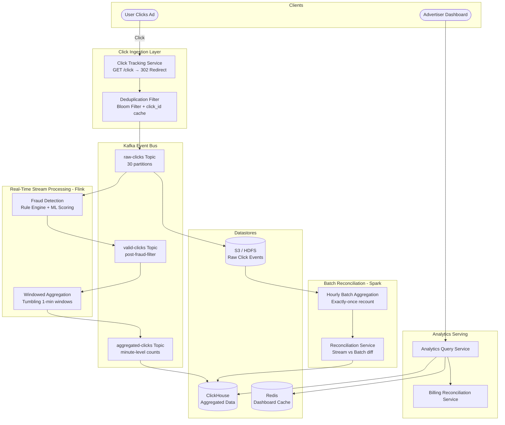
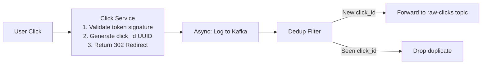
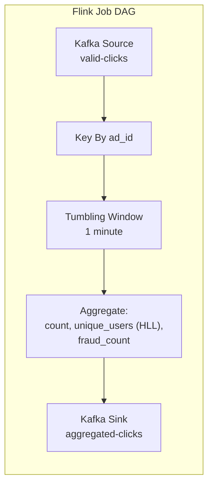
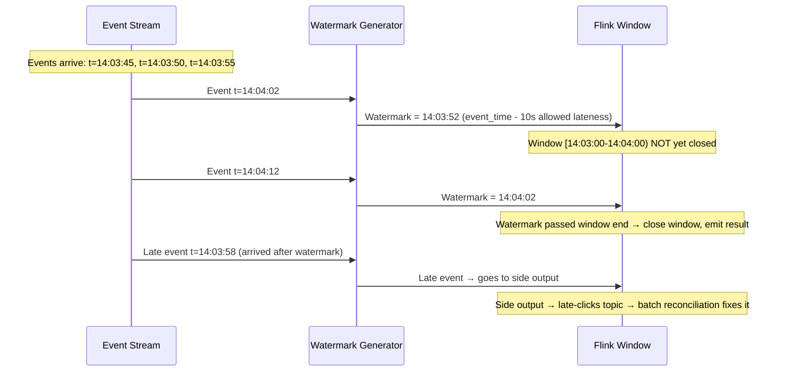
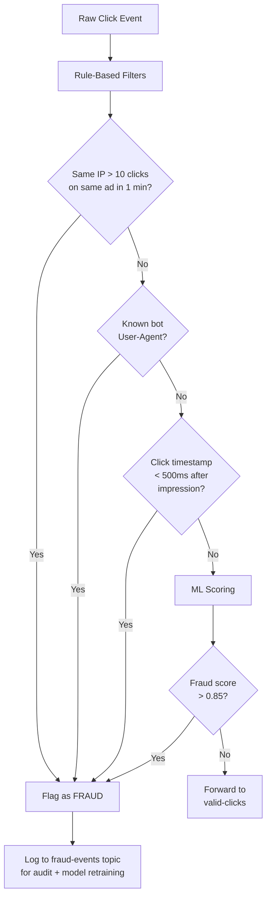
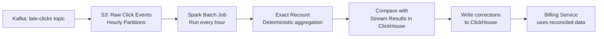
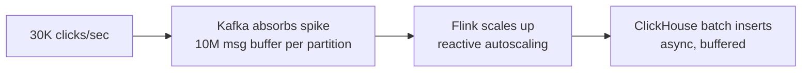

# Case Study: Ad Click Aggregation (System Design)

## Quick Summary (TL;DR)
- **Goal**: Design a real-time ad click aggregation system that counts clicks per ad per minute, detects click fraud, supports billing reconciliation, and serves analytics dashboards — at the scale of a major ad network (Google Ads / Meta Ads).
- **Scale**: 10B ad impressions/day, 500M clicks/day (~6K clicks/sec avg, 30K/sec peak), aggregation latency < 1 minute, analytics query latency < 200ms.
- **Key Decisions**:
  - Use **Kafka** as the durable event bus between click ingestion and aggregation — decouples the real-time serving path from the batch reconciliation path.
  - Use a **stream processing engine (Flink)** for real-time windowed aggregation — tumbling and sliding windows compute click counts per ad per minute with exactly-once semantics.
  - Use **MapReduce/Spark batch pipeline** as a parallel reconciliation path — the "source of truth" that runs hourly to correct any stream processing drift.
  - Use **Lambda Architecture** (real-time stream + batch reconciliation) to balance speed vs. accuracy — advertisers see real-time dashboards but are billed from the reconciled batch data.
  - Store aggregated results in **OLAP storage (ClickHouse)** for sub-second analytical queries across billions of rows.

---

## Noob Jargon Buster

* **Impression**: An ad was shown to a user on a web page or app. The ad server logs this event even if the user ignores it. Impressions are the denominator in click-through rate.
* **Click**: A user tapped or clicked on an ad. This is the billable event in CPC (Cost Per Click) models. Each click triggers a redirect through the ad network's click tracker before landing on the advertiser's page.
* **CTR (Click-Through Rate)**: $\frac{\text{clicks}}{\text{impressions}} \times 100\%$. A typical display ad CTR is 0.5-2%. A CTR of 10%+ on a banner ad is suspicious and likely fraud.
* **CPC (Cost Per Click)**: The pricing model where the advertiser pays each time a user clicks their ad. Google Search Ads use CPC. The ad network must count clicks accurately — overcounting costs advertisers money; undercounting costs the ad network revenue.
* **Tumbling Window**: A fixed-size, non-overlapping time window. Example: aggregate clicks in `[00:00-00:01), [00:01-00:02), ...`. Each click falls into exactly one window.
* **Sliding Window**: An overlapping time window that "slides" forward. Example: a 5-minute window that slides every 1 minute gives overlapping windows. Used for trend detection (e.g., CTR over the last 5 minutes, updated every minute).
* **Watermark**: In stream processing, a marker that declares "all events with timestamp ≤ W have arrived." Events arriving after the watermark are considered late. Watermarks handle out-of-order event arrival caused by network delays.
* **Exactly-Once Semantics**: A guarantee that each click event is counted exactly once in the aggregation — not zero times (data loss) and not twice (double counting). Critical for billing accuracy.
* **Click Fraud**: Fake clicks generated by bots, competitors, or click farms to drain an advertiser's budget without genuine user interest. Detection involves analyzing click patterns, IP addresses, device fingerprints, and behavioral signals.
* **Lambda Architecture**: Running two parallel pipelines — a real-time stream for low-latency results and a batch pipeline for accurate reconciliation. The batch pipeline periodically corrects any errors in the stream results.

---

## 1. Requirements & Scope

### Functional
1. **Click Ingestion**: Capture every ad click event with metadata (ad_id, user_id, timestamp, IP, device, geo, referrer_url, campaign_id, advertiser_id).
2. **Real-Time Aggregation**: Compute click counts per ad_id per minute, available within 1 minute of the click.
3. **Multi-Dimensional Aggregation**: Slice-and-dice by campaign, advertiser, geo, device type, time range.
4. **Click Fraud Detection**: Flag and filter suspicious clicks in real-time (bot traffic, click flooding, duplicate clicks).
5. **Billing Reconciliation**: Produce accurate, auditable click counts for advertiser billing (hourly batch reconciliation).
6. **Analytics Dashboard**: Advertisers query their campaign performance — clicks, impressions, CTR, spend — with interactive filters and time-range selectors.
7. **Late Data Handling**: Clicks arriving out-of-order (mobile network delays, retries) must be attributed to the correct time window.

### Non-Functional
- **Low Aggregation Latency**: Click → aggregated count visible in dashboard within **1 minute**.
- **High Throughput**: Sustain 30K clicks/sec at peak without backpressure.
- **Exactly-Once Counting**: No double-counting, no dropped clicks. Billing accuracy must be ≥ 99.999%.
- **High Availability**: Click ingestion must never drop events — even during deployments, aggregator failures, or Kafka broker outages.
- **Query Performance**: Analytics queries return in < 200ms for time ranges up to 30 days.
- **Data Retention**: Raw click events retained for 90 days (audit trail). Aggregated data retained for 3 years.
- **Idempotency**: Retried clicks (client-side retransmits) must be deduplicated.

---

## 2. Scale Estimation (The Math)

### Throughput
- **Daily impressions**: 10B/day.
- **Daily clicks**: 500M/day (5% average CTR across all ad formats).
  - Average QPS: $\frac{500,000,000}{86,400} \approx 6,000 \text{ clicks/sec}$.
  - Peak QPS: $\approx 30,000 \text{ clicks/sec}$ (Black Friday, Super Bowl ads, product launches).
- **Aggregation writes**: 1M unique ad_ids × 1 record/minute = ~17K aggregation writes/sec.

### Storage
- **Raw click event**: ~500 bytes (ad_id, user_id, timestamp, IP, device fingerprint, geo, referrer, campaign_id, click_id UUID).
- **Daily raw storage**: $500\text{M} \times 500\text{ bytes} = 250\text{ GB/day}$.
- **90-day retention**: $250\text{ GB} \times 90 = 22.5\text{ TB}$ of raw events.
- **Aggregated data**: Each minute-level aggregate row = 100 bytes (ad_id, minute_ts, click_count, unique_users, fraud_filtered_count).
  - $1\text{M ads} \times 1440\text{ min/day} \times 100\text{ bytes} = 144\text{ GB/day}$.
  - Pre-aggregated by hour/day reduces query-time scanning: $1\text{M} \times 24\text{ hours} \times 100\text{ bytes} = 2.4\text{ GB/day}$ for hourly rollups.
- **3-year aggregated retention**: ~150 TB (minute-level) + ~2.6 TB (hourly rollups).

### Memory
- **Flink aggregation state**: Active tumbling windows for 1M ad_ids × ~200 bytes state per ad = **200 MB** — fits in a single Flink TaskManager's heap.
- **Deduplication cache (click_id)**: 30-minute sliding window of click_ids for dedup. $30 \times 60 \times 6000 \text{ clicks/sec} \times 16\text{ bytes UUID} = 172\text{ MB}$ — fits in memory or a small Redis instance.
- **Analytics cache**: Top 10K most queried campaign dashboards cached in Redis. ~100 KB per dashboard × 10K = **1 GB**.

---

## 3. System API Design

### A. Click Tracking (Redirect Endpoint)
- **Endpoint**: `GET /v1/click/{click_token}`
  - The click_token is a signed, opaque token embedded in the ad's href. It encodes ad_id, campaign_id, and a tamper-proof signature.
- **Flow**:
  1. User clicks ad → browser follows `GET /v1/click/eyJhZCI6...`
  2. Click service validates signature, logs the event, returns `302 Redirect` to advertiser's landing page.
- **Response**: `302 Found` with `Location: https://advertiser.com/landing-page?utm_source=adnet`
- **Why GET + 302?** Clicking a link is always a GET. The redirect must be fast (< 50ms) to avoid perceptible delay before the landing page loads. The click is logged asynchronously after sending the redirect.

### B. Query Aggregated Data
- **Endpoint**: `GET /v1/analytics/clicks`
- **Request**:
  ```
  GET /v1/analytics/clicks?advertiser_id=adv_123&campaign_id=camp_456
      &granularity=hour&from=2026-05-30T00:00:00Z&to=2026-05-31T00:00:00Z
      &group_by=geo,device_type
  ```
- **Response**:
  ```json
  {
    "advertiser_id": "adv_123",
    "campaign_id": "camp_456",
    "granularity": "hour",
    "data": [
      {
        "timestamp": "2026-05-30T14:00:00Z",
        "dimensions": { "geo": "US", "device_type": "mobile" },
        "clicks": 12450,
        "impressions": 580000,
        "ctr": 2.15,
        "spend_usd": 3112.50,
        "fraud_filtered": 87
      }
    ]
  }
  ```

### C. Billing Report
- **Endpoint**: `GET /v1/billing/report?advertiser_id=adv_123&month=2026-05`
- **Response**:
  ```json
  {
    "advertiser_id": "adv_123",
    "period": "2026-05",
    "total_clicks": 8420000,
    "fraud_filtered_clicks": 34200,
    "billable_clicks": 8385800,
    "total_spend_usd": 2096450.00,
    "reconciliation_status": "FINALIZED",
    "audit_trail_url": "/v1/billing/audit/adv_123/2026-05"
  }
  ```

---

## 4. High-Level Architecture



---

## 5. Deep Dive: Core Components

### 5.1 Click Ingestion & Deduplication

**Problem**: Clicks arrive from browsers and mobile apps over unreliable networks. Clients may retry (user double-taps, browser retransmits on timeout), producing duplicate click events. Each duplicate that isn't caught costs the advertiser money.



**Deduplication strategy — two layers**:

1. **Client-side click_id**: The ad tag JavaScript generates a UUID per click event and includes it in the click URL. If the browser retries the same click, the same UUID is sent. The click service stores recent click_ids in a **Bloom filter** (probabilistic, space-efficient, no false negatives for dedup) backed by a Redis set for exact confirmation on Bloom filter positives.

2. **Server-side fingerprint dedup**: For clicks without a client-generated ID (older integrations), compute a fingerprint: `SHA256(ad_id + user_id + IP + timestamp_rounded_to_30s)`. Same fingerprint within 30 seconds = duplicate.

**Bloom filter sizing**:
- 30-minute window × 6K clicks/sec = 10.8M entries.
- At 0.1% false positive rate: $\frac{-n \ln p}{(\ln 2)^2} = \frac{-10.8\text{M} \times \ln(0.001)}{0.48} \approx 155\text{ MB}$.
- A false positive on the Bloom filter means a legitimate click is flagged for exact check in Redis — not dropped.

---

### 5.2 Kafka Topic Design & Partitioning

Kafka is the backbone connecting ingestion, processing, and storage. Partition key choice directly impacts aggregation efficiency.

```
Topic: raw-clicks
  Partitions: 30
  Partition Key: ad_id
  Retention: 7 days
  Replication: 3

Topic: valid-clicks (post fraud filter)
  Partitions: 30
  Partition Key: ad_id
  Retention: 7 days

Topic: aggregated-clicks (minute-level counts)
  Partitions: 10
  Partition Key: ad_id
  Retention: 30 days
```

**Why partition by ad_id?**
- All clicks for the same ad land on the same partition → the Flink aggregation operator for that ad runs on a single TaskManager → no cross-partition shuffle needed for per-ad windowed counts.
- This creates a potential hot partition problem if one ad gets viral traffic. Mitigation: use **salted keys** (`ad_id + salt(0-3)`) for the top 1000 highest-traffic ads, spreading them across 4 partitions. The downstream aggregator sums across salt values.

**Exactly-once delivery**:
- Kafka producers use **idempotent mode** (`enable.idempotence=true`) — retried sends are deduplicated by the broker using sequence numbers.
- Flink uses **Kafka transactional producer** with two-phase commit — aggregation state and Kafka offset are committed atomically during Flink checkpoints.

---

### 5.3 Real-Time Aggregation — Flink Windowed Processing



**Tumbling window (1-minute)**:
Each ad_id gets a 1-minute non-overlapping window. When the window closes, Flink emits:

```json
{
  "ad_id": "ad_42",
  "window_start": "2026-05-31T14:03:00Z",
  "window_end": "2026-05-31T14:04:00Z",
  "click_count": 347,
  "unique_users": 312,
  "fraud_filtered": 8,
  "geo_breakdown": { "US": 180, "IN": 95, "DE": 72 },
  "device_breakdown": { "mobile": 220, "desktop": 127 }
}
```

**Unique user counting with HyperLogLog (HLL)**:
Counting exact unique users per ad per minute would require storing all user_ids in memory — expensive at scale. HyperLogLog provides approximate unique counts with < 2% error using only **12 KB per counter** regardless of cardinality. For 1M active ads: $1\text{M} \times 12\text{ KB} = 12\text{ GB}$ of HLL state — manageable.

**Late data handling with watermarks**:


- **Allowed lateness**: 10 seconds. Events arriving within 10 seconds after their window closes are still counted.
- **Beyond allowed lateness**: Events go to a Flink **side output** and are written to a `late-clicks` Kafka topic. The batch reconciliation pipeline picks these up.

**Checkpointing for exactly-once**:
- Flink takes a checkpoint every 30 seconds.
- Checkpoint = snapshot of all window aggregation state + Kafka consumer offsets + pending Kafka transactional writes.
- On failure recovery, Flink restores from the last checkpoint and replays events from Kafka — events are reprocessed but the transactional Kafka producer ensures output records are not duplicated.

---

### 5.4 Fraud Detection Pipeline

Click fraud costs advertisers ~$35B annually. The fraud detection service sits between raw clicks and valid clicks.



**Rule-based filters** (fast, deterministic, catches obvious fraud):

| Rule | Threshold | Rationale |
|------|-----------|-----------|
| IP click flooding | > 10 clicks/ad/minute from same IP | No human clicks 10 times on the same ad in a minute |
| Bot User-Agent | Known bot signatures (headless Chrome, curl, etc.) | Automated scrapers and click bots |
| Suspiciously fast clicks | Click < 500ms after impression served | Human reaction time is 200-300ms minimum; sub-500ms with page load is impossible |
| Duplicate fingerprint | Same (IP + device + ad_id) within 30 seconds | Double-click or automated retry |
| Datacenter IP range | Click from known AWS/GCP/Azure IP ranges | Real users don't browse from cloud VMs |

**ML-based scoring** (catches sophisticated fraud the rules miss):
- **Features**: Click-to-impression time distribution, geographic anomaly (IP says US, timezone says China), click pattern entropy (bots produce regular intervals), device fingerprint uniqueness score, historical fraud rate for this publisher.
- **Model**: Gradient-boosted trees (XGBoost), updated daily from labeled fraud/not-fraud data.
- **Threshold**: Score > 0.85 → auto-filtered. Score 0.5–0.85 → flagged for human review. Score < 0.5 → pass.

**Why not block all suspected fraud in real-time?**
False positives cost the ad network revenue. A conservative real-time filter (high-confidence fraud only) is paired with a more aggressive offline review that can reverse decisions. Advertisers can dispute filtered clicks through a self-service audit trail.

---

### 5.5 Batch Reconciliation Pipeline (Source of Truth)

The streaming pipeline optimizes for speed. The batch pipeline optimizes for accuracy. Billing always uses batch-reconciled numbers.



**How it works**:
1. Raw click events are continuously written to S3 in hourly partitions: `s3://clicks/raw/2026/05/31/14/`.
2. Late-arriving clicks from the Flink side output also land in S3.
3. Every hour, a Spark job reads the previous hour's partition, applies the same fraud filters deterministically, and produces exact aggregated counts.
4. A reconciliation service compares streaming results (already in ClickHouse) with batch results. Differences are written as correction rows.
5. The billing service queries ClickHouse for the reconciled view: `stream_count + correction_delta = billing_count`.

**Why not just use batch?**
Batch runs hourly — advertisers need to see real-time campaign performance to adjust bids, pause underperforming ads, and manage budgets. The streaming pipeline gives them a "close enough" view within 1 minute. Billing uses the reconciled batch data (finalized after 24 hours).

**Correction magnitude**: Typically < 0.01% difference between stream and batch — mostly late-arriving events and rare exactly-once edge cases during Flink restarts.

---

### 5.6 Multi-Dimensional Aggregation & OLAP Queries

Advertisers don't just want "total clicks." They want to drill down: "How many clicks did campaign X get from mobile users in Germany between 2pm and 5pm yesterday?"

**Pre-aggregation strategy** (compute once, query fast):

```
Minute-level base table (written by Flink):
  (ad_id, campaign_id, advertiser_id, minute_ts, geo, device_type) → (clicks, unique_users, impressions, spend)

Hourly rollup (materialized view):
  (ad_id, campaign_id, advertiser_id, hour_ts, geo, device_type) → SUM(clicks), HLL_MERGE(unique_users), ...

Daily rollup:
  (ad_id, campaign_id, advertiser_id, date, geo, device_type) → SUM(clicks), ...
```

Queries use the coarsest rollup that covers the requested time range:
- "Last 30 minutes" → hit minute-level table.
- "Yesterday" → hit hourly rollup.
- "Last 30 days" → hit daily rollup.

This reduces scan volume by 1440x for daily queries vs. minute-level.

---

## 6. Database Design

### A. ClickHouse (OLAP — Aggregated Click Data)
ClickHouse is a columnar OLAP database optimized for analytical queries over time-series data. It handles billions of rows with sub-second query latency.

```sql
-- Minute-level aggregation table (written by Flink)
CREATE TABLE click_aggregates (
    ad_id         UInt64,
    campaign_id   UInt64,
    advertiser_id UInt64,
    minute_ts     DateTime,
    geo           LowCardinality(String),
    device_type   LowCardinality(String),
    click_count   UInt32,
    unique_users  AggregateFunction(uniq, UInt64),  -- HyperLogLog
    fraud_filtered UInt32,
    impressions   UInt32,
    spend_cents   UInt64,
    is_reconciled Bool DEFAULT false
) ENGINE = AggregatingMergeTree()
PARTITION BY toYYYYMMDD(minute_ts)
ORDER BY (advertiser_id, campaign_id, ad_id, minute_ts, geo, device_type);

-- Hourly rollup (materialized view, auto-populated)
CREATE MATERIALIZED VIEW click_hourly_mv
ENGINE = AggregatingMergeTree()
PARTITION BY toYYYYMMDD(hour_ts)
ORDER BY (advertiser_id, campaign_id, ad_id, hour_ts, geo, device_type)
AS SELECT
    ad_id, campaign_id, advertiser_id,
    toStartOfHour(minute_ts) AS hour_ts,
    geo, device_type,
    sum(click_count)    AS click_count,
    uniqMerge(unique_users) AS unique_users,
    sum(fraud_filtered) AS fraud_filtered,
    sum(impressions)    AS impressions,
    sum(spend_cents)    AS spend_cents
FROM click_aggregates
GROUP BY ad_id, campaign_id, advertiser_id, hour_ts, geo, device_type;
```

**Why AggregatingMergeTree?** ClickHouse's AggregatingMergeTree engine automatically merges rows with the same sort key during background compaction. Multiple minute-level inserts for the same `(ad_id, minute_ts, geo, device_type)` are merged into one row with summed counts and merged HLL sketches — deduplicating at the storage layer.

### B. S3 / HDFS (Raw Click Event Archive)
Raw events are stored in **Parquet** format, partitioned by hour:

```
s3://ad-clicks/raw/
  year=2026/month=05/day=31/hour=14/
    part-00000.parquet  (100 MB, ~200K click events)
    part-00001.parquet
    ...
```

**Why Parquet?** Columnar format enables the Spark batch job to read only the columns needed for aggregation (ad_id, timestamp, fraud_flag) without scanning the full 500-byte event. Predicate pushdown skips entire row groups where ad_id doesn't match.

### C. Redis (Real-Time Caches)

```
-- Deduplication cache
Key: dedup:click:{click_id}
Type: String (empty value)
TTL: 30 minutes

-- Dashboard cache (per advertiser)
Key: dashboard:adv:{advertiser_id}:campaign:{campaign_id}
Type: Hash
Fields: { clicks_today, spend_today, ctr, last_updated }
TTL: 60 seconds (refreshed by aggregation consumer)

-- Fraud rate limiter (per IP per ad)
Key: fraud:ip:{ip}:ad:{ad_id}
Type: Counter (INCR)
TTL: 60 seconds
```

### D. Correction Table (Reconciliation Diffs)

```sql
CREATE TABLE click_corrections (
    ad_id         UInt64,
    campaign_id   UInt64,
    advertiser_id UInt64,
    minute_ts     DateTime,
    geo           LowCardinality(String),
    device_type   LowCardinality(String),
    click_delta   Int32,   -- positive = undercounted, negative = overcounted
    reason        LowCardinality(String),  -- 'late_arrival', 'fraud_reclassified', 'checkpoint_replay'
    batch_run_id  String,
    corrected_at  DateTime DEFAULT now()
) ENGINE = MergeTree()
PARTITION BY toYYYYMMDD(minute_ts)
ORDER BY (advertiser_id, campaign_id, ad_id, minute_ts);
```

Billing queries join `click_aggregates` + `click_corrections`:
```sql
SELECT
    ad_id,
    toStartOfDay(minute_ts) AS date,
    sum(click_count) + COALESCE(sum(c.click_delta), 0) AS billable_clicks
FROM click_aggregates a
LEFT JOIN click_corrections c USING (ad_id, minute_ts, geo, device_type)
WHERE advertiser_id = 123 AND minute_ts BETWEEN '2026-05-01' AND '2026-05-31'
GROUP BY ad_id, date;
```

---

## 7. Why Choose This? (Defending Your Architecture)

### Why use Lambda Architecture (stream + batch) instead of stream-only (Kappa)?
> **Answer**: "Billing accuracy must be ≥ 99.999%. Stream processing with Flink provides exactly-once semantics in theory, but in practice — Flink restarts, Kafka broker failovers, clock skew, and late-arriving events — there's always a small error margin. The batch pipeline reads from the immutable S3 archive (the source of truth), applies deterministic processing, and produces bit-identical results on every re-run. For real-time dashboards, stream-only (Kappa) would suffice. But for billing, where a 0.01% error on $10M in ad spend means $1000 of disputed charges, the batch reconciliation path is a business requirement, not a technical luxury."

### Why ClickHouse over Druid or Elasticsearch for analytics?
> **Answer**: "ClickHouse's columnar storage with vectorized execution engine scans billions of rows at 1-2 GB/sec per core. For our query pattern — `GROUP BY ad_id, geo WHERE advertiser_id = X AND time BETWEEN A AND B` — ClickHouse exploits column pruning (only reads 3 columns out of 12) and partition pruning (only reads the relevant date partitions). Druid is comparable but adds operational complexity with its separate historical/realtime/broker node types. Elasticsearch uses inverted indexes optimized for text search, not columnar scans — aggregating 100M numeric rows in ES is 5-10x slower than ClickHouse."

### Why partition Kafka by ad_id instead of random?
> **Answer**: "Flink's windowed aggregation is keyed by ad_id. If clicks for the same ad land on different Kafka partitions, Flink must shuffle them across the network to the same operator instance (keyBy shuffle). By pre-partitioning Kafka by ad_id, the Flink source already delivers co-located data — eliminating the shuffle and reducing network I/O by ~90%. The tradeoff is potential hot partitions for viral ads, which we mitigate with salted keys for the top-1000 highest-traffic ads."

### Why use HyperLogLog for unique users instead of exact COUNT(DISTINCT)?
> **Answer**: "Exact distinct counting requires storing all seen user_ids per window — for a popular ad with 1M clicks/minute from 800K unique users, that's 800K × 16 bytes = 12.8 MB per ad per window. With 1M active ads, that's 12.8 TB of state — impossible for in-memory stream processing. HyperLogLog uses 12 KB per counter regardless of cardinality, giving us < 2% error. For dashboards, knowing '803K ± 2%' unique users is perfectly acceptable. Billing uses click counts (exact), not unique user counts."

### Why 302 redirect for click tracking instead of a tracking pixel or JavaScript beacon?
> **Answer**: "The click URL is the only mechanism guaranteed to fire when the user clicks. A tracking pixel or JS beacon requires the ad creative's JavaScript to execute — if the browser blocks third-party scripts (Safari ITP, ad blockers), the click is lost but the user still reaches the landing page. With the redirect approach, the user's browser MUST hit our click endpoint to reach the advertiser's URL — the click is logged as a side effect of the navigation, not as a separate tracking call. The 302 adds ~20ms of latency (one extra round trip) but guarantees 100% click capture."

---

## 8. Scaling, Reliability, & Resiliency

### 8.1 Kafka Durability & Partition Scaling
- **Replication factor 3**: Every click event is written to 3 Kafka brokers before acknowledgment (`acks=all`). Survives 2 broker failures.
- **Partition scaling**: If peak traffic grows, add partitions to the `raw-clicks` topic. Flink consumers are automatically rebalanced. Note: adding partitions changes the hash mapping — use a sticky partitioner or consumer-side repartition to avoid temporary aggregation gaps.

### 8.2 Flink Failure Recovery
```
Failure scenario: Flink TaskManager crashes mid-window

1. Flink JobManager detects failure (heartbeat timeout: 30s)
2. Restarts TaskManager on a standby slot
3. Restores window state from last checkpoint (stored in S3)
4. Replays Kafka events from the checkpointed offset
5. Resumes processing — no events lost, no duplicates emitted
   (transactional Kafka producer ensures exactly-once output)

Recovery time: 30-60 seconds
Impact: Aggregation delay increases from 1 min to ~2 min during recovery
```

### 8.3 Click Ingestion Availability
The click tracking service is the most latency-sensitive and availability-critical component — if it's down, clicks are lost AND users can't reach advertiser landing pages.

- **Stateless + horizontally scaled**: Click service is a stateless HTTP server behind an L7 load balancer. 100+ instances across 3 availability zones.
- **Async Kafka write**: The click service writes to Kafka asynchronously AFTER returning the 302 redirect. If Kafka is temporarily unreachable, events are buffered in a local on-disk queue (WAL) and flushed when Kafka recovers.
- **CDN-edge click tracking**: For global ad networks, deploy click tracking at CDN edge locations (Cloudflare Workers, AWS Lambda@Edge) to minimize redirect latency.

### 8.4 Backpressure Handling
During traffic spikes (Super Bowl ads), click volume can jump 5x:



- **Kafka** acts as a shock absorber — it can buffer millions of messages per partition while consumers catch up.
- **Flink reactive scaling**: Increase parallelism (add TaskManagers) when consumer lag exceeds a threshold.
- **ClickHouse async inserts**: Flink writes to ClickHouse via batched inserts (every 5 seconds or 10K rows, whichever comes first). ClickHouse handles bursty inserts efficiently with its LSM-style MergeTree engine.

---

## 9. End-to-End Click Flow

```
Timeline:

0ms     User sees ad impression on publisher's website.
        (Impression logged separately by ad server — not in this system's scope.)

500ms   User clicks the ad.
        Browser navigates to: GET /v1/click/eyJhZCI6NDIsImNhbXAiOjQ1Nn0.sig

520ms   Click Service:
        1. Validates HMAC signature on click_token → extracts ad_id=42, campaign_id=456
        2. Generates click_id = UUID v7 (time-ordered)
        3. Returns 302 Redirect → https://advertiser.com/landing

520ms   User's browser follows redirect to advertiser's landing page. Zero perceived delay.

525ms   Async: Click Service publishes event to Kafka 'raw-clicks' topic.
        Partition key = ad_id (42 mod 30 = partition 12).

530ms   Dedup filter (Flink operator): checks click_id against Bloom filter → new → pass through.

535ms   Fraud detection (Flink operator):
        - Rule check: IP 192.168.1.5 has 2 clicks on ad_42 this minute → OK (threshold is 10)
        - Bot check: User-Agent "Mozilla/5.0 Chrome/126" → OK
        - ML score: 0.12 → OK
        → Forward to 'valid-clicks' topic.

540ms   Raw event also written to S3 (via Kafka Connect S3 Sink).

1min    Flink tumbling window [14:03:00 - 14:04:00) closes.
        Emits aggregated record: { ad_id: 42, clicks: 347, unique_users: 312, ... }
        Written to 'aggregated-clicks' topic.

1.5min  ClickHouse consumer ingests aggregated record.
        Dashboard for advertiser_id=123 now shows updated click count.

1 hour  Spark batch job reads S3 partition s3://clicks/raw/2026/05/31/14/.
        Recomputes exact aggregates. Compares with ClickHouse stream data.
        Difference: +2 clicks (late arrivals), -1 click (fraud reclassified).
        Writes correction row: click_delta = +1 for this (ad_id, minute_ts).

24 hrs  Billing service marks the day's data as RECONCILED.
        Advertiser is billed for 8,385,800 billable clicks at $0.25 CPC = $2,096,450.
```

---

## 10. Common Traps & Pitfalls

| Trap | Why it fails | Correct approach |
|------|-------------|-----------------|
| **Counting clicks in the application database (PostgreSQL)** | `UPDATE ads SET click_count = click_count + 1` creates a hot row with lock contention at 6K writes/sec. Single-row updates don't scale | Write to Kafka; aggregate in Flink; store in ClickHouse (append-only, no row-level locks) |
| **Using exact COUNT(DISTINCT user_id) in real-time** | Storing all user_ids per ad per window requires TB of memory for stream state | Use HyperLogLog (12 KB per counter, < 2% error) for real-time; exact counts in batch reconciliation only |
| **Trusting stream processing for billing** | Exactly-once has edge cases during restarts, rebalances, and clock skew. Even 0.01% error = $1000 disputes on $10M spend | Dual-write: stream for dashboards, batch reconciliation for billing. Never bill from stream-only data |
| **Fraud detection after aggregation** | Once a fraudulent click is aggregated, subtracting it requires correction rows and re-reconciliation — complex and error-prone | Filter fraud BEFORE aggregation. The aggregator only sees clean, validated clicks |
| **Random Kafka partitioning** | Flink must shuffle all events by ad_id for keyed windowing — network-intensive and adds latency | Partition Kafka by ad_id so Flink operators receive pre-partitioned data |
| **Synchronous click tracking (log before redirect)** | If Kafka or the logging service is slow, the user waits 500ms+ before reaching the landing page — terrible UX and lost conversions | Return 302 immediately, log asynchronously. Use local WAL buffer if Kafka is unreachable |
| **Storing minute-level data without rollups** | Querying 30 days of minute-level data = 1440 × 30 = 43K rows per ad per query. Across 1M ads, dashboards timeout | Pre-aggregate hourly and daily rollups via ClickHouse materialized views |

---

## 11. Bonus: Interview High-Value Extras

- **Exactly-Once via Idempotent Writes**: An alternative to Flink's transactional Kafka producer is making the downstream consumer idempotent. If ClickHouse receives the same `(ad_id, minute_ts, geo, device_type)` aggregation twice, the AggregatingMergeTree deduplicates it during compaction. This makes the system "effectively exactly-once" without the complexity of distributed transactions.
- **Attribution Windows**: In practice, the same user may click an ad, not convert immediately, and return 3 days later to purchase. Attribution models (last-click, first-click, linear, time-decay) determine which ad click gets credit for the conversion. The click aggregation system stores raw events for 90 days to support retroactive attribution analysis.
- **Budget Pacing**: Advertisers set daily budgets (e.g., $1000/day). The aggregation system feeds real-time spend data to the ad serving pipeline, which throttles ad delivery when the budget is nearly exhausted. Without real-time aggregation, an advertiser could overspend 2-3x their budget before the system reacts.
- **Click-Through Conversion Funnel**: Beyond clicks, track downstream events (landing page view, add-to-cart, purchase) by embedding a conversion pixel on the advertiser's site. The aggregation system joins click events with conversion events (by click_id) to compute ROAS (Return on Ad Spend) — the metric advertisers actually care about.
- **Data Skew Mitigation for Viral Ads**: When a single ad goes viral (Super Bowl), one Kafka partition and one Flink operator become bottlenecks. Dynamic salt injection detects when an ad_id exceeds a traffic threshold and automatically spreads it across multiple partitions. The downstream aggregator uses a two-phase combine: sum partial aggregates from salted partitions, then merge into the final count.
- **Regulatory Compliance (GDPR/CCPA)**: Click events contain PII (user_id, IP address). The system must support "right to deletion" requests — scan S3 archives and ClickHouse tables for a given user_id and redact or delete matching records within 30 days. Parquet files in S3 are immutable, so deletion means rewriting affected files without the deleted user's events.
