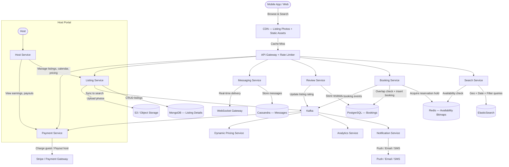

# Case Study: Hotel / Accommodation Booking Platform (Airbnb-Style System Design)

## Quick Summary (TL;DR)
- **Goal**: Design a two-sided marketplace where hosts list properties and guests search, book, and review accommodations — with date-range bookings, geospatial search, and split payments.
- **Scale**: 10M active listings, 2M bookings/day, 100M search queries/day (~1,200 search QPS average, ~10,000 QPS peak during holidays). 500M registered users, 50M MAU.
- **Key Decisions**:
  - Use **ElasticSearch with geospatial indexing** (geohash/H3) for location-based listing search combined with date-range availability filtering.
  - Prevent double-booking with **optimistic locking + Redis reservation hold** — a short-lived hold (10 minutes) while the guest completes payment, backed by a version column in PostgreSQL for the final commit.
  - Use a **split payment model** with an escrow pattern — guest pays at booking, platform holds funds, host receives payout 24 hours after check-in.
  - Store availability as a **date-range calendar** in PostgreSQL with gap-free indexing, cached in Redis bitmaps for fast overlap queries.

---

## 🤓 Noob Jargon Buster

* **Geohash**: A system that encodes a latitude/longitude pair into a short alphanumeric string (e.g., `9q8yyk`). Locations that share a prefix are geographically close, enabling efficient spatial queries with simple string prefix matching.
* **H3 (Uber's Hexagonal Grid)**: A hierarchical spatial indexing system that divides the Earth's surface into hexagonal cells at multiple resolutions. Hexagons have uniform adjacency (6 neighbors each), which avoids the edge/corner distortion of square grids.
* **Escrow**: A payment pattern where a trusted third party (the platform) holds funds after the buyer pays and releases them to the seller only after a condition is met (e.g., guest checks in). Protects both parties.
* **Double-Booking**: Two guests successfully booking the same listing for overlapping dates. This is the #1 thing to prevent.
* **Optimistic Locking**: Instead of locking a row upfront, we read a version number, do our work, and update only if the version hasn't changed. If it has, someone else modified the row — retry or fail.
* **Availability Calendar**: A per-listing data structure that stores which dates are available, blocked, or booked. The core challenge is querying "is this listing available for dates X through Y?" across millions of listings efficiently.
* **Superhost**: A host designation based on response rate, review scores, and booking volume. Superhosts rank higher in search results.
* **Instant Book**: A listing setting where guests can book immediately without waiting for host approval. Changes the booking flow from async (request → approve → pay) to sync (pay → confirmed).

---

## 1. Requirements & Scope

### Functional
1. **Listing Management**: Hosts create/update property listings with photos, description, amenities, house rules, pricing, and availability calendar.
2. **Search**: Guests search listings by location (city/map area), check-in/check-out dates, number of guests, price range, property type, amenities, and rating.
3. **Booking**: Guests book a listing for a date range. Prevent double-booking. Support both Instant Book and host-approval flows.
4. **Payments**: Guest pays at booking. Platform collects a service fee (guest fee ~14%, host fee ~3%). Host receives payout 24 hours after check-in.
5. **Reviews**: After checkout, both guest and host can leave reviews. Reviews are revealed simultaneously (double-blind) to prevent retaliation bias.
6. **Messaging**: Host and guest communicate before/during a stay.
7. **Notifications**: Booking confirmations, payment receipts, review reminders, price alerts.

### Non-Functional
- **No Double-Booking**: Two guests must never book the same listing for overlapping dates.
- **Low Latency Search**: Search results must render in `< 300ms` including geo + date-range filtering.
- **High Availability**: The system must survive regional failures. Guests should always be able to browse and book.
- **Handle Peak Seasons**: New Year's Eve, summer holidays, and major events cause 5–10x search traffic spikes.
- **Global Scale**: Listings in 220+ countries; search must handle multiple time zones and currencies.

---

## 2. Scale Estimation (The Math)

### Throughput (QPS)
- **Daily Search Queries**: 100M/day.
  - Average QPS: $\frac{100,000,000}{86,400} \approx 1,200 \text{ searches/sec}$.
  - Peak QPS: $\approx 10,000 \text{ searches/sec}$ (holiday planning season).
- **Daily Bookings**: 2M/day.
  - Average QPS: $\frac{2,000,000}{86,400} \approx 23 \text{ bookings/sec}$.
  - Peak QPS: $\approx 200 \text{ bookings/sec}$.
- **Listing Views**: 50M/day ($\approx 580 \text{ reads/sec}$).

### Storage
- **Listing Record**: ~2 KB (listing_id, host_id, title, description, location, amenities, pricing, rules).
- **Listing Photos**: 10M listings × 20 photos × 500 KB = ~100 TB (object storage / CDN).
- **Booking Record**: ~500 bytes (booking_id, listing_id, guest_id, check_in, check_out, amount, status, timestamps).
- **Daily Booking Storage**: $2\text{M} \times 500 \text{ bytes} = 1 \text{ GB/day}$.
- **Yearly Booking Storage**: $1 \text{ GB} \times 365 = 365 \text{ GB/year}$.
- **Availability Calendar**: 10M listings × 365 days × 8 bytes = ~29 GB.
- **Reviews**: 500M reviews × 500 bytes = ~250 GB.

### Memory (Redis)
- **Availability Bitmaps**: 10M listings × 46 bytes (365 bits) = ~460 MB — fits in a single Redis node.
- **Active Reservation Holds**: At peak, 50K concurrent holds × 200 bytes = ~10 MB.
- **Search Result Cache**: Top 10K popular queries × 5 KB = ~50 MB.

---

## 3. System API Design

### A. Search Listings
- **Endpoint**: `GET /v1/listings/search?lat=40.7128&lng=-74.0060&radius=10km&check_in=2026-07-01&check_out=2026-07-05&guests=2&price_min=50&price_max=300&type=apartment&amenities=wifi,pool&sort=relevance&page=1`
- **Response**:
  ```json
  {
    "total": 1423,
    "listings": [
      {
        "listing_id": "l_abc123",
        "title": "Cozy Loft in SoHo",
        "host": { "name": "Alice", "superhost": true },
        "price_per_night": 185,
        "total_price": 740,
        "rating": 4.92,
        "review_count": 214,
        "thumbnail_url": "https://cdn.example.com/photos/l_abc123/1.jpg",
        "location": { "lat": 40.7234, "lng": -73.9987 }
      }
    ]
  }
  ```

### B. Get Listing Details
- **Endpoint**: `GET /v1/listings/{listing_id}?check_in=2026-07-01&check_out=2026-07-05`
- **Response**: Full listing with photos, amenities, house rules, host profile, reviews, and availability calendar for the requested date range.

### C. Reserve (Hold) Listing
- **Endpoint**: `POST /v1/listings/{listing_id}/reserve`
- **Request**:
  ```json
  {
    "guest_id": "u_67890",
    "check_in": "2026-07-01",
    "check_out": "2026-07-05",
    "guests": 2,
    "idempotency_key": "idem_u67890_labc123_20260701"
  }
  ```
- **Response**: `200 OK` with `reservation_token` and `expires_at` (now + 10 min), or `409 Conflict` if dates are already booked/held.

### D. Confirm Booking
- **Endpoint**: `POST /v1/bookings`
- **Request**:
  ```json
  {
    "reservation_token": "rt_xyz789",
    "payment_method_id": "pm_stripe_abc",
    "idempotency_key": "idem_u67890_labc123_20260701"
  }
  ```
- **Response**: `201 Created` with booking confirmation and receipt.

### E. Cancel Booking
- **Endpoint**: `POST /v1/bookings/{booking_id}/cancel`
- **Response**: `200 OK` with refund amount based on cancellation policy (flexible / moderate / strict).

### F. Submit Review
- **Endpoint**: `POST /v1/bookings/{booking_id}/reviews`
- **Request**:
  ```json
  {
    "rating": 5,
    "cleanliness": 5,
    "accuracy": 4,
    "check_in": 5,
    "communication": 5,
    "location": 4,
    "value": 5,
    "comment": "Beautiful apartment, exactly as described."
  }
  ```
- **Response**: `201 Created`. Review is hidden until both parties submit (double-blind reveal).

---

## 4. Database Schema Design

### Bookings & Users (PostgreSQL — ACID for Money)

```sql
-- Listings (core metadata, full details in MongoDB)
CREATE TABLE listings (
    listing_id       UUID PRIMARY KEY,
    host_id          UUID NOT NULL,
    title            VARCHAR(200) NOT NULL,
    latitude         DOUBLE PRECISION NOT NULL,
    longitude        DOUBLE PRECISION NOT NULL,
    geohash          VARCHAR(12) NOT NULL,
    price_per_night  INTEGER NOT NULL,     -- in cents
    max_guests       INTEGER NOT NULL,
    property_type    VARCHAR(30) NOT NULL,  -- apartment, house, villa, room
    instant_book     BOOLEAN DEFAULT FALSE,
    superhost        BOOLEAN DEFAULT FALSE,
    avg_rating       NUMERIC(3,2) DEFAULT 0.00,
    review_count     INTEGER DEFAULT 0,
    created_at       TIMESTAMPTZ DEFAULT NOW()
);
CREATE INDEX idx_listings_geohash ON listings (geohash);

-- Availability calendar (one row per blocked/booked date range)
CREATE TABLE availability (
    listing_id   UUID NOT NULL,
    start_date   DATE NOT NULL,
    end_date     DATE NOT NULL,           -- exclusive upper bound
    status       VARCHAR(15) NOT NULL,    -- BOOKED, BLOCKED, HELD
    booking_id   UUID,                    -- NULL if host-blocked
    version      INTEGER NOT NULL DEFAULT 0,
    PRIMARY KEY (listing_id, start_date),
    CONSTRAINT no_overlap EXCLUDE USING gist (
        listing_id WITH =,
        daterange(start_date, end_date) WITH &&
    )
);

-- Bookings
CREATE TABLE bookings (
    booking_id       UUID PRIMARY KEY,
    listing_id       UUID NOT NULL,
    guest_id         UUID NOT NULL,
    host_id          UUID NOT NULL,
    check_in         DATE NOT NULL,
    check_out        DATE NOT NULL,
    num_guests       INTEGER NOT NULL,
    nightly_rate     INTEGER NOT NULL,     -- in cents
    total_amount     INTEGER NOT NULL,     -- in cents (nights × rate + fees)
    guest_fee        INTEGER NOT NULL,     -- platform fee from guest
    host_fee         INTEGER NOT NULL,     -- platform fee from host
    status           VARCHAR(20) NOT NULL DEFAULT 'PENDING',
    -- PENDING → CONFIRMED → CHECKED_IN → COMPLETED → REVIEWED
    -- PENDING → CANCELLED (guest or host cancels)
    cancellation_policy VARCHAR(15) NOT NULL,  -- flexible, moderate, strict
    idempotency_key  VARCHAR(100) UNIQUE,
    version          INTEGER NOT NULL DEFAULT 0,
    created_at       TIMESTAMPTZ DEFAULT NOW(),
    updated_at       TIMESTAMPTZ DEFAULT NOW()
);
CREATE INDEX idx_bookings_guest ON bookings (guest_id, created_at DESC);
CREATE INDEX idx_bookings_host ON bookings (host_id, created_at DESC);

-- Payments (ledger)
CREATE TABLE payments (
    payment_id       UUID PRIMARY KEY,
    booking_id       UUID NOT NULL,
    payer_type       VARCHAR(10) NOT NULL,  -- GUEST or PLATFORM
    payee_type       VARCHAR(10) NOT NULL,  -- PLATFORM or HOST
    amount           INTEGER NOT NULL,      -- in cents
    currency         VARCHAR(3) NOT NULL DEFAULT 'USD',
    status           VARCHAR(20) NOT NULL DEFAULT 'PENDING',
    -- PENDING → CAPTURED → SETTLED (for guest → platform)
    -- PENDING → DISBURSED (for platform → host)
    stripe_charge_id VARCHAR(100),
    created_at       TIMESTAMPTZ DEFAULT NOW()
);

-- Reviews (double-blind)
CREATE TABLE reviews (
    review_id    UUID PRIMARY KEY,
    booking_id   UUID NOT NULL,
    author_id    UUID NOT NULL,
    target_id    UUID NOT NULL,        -- host or guest being reviewed
    author_role  VARCHAR(5) NOT NULL,  -- GUEST or HOST
    rating       NUMERIC(2,1) NOT NULL,
    comment      TEXT,
    revealed     BOOLEAN DEFAULT FALSE, -- set TRUE when both reviews exist
    created_at   TIMESTAMPTZ DEFAULT NOW(),
    UNIQUE (booking_id, author_role)
);
```

**Why PostgreSQL for bookings?** Booking involves money and date-range overlap prevention. We need ACID transactions and PostgreSQL's `EXCLUDE` constraint with `daterange` to enforce no-overlap at the database level. No NoSQL database offers range-based exclusion constraints natively.

### Listing Rich Content (MongoDB / DynamoDB)
- **Collection**: `listings_detail` — flexible schema for amenities (200+ possible), house rules, neighborhood info, cancellation terms, and multi-language descriptions.
- Schema-less storage handles the wide variance in listing attributes (a treehouse has different attributes than a downtown apartment).

### Search Index (ElasticSearch)
- **Index**: `listings` — fields: `title`, `description`, `location` (geo_point), `geohash`, `price_per_night`, `property_type`, `amenities[]`, `avg_rating`, `review_count`, `superhost`, `instant_book`, `max_guests`.
- Supports geo-distance queries, multi-field filtering, full-text search, and custom scoring functions.

### Availability Cache (Redis — Bitmap per Listing)
- **Key**: `avail:{listing_id}` — a 365-bit bitmap where bit `i` = 1 means day `i` (offset from today) is available.
- **Check range**: `BITCOUNT avail:{listing_id} check_in_offset check_out_offset` — if the count equals the number of nights, all days are available.
- **Hold Key**: `hold:{listing_id}:{check_in}:{check_out}` → `{ "guest_id": "u_67890", "token": "rt_xyz789" }`, TTL 600 seconds (10 minutes).

---

## 5. High-Level Architecture



### Booking Flow (Step-by-Step)
1. Guest searches for listings in "New York, Jul 1–5" → **Search Service** queries ElasticSearch with geo-filter + date availability check against Redis bitmaps.
2. Guest opens a listing → **Listing Service** fetches details from MongoDB, availability from Redis.
3. Guest clicks "Reserve" → **Booking Service** acquires a Redis hold (`SETNX` with 10-min TTL), inserts a `HELD` row in the `availability` table with optimistic locking.
4. Guest enters payment → **Payment Service** charges via Stripe, returns success/failure.
5. On payment success → **Booking Service** runs a PostgreSQL transaction: insert booking row, update availability status from `HELD` to `BOOKED`, update Redis bitmap. Publishes `booking.confirmed` to Kafka.
6. **Notification Service** sends confirmation to guest + host via push/email.
7. If payment fails or hold expires → release Redis hold, delete `HELD` row from availability, notify guest.

---

## 6. Why Choose This? (Defending Your Architecture)

### 🧭 Why ElasticSearch for search instead of PostgreSQL geo queries?
* **Answer**: "Airbnb search combines geospatial proximity, date-range availability, text matching (amenities, description), and multi-factor ranking (price, rating, superhost, personalization) in a single query. PostgreSQL can do PostGIS geo queries, but combining geo with full-text search, faceted filtering on 200+ amenity combinations, and custom BM25-like scoring is extremely slow at 10K QPS. ElasticSearch's inverted index + geo_point + function_score query handles all of these natively with sub-200ms latency."

### 🧭 Why Redis bitmaps for availability instead of querying PostgreSQL?
* **Answer**: "Checking date-range availability for 10,000 listings per search query means 10,000 range-overlap checks. Against PostgreSQL, that's 10,000 `SELECT EXISTS ... WHERE daterange && ...` queries — impractical at 1,200 searches/sec. Redis bitmaps encode 365 days as 46 bytes per listing. A `BITCOUNT` over the requested range is O(1) per listing. We can check 10,000 listings in ~5ms total. PostgreSQL remains the source of truth; Redis bitmaps are updated via Kafka events with ~1s lag."

### 🧭 Why MongoDB for listing details instead of PostgreSQL?
* **Answer**: "Listing attributes vary wildly — a beachfront villa has 'private pool', 'ocean view', 'BBQ grill'; a city apartment has 'doorman', 'elevator', 'subway access'. There are 200+ possible amenities and each listing uses a different subset. In PostgreSQL, this becomes either an EAV anti-pattern (entity-attribute-value table with thousands of rows per listing) or a JSONB column (which works but loses MongoDB's native query and indexing capabilities). MongoDB's flexible schema stores each listing as a document with exactly the fields it needs."

### 🧭 Why split payment (escrow) instead of direct host payment?
* **Answer**: "Direct payment would mean the host gets money immediately, but the guest hasn't checked in yet. If the listing is misrepresented or the host cancels, recovering funds from the host is difficult. The escrow pattern — guest pays platform, platform holds funds, platform pays host 24 hours after check-in — protects both parties. The platform earns interest on held funds as a bonus. Stripe Connect's 'destination charges' API supports this natively."

---

## 7. SDE-2 Deep Dives & Trade-offs

### A. Search: Geospatial Indexing + Availability Filtering

The core search query is: *"Find listings near (lat, lng) that are available for dates [check_in, check_out] and match filters, ranked by relevance."*

This is a **two-phase query**:

#### Phase 1: Geo + Filter (ElasticSearch)
```json
{
  "query": {
    "bool": {
      "filter": [
        { "geo_distance": { "distance": "10km", "location": { "lat": 40.71, "lon": -74.00 } } },
        { "range": { "price_per_night": { "gte": 50, "lte": 300 } } },
        { "term": { "property_type": "apartment" } },
        { "terms": { "amenities": ["wifi", "pool"] } },
        { "range": { "max_guests": { "gte": 2 } } }
      ]
    }
  },
  "sort": [
    { "_score": "desc" },
    { "avg_rating": "desc" }
  ]
}
```
This returns ~500–2,000 candidate listing IDs in < 50ms.

#### Phase 2: Availability Check (Redis Bitmaps)
For each candidate listing, check the Redis bitmap:
```
BITCOUNT avail:{listing_id} check_in_offset check_out_offset
```
If count == number of nights, the listing is available. Filter out unavailable ones. This takes < 10ms for 2,000 listings using pipelining.

#### Phase 3: Ranking
Score remaining listings by: `0.4 × review_score + 0.2 × price_competitiveness + 0.15 × superhost_bonus + 0.15 × response_rate + 0.1 × personalization_score`.

#### Why not store availability in ElasticSearch?
Availability changes frequently (every booking). Updating an ES document for every booking/cancellation across 10M listings would create an enormous write load and trigger constant segment merges. Redis bitmaps handle writes in O(1) and don't require re-indexing.

### B. Double-Booking Prevention (The Core Challenge)

Unlike BookMyShow (discrete seats), Airbnb has **date-range overlaps** — a listing booked for Jul 1–5 blocks Jul 3–7 but not Jul 6–10.

#### Option 1: PostgreSQL Exclusion Constraint Only
```sql
ALTER TABLE availability ADD CONSTRAINT no_overlap
    EXCLUDE USING gist (listing_id WITH =, daterange(start_date, end_date) WITH &&);
```
- *Pros*: Database-enforced, impossible to bypass. Correct by construction.
- *Cons*: Two concurrent inserts for the same listing will cause one to block on a row-level lock. At high concurrency for popular listings, this creates lock contention. Also, the 10-minute payment window means holding a DB row in `HELD` state — stale holds need cleanup.

#### Option 2: Redis Hold + PostgreSQL Exclusion (Recommended)
```
1. SETNX hold:{listing_id}:{check_in}:{check_out} {guest_id} EX 600   → Instant, O(1)
2. If SET succeeded → INSERT INTO availability (listing_id, start_date, end_date, status)
     VALUES (?, ?, ?, 'HELD') — exclusion constraint prevents overlap
3. Guest completes payment → UPDATE availability SET status='BOOKED', booking_id=?
4. If TTL expires → DELETE FROM availability WHERE listing_id=? AND status='HELD'
     AND start_date=? → Reset Redis bitmap bits
```
- *Pros*: Redis filters out 99% of concurrent attempts instantly. Only one INSERT hits PostgreSQL. The exclusion constraint serves as a safety net — even if Redis fails, PostgreSQL prevents the double-booking.
- *Cons*: Redis key design must account for **partial overlaps**. A hold for Jul 1–5 must block Jul 3–7. Solution: also set range-marker keys or check overlap in the application layer before SETNX.

**Handling partial overlaps in Redis**: Before acquiring the hold, the Booking Service queries the availability bitmap. If any bit in the requested range is 0 (unavailable), reject immediately. The bitmap check is atomic and handles partial overlaps. Only if the bitmap says "all available" do we proceed to SETNX + DB insert.

#### Booking State Machine
```
PENDING ──→ CONFIRMED ──→ CHECKED_IN ──→ COMPLETED ──→ REVIEWED
   │             │
   └──→ CANCELLED (guest or host cancels, refund based on policy)
         │
         └──→ REFUNDED
```

### C. Availability Calendar: Efficient Storage & Querying

Storing per-day rows (10M listings × 365 days = 3.65B rows) is wasteful. Instead:

#### Strategy: Date-Range Intervals + Redis Bitmap Cache

**PostgreSQL**: Store only **blocked/booked ranges**, not every available day. A listing with 5 bookings/year has 5 rows, not 365.

**Redis Bitmap**: Each listing gets a 365-bit bitmap (46 bytes). Bit = 1 means available, bit = 0 means blocked/booked. Updated via Kafka events when bookings are created/cancelled.

**Daily Rollover**: A nightly cron job shifts all bitmaps by 1 bit (today becomes yesterday, a new day appears at bit 364). Past bookings are irrelevant for search.

**Calendar Sync**: Hosts can import/export iCal feeds (Google Calendar, VRBO). A background job polls iCal URLs every 15 minutes and updates the availability table + Redis bitmap.

### D. Payments: Split Payments & Escrow

The payment flow involves three parties: guest, platform, and host.

#### Payment Timeline
```
T=0   Guest books → Stripe charges guest's card → Funds held by platform (escrow)
T=0   Platform deducts guest service fee (14%) immediately
T+1d  After check-in confirmed → Platform initiates host payout
       → Payout = nightly_rate × nights - host_fee (3%)
       → Transferred to host's connected Stripe account
T+48h Host payout settles in bank account
```

#### Cancellation & Refund Matrix

| Policy    | > 7 days before | 1–7 days before | < 24 hours     | After check-in |
|-----------|-----------------|-----------------|----------------|----------------|
| Flexible  | 100% refund     | 100% refund     | 100% refund    | Prorated       |
| Moderate  | 100% refund     | 50% refund      | 0% refund      | 0%             |
| Strict    | 50% refund      | 0% refund       | 0% refund      | 0%             |

#### Implementation
- Use **Stripe Connect** with destination charges. The platform is the charge creator; the host's Stripe Connected Account receives a transfer.
- Every payment mutation is recorded in a **double-entry ledger** (payments table). Each charge has a corresponding platform-fee debit and a host-payout credit.
- All Stripe API calls use idempotency keys (`booking_id + action`) to prevent double-charges on retries.

### E. Dynamic Pricing

Hosts receive pricing suggestions based on:

1. **Demand signals**: Search volume for the listing's area + dates (tracked via Kafka from Search Service).
2. **Supply signals**: Number of available listings in the area for those dates.
3. **Seasonality**: Historical booking patterns (New Year's Eve in NYC = 3x average).
4. **Comparable listings**: Prices of similar listings (same area, type, amenities, rating) that are already booked.
5. **Day-of-week**: Weekends typically 20–30% higher.

**Architecture**: A **Pricing Service** consumes search and booking events from Kafka, runs a lightweight ML model (gradient-boosted trees), and updates a `suggested_price` field per listing per date. Hosts see suggestions in their dashboard and can accept, modify, or ignore them.

### F. Handling Peak Seasons / High-Concurrency Booking

When a popular listing in Paris gets 500 simultaneous booking attempts for New Year's Eve:

1. **Redis bitmap pre-check**: 499 of 500 requests see "unavailable" in < 1ms and get an instant `409`. Only the first request (or first few, if dates don't fully overlap) proceeds.
2. **PostgreSQL exclusion constraint**: Even if two requests pass Redis simultaneously (race condition), the DB constraint rejects the second insert. Zero chance of double-booking.
3. **Search result staleness**: A listing may appear available in search results (ES + Redis bitmap) but become booked by the time the guest clicks "Reserve" (seconds later). This is expected and handled gracefully — return `409 Conflict` with a message: "This listing was just booked. Here are similar options."
4. **Auto-scaling**: Search Service scales horizontally (stateless, behind a load balancer). ElasticSearch cluster adds data nodes. Redis is sharded by listing_id prefix.

---

## 8. Database Choices Summary

| Data | Store | Why |
|------|-------|-----|
| Bookings, Payments, Availability | **PostgreSQL** | ACID transactions, date-range exclusion constraints, financial data integrity |
| Listing Details (rich content) | **MongoDB** | Flexible schema for 200+ amenity combinations, nested documents for house rules |
| User Profiles, Sessions | **PostgreSQL** / **Redis** | Relational user data in PG, session cache in Redis |
| Search Index | **ElasticSearch** | Geo-distance queries, full-text search, faceted filtering, custom scoring |
| Availability Cache | **Redis Bitmaps** | Sub-millisecond date-range availability checks across millions of listings |
| Messages | **Cassandra** | High-write-throughput append-only message log, time-bucketed partitions |
| Photos / Media | **S3 + CDN** | Cost-effective blob storage with global edge caching |
| Analytics / Pricing ML | **ClickHouse** | Columnar OLAP for aggregating search trends and booking patterns |

---

## 9. Common Traps & Mitigations

1. **Partial Date-Range Overlap Missed**: The system checks exact date matches but fails to catch overlapping ranges (e.g., booking Jul 1–5 should block Jul 3–7).
   - *Mitigation*: PostgreSQL's `EXCLUDE USING gist (listing_id WITH =, daterange(start_date, end_date) WITH &&)` constraint makes overlapping inserts **physically impossible**. This is not application logic — it's a database-level invariant. Redis bitmap also checks every bit in the range, catching partial overlaps at the cache layer.

2. **Stale Availability in Search Results**: Guest sees a listing as available, clicks Reserve, and gets `409 Conflict` because someone else booked it 2 seconds ago.
   - *Mitigation*: Accept eventual consistency for search. The Redis bitmap updates within ~1 second via Kafka. A 1-second staleness window is acceptable. The Reserve API is the **real-time gate** — if the listing is no longer available, the guest gets an instant rejection with alternative suggestions.

3. **Ghost Holds (Redis ↔ PostgreSQL Drift)**: Redis hold expires (TTL), but the `availability` row still says `HELD`.
   - *Mitigation*: A cleanup job runs every 2 minutes: `DELETE FROM availability WHERE status = 'HELD' AND created_at < NOW() - INTERVAL '12 minutes'`. The 12-minute threshold gives a 2-minute buffer beyond the 10-minute hold TTL. Redis TTL auto-expires the hold key independently.

4. **Double-Charge on Payment Retry**: Network timeout causes Booking Service to retry the Stripe charge, resulting in two charges for the same booking.
   - *Mitigation*: Every Stripe API call includes an `idempotency_key` derived from `booking_id`. Stripe deduplicates retries server-side. The Booking Service also checks booking status in PostgreSQL before retrying — if status is already `CONFIRMED`, skip the charge.

5. **Host Payout Before Guest Checks In**: Platform pays the host, then guest reports a scam listing.
   - *Mitigation*: Host payout is triggered only 24 hours after check-in (not at booking time). The guest has a window to report issues. If a dispute is filed, the payout is frozen until resolution. Funds remain in escrow (platform's Stripe balance) until the condition is met.

6. **Calendar Sync Conflicts**: Host blocks dates on Airbnb but forgets to update VRBO. Guest books on VRBO for the same dates.
   - *Mitigation*: Support **iCal feed import/export**. A background job polls external iCal URLs every 15 minutes and blocks those dates in the availability table. When a booking is made on our platform, we immediately update the exported iCal feed. This is best-effort — the 15-minute polling gap means brief windows of conflict are possible, which is industry-standard.

---

## Interview Angles

1. **"How do you prevent double-booking for date-range reservations?"** — "I use a two-layer defense. First, Redis bitmaps provide a sub-millisecond availability check — if any bit in the requested date range is 0, the request is rejected instantly without touching the database. For the rare cases that pass Redis simultaneously, PostgreSQL's `EXCLUDE USING gist` constraint with `daterange` overlap operator (`&&`) makes it physically impossible to insert overlapping date ranges for the same listing. The constraint is enforced at the storage engine level — no application bug can bypass it."

2. **"How does search work with both location and date availability?"** — "It's a two-phase query. Phase 1: ElasticSearch handles geospatial filtering (geo_distance), price/amenity/type filters, and full-text matching — returning ~2,000 candidate listing IDs in under 50ms. Phase 2: Redis bitmap pipelining checks date-range availability for all 2,000 candidates in under 10ms. This separation keeps the search index clean (no constantly-changing availability data in ES) and the availability check fast (bitmaps, not range queries)."

3. **"How do you handle payments in a two-sided marketplace?"** — "I use Stripe Connect with destination charges. The guest's payment goes to the platform first. The platform deducts its service fee (14% guest fee) immediately. The host's payout (booking amount minus 3% host fee) is initiated 24 hours after check-in confirmation. This escrow pattern protects guests from scam listings and protects hosts from chargebacks. All payment operations use idempotency keys to prevent double-charges on network retries."

4. **"Why not store availability in ElasticSearch alongside listing data?"** — "Availability changes with every booking and cancellation — potentially thousands of updates per second across 10M listings. Each update triggers an ES segment merge, which is expensive. ElasticSearch is optimized for write-once-read-many workloads, not high-frequency updates. Redis bitmaps handle availability updates in O(1) with zero indexing overhead. ES stays clean for stable data (listing attributes, location, amenities) that changes infrequently."

5. **"How do you rank search results?"** — "I use ElasticSearch's `function_score` query with a weighted combination: 40% review score (normalized), 20% price competitiveness (how the listing's price compares to similar listings in the area), 15% superhost bonus, 15% host response rate, and 10% personalization (based on guest's past booking history and saved listings). The weights are tuned via A/B testing. For cold-start listings (no reviews), we boost visibility for the first 2 weeks to collect initial signals."

6. **"How does the cancellation policy work technically?"** — "Each listing has a `cancellation_policy` enum (flexible, moderate, strict). When a guest calls the cancel API, the Booking Service calculates the refund amount based on a policy matrix keyed by (policy_type, days_until_check_in). The refund is issued via Stripe's refund API with the original charge's `idempotency_key + '_refund'`. The availability row is deleted, Redis bitmap bits are set back to 1, and a Kafka event triggers notifications to both host and guest."

7. **"How would you design dynamic pricing?"** — "A Pricing Service consumes search-volume and booking-event streams from Kafka. It aggregates demand signals (how many users searched for this area + dates in the last 24 hours) and supply signals (how many listings are still available). A gradient-boosted tree model, trained on historical booking data, outputs a suggested price per listing per date. Hosts see suggestions in their dashboard. The model also factors in day-of-week patterns, local events (concerts, conferences), and comparable listing prices."
