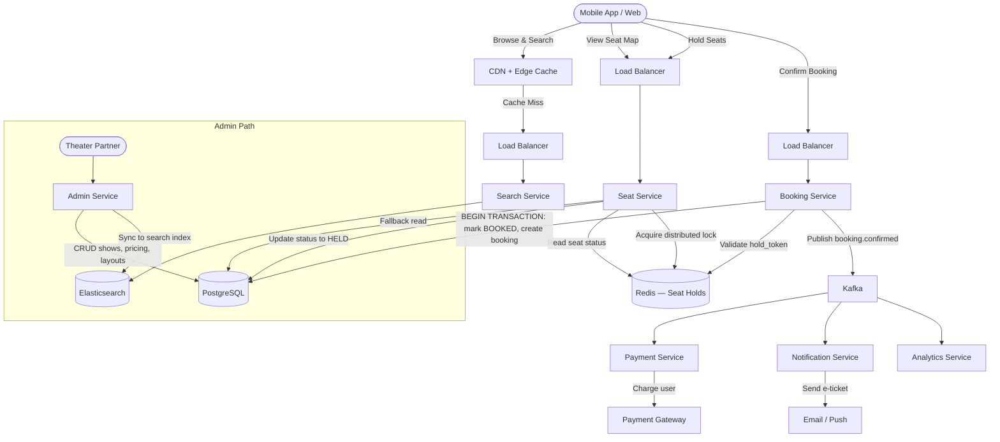

# Case Study: Online Ticket Booking — BookMyShow (System Design)

## Quick Summary (TL;DR)
- **Goal**: Design an online platform where users can browse movies/events, view showtimes, select seats on a seat map, and book tickets — all without double-booking.
- **Scale**: 50M MAU, 500K concurrent users during peak (blockbuster release). 10M bookings/day, ~120 bookings/sec average, ~2,000/sec peak.
- **Key Decisions**:
  - Use **Distributed Locking (Redis)** for temporary seat holds during checkout to prevent double-booking without long DB transactions.
  - Use **CQRS** — separate the write path (booking) from the read path (browsing/search) since reads outnumber writes 100:1.
  - Use **an Event-Driven architecture** — booking events flow through Kafka to trigger payment, notification, and analytics independently.
  - Use **PostgreSQL** for booking transactions (ACID guarantees on money) and **Elasticsearch** for search/browse (full-text, geo, filters).

---

## 🤓 Noob Jargon Buster

* **Seat Hold / Temporary Lock**: When a user clicks a seat, we "hold" it for a short window (e.g., 7 minutes) so nobody else can select it. If the user doesn't complete payment, the hold expires and the seat is released back.
* **Double Booking**: Two users successfully booking the same seat for the same show. This is the #1 thing to prevent.
* **CQRS (Command Query Responsibility Segregation)**: Splitting the system into two paths — a "command" path for writes (book/cancel) and a "query" path for reads (browse movies, view seat maps). Each path is optimized independently.
* **Optimistic Locking**: Instead of locking a row upfront, we read a version number, do our work, and then update only if the version hasn't changed. If it has, someone else got there first — retry or fail.
* **Idempotency Key**: A unique token per booking attempt so retries (e.g., user double-clicks "Pay") don't create duplicate bookings.

---

## 1. Requirements & Scope

### Functional
1. **Browse & Search**: Users search movies by city, genre, language, date. View theaters and showtimes.
2. **Seat Selection**: Display a real-time seat map. Users pick specific seats.
3. **Temporary Hold**: Selected seats are held for 7 minutes while the user completes payment.
4. **Booking & Payment**: Collect payment, confirm booking, generate e-ticket.
5. **Cancellation & Refund**: Users can cancel within policy window; refund is processed.
6. **Admin Panel**: Theater partners manage shows, pricing, seat layouts.

### Non-Functional
- **No Double Booking**: The absolute #1 constraint. Two users must never book the same seat.
- **Low Latency Reads**: Browsing and seat map rendering must be `< 200ms`.
- **High Availability**: The system must survive regional failures — users should always be able to browse and book.
- **Handle Spikes**: Blockbuster releases (e.g., Avengers opening) cause 10–20x traffic spikes in minutes.

---

## 2. Scale Estimation (The Math)

### Throughput (QPS)
- **Daily Bookings**: 10M/day.
  - Average QPS: $\frac{10,000,000}{86,400} \approx 116 \text{ bookings/sec}$.
  - Peak QPS: $\approx 2,000 \text{ bookings/sec}$ (blockbuster release window).
- **Browse/Search Traffic**: 100x bookings = $\approx 12,000 \text{ reads/sec}$ average, $\approx 200,000 \text{ reads/sec}$ peak.

### Storage
- **Booking Record**: ~500 bytes (booking_id, user_id, show_id, seat_ids[], amount, status, timestamps).
- **Daily Storage**: $10\text{M} \times 500 \text{ bytes} = 5 \text{ GB/day}$.
- **Yearly Storage**: $5 \text{ GB} \times 365 = 1.8 \text{ TB/year}$ (bookings only).
- **Seat Map Data**: ~50K shows/day × 200 seats × 20 bytes = ~200 MB/day (ephemeral, rotated).

### Memory
- **Active Seat Holds in Redis**: At peak, 500K concurrent users × 3 seats average = 1.5M held seats.
  - Each hold entry: ~100 bytes (show_id, seat_id, user_id, expiry).
  - Total: $1.5\text{M} \times 100 \text{ bytes} = 150 \text{ MB}$ — easily fits in a single Redis node.

---

## 3. System API Design

### A. Search Movies
- **Endpoint**: `GET /v1/movies?city=mumbai&date=2026-06-01&genre=action`
- **Response**: List of movies with theaters, showtimes, availability summary.

### B. Get Seat Map
- **Endpoint**: `GET /v1/shows/{show_id}/seats`
- **Response**:
  ```json
  {
    "show_id": "s_12345",
    "seats": [
      { "seat_id": "A1", "category": "GOLD", "price": 350, "status": "AVAILABLE" },
      { "seat_id": "A2", "category": "GOLD", "price": 350, "status": "HELD" },
      { "seat_id": "B1", "category": "SILVER", "price": 200, "status": "BOOKED" }
    ]
  }
  ```

### C. Hold Seats (Temporary Lock)
- **Endpoint**: `POST /v1/shows/{show_id}/hold`
- **Request**:
  ```json
  {
    "seat_ids": ["A1", "A3"],
    "user_id": "u_67890"
  }
  ```
- **Response**: `200 OK` with `hold_token` and `expires_at` (now + 7 min), or `409 Conflict` if seats are already held/booked.

### D. Confirm Booking
- **Endpoint**: `POST /v1/bookings`
- **Request**:
  ```json
  {
    "hold_token": "ht_abc123",
    "payment_method_id": "pm_xyz",
    "idempotency_key": "idem_user67890_show12345_1756512000"
  }
  ```
- **Response**: `201 Created` with booking confirmation, e-ticket URL.

### E. Cancel Booking
- **Endpoint**: `POST /v1/bookings/{booking_id}/cancel`
- **Response**: `200 OK` with refund status.

---

## 4. Database Schema Design

### Bookings & Shows (PostgreSQL — ACID for Money)

```sql
-- Shows table
CREATE TABLE shows (
    show_id       UUID PRIMARY KEY,
    movie_id      UUID NOT NULL,
    theater_id    UUID NOT NULL,
    screen_id     UUID NOT NULL,
    start_time    TIMESTAMPTZ NOT NULL,
    end_time      TIMESTAMPTZ NOT NULL,
    created_at    TIMESTAMPTZ DEFAULT NOW()
);

-- Seat inventory per show
CREATE TABLE show_seats (
    show_id          UUID NOT NULL,
    seat_id          VARCHAR(10) NOT NULL,
    category         VARCHAR(20) NOT NULL,  -- GOLD, SILVER, PLATINUM
    price            INTEGER NOT NULL,
    status           VARCHAR(10) NOT NULL DEFAULT 'AVAILABLE',  -- AVAILABLE, HELD, BOOKED
    held_by_user_id  UUID,                  -- User currently holding the seat
    version          INTEGER NOT NULL DEFAULT 0,  -- Optimistic locking
    updated_at       TIMESTAMPTZ DEFAULT NOW(),   -- Tracks when status changed (used for cleanup)
    PRIMARY KEY (show_id, seat_id)
);

-- Bookings
CREATE TABLE bookings (
    booking_id      UUID PRIMARY KEY,
    user_id         UUID NOT NULL,
    show_id         UUID NOT NULL,
    seat_ids        TEXT[] NOT NULL,
    total_amount    INTEGER NOT NULL,
    status          VARCHAR(20) NOT NULL DEFAULT 'CONFIRMED',  -- CONFIRMED, CANCELLED, REFUNDED
    idempotency_key VARCHAR(100) UNIQUE,
    created_at      TIMESTAMPTZ DEFAULT NOW()
);
```

**Why PostgreSQL?** Booking involves money. We need ACID transactions — debit user, mark seats as BOOKED, create booking record — all atomically. NoSQL can't guarantee this without complex application-level coordination.

### Search & Browse (Elasticsearch)
- **Index**: `movies` — fields: `title`, `genre[]`, `language`, `city`, `rating`, `release_date`, `theaters[].showtimes[]`.
- Optimized for full-text search, geo-based filtering (nearest theaters), and faceted browsing.

### Seat Holds (Redis — Ephemeral, TTL-Based)
- **Key**: `hold:{show_id}:{seat_id}`
- **Value**: `{ "user_id": "u_67890", "hold_token": "ht_abc123" }`
- **TTL**: 420 seconds (7 minutes)
- When TTL expires, the hold auto-releases — no cleanup cron needed.

---

## 5. High-Level Architecture



### Booking Flow (Step-by-Step)
1. User browses movies → **Search Service** queries Elasticsearch (cached at CDN for popular queries).
2. User opens seat map → **Seat Service** merges PostgreSQL seat data with Redis hold data to show real-time availability.
3. User selects seats → **Seat Service** acquires Redis locks (`SETNX` with 7-min TTL), updates DB status to `HELD`.
4. User clicks "Pay" → **Booking Service** validates the `hold_token` in Redis, runs a DB transaction (mark seats `BOOKED`, insert booking row), publishes `booking.confirmed` to Kafka.
5. **Payment Service** charges the user asynchronously. On failure, the Booking Service rolls back and releases seats.
6. **Notification Service** sends e-ticket via email/push.

---

## 6. Why Choose This? (Defending Your Architecture)

### 🧭 Why Redis for seat holds instead of DB row-level locks?
* **Answer**: "Database row-level locks (`SELECT ... FOR UPDATE`) hold open a DB connection for the entire hold duration (7 minutes). With 500K concurrent users, that's 500K open connections and blocked rows — the database would collapse. Redis `SETNX` with a TTL is a lightweight, non-blocking lock that auto-expires. It costs ~100 bytes per hold and handles millions of concurrent locks trivially. The DB only gets touched twice — once to mark `HELD` and once to mark `BOOKED` — both are instant writes."

### 🧭 Why CQRS (separate read and write paths)?
* **Answer**: "Browse/search traffic is 100x booking traffic. If both share the same PostgreSQL instance, read queries (complex joins across movies, theaters, showtimes, seat counts) would compete with write transactions (seat updates, booking inserts) for the same connection pool and I/O. Splitting reads to Elasticsearch and writes to PostgreSQL lets us scale each independently. Elasticsearch handles full-text search, geo queries, and faceted filtering far better than SQL `LIKE` queries."

### 🧭 Why PostgreSQL for bookings instead of DynamoDB?
* **Answer**: "Booking is a financial transaction. We need to atomically: (1) update seat status from HELD to BOOKED, (2) insert a booking record, (3) deduct from wallet or record payment intent — all within a single transaction. If any step fails, all must roll back. PostgreSQL gives us ACID transactions natively. DynamoDB's single-table transactions are limited to 100 items and lack true multi-table ACID. For a payment-critical path, relational databases are the safe choice."

### 🧭 Why not just use WebSockets for real-time seat map updates?
* **Answer**: "WebSockets are great for 1-on-1 chat where both parties are always connected. For a seat map, 50,000 users might be viewing the same show simultaneously. Maintaining 50K persistent WebSocket connections per show and broadcasting every seat status change is expensive. Instead, we use **short polling** (client fetches seat map every 5 seconds) or **Server-Sent Events** for popular shows. The seat map is small (~4 KB for 200 seats), so frequent polling is cheap and simpler to scale behind a CDN."

---

## 7. SDE-2 Deep Dives & Trade-offs

### A. The Double-Booking Problem (The Core Challenge)

This is the question the interviewer is really asking. There are three approaches:

#### Option 1: Pessimistic Locking (DB Row Lock)
```sql
BEGIN;
SELECT * FROM show_seats WHERE show_id = ? AND seat_id = ? FOR UPDATE;
-- Check if AVAILABLE, then:
UPDATE show_seats SET status = 'BOOKED' WHERE show_id = ? AND seat_id = ?;
COMMIT;
```
- *Pros*: Simple, correct, battle-tested.
- *Cons*: Holds DB locks for the entire transaction. Under high concurrency (blockbuster release), creates lock contention and connection exhaustion. Does NOT work for 7-minute holds.

#### Option 2: Optimistic Locking (Version Column)
```sql
UPDATE show_seats
SET status = 'BOOKED', version = version + 1
WHERE show_id = ? AND seat_id = ? AND status = 'AVAILABLE' AND version = ?;
-- If affected_rows == 0 → someone else got it first → return 409 Conflict.
```
- *Pros*: No long-held locks. Fast, scales well.
- *Cons*: High retry rate under extreme contention (10,000 users clicking the same seat).

#### Option 3: Redis Distributed Lock + DB Optimistic Lock (Recommended)
```
1. SETNX hold:{show_id}:{seat_id} {user_id} EX 420    → Instant, O(1)
2. If SET succeeded → UPDATE show_seats SET status='HELD', version=version+1 WHERE ... AND version=?
3. On payment confirmation → UPDATE show_seats SET status='BOOKED' WHERE ... AND status='HELD'
4. If TTL expires → Cleanup job sets status back to 'AVAILABLE'
```
- *Pros*: Redis handles the high-concurrency race (millions of SETNX/sec). DB only processes confirmed transitions. Combines speed of Redis with ACID of PostgreSQL.
- *Cons*: Two systems to keep in sync (Redis and DB). If Redis crashes after SETNX but before DB update, the seat is "ghost-held" — mitigated by TTL auto-expiry.

### B. Handling Blockbuster Spikes (Surge Architecture)

When Avengers tickets go on sale, traffic spikes 20x in 5 minutes:

1. **Virtual Waiting Room**: Before showing the seat map, put users in a queue (like Ticketmaster). Release users in batches of 5,000 every 30 seconds. This converts a traffic spike into a smooth flow.
2. **Rate Limiting per Show**: Max 10,000 concurrent seat-map viewers per show. Excess users see "High demand — you're in queue".
3. **Pre-warm Caches**: Before a big release, pre-populate Redis with all seat data and CDN with movie/theater info.
4. **Auto-scaling**: Booking Service and Seat Service have HPA (Horizontal Pod Autoscaler) rules — scale from 10 → 100 pods when QPS > 500/sec.

### C. Payment Failure & Seat Release

What happens when the user holds seats but payment fails?

```
Hold acquired (T=0) → User redirected to payment gateway
  → Payment succeeds (T=2min) → Confirm booking, mark BOOKED
  → Payment fails (T=2min) → Release hold in Redis, mark AVAILABLE in DB
  → Payment timeout (T=7min) → Redis TTL expires, cleanup job marks AVAILABLE in DB
```

**Edge Case**: Payment gateway responds "success" after the hold has already expired (T=8min). The Booking Service must re-check seat availability before confirming. If the seat was re-held by another user, reject the late payment and initiate a refund.

### D. Consistency Between Redis and PostgreSQL

Redis holds are ephemeral; PostgreSQL is the source of truth. They can drift:

| Scenario | Redis | PostgreSQL | Fix |
|----------|-------|------------|-----|
| Happy path | Key exists (TTL 7min) | status=HELD | In sync |
| Redis TTL expires, DB not updated | Key gone | status=HELD (stale) | **Cleanup cron** runs every 1 min: `UPDATE show_seats SET status='AVAILABLE' WHERE status='HELD' AND updated_at < NOW() - INTERVAL '8 minutes'` |
| Redis SET succeeded, DB update failed | Key exists | status=AVAILABLE | Seat Service checks DB before confirming. If DB says AVAILABLE, the hold is invalid — release Redis key |

---

## 8. Common Traps & Mitigations

1. **Ghost Holds (Redis ↔ DB Drift)**: Redis hold expires but DB still says `HELD`. The seat appears unavailable on the seat map.
   - *Mitigation*: Run a **lightweight reconciliation job** every 60 seconds that queries `show_seats WHERE status='HELD' AND updated_at < NOW() - 8 min` and resets them to `AVAILABLE`. The 8-minute threshold gives a 1-minute buffer beyond the 7-minute hold TTL.

2. **Hot Seat Problem**: 10,000 users clicking the same premium seat (e.g., Row A, Seat 1) at the exact same moment.
   - *Mitigation*: Redis `SETNX` is atomic and single-threaded — exactly one user wins. The other 9,999 get an instant `409 Conflict`. No DB contention at all. On the frontend, grey out the seat immediately for losers via optimistic UI update.

3. **Overselling Due to Stale Seat Map**: User loads seat map, sees seat A1 as available, but by the time they click, someone else has held it.
   - *Mitigation*: The seat map is a **hint**, not a guarantee. The actual availability check happens at the `/hold` API (Redis SETNX). If the hold fails, the frontend refreshes the seat map and shows the updated state. Users expect this race condition — it's the same as real-world ticket booking.

4. **Payment Gateway Timeout Holding Seats Hostage**: User's bank takes 10 minutes to respond. Seats are held for 7 minutes. After 7 minutes, the hold expires and someone else books those seats. Bank finally responds "success" at minute 10.
   - *Mitigation*: On late payment success, **do not force-book** the seats. Check if seats are still available. If not, initiate an automatic refund and show the user "Sorry, your seats were released due to timeout. You've been refunded."

5. **Inventory Count Mismatch on Search Results**: Elasticsearch shows "45 seats available" but the real-time count in PostgreSQL is 42 because 3 were just held.
   - *Mitigation*: Accept eventual consistency for browse/search. The seat count on the listing page is an **approximation**. The exact, real-time availability is only shown on the seat map page (which reads from Redis + DB). Update Elasticsearch via Kafka events with a ~5-second lag — good enough for search results.
