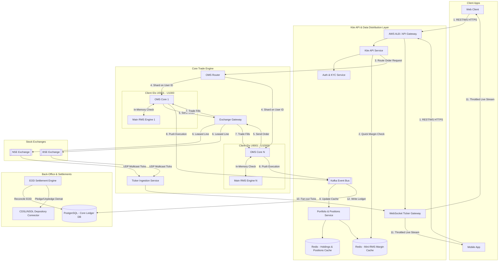
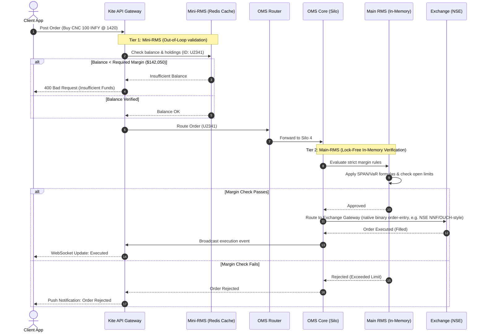

# Case Study: Retail Broker App (Zerodha-Style System Design)

## Quick Summary (TL;DR)
- **Goal**: Design a high-concurrency, low-latency retail stockbroker system (like Zerodha) that allows millions of retail users to stream real-time market data, perform risk assessments (RMS), place orders, manage portfolios, and complete post-trade settlement.
- **Scale**: 15 Million registered users, 5 Million Daily Active Users (DAUs), 2 Million Peak Concurrent Users (PCUs). Handles 30 Million orders/day (~1,333 TPS average, ~15,000 TPS peak) and streams market ticks to 2 Million concurrent WebSocket connections (consuming ~20 Gbps peak egress).
- **Key Decisions**:
  - **Hybrid Cloud & Co-location**: Host client-facing Kite APIs, watchlists, portfolio caches, and WebSocket servers on AWS (Mumbai/Hyderabad) for horizontal elasticity. Co-locate the core Order Management System (OMS) and Risk Management System (RMS) inside physical servers at the Stock Exchange (e.g., NSE/BSE data centers) with leased lines to guarantee sub-millisecond network round-trips.
  - **OMS Silo Architecture**: Horizontally scale the stateful, single-threaded OMS core by partitioning users across independent physical "silos" (e.g., Silo 1 handles Client IDs `U0000001` to `U1000000`). With ~15 silos of ~1M clients each, a single physical silo failure isolates the blast radius to only ~1/15th of the user base.
  - **Two-Tier Risk Checks (Mini-RMS & Main-RMS)**:
    - *Mini-RMS (API Layer)*: Uses Redis/in-memory ledger caches to perform fast balance/holding verification, filtering out invalid orders (e.g., insufficient funds) at the API gateway to protect core OMS capacity.
    - *Main-RMS (OMS Core Loop)*: Performs heavy real-time margin computation (VaR + SPAN margins) in the execution loop in $<3\text{ ms}$ before routing to the Exchange.
  - **Low-Overhead WebSockets via epoll**: Mitigate the Go runtime thread-blocking bottleneck (goroutine-per-connection) by implementing an epoll-based WebSocket gateway. This eliminates per-connection goroutine stack overhead (~16 GB of stack frames at 2M connections) and the associated GC pressure, dramatically cutting CPU latency spikes and memory.
  - **Asynchronous Ledger & Settlement**: Defer heavy database writes by placing executed trades into Kafka. Consumers asynchronously update the PostgreSQL double-entry ledger, update tax fields (STT, GST, Stamp Duty), and prepare End-of-Day (EOD) files for the Clearing Corporation.

---

## 🤓 Noob Jargon Buster

* **OMS (Order Management System)**: The system that manages the lifecycle of an order (Created, Open, Modified, Filled, Rejected, Cancelled).
* **RMS (Risk Management System)**: A pre-trade check engine that ensures a user has enough margin, limits, and holdings to place a specific order.
* **Exchange (NSE/BSE)**: The marketplace where buyers and sellers trade assets. In India, National Stock Exchange (NSE) and Bombay Stock Exchange (BSE).
* **Clearing Corporation (CC)**: An entity (like NSCCL) that guarantees the settlement of trades, ensuring the buyer gets shares and the seller gets money.
* **Depository (CDSL/NSDL)**: The financial institution holding securities (shares) in digital form (Demat accounts).
* **SPAN Margin (Standardised Portfolio Analysis of Risk)**: An exchange-mandated margin requirement for futures and options (F&O) trading based on portfolio-wide risk.
* **VaR (Value at Risk) & ELM (Extreme Loss Margin)**: Margin requirements for equity delivery to cover potential worst-case daily stock price movements.
* **e-DIS (Electronic Delivery Instruction Slip)**: A secure digital flow allowing retail clients to authorize the broker to debit shares from their Demat account when selling, replacing physical Power of Attorney (POA).
* **LTP (Last Traded Price)**: The most recent price at which a stock transaction occurred.
* **Market Depth / Order Book**: A real-time list of buy and sell orders, organized by price level (typically top 5 bids and asks).

---

## 1. Requirements & Scope

### Functional
1. **User Onboarding & Demat**: Support user onboarding and link accounts with depositories (CDSL/NSDL).
2. **Real-time Market Feed**: Stream live quotes, LTP, and top-5 market depth for 10,000+ active tickers.
3. **Order Lifecycle**: Place, modify, and cancel orders (Market, Limit, Stop-Loss, Intraday, Delivery).
4. **Pre-Trade Risk Management**: Check margins and holdings dynamically before sending orders to the exchange.
5. **Portfolio & Ledger View**: Real-time tracking of open "Positions" (intraday) and "Holdings" (settled equity delivery).
6. **Funds Transfer (Pay-in/Pay-out)**: Add or withdraw money using external payment gateways.
7. **Post-Trade Settlement (EOD)**: Calculate brokerages, taxes, and exchange fees, and perform depository reconciliation.

### Non-Functional
- **Ultra-low Latency**: Order validation, risk checks, and routing to the exchange must take $< 10\text{ ms}$ (internal latency).
- **High Concurrency & Throughput**: Handle massive surges at market open (9:15 AM IST) and during volatile events.
- **Strict Data Consistency & Durability**: Zero trade loss. Ledgers must balance perfectly to zero.
- **High Availability**: Core trading engine must have $99.99\%$ availability during trading hours (9:15 AM - 3:30 PM).
- **Fault Isolation**: A software crash or hardware failure in one portion of the client base must not impact others.

---

## 2. Scale Estimation (The Math)

### Throughput (QPS)
- **Active Traders**: $5\text{M Daily Active Users (DAUs)}$, $2\text{M Peak Concurrent Users (PCUs)}$.
- **Daily Orders placed**: $30\text{M orders/day}$ (includes modifications/cancellations).
- **Trading Window**: $6\text{ hours, } 15\text{ minutes} = 22,500\text{ seconds}$ (9:15 AM to 3:30 PM).
- **Average Order QPS**: 
  $$\text{Average QPS} = \frac{30,000,000}{22,500} \approx 1,333\text{ orders/sec}$$
- **Peak Order QPS**: Occurs during the first 15 minutes of market open (9:15 AM - 9:30 AM) and around major news events.
  $$\text{Peak QPS} \approx 10 \times \text{Average QPS} \approx 13,330\text{ to } 15,000\text{ orders/sec}$$
- **Trade Execution (Fills) QPS**: Assume $10\text{M orders}$ get executed (filled) daily.
  $$\text{Average Executions} = \frac{10,000,000}{22,500} \approx 444\text{ executions/sec}$$
  $$\text{Peak Executions} \approx 4,000\text{ to } 5,000\text{ executions/sec}$$

### Market Ticker Feed Scale
- **Number of Active Tickers**: $\approx 10,000$ (Equities + F&O Contracts).
- **Exchange Feed Speed**: Exchange broadcasts binary packets over UDP Multicast. Active stocks tick up to 10 times/sec; derivatives tick even faster. 
- **Raw Exchange Ingestion QPS**: Let's assume an average of $5\text{ updates/sec}$ across $5,000$ active stocks:
  $$\text{Ingestion QPS} = 5,000 \times 5 = 25,000\text{ ticks/sec}$$
- **WebSocket Fan-out**: 2 Million concurrent WebSocket connections. If each user subscribes to a watchlist of 20 stocks:
  - If we send raw ticks unthrottled: $2\text{M users} \times 20 \text{ stocks} \times 2\text{ ticks/sec} = 80\text{ Million updates/sec}$.
  - **Optimization**: The Ticker Gateway debounces per symbol and flushes a consolidated payload to each client **every 250 ms (4 flushes/sec)** — see §5C. Of a 20-symbol watchlist, only $\approx 5$ symbols tick within any given 250 ms flush window on average, so we emit at most one update per active symbol per flush.
  - **Actual Egress Output QPS**: 
    $$\text{Throttled Egress} = 2,000,000 \text{ users} \times 5 \text{ active symbols} \times 4\text{ flushes/sec} = 40,000,000\text{ messages/sec}$$
- **Egress Network Bandwidth**: Each binary WebSocket payload (LTP, change %, volume) is $\approx 64 \text{ bytes}$ (optimized format).
  $$\text{Egress Bandwidth} = 40,000,000 \text{ messages/sec} \times 64 \text{ bytes} \approx 2.56 \text{ GB/sec} \approx 20 \text{ Gbps (sustained peak)}$$
  *(Consistent with the 250 ms flush interval in §5C. A slower 1 s flush would cut this ~4× to ~5 Gbps at the cost of a less "live" tape.)*

### Storage Estimation (1 Year Data)
- **Order Logs**: $30\text{M orders/day} \times 250 \text{ bytes/log} = 7.5\text{ GB/day}$.
  $$\text{1 Year Order Storage} = 7.5\text{ GB} \times 250 \text{ trading days} = 1.875\text{ TB (uncompressed)}$$
- **Trade Execution Ledger**: $10\text{M executions/day} \times 2 \text{ double-entry rows} = 20\text{M rows/day}$. Each row $\approx 200 \text{ bytes}$.
  $$\text{Ledger Storage/Day} = 20\text{M} \times 200\text{ bytes} = 4\text{ GB/day}$$
  $$\text{1 Year Ledger Storage} = 4\text{ GB} \times 250 = 1\text{ TB}$$
- **Tick Data (Historical Charts)**: $25,000\text{ ticks/sec} \times 22,500\text{ sec/day} = 562.5\text{ Million ticks/day}$. Each tick $\approx 32\text{ bytes}$.
  $$\text{Tick Storage/Day} = 562.5\text{M} \times 32\text{ bytes} \approx 18\text{ GB/day}$$
  $$\text{1 Year Tick Storage} = 18\text{ GB} \times 250 = 4.5\text{ TB (Stored in TimescaleDB/ClickHouse)}$$

---

## 3. System API Design

### 1. Place Order
- **Endpoint**: `POST /v2/orders`
- **Request Headers**:
  - `Authorization: Bearer <JWT_Token>`
  - `X-Idempotency-Key: <UUID>`
- **Request Payload**:
  ```json
  {
    "symbol": "INFY",
    "exchange": "NSE",
    "transaction_type": "BUY",
    "order_type": "LIMIT",
    "product": "CNC", 
    "quantity": 100,
    "price": 1420.50,
    "trigger_price": 0.0,
    "validity": "DAY"
  }
  ```
  *(Note: `product` parameter: `CNC` = Cash n Carry (Delivery), `MIS` = Margin Intraday Squareoff)*

> **Idempotency**: The client sends a unique `X-Idempotency-Key` per logical order intent. The Kite API does a Redis `SET key <order_id> NX EX 900` (15-min window) *before* routing. If the key already exists, the API returns the **original** `order_id` instead of placing a second order — this makes network retries safe and prevents duplicate orders on flaky mobile connections. In-flight duplicates (key set but no `order_id` yet) receive a `409 Conflict / retry` rather than a second placement.
- **Response**:
  ```json
  {
    "status": "success",
    "data": {
      "order_id": "ORD-20260709-1002341",
      "status": "PUT ORDER REQUEST RECEIVED"
    }
  }
  ```

### 2. Fetch User Positions (Real-time)
- **Endpoint**: `GET /v2/portfolio/positions`
- **Response**:
  ```json
  {
    "status": "success",
    "data": [
      {
        "symbol": "TATASTEEL",
        "exchange": "NSE",
        "product": "MIS",
        "quantity": 500,
        "buy_price": 115.40,
        "last_price": 116.20,
        "realised_pnl": 0.0,
        "unrealised_pnl": 400.00
      }
    ]
  }
  ```

### 3. Ticker Subscription (WebSocket Protocol)
- **WS Connection URL**: `wss://ticker.kite.trade` (a short-lived `access_token` is sent in the **first WS frame** or via the `Sec-WebSocket-Protocol` header — not in the query string, which would leak credentials into proxy/access logs and browser history).
- **Subscription Frame (Client -> Server)**:
  ```json
  {
    "action": "subscribe",
    "mode": "quote",
    "tokens": [408065, 738561]
  }
  ```
  *(Note: `408065` is the exchange instrument token for a stock like INFOSYS)*

---

## 4. High-Level Architecture

The architecture enforces a strict boundaries split between the **Elastic Cloud World** (AWS) and the **Ultra-low Latency Physical World** (Exchange Co-location).



---

## 5. Deep Dives

### A. Dual-Environment Partitioning & OMS Silo Architecture
Trading systems require deterministic execution speeds. If orders sit in a typical microservice routing chain, latency spikes (GC pauses, network hops, database locking) will cause slippage—where the user gets filled at a worse price. 

To solve this, Zerodha splits the system:
1. **The Elastic Cloud (AWS)**: Serves web pages, handles authentication, serves historical chart data, handles reports, and maintains WebSocket sessions.
2. **Co-Located Silo Racks**: Core OMS/RMS components run on high-performance physical bare-metal servers physically placed in the exchange data center (e.g., GPX Mumbai). Connectivity to the exchange is via dedicated, redundant $10\text{ Gbps}$ leased lines.

#### Why the Silo Partitioning Model?
A central database is a single point of failure and a latency bottleneck for transactional write locks. Rather than scaling one massive OMS database, users are split into independent **Silos**:

```
                  ┌──────────────────────────────┐
                  │          OMS Router          │
                  └──────────────┬───────────────┘
                                 │
                 Shard on User_ID % Total_Silos
        ┌────────────────────────┼────────────────────────┐
        ▼ (Silo 1)               ▼ (Silo 2)               ▼ (Silo 3)
┌──────────────────────┐ ┌──────────────────────┐ ┌──────────────────────┐
│  Client ID: U01-U10  │ │  Client ID: U11-U20  │ │  Client ID: U21-U30  │
│                      │ │                      │ │                      │
│ ┌──────────────────┐ │ │ ┌──────────────────┐ │ │ ┌──────────────────┐ │
│ │  Go OMS Engine   │ │ │ │  Go OMS Engine   │ │ │ │  Go OMS Engine   │ │
│ └────────┬─────────┘ │ │ └────────┬─────────┘ │ │ └────────┬─────────┘ │
│          ▼           │ │          ▼           │ │          ▼           │
│ ┌──────────────────┐ │ │ ┌──────────────────┐ │ │ ┌──────────────────┐ │
│ │  In-Memory RMS   │ │ │ │  In-Memory RMS   │ │ │ │  In-Memory RMS   │ │
│ └──────────────────┘ │ │ └──────────────────┘ │ │ └──────────────────┘ │
└──────────────────────┘ └──────────────────────┘ └──────────────────────┘
```

- **In-Memory State Keeping**: Each OMS Silo runs as an active, in-memory process. It maintains the current state of open orders, daily margins, and active positions for its assigned segment of users in RAM. No blocking database operations occur during the pre-trade loop.
- **Fail-Safety**: If Silo 2 experiences a hardware failure, users on Silo 1 and Silo 3 continue trading unaffected.
- **Log-First (Sequence-then-Process) Hot Path**: Durability and the in-memory model are reconciled using the **LMAX/Aeron pattern** — the same approach real matching engines use. An inbound order is *first* appended to an **append-only command log replicated via Raft to 2+ peers in the same rack** and assigned a monotonic sequence number. Only *committed* log entries are then fed to a **single-threaded deterministic state machine** that applies RMS + order-state transitions. This is strictly better than "process in RAM, then persist": because state is a pure function of the committed log, recovery is deterministic replay, and we never bolt `fsync` into the middle of margin math.
- **Failover Routine**: On crash, a standby silo is promoted, replays the Raft log from the last applied sequence number to rebuild open-order/margin/position state in memory, and resumes in seconds. A local-`fsync`-only or single-box Redis AOF design is explicitly rejected — if the box dies, unsynced entries are lost, violating the zero-trade-loss NFR. Trade-off: synchronous Raft commit adds ~0.1–0.5 ms to the pre-trade loop, the acceptable price for durability.
- **Stateless Routing (no SPOF hop)**: The "OMS Router" is *not* a stateful box that every order must survive. Silo selection is a **pure consistent-hash of `client_id`** computed at the API/gateway; the gateway resolves the current *leader* of the target silo via service discovery (each silo's Raft group publishes its leader). This keeps routing a thin, replicated lookup rather than an extra failure domain in the critical path, and consistent hashing lets us add/rebalance silos without remapping every user.

---

### B. Two-Tier Risk Management System (RMS)
The Risk Management System prevents users from taking positions they can't afford. If a client attempts to buy \$10,000 worth of options with a \$10 balance, the broker must reject it. If the broker lets a bad order pass to the exchange, the broker is legally liable to clear it, exposing the broker to massive capital risk.

To prevent RMS latency from slowing down orders, the system uses a **Two-Tier Validation Pattern**:



#### Margin Formulas Enforced in Main-RMS:
For Equity Delivery (CNC):
$$\text{Required Margin} = \text{Quantity} \times \text{Price} \times (1 + \text{VaR} + \text{ELM})$$
*(Where $\text{VaR}$ and $\text{ELM}$ are daily risk factors published by the exchange, typically $15\% - 30\%$ for blue-chip equities).*

For Futures & Options (F&O):
$$\text{Required Margin} = \text{SPAN Margin} + \text{Exposure Margin}$$
*(SPAN margin accounts for portfolio hedging; if a trader has 1 Buy Future and 1 Sell Future of the same contract, their risk is net-zero, and the SPAN margin drops significantly. Main-RMS calculates this portfolio offset in-memory in microseconds).*

#### Consistency: Mini-RMS is Best-Effort, Main-RMS is Authoritative
The two tiers create a classic **time-of-check-to-time-of-use (TOCTOU)** race: the Redis Mini-RMS cache can approve an order that Main-RMS later rejects, because a concurrent order in the same silo consumed the margin first, or because the cache is stale relative to the last fill.

- **Mini-RMS is a fast-reject filter only.** It never *reserves* funds; it exists to bounce obviously-invalid orders (insufficient balance) at the edge and protect core OMS capacity. It is allowed to have false-approvals but must minimize false-rejects.
- **Funds/margin are actually reserved inside the single-threaded silo loop.** Because each silo processes its clients' orders serially in memory, the reserve-check-commit sequence is atomic by construction — no locks, no double-spend.
- **Cache staleness.** The Redis margin cache is updated asynchronously from the Kafka fill stream, so it lags real margin by the consumer delay. The system tolerates this precisely because Main-RMS is the source of truth; Mini-RMS thresholds are set slightly conservative (e.g., add a small buffer) to keep false-approvals from wasting core capacity.
The exchange broadcasts tick data at massive rates. A single options expiry day can generate over $50,000$ price updates per second. Sending these updates raw to 2 Million concurrent mobile and web clients will quickly saturate the gateway network interfaces.

#### Epoll-Based Socket Management (Avoiding Goroutine Bloat)
In a standard Go HTTP/WebSocket model, each socket connection runs in its own goroutine.
$$\text{Goroutines for 2M Users} = 2,000,000$$
Each goroutine has a minimum stack size of $2\text{ KB}$ (often growing to $8\text{ KB}$ or more).
$$2\text{M} \times 8\text{ KB} = 16\text{ GB RAM (just for connection thread frames)}$$
When active, thread scheduling overhead and garbage collection sweep times cause significant CPU latency spikes.

**Solution**: Use a non-blocking I/O multiplexer (`epoll` on Linux, `kqueue` on macOS) via library patterns like `gnet` or a custom epoll network loop.
- One master thread manages the epoll file descriptors.
- Sockets are only allocated active worker threads when there is data to read/write.
- This **eliminates the per-connection goroutine stack overhead** (the dominant, GC-pressuring cost), collapsing ~16 GB of stack frames to a small fixed pool of worker goroutines. Note: each kernel TCP socket still costs rcv/snd buffers (tens of KB, tunable via `SO_RCVBUF`/`SO_SNDBUF`), so the *total* footprint per idle connection is dominated by kernel buffers, not app memory \u2014 the win here is CPU/GC and stack RAM, not a literal "<1 KB total per socket."

#### Ticker Fan-Out Architecture

```
[Exchange Multicast Feed] ──► [UDP Receiver Svc]
                                      │
                         (Parse Binary Broadcast)
                                      │
                                      ▼
                        [Internal Tick Pub-Sub (Go)]
                                      │
            ┌─────────────────────────┼─────────────────────────┐
            ▼                         ▼                         ▼
   [Ticker Gateway 1]        [Ticker Gateway 2]        [Ticker Gateway 3]
  (200k Active Clients)     (200k Active Clients)     (200k Active Clients)
   ┌────────────────┐        ┌────────────────┐        ┌────────────────┐
   │ Client Caches  │        │ Client Caches  │        │ Client Caches  │
   │ Watchlists     │        │ Watchlists     │        │ Watchlists     │
   └────────────────┘        └────────────────┘        └────────────────┘
```

1. **Watchlist Partitioning**: Clients subscribe to specific stock IDs. The Ticker Gateway maintains a memory mapping of `Stock_ID ──► List of Client Sockets`.
2. **Debouncing**: Rather than sending a message to a client for every single exchange tick, the gateway groups ticks. Ticks are buffered for each symbol and flushed to the client socket every **$250\text{ ms}$ or $500\text{ ms}$** as a consolidated binary batch payload. This reduces packet overhead by $80\%$.

#### Positions vs. Unrealised P&L (don't recompute P&L server-side per tick)
These are two different concerns and must not be conflated at 2M-user scale:
- **Settled position** (quantity, avg buy price) is **event-sourced from fills** via Kafka — low-frequency, authoritative. `PortSvc` maintains it in Redis and pushes a *snapshot* to the client once (and on each new fill).
- **Unrealised P&L** = `position × (LTP − avg_price)`, which changes on every tick. This is computed **on the client** (or at the ticker gateway) by joining the pushed position snapshot with the live tick stream the client is already subscribed to.

This deliberately avoids a hidden $2\text{M users} \times N\text{ symbols} \times \text{tick-rate}$ server-side P&L fan-out — the server never recomputes P&L per tick; it reuses the market-data stream that's already flowing.

---

### D. Post-Trade Processing, DP Integration (Demat), & Settlements
When a trade is filled at the exchange, the process has only just begun. The buyer doesn't get shares immediately, and the seller doesn't get cash. The trade must go through clearing and depository settlement.

#### End-of-Day (EOD) Clearing Pipeline
In India, trades settle on a **T+1 basis** (Trade day + 1 day). 
1. **Trade File Ingestion**: At 3:30 PM, the exchange stops trading. They generate trade confirmation files (known as `.BOD` or `.EOD` files).
2. **Reconciliation**: The EOD Settlement Engine reads the trade files and runs a reconciliation job against the internal trade execution logs recorded from Kafka to verify that every trade matches perfectly.
3. **Double-Entry Ledger Posting**: Each matched execution translates to balanced entries in the SQL ledger database. Transaction costs are computed:
   - **Brokerage Fee**: Platform flat rate (e.g., flat \$20 or $0.03\%$).
   - **STT (Securities Transaction Tax)**: Mandated tax based on total volume.
   - **Stamp Duty, GST, Exchange Transaction Charges**.

#### Depository (Demat) Integration
Securities are stored digitally in the Depository (CDSL/NSDL). The broker acts as a Depository Participant (DP).
- **Shares Buying**: When a client buys shares delivery, the clearing corporation matches the funds. On T+1, the clearing corporation delivers shares to the broker's pool account, and the EOD engine initiates a transfer to the client's individual Demat account at CDSL.
- **Shares Selling (e-DIS)**: Modern brokers do not hold a Power of Attorney (POA) by default. When a client sells shares from their holdings:
  1. The client must authorize the sale. The API redirects the client to CDSL's portal.
  2. The client enters a secure TPIN and OTP.
  3. CDSL issues a digital authorization token to the broker.
  4. The broker uses the token to *pledge* or *debit* the shares from the client's Demat account during the EOD batch run.

---

## 6. Database Schema

The core ledger and order databases utilize **PostgreSQL** configured with synchronous replication for strict durability. Time-series data (historical charts, price ticks) is sharded inside **TimescaleDB**.

### 1. Daily Orders Table (Read/Write Sharded on `client_id`)
```sql
CREATE TABLE orders (
    order_id         VARCHAR(32) PRIMARY KEY,
    client_id        VARCHAR(16) NOT NULL,
    symbol           VARCHAR(16) NOT NULL,
    exchange         VARCHAR(8) NOT NULL,
    transaction_type VARCHAR(4) NOT NULL,    -- 'BUY', 'SELL'
    order_type       VARCHAR(8) NOT NULL,    -- 'MARKET', 'LIMIT', 'SL', 'SL-M'
    product          VARCHAR(4) NOT NULL,    -- 'CNC', 'MIS', 'NRML'
    quantity         INT NOT NULL,
    filled_quantity  INT NOT NULL DEFAULT 0,
    price            NUMERIC(10, 2) NOT NULL,
    trigger_price    NUMERIC(10, 2) NOT NULL DEFAULT 0.00,
    status           VARCHAR(16) NOT NULL,   -- 'OPEN', 'PARTIAL', 'COMPLETE', 'REJECTED'
    rejection_reason VARCHAR(128),
    created_at       TIMESTAMP WITH TIME ZONE DEFAULT NOW(),
    updated_at       TIMESTAMP WITH TIME ZONE DEFAULT NOW()
);

CREATE INDEX idx_orders_client ON orders (client_id, created_at DESC);
```

### 2. Client Holdings Table (Delivery Shares)
```sql
CREATE TABLE holdings (
    holding_id       BIGSERIAL PRIMARY KEY,
    client_id        VARCHAR(16) NOT NULL,
    symbol           VARCHAR(16) NOT NULL,
    isin             CHAR(12) NOT NULL,      -- International Securities Identification Number
    demat_quantity   INT NOT NULL,           -- Settled shares stored at CDSL
    pledged_quantity INT NOT NULL DEFAULT 0, -- Shares pledged for collateral margin
    avg_buy_price    NUMERIC(10, 2) NOT NULL,
    updated_at       TIMESTAMP WITH TIME ZONE DEFAULT NOW()
);

CREATE UNIQUE INDEX idx_client_isin ON holdings (client_id, isin);
```

### 3. Financial Transaction Ledger (Double-Entry Account Ledger)
```sql
CREATE TABLE financial_ledger (
    entry_id        BIGSERIAL PRIMARY KEY,
    transaction_id  VARCHAR(64) NOT NULL,
    client_id       VARCHAR(16) NOT NULL,
    account_type    VARCHAR(32) NOT NULL,   -- 'assets:receivables:exchange', 'liabilities:client_funds'
    entry_type      VARCHAR(6) NOT NULL,    -- 'DEBIT' (reduces liability/adds asset), 'CREDIT'
    amount          BIGINT NOT NULL,        -- Amount stored in paisa/cents (100 rupees = 10000 paisa)
    currency        CHAR(3) NOT NULL DEFAULT 'INR',
    description     VARCHAR(256),
    created_at      TIMESTAMP WITH TIME ZONE DEFAULT NOW()
);

CREATE INDEX idx_ledger_client_time ON financial_ledger (client_id, created_at DESC);
```

---

## 7. Scaling, Reliability, & Resiliency

### 1. Exchange Gateways & Multi-Path Routing
Exchanges restrict the number of connections and orders per second per gateway. To scale outbound requests:
- **Multiple Exchange Gateways**: Set up parallel physical gateway nodes connected to NSE/BSE. 
- **Load Balancing**: The OMS Router distributes orders across these gateways. If Gateway 1 goes offline, the router immediately diverts all exchange traffic to Gateway 2.

### 2. Margin Check Failure Loop & Circuit Breaking
When the market crashes or moves with extreme volatility, margin calls multiply:
- **Auto-Squareoff Engine (co-located with the silo)**: Runs as a loop **inside/next to each OMS silo**, not as a standalone cloud microservice. Liquidation requires the *authoritative* in-memory margin state — a separate service reading the lagging Redis margin cache could liquidate on stale data, a real financial and legal hazard. The loop joins live LTP with the silo's own margin state; if a user's margin utilization exceeds $100\%$, it emits market squareoff orders through the *same* deterministic silo log so liquidation is sequenced and durable like any other order.
- **Circuit Breakers**: To prevent a run-away bug from spamming the exchange, per-client rate limits (e.g., max 50 orders/minute) are enforced at the **API gateway** (edge) and re-checked authoritatively in the silo. If a client exceeds this, it is temporarily blocked from placing new requests. The exchange also enforces its own per-session OPS limit, so the exchange gateway shapes outbound order rate to stay under it.

### 3. Graceful Degradation (Read-only Modes)
If the core OMS or exchange connectivity suffers an outage, the system degrades gracefully:
1. **Disable Fresh Buying**: Disable fresh positions or buying power options on Kite.
2. **Squareoff Only**: Allow clients to only close/exit existing positions.
3. **Cache Reads**: Keep serving holdings, positions, and profile details from Redis/Elasticsearch caches without hitting database engines.
