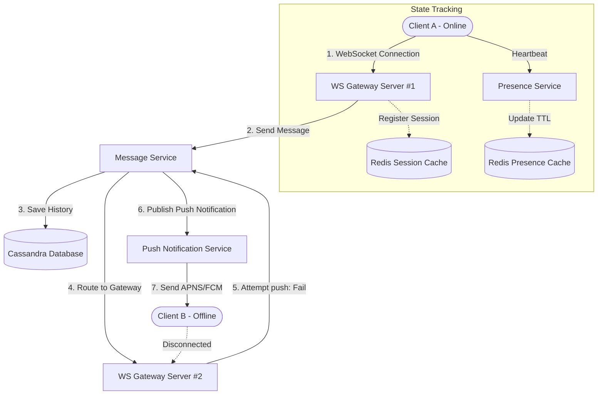
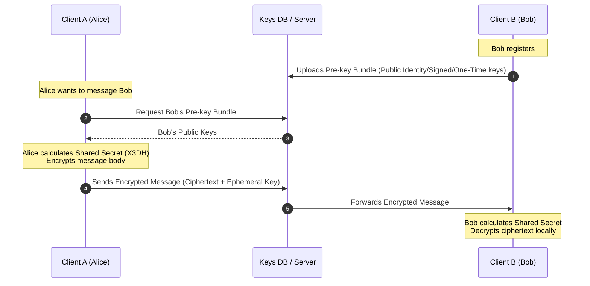
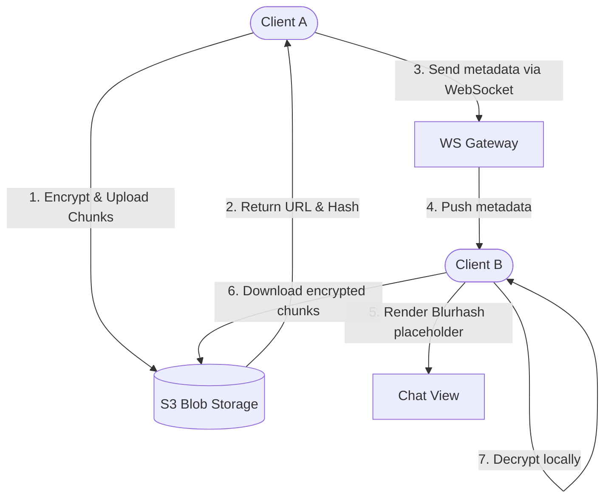
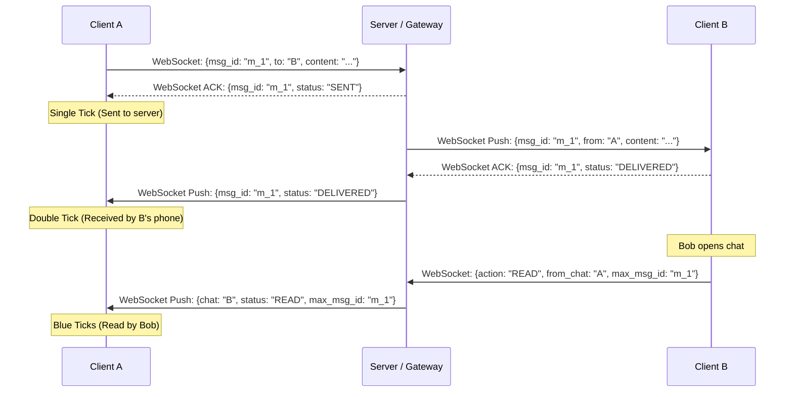

# Case Study: Real-Time Chat System (System Design)

## Quick Summary (TL;DR)
- **Goal**: Design a real-time messaging system (like WhatsApp or Slack) supporting 1-on-1 chat, group chat, delivery statuses (sent/delivered/read), and online presence.
- **Scale**: 500M DAU, 50 Billion messages/day. Write throughput: 600,000 messages/second.
- **Key Decisions**:
  - Use **WebSockets** for persistent, low-latency, bi-directional message delivery.
  - Use **Cassandra (Wide-Column Store)** for storing chat history because of its high write throughput, seamless sharding, and optimized sequential disk layout.
  - Maintain **stateful WebSocket Gateways** in front of a stateless backend to manage active TCP connections for online users.
  - Track **Presence (Online/Offline Status)** using a Redis-backed heartbeat mechanism, avoiding database write storms.

---

## 🤓 Noob Jargon Buster

* **WebSocket Gateway**: A cluster of servers that hold open, active TCP connections (WebSockets) to all online clients, routing messages to and from users.
* **Message Fan-out**: The process of duplicating a single message and sending it to multiple destinations (e.g., in a group chat, writing a copy to all group members' inboxes).
* **Heartbeat**: A periodic ping sent by the client to the server (e.g., every 5 seconds) to confirm the user is still connected (online).
* **Presence Store**: A database/cache that stores the online/offline state of users.

---

## 1. Requirements & Scope

### Functional
1. **One-to-One Chat**: Send and receive messages in real time.
2. **Group Chat**: Create chats with up to 1,000 members.
3. **Delivery Status**: Track when a message is Sent, Delivered, and Read.
4. **Presence Status**: See when contacts are Online, Offline, or Last Seen.

### Non-Functional
- **Ultra-low latency**: Messages must deliver in `< 200ms` globally.
- **High Availability**: Messaging must remain operational during partial regional crashes.
- **Scale**: Must handle huge write spikes (e.g., New Year's Eve).

---

## 2. Scale Estimation (The Math)

### Throughput (QPS)
- **Daily Messages**: 50 Billion messages/day.
- **Average QPS**: $\frac{50,000,000,000 \text{ messages}}{86,400 \text{ seconds}} \approx 578,000 \text{ messages/sec}$.
- **Peak QPS**: $\approx 1.2 \text{ Million messages/sec}$.

### Storage (Daily & Yearly)
- **Message Record Size**: $\approx 100 \text{ bytes}$ (Text, message_id, sender_id, timestamp).
- **Daily Storage**: $50\text{B messages} \times 100 \text{ bytes} = 5\text{ Terabytes (TB)}/\text{day}$.
- **Yearly Storage**: $5\text{ TB} \times 365 \text{ days} \approx 1.8 \text{ Petabytes (PB)}/\text{year}$.

---

## 3. High-Level Architecture



---

## 4. Database Schema Design (Cassandra)

Cassandra is perfect for this scale because it handles append-only sequential writes incredibly fast without lock contention.

### Table 1: `messages` (1-to-1 & Group History)
```sql
CREATE TABLE group_messages (
    chat_id uuid,          -- Represents the Group ID or 1-to-1 Chat Hash
    message_id timeuuid,   -- Timeuuid embeds time and is unique, acts as clustering key
    sender_id uuid,
    content text,
    PRIMARY KEY (chat_id, message_id)
) WITH CLUSTERING ORDER BY (message_id DESC);
```
- **Partition Key (`chat_id`)**: Distributes the data across the cluster. All messages for a single chat are stored together on one node.
- **Clustering Key (`message_id`)**: Keeps the messages sorted chronologically on disk within the partition, enabling instant fetch of the last $N$ messages.

---

## 5. Why Choose This? (Defending Your Architecture)

When the interviewer grills you on your choices, here is how you defend them like an SDE-2:

### 🧭 Why choose WebSockets over HTTP Long Polling for messaging?
* **Answer**: "Messaging requires low latency and bi-directional communication. HTTP is a request-response protocol; the server cannot push messages to the client without the client requesting them. Long Polling solves this but keeps connections open, sending repetitive heavy headers (kb size) and renegotiating TCP sockets constantly, putting immense CPU pressure on gateways. WebSockets upgrades a single HTTP socket to a persistent TCP stream, using a tiny 2-to-10 byte framing header, reducing gateway memory and network bandwidth."

### 🧭 Why choose Cassandra (Wide-Column NoSQL) over MySQL/MongoDB for message history?
* **Answer**: "At 50 Billion messages/day, write performance is the primary bottleneck. Relational databases use B-Trees which require random disk I/O to insert indices, causing disk-seek exhaustion. MongoDB locks documents and has scaling issues at absolute extremes. Cassandra utilizes LSM-Trees, which convert random write I/O into sequential disk writes by flushing append-only logs (`SSTables`). It also shards linearly based on the `chat_id` partition key, enabling horizontal scalability with no single point of failure."

### 🧭 Why choose Redis over a Database for Presence Status?
* **Answer**: "With 500M active users pinging heartbeats every 5 seconds, writing status directly to a disk-backed database yields 100M writes/second, which would instantly fail the cluster. Presence is highly transient, read-heavy, and doesn't require ACID durability. An in-memory cache like Redis easily handles millions of operations per second. We use the key-expiration (TTL) feature to automatically mark a user as offline if they fail to send a heartbeat within 10 seconds, offloading database load completely."

### 🧭 Why choose Fan-out on Read over Fan-out on Write for group chats?
* **Answer**: "Fan-out on Write copies each message to every group member's inbox partition. If a group has 1,000 members (or a celebrity channel has 10,000), a single message triggers 10,000 DB write queries, creating massive write amplification and hot-node bottlenecks. Fan-out on Read writes the message exactly once to a single partition (`group_id`). When group members open the chat, they read from this shared partition. This shifts the complexity from heavy writes to reads, which is much easier to optimize using Redis caches."

---

## 6. SDE-2 Deep Dives & Trade-offs

### A. WebSockets vs. HTTP Polling
- **HTTP Long Polling**: 
  - *Cons*: High overhead due to repeating TCP handshakes and HTTP headers for every request. Scalability ceiling is low.
- **WebSockets**:
  - *Pros*: Single TCP handshake; thereafter, client/server exchange thin packets with practically zero overhead.
  - *Decision*: **WebSockets** is chosen for real-time delivery because it minimizes latency and network bandwidth.

### B. Stateful vs. Stateless Server Layers
- **The Problem**: WebSockets are stateful; the gateway server *must* hold the active connection in memory. If Client A is connected to Gateway #1, and Client B is connected to Gateway #2, how does Gateway #1 send a message to Client B?
- **SDE-2 Design**:
  1. Use a **Redis Session Store** to map `user_id -> Gateway_Server_IP`.
  2. When Gateway #1 receives a message for Client B:
     - It checks Redis: "Where is Client B?"
     - Redis returns: "Gateway Server #2".
     - Gateway #1 forwards the message to Gateway #2 via an internal HTTP request or MQ (like RabbitMQ / Redis Pub/Sub).
     - Gateway #2 pushes it down to Client B over the local WebSocket connection.

### C. Online Presence Status at Scale
- **The Problem**: If 500M users send heartbeats to the database every 5 seconds, it creates 100M writes/sec, which will crash any database.
- **SDE-2 Design**:
  - Do *not* write heartbeats to the database. Use **Redis** with an expiration.
  - When Client A pings the Presence Service, update a Redis key: `SETEX presence:user_123 10 "online"`. (TTL is 10 seconds).
  - If a user doesn't ping within 10 seconds, Redis automatically evicts the key, and the user is considered offline.
  - **Presence Fan-out**: To avoid fetching online statuses of all friends constantly, only query status when Client A opens the app (Pull model for list of active friends), or use a WebSocket channel to stream status changes *only* to friends currently in Client A's active view window.

### D. Group Chats: Fan-out on Write vs. Fan-out on Read
- **Fan-out on Write (Inbox Model)**:
  - Copy the message into the inbox partition of every group member.
  - *Pros*: Reading is extremely fast (just select from the user's inbox).
  - *Cons*: For a group with 1,000 members, one message requires 1,000 database writes. A single message in a popular group creates a massive write storm.
- **Fan-out on Read (Shared Group Inbox)**:
  - Save the message *once* in a shared `group_messages` table. Each user tracks their own `last_read_message_id` pointer.
  - *Pros*: Write is $O(1)$ regardless of group size.
  - *Cons*: Fetching message history is slower as users must query the shared table.
  - **Decision**: Use **Fan-out on Read** for group chats to prevent database write storms.
- **Decision**: Use **Fan-out on Read** for group chats to prevent database write storms.

### E. End-to-End Encryption (E2EE) — Signal Protocol
WhatsApp prevents the server from decrypting messages using the Signal Protocol (Double Ratchet Algorithm).



1. **Pre-key Bundles**: Every client registers a set of cryptographic public keys on the server.
2. **Key Exchange (X3DH)**: To initiate a chat, Client A fetches Client B's Pre-key Bundle from the server and performs a Diffie-Hellman key exchange locally to derive a shared session key.
3. **Double Ratchet**: For every message sent, clients execute a cryptographic ratchet, generating new ephemeral keys. This provides **forward secrecy** (if an attacker steals today's session key, they cannot read past conversations) and **post-compromise security** (future messages are safe).
4. **Server Role**: The server acts strictly as a public key directory and an encrypted message router. It never sees the raw message plaintext.

---

### F. High-Performance Media Transfer (Image/Video Chunking)
Sending a large media file (e.g., 15MB video) directly over a WebSocket gateway connection will choke TCP buffers, causing real-time text chats to lag.



- **SDE-2 Flow**:
  1. **Local Encryption**: Client A encrypts the media file locally using a symmetric key (e.g., AES-256).
  2. **Presigned URL Chunked Upload**: Client A uploads the encrypted file directly to S3/Blob Storage using a presigned URL. The upload happens in parallel chunks (e.g., 5MB chunks) to handle network interruptions.
  3. **Lightweight WebSocket Notification**: Client A sends a JSON payload to Client B over the WebSocket gateway containing:
     - The S3 media URL.
     - The AES encryption key.
     - A SHA-256 hash of the encrypted file (for integrity verification).
     - A **Blurhash** (a small 20-30 character string representing a highly compressed, blurry placeholder image).
  4. **Background Download & Decrypt**: Client B renders the blurry placeholder instantly, downloads the encrypted media file from S3 in the background, verifies its hash, and decrypts it locally.

---

### G. Message Tick Status Lifecycle (Single, Double, Blue)
Managing delivery receipts (Sent, Delivered, Read) requires lightweight, real-time message state synchronization.



1. **Sent (Single Tick)**: Client A publishes the message. The server writes it to Cassandra and returns a `SENT` receipt. 
2. **Delivered (Double Tick)**: The server pushes the message to Client B. Client B confirms receipt, and the server forwards a `DELIVERED` notification to Client A.
3. **Read (Blue Tick)**: User B opens the chat window. Client B fires a `READ` event. The server updates the database status and sends a `READ` notification to Client A. 
- *SDE-2 Optimization*: Use **Range Acknowledgments** (e.g., "all messages up to `msg_id: 100` are read") instead of sending individual read receipts per message, saving significant WebSocket throughput in active conversations.

---

### H. Offline Synchronization (SQLite Sync)
When a user goes offline for 3 days, their local database (SQLite on iOS/Android) drifts behind the server.

1. **Pull-Based Batching**: When Client B reconnects, it initiates a sync request with its last successfully processed `sequence_number` (checkpoint).
2. **Cassandra Range Query**: The server queries Cassandra: `SELECT * FROM group_messages WHERE chat_id = ? AND message_id > {client_checkpoint} LIMIT 500`.
3. **Chunked Streaming**: The server streams the missing messages in compressed chunks. Once B processes the chunk, it writes it to SQLite, updates its local checkpoint, and ACKs back to the server to advance the cursor.

---

## 7. Common Traps & Mitigations

1. **Re-connection Storms**: If a Gateway server crashes, 100,000 clients disconnect and immediately attempt to reconnect to other servers, causing a cascading failure.
   - *Mitigation*: Clients must implement **exponential backoff with jitter** when reconnecting, spreading connection attempts over a wider time window.
2. **Out of Order Messages**: Due to network latency, Message A might arrive after Message B.
   - *Mitigation*: Generate sequential client-side or KGS-side timestamps. Use `timeuuid` in Cassandra to sort records on disk instead of relying on the web server's arrival time.

