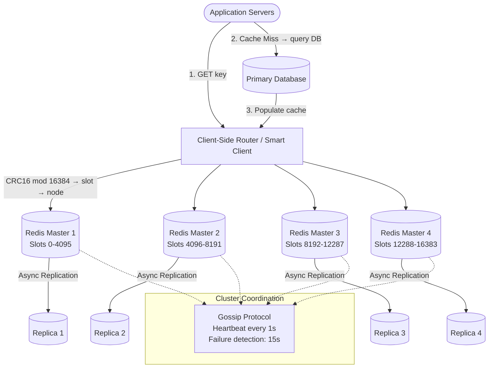

# Case Study: Distributed Cache (Redis / Memcached)

## Quick Summary (TL;DR)
- **Goal**: Design a distributed, in-memory caching layer that sits between application servers and the database, serving hot data at sub-millisecond latency while scaling horizontally across machines.
- **Scale**: 500K reads/sec peak, 50K writes/sec peak. 100 GB of hot data spread across a cluster.
- **Key Decisions**:
  - Use **Redis Cluster** over standalone Redis because we need automatic data sharding, built-in failover, and the ability to scale beyond a single node's memory.
  - Use **Cache-Aside (Lazy Loading)** as the primary caching strategy because it only caches data that is actually requested, avoids filling the cache with unused data, and gives the application full control over staleness tolerance.
  - Use **Consistent Hashing** to distribute keys across cache nodes, ensuring minimal key redistribution when nodes are added or removed.

---

## Noob Jargon Buster

* **Cache Hit / Cache Miss**: A "hit" means the requested data was found in the cache. A "miss" means it was not, so the application must fall back to the database.
* **Eviction Policy**: The rule a cache follows to decide which entries to remove when memory is full. Common policies include LRU (Least Recently Used), LFU (Least Frequently Used), and TTL (Time-To-Live) expiration.
* **Cache Stampede (Thundering Herd)**: When a popular cache key expires and hundreds of concurrent requests all miss the cache simultaneously, hammering the database with identical queries.
* **Consistent Hashing**: A hashing technique where adding or removing a server only remaps $\frac{K}{N}$ keys (K = total keys, N = total nodes) instead of reshuffling everything. See [consistent-hashing.md](../building-blocks/consistent-hashing.md).
* **Write-Through**: Every write goes to the cache AND the database synchronously, so the cache is always consistent.
* **Write-Behind (Write-Back)**: Writes go to the cache first, and are asynchronously flushed to the database in batches, trading durability for write speed.
* **Hash Slot**: Redis Cluster divides the keyspace into 16,384 fixed slots. Each master node owns a subset of slots, and a key's slot is determined by `CRC16(key) mod 16384`.
* **Gossip Protocol**: A peer-to-peer protocol where each node periodically pings a random subset of other nodes to share cluster state (who is alive, who owns which slots). Redis Cluster uses this instead of a centralized coordinator.

---

## 1. Requirements & Scope

### Functional
1. **Get**: Retrieve a value by key in O(1) time. Return `null` on cache miss.
2. **Put**: Insert or update a key-value pair. Optionally attach a TTL.
3. **Delete / Invalidate**: Explicitly remove a key or mark it stale.
4. **Eviction**: Automatically evict entries when memory is full, using a configurable policy (LRU, LFU, TTL, or a combination).
5. **Bulk Operations**: Support multi-get and multi-set for batch efficiency.

### Non-Functional
- **Ultra-low latency**: p99 read latency < 1 ms within a data center.
- **High throughput**: Handle 500K+ reads/sec and 50K+ writes/sec across the cluster.
- **High availability**: No single point of failure; automatic failover within seconds.
- **Horizontal scalability**: Add nodes to increase memory capacity without downtime.
- **Consistency model**: Eventual consistency is acceptable (cache is a derived data store, not the source of truth).

---

## 2. Scale Estimation (The Math)

### Data Size
- **Hot dataset**: 100 GB of frequently accessed data.
- **Average value size**: 1 KB.
- **Total entries**: $\frac{100\text{ GB}}{1\text{ KB}} = 100\text{ Million keys}$.

### Throughput (QPS)
- **Read QPS**: 500,000 reads/sec (peak).
- **Write QPS**: 50,000 writes/sec (peak).
- **Read-to-Write Ratio**: 10:1.

### Cluster Sizing
- **Memory per node**: Each Redis instance safely uses ~25 GB (leave headroom for fragmentation, replication buffers, and fork-based RDB persistence).
- **Data nodes needed**: $\frac{100\text{ GB}}{25\text{ GB/node}} = 4\text{ master nodes}$.
- **With replicas** (1 replica per master for HA): $4\text{ masters} + 4\text{ replicas} = 8\text{ Redis instances}$.
- **Network bandwidth**: $500\text{K reads/sec} \times 1\text{ KB} = 500\text{ MB/sec}$ read throughput. Spread across 4 masters = ~125 MB/sec per node (well within 10 Gbps NIC capacity).

### Memory Overhead
- Redis overhead per key: ~80 bytes (dict entry, SDS string headers, robj pointers).
- **Overhead for 100M keys**: $100\text{M} \times 80\text{ bytes} = 8\text{ GB}$.
- **Total memory**: $100\text{ GB data} + 8\text{ GB overhead} \approx 108\text{ GB}$.

---

## 3. High-Level Architecture



### Request Flow (Cache-Aside Pattern)
1. Application calls `GET(key)`.
2. Smart client computes `CRC16(key) mod 16384` to find the target slot and routes the request to the correct master node.
3. **Cache Hit**: Return the value directly (< 1 ms).
4. **Cache Miss**: Application queries the primary database, gets the result, and writes it back to the cache with a TTL (`SET key value EX ttl`).
5. Subsequent requests for the same key are served from cache.

---

## 4. System API Design

### A. Cache Read
- **Endpoint**: `GET /cache/{key}`
- **Response**:
  ```json
  { "key": "user:1234", "value": "{...serialized JSON...}", "ttl_remaining": 285 }
  ```

### B. Cache Write
- **Endpoint**: `PUT /cache/{key}`
- **Request**:
  ```json
  { "value": "{...serialized JSON...}", "ttl_seconds": 300 }
  ```

### C. Cache Invalidate
- **Endpoint**: `DELETE /cache/{key}`

> **Note**: In practice, applications interact with the cache via a client library (Jedis, Lettuce, redis-py) rather than an HTTP API. The API above is for illustration; real Redis Cluster communication uses the RESP binary protocol over TCP.

---

## 5. Why Choose This? (Defending Your Architecture)

### Why Redis over Memcached?
* **Answer**: "Redis provides richer data structures (sorted sets, lists, streams, hyperloglogs), built-in replication, persistence options (RDB + AOF), and native clustering with automatic failover. Memcached is simpler and uses multi-threaded I/O, which gives it an edge for flat key-value workloads with very large value counts. However, for most modern systems, Redis's feature set and ecosystem (Pub/Sub, Lua scripting, Streams) make it the more versatile choice."

### Why Cache-Aside over Write-Through?
* **Answer**: "Cache-Aside only loads data into the cache on demand, so we avoid wasting memory on data nobody reads. Write-Through eagerly populates the cache on every write, which is beneficial when the read-to-write ratio is extremely high and we need 100% cache-hit rates. But it couples the write path to the cache, increasing write latency. For most services, Cache-Aside with a TTL is the right default."

### Why Consistent Hashing over Simple Modulo Hashing?
* **Answer**: "With modulo hashing (`hash(key) % N`), adding or removing a node changes `N` and remaps nearly all keys, causing a massive cache miss storm. Consistent hashing ensures that only $\frac{1}{N}$ of the keys are redistributed when a node joins or leaves. This is critical for maintaining cache hit rates during scaling events and rolling deployments."

---

## 6. Deep Dives & Trade-offs

### A. Cache Eviction Policies

| Policy | How It Works | Best For | Weakness |
|--------|-------------|----------|----------|
| **LRU** (Least Recently Used) | Evicts the key that hasn't been accessed for the longest time. Redis uses a *sampled LRU* (checks a random sample of keys, evicts the oldest in the sample). | General-purpose workloads | Scan-resistant -- a one-time batch scan can flush hot keys |
| **LFU** (Least Frequently Used) | Evicts the key with the lowest access frequency. Redis 4.0+ uses a *logarithmic frequency counter* with decay. | Workloads with stable hot keys | Slow to adapt when access patterns shift |
| **TTL-based** | Each key has an expiration timestamp. Redis lazily deletes on access + runs periodic active cleanup (sampling 20 keys every 100 ms, deleting expired ones). | Session data, tokens, API responses | If no TTL is set, keys live forever unless evicted by LRU/LFU |
| **LRU + TTL (Hybrid)** | Set TTL on all keys AND configure `maxmemory-policy allkeys-lru`. TTL handles natural expiration; LRU handles overflow. | Production default for most systems | Requires tuning both TTL values and maxmemory |

> **Connection to LLD**: If you've solved the [LRU Cache LLD problem](../../lld/problems/lru_cache/lru_cache.md), you know the classic HashMap + Doubly-Linked-List implementation that achieves O(1) get/put. Redis's sampled LRU is a pragmatic approximation -- instead of maintaining a global linked list (expensive with millions of keys), it samples `maxmemory-samples` random keys (default 5) and evicts the oldest. Increasing the sample size gives better approximation at the cost of CPU.

### B. Caching Strategies (Read/Write Patterns)

```
┌─────────────────────────────────────────────────────────────────────┐
│                   CACHING STRATEGIES                                │
├─────────────────┬───────────────────┬───────────────────────────────┤
│  Cache-Aside    │  Write-Through    │  Write-Behind (Write-Back)    │
│  (Lazy Loading) │                   │                               │
├─────────────────┼───────────────────┼───────────────────────────────┤
│  App reads      │  App writes to    │  App writes to cache only.    │
│  cache first.   │  cache AND DB     │  Cache async-flushes to DB    │
│  On miss, App   │  synchronously.   │  in batches (e.g., every 5s). │
│  reads DB and   │  Cache is always  │                               │
│  populates      │  consistent.      │                               │
│  cache.         │                   │                               │
├─────────────────┼───────────────────┼───────────────────────────────┤
│  + Simple       │  + No stale reads │  + Fastest write path         │
│  + Only caches  │  + High hit rate  │  + Absorbs write spikes       │
│    what's read  │  - Higher write   │  - Risk of data loss if cache │
│  - First read   │    latency        │    crashes before flush       │
│    is always    │  - Caches data    │  - Complex consistency model  │
│    a miss       │    nobody reads   │                               │
└─────────────────┴───────────────────┴───────────────────────────────┘
```

**Read-Through** is a variation of Cache-Aside where the cache itself is responsible for loading data from the DB on a miss (the app only talks to the cache). This simplifies application code but couples the cache layer to the DB schema.

### C. Consistent Hashing for Distribution

In a distributed cache, we need to map each key to exactly one node. Consistent hashing provides a stable mapping:

1. **Hash Ring**: Map each node to multiple points ("virtual nodes") on a circular hash space $[0, 2^{32})$.
2. **Key Placement**: Hash the key and walk clockwise to find the first node.
3. **Node Add/Remove**: Only keys between the departing node and its predecessor are remapped. With $V$ virtual nodes per server, the variance in key distribution drops proportionally to $V$.

Redis Cluster uses a different approach: **hash slots**. The keyspace is divided into 16,384 fixed slots. `CRC16(key) mod 16384` determines the slot, and each master owns a contiguous range of slots. When resharding, Redis migrates slots (and their keys) between nodes using `CLUSTER SETSLOT` and `MIGRATE` commands.

### D. Replication & Failover

**Redis Cluster Replication**:
- Each master has 1+ replicas receiving an **asynchronous replication stream**.
- Replicas maintain an offset into the master's replication backlog.
- If the master fails, the cluster promotes the replica with the most up-to-date offset.

**Failover Process**:
1. Every node pings a random peer every second (gossip protocol).
2. If a node doesn't respond within `cluster-node-timeout` (default 15 seconds), the detecting node marks it as `PFAIL` (possibly failed).
3. When a majority of masters agree the node is `PFAIL`, it becomes `FAIL`.
4. The failed master's replica initiates an election. Other masters vote. The replica with the highest replication offset wins.
5. The new master takes ownership of the failed master's slots and broadcasts the change via gossip.
6. **Total failover time**: ~15-30 seconds (configurable).

**Trade-off**: Asynchronous replication means a failover can lose the last few seconds of writes that hadn't replicated yet. Redis prioritizes availability over strong consistency (AP in CAP terms). For use cases requiring no data loss, combine Redis with a durable source of truth (e.g., PostgreSQL).

### E. How Redis Cluster Works (Internals)

```
┌────────────────────────────────────────────────────────────────┐
│                    REDIS CLUSTER INTERNALS                      │
├────────────────────────────────────────────────────────────────┤
│                                                                │
│  16,384 Hash Slots                                             │
│  ┌──────┐  ┌──────┐  ┌──────┐  ┌──────┐                       │
│  │Master│  │Master│  │Master│  │Master│                        │
│  │  A   │  │  B   │  │  C   │  │  D   │                       │
│  │0-4095│  │4096- │  │8192- │  │12288-│                       │
│  │      │  │ 8191 │  │12287 │  │16383 │                       │
│  └──┬───┘  └──┬───┘  └──┬───┘  └──┬───┘                       │
│     │         │         │         │                            │
│  ┌──▼───┐  ┌──▼───┐  ┌──▼───┐  ┌──▼───┐                       │
│  │Repli-│  │Repli-│  │Repli-│  │Repli-│                       │
│  │ca A' │  │ca B' │  │ca C' │  │ca D' │                       │
│  └──────┘  └──────┘  └──────┘  └──────┘                       │
│                                                                │
│  Gossip Bus (port + 10000):                                    │
│  - PING/PONG every 1 second to random peers                    │
│  - Carries: node ID, slots bitmap, epoch, flags                │
│  - PFAIL → FAIL promotion via majority vote                    │
│                                                                │
│  Client Redirect:                                              │
│  - MOVED 3999 192.168.1.10:6379  (permanent redirect)         │
│  - ASK 8000 192.168.1.11:6379    (temporary, mid-migration)   │
│                                                                │
│  Smart Clients (Jedis/Lettuce):                                │
│  - Cache the slot→node mapping locally                         │
│  - Recompute on MOVED redirect                                 │
│  - Pipeline commands to same slot for throughput                │
│                                                                │
└────────────────────────────────────────────────────────────────┘
```

**Key Concepts**:
- **Epochs**: Monotonically increasing version numbers. When a failover happens, the new master increments the epoch. Nodes always trust the highest epoch, enabling conflict-free state convergence.
- **Hash Tags**: Keys with `{...}` braces (e.g., `user:{1234}:profile`, `user:{1234}:orders`) hash only the portion inside `{}`, ensuring they land on the same slot. This enables multi-key operations (MGET, Lua scripts, transactions) across related keys.
- **MOVED vs ASK**: `MOVED` means the slot has permanently moved to another node (client should update its routing table). `ASK` means the slot is mid-migration; the client should try the other node for this one request only.

### F. Cache Stampede / Thundering Herd

**The Problem**: A popular key (e.g., a trending product page cached with TTL = 300s) expires. 1,000 concurrent requests all experience a cache miss simultaneously and all query the database for the same data. The database gets hammered with 1,000 identical queries.

**Solutions**:

| Solution | How It Works | Trade-off |
|----------|-------------|-----------|
| **Mutex Lock (Locking)** | First thread to miss acquires a distributed lock (`SET lock:key NX EX 5`). Other threads wait or return stale data. Lock holder fetches from DB, populates cache, releases lock. | Adds latency for waiters; risk of lock holder crashing (mitigated by lock TTL) |
| **Early Expiration (Probabilistic)** | Each cached value stores the real TTL. Before expiry, threads probabilistically recompute: `if (now - (ttl - delta * beta * log(rand())) > expiry) → recompute`. | Some requests pay recompute cost before expiry; requires tuning beta |
| **Stale-While-Revalidate** | Serve the stale cached value to all threads immediately. One background thread recomputes and updates the cache. | Clients see slightly stale data during revalidation window |
| **Staggered TTLs** | Add a random jitter to TTL: `TTL = base_ttl + random(0, 60)`. Prevents all keys from expiring at the same moment. | Doesn't help for a single super-hot key (only helps when many keys expire together) |

**Production recommendation**: Combine **mutex lock** (for individual hot keys) with **staggered TTLs** (for bulk expiration events). Use **stale-while-revalidate** when staleness is acceptable (e.g., product catalog data).

---

## 7. Common Traps & Mitigations

1. **Cache Penetration**: Attackers query keys that don't exist in either cache or DB (e.g., `user:-1`), causing every request to hit the database.
   - *Mitigation*: Cache null results with a short TTL (`SET user:-1 NULL EX 60`). For large-scale attacks, use a **Bloom filter** in front of the cache to reject keys that definitely don't exist.

2. **Hot Key Problem**: A single key (e.g., a viral celebrity's profile) receives disproportionate traffic, overloading the single node that owns its slot.
   - *Mitigation*: **Read from replicas** (Redis `READONLY` mode). Or **shard the hot key** by appending a random suffix (`hot_key:0`, `hot_key:1`, ..., `hot_key:9`) and scatter reads across 10 slots, merging results client-side.

3. **Big Key Problem**: A single key holds a 50 MB serialized object. Fetching it blocks Redis's single-threaded event loop, stalling all other requests on that node.
   - *Mitigation*: Break large values into chunks (`product:1234:chunk:0`, `chunk:1`, etc.). Or use Redis Hashes to store fields independently. Monitor with `redis-cli --bigkeys`.

4. **Cache-Database Inconsistency**: Application updates the DB but fails to invalidate the cache, leaving stale data.
   - *Mitigation*: Use the **delete-on-write** pattern: on DB write, delete the cache key (don't update it). The next read will repopulate from the fresh DB value. For stronger guarantees, use CDC (Change Data Capture) with Debezium to stream DB changes to a cache invalidation consumer.

5. **Memory Fragmentation**: After many deletes/updates, Redis allocator (jemalloc) may have fragmented memory, using 2x the expected RAM.
   - *Mitigation*: Monitor `INFO memory` for `mem_fragmentation_ratio`. If it exceeds 1.5, enable `activedefrag yes` (Redis 4.0+) for online defragmentation.

---

## 8. SDE-2 Interview Angles

### Q1: How would you handle a cache stampede on a key that takes 5 seconds to recompute from the database?
**Answer**: Use a distributed mutex lock with `SET lock:<key> NX EX 10`. The first thread to acquire the lock recomputes the value and populates the cache. Other threads either spin-wait with a short backoff and retry, or return a stale version if the application tolerates staleness (stale-while-revalidate). The lock has a TTL of 10 seconds (2x the recompute time) to handle the case where the lock holder crashes. This limits DB load to exactly 1 query regardless of concurrency.

### Q2: Redis is single-threaded. How does it handle 500K+ operations per second?
**Answer**: Redis uses a single-threaded event loop for command processing, which eliminates lock contention and context-switch overhead. All operations are in-memory (no disk I/O on the read path), and most commands are O(1) or O(log N). The bottleneck is typically network I/O, not CPU. Redis 6.0+ introduced **I/O threading** where multiple threads handle socket reads/writes, but command execution remains single-threaded. A single Redis instance can handle ~100K-200K ops/sec. For 500K+, we shard across multiple masters in a Redis Cluster.

### Q3: Your cache and database are inconsistent. Walk me through the race condition and how you'd fix it.
**Answer**: The classic race condition with Cache-Aside: Thread A reads stale data from DB (before Thread B's write commits), then Thread A writes that stale data to cache AFTER Thread B has already deleted the cache key. Fix: (1) Use **delete-after-write** (delete cache key after DB commit, not before). (2) Add a **short TTL** as a safety net so staleness is bounded. (3) For critical data, use a **CDC pipeline** (Debezium → Kafka → cache invalidation consumer) to guarantee the cache is updated based on the DB's commit log, eliminating application-level race conditions entirely.

### Q4: When would you choose Memcached over Redis?
**Answer**: Memcached when: (1) the workload is purely flat key-value with no need for data structures (sorted sets, lists, streams), (2) you want multi-threaded I/O for maximum throughput on a single large-memory machine, (3) you don't need persistence, replication, or clustering -- the cache is purely ephemeral and can be fully rebuilt from the DB. Redis when: (1) you need rich data structures, (2) you need built-in replication and clustering for HA, (3) you need Pub/Sub, Streams, or Lua scripting, (4) you need persistence for cache warming after restarts.

### Q5: How does Redis Cluster differ from using a proxy-based sharding solution (e.g., Twemproxy, Codis)?
**Answer**: Redis Cluster is a **native, decentralized** solution: no single proxy bottleneck, clients route directly to the correct shard using a cached slot map, and failover is automatic via gossip-based consensus. Proxy-based solutions (Twemproxy, Codis) put a stateless proxy layer in front of independent Redis instances. Pros of proxy: simpler client (no cluster-aware driver needed), supports non-cluster Redis features (e.g., multi-key operations across shards via scatter-gather). Cons: the proxy is a throughput bottleneck and adds ~0.5 ms of latency per hop. For SDE-2-level systems, Redis Cluster is the standard recommendation because it eliminates the proxy as a bottleneck and a failure point. Proxy-based architectures are legacy patterns from before Redis Cluster matured (Redis 3.0, 2015).
