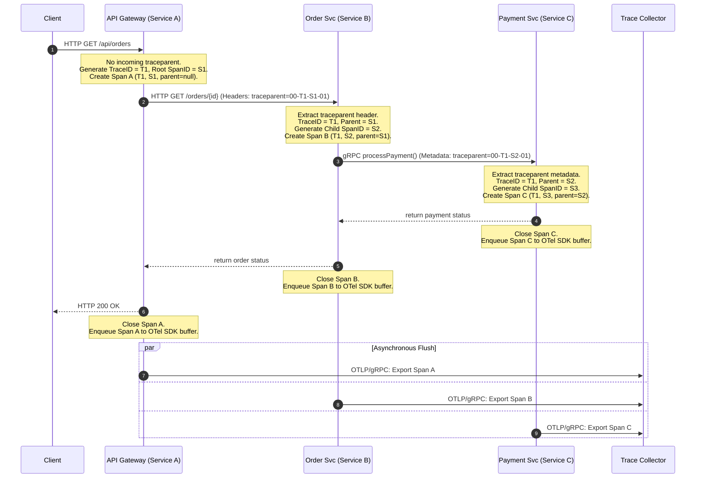
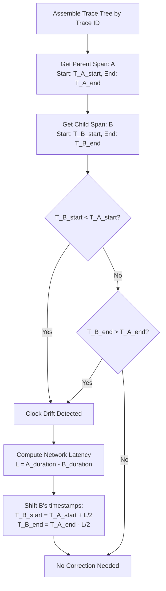

# Case Study: Distributed Tracing System (System Design)

## Quick Summary (TL;DR)
- **Goal**: Design a system (like Jaeger, Zipkin, or Datadog APM) that collects, stores, and queries traces across thousands of microservices — letting engineers debug latency, failures, and dependencies across a distributed architecture.
- **Scale**: 10K microservice instances, each emitting ~500 spans/sec = **5M spans/sec** ingestion. Store 7 days of traces. Query any trace by ID in < 100ms, search by service/tag in < 2 seconds.
- **Key Decisions**:
  - Use a **Collector tier** that decouples services from storage — services fire-and-forget spans over UDP/gRPC; collectors batch, sample, and write.
  - Use **tail-based sampling** via a consistent hash ring — route spans of the same trace to the same collector node to make an evaluation *after* seeing the full trace lifecycle (100% error/slow trace retention).
  - Use **Kafka** as a buffer between collectors and storage — absorbs burst traffic and enables fan-out to multiple backends.
  - Use a **columnar time-series store (ClickHouse)** or **Object Storage (S3) + Index** to support massive write-heavy, time-bounded, append-only span payloads cost-effectively.
  - Implement a client-side/query-side **Clock Drift Correction Algorithm** to handle NTP synchronization drift across distributed servers.

---

## 🤓 Noob Jargon Buster

* **Trace**: The end-to-end journey of a single request across multiple services. Identified by a globally unique **Trace ID**.
* **Span**: A single unit of work within a trace (e.g., one HTTP call, one DB query). Has a start time, duration, service name, operation name, status, and tags.
* **Parent Span ID**: The span that initiated the current span. These parent-child links form a call graph (Directed Acyclic Graph).
* **Context Propagation**: Passing the Trace ID and Parent Span ID from one service to the next via headers (e.g., W3C `traceparent`).
* **Head-Based Sampling**: Decision made at the entry-point service whether to record the trace. Simple but blind to downstream errors.
* **Tail-Based Sampling**: Decision made after all spans of a trace are collected. Ensures 100% of errors/slow traces are saved.
* **W3C traceparent**: The standard header format for distributed tracing propagation: `00-{trace_id}-{span_id}-{trace_flags}`.
* **Clock Drift**: The time discrepancy between physical servers due to NTP synchronization intervals. Causes child spans to falsely appear to start before parent spans.

---

## 1. Requirements & Scope

### Functional
1. **Span Ingestion**: Accept spans from services via OTLP (gRPC/HTTP). Exporting spans must be asynchronous and non-blocking.
2. **Trace Assembly**: Reconstruct full trace trees from individual spans arriving out of order.
3. **Trace Lookup by ID**: Given a Trace ID, return the complete trace with all spans in < 100ms.
4. **Search**: Find traces by service name, operation, tags, duration range, error status, and time window in < 2 seconds.
5. **Service Dependency Graph**: Auto-discover and visualize which services call which, including call volume and error rates.
6. **Retention**: Store traces for 7 days, then automatically purge.

### Non-Functional
- **Zero Impact on Application**: Span export must add < 1ms latency and < 2% CPU overhead to instrumented services.
- **High Write Throughput**: Handle 5M spans/sec sustained, with 3x burst headroom.
- **Availability Over Consistency**: Losing tracing data is acceptable; blocking or crashing a business service is not (Fail Open design).
- **Cost-Efficient Storage**: Columnar compression and object-storage integration to minimize hardware costs.

---

## 2. Scale Estimation (The Math)

### Throughput
- **Services**: 10K instances across 500 microservices.
- **Span Rate**: ~500 spans/sec per instance.
- **Raw Ingestion**: $10,000 \times 500 = 5,000,000 \text{ spans/sec}$.
- **After Tail-Based Sampling (keep 10% average)**: $500,000 \text{ spans/sec}$ stored.

### Storage
- **Span Size**: ~1 KB average after compression (raw is 2–3 KB with tags, logs, and metadata).
- **Daily Storage Volume**:
  $$500,000 \text{ spans/sec} \times 86,400 \text{ sec/day} \times 1 \text{ KB} = 43.2 \text{ TB/day}$$
- **7-Day Retention**: $43.2 \times 7 \approx 302 \text{ TB}$ raw disk storage.
- **With Columnar Compression (e.g., ClickHouse ZSTD)**: ~30–60 TB actual disk space.

### Memory
- **Tail-Based Sampling Buffer**: Hold incomplete traces for up to 30 seconds.
  $$5,000,000 \text{ spans/sec} \times 30 \text{ sec} = 150\text{M spans}$$
  At 0.5 KB per buffered span metadata (excluding verbose logs): **75 GB** buffer memory, distributed across the collector cluster.
- **Trace ID Index Cache**: Recent 1 hour of trace-to-storage mapping:
  $$500,000 \text{ spans/sec} \times 3,600 \text{ sec} \times 50 \text{ bytes (ID + partition pointer)} \approx 90 \text{ GB}$$ sharded across Redis.

---

## 3. System API Design

### A. Ingest Spans (Service SDK → Collector)
- **Protocol**: gRPC (OTLP - OpenTelemetry Protocol) or HTTP POST.
- **Endpoint**: `POST /v1/traces`
- **Request Payload**:
  ```json
  {
    "resource_spans": [{
      "resource": {
        "attributes": [
          { "key": "service.name", "value": "order-service" },
          { "key": "deployment.environment", "value": "production" }
        ]
      },
      "scope_spans": [{
        "spans": [{
          "trace_id": "4bf92f3577b34da6a3ce929d0e0e4736",
          "span_id": "00f067aa0ba902b7",
          "parent_span_id": "a1b2c3d4e5f60718",
          "name": "GET /api/orders/{id}",
          "kind": "SERVER",
          "start_time_unix_nano": 1756512000000000000,
          "end_time_unix_nano":   1756512000045000000,
          "status": { "code": "ERROR", "message": "payment timeout" },
          "attributes": [
            { "key": "http.method", "value": "GET" },
            { "key": "http.status_code", "value": 504 }
          ]
        }]
      }]
    }]
  }
  ```

---

## 4. High-Level Architecture

```mermaid
flowchart TD
    subgraph Services [Instrumented Application Cluster]
        SvcA[Service A + SDK]
        SvcB[Service B + SDK]
        SvcC[Service C + SDK]
    end

    subgraph Collectors [Stateless Ingestion & Route Layer]
        Router[OTLP Router / LB]
        Coll1[Collector Node 1]
        Coll2[Collector Node 2]
        Coll3[Collector Node 3]
    end

    subgraph Buffer [Tail-Based Sampling Buffers]
        TS1[Sampling Node 1\nTrace ID Hash Ring]
        TS2[Sampling Node 2\nTrace ID Hash Ring]
    end

    subgraph Streaming [Message Queue Buffer]
        Kafka{Kafka Event Bus\ntopic: sampled-spans}
    end

    subgraph IndexQuery [Index & Analytical Engines]
        IndexWriter[Index Builder / Span Consumer]
        Flink[Flink Dependency Aggregator]
    end

    subgraph Storage [Datastore Layer]
        ClickHouse[(ClickHouse\nSpan Store)]
        ES[(Elasticsearch\nIndex Store)]
        GraphDB[(PostgreSQL / Neo4j\nDependency Graph)]
    end

    subgraph QueryLayer [Query & UI]
        QS[Query Service]
        UI[UI / Grafana / Jaeger UI]
    end

    SvcA & SvcB & SvcC -->|OTLP gRPC/UDP| Router
    Router --> Coll1 & Coll2 & Coll3
    
    Coll1 & Coll2 & Coll3 -->|Consistent Hash by TraceID| TS1 & TS2
    
    TS1 & TS2 -->|Keep Decision (100% Errors/Slow, 1% Normal)| Kafka
    
    Kafka --> IndexWriter
    Kafka --> Flink
    
    IndexWriter -->|Write Spans| ClickHouse
    IndexWriter -->|Write Inverted Index| ES
    
    Flink -->|Write Edges| GraphDB
    
    UI --> QS
    QS -->|Trace-by-ID Lookup| ClickHouse
    QS -->|Query Tag Index| ES
    QS -->|Read Service Map| GraphDB
```

---

## 5. Deep Dive: Core Components

### 5.1 Context Propagation & SDK Flow
Context propagation ensures that parent-child relationships are preserved across thread boundaries and network barriers.



#### W3C Trace Context Specification
Services propagate context using standard headers:
- `traceparent`: `00-4bf92f3577b34da6a3ce929d0e0e4736-00f067aa0ba902b7-01`
  - `00`: Protocol version.
  - `4bf92f3577b34da6a3ce929d0e0e4736`: Trace ID (16 bytes, 32 hex characters).
  - `00f067aa0ba902b7`: Parent Span ID (8 bytes, 16 hex characters).
  - `01`: Trace flags (1 byte. `01` means sampled, `00` means not sampled).
- `tracestate`: Carries vendor-specific routing metadata (e.g., `congo=t61rcWkgMzE`).

---

### 5.2 Collector Routing & Tail-Based Sampling Buffers
To execute tail-based sampling, the system must buffer all spans of a trace in memory to inspect them collectively.

1. **Consistent Hashing by Trace ID**: Front-line collectors route incoming spans to a specific sampling node using consistent hashing of the `trace_id`. This guarantees all spans belonging to trace `T1` land on the same physical buffer node.
2. **Buffer Management & Eviction Policies**:
   - **Happy Path (Root Close)**: When a node receives a root span (a span with no `parent_span_id`) that has ended, it waits 2-5 seconds (to allow late downstream spans to arrive) and then flushes.
   - **Incomplete / Orphaned Eviction**: If the root span never arrives (due to package drops or worker crashes), the trace is flushed after a hard limit of 30 seconds since the first span was received.
   - **Memory Pressure Action**: If heap memory utilization crosses 85%, the node triggers emergency eviction of the oldest traces via a fallback head-based sampling evaluation (keeping 1% randomly but retaining any traces containing explicit `error=true` flags).

---

### 5.3 Clock Drift Correction Algorithm
In a distributed system, clocks drift across servers due to NTP synchronization intervals. This causes child spans to appear to start before their parent span.



#### Mathematical Correction
Let $A$ be the parent span and $B$ be the child span.
- Let parent start/end be $T_{A\_start}$ and $T_{A\_end}$, with duration $d_A = T_{A\_end} - T_{A\_start}$.
- Let child start/end be $T_{B\_start}$ and $T_{B\_end}$, with duration $d_B = T_{B\_end} - T_{B\_start}$.

If $T_{B\_start} < T_{A\_start}$ or $T_{B\_end} > T_{A\_end}$:
1. Assume network transit latency is symmetric:
   $$\text{latency} = \frac{d_A - d_B}{2}$$
2. The expected start time for child $B$ is:
   $$T_{B\_expected\_start} = T_{A\_start} + \text{latency}$$
3. Compute skew offset $\Delta$:
   $$\Delta = T_{B\_start} - T_{B\_expected\_start}$$
4. Shift the timestamps of $B$ (and recursively adjust all of $B$'s descendant spans):
   $$T_{B\_start\_adjusted} = T_{B\_start} - \Delta$$
   $$T_{B\_end\_adjusted} = T_{B\_end} - \Delta$$

---

## 6. Database Design

### A. ClickHouse (Span Store - Optimized Columnar Time-Series)
ClickHouse stores the raw span payloads. Columnar layout permits $10\text{x}$ compression on repetitive string fields (like service names, endpoints).

```sql
CREATE TABLE spans (
    trace_id        FixedString(16),
    span_id         FixedString(8),
    parent_span_id  FixedString(8),
    service_name    LowCardinality(String),
    operation_name  LowCardinality(String),
    start_time      DateTime64(9) CODEC(DoubleDelta, LZ4), -- nanosecond precision
    duration_ns     UInt64 CODEC(T64, ZSTD),
    status_code     Enum8('OK'=0, 'ERROR'=1, 'UNSET'=2),
    attributes      Map(String, String),                   -- Key-value tags
    logs            String,                                -- JSON list of span logs
    
    -- Inverted indexes for fast search optimization
    INDEX idx_service service_name TYPE set(0) GRANULARITY 1,
    INDEX idx_duration duration_ns TYPE minmax GRANULARITY 1,
    INDEX idx_status status_code TYPE set(0) GRANULARITY 1
) ENGINE = MergeTree()
PARTITION BY toDate(start_time)
ORDER BY (service_name, operation_name, start_time, trace_id)
TTL start_time + INTERVAL 7 DAY;
```

### B. Elasticsearch (Index Store - Search by Tag)
ClickHouse Map scans can be slow across multiple TBs. We write highly-searched tags to Elasticsearch to act as an index.

```json
{
  "mappings": {
    "properties": {
      "trace_id": { "type": "keyword" },
      "service_name": { "type": "keyword" },
      "operation_name": { "type": "keyword" },
      "start_time": { "type": "date" },
      "duration_ns": { "type": "long" },
      "status_code": { "type": "keyword" },
      "tags": {
        "type": "nested",
        "properties": {
          "key": { "type": "keyword" },
          "value": { "type": "keyword" }
        }
      }
    }
  }
}
```

---

## 7. Scaling, Reliability, & Resiliency

### 7.1 Real-Time Service Dependency Graph Discovery
The call graph is aggregated asynchronously from raw spans using a Flink stream processing pipeline.

```
Incoming Spans (from Kafka)
    │
    ▼
[Flink Tumbling Window: 1 Minute] ── Group by 'trace_id'
    │
    ▼
[Tree Matching] ── Find parent span vs child span relationships
    │
    ▼
Generate dependency edge: (parent_service -> child_service, count, error_count)
    │
    ▼
Write/Merge to Graph Database (PostgreSQL / Neo4j)
```

By grouping by `trace_id` in 1-minute windows, Flink joins parent and child span records locally and flushes simple edge count updates (e.g., `order-service -> payment-service: 450 calls, 2 errors`) to the graph store.

### 7.2 Reliability & Fault Tolerance
- **Fail Open Strategy**: The SDK uses bounded queues. If the memory queue fills up (because collectors are unreachable), new spans are dropped. Application runtime availability is prioritized over observability.
- **Kafka Buffer Cushion**: Kafka keeps trace data for 1 hour. If the storage layer (ClickHouse/Elasticsearch) experiences an outage, Kafka acts as a write buffer, preventing data loss.
- **Stateless Collectors**: Load balancer distributes traffic. If a collector node crashes, the SDK detects the socket drop, re-routes OTLP traffic to another node, and the Hash Ring redistributes trace aggregation.

---

## 8. End-to-End Trace Lifecycle

```
Timeline:

0ms    User triggers call. API Gateway creates trace_id=T1, span_id=A. Propagates 'traceparent' header downstream.
2ms    Order Svc receives request, parses header, creates child span B (parent=A).
15ms   Order Svc calls Payment Svc via gRPC (propagates traceparent via gRPC metadata), creates child span C (parent=B).
50ms   All spans close. OTel SDKs batch spans in-memory.
5000ms SDKs flush batches to Collector Load Balancer via gRPC.
5002ms Collectors consistent-hash Trace ID 'T1' and route spans to Sampling Node #1.
5005ms Sampling Node #1 groups spans A, B, C. Checks rules: Span C has error=true. Keeps 100% of trace. Writes to Kafka.
5010ms Kafka consumers write spans to ClickHouse and update the Elasticsearch tag index.
5015ms Flink joins parent-child spans, incrementing 'order-service -> payment-service' edge counts.
6000ms An engineer queries trace 'T1' in the UI. 
       Query service retrieves spans from ClickHouse, corrects clock drift, assembles the DAG tree, and displays the waterfall chart.
```

---

## 9. Common Traps & Pitfalls

| Trap | Why it fails | Correct approach |
|------|---------------|-----------------|
| **Synchronous SDK exporting** | Spans are exported on the request thread, adding network overhead to business operations | Buffer spans in memory, export asynchronously in batches |
| **Relational databases for span store** | Write volume (5M spans/sec) overwhelms RDBMS indexes, causing write saturation | Use LSM-Tree / columnar stores like ClickHouse or Elasticsearch |
| **Simple Head-Based Sampling only** | Fails to capture root causes since 99% of downstream transaction failures are randomly dropped | Implement Tail-Based Sampling to check traces after completion |
| **Ignoring Clock Drift** | Distributed NTP delays show child tasks starting before parent requests, rendering trees unreadable | Run a Query-Side Clock Drift Correction Algorithm using symmetric network latency calculation |
| **Full database scans for tag search** | Multi-TB scans searching arbitrary tags block analytical DB threads | Index high-value search tags in Elasticsearch or use bloom filters in block files |
