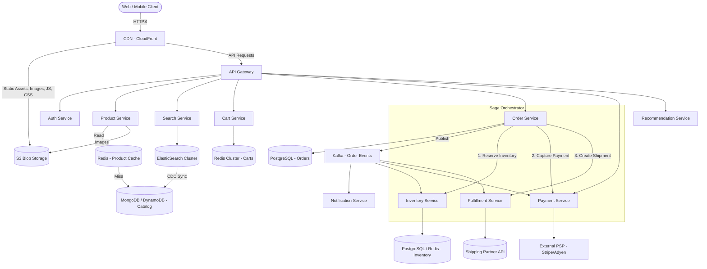
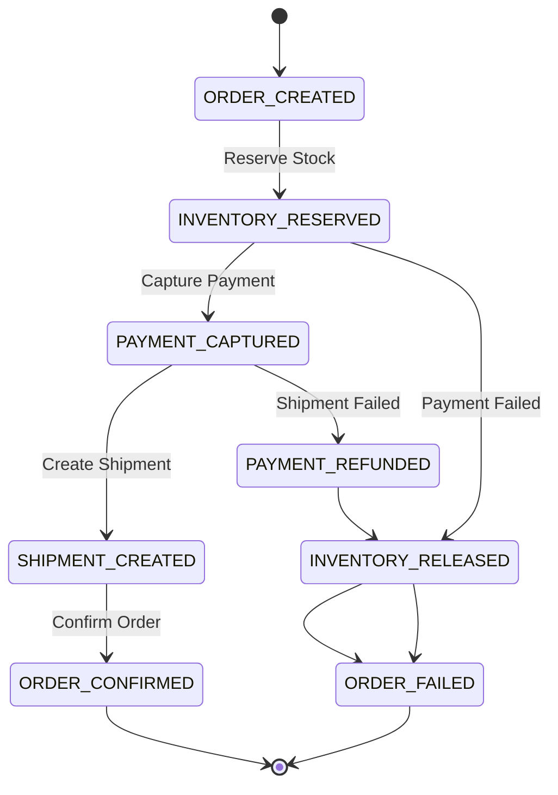

# Case Study: E-Commerce Platform (Amazon-Scale System Design)

## Quick Summary (TL;DR)
- **Goal**: Design an Amazon-scale e-commerce platform that handles product browsing, search, cart management, checkout, payment processing, and order fulfillment — with extreme concurrency during flash sales.
- **Scale**: 500M registered users, 50M DAU, 5M orders/day (~60 TPS average, ~3000 TPS peak during flash sales). Product catalog of 500M+ SKUs. Storage over 5 years is ~50 TB across all services.
- **Key Decisions**:
  - Use a **polyglot persistence** strategy — PostgreSQL for orders and payments (ACID guarantees), DynamoDB/MongoDB for product catalog (flexible schema, horizontal scale), ElasticSearch for full-text product search, Redis for cart sessions and inventory counters.
  - Handle flash sale concurrency with **optimistic locking + queue-based checkout** — a Kafka-backed order queue serializes checkout requests per SKU, preventing overselling without database-level row locking bottlenecks.
  - Implement an **event-driven order pipeline** using Saga orchestration — coordinates inventory reservation, payment capture, and fulfillment as a distributed transaction with compensating rollbacks.
  - Use **CQRS (Command Query Responsibility Segregation)** — separate write models (order placement, inventory updates) from read models (product browsing, search) to independently scale read-heavy and write-heavy paths.

---

## 🤓 Noob Jargon Buster

* **SKU (Stock Keeping Unit)**: A unique identifier for each distinct product variant (e.g., "Nike Air Max, Size 10, Black" is one SKU).
* **Optimistic Locking**: Instead of locking a database row before updating, you read a version number, perform your update, and check if the version changed. If it did, someone else modified the row — retry. Avoids holding locks during network calls.
* **CQRS (Command Query Responsibility Segregation)**: Splitting the system into a write side (commands: place order, update stock) and a read side (queries: browse products, search). Each side has its own optimized data store.
* **Saga Pattern**: A sequence of local transactions across microservices. If step 3 fails, compensating transactions undo steps 2 and 1. No distributed locks required.
* **Inventory Reservation**: Temporarily holding stock for a user during checkout (e.g., 10-minute hold). If payment fails or times out, the reservation is released back to available stock.
* **Flash Sale**: A time-limited promotion where thousands of users attempt to buy a limited-stock item simultaneously (e.g., 100 units, 50,000 concurrent requests).
* **CDC (Change Data Capture)**: Streaming database row-level changes (inserts, updates, deletes) to downstream systems in real-time via tools like Debezium.

---

## 1. Requirements & Scope

### Functional
1. **Product Catalog**: Browse, filter, and view detailed product pages with images, descriptions, pricing, and reviews.
2. **Search**: Full-text product search with filters (category, price range, brand, ratings), autocomplete, and spell correction.
3. **Shopping Cart**: Add/remove items, persist cart across sessions and devices, apply promo codes.
4. **Checkout & Payment**: Address selection, shipping method, payment via credit card / wallet / COD, order confirmation.
5. **Order Processing**: Order placement, inventory deduction, payment capture, shipment tracking, cancellation, and refunds.
6. **Recommendations**: "Customers who bought X also bought Y", personalized homepage feeds.
7. **Seller Management**: Sellers list products, manage inventory, view sales dashboards.

### Non-Functional
- **High Availability**: 99.99% uptime — the storefront must never go down (AP system for reads).
- **Low Latency**: Product page loads in < 200ms, search results in < 100ms, checkout in < 2 seconds.
- **Strong Consistency for Inventory**: Stock counts must be accurate — no overselling. Inventory is a CP subsystem.
- **Scalability**: Handle 10x traffic spikes during flash sales (Diwali, Prime Day, Black Friday).
- **Durability**: Zero tolerance for lost orders or payment records.

---

## 2. Scale Estimation (The Math)

### Users & Traffic
- **Registered Users**: 500 Million.
- **Daily Active Users (DAU)**: 50 Million.
- **Product Views/Day**: 500 Million (10 pages/user average).
- **Search Queries/Day**: 200 Million.

### Orders & Throughput
- **Orders/Day**: 5 Million.
- **Average Order TPS**: $\frac{5,000,000}{86,400} \approx 58 \text{ TPS}$.
- **Peak Order TPS** (flash sale): $\approx 3,000 \text{ TPS}$ (50x spike).
- **Cart Updates/Day**: 50 Million (add/remove/update quantity).

### Storage (5-Year Plan)

| Data Store | Record Size | Volume (5yr) | Storage |
|---|---|---|---|
| Product Catalog (NoSQL) | 5 KB/product | 500M products | ~2.5 TB |
| Product Images (S3) | 2 MB/product (5 images) | 500M products | ~1 PB (S3) |
| Orders (PostgreSQL) | 1 KB/order | 9.1B orders | ~9 TB |
| Order Line Items | 200 bytes/item | 27B items (~3/order) | ~5.4 TB |
| Search Index (ES) | 500 bytes/product | 500M products | ~250 GB |
| User Sessions/Cart (Redis) | 2 KB/user | 50M DAU | ~100 GB RAM |

### Caching (Redis)
- **Hot Product Pages**: Cache top 1% of products (5M products x 5 KB) = ~25 GB Redis.
- **Cart Sessions**: 50M active carts x 2 KB = ~100 GB Redis cluster.
- **Inventory Counters**: 50M active SKUs x 16 bytes = ~800 MB Redis.

---

## 3. System API Design

### A. Product Catalog
```
GET  /v1/products/{product_id}
GET  /v1/products?category=electronics&brand=apple&sort=price_asc&page=2&size=20
```

### B. Search
```
GET  /v1/search?q=wireless+headphones&category=electronics&price_min=50&price_max=200&page=1
```
Response includes: `results[]`, `total_count`, `facets{}` (brand counts, rating distribution), `suggestions[]`.

### C. Shopping Cart
```
GET    /v1/cart
POST   /v1/cart/items         { "product_id": "...", "quantity": 2 }
PATCH  /v1/cart/items/{item_id}  { "quantity": 5 }
DELETE /v1/cart/items/{item_id}
POST   /v1/cart/promo          { "code": "SAVE20" }
```

### D. Checkout & Orders
```
POST   /v1/orders/checkout     { "cart_id": "...", "address_id": "...", "payment_method": "...", "idempotency_key": "..." }
GET    /v1/orders/{order_id}
POST   /v1/orders/{order_id}/cancel
```

---

## 4. High-Level Architecture



---

## 5. Why Choose This? (Defending Your Architecture)

### 🧭 Why polyglot persistence instead of a single database?

* **Answer**: "Each service has fundamentally different data access patterns. The product catalog has a flexible, nested schema (variants, attributes, images) with heavy reads and rare writes — MongoDB/DynamoDB handles this with document-level flexibility and horizontal sharding. Orders require strict ACID transactions (inventory deduction + payment capture must be atomic within a service boundary) — PostgreSQL with serializable isolation guarantees this. Search requires inverted indexes with fuzzy matching, faceted aggregation, and sub-100ms latency across 500M documents — ElasticSearch is purpose-built for this. Using a single database for all three would force compromises on schema flexibility, consistency, or query performance."

### 🧭 Why CQRS for the product catalog?

* **Answer**: "Product reads outnumber writes by 1000:1. Sellers update product details a few times per day, but millions of users browse those products every second. CQRS lets us scale the read path independently — we can have 50 read replicas or cache layers without affecting the write path. The write model publishes change events via CDC (Debezium) to ElasticSearch and Redis, keeping read models eventually consistent with a lag of < 500ms."

### 🧭 Why a Saga orchestrator over distributed transactions (2PC)?

* **Answer**: "Two-phase commit (2PC) requires all participants to hold locks until the coordinator commits. In our checkout flow — inventory, payment, and fulfillment are separate services with different databases. Holding locks across three databases during a 2-second payment gateway call would destroy throughput. The Saga pattern uses local transactions with compensating actions: if payment fails after inventory reservation, we publish an `InventoryReleased` event. Each service is autonomous, and the orchestrator simply tracks the state machine."

### 🧭 Why Redis for shopping carts instead of a database?

* **Answer**: "Cart operations are extremely high-frequency (50M updates/day) and latency-sensitive (users expect instant feedback). Carts are ephemeral — 80% of carts are abandoned within 24 hours. Redis gives us sub-millisecond reads/writes with TTL-based expiration. For logged-in users, we asynchronously persist the cart to DynamoDB for cross-device sync, but Redis is always the primary read source. If Redis loses a cart, the user simply re-adds items — the cost of occasional data loss is far lower than the cost of database round-trips for every cart click."

---

## 6. Deep Dives

### A. Product Catalog Service

The catalog stores 500M+ products with highly variable schemas (a laptop has "RAM, CPU, Screen Size" while a shirt has "Size, Color, Material").

**Schema Design (MongoDB)**:
```json
{
  "_id": "prod_abc123",
  "title": "Sony WH-1000XM5 Headphones",
  "seller_id": "seller_789",
  "category_path": ["Electronics", "Audio", "Headphones"],
  "brand": "Sony",
  "price": { "amount": 34999, "currency": "USD" },
  "variants": [
    { "sku": "SKU_BLK", "color": "Black", "stock_status": "IN_STOCK" },
    { "sku": "SKU_SLV", "color": "Silver", "stock_status": "LOW_STOCK" }
  ],
  "attributes": { "noise_cancelling": true, "battery_hours": 30, "weight_grams": 250 },
  "images": ["s3://bucket/prod_abc123/1.jpg", "s3://bucket/prod_abc123/2.jpg"],
  "rating": { "avg": 4.6, "count": 12450 },
  "version": 42,
  "updated_at": "2026-05-30T10:00:00Z"
}
```

**Why MongoDB/DynamoDB over PostgreSQL?**
- Product attributes differ wildly across categories. A relational EAV (Entity-Attribute-Value) model creates expensive joins. A document model stores everything in a single read — no joins, no N+1 queries.
- Horizontal sharding by `category_path[0]` (top-level category) distributes load evenly.

**CDC Pipeline to ElasticSearch**:
```
MongoDB → Debezium (Change Streams) → Kafka → ES Indexer Consumer → ElasticSearch
```
- Lag: < 500ms from catalog write to search index update.
- The ES index stores a denormalized, search-optimized projection (title, brand, price, rating, category) — not the full document.

---

### B. Inventory Management (Stock Count Consistency)

Inventory is the hardest consistency problem in e-commerce. The core challenge: 100 users click "Buy" on an item with 1 unit left. Exactly 1 must succeed; 99 must fail. No overselling.

**Approach: Redis Atomic Counter + PostgreSQL Ledger**

```
                    ┌──────────────────────────────┐
   Checkout ──►     │  Redis: DECR inventory:{sku}  │
   Request          │  Returns remaining count       │
                    └──────────┬───────────────────┘
                               │
                    ┌──────────▼───────────────────┐
                    │  remaining >= 0?              │
                    │  YES → Reserve confirmed      │
                    │  NO  → INCR back, reject 409  │
                    └──────────┬───────────────────┘
                               │
                    ┌──────────▼───────────────────┐
                    │  Async: Write reservation to  │
                    │  PostgreSQL inventory_ledger   │
                    └──────────────────────────────┘
```

**Why Redis `DECR` instead of database `SELECT ... FOR UPDATE`?**
- `SELECT ... FOR UPDATE` acquires a row-level lock. Under 3,000 TPS (flash sale), all requests serialize on a single row — massive lock contention, query timeouts, connection pool exhaustion.
- Redis `DECR` is atomic and single-threaded — it naturally serializes operations at ~100,000 ops/sec with sub-millisecond latency. No locks needed.
- If `DECR` returns a negative number, the counter went below zero. Immediately `INCR` it back and reject the request.

**PostgreSQL Inventory Ledger (Source of Truth)**:
```sql
CREATE TABLE inventory_ledger (
    entry_id      BIGSERIAL PRIMARY KEY,
    sku           VARCHAR(64) NOT NULL,
    event_type    VARCHAR(20) NOT NULL,  -- 'RECEIVED', 'RESERVED', 'SOLD', 'RETURNED', 'CANCELLED'
    quantity      INTEGER NOT NULL,      -- positive = stock in, negative = stock out
    order_id      UUID,
    created_at    TIMESTAMP NOT NULL DEFAULT NOW()
);

-- Current stock = SUM(quantity) WHERE sku = ?
CREATE INDEX idx_inv_sku ON inventory_ledger (sku, created_at);
```

- The ledger is append-only (no UPDATEs). Current stock is derived by summing all entries for a SKU.
- A periodic reconciliation job compares `SUM(quantity)` in PostgreSQL against the Redis counter. Discrepancies trigger alerts.

**Reservation Expiry**:
- Reservations have a 10-minute TTL. A scheduled job (or Kafka delayed message) releases expired reservations by publishing `CANCELLED` events, which `INCR` the Redis counter back.

---

### C. Shopping Cart (Session vs. Persistent)

The cart must work for both guest users (no login) and authenticated users (cross-device sync).

**Two-Tier Cart Architecture**:

| Scenario | Storage | TTL | Sync |
|---|---|---|---|
| Guest user | Redis only (keyed by session cookie) | 7 days | None |
| Logged-in user | Redis (primary) + DynamoDB (backup) | 30 days | Async write-behind |
| Login event | Merge guest cart into user cart | — | Cart merge logic |

**Redis Cart Structure** (Hash):
```
HSET cart:{user_id} item:{sku} '{"quantity":2,"price":3499,"added_at":"..."}'
EXPIRE cart:{user_id} 2592000   # 30-day TTL
```

**Cart Merge on Login**:
When a guest adds items, then logs in, the system merges the guest cart into the persistent cart:
1. Read guest cart from Redis (keyed by session).
2. Read user cart from Redis (keyed by user_id).
3. For conflicting SKUs: keep the higher quantity (user intent = they want more).
4. Delete the guest cart.

---

### D. Order Processing Pipeline (Saga Orchestration)

The checkout flow spans 4 services. A Saga orchestrator (implemented as a state machine) coordinates the distributed transaction:



**State Machine Table (PostgreSQL)**:
```sql
CREATE TABLE order_saga (
    order_id       UUID PRIMARY KEY,
    state          VARCHAR(30) NOT NULL,   -- 'ORDER_CREATED', 'INVENTORY_RESERVED', etc.
    retry_count    INT DEFAULT 0,
    last_error     TEXT,
    created_at     TIMESTAMP NOT NULL DEFAULT NOW(),
    updated_at     TIMESTAMP NOT NULL DEFAULT NOW()
);
```

**Compensating Actions**:

| Step | Forward Action | Compensating Action |
|---|---|---|
| 1. Inventory | `DECR` Redis counter, write `RESERVED` ledger entry | `INCR` Redis counter, write `CANCELLED` ledger entry |
| 2. Payment | Capture via PSP (Stripe `charges.create`) | Refund via PSP (Stripe `refunds.create`) |
| 3. Shipment | Create shipment with carrier API | Cancel shipment with carrier API |

**Idempotency**: Every step uses an idempotency key (`order_id + step_name`). Retries are safe because each service checks if the action was already completed before executing.

---

### E. Payment Integration

Payment follows the same patterns as the dedicated [Payment System design](payment-system.md):

1. **Tokenization**: Credit card numbers are never stored. The client-side SDK (Stripe.js) tokenizes the card and sends a `payment_method_id`.
2. **Two-Phase Payment**:
   - **Authorize** during checkout (hold funds on the card).
   - **Capture** after shipment confirmation (actually charge the card).
   - This protects against charging for items that cannot be fulfilled.
3. **Idempotency Keys**: Every payment request includes a UUID idempotency key. The PSP deduplicates retries.
4. **Webhook Processing**: PSP sends async status updates (success, failure, dispute) via webhooks. These are published to Kafka and processed by the Payment Service.

---

### F. Search & Recommendations

**Search Architecture**:
```
User Query → API Gateway → Search Service → ElasticSearch
                                                ├── Full-text match (BM25)
                                                ├── Fuzzy matching (Levenshtein distance ≤ 2)
                                                ├── Faceted aggregation (brand, price range, rating)
                                                └── Boosted ranking (sales velocity, rating, sponsored)
```

**ElasticSearch Index Mapping** (key fields):
```json
{
  "title":    { "type": "text", "analyzer": "standard" },
  "brand":    { "type": "keyword" },
  "category": { "type": "keyword" },
  "price":    { "type": "integer" },
  "rating":   { "type": "float" },
  "sales_30d": { "type": "integer" }
}
```

**Recommendation Engine**:
- **Collaborative Filtering**: "Users who bought X also bought Y" — precomputed offline using Spark on purchase history, stored in Redis as sorted sets per product.
- **Content-Based Filtering**: Similar products by attribute vectors (category, brand, price range) — computed using embedding models, served from a vector database (Pinecone / pgvector).
- **Real-Time Personalization**: User's browsing session is tracked. A Flink streaming job updates a short-term interest profile in Redis, which biases search ranking and homepage feed.

---

## 7. Handling Flash Sales / High-Concurrency Checkout

Flash sales are the ultimate stress test: 50,000 users attempting to buy 100 units of a single product within seconds.

### The Problem
- **Naive approach**: `SELECT stock FROM products WHERE sku = ? FOR UPDATE` serializes all 50,000 requests on a single row. Result: 49,900 requests wait in a lock queue, timeouts cascade, database connections exhaust, the entire platform degrades.

### The Solution: Queue-Based Checkout

```
                50,000 Users
                     │
              ┌──────▼──────┐
              │  API Gateway  │
              │  (Rate Limit) │
              └──────┬──────┘
                     │
              ┌──────▼──────────────────┐
              │  Redis DECR inventory    │
              │  Accepts first 100,     │
              │  rejects rest instantly  │
              └──────┬──────────────────┘
                     │ (100 requests)
              ┌──────▼──────────────────┐
              │  Kafka: flash_checkout   │
              │  Partition by SKU        │
              └──────┬──────────────────┘
                     │
              ┌──────▼──────────────────┐
              │  Order Consumer          │
              │  (Single consumer/SKU)   │
              │  Sequential processing   │
              └──────────────────────────┘
```

**Step-by-step**:
1. **Rate Limiting**: API Gateway caps requests to the flash sale endpoint at 10,000/sec. Excess requests get `429 Too Many Requests`.
2. **Redis Atomic Filter**: `DECR flash:{sku}` filters 50,000 requests down to 100. The 49,900 users whose `DECR` returns < 0 get an instant "Sold Out" response (< 5ms). No database touched.
3. **Kafka Serialization**: The 100 winning requests are published to a Kafka topic partitioned by SKU. A single consumer processes them sequentially — no concurrency issues.
4. **Async Order Processing**: Each of the 100 orders goes through the Saga pipeline (inventory ledger, payment, fulfillment). Users see "Order Processing..." and receive confirmation via push notification / email.

### Optimistic Locking (Alternative for Non-Flash Scenarios)
For regular checkout (not flash sales), PostgreSQL optimistic locking suffices:
```sql
UPDATE inventory
SET    stock = stock - 1, version = version + 1
WHERE  sku = 'SKU_ABC' AND stock > 0 AND version = 42;
-- If affected_rows = 0 → concurrent modification, retry with fresh version
```
This avoids `SELECT ... FOR UPDATE` pessimistic locks while still preventing overselling.

---

## 8. Database Choices Summary

| Service | Database | Justification |
|---|---|---|
| **Product Catalog** | MongoDB / DynamoDB | Flexible schema for variable product attributes, horizontal sharding, high read throughput |
| **Orders** | PostgreSQL | ACID transactions, complex queries (joins with line items, payments), strong consistency |
| **Inventory Ledger** | PostgreSQL + Redis | Append-only ledger for audit trail (PG), atomic counters for real-time stock (Redis) |
| **Shopping Cart** | Redis + DynamoDB | Sub-ms latency for active carts (Redis), durable backup for logged-in users (DynamoDB) |
| **Search** | ElasticSearch | Inverted index, BM25 scoring, faceted aggregation, fuzzy matching |
| **User Sessions** | Redis | Ephemeral, high-throughput, TTL-based expiration |
| **Recommendations** | Redis (precomputed) + Vector DB | Sorted sets for collaborative filtering, vector similarity for content-based |
| **Analytics / Reporting** | ClickHouse / Redshift | Columnar storage for aggregation queries (revenue by category, daily GMV) |

---

## 9. Common Traps & Mitigations

1. **Overselling during flash sales**: Relying on database locks for inventory under extreme concurrency.
   - *Mitigation*: Use Redis atomic `DECR` as the first gate. Only requests that pass the Redis filter reach the database. Reconcile Redis counters with the PostgreSQL ledger periodically.

2. **Cart data loss**: Storing carts only in Redis without backup.
   - *Mitigation*: For logged-in users, asynchronously persist cart state to DynamoDB. On Redis failure, rebuild from DynamoDB. For guest users, accept the risk — cart loss is tolerable for unauthenticated sessions.

3. **Search index drift**: ElasticSearch index becomes stale when CDC pipeline lags or fails.
   - *Mitigation*: Monitor CDC lag via Kafka consumer group lag metrics. Run a nightly full re-index job as a safety net. Alert if lag exceeds 5 seconds.

4. **Saga state stuck in intermediate state**: The orchestrator crashes after reserving inventory but before capturing payment.
   - *Mitigation*: The saga state machine is persisted in PostgreSQL. On restart, the orchestrator queries all sagas in non-terminal states and resumes from the last completed step. Compensating actions have TTL-based deadlines.

5. **Hot partition in product catalog**: A viral product page (e.g., new iPhone launch) overwhelms a single MongoDB shard.
   - *Mitigation*: Cache hot product pages aggressively in Redis and CDN (TTL: 30 seconds). Serve stale-while-revalidate for product details. Use read replicas for MongoDB.

6. **Payment double-capture**: Network timeout causes the Order Service to retry payment capture, charging the customer twice.
   - *Mitigation*: Every PSP call uses an idempotency key (`order_id`). The PSP deduplicates retries server-side. The Order Service also checks saga state before retrying.

---

## Interview Angles

1. **"How do you prevent overselling during a flash sale?"** — "I use a two-layer defense. First, Redis `DECR` atomically filters 50,000 requests down to the available stock count in < 5ms — no database involved. The 'winners' are published to a Kafka topic partitioned by SKU, where a single consumer processes orders sequentially. The PostgreSQL inventory ledger serves as the source of truth, and a reconciliation job compares it against Redis counters every minute."

2. **"Why not use a single relational database for everything?"** — "The access patterns are fundamentally different. Product catalog needs schema flexibility (variable attributes per category) and 100:1 read-to-write ratio — MongoDB with read replicas handles this. Orders need ACID guarantees and complex joins (order + line items + payments) — PostgreSQL is ideal. Search needs inverted indexes with BM25 scoring and faceted aggregation — ElasticSearch is purpose-built. Forcing all three into PostgreSQL would mean EAV anti-patterns for catalog, poor full-text search, and inability to scale reads independently."

3. **"How does the shopping cart work across devices?"** — "For guest users, the cart lives in Redis keyed by a session cookie with a 7-day TTL — simple and fast. When the user logs in, the guest cart is merged into their persistent cart (Redis primary + DynamoDB backup). Cross-device sync happens because the logged-in cart is keyed by `user_id`, not session. On any device, the user sees the same cart. Redis is the primary read source for latency; DynamoDB is the durable fallback."

4. **"What happens if the payment succeeds but shipment creation fails?"** — "The Saga orchestrator detects the failure and executes compensating actions in reverse order: first it cancels the shipment (no-op if it never created), then issues a refund via the PSP, then releases the inventory reservation (INCR Redis counter + CANCELLED ledger entry). The saga state machine is persisted in PostgreSQL, so even if the orchestrator crashes mid-compensation, it resumes from the last completed step on restart."

5. **"How do you keep ElasticSearch in sync with the product catalog?"** — "We use CDC (Change Data Capture) via Debezium on MongoDB change streams. Every catalog write produces a Kafka event that an ES indexer consumer processes to update the search index. Typical lag is < 500ms. We monitor Kafka consumer group lag and alert if it exceeds 5 seconds. As a safety net, a nightly full re-index job rebuilds the entire ES index from MongoDB, catching any events that might have been lost."
