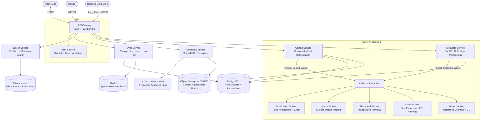

# Case Study: Cloud File Storage & Sync — Google Drive (System Design)

## Quick Summary (TL;DR)
- **Goal**: Design a cloud file storage system where users can upload, download, sync, share, and search files across devices — with seamless offline support and desktop client synchronization.
- **Scale**: 2B registered users, 500M DAU, 15M files uploaded/day, average file size 2 MB. Total storage in exabytes.
- **Key Decisions**:
  - Use **chunked, resumable uploads** with content-addressable storage (SHA-256 hashing) for deduplication — identical blocks are stored once across all users.
  - Use **block-level sync** (not file-level) — when a user edits a 100 MB file, only the changed 4 MB blocks are synced, not the entire file. Same approach Dropbox uses.
  - Keep **metadata service separate from blob storage** — metadata (file names, permissions, folder hierarchy) lives in a relational DB; raw file bytes live in object storage (S3/GCS).
  - Use **long polling + WebSocket notifications** for real-time sync — desktop clients maintain a long-poll connection and get notified the instant a file changes, then pull only the changed blocks.
  - Use a **CDN for frequently accessed files** — hot files (shared publicly, accessed often) are served from edge locations, reducing latency and origin load.

---

## Noob Jargon Buster

* **Chunked Upload**: Breaking a large file into fixed-size pieces (e.g., 4 MB blocks) and uploading each piece independently. If the network drops mid-upload, you resume from the last successful chunk instead of restarting the entire file.
* **Content-Addressable Storage (CAS)**: Storing blocks by the hash of their content (SHA-256) instead of by file name. Two identical blocks — even from different users — produce the same hash and are stored only once. This is deduplication.
* **Block-Level Sync**: Instead of re-uploading an entire file when it changes, the client computes which 4 MB blocks changed and uploads only those. A 100 MB file with one edited paragraph sends ~4 MB, not 100 MB.
* **Long Polling**: The client sends an HTTP request that the server holds open until there is new data (or a timeout, e.g., 60 seconds). Cheaper than WebSockets for infrequent updates like file sync notifications.
* **Consistent Hashing**: A technique for distributing blocks across storage nodes so that adding or removing a node only redistributes a small fraction of blocks, not all of them.
* **Object Storage (S3/GCS)**: Blob stores optimized for large, immutable objects. Cheap, durable (11 nines), infinitely scalable — but no partial updates (you replace the whole object). Perfect for file blocks.

---

## 1. Requirements & Scope

### Functional
1. **File Upload**: Users upload files of any type (docs, images, videos). Support files up to 15 GB. Large files use chunked, resumable uploads.
2. **File Download & Streaming**: Download files or stream media (video/audio) directly in the browser.
3. **File Sync Across Devices**: Desktop client detects local file changes and syncs to cloud. Cloud changes sync back to all devices automatically.
4. **Sharing & Permissions**: Share files/folders with specific users (Owner, Editor, Viewer) or via shareable link (anyone with link, restricted).
5. **Version History**: Maintain up to 100 revisions per file. Users can view, download, or restore any previous version.
6. **Search**: Full-text search across file names, metadata, and optionally file content (OCR for images, text extraction for PDFs/docs).
7. **Folder Hierarchy**: Organize files in nested folders. Support move, copy, rename, trash, and permanent delete.
8. **Storage Quota**: Each user gets 15 GB free. Track usage, enforce limits, support quota upgrades.

### Non-Functional
- **Durability**: Zero data loss. 99.999999999% (11 nines) durability via replication across multiple data centers.
- **Availability**: 99.9% uptime for upload/download. Sync can tolerate brief delays (eventual consistency acceptable within 5 seconds).
- **Low Latency**: Uploads and downloads should saturate the user's bandwidth, not be bottlenecked by the system. Metadata operations (list folder, search) < 200ms.
- **Scale**: Handle 2B users, 15M uploads/day, exabytes of total storage.

---

## 2. Scale Estimation (The Math)

### Throughput (QPS)
- **File Uploads**: 15M files/day → $\frac{15,000,000}{86,400} \approx 174 \text{ uploads/sec}$ average. Peak (3x): ~520 uploads/sec.
- **Block Uploads**: Average file = 2 MB, block size = 4 MB → most files are 1 block. Large files (5% of uploads, avg 50 MB) = 13 blocks each. Effective block upload QPS: ~250 blocks/sec average, ~750 peak.
- **File Downloads**: Read-heavy system. Read:write ratio ~3:1 → ~520 downloads/sec average, ~1,560 peak.
- **Metadata Operations** (list folder, search, share): ~10x file operations → ~5,200 QPS average.
- **Sync Notification Checks** (long polling): 500M DAU with desktop clients polling every 60s → $\frac{500,000,000}{60} \approx 8.3\text{M requests/sec}$. These are lightweight — held connections, not full HTTP cycles.

### Storage
- **Daily Ingest**: 15M files × 2 MB = **30 TB/day**.
- **Annual Ingest**: 30 TB × 365 = **~11 PB/year**.
- **Total Storage** (after years of operation): Multiple exabytes. With deduplication (estimated 30% savings), effective storage is reduced but still in exabytes.
- **Metadata**: 100B files × 500 bytes per file record = **50 TB** of metadata.
- **Version History**: Average 10 versions/file, storing deltas or block references (not full copies) → ~100 bytes per version entry × 100B files × 10 = **100 TB** of version metadata.

### Memory / Bandwidth
- **Sync State Cache**: 500M active users × 200 bytes (last sync cursor, device info) = **100 GB** across distributed cache.
- **Peak Bandwidth**: 520 uploads/sec × 2 MB + 1,560 downloads/sec × 2 MB = **~4 GB/s** at the origin (CDN absorbs most download traffic).

---

## 3. System API Design

### A. Initiate File Upload (Chunked, Resumable)
- **Endpoint**: `POST /v1/files/upload/init`
- **Request**:
  ```json
  {
    "file_name": "presentation.pptx",
    "file_size": 52428800,
    "mime_type": "application/vnd.openxmlformats-officedocument.presentationml.presentation",
    "parent_folder_id": "folder_abc123",
    "checksum_sha256": "a3f2b8c..."
  }
  ```
- **Response**:
  ```json
  {
    "upload_id": "upl_xyz789",
    "block_size": 4194304,
    "total_blocks": 13,
    "upload_urls": [
      { "block_index": 0, "url": "https://upload.drive.example.com/upl_xyz789/0" },
      { "block_index": 1, "url": "https://upload.drive.example.com/upl_xyz789/1" }
    ],
    "expires_at": "2026-05-31T12:00:00Z"
  }
  ```

### B. Upload a Block
- **Endpoint**: `PUT /v1/files/upload/{upload_id}/blocks/{block_index}`
- **Request Body**: Raw binary bytes of the block.
- **Headers**: `Content-SHA256: <hash_of_block>` (server verifies integrity).
- **Response**:
  ```json
  {
    "block_index": 0,
    "status": "received",
    "blocks_remaining": 12
  }
  ```

### C. Complete Upload
- **Endpoint**: `POST /v1/files/upload/{upload_id}/complete`
- **Response**:
  ```json
  {
    "file_id": "file_def456",
    "file_name": "presentation.pptx",
    "size": 52428800,
    "version": 1,
    "created_at": "2026-05-30T10:30:00Z",
    "download_url": "https://drive.example.com/files/file_def456"
  }
  ```

### D. Download File
- **Endpoint**: `GET /v1/files/{file_id}?version=latest`
- **Response**: 302 redirect to a signed CDN URL (expires in 1 hour).

### E. List Folder Contents
- **Endpoint**: `GET /v1/folders/{folder_id}/contents?cursor=abc&limit=100`
- **Response**:
  ```json
  {
    "items": [
      { "id": "file_def456", "name": "presentation.pptx", "type": "file", "size": 52428800, "modified_at": "2026-05-30T10:30:00Z" },
      { "id": "folder_ghi789", "name": "Project Docs", "type": "folder", "modified_at": "2026-05-29T08:00:00Z" }
    ],
    "next_cursor": "def",
    "has_more": true
  }
  ```

### F. Share File/Folder
- **Endpoint**: `POST /v1/files/{file_id}/permissions`
- **Request**:
  ```json
  {
    "email": "priya@example.com",
    "role": "EDITOR",
    "notify": true
  }
  ```

### G. Sync — Check for Changes (Long Poll)
- **Endpoint**: `GET /v1/sync/changes?cursor=<last_sync_cursor>&timeout=60`
- **Response** (when changes exist):
  ```json
  {
    "changes": [
      { "file_id": "file_def456", "action": "modified", "version": 3, "modified_at": "2026-05-30T11:00:00Z" },
      { "file_id": "file_jkl012", "action": "deleted" }
    ],
    "new_cursor": "cursor_xyz",
    "has_more": false
  }
  ```

---

## 4. Database Schema Design

### File Metadata (PostgreSQL — Relational, ACID)

```sql
CREATE TABLE files (
    file_id      UUID PRIMARY KEY,
    file_name    VARCHAR(255) NOT NULL,
    mime_type    VARCHAR(127),
    size_bytes   BIGINT NOT NULL,
    checksum     VARCHAR(64),  -- SHA-256 of entire file
    owner_id     UUID NOT NULL,
    parent_folder_id UUID,     -- NULL for root-level files
    is_folder    BOOLEAN DEFAULT FALSE,
    is_trashed   BOOLEAN DEFAULT FALSE,
    current_version INT NOT NULL DEFAULT 1,
    created_at   TIMESTAMPTZ DEFAULT NOW(),
    updated_at   TIMESTAMPTZ DEFAULT NOW(),
    FOREIGN KEY (parent_folder_id) REFERENCES files(file_id)
);

CREATE INDEX idx_files_parent ON files(parent_folder_id, is_trashed);
CREATE INDEX idx_files_owner  ON files(owner_id);

CREATE TABLE file_versions (
    file_id      UUID REFERENCES files(file_id),
    version      INT NOT NULL,
    size_bytes   BIGINT NOT NULL,
    checksum     VARCHAR(64),
    block_list   JSONB NOT NULL,  -- ordered list of block hashes
    created_by   UUID NOT NULL,
    created_at   TIMESTAMPTZ DEFAULT NOW(),
    PRIMARY KEY (file_id, version)
);

CREATE TABLE permissions (
    file_id    UUID REFERENCES files(file_id),
    user_id    UUID NOT NULL,
    role       VARCHAR(20) NOT NULL,  -- OWNER, EDITOR, VIEWER
    granted_by UUID NOT NULL,
    granted_at TIMESTAMPTZ DEFAULT NOW(),
    PRIMARY KEY (file_id, user_id)
);

CREATE TABLE share_links (
    link_id    UUID PRIMARY KEY,
    file_id    UUID REFERENCES files(file_id),
    access_level VARCHAR(20) NOT NULL,  -- VIEWER, EDITOR
    password_hash VARCHAR(64),          -- optional password protection
    expires_at TIMESTAMPTZ,
    created_at TIMESTAMPTZ DEFAULT NOW()
);
```

**Why PostgreSQL?**
- File metadata is **highly relational** — folders reference parent folders, permissions reference files and users, versions reference files. PostgreSQL handles these joins, foreign keys, and ACID transactions naturally.
- Folder listings (`SELECT * FROM files WHERE parent_folder_id = X AND is_trashed = FALSE ORDER BY file_name`) are standard indexed queries.
- Total metadata is ~50 TB — comfortably handled by PostgreSQL with horizontal sharding by `owner_id`.

### Block Storage (Object Storage — S3/GCS)

| Key | Value |
|-----|-------|
| `blocks/{sha256_hash}` (e.g., `blocks/a3f2b8c...`) | Raw binary block (up to 4 MB) |

**Why Object Storage?**
- Blocks are **immutable, write-once, read-many** — a perfect fit for object stores like S3/GCS which are optimized for this access pattern.
- Content-addressable keys (SHA-256 hash) enable **global deduplication** — two users uploading the same PDF don't double the storage cost.
- 11 nines of durability with cross-region replication built in.
- Infinitely scalable — no capacity planning needed.

### Sync State (Redis — In-Memory Cache)

- **Key**: `sync:{user_id}:{device_id}`
- **Value**: `{ "cursor": "cursor_xyz", "last_sync_at": "2026-05-30T11:00:00Z" }`
- Used by the sync service to track each device's last-known state and compute deltas efficiently.

---

## 5. High-Level Architecture



### Upload Flow (Step-by-Step)
1. **Client** wants to upload a 50 MB file. It computes the SHA-256 hash of the entire file and of each 4 MB block (13 blocks).
2. Client calls `POST /v1/files/upload/init` with file metadata. The **Upload Service** checks the user's quota, creates a pending file record in PostgreSQL, and returns an `upload_id` with pre-signed URLs for each block.
3. Client uploads blocks **in parallel** (up to 4 concurrent) to the Upload Service. For each block, the service checks if a block with that SHA-256 hash already exists in object storage — if yes, **skip the upload** (deduplication). If no, write the block to S3/GCS.
4. After all blocks are uploaded, client calls `POST /v1/files/upload/{upload_id}/complete`. The Upload Service verifies all blocks are present, assembles the `block_list` (ordered list of block hashes), updates the file record in PostgreSQL from `pending` to `active`, and bumps the version.
5. The Upload Service publishes a `file.uploaded` event to **Kafka**.
6. Async workers consume the event: **Index Worker** extracts text for search indexing, **Thumbnail Worker** generates previews, **Quota Worker** updates the user's storage usage, and **Notification Worker** alerts sync clients.
7. **Sync Service** receives the event via Redis Pub/Sub and responds to any long-polling desktop clients with the new change — the desktop client then pulls the updated block list and downloads only the new/changed blocks.

### Download Flow
1. Client calls `GET /v1/files/{file_id}`. The **Download Service** checks permissions, looks up the file's `block_list` from PostgreSQL, and generates a **signed CDN URL** (expires in 1 hour).
2. Client is 302-redirected to the CDN. If the file is cached at the edge, it's served directly. If not, CDN fetches blocks from origin (S3/GCS), reassembles the file, caches it, and serves.
3. For large files, the client can request individual blocks and reassemble locally — useful for the desktop sync client that may already have some blocks cached.

---

## 6. Why Choose This? (Defending Your Architecture)

### 🧭 Why block-level sync instead of file-level sync?
* **Answer**: "File-level sync means re-uploading the entire file whenever any part of it changes. For a 100 MB PowerPoint where a user edited one slide, that's 100 MB of wasted bandwidth and time. Block-level sync splits the file into 4 MB blocks. The client computes a rolling hash (like Rabin fingerprinting) to detect which blocks changed — typically just 1-2 blocks for a minor edit. This reduces bandwidth by 90%+ for large file edits. It also enables deduplication: if two users upload the same file, the blocks are identical and stored once. Dropbox pioneered this approach and it's proven at scale. The trade-off is client complexity — the client must manage a local block index and compute hashes — but the bandwidth savings are enormous."

### 🧭 Why separate metadata service from blob storage?
* **Answer**: "File metadata (names, permissions, folder hierarchy, versions) and file content (raw bytes) have fundamentally different access patterns. Metadata is small, frequently queried, highly relational (folder listings, permission checks, search) — perfect for PostgreSQL. File content is large, immutable, write-once-read-many — perfect for object storage like S3. Mixing them would force one system to be suboptimal at both jobs. Separation also enables independent scaling: metadata QPS (folder listings, permission checks) scales with more PostgreSQL replicas, while storage capacity scales by adding more S3 buckets. The metadata DB stays at ~50 TB even as blob storage grows to exabytes."

### 🧭 Why long polling for sync instead of WebSockets?
* **Answer**: "File sync events are infrequent — a typical user changes a file every few minutes, not every second. WebSockets maintain a persistent TCP connection per device, consuming server resources even when idle. With 500M DAU across multiple devices, that's potentially billions of idle connections. Long polling is more resource-efficient: the client sends an HTTP request, the server holds it open for up to 60 seconds. If a change occurs, the server responds immediately. If not, it returns an empty response and the client re-polls. This scales better behind standard HTTP load balancers and CDNs, requires no special infrastructure, and achieves near-real-time latency (sub-second for active changes). For use cases that do need instant push (e.g., collaborative editing), we can selectively upgrade to WebSockets."

### 🧭 Why content-addressable storage (SHA-256 hashing) for dedup?
* **Answer**: "In a system with 2B users, many users upload identical files — the same PDF textbook, the same corporate template, the same viral video. Without dedup, we store N copies for N uploads. With content-addressable storage, each 4 MB block is keyed by its SHA-256 hash. Before writing a block, we check if the hash already exists — if yes, we simply add a reference to the existing block (a pointer, not a copy). In practice, this saves 25-30% of raw storage. At exabyte scale, that's hundreds of petabytes saved. The trade-off is that deletion becomes reference-counted garbage collection: a block can only be deleted when zero files reference it. We accept this complexity for the massive storage savings."

### 🧭 Why CDN for downloads instead of serving directly from origin?
* **Answer**: "Hot files — a publicly shared document, a popular company-wide spreadsheet — can generate thousands of downloads per second. Serving these from a single S3 region creates a bandwidth bottleneck and high latency for users far from the data center. A CDN caches files at 200+ edge locations worldwide. A user in Tokyo downloading a file stored in us-east-1 gets it from a Tokyo edge server with 20ms latency instead of 200ms. CDN also absorbs burst traffic (a file going viral) without scaling origin infrastructure. The trade-off is cache invalidation — when a file is updated, we must purge the CDN cache. We handle this by using versioned URLs (the signed URL includes the file version), so old cached versions don't conflict with new ones."

---

## 7. SDE-2 Deep Dives & Trade-offs

### A. Chunked & Resumable Uploads — How They Work

The core problem: a user on a flaky mobile connection uploads a 500 MB video. Without resumable uploads, a network drop at 90% means restarting from zero.

```
Upload Flow:
1. Client → Server: POST /upload/init (file_name, size, SHA-256)
   Server → Client: upload_id, block_size=4MB, total_blocks=125

2. Client splits file into 125 blocks, computes SHA-256 of each.

3. Client uploads blocks in parallel (4 concurrent):
   PUT /upload/{upload_id}/blocks/0  → 200 OK
   PUT /upload/{upload_id}/blocks/1  → 200 OK
   PUT /upload/{upload_id}/blocks/2  → NETWORK ERROR (failed at byte 2MB of 4MB)
   PUT /upload/{upload_id}/blocks/3  → 200 OK

4. Client retries block 2:
   GET /upload/{upload_id}/status → { "received_blocks": [0,1,3], "missing": [2,4,...124] }
   PUT /upload/{upload_id}/blocks/2 → 200 OK   (restart just this 4MB block)

5. After all 125 blocks received:
   POST /upload/{upload_id}/complete → Server assembles block_list, creates file record.
```

**Key Design Decisions**:
- **Block size = 4 MB**: Small enough that retrying a failed block is cheap (~2 seconds on a 15 Mbps connection). Large enough to avoid excessive HTTP overhead (125 requests for 500 MB is manageable; 125,000 requests for 1 KB blocks would be absurd).
- **Parallel uploads (4 concurrent)**: Saturates bandwidth without overwhelming the server. Client-side throttling avoids triggering rate limits.
- **Upload session expiry**: The `upload_id` expires after 24 hours. Abandoned uploads are garbage-collected. This prevents storage leaks from half-finished uploads.
- **Server-side dedup per block**: Before writing block to S3, check if `blocks/{sha256}` exists. If yes, skip write, just record the reference. This means a user re-uploading the same file completes almost instantly.

### B. Block-Level Sync — The Desktop Client Algorithm

When a file changes locally on the desktop client, we don't re-upload the entire file. The algorithm:

```
1. Client detects file change (via OS file system watcher: inotify on Linux, FSEvents on Mac, ReadDirectoryChangesW on Windows).

2. Client splits the new file into 4 MB blocks and computes SHA-256 of each block.

3. Client compares the new block list against the previous block list (cached locally from the last sync):

   Old version block list: [hash_A, hash_B, hash_C, hash_D, hash_E]
   New version block list: [hash_A, hash_B, hash_X, hash_D, hash_E]
                                              ^^^
                                     Block 2 changed (C → X)

4. Client uploads ONLY the changed block (hash_X) to the server.

5. Client sends the new block list to the metadata service, which creates a new file version.

6. Other devices receive a sync notification, compare their local block list with the new one, and download only the changed block.
```

**Optimization — Rolling Hash (Rabin Fingerprint)**:
If a user inserts data at the beginning of a file, fixed 4 MB boundaries shift and every block's hash changes — even though 99% of the content is the same. A **rolling hash** (Rabin fingerprint) uses content-defined chunking: block boundaries are determined by the content itself (when the hash of a sliding window matches a pattern). This means insertions only affect neighboring blocks, not the entire file. Rsync and Dropbox both use this technique.

**Conflict Resolution**:
What if the same file is edited on two devices simultaneously while both are offline?
1. Device A modifies blocks [2, 3]. Device B modifies blocks [4, 5]. No conflict — both sets of changes merge cleanly.
2. Device A modifies block [2]. Device B also modifies block [2]. **Conflict**. The server keeps both versions: the latest upload wins as the "current" version, but the other is saved as a "conflicted copy" (e.g., `report (Priya's conflicted copy).docx`). The user resolves manually.

### C. Notification & Sync Architecture

How does a desktop client know a file changed on the server?

```
                                  ┌─────────────────────┐
                                  │  Notification Svc   │
                                  │  (Long Poll Server) │
                                  └────────┬────────────┘
                                           │
                              ┌────────────┼────────────┐
                              │            │            │
                         Device A      Device B     Device C
                       (long poll)   (long poll)  (long poll)

  When file changes:
  1. Upload Service publishes event to Kafka: { user_id, file_id, action: "modified" }
  2. Notification Service consumes event, looks up all active devices for user_id in Redis.
  3. For each device with an open long-poll connection, respond immediately with the change.
  4. Device receives response, queries Sync Service for the new block list.
  5. Device downloads only changed blocks from Download Service.
  6. Device opens a new long-poll connection for next change.
```

**Why not push via WebSocket to all devices?**
At 500M DAU with 2-3 devices each, that's 1B+ persistent connections. Long polling is stateless on the server side — any server can handle the re-poll. WebSocket connections are stateful and require sticky sessions or connection-state tracking (Redis, etc.), which adds operational complexity at this scale.

**Optimization — Batched Sync**:
If a user renames 50 files in a folder, we don't send 50 individual notifications. The Notification Service batches changes within a 500ms window and sends a single response: `{ "changes": [...50 items...], "new_cursor": "..." }`. The client processes the batch atomically.

### D. Sharing & Permission Model

```
Permission Hierarchy:
  OWNER   — full control (delete, share, transfer ownership)
  EDITOR  — read, write, rename, move (but can't delete or change permissions)
  VIEWER  — read-only

Sharing Scopes:
  1. Direct Share: Grant a specific user a role on a file/folder.
  2. Link Share: Generate a shareable URL. Options:
     - "Anyone with link" (no auth required — public)
     - "Anyone in organization with link" (domain-restricted)
     - "Restricted" (only explicitly shared users)
  3. Folder Inheritance: Sharing a folder grants the same role to all files/subfolders within it.
```

**Permission Check Flow**:
```
1. User requests GET /files/{file_id}
2. Auth Service resolves user_id from token.
3. Metadata Service checks:
   a. Is user_id the owner? → OWNER access.
   b. Is there a row in permissions table for (file_id, user_id)? → Use that role.
   c. Walk up the folder hierarchy: check permissions on parent folder, grandparent, etc.
   d. Is there an active share_link for this file with matching access scope? → Apply link role.
   e. None of the above? → 403 Forbidden.
4. Cache the result in Redis (TTL 5 min) to avoid repeated DB lookups.
```

**Why folder-level inheritance instead of per-file permissions only?**
A user sharing a project folder with 500 files shouldn't create 500 permission rows. Folder inheritance means one permission row on the folder covers all descendants. The trade-off is the hierarchical permission check (walking up the folder tree), but with caching and a maximum folder depth of ~20, this is fast.

### E. Deduplication & Garbage Collection

Content-addressable storage creates a many-to-many relationship between files and blocks:

```
File A (v1): [block_1, block_2, block_3]
File A (v2): [block_1, block_2, block_4]   ← block_3 replaced by block_4
File B (v1): [block_2, block_5]             ← block_2 shared with File A

Reference counts:
  block_1: 2 (File A v1, File A v2)
  block_2: 3 (File A v1, File A v2, File B v1)
  block_3: 1 (File A v1)
  block_4: 1 (File A v2)
  block_5: 1 (File B v1)
```

**Deletion Flow**:
When a user permanently deletes File A (all versions):
1. Metadata Service marks file as deleted in PostgreSQL.
2. Publishes `file.deleted` event to Kafka.
3. **Dedup Worker** consumes the event, decrements reference counts for blocks [1, 2, 3, 4].
4. block_1: 2 → 0, block_2: 3 → 1, block_3: 1 → 0, block_4: 1 → 0.
5. Blocks with reference count 0 (block_1, block_3, block_4) are scheduled for deletion from S3.
6. **Grace period**: Don't delete immediately — wait 72 hours in case of bugs or accidental deletions. A "soft delete" queue holds the block hashes. After 72 hours, a GC job permanently removes them from S3.

**Why reference counting instead of mark-and-sweep GC?**
Reference counting gives O(1) deletion decisions — decrement and check if zero. Mark-and-sweep requires scanning all file records to determine which blocks are still referenced — infeasible at exabyte scale with 100B+ files. The trade-off is that reference counts must be transactionally consistent with file record changes (use Kafka + idempotent consumers to avoid double-decrement).

### F. Search — Full-Text Across Files

```
Search Pipeline:
1. User uploads "quarterly-report.pdf"
2. Upload event → Kafka → Index Worker
3. Index Worker:
   a. Extracts text from PDF (Apache Tika / iText)
   b. For images: runs OCR (Tesseract / Cloud Vision API)
   c. Indexes into Elasticsearch:
      {
        "file_id": "file_def456",
        "file_name": "quarterly-report.pdf",
        "owner_id": "user_123",
        "shared_with": ["user_456", "user_789"],
        "content_text": "Q3 revenue grew 15% year-over-year...",
        "mime_type": "application/pdf",
        "tags": ["finance", "quarterly"],
        "updated_at": "2026-05-30T10:30:00Z"
      }

4. User searches: GET /v1/search?q=quarterly+revenue
5. Search Service queries Elasticsearch with a filter: owner_id = user_123 OR shared_with contains user_123
6. Returns ranked results (BM25 scoring) with snippets.
```

**Why Elasticsearch instead of PostgreSQL full-text search?**
PostgreSQL's `tsvector` works for simple keyword search on file names, but it struggles with: (a) large content bodies (multi-page PDFs), (b) relevance ranking across heterogeneous content, (c) faceted search (filter by file type, date range, shared status), and (d) near-real-time indexing at 15M files/day. Elasticsearch is purpose-built for all of these.

**Trade-off — Indexing Lag**: Text extraction for large PDFs/videos can take seconds to minutes. Search results for just-uploaded files may lag by 1-5 minutes. This is acceptable — users don't typically search for a file they uploaded 30 seconds ago.

---

## 8. Common Traps & Mitigations

1. **Race Condition in Dedup Reference Counting**: Two users delete files referencing the same block simultaneously. Both workers decrement the count — if not serialized, the count could go negative or a block could be deleted while still referenced.
   - *Mitigation*: Use **atomic decrement operations** in a centralized counter store (Redis `DECR` or PostgreSQL `UPDATE ... RETURNING`). Alternatively, process deletes through a single-partition Kafka topic per block hash range, guaranteeing serial processing per block.

2. **Folder Hierarchy Loops**: A bug or race condition causes folder A to be a child of folder B, and folder B to be a child of folder A — infinite loop in folder traversal.
   - *Mitigation*: Before any move operation, **walk up the destination's ancestor chain** to verify the source folder is not an ancestor of the destination. Enforce a maximum folder depth (e.g., 20 levels). Store the materialized path (`/root/projects/docs/file.pdf`) as a denormalized column for fast hierarchy queries.

3. **Thundering Herd on Sync After Outage**: The sync service goes down for 5 minutes. When it comes back, 500M clients all re-poll simultaneously.
   - *Mitigation*: **Jittered reconnection** — each client waits a random delay (0-60 seconds) before re-polling after a connection failure. The server returns a `Retry-After` header with a randomized value. Rate-limit the sync endpoint more aggressively during recovery mode.

4. **Hot Partition in Metadata DB**: A viral shared folder (e.g., a company-wide folder with 100K files) causes all queries to hit the same PostgreSQL shard.
   - *Mitigation*: **Cache folder listings** aggressively in Redis (TTL 30 seconds, invalidated on write). For extremely hot folders, serve listings from a read replica or pre-computed materialized view. Shard by `owner_id`, not `folder_id`, so one user's hot folder doesn't impact other users.

5. **Incomplete Upload Leaking Storage**: Users start uploads but never call `/complete` — blocks are written to S3 but never associated with a file. Over time, orphaned blocks accumulate.
   - *Mitigation*: **Upload session TTL** — upload sessions expire after 24 hours. A scheduled GC job scans for expired sessions, identifies blocks uploaded as part of that session that aren't referenced by any completed file, and deletes them. Track in-progress uploads in a separate `pending_uploads` table with `expires_at`.

6. **Data Loss from Premature Block GC**: A block's reference count reaches zero and GC deletes it, but a concurrent upload was about to reference that same block (dedup path — the upload skipped writing because the block existed).
   - *Mitigation*: **72-hour grace period** before GC deletes any block. This ensures any in-flight uploads that reference the block have time to complete and increment the reference count. Additionally, the upload `/complete` step verifies all referenced blocks still exist in S3 — if any are missing, the upload is retried for those blocks.
