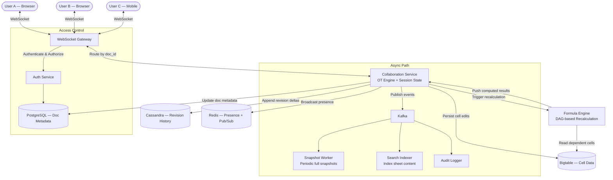
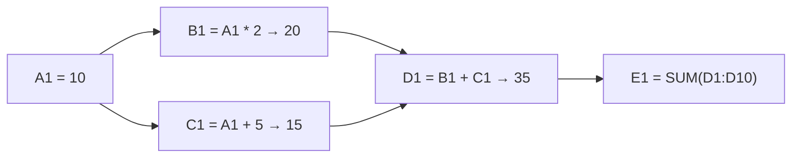

# Case Study: Collaborative Spreadsheet — Google Sheets (System Design)

## Quick Summary (TL;DR)
- **Goal**: Design a real-time collaborative spreadsheet where multiple users can simultaneously view and edit cells, see each other's cursors, and never lose data — even during conflicts.
- **Scale**: 800M MAU, 10M concurrently open documents, up to 100 simultaneous editors per sheet. 500K cell edits/sec globally.
- **Key Decisions**:
  - Use **Operational Transformation (OT)** to resolve concurrent edits on the same cell without locking — the same algorithm Google Docs uses in production.
  - Use **WebSockets** for real-time bi-directional sync between clients and the collaboration server.
  - Use **a Cell-Level storage model** (not row-level) — only store cells that have data, making sparse spreadsheets (10,000 rows but only 50 filled cells) extremely storage-efficient.
  - Use **a Computation Graph (DAG)** for formula evaluation — when cell A1 changes, only recalculate formulas that depend on A1 (topological order), not the entire sheet.

---

## 🤓 Noob Jargon Buster

* **Operational Transformation (OT)**: A conflict-resolution algorithm. When two users edit the same cell at the same time, OT transforms the operations so both can be applied without either user's change being lost. Think of it as "rebasing" one edit on top of another in real time.
* **CRDT (Conflict-free Replicated Data Type)**: An alternative to OT. Data structures that mathematically guarantee convergence across replicas without central coordination. Simpler theory but harder to implement for spreadsheets (OT is the industry standard).
* **Computation Graph / DAG**: A directed acyclic graph where each node is a cell and edges represent formula dependencies (`=A1+B1` makes C1 depend on A1 and B1). When a cell changes, we walk the DAG downstream to recalculate only affected formulas.
* **Cursor Presence**: Showing where other collaborators' cursors are in real time (e.g., "Rohit is editing cell D5" with a colored highlight).
* **Revision / Version Vector**: Each document maintains a monotonically increasing revision number. Every edit is stamped with the revision it was based on, enabling the server to detect and resolve conflicts.

---

## 1. Requirements & Scope

### Functional
1. **Cell Editing**: Users type values (text, numbers) or formulas (`=SUM(A1:A10)`) into cells.
2. **Real-Time Collaboration**: Multiple users edit the same sheet simultaneously. Changes appear within `< 200ms` for all collaborators.
3. **Formula Engine**: Support 100+ functions (SUM, VLOOKUP, IF, etc.) with automatic recalculation when dependencies change.
4. **Cursor Presence**: See other users' cursor positions and selected ranges in real time.
5. **Version History**: View and restore any previous version of the spreadsheet.
6. **Sharing & Permissions**: Owner, Editor, Commenter, Viewer roles with link-based sharing.
7. **Offline Editing**: Queue edits locally and sync when reconnected.

### Non-Functional
- **Consistency**: All collaborators must converge to the same document state — no divergence.
- **Low Latency**: Local edits must feel instant (optimistic UI). Remote edits must appear within 200ms.
- **Durability**: Zero data loss. Every keystroke is persisted.
- **Scale**: Handle sheets with 5 million cells and 100 concurrent editors without degradation.

---

## 2. Scale Estimation (The Math)

### Throughput (QPS)
- **Concurrently Open Documents**: 10M.
- **Cell Edits**: Average 50 edits/min per active user, 10M active editors → $\frac{10,000,000 \times 50}{60} \approx 8.3\text{M edits/min} \approx 140,000 \text{ edits/sec}$.
- **Peak**: ~500,000 edits/sec (global working hours overlap).
- **Presence Updates** (cursor moves): ~10x edit rate → 1.4M events/sec (lightweight, ephemeral — no persistence needed).

### Storage
- **Cell Record**: ~100 bytes (sheet_id, cell_ref, raw_value, computed_value, formula, format_json, version).
- **Average Sheet**: 500 non-empty cells → 50 KB per sheet.
- **Total Sheets**: 5 Billion sheets × 50 KB = **250 TB** of cell data.
- **Revision History**: Store deltas (not full snapshots). Average delta: 50 bytes. 100 revisions/sheet → $5\text{B} \times 100 \times 50 \text{ bytes} = 25 \text{ TB}$ of history.

### Memory
- **Active Document Sessions in Memory**: 10M open docs × 50 KB average = **500 GB** distributed across collaboration servers.
- **Presence Data**: 10M users × 64 bytes (doc_id, cell_ref, color, name) = **640 MB** in Redis.

---

## 3. System API Design

### A. Edit a Cell
- **Protocol**: WebSocket message (not REST — too slow for real-time edits).
- **Client → Server**:
  ```json
  {
    "type": "cell_edit",
    "doc_id": "d_abc123",
    "cell": "B5",
    "value": "=SUM(A1:A10)",
    "base_revision": 42,
    "client_id": "c_xyz789"
  }
  ```
- **Server → All Clients** (after OT):
  ```json
  {
    "type": "cell_update",
    "doc_id": "d_abc123",
    "cell": "B5",
    "value": "=SUM(A1:A10)",
    "computed_value": 1250,
    "revision": 43,
    "author": "c_xyz789"
  }
  ```

### B. Load Sheet (Initial Fetch)
- **Endpoint**: `GET /v1/sheets/{doc_id}?range=A1:Z100`
- **Response**: Cell data array + current revision number + list of active collaborators.

### C. Get Version History
- **Endpoint**: `GET /v1/sheets/{doc_id}/revisions?limit=50`
- **Response**: List of revision summaries (revision_id, author, timestamp, cells_changed).

### D. Update Permissions
- **Endpoint**: `PUT /v1/sheets/{doc_id}/permissions`
- **Request**: `{ "email": "priya@example.com", "role": "EDITOR" }`

---

## 4. Database Schema Design

### Cell Data (Bigtable / HBase — Sparse, Wide-Column)

| Row Key | Column Family: `data` | Column Family: `meta` |
|---------|----------------------|----------------------|
| `{doc_id}#{cell_ref}` (e.g., `d_abc123#B5`) | `raw_value`, `computed_value`, `formula` | `format_json`, `version`, `updated_by`, `updated_at` |

**Why Bigtable?**
- Spreadsheets are **sparse** — a sheet with 1M possible cells might have only 500 filled. Bigtable's sparse column model means we pay nothing for empty cells.
- Row key `{doc_id}#{cell_ref}` means all cells of a sheet are co-located (same row key prefix), enabling fast range scans (`d_abc123#A1` to `d_abc123#Z100`).
- Handles petabyte-scale with automatic sharding.

### Document Metadata (PostgreSQL)
```sql
CREATE TABLE documents (
    doc_id       UUID PRIMARY KEY,
    title        VARCHAR(255),
    owner_id     UUID NOT NULL,
    created_at   TIMESTAMPTZ DEFAULT NOW(),
    updated_at   TIMESTAMPTZ DEFAULT NOW(),
    revision     BIGINT NOT NULL DEFAULT 0
);

CREATE TABLE permissions (
    doc_id   UUID REFERENCES documents(doc_id),
    user_id  UUID NOT NULL,
    role     VARCHAR(20) NOT NULL,  -- OWNER, EDITOR, COMMENTER, VIEWER
    PRIMARY KEY (doc_id, user_id)
);
```

### Revision History (Cassandra — Append-Only, Time-Series)
- **Partition Key**: `doc_id`
- **Clustering Key**: `revision DESC`
- **Columns**: `cell_ref`, `old_value`, `new_value`, `author_id`, `timestamp`
- Stores deltas, not full snapshots. To reconstruct version N, apply deltas 1..N sequentially (or periodically snapshot every 100 revisions for faster reconstruction).

---

## 5. High-Level Architecture



### Edit Flow (Step-by-Step)
1. **User A** types `=SUM(A1:A10)` into cell B5. The client applies the edit locally (optimistic UI) and sends a WebSocket message with `base_revision: 42`.
2. **WebSocket Gateway** routes the message to the **Collaboration Service** instance that owns this document's session.
3. **Collaboration Service** runs **OT** — checks if revision 42 is the current head. If other edits arrived first (revision is now 44), it transforms User A's operation to apply cleanly on top of revisions 43 and 44.
4. The transformed edit is applied: cell B5 is updated in the in-memory document state, and the revision bumps to 45.
5. **Formula Engine** detects that B5 changed. It walks the computation DAG to find all formulas that depend on B5 (e.g., C10 = `=B5*2`). It recalculates these in topological order.
6. The server persists the edit + computed results to **Bigtable** and appends a revision delta to **Cassandra**.
7. The server broadcasts the update (cell B5 = 1250, revision 45) to **all connected clients** of this document via WebSocket.
8. **User B and C** receive the update and apply it to their local state.

---

## 6. Why Choose This? (Defending Your Architecture)

### 🧭 Why OT (Operational Transformation) instead of CRDT?
* **Answer**: "OT is the battle-tested choice for collaborative editors — Google Docs, Google Sheets, and the original Wave protocol all use OT. For spreadsheets specifically, OT works well because the unit of conflict is a single cell. When two users edit the same cell, OT resolves it deterministically (last-write-wins with transformation). CRDTs guarantee convergence without a central server, which is appealing, but they're harder to implement for structured data like spreadsheets where formula dependencies create cascading recalculations. OT with a central server (the Collaboration Service) gives us a single source of truth for revision ordering and simpler formula re-evaluation."

### 🧭 Why Bigtable instead of PostgreSQL or DynamoDB for cell data?
* **Answer**: "Spreadsheets are inherently sparse — a sheet with 26 columns × 10,000 rows has 260K possible cells, but typically only a few hundred contain data. In PostgreSQL, we'd either store 260K rows (wasteful) or use a JSONB column (losing query granularity). Bigtable's sparse column model stores only non-empty cells, and its row key design (`doc_id#cell_ref`) co-locates all cells of a document for fast range scans. It also handles petabyte scale with automatic sharding — critical for 250 TB of cell data."

### 🧭 Why a dedicated Formula Engine instead of evaluating formulas on the client?
* **Answer**: "Client-side formula evaluation breaks consistency. If User A edits cell A1 and User B has a formula `=A1+10` in B1, User B's client needs to know that A1 changed and recalculate B1. But B might be offline, on a slow network, or using a different formula implementation (mobile vs web). By evaluating formulas server-side, we guarantee all clients see the same computed values. The server's DAG-based engine also enables efficient recalculation — only cells downstream of the change are recomputed, not the entire sheet."

### 🧭 Why WebSockets instead of HTTP polling or SSE?
* **Answer**: "Collaboration requires bi-directional, low-latency communication. The client sends edits AND receives updates from other users. HTTP polling adds 1-2 seconds of latency per update and wastes bandwidth with empty responses. SSE is server-to-client only — we'd still need HTTP POST for edits, doubling the connection overhead. WebSockets give us a single persistent connection for both directions with sub-100ms latency. At 10M concurrent documents, the gateway maintains ~10M connections — achievable with connection pooling and horizontal scaling."

### 🧭 Why store revision deltas instead of full snapshots?
* **Answer**: "A full snapshot of a 500-cell sheet is 50 KB. If we snapshot on every edit, a sheet with 10,000 edits would consume 500 MB — just for history. Deltas are typically 50 bytes (cell_ref, old_value, new_value), reducing history storage by 1000x. To reconstruct any version, we replay deltas from the nearest snapshot. We snapshot every 100 revisions as a checkpoint, so reconstruction requires at most 100 delta replays — well under 10ms."

---

## 7. SDE-2 Deep Dives & Trade-offs

### A. Operational Transformation (OT) — How It Actually Works

The core problem: User A and User B both start from revision 42. A sets B5 = "Hello", B sets B5 = "World". Both edits arrive at the server.

```
Timeline:
  Rev 42 (base state: B5 = "")
     |
     ├── User A: SET B5 = "Hello" (based on rev 42)
     └── User B: SET B5 = "World" (based on rev 42)

Server receives A first:
  Rev 43: B5 = "Hello" (A's edit applied)

Server receives B (based on rev 42, but head is now 43):
  OT Transform: B's operation must be transformed against A's operation (rev 43).
  Conflict policy: Last-writer-wins → B's SET B5 = "World" overwrites A's.
  Rev 44: B5 = "World"
```

For **non-conflicting edits** (A edits B5, B edits C3), OT is trivial — both operations apply independently:

```
Rev 42 → A: SET B5 = "Hello" → Rev 43
         B: SET C3 = 42      → Transform against rev 43 (no conflict) → Rev 44
Final: B5 = "Hello", C3 = 42 ✓
```

**Key Invariant**: All clients must converge to the same state regardless of the order they receive operations. OT guarantees this by transforming operations relative to the server's canonical revision sequence.

### B. Formula Engine — DAG-Based Recalculation

When cell A1 changes, we don't recalculate the entire sheet. We walk the dependency graph:



**Algorithm**:
1. User edits A1 = 10 (was 5).
2. Formula Engine looks up A1's **dependents** in the DAG: `{B1, C1}`.
3. Add B1 and C1's dependents: `{D1}`. Add D1's dependents: `{E1}`.
4. **Topological sort** the affected set: `[B1, C1, D1, E1]`.
5. Evaluate in order: B1 = 20, C1 = 15, D1 = 35, E1 = recalculate SUM.
6. Push all updated computed values to clients.

**Circular Reference Detection**: Before adding a formula, check if it would create a cycle in the DAG (DFS from the target cell back to itself). If so, reject the formula and show `#CIRCULAR_REF!`.

### C. Document Session Management

Not all 5 billion documents are active. We keep only open documents in memory:

| State | Where | Trigger |
|-------|-------|---------|
| **Cold** (idle) | Bigtable only | No one has opened it |
| **Warm** (recently closed) | Bigtable + CDN-cached metadata | Last user left < 30 min ago |
| **Hot** (active editing) | In-memory on Collaboration Server | At least 1 user connected |

**Session Routing**: The WebSocket Gateway uses **consistent hashing** on `doc_id` to route all collaborators of the same document to the same Collaboration Service instance. This ensures the OT engine and in-memory state are co-located.

**Failover**: If a Collaboration Server crashes:
1. The consistent hash ring detects the failure and re-routes to a new instance.
2. The new instance loads the document from Bigtable (cold start: ~200ms for a 500-cell sheet).
3. Clients reconnect via WebSocket and receive the full current state.
4. Any edits queued locally during the ~1 second failover window are replayed via OT.

### D. Handling Large Sheets (5M Cells)

A sheet with 5 million cells (500 KB cell data) creates challenges:

1. **Initial Load**: Don't load all 5M cells. Use **viewport-based loading** — the client requests only the visible range (e.g., A1:Z50) plus a buffer zone. As the user scrolls, fetch new ranges lazily.
2. **Formula Recalculation**: A formula `=SUM(A1:A1000000)` touches 1M cells. Pre-compute and cache the result. On incremental edits, use **incremental aggregation** — if A5 changes from 10 to 15, update the cached SUM by +5 instead of re-scanning 1M cells.
3. **Memory**: 5M cells × 100 bytes = 500 MB for one document. This exceeds single-server memory budgets. **Partition the sheet** across multiple Collaboration Service instances by row ranges (rows 1-100K on server A, 100K-200K on server B). Cross-partition formulas require inter-server RPC.

### E. Offline Editing & Sync

When a user goes offline:
1. The client caches the current document state in **IndexedDB** (browser local storage).
2. Edits are queued locally as operations with a monotonically increasing local sequence number.
3. When reconnecting, the client sends all queued operations with their `base_revision` to the server.
4. The server applies OT to transform these operations against any edits that happened while the user was offline.
5. The client receives the transformed results and updates its local state.

**Conflict Example**: User is offline, edits B5. Meanwhile, another user deletes column B (inserts column at B, shifting old B to C). When the offline user reconnects, OT transforms the "edit B5" operation to "edit C5" — the cell moved.

---

## 8. Common Traps & Mitigations

1. **OT Complexity Explosion with Many Concurrent Editors**: With 100 editors, the server must transform each incoming operation against all unacknowledged concurrent operations. This is O(n²) in the worst case.
   - *Mitigation*: **Batch operations** — the server processes edits in micro-batches (every 50ms), transforms the batch as a group, and broadcasts a single update. Reduce per-operation overhead. Google's production OT also uses a centralized sequencer to linearize operations, avoiding the n² problem.

2. **Circular Formula References**: User enters `=A1` in B1, then `=B1` in A1 → infinite loop.
   - *Mitigation*: Before accepting a formula, run a **DFS cycle detection** on the dependency DAG. If a cycle is found, reject the formula immediately and display `#CIRCULAR_REF!` in the cell. Never attempt evaluation.

3. **Thundering Herd on Popular Documents**: A public spreadsheet goes viral — 10,000 users open it simultaneously.
   - *Mitigation*: **Tiered access** — distinguish between viewers and editors. Viewers receive a read-only snapshot via CDN/SSE (no WebSocket, no OT). Only editors get full WebSocket collaboration. Cap editors at 100 per document; additional editors see a "currently at capacity" message.

4. **Stale Computed Values After Server Crash**: Server crashes mid-recalculation. Some cells have new computed values, others have stale ones.
   - *Mitigation*: On recovery, **full recalculation pass** — the Formula Engine recomputes all formulas in the document using topological order. This is a one-time cost (~100ms for a 500-cell sheet) that guarantees consistency. Mark the document as "recalculating" during this window.

5. **Version History Bloat**: A sheet with 1 million edits accumulates 50 MB of deltas.
   - *Mitigation*: **Compaction** — periodically merge old deltas into full snapshots. Keep fine-grained deltas for the last 30 days (for undo/version history). Beyond 30 days, compact into daily snapshots. Users rarely need cell-level granularity for edits from 6 months ago.

6. **Cross-Sheet Formula Dependencies**: `=IMPORTRANGE("other_sheet", "A1:A10")` creates a dependency across two documents on potentially different servers.
   - *Mitigation*: Treat cross-sheet references as **async subscriptions**. The referring sheet subscribes to changes in the source range. The source document's Collaboration Service publishes updates via Kafka. The referring sheet's Formula Engine consumes these events and recalculates. Accept eventual consistency (1-5 second lag) for cross-sheet formulas — real-time is infeasible across documents.
