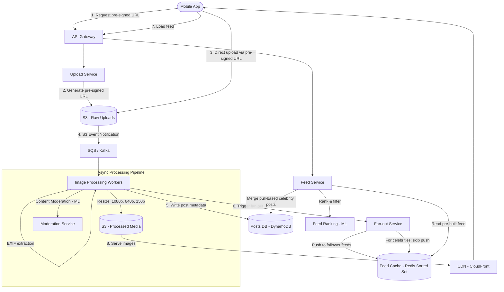

# Case Study: Instagram / Photo-Sharing Platform (System Design)

## Quick Summary (TL;DR)
- **Goal**: Design a photo-sharing social platform supporting uploads, news feed, stories, likes, comments, follow graph, and explore/discovery — at Instagram scale.
- **Scale**: 500M DAU, 100M photos uploaded/day, 2B+ feed reads/day. Peak upload QPS: ~3,000/sec.
- **Key Decisions**:
  - Use **pre-signed S3 URLs** for client-direct media upload — keeps upload traffic off your application servers entirely.
  - Use **async image processing pipeline** (SQS/Kafka → workers) to generate thumbnails, apply filters, extract EXIF, and run content moderation — decoupled from the upload request.
  - Use **hybrid fan-out** (push for normal users, pull for celebrities) to build per-user feed timelines, same as Twitter but with heavier media payloads.
  - Use **CDN-first delivery** — images are served from edge caches (CloudFront/Akamai), never from origin S3 in the hot path.

---

## Noob Jargon Buster

* **Pre-signed URL**: A time-limited, token-authenticated URL that lets a client upload directly to S3 without routing through your backend. The backend generates the URL (with an expiry and size limit), hands it to the client, and the client uploads the image straight to S3.
* **Fan-out on Write (Push model)**: When User A posts a photo, the system pre-computes and pushes the post into the feed cache of every follower. Fast reads, expensive writes.
* **Fan-out on Read (Pull model)**: The feed is assembled at read time by fetching recent posts from all users the reader follows. Cheap writes, expensive reads.
* **Blurhash**: A compact string (~30 characters) representing a blurry placeholder image. Displayed instantly while the full image downloads — gives the UI a polished, non-janky feel.
* **Progressive JPEG**: An image encoding where the browser first renders a low-resolution version, then progressively sharpens it as more bytes arrive. Users see "something" immediately instead of a blank space loading top-to-bottom.
* **Content-Addressable Storage**: Storing objects by a hash of their content (e.g., `SHA-256(image_bytes)` as the S3 key). If two users upload the exact same image, it's stored only once — automatic deduplication.

---

## 1. Requirements & Scope

### Functional
1. **Upload**: Users upload photos/short videos with captions, tags, and location.
2. **News Feed**: A personalized, ranked feed of posts from followed users.
3. **Stories**: Ephemeral 24-hour photo/video content.
4. **Social Graph**: Follow/unfollow users (asymmetric — not mutual like Facebook).
5. **Interactions**: Like, comment, share, save posts.
6. **Explore**: Discovery page showing trending and recommended content.
7. **Search**: Search by hashtag, username, or location.

### Non-Functional
- **Low latency feed**: Feed must render in < 200ms (images from CDN, metadata from cache).
- **High availability**: Upload and feed must never go down — these are core monetization surfaces.
- **Eventual consistency**: A new post appearing in all followers' feeds within 5 seconds is acceptable.
- **Durability**: Zero data loss on uploaded media — once a user uploads a photo, it must never be lost.

---

## 2. Scale Estimation (The Math)

### Users
- **Total users**: 2 Billion registered.
- **DAU**: 500 Million.
- **Average follows**: 200 accounts per user.

### Upload Throughput
- **Photos uploaded**: 100 Million/day.
- **Average QPS**: $\frac{100,000,000}{86,400} \approx 1,157 \text{ uploads/sec}$.
- **Peak QPS**: $\approx 3,000 \text{ uploads/sec}$.

### Feed Read Throughput
- **Feed loads**: 500M DAU × 4 sessions/day = 2 Billion feed reads/day.
- **Average QPS**: $\frac{2,000,000,000}{86,400} \approx 23,000 \text{ reads/sec}$.
- **Peak QPS**: $\approx 50,000 \text{ reads/sec}$.

### Storage
- **Original image**: 2 MB average.
- **Thumbnails** (3 sizes): 150 KB + 50 KB + 10 KB = 210 KB per photo.
- **Total per photo**: ~2.2 MB.
- **Daily storage**: $100\text{M photos} \times 2.2\text{ MB} = 220\text{ TB/day}$.
- **Yearly**: $220 \times 365 \approx 80\text{ PB/year}$.

### CDN Bandwidth
- **Feed reads**: 50,000 reads/sec × 10 images/page × 150 KB (feed-size thumbnail) = **75 GB/sec = 600 Gbps** peak.
- This is why CDN is non-negotiable — no origin server cluster can serve 600 Gbps.

---

## 3. System API Design

### A. Upload Photo
```
POST /v1/media/upload/initiate
Headers: Authorization: Bearer <token>
Body: { "content_type": "image/jpeg", "size_bytes": 2048000 }

Response:
{
  "upload_id": "up_abc123",
  "presigned_url": "https://s3.amazonaws.com/insta-uploads/up_abc123?X-Amz-Signature=...",
  "expires_in": 3600
}
```
Client uploads directly to S3 via the pre-signed URL, then confirms:
```
POST /v1/posts
Body: {
  "upload_id": "up_abc123",
  "caption": "Sunset in Bali 🌅",
  "tags": ["travel", "bali"],
  "location": { "lat": -8.409, "lng": 115.189 }
}
```

### B. Get Feed
```
GET /v1/feed?cursor=<last_post_id>&limit=20
Response: {
  "posts": [
    {
      "post_id": "p_xyz",
      "user": { "id": "u_123", "username": "alice", "avatar_url": "..." },
      "media_url": "https://cdn.insta.com/p_xyz/feed.jpg",
      "blurhash": "LEHV6nWB2yk8pyo0adR*.7kCMdnj",
      "caption": "Sunset in Bali",
      "likes_count": 4230,
      "comments_count": 89,
      "created_at": "2026-05-31T10:30:00Z"
    }
  ],
  "next_cursor": "p_abc"
}
```

### C. Follow / Unfollow
```
POST /v1/users/{user_id}/follow
DELETE /v1/users/{user_id}/follow
```

---

## 4. High-Level Architecture



---

## 5. Database Schema Design

### A. Posts Table (DynamoDB)
```
Table: posts
  Partition Key: post_id (String)
  Attributes:
    user_id          (String, GSI partition key)
    media_key        (String → S3 object key)
    media_urls       (Map: { "original": "...", "1080p": "...", "640p": "...", "150p": "..." })
    blurhash         (String)
    caption          (String)
    tags             (List<String>)
    location         (Map: { lat, lng, name })
    likes_count      (Number)
    comments_count   (Number)
    created_at       (Number - epoch ms, GSI sort key)
    status           (String: PROCESSING | ACTIVE | DELETED | FLAGGED)

  GSI: user_id-created_at-index
    → Query: "all posts by user X, most recent first"
```

### B. Follow Graph (DynamoDB or Cassandra)
```
Table: followers
  Partition Key: user_id
  Sort Key: follower_id
  Attributes:
    followed_at (Timestamp)

Table: following
  Partition Key: user_id
  Sort Key: following_id
  Attributes:
    followed_at (Timestamp)
```
- **Two tables** for the asymmetric follow graph: `followers` answers "who follows me?" (for fan-out), `following` answers "who do I follow?" (for pull-based feed assembly).
- Denormalized by design — a follow creates two writes (one per table). Worth it because reads are 100x more frequent.

### C. Feed Cache (Redis Sorted Set)
```
Key:    feed:{user_id}
Type:   Sorted Set
Member: post_id
Score:  created_at (epoch ms)

Commands:
  ZADD feed:u_456 1717142400000 p_xyz       # Fan-out: push post to follower's feed
  ZREVRANGEBYSCORE feed:u_456 +inf -inf LIMIT 0 20  # Read: get latest 20 posts
  ZREMRANGEBYRANK feed:u_456 0 -501         # Trim: keep only latest 500 posts
```
- Each user's feed cache holds the **500 most recent post IDs** from people they follow.
- The feed is pre-computed (push model) so reads are a single Redis command — sub-millisecond.
- Feed entries are just `post_id` references (not full post data) — keeps cache small (~50 KB per user).

---

## 6. Core Design Components

### A. Media Upload Pipeline — Pre-signed URL Pattern

**Why not upload through your API servers?**
A 2 MB image upload occupies an API server thread for 2-5 seconds (on mobile networks). At 3,000 uploads/sec, that's 6,000-15,000 concurrent threads just holding upload connections — an absurd waste of application server capacity.

```
Sequence:
  1. Client → API:     "I want to upload a 2MB JPEG"
  2. API → S3:         Generate pre-signed PUT URL (expires in 1 hour, max 5MB)
  3. API → Client:     Return pre-signed URL + upload_id
  4. Client → S3:      Direct PUT upload (bypasses API entirely)
  5. S3 → SQS/Kafka:   S3 Event Notification: "new object created"
  6. Worker picks up:   Resize, moderate, write metadata, trigger fan-out
  7. Worker → Client:   Push notification: "Your post is live!"
```

**Benefits**:
- API servers handle only lightweight JSON requests, not heavy binary uploads.
- S3 handles multi-part upload, retry, and checksumming natively.
- Processing is fully async — the user doesn't wait for thumbnails to be generated.

### B. Image Processing Pipeline

When a new image lands in S3, the processing worker performs:

```
1. VALIDATE
   - Check file is a valid image (magic bytes, not a renamed .exe)
   - Enforce max dimensions (4096x4096) and file size (10 MB)
   - Strip EXIF GPS data for privacy (unless user opted into location sharing)

2. RESIZE (generate 3 variants)
   ┌──────────────┬──────────┬──────────────────────┐
   │ Variant      │ Size     │ Use case             │
   ├──────────────┼──────────┼──────────────────────┤
   │ Full (1080p) │ ~500 KB  │ Single post view     │
   │ Feed (640p)  │ ~150 KB  │ Feed scroll          │
   │ Thumb (150p) │ ~10 KB   │ Grid / profile view  │
   └──────────────┴──────────┴──────────────────────┘
   - Encode as Progressive JPEG (renders blurry-first in browser)
   - Output to WebP for Android clients (30% smaller than JPEG)

3. GENERATE BLURHASH
   - Compute a 4x3 component Blurhash string (~30 chars)
   - Store in post metadata → client renders instantly before image loads

4. CONTENT MODERATION (ML)
   - Run through nudity/violence/spam classifier
   - If confidence > 0.95 → auto-reject, notify user
   - If confidence 0.7-0.95 → queue for human review
   - If confidence < 0.7 → auto-approve

5. WRITE METADATA
   - Insert row into Posts DB with status = ACTIVE
   - All media_urls point to CDN domain (cdn.insta.com), not raw S3
```

### C. News Feed — Hybrid Fan-out

Same concept as Twitter, but adapted for a media-heavy platform:

```
On new post by User A:
  1. Look up User A's follower count

  IF followers < 10,000 (normal user):
     → FAN-OUT ON WRITE (Push)
     → For each follower: ZADD feed:{follower_id} {timestamp} {post_id}
     → Followers see the post instantly on next feed refresh

  IF followers ≥ 10,000 (celebrity / influencer):
     → SKIP fan-out (pushing to 10M feeds is too expensive)
     → Post is stored in Posts DB only
     → At feed-read time, merge celebrity posts into the feed (Pull)
```

**Feed Assembly at Read Time**:
```
1. Read pre-built feed from Redis:       ZREVRANGE feed:{user_id} 0 19
   → Returns 20 post_ids (already pushed from normal users)

2. Get list of celebrities this user follows:  celebrity_ids = following:{user_id} ∩ celebrity_set

3. For each celebrity, fetch recent posts:  query Posts DB GSI (user_id-created_at-index)

4. Merge + Rank:  combine push-feed + celebrity posts → ML ranker scores → sorted result

5. Hydrate:  batch-fetch full post metadata (caption, likes, media_urls) from Posts DB

6. Return to client with CDN media URLs + blurhash placeholders
```

### D. Feed Ranking — ML Scoring

Instagram doesn't show posts in pure chronological order. Each candidate post is scored:

```
Score = w1 × interest_score      (does this user engage with this type of content?)
      + w2 × recency_score       (how new is the post?)
      + w3 × relationship_score  (how often does the user interact with the author?)
      + w4 × popularity_score    (likes/comments velocity in first 30 minutes)

Signals:
  - interest_score:      based on user's past likes, saves, and dwell time on similar content
  - recency_score:       exponential decay — posts older than 48 hours score near zero
  - relationship_score:  frequency of DMs, profile visits, comment replies with the author
  - popularity_score:    early engagement velocity (viral potential)
```

- The ranker runs as a lightweight model (logistic regression or small neural net) at read time.
- Feature vectors are pre-computed and cached — the ranking call itself takes < 10ms.

### E. Stories — Ephemeral Content

Stories differ from posts in key ways:

| Aspect | Posts | Stories |
|--------|-------|---------|
| Lifetime | Permanent | 24 hours |
| Storage | S3 (permanent) | S3 with lifecycle rule (auto-delete after 24h) |
| Feed position | Main feed (ranked) | Top bar (chronological, per-user) |
| View tracking | Like/comment counts | View list (who viewed it) |

**Storage optimization**:
- S3 Lifecycle Policy: `Expiration: 1 day` on the stories bucket — AWS auto-deletes objects.
- Stories metadata in Redis with TTL: `SETEX story:{story_id} 86400 {metadata_json}`.
- No need for database durability — stories are intentionally ephemeral.

### F. CDN Strategy for Media Delivery

At 600 Gbps peak, CDN is the most critical component for user experience:

```
Client request: GET cdn.insta.com/p_xyz/feed.jpg

  1. CDN Edge (nearest PoP)
     → Cache HIT?  → Return immediately (< 20ms latency)
     → Cache MISS? → Pull from S3 origin, cache at edge, return

  Cache-Control headers:
     Original/resized images:  Cache-Control: public, max-age=31536000 (1 year)
     (Images are immutable — the URL includes the post_id, so content never changes at the same URL)

  CDN cache hit rate target: > 95%
     Why achievable: images are immutable + popularity follows power law
     (top 10% of images serve 90% of traffic)
```

**Content-Addressable Storage**:
- S3 key = `SHA-256(image_bytes)` — if two users upload the exact same image, it's stored once.
- Saves ~5-10% storage on meme reposts, screenshots, and shared content.

---

## 7. Why Choose This? (Defending Your Architecture)

### Why use pre-signed URLs instead of uploading through the API?
* **Answer**: "At 3,000 uploads/sec with 2 MB images, routing through API servers would require them to buffer 6 GB/sec of binary data — that's 6,000+ threads blocked on I/O just for uploads. Pre-signed URLs offload the binary transfer entirely to S3, which is purpose-built for high-throughput object storage. Our API servers only handle lightweight JSON metadata requests, keeping them small, fast, and cheap to scale. The client uploads directly to S3 using a time-limited, size-limited token — we never touch the bytes."

### Why use hybrid fan-out instead of pure push or pure pull?
* **Answer**: "Pure push works for normal users (200 followers → 200 Redis writes per post, done in milliseconds). But a celebrity with 50M followers would trigger 50M Redis writes per post — that's a 10-second write storm that saturates the entire Redis cluster. Pure pull avoids this but makes every feed read expensive — you'd query 200 users' post histories and merge them in real time. The hybrid approach gives us the best of both: O(1) feed reads for 99% of content (pre-pushed from normal users), and only pulls from the ~5-10 celebrities a user follows."

### Why generate multiple image sizes instead of serving the original?
* **Answer**: "The original is 2 MB. A user scrolling through their feed loads 10+ images per screen — that's 20 MB per scroll on a mobile network. By pre-generating a 150 KB feed-size variant and a 10 KB thumbnail, we reduce bandwidth by 93%. The resize happens once (async, at upload time) and the result is cached on CDN forever. The storage cost of 3 extra variants (~210 KB) is negligible compared to the bandwidth savings across billions of reads."

### Why use DynamoDB over PostgreSQL for posts?
* **Answer**: "The access patterns are simple: get post by ID, list posts by user sorted by time. No joins, no complex queries, no transactions across posts. DynamoDB handles these key-value and key-range patterns with single-digit millisecond latency at any scale, and auto-scales throughput without manual sharding. PostgreSQL would require manual partitioning, connection pooling, and read replicas to handle 23,000 reads/sec — all operational overhead that DynamoDB eliminates."

---

## 8. SDE-2 Deep Dives & Trade-offs

### A. Consistency Model — "My Post Doesn't Appear in My Feed"

After uploading, the user expects to immediately see their own post. But fan-out is async — there's a 1-5 second delay.

**Solution — Read-your-writes consistency**:
1. After the post is confirmed published, the client **locally injects** the post into the feed UI without waiting for the backend feed cache.
2. On the next feed refresh, the backend feed includes the post (fan-out completed by then).
3. If the fan-out hasn't completed yet, the Feed Service checks: "is the requesting user also the post author?" → if yes, merge the post from the Posts DB directly.

### B. Hot Partition — Viral Post Problem

A single post goes viral: 1M likes in 10 minutes. The `likes_count` field on the post record becomes a hot key — thousands of concurrent increment operations.

**Solution — Counter sharding**:
```
Instead of:  posts.p_xyz.likes_count += 1   (hot key contention)

Use:
  likes_counter:{post_id}:{shard_0}  ← random shard for each increment
  likes_counter:{post_id}:{shard_1}
  ...
  likes_counter:{post_id}:{shard_9}

  Write: INCR likes_counter:p_xyz:{random(0-9)}   → distributed across 10 keys
  Read:  SUM(likes_counter:p_xyz:shard_*)          → aggregate on read (cached)
```

- Writes fan out to 10 Redis shards — no hot key.
- Reads aggregate all shards but are cached with 5-second TTL (exact real-time count isn't needed).
- Display "4.2K likes" (approximation) rather than "4,217 likes" (exact).

### C. Explore / Discovery — Recommendation Engine

The Explore page shows content from users you *don't* follow. This is a cold-start recommendation problem.

**Signal sources**:
1. **Collaborative filtering**: "Users similar to you also liked these posts."
2. **Content-based**: Image embeddings (ResNet/CLIP) → find visually similar content to what you've liked.
3. **Engagement velocity**: Posts with high like/save/share rate in the first 30 minutes → trending.
4. **Graph-based**: Posts liked by your followers (2nd-degree engagement).

**Architecture**:
- Offline pipeline (Spark/Flink): compute candidate posts per user segment every 30 minutes.
- Online ranker: re-rank the candidate set using real-time features (current session interests).
- Cache the top 500 explore candidates per user in Redis. Paginate from cache.

### D. Notification Fan-out — "X Liked Your Photo"

When a post gets 10,000 likes, you don't send 10,000 individual push notifications to the author.

**Batching and collapsing**:
```
1-3 likes:    "alice liked your photo"
4-10 likes:   "alice, bob, and 3 others liked your photo"
11+ likes:    "Your photo is getting popular! 47 likes in the last hour"

Implementation:
  - Buffer like events in a 30-second time window (Redis Sorted Set per post)
  - A background job collapses the window into a single notification
  - Rate-limit: max 1 notification per post per 5 minutes
```

### E. Data Deletion — GDPR "Right to Erasure"

When a user deletes their account, all their data must be permanently removed:

1. **Immediate**: Mark user and all posts as `DELETED` in the database. Remove from all caches and feed caches.
2. **Async (within 30 days)**: Background job deletes all S3 objects (originals + thumbnails), removes all follower/following graph entries, purges from search indices and recommendation models.
3. **Cascade**: Remove likes and comments authored by the user on other people's posts. Update `likes_count` / `comments_count` on affected posts.
4. **Audit**: Log the deletion request and completion timestamp for compliance.

---

## 9. Summary: Component Decision Table

| Component | Choice | Rationale |
|-----------|--------|-----------|
| Media Upload | Pre-signed S3 URLs | Offload binary I/O from API servers |
| Image Processing | Async pipeline (SQS → Workers) | Decoupled from upload; retryable |
| Image Variants | 3 sizes + WebP + Blurhash | 93% bandwidth reduction on feed reads |
| Posts DB | DynamoDB | Simple access patterns; auto-scaling |
| Follow Graph | DynamoDB (2 tables) | Denormalized for fast reads in both directions |
| Feed Cache | Redis Sorted Sets (per user) | Sub-ms feed reads; easy trim/paginate |
| Feed Strategy | Hybrid fan-out (push + pull) | Handles normal users and celebrities |
| Feed Ranking | ML scorer at read time | Personalized; features pre-computed and cached |
| Media Delivery | CDN (CloudFront) | 95%+ cache hit rate; immutable image URLs |
| Stories | S3 lifecycle + Redis TTL | Auto-expiry; no manual cleanup |
| Content Moderation | ML classifier (async) | Doesn't block upload; human review for edge cases |

---

## 10. Common Traps & Mitigations

1. **Upload Timeout on Slow Networks**: Mobile users on 3G uploading a 5 MB image time out after 30 seconds.
   - *Mitigation*: Use S3 multi-part upload with resumable chunks (1 MB each). If the connection drops, the client resumes from the last completed chunk instead of restarting.

2. **Feed Cache Cold Start**: A new user follows 200 accounts but has an empty feed cache — first feed load is extremely slow (must pull from 200 users' post histories).
   - *Mitigation*: On follow, backfill the user's feed cache with the followed user's last 5 posts (async). After following 200 users, the cache already has ~1,000 post IDs ready to serve.

3. **Celebrity Unfollow Storm**: A celebrity does something controversial and 1M users unfollow simultaneously. Each unfollow triggers "remove their posts from my feed" — a write storm on Redis.
   - *Mitigation*: Celebrity posts are pull-based, not pushed into follower caches. Unfollowing a celebrity only updates the follow graph (1 write) — no feed cache cleanup needed.

4. **Duplicate Uploads**: User taps "Post" twice due to slow network, uploading the same image twice.
   - *Mitigation*: Content-addressable storage (SHA-256 key) deduplicates at S3 level. The `upload_id` is idempotent — the second `POST /v1/posts` with the same `upload_id` is a no-op.

5. **Thundering Herd on CDN Cache Expiry**: A viral image's CDN cache expires, and 10,000 concurrent requests hit the S3 origin simultaneously.
   - *Mitigation*: Set `Cache-Control: max-age=31536000` (1 year) — images are immutable (URL contains post_id). CDN cache effectively never expires. Use origin shield (single intermediate cache layer) so even on a rare miss, only 1 request reaches S3.
