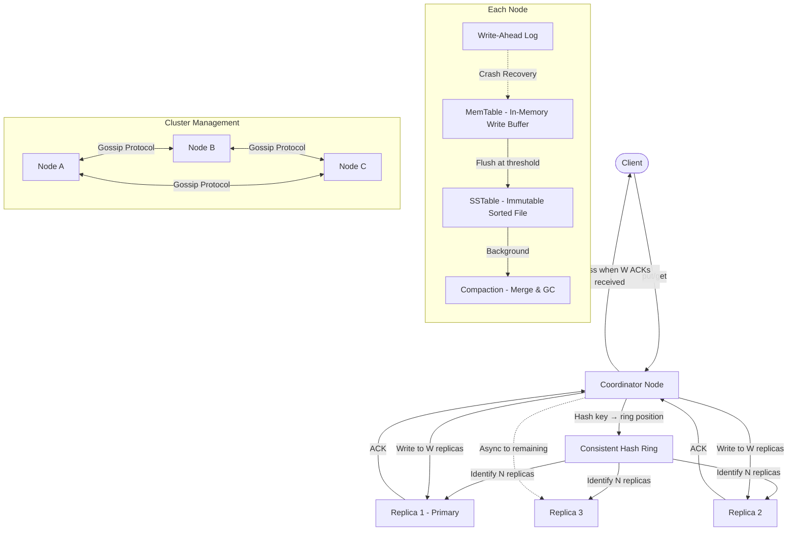

# Case Study: Distributed Key-Value Store (System Design)

## Quick Summary (TL;DR)
- **Goal**: Design a distributed key-value store (like Amazon DynamoDB or Apache Cassandra) that supports `put(key, value)` and `get(key)` operations at massive scale.
- **Scale**: 100K+ writes/sec, 500K+ reads/sec, petabytes of data across hundreds of nodes.
- **Key Decisions**:
  - Use **Consistent Hashing** with virtual nodes to distribute data evenly across a dynamic cluster.
  - Use **Quorum-based Replication** (W + R > N) to balance consistency and availability per-request.
  - Resolve conflicts using **Vector Clocks** (or Last-Write-Wins timestamps for simpler use cases).
  - Use **Gossip Protocol** for decentralized failure detection and cluster membership — no single point of failure.

---

## Noob Jargon Buster

* **Consistent Hashing**: A hashing scheme where adding/removing a server only remaps ~K/N keys (K = total keys, N = total servers), instead of rehashing everything.
* **Virtual Nodes (vnodes)**: Each physical server owns multiple positions on the hash ring, ensuring even data distribution even when machines have different capacities.
* **Quorum**: The minimum number of replicas that must acknowledge a read or write for it to succeed. With N replicas, write quorum W and read quorum R, setting W + R > N guarantees the client always sees the latest write.
* **Vector Clock**: A list of `[server, counter]` pairs attached to every value. It tracks causal ordering — which write happened before which — enabling the system to detect and resolve conflicts without a central coordinator.
* **Gossip Protocol**: Each node periodically shares its membership/heartbeat table with a random peer. Information spreads exponentially — like gossip in a social group — until every node converges on the same cluster view.
* **Hinted Handoff**: When a replica node is temporarily down, a healthy node accepts writes on its behalf and forwards them once the downed node recovers.
* **Merkle Tree**: A hash tree where each leaf is the hash of a data block and each parent is the hash of its children. Two nodes compare root hashes to quickly detect which data ranges are out of sync.
* **SSTable (Sorted String Table)**: An immutable, sorted, on-disk file of key-value pairs. The LSM-Tree storage engine flushes in-memory writes to SSTables periodically.

---

## 1. Requirements & Scope

### Functional
1. **Put**: `put(key, value)` — insert or update a key-value pair.
2. **Get**: `get(key)` — retrieve the value associated with a key.
3. **Delete**: `delete(key)` — remove a key (typically via tombstone marker).
4. **Automatic Scaling**: Add/remove nodes without downtime; data rebalances automatically.

### Non-Functional
- **High Availability**: Writes must succeed even during partial network partitions (AP system by default).
- **Tunable Consistency**: Clients can choose strong vs. eventual consistency per request via quorum parameters.
- **Low Latency**: Single-digit millisecond P99 for reads and writes.
- **Fault Tolerance**: No single point of failure. The system tolerates up to N-1 replica failures per key (where N is the replication factor).

---

## 2. Scale Estimation (The Math)

### Throughput
- **Writes**: 100,000 writes/sec average, 300,000 writes/sec peak.
- **Reads**: 500,000 reads/sec average, 1,000,000 reads/sec peak.
- **Read-to-Write Ratio**: ~5:1.

### Storage
- **Key Size**: 256 bytes (max).
- **Value Size**: 10 KB (average), 1 MB (max).
- **Daily Ingestion**: $100\text{K writes/sec} \times 10\text{ KB} \times 86,400\text{ sec} \approx 86\text{ TB/day}$.
- **With 3x Replication**: $86 \times 3 = 258\text{ TB/day}$.
- **Yearly (with compaction)**: After compaction removes overwritten/deleted keys, effective storage ~30 PB/year.

### Cluster Sizing
- Assume each node holds 2 TB of SSD storage.
- For 258 TB/day with 7-day retention before compaction: $258 \times 7 = 1,806\text{ TB} \Rightarrow \approx 900\text{ nodes}$.

---

## 3. System API Design

```
put(key, value, context)
  → key:     string (max 256 bytes)
  → value:   blob (max 1 MB)
  → context: vector_clock (from previous get, used for conflict resolution)
  ← success | error

get(key)
  → key:     string
  ← value, context (vector_clock)
  ← [list of conflicting values] if diverged (client resolves)
```

- The `context` parameter carries the vector clock from the last `get()`. On `put()`, the system extends the vector clock to track causality.
- If the system detects conflicting versions (concurrent writes with no causal order), `get()` returns all conflicting versions and the **client** resolves the conflict (e.g., shopping cart merge in DynamoDB).

---

## 4. High-Level Architecture



**Request Flow (Write)**:
1. Client sends `put(key, value)` to any node (the **coordinator**).
2. Coordinator hashes the key to find its position on the consistent hash ring.
3. The first N nodes clockwise from that position are the replicas.
4. Coordinator forwards the write to all N replicas, waits for W acknowledgments, then responds success.
5. Each replica writes to its local WAL + MemTable. When the MemTable exceeds a threshold, it flushes to an SSTable on disk.

**Request Flow (Read)**:
1. Coordinator hashes the key, identifies N replicas, sends read requests to all N.
2. Waits for R responses, returns the value with the highest vector clock.
3. If stale replicas are detected, triggers a **read repair** in the background.

---

## 5. Core Design Components

### A. Data Partitioning — Consistent Hashing with Virtual Nodes

```
Hash Ring (0 to 2^128 - 1):

   Position:   0 ──── A1 ──── B1 ──── A2 ──── C1 ──── B2 ──── C2 ──── A3 ──── 2^128
   Node:            NodeA    NodeB    NodeA    NodeC    NodeB    NodeC    NodeA
                    (vnode)  (vnode)  (vnode)  (vnode)  (vnode)  (vnode)  (vnode)
```

- Each physical node gets 100-200 virtual nodes (vnodes) on the ring.
- **Why vnodes?**
  - Without vnodes, adding a single node only relieves its one neighbor. With vnodes, load redistributes across many nodes.
  - Heterogeneous hardware: a beefy machine gets more vnodes, a smaller one gets fewer.
- **Key assignment**: `hash(key) → ring position → walk clockwise → first N distinct physical nodes = replica set`.

### B. Replication & Quorum Protocol

Each key is replicated to **N** nodes (typically N=3). Consistency is tunable per request:

| Config | W | R | Guarantee |
|--------|---|---|-----------|
| Strong consistency | 2 | 2 | W + R > N → always see latest (quorum overlap) |
| Fast writes | 1 | 3 | Writes are fast; reads check all replicas |
| Fast reads | 3 | 1 | Writes wait for all; reads hit any single replica |
| Eventual consistency | 1 | 1 | Fastest, but may read stale data |

**Typical production setting**: N=3, W=2, R=2 — balances latency and consistency.

### C. Conflict Resolution — Vector Clocks

When two clients write to the same key concurrently (no causal relationship), the system must detect and resolve the conflict.

```
Timeline:
  Client A: get(K) → [NodeX:1]
  Client B: get(K) → [NodeX:1]

  Client A: put(K, "v2") → clock becomes [NodeX:1, NodeA:1]
  Client B: put(K, "v3") → clock becomes [NodeX:1, NodeB:1]

  Neither dominates the other → CONFLICT detected on next get()
  → get(K) returns both "v2" and "v3" with their clocks
  → Client merges and writes back: put(K, "merged") → [NodeX:1, NodeA:1, NodeB:1]
```

- **Vector clock growth**: Clocks can grow unbounded. Truncate entries older than a threshold (e.g., entries not updated in 7 days) — this introduces a small risk of incorrect conflict resolution.
- **Alternative — Last-Write-Wins (LWW)**: Use wall-clock timestamps. Simpler but **loses data** on concurrent writes. Cassandra uses LWW; DynamoDB uses vector clocks.

### D. Failure Detection — Gossip Protocol

Every node runs a gossip protocol to maintain cluster membership:

1. Every 1 second, each node picks a random peer and exchanges its **heartbeat table**: `{node_id → (heartbeat_counter, timestamp)}`.
2. If Node B's heartbeat hasn't incremented for 10 seconds (as observed by multiple nodes), Node B is marked **suspected down**.
3. After 30 seconds of no heartbeat, Node B is marked **permanently down** and its vnodes are reassigned.

**Why gossip over a central coordinator?**
- No single point of failure. A centralized membership service (like ZooKeeper) can become a bottleneck and a failure point.
- Convergence is fast: information reaches all N nodes in O(log N) gossip rounds.

### E. Handling Failures

#### Temporary Failures — Hinted Handoff
When Replica 2 is temporarily unreachable:
1. The coordinator writes to another healthy node (say Node D) with a **hint**: "this data belongs to Replica 2".
2. Node D stores it in a local hint log.
3. When Replica 2 comes back online, Node D forwards the hinted writes to Replica 2, then deletes the hints.
4. This ensures writes are **never rejected** due to temporary failures (high availability).

#### Permanent Failures — Anti-Entropy with Merkle Trees
When a node was down for a long time or is replaced, use Merkle trees for efficient sync:

```
         Root Hash: H(H12 + H34)
           /                  \
      H12: H(H1+H2)      H34: H(H3+H4)
       /       \            /       \
    H1:data1  H2:data2  H3:data3  H4:data4
```

1. Each node maintains a Merkle tree per key range (vnode).
2. To sync, two replicas compare root hashes. If they match → data is identical.
3. If they differ, traverse down: only the subtrees with different hashes need synchronization.
4. **Efficiency**: Instead of transferring all keys, only the divergent keys are exchanged. For petabytes of data, this saves enormous bandwidth.

### F. Storage Engine — LSM-Tree

Each node stores data using a **Log-Structured Merge Tree (LSM-Tree)**:

```
Write Path:
  1. Append to Write-Ahead Log (WAL) on disk       → durability
  2. Insert into MemTable (in-memory sorted tree)   → fast writes
  3. When MemTable exceeds threshold (e.g., 64 MB):
     → Flush to immutable SSTable on disk
     → Clear MemTable, start a new one

Read Path:
  1. Check MemTable                                 → O(log n)
  2. Check Bloom Filters for each SSTable           → O(1) per SSTable
  3. If Bloom Filter says "maybe present":
     → Binary search the SSTable's sparse index     → O(log n)
  4. Return most recent version found

Compaction (Background):
  - Merge multiple SSTables into one
  - Discard overwritten values and expired tombstones
  - Strategies: Size-Tiered (write-optimized) vs Leveled (read-optimized)
```

- **Bloom Filter**: A probabilistic data structure that quickly answers "is this key in this SSTable?" with zero disk I/O. False positives are possible (~1% with 10 bits/key), but false negatives never occur.

---

## 6. Why Choose This? (Defending Your Architecture)

### Why choose Consistent Hashing over simple Modular Hashing (`hash % N`)?
* **Answer**: "Modular hashing (`key % N`) redistributes nearly all keys when a node is added or removed — a cluster resize triggers a massive data migration storm. Consistent hashing only remaps ~K/N keys on average (K = total keys, N = nodes). With virtual nodes, even that redistribution is spread evenly across the remaining nodes instead of overloading a single neighbor. This makes horizontal scaling a routine operation instead of a planned outage."

### Why choose Gossip Protocol over a centralized coordinator (ZooKeeper)?
* **Answer**: "A centralized coordinator like ZooKeeper introduces a single point of failure and a scalability ceiling. Every membership change, heartbeat, and failure detection must funnel through the coordinator. At 900+ nodes, ZooKeeper becomes a bottleneck. Gossip is fully decentralized — each node independently detects failures, and information propagates in O(log N) rounds. DynamoDB and Cassandra both use gossip for exactly this reason."

### Why choose LSM-Trees over B-Trees for the storage engine?
* **Answer**: "Key-value stores are write-heavy. B-Trees require random I/O for every write (update a leaf page, possibly split and update parent pages). LSM-Trees convert all writes into sequential I/O by buffering in memory and flushing sorted SSTables to disk. Sequential I/O is 100x faster than random I/O on SSDs and 1000x on HDDs. The trade-off is slightly slower reads (must check multiple SSTables), which we mitigate with Bloom Filters and compaction."

### Why choose Vector Clocks over Last-Write-Wins (LWW)?
* **Answer**: "LWW silently discards concurrent writes based on wall-clock timestamps, which can lose data. In a shopping cart scenario, if two users concurrently add different items, LWW keeps only one addition. Vector clocks detect the conflict and return both versions to the client, enabling application-level merge (union of both carts). The trade-off is complexity — vector clocks are harder to implement and can grow unbounded — but for use cases where data loss is unacceptable, they're the right choice."

---

## 7. SDE-2 Deep Dives & Trade-offs

### A. CAP Theorem Positioning

This system is **AP** (Available + Partition-tolerant) by default, with **tunable consistency**:

- During a network partition, the system continues accepting writes on both sides of the partition (availability).
- After the partition heals, conflicting writes are reconciled via vector clocks or LWW.
- For use cases requiring **strong consistency** (e.g., financial ledger), set W + R > N. This sacrifices availability during partitions (coordinator blocks until quorum is reached).

**PACELC Framework** (extends CAP):
- **When Partitioned**: Choose A (availability) over C (consistency).
- **Else (normal operation)**: Choose L (latency) over C (consistency) — i.e., don't wait for all replicas to ack.
- DynamoDB/Cassandra = PA/EL. Systems like Google Spanner = PC/EC (always consistent, higher latency).

### B. Read Repair vs. Anti-Entropy Repair

| Mechanism | When it runs | Scope | Overhead |
|-----------|-------------|-------|----------|
| **Read Repair** | On every read | Only the key being read | Minimal — piggybacks on user traffic |
| **Anti-Entropy** | Periodic background job (e.g., hourly) | Entire key range via Merkle tree comparison | Higher CPU/network but ensures full consistency |

- Both mechanisms work together. Read repair patches hot keys quickly; anti-entropy catches cold keys that are rarely read.

### C. Tombstones and the Resurrection Problem

Deletes in a distributed system are tricky:
1. You can't just remove the key — other replicas might re-introduce it during anti-entropy sync.
2. Instead, write a **tombstone** (a marker that says "this key is deleted").
3. Tombstones are propagated to all replicas via the normal replication mechanism.
4. After a **grace period** (e.g., 10 days), compaction permanently removes the tombstone.
5. **Danger**: If a replica was down for longer than the grace period, it missed the tombstone. When it comes back, it still has the old value and may "resurrect" the deleted key during anti-entropy.
   - *Mitigation*: If a node is down longer than the tombstone grace period, do a full rebuild from a healthy replica instead of incremental sync.

### D. Compaction Strategies

| Strategy | How it works | Best for |
|----------|-------------|----------|
| **Size-Tiered (STCS)** | Merge SSTables of similar size into a larger one | Write-heavy workloads (fewer compactions) |
| **Leveled (LCS)** | Organize SSTables into levels; each level is 10x the previous | Read-heavy workloads (fewer SSTables to check per read) |

- **STCS downside**: Temporary space amplification — during compaction you need 2x disk space momentarily.
- **LCS downside**: Higher write amplification — each key might be rewritten 10-30x across levels.

### E. Hot Key / Uneven Load Problem

Even with consistent hashing, some keys get disproportionate traffic (e.g., a celebrity user's profile):
1. **Read replicas**: Add read-only replicas for hot keys.
2. **Client-side caching**: Cache hot keys at the application layer with short TTL.
3. **Key splitting**: Append a random suffix (e.g., `hot_key_1`, `hot_key_2`, ..., `hot_key_10`). Writes are distributed across 10 sub-keys; reads fan out to all 10 and merge. Adds complexity but eliminates the hotspot.

---

## 8. Summary: Component Decision Table

| Component | Choice | Rationale |
|-----------|--------|-----------|
| Partitioning | Consistent Hashing + vnodes | Minimal data movement on scaling |
| Replication | Quorum (N=3, W=2, R=2) | Tunable consistency/availability |
| Conflict Resolution | Vector Clocks | Detect concurrent writes, no data loss |
| Failure Detection | Gossip Protocol | Decentralized, no SPOF |
| Temporary Failure | Hinted Handoff | Zero write rejection |
| Permanent Failure | Merkle Tree Anti-Entropy | Bandwidth-efficient sync |
| Storage Engine | LSM-Tree + Bloom Filters | Write-optimized with fast reads |
| Cluster Coordination | Fully decentralized (no master) | Eliminates bottlenecks |

---

## 9. Common Traps & Mitigations

1. **Vector Clock Explosion**: Vector clocks grow with the number of nodes that touch a key. After years, a popular key's clock could have hundreds of entries.
   - *Mitigation*: Truncate vector clock entries older than a time threshold (e.g., 7 days). Accept the small risk of incorrect conflict resolution for very old entries.

2. **Zombie Resurrection**: A node that was down for weeks rejoins and pushes stale data (including keys that were deleted).
   - *Mitigation*: Compare the node's downtime against the tombstone grace period. If it exceeds the grace period, require a full data rebuild from a healthy replica — do not allow incremental anti-entropy sync.

3. **Write Storm During Node Addition**: A new node joining the ring triggers data migration from multiple existing nodes simultaneously.
   - *Mitigation*: Throttle migration bandwidth (e.g., cap at 50 MB/s per node). Use staged bootstrapping — migrate one vnode range at a time, not all at once.

4. **Read Amplification**: With many SSTables on disk, a single read might probe 10+ SSTables.
   - *Mitigation*: Bloom Filters eliminate ~99% of unnecessary SSTable lookups. Aggressive compaction reduces SSTable count. Key cache (in-memory index of key → SSTable offset) eliminates disk seeks for hot keys.

5. **Clock Skew in LWW Systems**: Machines have imperfect clocks. If Node A's clock is 5 seconds ahead, its writes always "win" over Node B's concurrent writes.
   - *Mitigation*: Use NTP synchronization with tight bounds. Alternatively, use **Hybrid Logical Clocks (HLC)** which combine physical timestamps with logical counters to guarantee causality even under clock drift.
