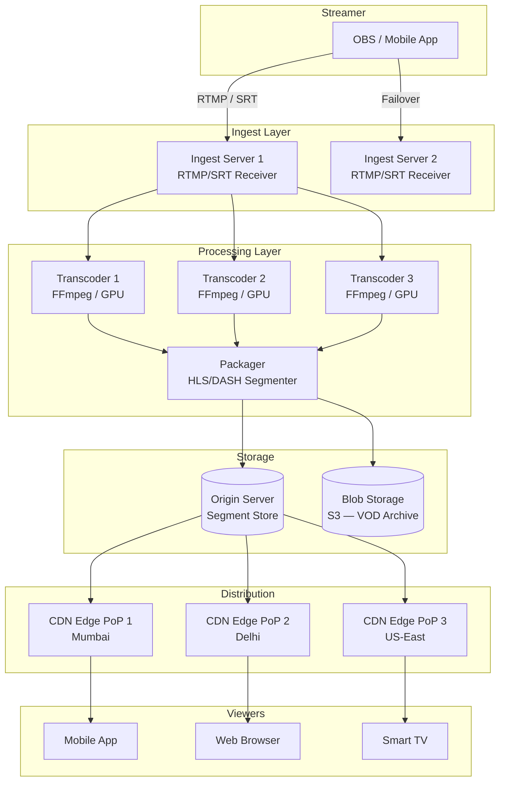
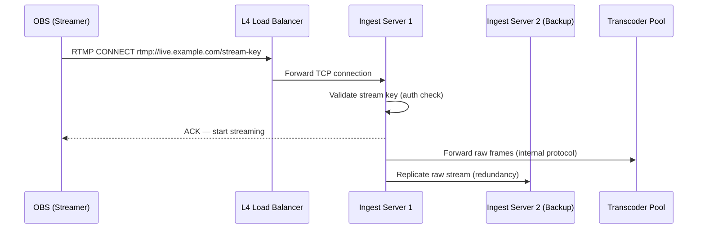
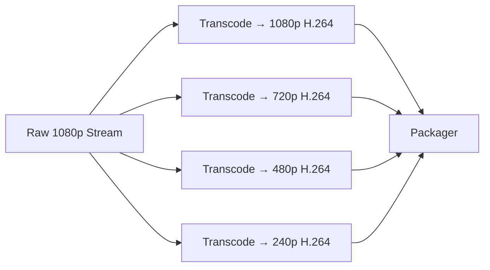
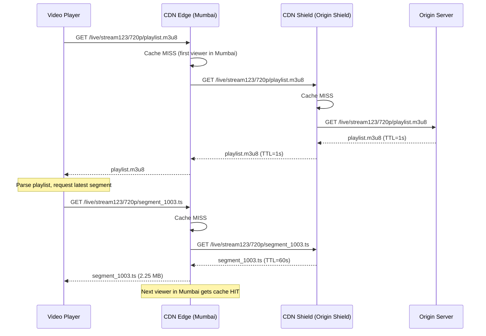
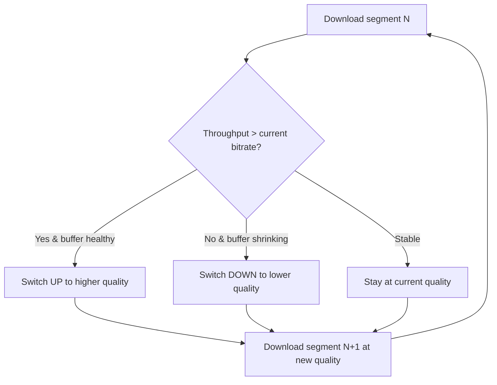
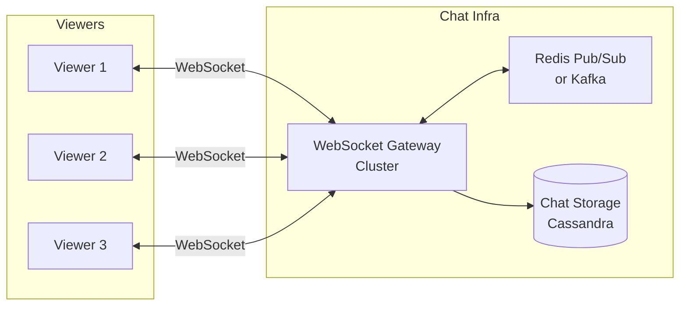
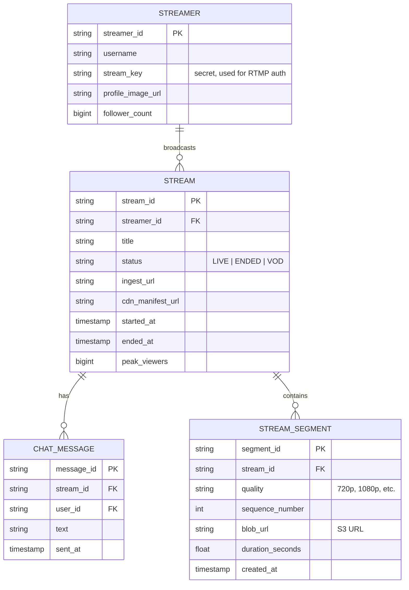
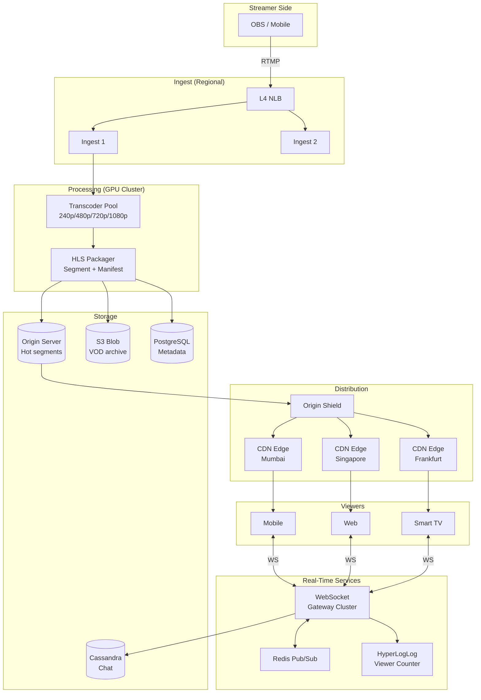

# Live Streaming Platform — System Design (HLD)

*Think: Twitch / YouTube Live / Instagram Live / Hotstar during IPL*

## Quick Summary (TL;DR)

- A live stream is an **ingest → transcode → distribute → playback** pipeline. The streamer pushes via RTMP; viewers pull via HLS/DASH from a CDN.
- The hardest problems are **low latency at massive scale** (millions of concurrent viewers) and **adaptive bitrate** for heterogeneous devices/networks.
- CDN edge servers do the heavy lifting for distribution — your origin never serves viewers directly at scale.
- Chat, reactions, and viewer counts are separate real-time systems layered on top — don't mix them into the video pipeline.
- Key numbers to remember: ~5-30s latency for HLS, ~2-5s for LL-HLS/LL-DASH, sub-1s for WebRTC (but WebRTC doesn't scale beyond thousands without an SFU mesh).

---

## Real-World Analogy

Imagine a **cricket stadium with a giant screen**.

1. The **camera crew** (streamer) captures the live match and sends the feed to a **production truck** (ingest server) parked outside the stadium.
2. The production truck **encodes the feed** into multiple qualities — 4K for the big screen, 1080p for TV, 480p for mobile (transcoding).
3. The encoded feeds are sent to **satellite dishes** (CDN edge servers) positioned across the country.
4. Each **viewer's TV/phone** (player) picks the best quality their bandwidth supports (adaptive bitrate) and pulls the stream from the nearest satellite dish (edge).

The crowd **cheering** (chat/reactions) is a completely separate audio system from the match broadcast.

---

## 1. Functional Requirements

| Requirement | Details |
|---|---|
| Stream upload | Streamer broadcasts live video + audio from OBS/phone/browser |
| Multi-quality playback | Viewers watch in 240p/480p/720p/1080p/4K based on network |
| Adaptive bitrate | Player switches quality seamlessly mid-stream |
| Low latency | < 10 seconds glass-to-glass (camera to viewer screen) |
| Live chat | Real-time text messages synced with the stream |
| Viewer count | Real-time concurrent viewer count |
| DVR / Rewind | Viewer can rewind and catch up during a live stream |
| VOD conversion | After stream ends, save as on-demand video |

## 2. Non-Functional Requirements

| Requirement | Target |
|---|---|
| Scale | 10M+ concurrent viewers (Hotstar IPL level) |
| Latency | 5-15s for standard HLS; < 5s for low-latency mode |
| Availability | 99.99% during live events (downtime = lost revenue) |
| Fault tolerance | Stream must not drop if one transcoder/edge fails |

---

## 3. Back-of-the-Envelope Estimation

**Scenario**: IPL final — 10 million concurrent viewers.

### Bandwidth

| Quality | Bitrate | Viewers (%) | Bandwidth |
|---|---|---|---|
| 240p | 0.5 Mbps | 10% (1M) | 0.5 Tbps |
| 480p | 1.5 Mbps | 30% (3M) | 4.5 Tbps |
| 720p | 3 Mbps | 40% (4M) | 12 Tbps |
| 1080p | 6 Mbps | 18% (1.8M) | 10.8 Tbps |
| 4K | 15 Mbps | 2% (200K) | 3 Tbps |
| **Total** | | **10M** | **~30.8 Tbps** |

No single origin can serve 30+ Tbps. This is why **CDN is not optional — it's the entire distribution strategy**.

### Storage (for DVR + VOD)

- 1 hour stream at all qualities ≈ 3 GB/hour (combined bitrates, segmented)
- 10,000 concurrent streams × 2 hours avg = 60 TB/day
- Retention: 30 days VOD = ~1.8 PB (blob storage like S3)

### Segment Math (HLS)

- Segment duration: 6 seconds (standard) or 2 seconds (low-latency)
- For 720p @ 3 Mbps: each 6s segment = 3 Mbps × 6s = 18 Mb = 2.25 MB
- 10M viewers requesting 1 segment every 6 seconds = **~1.67M requests/second to CDN**

---

## 4. High-Level Architecture



---

## 5. Deep Dive: The Video Pipeline

### Step 1 — Ingest (Streamer → Your Servers)

The streamer sends raw video to your **ingest servers**.

| Protocol | Latency | Use Case |
|---|---|---|
| **RTMP** | ~1-3s | Industry standard for ingest. OBS default. Adobe Flash-era but still dominant. |
| **SRT** (Secure Reliable Transport) | ~1-2s | Better than RTMP over lossy networks. Used by broadcast industry. |
| **WebRTC** | < 1s | Ultra-low latency ingest from browser. Complex to scale. |
| **RTSP** | ~1-2s | IP cameras, surveillance. Rarely used for social live streaming. |

**Architecture decisions**:
- Run multiple ingest servers behind a **regional load balancer** (L4/NLB — RTMP is TCP-based).
- On connection, assign the streamer to the least-loaded ingest server.
- **Redundancy**: Accept the stream on 2 ingest servers simultaneously. If one dies, the other continues without interruption (active-active ingest).



### Step 2 — Transcoding (Raw → Multiple Qualities)

The raw stream (often 1080p or 4K) is transcoded into an **Adaptive Bitrate (ABR) ladder**.

**ABR Ladder Example**:

| Label | Resolution | Bitrate | FPS |
|---|---|---|---|
| 4K | 3840×2160 | 15 Mbps | 30 |
| 1080p | 1920×1080 | 6 Mbps | 30 |
| 720p | 1280×720 | 3 Mbps | 30 |
| 480p | 854×480 | 1.5 Mbps | 30 |
| 240p | 426×240 | 0.5 Mbps | 30 |

**Architecture decisions**:
- Use **GPU-based transcoders** (NVIDIA NVENC) for real-time encoding. CPU-based (x264/x265) is too slow for live.
- Each quality level runs as a **separate transcoding task** — parallelize across machines.
- **Codec**: H.264 (universal compatibility) or H.265/HEVC (50% smaller files, but slower encode and not all browsers support it). AV1 is the future but too slow for real-time live transcoding today.
- **Keyframe alignment**: All quality levels must have keyframes (I-frames) at exactly the same timestamps. This is critical — without it, ABR switching will glitch.



### Step 3 — Packaging (Transcoded Frames → HLS/DASH Segments)

The **packager** takes the transcoded output and chops it into small segments (2-6 seconds each) with a **manifest file** that tells the player what segments are available.

**HLS (HTTP Live Streaming)**:
- Apple's protocol. Universally supported (iOS, Android, web, Smart TVs).
- Produces `.m3u8` manifest + `.ts` (or `.fmp4`) segments.
- Standard segment: 6 seconds → ~10-30 second latency (player buffers 3+ segments).
- **LL-HLS** (Low-Latency HLS): Partial segments (0.3-1s) + blocking playlist reload → 2-5 second latency.

**DASH (Dynamic Adaptive Streaming over HTTP)**:
- Open standard (MPEG). Similar to HLS but uses `.mpd` manifest + `.m4s` segments.
- Supported everywhere except iOS Safari (which only supports HLS natively).

**Example HLS Manifest** (`master.m3u8`):
```
#EXTM3U
#EXT-X-STREAM-INF:BANDWIDTH=6000000,RESOLUTION=1920x1080
1080p/playlist.m3u8
#EXT-X-STREAM-INF:BANDWIDTH=3000000,RESOLUTION=1280x720
720p/playlist.m3u8
#EXT-X-STREAM-INF:BANDWIDTH=1500000,RESOLUTION=854x480
480p/playlist.m3u8
#EXT-X-STREAM-INF:BANDWIDTH=500000,RESOLUTION=426x240
240p/playlist.m3u8
```

**Quality-level playlist** (`720p/playlist.m3u8`):
```
#EXTM3U
#EXT-X-TARGETDURATION:6
#EXT-X-MEDIA-SEQUENCE:1001
#EXTINF:6.0,
segment_1001.ts
#EXTINF:6.0,
segment_1002.ts
#EXTINF:6.0,
segment_1003.ts
```

The player reads the master manifest, picks a quality, then continuously fetches the latest segments from that quality's playlist.

### Step 4 — Distribution (Origin → CDN → Viewer)



**CDN architecture decisions**:
- **Manifest TTL = 1-2 seconds** (must refresh frequently so player discovers new segments).
- **Segment TTL = 60+ seconds** (segments are immutable once created — cache aggressively).
- **Origin Shield** is critical: without it, every edge PoP hits your origin independently. With shield, only 1 request per segment reaches origin.
- For 10M viewers: CDN handles 99.9%+ of requests. Origin sees maybe ~1000 req/s (shield-filtered).

### Step 5 — Playback (Adaptive Bitrate Switching)

The player continuously monitors:
- **Download throughput**: How fast segments download
- **Buffer level**: How many seconds of video are buffered ahead



The switch happens at **segment boundaries** — that's why keyframe alignment matters.

---

## 6. Live Chat System

Chat is a **separate real-time system** — don't route chat messages through the video pipeline.



**Scaling challenges at 10M viewers**:
- 10M WebSocket connections = ~100 WebSocket gateway servers (each handles ~100K connections).
- **Fan-out problem**: 1 chat message must reach 10M viewers. You can't do this naively.

**Solutions for massive fan-out**:
| Approach | How It Works | Scale |
|---|---|---|
| **Server-side fan-out** | Each WS server subscribes to Redis Pub/Sub channel for the stream. Pub/Sub broadcasts to all servers; each server pushes to its connected viewers. | ~100K-1M viewers |
| **Batched fan-out** | Batch chat messages (e.g., send last 5 messages every 500ms instead of individually). Reduces WS writes by 5x. | ~1M-10M viewers |
| **Client-side polling** | For ultra-large streams, switch from push (WebSocket) to pull (HTTP polling every 2-3s). Players fetch latest N messages. CDN-cacheable. | 10M+ viewers |
| **Tiered rooms** | Split 10M viewers into 1000 "rooms" of 10K each. Each room gets a subset of messages. Viewers see a representative sample, not all messages. | 10M+ viewers (Twitch uses this) |

---

## 7. Viewer Count

**Naive**: Count WebSocket connections. Problem: inaccurate (some watch via HLS without WS), double-counts reconnections.

**Better approach**:
1. Each CDN edge sends **access logs** (or HLS playlist request counts) to a log aggregation service (Kafka).
2. A **stream processor** (Flink / Kafka Streams) deduplicates by viewer ID (cookie/device ID) using a **HyperLogLog** data structure.
3. HyperLogLog gives ~0.8% error with only 12 KB of memory per stream — perfect for "10.2M viewers" display.
4. Publish count to viewers via the chat WebSocket channel every 5-10 seconds.

---

## 8. DVR / Rewind & VOD Conversion

### DVR (Live Rewind)

The player can seek backward during a live stream. This is why you store segments even during live streaming.

- **Sliding window DVR**: Keep the last 2 hours of segments on the origin/CDN. Older segments expire.
- The HLS playlist grows as a sliding window. Player can request older `#EXT-X-MEDIA-SEQUENCE` values.

### VOD Conversion

When the stream ends:
1. **Concatenate all segments** into a single MP4 file (using FFmpeg `concat demuxer`).
2. **Re-transcode** if needed (e.g., generate additional qualities, add proper metadata).
3. Store in **blob storage** (S3) with a new HLS manifest pointing to the archived segments.
4. Update the **metadata database** — stream status changes from `LIVE` to `VOD`.

---

## 9. Database Schema



**Database choices**:
- **Stream & Streamer metadata**: PostgreSQL (relational, ACID, small dataset).
- **Chat messages**: Cassandra (write-heavy, time-series, partition by `stream_id`).
- **Segments**: Metadata in PostgreSQL, actual `.ts` files in S3/blob storage.

---

## 10. Failure Handling

| Failure | Impact | Mitigation |
|---|---|---|
| **Ingest server dies** | Stream drops | Active-active ingest; streamer connects to backup automatically (RTMP failover URL) |
| **Transcoder dies** | One quality level missing | Transcoder pool with auto-replacement; packager skips missing quality temporarily |
| **Origin server dies** | CDN can't fetch new segments | Origin HA cluster (active-passive); CDN serves stale segments briefly |
| **CDN edge dies** | Viewers in that region affected | CDN auto-routes to next nearest PoP (built into CDN) |
| **Streamer's internet drops** | Stream freezes | Player shows "streamer is reconnecting" slate; ingest server holds session for 30s |

---

## 11. Latency Breakdown

Where does the 5-30 second glass-to-glass latency come from?

| Stage | Latency | Explanation |
|---|---|---|
| Camera capture + encoding | ~0.5-1s | Hardware encoder buffers frames |
| Network: streamer → ingest | ~0.1-0.5s | Depends on streamer's upload speed |
| Transcoding | ~1-3s | GPU encode of each quality level |
| Packaging (segmenting) | **3-6s** | Must wait for a full segment (6s for HLS) — **this is the biggest contributor** |
| CDN propagation | ~0.1-0.5s | Origin → shield → edge |
| Player buffering | **6-18s** | Player buffers 2-3 segments before starting playback |
| **Total (standard HLS)** | **~10-30s** | |
| **Total (LL-HLS)** | **~2-5s** | Partial segments (0.3s) + reduced buffer |
| **Total (WebRTC)** | **< 1s** | No segmenting, no buffering |

**Key insight for interviews**: The latency is NOT in the network — it's in **segmenting + player buffering**. That's why LL-HLS uses partial segments.

---

## 12. Protocol Comparison (Delivery to Viewer)

| Protocol | Latency | Scale | Compatibility | Use Case |
|---|---|---|---|---|
| **HLS** | 10-30s | Unlimited (HTTP/CDN) | Universal | Standard live streaming (YouTube, Twitch) |
| **LL-HLS** | 2-5s | Unlimited (HTTP/CDN) | iOS 14+, modern players | Low-latency live (sports, auctions) |
| **DASH** | 10-30s | Unlimited (HTTP/CDN) | Everything except iOS Safari | Alternative to HLS |
| **LL-DASH (CMAF)** | 2-5s | Unlimited (HTTP/CDN) | Android, web | Low-latency alternative |
| **WebRTC** | < 1s | ~Thousands (P2P/SFU) | Browsers, native apps | Video calls, ultra-low-latency (betting) |
| **WebSocket + MSE** | 1-3s | Moderate | Modern browsers | Custom low-latency players |

**Interview answer**: "HLS for standard live, LL-HLS when latency matters, WebRTC only for very small audiences or interactive use cases."

---

## 13. Complete System Architecture



---

## Interview Angles

1. **"Design a live streaming platform like Twitch"** — Start with the 4-stage pipeline (ingest → transcode → package → CDN). Emphasize that CDN handles 99.9% of viewer traffic. Mention ABR ladder and HLS.

2. **"How do you handle 10M concurrent viewers?"** — CDN is the answer. Origin shield reduces origin load to ~1000 req/s. Do the bandwidth math (30+ Tbps). Mention multi-CDN strategy for redundancy.

3. **"How do you reduce latency?"** — The bottleneck is segmenting + player buffering, not network. Use LL-HLS with partial segments (0.3s). Reduce player buffer from 3 segments to 1. Trade-off: more rebuffering risk.

4. **"How does live chat scale?"** — Separate system from video. WebSocket gateway cluster + Redis Pub/Sub. For massive streams, batch messages or switch to client-side polling (CDN-cacheable). Tiered rooms for Twitch-scale.

5. **"What if the transcoder fails mid-stream?"** — Transcoder pool with health checks. Failed quality is temporarily missing from ABR ladder; player switches to next available quality. Auto-replace transcoder.

6. **"HLS vs WebRTC?"** — HLS scales infinitely via CDN but has 10-30s latency. WebRTC is sub-second but requires SFU/MCU infrastructure and maxes out at thousands. LL-HLS is the middle ground (2-5s, CDN-scalable).

7. **"How do you convert live to VOD?"** — Segments are already stored in S3 during live. After stream ends, concat segments, optionally re-transcode, generate new manifest, update metadata DB.

---

## Traps

| Trap | Why It's Wrong | Correct Answer |
|---|---|---|
| "Use WebRTC for everything" | WebRTC doesn't scale beyond thousands without expensive SFU mesh. CDN doesn't work with WebRTC. | HLS/DASH for broadcast; WebRTC only for interactive or ultra-low-latency niche. |
| "Stream video through WebSockets" | WS is for signaling/chat, not bulk video data. No CDN caching, no ABR, terrible at scale. | Use HTTP-based streaming (HLS/DASH) for video delivery. |
| "Origin server handles all viewer requests" | Even a beefy origin dies at 10K concurrent viewers, let alone 10M. | CDN edge servers handle all viewer traffic. Origin only serves the CDN. |
| "One transcoder per stream" | Single point of failure; also wastes resources for low-viewer streams. | Shared transcoder pool with health checks and auto-failover. |
| "Store chat in the same DB as stream metadata" | Chat is write-heavy (thousands of messages/second), metadata is read-heavy. Different access patterns. | Chat in Cassandra (write-optimized), metadata in PostgreSQL. |
| "Latency is caused by the network" | Network adds < 1 second. The real culprit is segment duration (6s) + player buffer (2-3 segments). | Reduce segment size (LL-HLS partial segments) and player buffer. |
| "Just add more CDN servers to reduce latency" | CDN reduces delivery latency, but the glass-to-glass latency is dominated by encoding + packaging. | Optimize the pipeline: faster encoder, shorter segments, smaller player buffer. |
| "All viewers get the same quality" | Viewers have different bandwidths and devices. Fixed quality = buffering for slow connections, waste for fast ones. | Adaptive Bitrate (ABR) with multiple quality levels. |

---

## Key Numbers to Remember

| Metric | Value |
|---|---|
| HLS segment duration | 6 seconds (standard), 2 seconds (short), 0.3 seconds (LL-HLS partial) |
| HLS glass-to-glass latency | 10-30 seconds |
| LL-HLS latency | 2-5 seconds |
| WebRTC latency | < 1 second |
| CDN PoPs (major providers) | 200-400 globally |
| Typical ABR ladder | 4-6 quality levels (240p to 1080p/4K) |
| H.264 1080p bitrate | 4-6 Mbps |
| Hotstar IPL peak | 25.3M concurrent viewers (2023) |
| Twitch peak concurrent | ~7M concurrent viewers |
| WebSocket connections per server | ~50K-100K |
