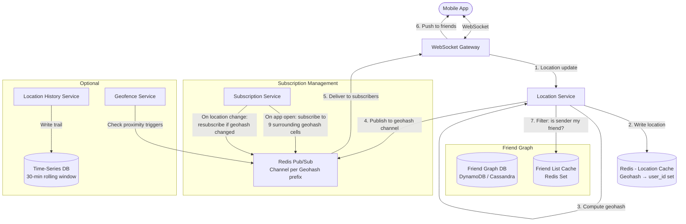

# Case Study: Nearby Friends / Real-Time Location Sharing (System Design)

## Quick Summary (TL;DR)
- **Goal**: Design a real-time system that shows users which of their friends are nearby (within a configurable radius, e.g., 5 km) and their live location — like Facebook Nearby Friends, Snap Map, or Find My Friends.
- **Scale**: 100M DAU with location sharing enabled, 10M concurrent active users broadcasting location every 30 seconds.
- **Key Decisions**:
  - Use **Geohash-based spatial indexing** to efficiently find nearby users without scanning all 10M active locations.
  - Use **Redis Pub/Sub channels per Geohash prefix** for real-time location broadcast — a user subscribes to surrounding Geohash cells and receives friend updates instantly.
  - Use **WebSocket connections** for bidirectional push — server pushes friend location updates without polling.
  - Keep the **location store in-memory (Redis)** — locations are ephemeral (stale after 30 seconds), no need for durable database storage.

---

## Noob Jargon Buster

* **Geohash**: A system that encodes a latitude/longitude pair into a short string (e.g., `9q8yyk`). Nearby locations share the same prefix — `9q8yy` covers a ~1 km² area. Longer strings = more precision. This turns a 2D spatial query ("who is within 5 km?") into a simple string prefix query.
* **Geohash Precision Table**:
  | Length | Cell Size | Use Case |
  |--------|-----------|----------|
  | 4 chars | ~39 km × 19 km | Country-level |
  | 5 chars | ~5 km × 5 km | City neighborhood |
  | 6 chars | ~1.2 km × 0.6 km | Street-level |
  | 7 chars | ~150 m × 150 m | Building-level |
* **Quadtree**: A tree data structure that recursively divides a 2D space into four quadrants. Dense areas (cities) are subdivided more than sparse areas (oceans). Alternative to Geohash for spatial indexing.
* **Geofence**: A virtual geographic boundary. When a user enters or exits the boundary, the system triggers an event (e.g., "Your friend Alice just arrived at the mall").
* **Haversine Formula**: Calculates the great-circle distance between two lat/lng points on a sphere. Used for the final precise distance check after the coarse Geohash filter.

---

## 1. Requirements & Scope

### Functional
1. **Toggle Sharing**: Users can opt-in/opt-out of sharing their location.
2. **Nearby Friends List**: Show friends within a configurable radius (default 5 km) with their distance and last-known location.
3. **Real-Time Updates**: Friend locations update on the map every 30 seconds without manual refresh.
4. **Location History** (optional): Show a friend's recent path/trail for the last 30 minutes.
5. **Geofence Alerts** (optional): "Alice just arrived near you" push notification.

### Non-Functional
- **Low latency**: Location updates must propagate to friends within 1 second.
- **Battery efficiency**: Location broadcasting should not excessively drain the mobile battery.
- **Privacy**: Users must explicitly opt-in. Location data is ephemeral (not stored long-term). Users can hide from specific friends.
- **Scale**: 10M concurrent active broadcasters, each with ~400 friends on average.

---

## 2. Scale Estimation (The Math)

### Location Update Throughput
- **Active broadcasters**: 10M concurrent users.
- **Update frequency**: Every 30 seconds.
- **Update QPS**: $\frac{10,000,000}{30} \approx 333,000 \text{ location updates/sec}$.

### Fan-out — How Many Friend Updates Per Second?
- Each user has ~400 friends, but only ~10% are concurrently active and sharing.
- **Active friends per user**: ~40.
- When User A updates their location, it must be pushed to ~40 friends.
- **Total fan-out**: $333,000 \text{ updates/sec} \times 40 \text{ friends} = 13.3\text{M push messages/sec}$.

### Storage
- **Location record**: `{user_id (8B), lat (8B), lng (8B), timestamp (8B), geohash (6B)}` ≈ 40 bytes.
- **10M active users × 40 bytes**: ~400 MB in-memory — **fits in a single Redis instance**.
- No durable storage needed — locations are ephemeral. If Redis restarts, users re-broadcast within 30 seconds.

### WebSocket Connections
- **10M concurrent WebSocket connections** across the fleet.
- Each WebSocket gateway server holds ~50,000 connections.
- **Gateway servers needed**: $\frac{10,000,000}{50,000} = 200 \text{ servers}$.

---

## 3. High-Level Architecture



---

## 4. Core Design Components

### A. Geohash-Based Spatial Indexing

The fundamental problem: given User A's location, find all friends within 5 km. Scanning all 10M active users is O(N) — too slow.

**Geohash converts this into a string prefix lookup**:

```
User A's location: (37.7749, -122.4194) → Geohash: "9q8yyk"

Geohash grid (precision 6 = ~1.2 km cells):

  ┌────────┬────────┬────────┐
  │ 9q8yym │ 9q8yyn │ 9q8yyp │
  ├────────┼────────┼────────┤
  │ 9q8yyk │ 9q8yys │ 9q8yyt │  ← User A is in "9q8yyk"
  ├────────┼────────┼────────┤
  │ 9q8yyh │ 9q8yyj │ 9q8yy7 │
  └────────┴────────┴────────┘

To find nearby users:
  1. Compute User A's geohash: "9q8yyk"
  2. Compute 8 neighboring cells: "9q8yym", "9q8yyn", ..., "9q8yy7"
  3. Query Redis: SMEMBERS geohash:9q8yyk, SMEMBERS geohash:9q8yym, ... (9 queries)
  4. Union all user_ids from the 9 cells
  5. Intersect with User A's friend list (from friend cache)
  6. For each matching friend, compute precise Haversine distance
  7. Filter: keep only friends within 5 km radius
  8. Return sorted by distance
```

**Why 9 cells?** A user near the edge of their geohash cell has friends in the adjacent cell that are closer than friends on the opposite side of their own cell. Checking 9 cells (center + 8 neighbors) eliminates edge effects.

**Geohash precision for 5 km radius**: Use **precision 4** (~39 km × 19 km cells) or **precision 5** (~5 km × 5 km cells). At precision 5, 9 cells cover ~15 km × 15 km — safely contains a 5 km radius. Use precision 6 for 1 km radius features.

### B. Redis Data Model

```
# 1. User Location (Hash)
HSET user_loc:{user_id} lat 37.7749 lng -122.4194 geohash 9q8yyk ts 1717142400
EXPIRE user_loc:{user_id} 60   # Auto-expire if user stops broadcasting

# 2. Geohash Cell Membership (Set)
SADD geohash:9q8yyk {user_id}      # Add user to their geohash cell
EXPIRE geohash:9q8yyk 120          # Cell expires if all users leave

# 3. When user moves to new geohash cell:
SREM geohash:9q8yyk {user_id}      # Remove from old cell
SADD geohash:9q8yys {user_id}      # Add to new cell

# 4. Friend List (Set) — cached from friend graph DB
SADD friends:{user_id} {friend_1} {friend_2} ... {friend_400}

# 5. Finding nearby friends:
cells = [9q8yyk, 9q8yym, 9q8yyn, ...]  # center + 8 neighbors
SUNIONSTORE temp:nearby cells[0] cells[1] ... cells[8]   # union all users in 9 cells
SINTER temp:nearby friends:{user_id}                      # intersect with friend list
# Result: friend IDs that are in nearby cells
```

**Memory estimate**:
- 10M user locations × 40 bytes = 400 MB
- 10M geohash memberships × 16 bytes = 160 MB
- Total: **~600 MB** — comfortably fits in a single Redis instance, but shard for throughput.

### C. Real-Time Push — Pub/Sub per Geohash Channel

Instead of each user polling "where are my friends?" every 30 seconds, use a push model:

```
When User A updates location:
  1. Location Service writes to Redis
  2. Location Service publishes to Redis Pub/Sub:
     PUBLISH geohash_channel:9q8yy {user_id: A, lat: 37.77, lng: -122.41}
     (Note: using precision 5 prefix for channel = ~5km coverage)

Subscriber setup (when User B opens the app):
  1. Compute User B's geohash prefix (precision 5): "9q8yy"
  2. Compute 8 neighboring prefixes
  3. SUBSCRIBE geohash_channel:9q8yy geohash_channel:9q8yz ... (9 channels)

When User B receives a Pub/Sub message:
  1. Check: is the sender in my friend list? (local cache lookup)
  2. If yes: compute Haversine distance
  3. If within radius: push location update to User B via WebSocket
  4. If not a friend or out of radius: discard silently
```

**Why Pub/Sub per geohash instead of per user?**
- Per-user channels: 10M channels, each user publishes to 40 friend channels = 13.3M PUBLISH/sec. Redis Pub/Sub can't handle this.
- Per-geohash channels: ~1M geohash cells worldwide at precision 5. Each location update publishes to 1 channel. Subscribers filter locally. Total: 333K PUBLISH/sec — manageable.

**Channel resubscription**: When User B moves to a new geohash cell, unsubscribe from old 9 channels, subscribe to new 9 channels. This happens infrequently (only when crossing a ~5 km cell boundary).

### D. WebSocket Gateway Layer

```
                    ┌─────────────────────────┐
                    │    Load Balancer (L4)     │
                    │  Sticky sessions by       │
                    │  user_id hash             │
                    └──────────┬──────────────┘
                               │
            ┌──────────────────┼──────────────────┐
            ▼                  ▼                  ▼
    ┌──────────────┐  ┌──────────────┐  ┌──────────────┐
    │ WS Gateway 1 │  │ WS Gateway 2 │  │ WS Gateway 3 │
    │ 50K conns    │  │ 50K conns    │  │ 50K conns    │
    └──────┬───────┘  └──────┬───────┘  └──────┬───────┘
           │                 │                 │
           │     Each gateway subscribes to    │
           │     geohash channels for its      │
           │     connected users               │
           │                 │                 │
           └────────┬────────┘                 │
                    ▼                          │
            ┌──────────────┐                   │
            │ Redis Pub/Sub │ ◄────────────────┘
            │ Cluster       │
            └──────────────┘
```

- Each gateway server holds ~50K WebSocket connections.
- The gateway subscribes to the Redis Pub/Sub channels for the union of all its connected users' geohash neighborhoods.
- When a Pub/Sub message arrives, the gateway checks which of its local connections care about this update (friend list + radius check), then pushes via WebSocket.
- **Optimization**: The gateway maintains an in-memory map of `geohash_channel → [connected_user_ids]` for fast local routing.

### E. Handling Geohash Boundary Movement

When User B moves from geohash `9q8yy` to `9q8yz`:

```
1. Client detects geohash prefix changed (computed locally on the phone)
2. Client sends WebSocket message: { "type": "location_update", "lat": ..., "lng": ..., "old_geohash": "9q8yy", "new_geohash": "9q8yz" }
3. Location Service:
   a. SREM geohash:9q8yyk {user_B}     # remove from old cell
   b. SADD geohash:9q8yzd {user_B}     # add to new cell
   c. PUBLISH geohash_channel:9q8yz ... # publish to new channel
4. WS Gateway:
   a. UNSUBSCRIBE old 9 channels
   b. SUBSCRIBE new 9 channels
```

**Optimization — hysteresis**: Don't resubscribe if the user is oscillating near a cell boundary (e.g., walking back and forth across the line). Only resubscribe if the user stays in the new cell for >60 seconds.

### F. Battery Optimization — Adaptive Location Update Frequency

Continuously broadcasting GPS every 30 seconds drains mobile battery. Use adaptive frequency:

```
Scenario                          Update Interval    GPS Mode
────────────────────────────────  ─────────────────  ──────────────
App in foreground, map visible    15 seconds          High accuracy GPS
App in foreground, list view      30 seconds          Balanced
App in background                 5 minutes           Cell tower / WiFi only
User stationary (no movement)     2 minutes           Significant location change API
User moving (walking/driving)     15 seconds          High accuracy GPS
No nearby friends detected        5 minutes           Low power
```

- **iOS**: Use `CLLocationManager` with `startMonitoringSignificantLocationChanges()` for background — wakes the app only on ~500m displacement.
- **Android**: Use `FusedLocationProviderClient` with `PRIORITY_BALANCED_POWER_ACCURACY` for background.
- **Server-side**: If a user's location hasn't changed (same geohash cell), don't re-publish to Pub/Sub. Reduces unnecessary fan-out.

---

## 5. Geohash vs. Quadtree — When to Use Which

| Aspect | Geohash | Quadtree |
|--------|---------|----------|
| Structure | String encoding (e.g., "9q8yyk") | In-memory tree, 4 children per node |
| Storage | Redis / database friendly (string keys) | Must be held in application memory |
| Neighbor lookup | Simple: compute 8 neighbor strings | Tree traversal across branches |
| Dynamic density | Fixed grid (same size cells everywhere) | Adapts: denser subdivision in cities |
| Update cost | O(1) — just change the key | O(log N) — rebalance the tree |
| Precision | Discrete levels (precision 4,5,6...) | Continuous (subdivide as needed) |
| Best for | Persistent storage, Redis integration, distributed systems | In-memory spatial indices, uneven density |

**Decision**: Use **Geohash** because it maps naturally to Redis keys and Pub/Sub channels. Quadtrees are better when density varies dramatically (e.g., Uber surge pricing needs fine granularity in Manhattan, coarse in rural Kansas), but for nearby friends, uniform geohash cells work well.

---

## 6. Why Choose This? (Defending Your Architecture)

### Why use Geohash instead of brute-force distance calculation?
* **Answer**: "Brute-force computes Haversine distance from User A to all 10M active users — that's 10M floating-point calculations per update, 333K times per second. Geohash reduces this to a string prefix lookup across 9 cells, returning only users in the ~15 km × 15 km neighborhood — typically a few hundred users. We then intersect with the friend list (Redis set intersection, O(min(M,N))) and only compute Haversine on the ~5-10 matching friends. The query drops from O(10M) to O(100) per user."

### Why use Redis Pub/Sub per geohash instead of per user?
* **Answer**: "With 10M active users and 40 active friends each, per-user channels require 13.3M PUBLISH operations per second — each update fans out to 40 channels. Per-geohash channels (precision 5, ~1M cells) require only 333K PUBLISH/sec — one publish per location update, to the user's geohash channel. Subscribers in the area receive all updates for their neighborhood and filter locally by friend list. The trade-off is that subscribers receive non-friend updates (wasted messages), but the local friend-list filter is O(1) in a hash set, and the bandwidth of discarded messages is negligible."

### Why keep locations in Redis instead of a database?
* **Answer**: "Location data is inherently ephemeral — a location from 60 seconds ago is stale and useless. There's no point in writing it to durable storage, paying for disk I/O and WAL overhead for data that expires in 30 seconds. Redis holds the entire working set (10M users × 40 bytes = 400 MB) in memory, serves reads in microseconds, and uses key TTLs to auto-expire stale locations. If Redis restarts, users re-broadcast within 30 seconds — no data loss that matters."

### Why use WebSockets instead of polling?
* **Answer**: "With polling, each client would request 'where are my friends?' every 5 seconds. That's 10M users × 0.2 req/sec = 2M requests/sec of pure overhead, and updates have 5-second latency. WebSockets push updates within 1 second of a friend moving, using a persistent TCP connection. The connection is already open for sending location updates upstream, so the server piggybacks friend updates downstream at zero additional connection cost."

---

## 7. SDE-2 Deep Dives & Trade-offs

### A. Privacy — Granular Control

Privacy is the most sensitive aspect. Users must have fine-grained control:

```
Privacy settings per user:
  - sharing_enabled: boolean           (master toggle)
  - share_with: ALL_FRIENDS | CUSTOM_LIST | NOBODY
  - hidden_from: [user_id, ...]        (block specific friends)
  - precision: EXACT | APPROXIMATE     (share neighborhood, not exact pin)
  - schedule: { start: "09:00", end: "22:00" }  (auto-disable at night)

Approximate mode:
  - Instead of exact lat/lng, snap to geohash center at precision 5 (~5 km)
  - Friend sees "Alice is in SoMa neighborhood" not "Alice is at 123 Main St"
```

**Server enforcement**: The Location Service checks privacy settings *before* publishing to Pub/Sub. If User A has hidden from User B, the update is either not published or a per-friend filter is applied at the gateway level.

### B. Scaling Redis Pub/Sub — Sharding Channels

Single Redis instance handles ~1M Pub/Sub messages/sec. We need 333K publishes + fan-out to subscribers. For headroom:

```
Shard by geohash prefix:
  - Shard 0: geohash_channel:0* through geohash_channel:7*
  - Shard 1: geohash_channel:8* through geohash_channel:f*
  (Or consistent hash on the channel name)

Each shard handles ~166K PUBLISH/sec — well within limits.
```

**Alternative to Redis Pub/Sub**: For larger scale, consider **Kafka** with geohash-based topic partitions. Kafka handles higher throughput and provides replay capability. Trade-off: higher latency (10-100ms) vs Redis Pub/Sub (~1ms).

### C. The "Friend of Friend" Edge Case

User A and User B are friends. User B and User C are friends. User A and User C are NOT friends.

- User C updates location → published to geohash channel.
- User A is subscribed to the same geohash channel (because A is nearby).
- User A receives C's location update.

**This is fine**: The gateway checks the friend list and discards C's update for User A. C's exact location is never exposed to non-friends. The Pub/Sub message contains only `user_id + lat/lng` — the gateway filters before pushing to the WebSocket.

### D. Geofence Alerts — "Friend Arrived Near You"

```
User A sets a geofence:
  "Notify me when any friend is within 500m of Times Square"

Implementation:
  1. Store geofence: { user_id: A, center: (40.758, -73.985), radius: 500m, geohash: "dr5ru7" }
  2. Location Service checks active geofences against incoming updates:
     - When Friend B updates location to geohash "dr5ru7*":
       a. Haversine distance(B.location, Times Square) < 500m?
       b. Is B in A's friend list?
       c. If both: push notification to A: "Bob just arrived near Times Square!"
  3. Debounce: don't re-notify for the same friend at the same geofence within 1 hour
```

**Efficient geofence matching**: Store geofences in a Redis sorted set keyed by geohash. When a location update arrives, look up geofences in the same geohash cell — O(log N) per cell, not O(total geofences).

### E. Location History Trail

Show a friend's path for the last 30 minutes (e.g., a moving dot trail on the map):

```
Storage: Redis Sorted Set per user
  ZADD trail:{user_id} {timestamp} "{lat},{lng}"
  ZREMRANGEBYSCORE trail:{user_id} -inf {30_minutes_ago}  # rolling window trim

Query: ZRANGEBYSCORE trail:{user_id} {30_minutes_ago} +inf
  → Returns: [(t1, "37.77,-122.41"), (t2, "37.78,-122.42"), ...]
  → Client renders as a polyline on the map
```

- TTL on the key: 35 minutes (auto-cleanup if user stops sharing).
- Each trail entry: ~30 bytes. At 1 update/30 sec over 30 min: 60 entries × 30 bytes = 1.8 KB per user. Negligible memory.

### F. What Happens When a User Goes Offline?

```
1. WebSocket disconnects (detected by gateway within 5 seconds via TCP keepalive)
2. Gateway notifies Location Service: user_id went offline
3. Location Service:
   a. SREM geohash:{cell} {user_id}       # Remove from cell
   b. DEL user_loc:{user_id}              # Delete location
   c. PUBLISH geohash_channel:{cell} { user_id, status: "offline" }
4. Friends' apps receive "offline" event → remove pin from map
5. If the user doesn't reconnect within 60 seconds, Redis TTLs auto-expire anyway (safety net)
```

---

## 8. Summary: Component Decision Table

| Component | Choice | Rationale |
|-----------|--------|-----------|
| Spatial Index | Geohash (precision 5-6) | Maps to Redis keys/Pub/Sub channels; O(1) cell lookup |
| Location Store | Redis Hash + Sets | Ephemeral data; 400 MB total; microsecond reads |
| Real-Time Push | Redis Pub/Sub per geohash channel | 333K publishes/sec; subscribers filter locally |
| Client Connection | WebSocket | Bidirectional push; 1-sec update latency |
| Friend Graph | DynamoDB + Redis Set cache | Frequent reads for filtering; rarely changes |
| Battery Mgmt | Adaptive GPS frequency | Foreground: 15s, background: 5 min, stationary: 2 min |
| Privacy | Server-side filter before publish | Never leak location to non-friends |
| Location History | Redis Sorted Set (30-min window) | Rolling trail; auto-trimmed |

---

## 9. Common Traps & Mitigations

1. **Geohash Edge Problem**: Two users 100m apart but in different geohash cells appear as "not nearby" because the system only checks one cell.
   - *Mitigation*: Always check 9 cells (center + 8 neighbors). This guarantees any point within the radius is covered regardless of cell boundary position.

2. **Pub/Sub Message Storm in Dense Areas**: A concert with 50,000 users in one geohash cell. Every location update fans out to all 50,000 subscribers on that channel.
   - *Mitigation*: Use finer geohash precision (6 or 7) for dense areas, splitting the 50K users across many smaller cells. Alternatively, rate-limit publishes per channel to 1,000/sec and batch multiple updates into a single message.

3. **Stale Location Pins**: User closes the app without explicit "stop sharing." Their pin stays on friends' maps showing an old location.
   - *Mitigation*: Redis key TTL of 60 seconds on `user_loc:{user_id}`. If the client doesn't refresh within 60 seconds, the location auto-expires. WebSocket disconnect triggers immediate cleanup.

4. **GPS Jitter While Stationary**: User is sitting still but GPS fluctuates ±50m, causing constant location updates and geohash cell boundary oscillations.
   - *Mitigation*: Client-side: discard updates with displacement < 100m from last reported location. Server-side: hysteresis on geohash resubscription (wait 60 seconds before switching channels on boundary crossing).

5. **Privacy Leak via Geohash Channel Subscription**: A malicious client subscribes to arbitrary geohash channels to track non-friends.
   - *Mitigation*: The client never subscribes directly to Redis. The WebSocket gateway manages all Pub/Sub subscriptions server-side. The gateway only forwards updates for verified friends (checked against the authenticated user's friend list).

6. **Redis Pub/Sub Message Loss**: Redis Pub/Sub is fire-and-forget — if a subscriber (gateway) is slow, messages are dropped.
   - *Mitigation*: Acceptable for location data — the next update arrives in 30 seconds anyway. If critical (geofence alerts), use Kafka with consumer groups instead of Redis Pub/Sub for guaranteed delivery.
