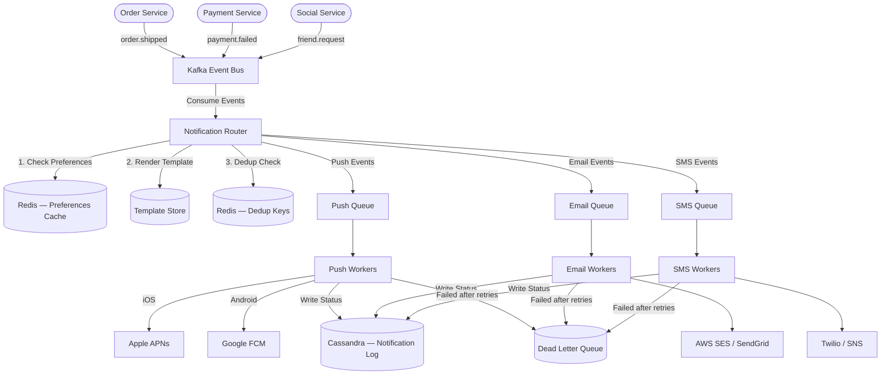

# Case Study: Notification System (System Design)

## Quick Summary (TL;DR)
- **Goal**: Design a system that sends Push, SMS, and Email notifications at scale — triggered by events like payments, promotions, or friend requests.
- **Scale**: 10 Billion notifications/day across all channels. Write throughput: ~120,000 events/sec.
- **Key Decisions**:
  - Use **Kafka** as the central event bus to decouple producers (services) from delivery channels — gives us retry, ordering, and backpressure for free.
  - Use **per-channel worker pools** (Push, SMS, Email) to isolate failures — a slow SMTP provider shouldn't block push deliveries.
  - Use **a Notification Preferences table** so users can opt out per channel and per notification type, checked before every send.
  - Use **rate limiting + deduplication** to prevent notification fatigue and duplicate delivery during retries.

---

## 🤓 Noob Jargon Buster

* **APNs (Apple Push Notification Service)**: Apple's gateway that delivers push notifications to iOS devices. You send a payload to APNs; Apple delivers it to the user's phone.
* **FCM (Firebase Cloud Messaging)**: Google's push notification service for Android and web. Works similarly to APNs.
* **Fan-out**: Taking a single event (e.g., "Order Shipped") and expanding it into multiple notifications — one push, one email, one SMS — each routed to its own delivery pipeline.
* **Idempotency Key**: A unique identifier attached to each notification request so that retries don't result in duplicate sends. If the worker sees the same key twice, it skips the second send.
* **DLQ (Dead Letter Queue)**: A special queue where failed messages land after exhausting all retries. Engineers review these to fix bugs or provider issues.

---

## 1. Requirements & Scope

### Functional
1. **Multi-Channel Delivery**: Support Push (iOS + Android), SMS, and Email.
2. **Event-Triggered**: Services publish events (e.g., `order.shipped`, `payment.failed`); the notification system decides what, where, and how to send.
3. **User Preferences**: Users can enable/disable notifications per channel and per type (e.g., "Email me promotions but don't SMS me").
4. **Template System**: Notifications use pre-defined templates with variable substitution (e.g., "Hi {{name}}, your order {{order_id}} has shipped").
5. **Delivery Tracking**: Track status per notification — Queued → Sent → Delivered → Clicked/Opened.

### Non-Functional
- **At-least-once delivery**: A notification must not be silently lost. Duplicates are tolerable (with dedup) over missed sends.
- **Low Latency for Push**: Push notifications should reach the device within `< 2 seconds` of the triggering event.
- **Scalable**: Handle 10B notifications/day with seasonal spikes (Black Friday, New Year).
- **Fault Tolerant**: A third-party provider outage (e.g., Twilio SMS down) must not cascade to other channels.

---

## 2. Scale Estimation (The Math)

### Throughput (QPS)
- **Daily Notifications**: 10 Billion/day across all channels.
  - Push: 6B, Email: 3B, SMS: 1B.
- **Average QPS**: $\frac{10,000,000,000}{86,400} \approx 115,740 \text{ notifications/sec}$.
- **Peak QPS**: $\approx 250,000 \text{ notifications/sec}$ (flash sales, Black Friday).

### Storage
- **Notification Log Record**: ~200 bytes (notification_id, user_id, channel, template_id, status, timestamps).
- **Daily Storage**: $10\text{B} \times 200 \text{ bytes} = 2 \text{ TB/day}$.
- **30-Day Retention**: $2 \text{ TB} \times 30 = 60 \text{ TB}$ for the hot notification log.
- **Template Store**: Negligible — thousands of templates, a few KB each.

### Memory (Rate Limiter + Dedup)
- **Dedup Window**: Track last 24 hours of notification IDs per user to prevent duplicate sends.
- **The Redis Metadata Trap**: Assume 100M active users receiving ~50 notifications/day = 5 Billion keys.
  - Raw UUID data: $5\text{B keys} \times 16 \text{ bytes (UUID)} = 80 \text{ GB}$.
  - Redis Structural Overhead: In Redis, key-value entries have significant overhead (`dictEntry`, `robj` headers, `sds` string pointers, and memory chunk allocations), totaling **~200 bytes per entry**.
  - Actual Memory Needed: $5\text{B keys} \times 200 \text{ bytes} \approx 1\text{ TB}$ of RAM.
- **SDE-2 Optimization**: Storing 1 TB of RAM in Redis is cost-prohibitive.
  1. Reduce the deduplication window to **1 hour** (the most common retry timeframe) reducing keys to ~200M ($\approx 40\text{ GB}$ RAM with overhead).
  2. Implement an in-memory **Bloom Filter** at the Worker level for space-efficient membership tests.

---

## 3. System API Design

### A. Send Notification (Internal — Service-to-Service)
- **Endpoint**: `POST /v1/notifications/send`
- **Request Payload**:
  ```json
  {
    "user_id": "u_12345",
    "event_type": "order.shipped",
    "channels": ["push", "email"],
    "template_id": "tmpl_order_shipped",
    "template_params": {
      "name": "Rohit",
      "order_id": "ORD-78901",
      "tracking_url": "https://track.example.com/78901"
    },
    "idempotency_key": "evt_order_shipped_78901"
  }
  ```
- **Response**: `202 Accepted` (async processing — the system enqueues, not sends inline).

### B. Get Notification History (User-Facing)
- **Endpoint**: `GET /v1/users/{user_id}/notifications?page=1&size=20`
- **Response**:
  ```json
  {
    "notifications": [
      {
        "id": "n_99887",
        "event_type": "order.shipped",
        "channel": "push",
        "title": "Your order has shipped!",
        "status": "delivered",
        "created_at": 1756512000
      }
    ],
    "next_cursor": "n_99886"
  }
  ```

### C. Update Preferences
- **Endpoint**: `PUT /v1/users/{user_id}/preferences`
- **Request Payload**:
  ```json
  {
    "email": { "promotions": false, "transactional": true },
    "push":  { "promotions": true,  "transactional": true },
    "sms":   { "promotions": false, "transactional": true }
  }
  ```

---

## 4. Database Schema Design

### Notification Log (Cassandra — Write-Heavy, Time-Series)
- **Partition Key**: `(user_id, bucket_year_month)` 
- **Clustering Key**: `created_at DESC, notification_id`
- **Columns**: `channel`, `event_type`, `template_id`, `status`, `provider_response`, `updated_at`

*Why Time-Bucketing?*: SDE-2s know that Cassandra partitions must remain under 100MB / 100,000 rows. Partitioning by `user_id` alone risks unbounded partition sizes for system/active accounts over several years. Adding `bucket_year_month` (e.g., `'2026-05'`) splits history across clean monthly partitions.

### User Preferences (PostgreSQL — Low Volume, Relational)
- **Table**: `notification_preferences`
  - Columns: `user_id`, `channel` (e.g. `'email'`, `'push'`), `notification_type` (e.g. `'promotions'`, `'transactional'`), `enabled` (boolean), `updated_at`
  - **Primary Key**: Composite key `(user_id, channel, notification_type)` to support multiple setting rows per user.
- Read on every send (cached in Redis with 5-min TTL).

### Device Registry (DynamoDB — Key-Value Lookups)
- **Partition Key**: `user_id`
- **Attributes**: `device_tokens[]` (APNs/FCM tokens), `platform` (ios/android/web), `last_active`

---

## 5. High-Level Architecture



### Data Flow (Step-by-Step)
1. **Producer** (Order Service) publishes `order.shipped` to Kafka.
2. **Notification Router** consumes the event, checks user preferences, deduplicates, renders the template.
3. Router fans out to **per-channel queues** (Push Queue, Email Queue, SMS Queue).
4. **Channel Workers** pick up jobs and call third-party providers (APNs, FCM, SES, Twilio).
5. Workers write delivery status to the **Notification Log** (Cassandra).
6. Permanently failed messages go to the **DLQ** for manual investigation.

---

## 6. Why Choose This? (Defending Your Architecture)

### 🧭 Why use Kafka instead of directly calling providers?
* **Answer**: "Direct calls couple the sender to the delivery mechanism. If Twilio is slow or down, the Order Service would hang or fail — leaking a third-party outage into core business logic. Kafka decouples producers and consumers, provides durable message retention for retries, and lets us independently scale each channel's worker pool. It also gives us natural backpressure — if SMS workers are overloaded, messages queue up in the SMS topic partition instead of being dropped."

### 🧭 Why separate queues per channel instead of one big queue?
* **Answer**: "Channel isolation is the key benefit. A Twilio SMS outage would cause SMS messages to back up. If all channels shared one queue, that backlog would create head-of-line blocking — push and email notifications would be stuck behind millions of retrying SMS messages. With separate queues, push and email continue flowing at full speed while SMS drains independently."

### 🧭 Why check preferences at the Router level, not at the Worker level?
* **Answer**: "Checking preferences early (at the Router) avoids wasting work. If a user has disabled email promotions, we shouldn't render the email template, enqueue it, and spin up a worker — only to discard it at the last mile. Early filtering reduces queue depth, saves compute, and keeps worker pools focused on actual sends."

### 🧭 Why Cassandra for the Notification Log instead of PostgreSQL?
* **Answer**: "At 10B writes/day, PostgreSQL would require aggressive sharding and replication just to keep up. Cassandra is purpose-built for high write throughput with its LSM-tree storage engine. Our access pattern is simple — fetch a user's recent notifications sorted by time — which maps perfectly to Cassandra's partition + clustering key model. No joins, no complex queries."

---

## 7. SDE-2 Deep Dives & Trade-offs

### A. Retry Strategy with Exponential Backoff

When a third-party provider fails (e.g., APNs returns 503), we don't retry immediately — that would DDoS a struggling service.

```
Attempt 1: Immediate
Attempt 2: Wait 1 second
Attempt 3: Wait 4 seconds
Attempt 4: Wait 16 seconds
Attempt 5: Wait 60 seconds (capped)
→ After 5 failures: Move to DLQ
```

Add **jitter** (random ±30%) to prevent thundering herd — if 10,000 notifications fail at the same instant, jitter ensures they don't all retry at the same instant.

### B. Deduplication Mechanism

Why dedup? Kafka guarantees at-least-once delivery. If a consumer crashes after processing but before committing the offset, the message is re-delivered. Without dedup, the user gets the same push notification twice.

**Implementation**:
1. Every notification carries an `idempotency_key` (e.g., `evt_order_shipped_78901`).
2. Before sending, the worker checks Redis: `SETNX dedup:{idempotency_key} 1 EX 86400`.
3. If the key already exists → skip. If it doesn't → proceed and send.
4. TTL of 24 hours — we assume duplicates won't arrive after a day.

### C. Priority Queues

Not all notifications are equal:
- **P0 (Critical)**: OTP codes, security alerts → must arrive in `< 5 seconds`.
- **P1 (Transactional)**: Order confirmations, payment receipts → `< 30 seconds`.
- **P2 (Promotional)**: Marketing campaigns, weekly digests → `< 5 minutes` is fine.

**Implementation**: Use separate Kafka topic partitions or entirely separate topics per priority. Workers process P0 topics first (weighted consumer assignment) before draining P1 and P2.

### D. Rate Limiting (Anti-Spam)

Prevent notification fatigue and protect against runaway producer bugs:
- **Per-User Limit**: Max 50 push notifications/day, 10 SMS/day.
- **Per-Provider Limit**: Respect Twilio's rate limit (e.g., 500 msgs/sec per account).
- **Global Circuit Breaker**: If a provider's error rate exceeds 30% in a 1-minute window, trip the circuit breaker → stop sending, queue messages, alert on-call.

---

## 8. Common Traps & Mitigations

1. **Thundering Herd on Promotional Blasts**: Marketing sends "50% off" to 100M users at once. All 100M notifications hit the Push Queue simultaneously.
   - *Mitigation*: **Staggered fan-out** — the Router spreads the campaign over a 10-minute window using scheduled delays (e.g., batch 1M users per minute). This smooths the spike and keeps worker pools stable.

2. **Stale Device Tokens**: A user uninstalls the app. APNs returns "InvalidToken" for their device.
   - *Mitigation*: On receiving `InvalidToken` or `Unregistered` from APNs/FCM, immediately remove the token from the Device Registry. Periodically run a cleanup job to purge tokens inactive for 30+ days.

3. **Template Rendering Failures**: A template references `{{tracking_url}}` but the producer didn't include it.
   - *Mitigation*: **Schema validation** at the Router — validate that all required template variables are present before enqueuing. Reject with a clear error to the producing service. Never send a notification with `{{tracking_url}}` visible to the user.

4. **Preference Cache Inconsistency**: User disables email, but Redis cache still has `enabled: true` for 5 minutes.
   - *Mitigation*: On preference update, **write-through** to Redis immediately (invalidate the cache entry). Use a short TTL (5 min) as a safety net, not as the primary invalidation mechanism.

5. **DLQ Growing Unbounded**: Nobody monitors the DLQ; 2 million failed notifications pile up silently.
   - *Mitigation*: Set up **CloudWatch/Datadog alerts** on DLQ depth. If DLQ size > 10,000, page the on-call engineer. Run a weekly DLQ replay job for transient failures that may now succeed.
