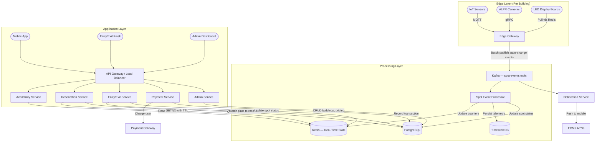

# Case Study: Smart Parking Lot System (System Design)

## Quick Summary (TL;DR)
- **Goal**: Design a distributed, multi-building, multi-floor smart parking system with real-time spot availability, mobile reservations, IoT sensor integration, ALPR (Automatic License Plate Recognition), and automated payment processing.
- **Scale**: 500 buildings, 10 floors each, 500 spots per floor = 2.5M total spots. 20M entry/exit events per day. 5M reservations per day.
- **Key Decisions**:
  - Use **IoT sensors + event streaming (Kafka)** to track real-time spot occupancy — sensors publish state changes, not poll-based.
  - Use **Redis** for real-time availability counters and TTL-based reservation holds — sub-millisecond reads for "spots available" queries.
  - Use **PostgreSQL** for transactional booking/payment records (ACID on money) and **TimescaleDB** for time-series sensor telemetry.
  - Use **optimistic concurrency control** for spot allocation to handle peak-hour races without DB-level locking bottlenecks.

> **Relationship to the LLD**: The [Parking Lot LLD](../../lld/problems/parking_lot/parking_lot.md) focuses on in-process OOP design — classes, Strategy/Factory patterns, and single-JVM concurrency. This HLD extends it to a distributed system: multiple buildings, network-connected sensors, mobile clients, reservation workflows, payment gateways, and horizontal scaling across data centers.

---

## Noob Jargon Buster

* **IoT Sensor**: A small device embedded in each parking spot (ultrasonic or magnetic) that detects whether a vehicle is present and publishes an event when the state changes.
* **ALPR (Automatic License Plate Recognition)**: A camera at the entry/exit gate that reads the license plate, matches it to a reservation or registered user, and triggers barrier opening automatically.
* **TTL-based Reservation Hold**: When a user reserves a spot via the mobile app, we set a key in Redis with a Time-To-Live (e.g., 30 minutes). If the user doesn't arrive before the TTL expires, the reservation auto-cancels — no cleanup cron needed.
* **Optimistic Concurrency Control (OCC)**: Instead of locking a spot row in the database while we process a booking, we read a version number, do our work, and attempt the update only if the version hasn't changed. If two users race for the same spot, exactly one wins.
* **Multi-Tenant**: A single platform serving multiple parking operators (airports, malls, hospitals), each with isolated data but sharing infrastructure.
* **Geofencing**: A virtual perimeter around a parking building. When a user's phone enters the geofence, the app can auto-trigger navigation, pre-warm the reservation, or open the barrier.

---

## 1. Requirements & Scope

### Functional
1. **Real-Time Availability**: Display live spot counts per floor, per building, per spot type (compact, large, handicapped, EV charging) — on mobile app, web dashboard, and LED boards at entrances.
2. **Reservation System**: Users can reserve a spot via mobile app up to 24 hours in advance. Reservation has a 30-minute arrival window (TTL). No-shows auto-cancel.
3. **Entry/Exit Flow**: ALPR cameras read license plates at gates. If the plate matches a reservation or registered user, the barrier opens automatically. Walk-in vehicles get a ticket.
4. **Spot Allocation**: Assign the nearest available spot to the user's destination (elevator, exit, store entrance). Support preferences: covered, EV charging, handicapped.
5. **Payment Processing**: Support pre-pay (reservation), post-pay (at exit kiosk), and subscription plans (monthly pass). Integrate with payment gateways.
6. **Navigation**: In-app turn-by-turn navigation to the assigned spot (floor + aisle + spot number).
7. **Admin Dashboard**: Operators manage buildings, floors, pricing tiers, view occupancy analytics, and configure dynamic pricing (surge pricing during events).
8. **Multi-Building / Multi-Tenant**: A single platform can serve airports, malls, hospitals — each tenant manages their own buildings and pricing.

### Non-Functional
- **Real-Time Updates**: Spot status must propagate from sensor to user-facing display within **2 seconds**.
- **High Availability**: 99.9% uptime — parking infrastructure cannot go offline during business hours.
- **Concurrency**: Handle 1,000+ simultaneous entry events per building during peak hour without double-allocating spots.
- **Scalability**: Support 500+ buildings with independent scaling per region.
- **Data Durability**: Zero lost payment or booking records.

---

## 2. Scale Estimation (The Math)

### Throughput (QPS)

- **Total spots**: 500 buildings x 10 floors x 500 spots = **2.5M spots**.
- **Daily entry/exit events**: 20M/day (each spot turns over ~8x/day on average).
  - Average QPS: 20,000,000 / 86,400 = **~230 events/sec**.
  - Peak QPS (8-9 AM rush): **~3,000 events/sec**.
- **Sensor heartbeats**: Each sensor sends state every 30 sec (as a health check).
  - 2.5M sensors / 30 sec = **~83,000 heartbeats/sec** (filtered at edge; only state-change events forwarded to central).
- **Reservation API**: 5M reservations/day.
  - Average: ~58 req/sec. Peak: ~500 req/sec.
- **Availability queries** (mobile app + LED boards): 50M/day = ~580 req/sec average, ~5,000 req/sec peak.

### Storage

- **Spot status record**: ~100 bytes (spot_id, building_id, floor, type, status, vehicle_id, timestamp).
- **Event log**: 20M events/day x 200 bytes = **4 GB/day**, **1.5 TB/year**.
- **Reservation record**: ~300 bytes. 5M/day = 1.5 GB/day, **550 GB/year**.
- **Payment record**: ~500 bytes. 15M transactions/day = 7.5 GB/day, **2.7 TB/year**.
- **ALPR image**: ~200 KB per capture. 20M/day = **4 TB/day** (stored in blob storage, retained 30 days = **120 TB**).

### Memory (Redis)

- **Real-time spot availability**: 2.5M spots x 50 bytes = **125 MB** — fits in a single Redis node.
- **Active reservations**: At peak, 500K concurrent reservations x 200 bytes = **100 MB**.
- **Total Redis**: ~250 MB — trivially small.

---

## 3. System API Design

### A. Check Availability
- **Endpoint**: `GET /v1/buildings/{building_id}/availability?floor=3&type=COMPACT`
- **Response**:
  ```json
  {
    "building_id": "bld_001",
    "floors": [
      { "floor": 3, "available": { "COMPACT": 45, "LARGE": 12, "HANDICAPPED": 3, "EV": 8 } }
    ],
    "updated_at": "2026-05-31T09:00:01Z"
  }
  ```

### B. Reserve a Spot
- **Endpoint**: `POST /v1/reservations`
- **Request**:
  ```json
  {
    "user_id": "u_123",
    "building_id": "bld_001",
    "spot_type": "COMPACT",
    "preferred_floor": 3,
    "arrival_time": "2026-05-31T10:00:00Z",
    "vehicle_plate": "KA-01-AB-1234",
    "idempotency_key": "idem_u123_bld001_1748678400"
  }
  ```
- **Response**: `201 Created` with `reservation_id`, `assigned_spot`, `expires_at` (arrival_time + 30 min), or `409 Conflict` if no spots available.

### C. Vehicle Entry (ALPR Trigger)
- **Endpoint**: `POST /v1/entries`
- **Request**:
  ```json
  {
    "gate_id": "gate_bld001_entry_1",
    "plate_number": "KA-01-AB-1234",
    "alpr_confidence": 0.97,
    "image_url": "s3://alpr-images/2026/05/31/gate001_100000.jpg"
  }
  ```
- **Response**: `200 OK` with `entry_id`, `assigned_spot` (from reservation or real-time allocation), `barrier_action: "OPEN"`.

### D. Vehicle Exit & Payment
- **Endpoint**: `POST /v1/exits`
- **Request**:
  ```json
  {
    "gate_id": "gate_bld001_exit_1",
    "plate_number": "KA-01-AB-1234",
    "payment_method_id": "pm_xyz"
  }
  ```
- **Response**: `200 OK` with `duration_minutes`, `amount`, `payment_status`, `receipt_url`.

### E. Sensor Event Ingestion (Internal)
- **Endpoint**: Not HTTP — sensors publish via **MQTT** to an edge gateway, which batches and forwards to Kafka topic `spot-events`.
- **Event payload**:
  ```json
  {
    "sensor_id": "sns_bld001_f3_a12_s05",
    "spot_id": "spot_bld001_03_A12_05",
    "status": "OCCUPIED",
    "timestamp": "2026-05-31T09:00:00.123Z"
  }
  ```

---

## 4. Database Schema Design

### Transactional Data (PostgreSQL — ACID for Bookings & Payments)

```sql
-- Buildings & floors
CREATE TABLE buildings (
    building_id   UUID PRIMARY KEY,
    tenant_id     UUID NOT NULL,         -- Multi-tenant isolation
    name          VARCHAR(100) NOT NULL,
    address       TEXT,
    latitude      DECIMAL(9,6),
    longitude     DECIMAL(9,6),
    total_floors  INTEGER NOT NULL,
    created_at    TIMESTAMPTZ DEFAULT NOW()
);

-- Parking spots (static inventory)
CREATE TABLE spots (
    spot_id       UUID PRIMARY KEY,
    building_id   UUID NOT NULL REFERENCES buildings(building_id),
    floor         INTEGER NOT NULL,
    aisle         VARCHAR(10) NOT NULL,
    spot_number   INTEGER NOT NULL,
    spot_type     VARCHAR(20) NOT NULL,  -- COMPACT, LARGE, HANDICAPPED, EV
    is_covered    BOOLEAN DEFAULT FALSE,
    sensor_id     UUID,
    UNIQUE (building_id, floor, aisle, spot_number)
);

-- Reservations
CREATE TABLE reservations (
    reservation_id  UUID PRIMARY KEY,
    user_id         UUID NOT NULL,
    spot_id         UUID NOT NULL REFERENCES spots(spot_id),
    vehicle_plate   VARCHAR(20) NOT NULL,
    status          VARCHAR(20) NOT NULL DEFAULT 'ACTIVE',  -- ACTIVE, FULFILLED, EXPIRED, CANCELLED
    arrival_window  TSTZRANGE NOT NULL,   -- [arrival_time, arrival_time + 30 min)
    idempotency_key VARCHAR(100) UNIQUE,
    version         INTEGER NOT NULL DEFAULT 0,
    created_at      TIMESTAMPTZ DEFAULT NOW()
);

-- Parking sessions (entry to exit)
CREATE TABLE sessions (
    session_id     UUID PRIMARY KEY,
    building_id    UUID NOT NULL,
    spot_id        UUID NOT NULL,
    vehicle_plate  VARCHAR(20) NOT NULL,
    reservation_id UUID REFERENCES reservations(reservation_id),
    entry_time     TIMESTAMPTZ NOT NULL,
    exit_time      TIMESTAMPTZ,
    entry_gate_id  UUID NOT NULL,
    exit_gate_id   UUID,
    status         VARCHAR(20) NOT NULL DEFAULT 'ACTIVE',  -- ACTIVE, COMPLETED
    created_at     TIMESTAMPTZ DEFAULT NOW()
);

-- Payments
CREATE TABLE payments (
    payment_id       UUID PRIMARY KEY,
    session_id       UUID NOT NULL REFERENCES sessions(session_id),
    user_id          UUID,
    amount_cents     INTEGER NOT NULL,
    currency         VARCHAR(3) DEFAULT 'INR',
    payment_method   VARCHAR(20) NOT NULL,  -- CARD, UPI, WALLET, SUBSCRIPTION
    status           VARCHAR(20) NOT NULL DEFAULT 'PENDING',  -- PENDING, COMPLETED, REFUNDED
    idempotency_key  VARCHAR(100) UNIQUE,
    created_at       TIMESTAMPTZ DEFAULT NOW()
);
```

### Real-Time Availability (Redis)

```
# Per-building, per-floor availability counters (Hash)
HSET avail:bld_001:floor_3  COMPACT 45  LARGE 12  HANDICAPPED 3  EV 8

# Individual spot status (String with lightweight value)
SET spot:bld_001_03_A12_05  "OCCUPIED:KA-01-AB-1234"

# Reservation hold (String with TTL)
SET resv:spot_bld001_03_A12_05  "resv_abc123:u_123"  EX 1800   -- 30-min TTL
```

### Sensor Telemetry (TimescaleDB — Time-Series)

```sql
CREATE TABLE sensor_events (
    time        TIMESTAMPTZ NOT NULL,
    sensor_id   UUID NOT NULL,
    spot_id     UUID NOT NULL,
    status      VARCHAR(10) NOT NULL,  -- OCCUPIED, VACANT
    raw_value   INTEGER                -- Ultrasonic distance in cm
);
SELECT create_hypertable('sensor_events', 'time');
-- Retention policy: auto-drop data older than 90 days
```

---

## 5. High-Level Architecture



### Core Flow: Vehicle Entry with Reservation

1. User reserves a spot via mobile app -> **Reservation Service** runs `SETNX resv:spot_xxx` in Redis (30-min TTL), inserts row in PostgreSQL.
2. User drives to the building -> Phone enters geofence -> App sends "approaching" notification.
3. At the gate, **ALPR camera** reads the plate -> **Entry/Exit Service** matches plate to active reservation in PostgreSQL.
4. Barrier opens. **Entry/Exit Service** creates a `session` row, publishes `vehicle.entered` to Kafka.
5. **Spot Event Processor** receives the event, updates Redis counters (`HINCRBY avail:bld_001:floor_3 COMPACT -1`), updates LED boards.
6. User parks. **IoT sensor** detects vehicle, publishes `OCCUPIED` event via MQTT -> Edge Gateway -> Kafka -> Spot Event Processor confirms occupancy in Redis and TimescaleDB.

### Core Flow: Vehicle Exit

1. Vehicle drives to exit gate -> ALPR reads plate -> **Entry/Exit Service** finds active session.
2. Calculates duration and fee (applies dynamic pricing if applicable).
3. If pre-paid (reservation) or subscription, barrier opens immediately. Otherwise, kiosk prompts for payment.
4. **Payment Service** charges the user, records the transaction.
5. Session marked `COMPLETED`. Spot marked `VACANT` in Redis. Counters incremented. Kafka event published.

---

## 6. Deep Dives

### A. Real-Time Spot Tracking: Sensor to Screen in 2 Seconds

The pipeline from a sensor detecting a car to the LED board updating must be under 2 seconds:

```
Sensor (detects change)
  → MQTT publish (50 ms)
  → Edge Gateway (batches per 200ms window, filters duplicates)
  → Kafka produce (100 ms)
  → Spot Event Processor consumes (100 ms)
  → Redis HINCRBY + SET (1 ms)
  → LED board polls Redis every 1 sec
─────────────────────────────────────
Total: ~1.5 seconds end-to-end
```

**Why MQTT at the edge, Kafka centrally?** MQTT is designed for constrained IoT devices — tiny packet overhead, persistent sessions, QoS levels. Kafka is designed for high-throughput, durable event streaming between backend services. The Edge Gateway bridges the two protocols.

**Deduplication**: Sensors can fire duplicate events (e.g., vehicle rocks slightly). The Edge Gateway deduplicates by keeping a local state map (`sensor_id -> last_status`). Only state *changes* are forwarded to Kafka.

### B. Reservation System with TTL

```
User reserves spot (T=0)
  → Redis: SETNX resv:spot_xxx  EX 1800 (30 min)
  → PostgreSQL: INSERT reservation (status=ACTIVE)

User arrives (T=15min)
  → ALPR matches plate → Reservation found
  → Redis: DEL resv:spot_xxx (clear hold, spot is now physically occupied)
  → PostgreSQL: UPDATE reservation SET status='FULFILLED'

User does NOT arrive (T=31min)
  → Redis: Key auto-expires (TTL)
  → Cleanup worker: UPDATE reservation SET status='EXPIRED' WHERE status='ACTIVE' AND arrival_window << NOW()
  → Redis: HINCRBY avail counter +1 (spot available again)
```

**Edge case**: What if the Redis TTL expires but the PostgreSQL cleanup worker hasn't run yet? The Availability Service reads from Redis (source of truth for real-time counts). Once the Redis key expires, the spot counter is already incremented — the spot appears available immediately. The PostgreSQL update is eventual and only matters for billing/audit.

### C. Concurrent Spot Allocation at Peak Hours

During morning rush, 200 cars may arrive at a 500-spot building simultaneously. How do we prevent two cars from being assigned the same spot?

#### Approach: Redis Atomic Allocation

```
1. Car arrives → Entry Service calls Allocation Service
2. Allocation Service:
   a. EVALSHA (Lua script in Redis):
      - SCAN spots on preferred floor with status=VACANT
      - Pick first match
      - SET spot:xxx "OCCUPIED:plate" (atomic within Lua)
      - HINCRBY avail:bld:floor TYPE -1
      - RETURN spot_id
   b. If no spot on preferred floor → try next floor (same Lua script)
3. PostgreSQL: INSERT session (async, after Redis confirms)
```

**Why a Lua script?** Redis is single-threaded. A Lua script executes atomically — no other command can interleave between the SCAN, status check, and SET. This eliminates race conditions without distributed locks.

**Fallback**: If Redis is temporarily down, the Entry Service falls back to PostgreSQL with optimistic locking:
```sql
UPDATE spots SET status = 'OCCUPIED', version = version + 1
WHERE spot_id = ? AND status = 'VACANT' AND version = ?;
-- affected_rows == 0 → retry with next spot
```

### D. Payment Processing

Three payment models coexist:

| Model | Flow | Timing |
|-------|------|--------|
| **Pre-pay (Reservation)** | User pays estimated amount at reservation time. Delta charged/refunded at exit. | Before entry |
| **Post-pay (Walk-in)** | Kiosk calculates fee at exit. User taps card/UPI. Barrier opens on success. | At exit |
| **Subscription** | Monthly pass validated at entry. No per-session payment. | Pre-authorized |

**Dynamic Pricing**: During events (concerts, sports), pricing multiplier is applied:
- Base rate: 50 INR/hour.
- Event surge: 2x multiplier from 6 PM to 11 PM on event days.
- Pricing rules stored in PostgreSQL, cached in Redis with 5-min TTL.

**Idempotency**: Every payment request carries an `idempotency_key` (e.g., `session_id + attempt_number`). The Payment Service checks for existing completed payments with the same key before charging.

### E. License Plate Recognition (ALPR)

```
Camera captures frame
  → Edge GPU runs ALPR model (YOLOv8 + OCR)
  → Confidence score + plate text sent to Entry/Exit Service via gRPC
  → Service matches against:
      1. Active reservations (plate → reservation_id)
      2. Subscription database (plate → subscription_id)
      3. Blocklist (stolen vehicles, unpaid fines)
  → Decision: OPEN barrier, DENY entry, or FALLBACK to manual ticket
```

**Low-confidence handling**: If ALPR confidence < 0.85, the system falls back to manual entry (driver presses button, receives a ticket). The image is stored for later reconciliation.

**Privacy**: ALPR images are stored in S3 with a 30-day retention policy and encrypted at rest (AES-256). Access is audit-logged. Plate-to-user mapping is stored only for registered users who opt in.

### F. Multi-Tenant Support

Each parking operator (airport authority, mall chain, hospital) is a **tenant**:

- `tenant_id` column on `buildings`, propagated via foreign key to all child tables.
- API Gateway extracts tenant context from JWT claims or API key.
- Redis keys are prefixed with `tenant_id` (e.g., `t_airport:avail:bld_001:floor_3`).
- PostgreSQL uses **Row-Level Security (RLS)** policies to enforce tenant isolation:
  ```sql
  CREATE POLICY tenant_isolation ON buildings
    USING (tenant_id = current_setting('app.current_tenant')::UUID);
  ```
- Each tenant can configure their own pricing rules, operating hours, and branding.

---

## 7. Why Choose This? (Defending Your Architecture)

### Why Redis for real-time availability instead of querying PostgreSQL directly?

* **Answer**: "The LED boards and mobile app query availability every 1-2 seconds. With 500 buildings and thousands of concurrent users, that's 5,000+ reads/sec. PostgreSQL would need to aggregate across the `spots` table (2.5M rows) on every query — expensive even with indexes. Redis stores pre-computed counters (one hash per floor) that return in sub-millisecond time. The Spot Event Processor maintains these counters incrementally via `HINCRBY` — O(1) per update, O(1) per read."

### Why Kafka between sensors and the backend instead of direct HTTP calls?

* **Answer**: "IoT sensors produce bursty, high-volume events (83K heartbeats/sec across all buildings). Direct HTTP from each sensor would overwhelm the backend during peak and lose events during service restarts. Kafka provides durable buffering — if the Spot Event Processor goes down for 5 minutes, events queue in Kafka and are replayed on recovery. It also decouples producers (sensors) from consumers (availability updater, analytics, billing) — each consumer reads at its own pace."

### Why an Edge Gateway per building instead of sensors talking directly to the cloud?

* **Answer**: "Three reasons: (1) **Latency** — the LED board on floor 3 shouldn't depend on a round-trip to a cloud data center 500 km away. The Edge Gateway caches local state and updates the LED board directly. (2) **Bandwidth** — 500 sensors sending heartbeats every 30 seconds is 1,000 messages/sec per building. The Edge Gateway deduplicates and batches, reducing outbound traffic by 90%. (3) **Resilience** — if the internet link goes down, the building still functions: barriers open/close based on local sensor data, and events are queued for later sync."

### Why PostgreSQL for sessions/payments instead of DynamoDB?

* **Answer**: "A parking session involves a multi-step financial transaction: create session, calculate fee, charge payment, issue receipt. If payment fails, the session must not be marked completed. PostgreSQL's ACID transactions handle this atomically. Additionally, dynamic pricing queries require JOINs across `sessions`, `buildings`, and pricing-rule tables — relational queries that DynamoDB's single-table design handles poorly."

---

## 8. Common Traps & Mitigations

1. **Sensor False Positives (Ghost Occupancy)**: A sensor reports `OCCUPIED` due to debris, water, or malfunction. The spot appears taken but is actually empty.
   - *Mitigation*: Require **two consecutive readings** 5 seconds apart before changing state. If a spot has been `OCCUPIED` for >24 hours without an entry event, flag it for maintenance review. Cross-reference with ALPR — if no vehicle entered via any gate, the sensor reading is suspect.

2. **Reservation-Occupancy Mismatch**: User reserves spot A12 but parks in spot B7 (ignoring navigation).
   - *Mitigation*: The IoT sensor on A12 will remain `VACANT` after the reservation window. The system auto-expires the reservation and marks A12 available. Spot B7's sensor detects occupancy and creates an unlinked session. At exit, the ALPR matches the plate to the reservation for billing purposes. The user is charged for actual duration, not the reserved spot.

3. **ALPR Failure at Peak Hour**: Camera is foggy, dirty, or the plate is obscured. Queue builds up at the gate.
   - *Mitigation*: Fall back to **QR code scan** (user shows reservation QR on phone) or **manual ticket dispensing** (press button, take ticket). The system must never block entry due to a software failure — physical gates have a manual override.

4. **Redis Crash Losing Real-Time State**: All availability counters are gone.
   - *Mitigation*: Redis runs in a **Redis Sentinel** or **Redis Cluster** setup with replicas. On total failure, the Spot Event Processor replays the last 10 minutes of Kafka events to rebuild Redis state. Additionally, a background job reconciles Redis counters against PostgreSQL every 5 minutes.

5. **Peak Hour Thundering Herd on Reservation API**: A concert announced — 10,000 users try to reserve in the same 60-second window.
   - *Mitigation*: Rate limit reservation API per user (max 1 reservation per 10 seconds). Use a **virtual queue** for high-demand events — users enter a queue, processed in FIFO order. Pre-allocate spots in batches (e.g., release floor 1 spots first, then floor 2) to reduce contention on the same set of spots.

---

## 9. SDE-2 Interview Angles

### Q1: How do you ensure no two cars are assigned the same spot?

**Answer**: "We use Redis Lua scripts for atomic spot allocation. The Lua script runs atomically in Redis's single-threaded execution model — it scans for a vacant spot, marks it occupied, and decrements the counter in one uninterruptible operation. No distributed lock is needed because Redis itself is the serialization point. For the PostgreSQL backup path, we use optimistic locking with a version column — `UPDATE spots SET status='OCCUPIED', version=version+1 WHERE spot_id=? AND status='VACANT' AND version=?`. If `affected_rows == 0`, someone else got it, and we retry with the next spot."

### Q2: What happens if the internet goes down at a building?

**Answer**: "The Edge Gateway is designed for offline resilience. It maintains a local copy of spot states, processes sensor events locally, and continues to operate barriers and LED boards using cached data. Entry/exit events are queued in a local persistent store (embedded Kafka or SQLite WAL). When connectivity restores, the Edge Gateway replays queued events to the central Kafka cluster. Reservations made during the outage are reconciled — if a reserved user arrived, the ALPR image proves it; if not, the reservation is expired. The key principle is: the building never stops functioning due to a cloud outage."

### Q3: How would you implement dynamic pricing?

**Answer**: "Pricing rules are stored in PostgreSQL as a table with columns: `building_id`, `day_of_week`, `time_range` (tstzrange), `spot_type`, `rate_per_hour`, `multiplier`, and `priority`. At exit, the Payment Service fetches applicable rules ordered by priority, overlays them on the session's time range, and calculates segmented pricing. For example, a 4-hour session from 5 PM to 9 PM might have 1x rate for 5-6 PM and 2x for 6-9 PM (event surge). Rules are cached in Redis with a 5-minute TTL. Admin changes publish a Kafka event that invalidates the cache. The complexity is in the time-range overlap calculation, which is a pure function — easy to unit test."

### Q4: How do you handle a sensor that's stuck or malfunctioning?

**Answer**: "Three layers of detection: (1) **Heartbeat monitoring** — if a sensor hasn't sent any event (including heartbeats) in 2 minutes, the Edge Gateway marks it `OFFLINE` and alerts the maintenance team. (2) **Anomaly detection** — if a spot shows `OCCUPIED` for >24 hours without a corresponding entry gate event, flag it as suspect. (3) **Cross-validation** — when a vehicle exits (ALPR match), the system expects the assigned spot's sensor to transition to `VACANT` within 5 minutes. If it doesn't, the sensor is flagged. Faulty sensors are excluded from availability counts and the spot is marked `MAINTENANCE` in the system."

### Q5: How would you scale this system to 10,000 buildings across multiple countries?

**Answer**: "Three-tier scaling: (1) **Edge tier** — each building runs its own Edge Gateway independently. No cross-building dependency. (2) **Regional tier** — Kafka clusters, PostgreSQL instances, and Redis clusters are deployed per region (e.g., India-West, India-South, US-East). Each region handles ~1,000 buildings. The Availability Service and Reservation Service are stateless, horizontally scaled behind regional load balancers. (3) **Global tier** — a global API Gateway routes users to their nearest region via GeoDNS. Cross-region data (e.g., a user with subscriptions in two cities) is synced via CDC (Change Data Capture) from PostgreSQL to a global read replica. Tenant configuration is replicated globally. Each region can operate independently during a partition — availability is prioritized over global consistency (AP in CAP theorem)."
