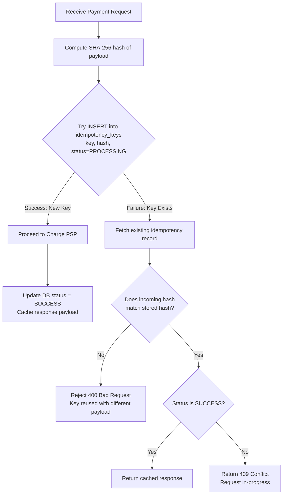
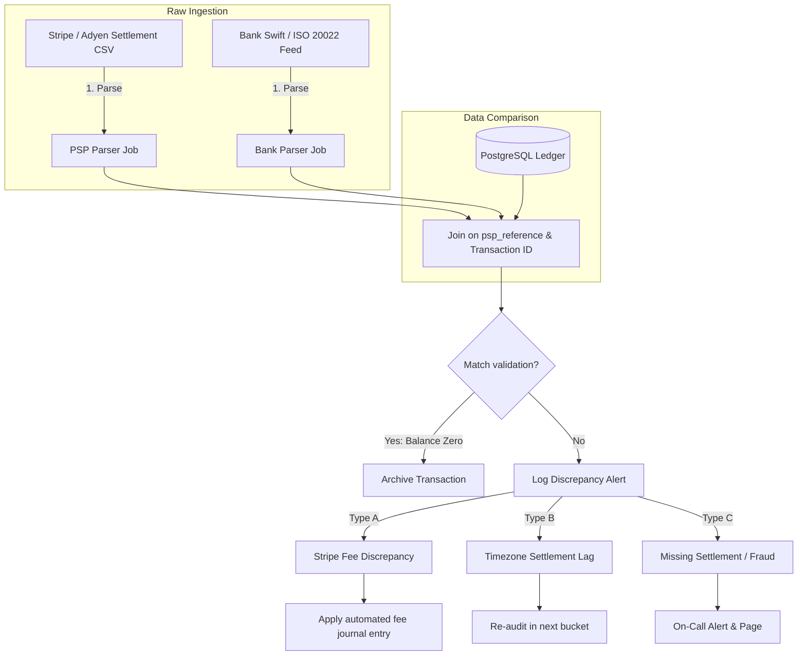

# Case Study: Payment System (System Design)

## Quick Summary (TL;DR)
- **Goal**: Design a payment system that processes pay-ins (customer pays merchant), pay-outs (merchant withdraws to bank), and refunds — reliably handling real money with zero tolerance for data loss or double-charging.
- **Scale**: 1 Million transactions/day (~12 TPS average, ~50 TPS peak). Storage over 5 years is ~1.5 TB for the ledger alone.
- **Key Decisions**:
  - Use **idempotency keys** with **payload hashing** — clients send a unique key; the server hashes the request payload and checks Redis/DB. If the key is reused with a different payload, reject with `400 Bad Request`.
  - Use a **double-entry ledger** in PostgreSQL following GAAP standards — transactions debit one account and credit another, balancing strictly to zero to prevent financial leakage.
  - Implement a **Saga orchestrator** for distributed transactions — coordinates inventory booking, payments, and order confirmation with rollback routines.
  - Configure PostgreSQL for **Synchronous Replication** — ensures zero data loss during node failures (durability-focused CP system).

---

## 🤓 Noob Jargon Buster

* **PSP (Payment Service Provider)**: A third-party gateway (Stripe, Adyen) that processes credit card charges.
* **Idempotency Key**: A unique token (UUID) verifying that a retry does not execute the action twice.
* **Double-Entry Ledger**: An accounting schema where every financial transaction maps to at least two balancing database records (Debit and Credit).
* **GAAP/IFRS**: Generally Accepted Accounting Principles / International Financial Reporting Standards. Regulates financial ledger layouts.
* **Synchronous Replication**: Database setup where the primary node blocks on transaction commits until at least one standby replica confirms it has written the transaction log.
* **Three-Way Reconciliation**: Audit process aligning internal database records against settlement files from the PSP and bank statement feeds.

---

## 1. Requirements & Scope

### Functional
1. **Pay-in**: Customer pays for an order. Money flows: Customer $\rightarrow$ Platform $\rightarrow$ Merchant.
2. **Pay-out**: Merchant withdraws accumulated balance to their bank account.
3. **Refund**: Full or partial refund of a completed payment.
4. **Webhook Handling**: Receive async payment updates from the PSP.
5. **Reconciliation**: Audit job verifying internal records match PSP and bank ledger settlements.

### Non-Functional
- **Exactly-once Processing**: Customers must never be double-charged.
- **Strict Consistency**: The system must prioritize consistency over availability (CP system).
- **Auditability**: Every transaction must have an immutable, append-only history (no SQL `UPDATE` operations on account balances).
- **PCI-DSS Compliance**: Never store credit card numbers (PANs) on platform databases. Use tokenization.

---

## 2. Scale Estimation (The Math)

### Throughput (QPS)
- **Daily Transactions**: 1 Million/day.
- **Average TPS**: $\frac{1,000,000}{86,400} \approx 11.6 \text{ TPS}$.
- **Peak TPS**: $\approx 50 \text{ TPS}$.

### Storage (5-Year Ledger)
- **Ledger Entry Size**: ~250 bytes.
- **Entries per Transaction**: 2 (one debit, one credit minimum).
- **Daily Ledger Rows**: $1\text{M} \times 2 = 2\text{M rows/day}$.
- **5-Year Total**: $2\text{M} \times 365 \times 5 \approx 3.65\text{ Billion rows}$.
- **Storage Size**: $3.65\text{B} \times 250 \text{ bytes} \approx 912 \text{ GB}$ (with indices, ~1.5 TB).

---

## 3. System API Design

### Create Payment (Pay-in)
- **Endpoint**: `POST /v1/payments`
- **Headers**: `Idempotency-Key: 3b99e870-9a4d-4f1e-b5c8-abc123def456`
- **Request Payload**:
  ```json
  {
    "order_id": "ORD-78901",
    "buyer_id": "u_12345",
    "merchant_id": "m_67890",
    "amount": 10000,
    "currency": "USD",
    "payment_method": {
      "type": "card",
      "token": "tok_visa_4242"
    }
  }
  ```

---

## 4. High-Level Architecture


---

## 5. Deep Dives

### A. Idempotency & Replay Resolution Loop
To safeguard against double-charging when clients retry after network timeouts, the system uses unique idempotency keys paired with payload hashing.



- **Payload Hash Protection**: Storing `idempotency_hash` protects against replay attacks or logical errors where a client attempts to execute a different payment ($100 instead of $50) using a recycled idempotency key.

---

### B. Double-Entry Ledger (GAAP / IFRS Design)
To comply with financial standards, the ledger must record immutable transactions where the sum of credits and debits always balances to zero. The system uses a structured **Chart of Accounts**:

```
Accounts Classification:
  ├── Assets (increased by debits, decreased by credits)
  │    └── assets:receivables:stripe
  ├── Liabilities (increased by credits, decreased by debits)
  │    └── liabilities:merchant_balances
  └── Revenue (increased by credits, decreased by debits)
       ├── revenue:processing_fees:stripe
       └── revenue:platform_fees
```

#### Example Transaction Schema
A customer pays **$100.00** for an order. The PSP charges **$2.90** in card processing fees. The platform charges the merchant a **$1.00** platform fee. The remaining **$96.10** is credited to the merchant's balance.

```sql
BEGIN;

INSERT INTO ledger_entries (payment_id, account_id, entry_type, amount, currency)
VALUES
    -- Debit Assets: we expect Stripe to settle $100.00 to our bank
    ('pay_abc123', 'assets:receivables:stripe',         'DEBIT',  10000, 'USD'),
    
    -- Credit Liabilities: we owe the merchant $96.10
    ('pay_abc123', 'liabilities:merchant_balances',      'CREDIT',  9610, 'USD'),
    
    -- Credit Revenue: Stripe fee expense is recorded
    ('pay_abc123', 'revenue:processing_fees:stripe',     'CREDIT',   290, 'USD'),
    
    -- Credit Revenue: Platform fee profit is recorded
    ('pay_abc123', 'revenue:platform_fees',              'CREDIT',   100, 'USD');

COMMIT;
```
*Total Equation Balance Check:*
$$\sum \text{Entries} = (+100.00) + (-96.10) + (-2.90) + (-1.00) = 0.00 \text{ USD}$$
If any program attempts to write unbalanced ledger lines, database triggers or application invariants block the commit, preventing money from appearing or disappearing.

---

### C. Database Durability Configuration (CP System)
To ensure absolute reliability, the database is configured as a CP system under CAP, using **Synchronous Replication**:

```
Client App ──► Write Request ──► Primary DB Node
                                     │
                             (Write WAL locally)
                                     │
                             (Replicate WAL)
                                     │
                                     ▼
                            Standby DB Node 1
                             (Flush WAL to disk)
                                     │
                                   (ACK)
                                     │
                   Commit Success ◄──┘
```

#### PostgreSQL Resiliency Settings
```ini
# postgresql.conf
# Require Standby Node 1 to flush WAL to disk before committing
synchronous_commit = on
synchronous_standby_names = 'FIRST 1 (replica_1, replica_2)'
```
- **Trade-off**: Increases write latency by 5–15ms (requires a network round-trip to the replica), but prevents data loss if the primary node crashes.

---

### D. Three-Way Reconciliation Pipeline
Reconciliation audits internal records against external PSP settlement reports and bank statement feeds.



---

## 6. Database Schema

### Ledger Entries
```sql
CREATE TABLE ledger_entries (
    entry_id       BIGSERIAL PRIMARY KEY,
    payment_id     UUID NOT NULL,
    account_id     VARCHAR(64) NOT NULL,   -- e.g., 'liabilities:merchant_balances'
    entry_type     VARCHAR(6) NOT NULL,     -- 'DEBIT' (Positive), 'CREDIT' (Negative)
    amount         BIGINT NOT NULL,         -- Stored in cents (10000 = $100.00)
    currency       CHAR(3) NOT NULL,
    created_at     TIMESTAMP NOT NULL DEFAULT NOW()
);

CREATE INDEX idx_ledger_account ON ledger_entries (account_id, created_at);
```

### Idempotency Keys
```sql
CREATE TABLE idempotency_keys (
    key_value      VARCHAR(256) PRIMARY KEY,
    payload_hash   CHAR(64) NOT NULL,       -- SHA-256 hash of payload
    status         VARCHAR(20) NOT NULL,    -- PROCESSING, SUCCESS
    cached_response JSON,
    created_at     TIMESTAMP NOT NULL DEFAULT NOW()
);
```

---

## 7. Scaling, Reliability, & Resiliency

### Webhook Load Draining
During high-volume sales (e.g. Black Friday), PSP status webhooks spike dramatically.
1. The Webhook Gateway parses and verifies the HMAC-SHA256 signature.
2. If signature is valid, it immediately publishes the raw payload to a Kafka partition keyed by `payment_id` and returns `200 OK` to the PSP.
3. This decouples the webhook receipt from database status updates, preventing PostgreSQL write lock exhaustion during webhook storms.
