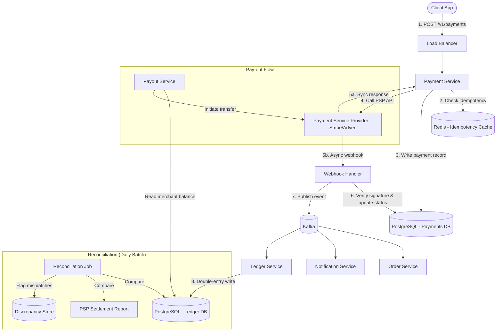
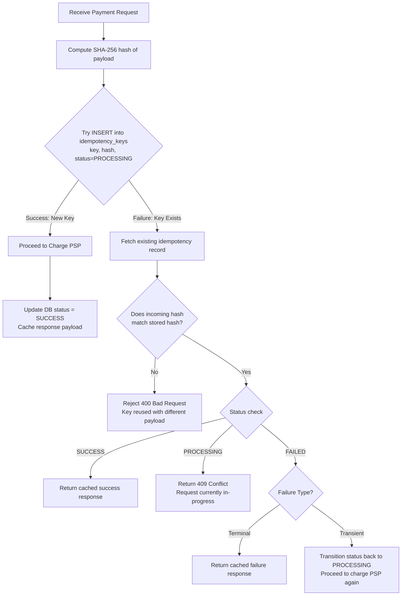
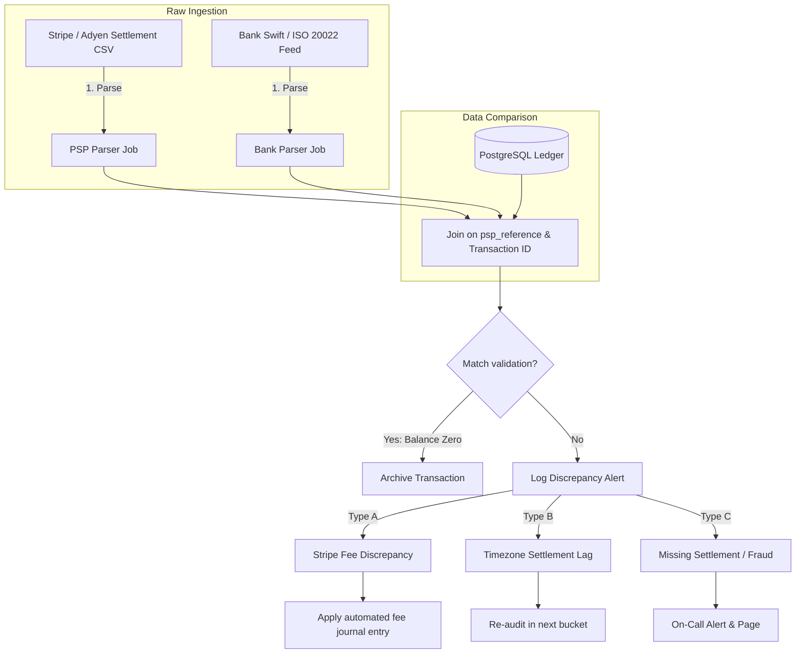
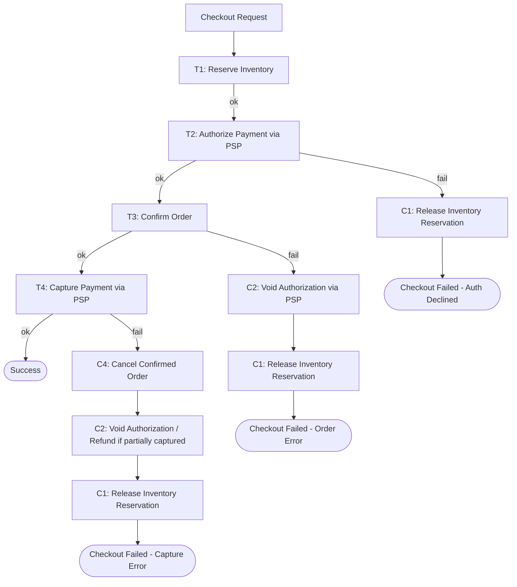
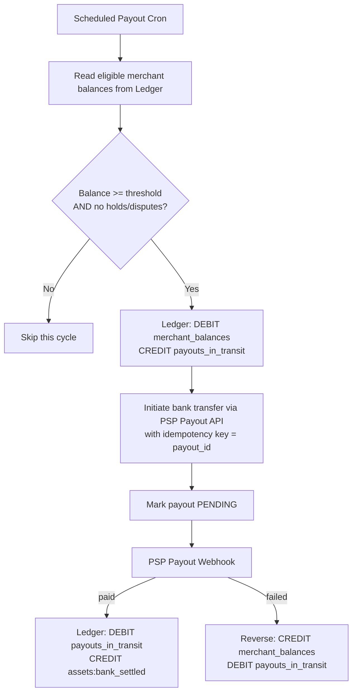

# Case Study: Payment System (System Design)

## Quick Summary (TL;DR)
- **Goal**: Design a payment system that processes pay-ins (customer pays merchant), pay-outs (merchant withdraws to bank), and refunds — reliably handling real money with zero tolerance for data loss or double-charging.
- **Scale**: 1 Million transactions/day (~12 TPS average, ~50 TPS peak). Storage over 5 years is ~1.5 TB for the ledger alone.
- **Key Decisions**:
  - Use **idempotency keys** with **payload hashing** — clients send a unique key; the server hashes the request payload and checks Redis/DB. If the key is reused with a different payload, reject with `400 Bad Request`.
  - Use a **double-entry ledger** in PostgreSQL following GAAP standards — transactions debit one account and credit another, balancing strictly to zero to prevent financial leakage.
  - Implement a **Saga orchestrator** for distributed transactions — coordinates inventory booking, payments, and order confirmation with rollback routines.
  - Configure PostgreSQL for **Synchronous Replication** — ensures zero data loss during node failures (durability-focused CP system).

> **Companion LLD**: For the object model behind a single payment (State machine, Strategy-based payment methods, validation chain, idempotency at the service level), see [Payment System — LLD](../../lld/problems/payment_system/payment_system.md).

---

## 🤓 Noob Jargon Buster

* **PSP (Payment Service Provider)**: A third-party gateway (Stripe, Adyen) that processes credit card charges.
* **Idempotency Key**: A unique token (UUID) verifying that a retry does not execute the action twice.
* **Double-Entry Ledger**: An accounting schema where every financial transaction maps to at least two balancing database records (Debit and Credit).
* **GAAP/IFRS**: Generally Accepted Accounting Principles / International Financial Reporting Standards. Regulates financial ledger layouts.
* **Synchronous Replication**: Database setup where the primary node blocks on transaction commits until at least one standby replica confirms it has written the transaction log.
* **Three-Way Reconciliation**: Audit process aligning internal database records against settlement files from the PSP and bank statement feeds.

---

## 1. Requirements & Scope

### Functional
1. **Pay-in**: Customer pays for an order. Money flows: Customer $\rightarrow$ Platform $\rightarrow$ Merchant.
2. **Pay-out**: Merchant withdraws accumulated balance to their bank account.
3. **Refund**: Full or partial refund of a completed payment.
4. **Webhook Handling**: Receive async payment updates from the PSP.
5. **Reconciliation**: Audit job verifying internal records match PSP and bank ledger settlements.

### Non-Functional
- **Exactly-once Processing**: Customers must never be double-charged.
- **Strict Consistency**: The system must prioritize consistency over availability (CP system).
- **Auditability**: Every transaction must have an immutable, append-only history (no SQL `UPDATE` operations on account balances).
- **PCI-DSS Compliance**: Never store credit card numbers (PANs) on platform databases. Use tokenization.

---

## 2. Scale Estimation (The Math)

### Throughput (QPS)
- **Daily Transactions**: 1 Million/day.
- **Average TPS**: $\frac{1,000,000}{86,400} \approx 11.6 \text{ TPS}$.
- **Peak TPS**: $\approx 50 \text{ TPS}$ (~4× average, to absorb sales spikes / flash-sale bursts).

### Storage (5-Year Ledger)
- **Ledger Entry Size**: ~250 bytes.
- **Entries per Transaction**: 2 (one debit, one credit minimum).
- **Daily Ledger Rows**: $1\text{M} \times 2 = 2\text{M rows/day}$.
- **5-Year Total**: $2\text{M} \times 365 \times 5 \approx 3.65\text{ Billion rows}$.
- **Storage Size**: $3.65\text{B} \times 250 \text{ bytes} \approx 912 \text{ GB}$ (with indices, ~1.5 TB).

---

## 3. System API Design

### Create Payment (Pay-in)
- **Endpoint**: `POST /v1/payments`
- **Headers**: `Idempotency-Key: 3b99e870-9a4d-4f1e-b5c8-abc123def456`
- **Request Payload**:
  ```json
  {
    "order_id": "ORD-78901",
    "buyer_id": "u_12345",
    "merchant_id": "m_67890",
    "amount": 10000,
    "currency": "USD",
    "payment_method": {
      "type": "card",
      "token": "tok_visa_4242"
    }
  }
  ```

---

## 4. High-Level Architecture



---

## 5. Deep Dives

### A. Idempotency & Replay Resolution Loop
To safeguard against double-charging when clients retry after network timeouts, the system uses unique idempotency keys paired with payload hashing.



- **Payload Hash Protection**: Storing `idempotency_hash` protects against replay attacks or logical errors where a client attempts to execute a different payment ($100 instead of $50) using a recycled idempotency key.
- **Handling Failed Attempts**: If a payment fails due to a transient error (e.g. gateway timeout), the system resets the key status to `PROCESSING` to allow a subsequent retry. If it fails due to a terminal error (e.g. card declined), the failure is final, and the cached failure payload is returned. The client must generate a new idempotency key for any new billing attempt.

---

### B. Double-Entry Ledger (GAAP / IFRS Design)
To comply with financial standards, the ledger must record immutable transactions where the sum of credits and debits always balances to zero. The system uses a structured **Chart of Accounts**:

```
Accounts Classification:
  ├── Assets (increased by debits, decreased by credits)
  │    └── assets:receivables:stripe
  ├── Liabilities (increased by credits, decreased by debits)
  │    └── liabilities:merchant_balances
  └── Revenue (increased by credits, decreased by debits)
       └── revenue:platform_fees
```

#### Example Transaction Schema
A customer pays **$100.00** for an order. Stripe deducts its **$2.90** processing fee *before settling* and wires us the net **$97.10**. Of that, the platform keeps a **$1.00** platform fee and credits the merchant's balance with **$96.10**.

Because Stripe settles **net**, the receivable we book is what Stripe will actually pay us ($97.10), not the gross $100. The $2.90 fee is passed through to the merchant (they net $100 − $2.90 − $1.00) and never touches our books as our own revenue or expense — booking it as `revenue:*` would inflate revenue *and* leave a permanent $2.90 gap against Stripe's settlement report in reconciliation (§D).

```sql
BEGIN;

INSERT INTO ledger_entries (payment_id, account_id, entry_type, amount, currency)
VALUES
    -- Debit Assets: Stripe will settle the NET amount ($97.10) to our bank
    ('pay_abc123', 'assets:receivables:stripe',         'DEBIT',  9710, 'USD'),
    
    -- Credit Liabilities: we owe the merchant $96.10
    ('pay_abc123', 'liabilities:merchant_balances',      'CREDIT', 9610, 'USD'),
    
    -- Credit Revenue: platform fee is our only revenue on this txn
    ('pay_abc123', 'revenue:platform_fees',              'CREDIT',  100, 'USD');

COMMIT;
```
*Total Equation Balance Check:*
$$\sum \text{Entries} = (+97.10) + (-96.10) + (-1.00) = 0.00 \text{ USD}$$
If any program attempts to write unbalanced ledger lines, database triggers or application invariants block the commit, preventing money from appearing or disappearing.

> **If you must gross up** (book the full $100 and show the fee explicitly), debit `assets:receivables:stripe` $97.10 **and** `expenses:processing_fees:stripe` $2.90 against a $100.00 credit split — the fee is an **expense**, never revenue. The net form above is the cleaner interview answer and reconciles directly against the PSP settlement file.

---

### C. Database Durability Configuration (CP System)
To ensure absolute reliability, the database is configured as a CP system under CAP, using **Synchronous Replication**:

```
Client App ──► Write Request ──► Primary DB Node
                                     │
                             (Write WAL locally)
                                     │
                             (Replicate WAL)
                                     │
                                     ▼
                            Standby DB Node 1
                             (Flush WAL to disk)
                                     │
                                   (ACK)
                                     │
                   Commit Success ◄──┘
```

#### PostgreSQL Resiliency Settings
```ini
# postgresql.conf
# Require Standby Node 1 to flush WAL to disk before committing
synchronous_commit = on
synchronous_standby_names = 'FIRST 1 (replica_1, replica_2)'
```
- **Trade-off**: Increases write latency by 5–15ms (requires a network round-trip to the replica), but prevents data loss if the primary node crashes.

---

### D. Three-Way Reconciliation Pipeline
Reconciliation audits internal records against external PSP settlement reports and bank statement feeds.



---

### E. Saga Orchestration (Distributed Checkout with Authorize-Capture)
A checkout touches several independent services — inventory, payment, order — that don't share a database. A single ACID transaction is impossible across them, so we use an **orchestration-based Saga**: a central `Checkout Orchestrator` drives each step and issues **compensating transactions** if a later step fails.

To avoid loss of non-refundable transaction fees (PSPs like Stripe/Adyen retain processing fees even during a refund), we split the payment step into **Authorize** (hold funds) and **Capture** (charge funds):



> On a capture failure the order is already confirmed (`T3` succeeded), so compensation must **unwind all three prior steps**: cancel the order, release the still-standing authorization hold (or refund if a partial capture went through), then release inventory.

- **Why Authorize $\rightarrow$ Capture**: Setting a temporary hold (authorization) is free or cheap. If order confirmation (`T3`) fails (e.g. out-of-stock race condition), we void the authorization (`C2`), releasing the client's hold immediately with zero fee loss. We only *Capture* (`T4`) the money once the order is fully guaranteed.
- **Why orchestration over choreography**: With money involved, an explicit, auditable orchestrator (state persisted per saga step) is easier to reason about and debug than event-chained choreography, where the flow is implicit across many services.
- **Compensations must be idempotent**: A refund, void, or inventory release can be retried after a crash, so each compensating step keys on the saga id and is safe to replay.
- **Persisted saga log**: The orchestrator writes each step's outcome (`INVENTORY_RESERVED`, `PAYMENT_AUTHORIZED`, …) to a durable store. On restart, a recovery worker resumes or compensates any saga stuck in a non-terminal state.

---

### F. Pay-out Flow (Merchant Settlement)
Merchants accumulate a balance in `liabilities:merchant_balances` and periodically withdraw to their bank. Pay-outs are **asynchronous and batched**, not synchronous like pay-ins.



- **Two-phase ledger move**: Funds go `merchant_balances → payouts_in_transit → bank_settled`. The intermediate `payouts_in_transit` account means a crash mid-transfer never loses money — reconciliation can always see exactly where funds are.
- **Holds & disputes**: A merchant with open chargebacks/disputes is skipped or partially held back (rolling reserve) to cover potential refunds.

---

## 6. Database Schema

### Ledger Entries (Partitioned by Range on `created_at`)
At 3.65 Billion rows over 5 years, we must partition the ledger table. Partitioning by `created_at` monthly or yearly allows efficient data pruning and keeps current indexes small enough to fit in RAM. Note that the primary key must contain the partition key in PostgreSQL.

```sql
CREATE TABLE ledger_entries (
    entry_id       BIGINT NOT NULL,
    payment_id     UUID NOT NULL,
    account_id     VARCHAR(64) NOT NULL,   -- e.g., 'liabilities:merchant_balances'
    entry_type     VARCHAR(6) NOT NULL,     -- 'DEBIT' (Positive), 'CREDIT' (Negative)
    amount         BIGINT NOT NULL,         -- Stored in cents (10000 = $100.00)
    currency       CHAR(3) NOT NULL,
    created_at     TIMESTAMP NOT NULL DEFAULT NOW(),
    PRIMARY KEY (entry_id, created_at)
) PARTITION BY RANGE (created_at);

-- Indispensable indexes for auditing and reconciliation
CREATE INDEX idx_ledger_account ON ledger_entries (account_id, created_at);
CREATE INDEX idx_ledger_payment ON ledger_entries (payment_id);
```

### Idempotency Keys
```sql
CREATE TABLE idempotency_keys (
    key_value      VARCHAR(256) PRIMARY KEY,
    payload_hash   CHAR(64) NOT NULL,       -- SHA-256 hash of payload
    status         VARCHAR(20) NOT NULL,    -- PROCESSING, SUCCESS, FAILED
    failure_type   VARCHAR(20),             -- TRANSIENT, TERMINAL (nullable)
    cached_response JSON,
    created_at     TIMESTAMP NOT NULL DEFAULT NOW()
);
```

### Transactional Outbox
```sql
CREATE TABLE payment_outbox (
    event_id       UUID PRIMARY KEY DEFAULT gen_random_uuid(),
    aggregate_type VARCHAR(64) NOT NULL,    -- e.g., 'PAYMENT'
    aggregate_id   UUID NOT NULL,           -- payment_id reference
    event_type     VARCHAR(64) NOT NULL,    -- e.g., 'PAYMENT_SUCCEEDED'
    payload        JSONB NOT NULL,          -- Full event payload
    status         VARCHAR(20) NOT NULL DEFAULT 'PENDING', -- PENDING, PROCESSED, FAILED
    created_at     TIMESTAMP NOT NULL DEFAULT NOW()
);

CREATE INDEX idx_outbox_pending ON payment_outbox (status) WHERE status = 'PENDING';
```

---

## 7. Scaling, Reliability, & Resiliency

### Webhook Load Draining
During high-volume sales (e.g. Black Friday), PSP status webhooks spike dramatically.
1. The Webhook Gateway parses and verifies the HMAC-SHA256 signature.
2. If signature is valid, it immediately publishes the raw payload to a Kafka partition keyed by `payment_id` and returns `200 OK` to the PSP.
3. This decouples the webhook receipt from database status updates, preventing PostgreSQL write lock exhaustion during webhook storms.

### Transactional Outbox Pattern (Dual-Write Protection)
Updating the Payments database and publishing to Kafka are two separate network operations. If the database update succeeds but the network drops before publishing to Kafka, the Order and Notification services will never know the payment succeeded. To guarantee consistency without unsafe two-phase commits, we use the Transactional Outbox Pattern:

1. **Atomic Write**: The service updates the payment record and inserts a notification event record into an `outbox` table within the *same* database transaction.
2. **CDC / Polling Event Publisher**: A Debezium (CDC) pipeline or an outbox polling service reads the outbox table asynchronously, publishes the events to Kafka, and deletes or marks the outbox records as dispatched.
3. **At-Least-Once Delivery**: If Kafka is temporarily down, the publisher retries, ensuring no event is ever lost. Downstream consumers deduplicate events on `payment_id` or `event_id`.

---

## 8. End-to-End Pay-in Flow
1. Client sends `POST /v1/payments` with an `Idempotency-Key` header.
2. Payment Service does an atomic `INSERT` into `idempotency_keys` (`status=PROCESSING`). A duplicate key short-circuits to the cached result or a `409`.
3. Payment record is persisted as `PENDING`, then the PSP is charged.
4. PSP returns synchronously **and** later confirms via a signed webhook (source of truth).
5. Webhook handler verifies the HMAC signature, updates status to `SUCCESS`/`FAILED`, and publishes a Kafka event.
6. Ledger Service consumes the event and writes the **balanced double-entry** transaction.
7. Order and Notification services react to the same event; the Saga orchestrator advances or compensates.
8. A daily reconciliation job three-way-matches the ledger against PSP settlement and bank feeds.

---

## 9. Common Traps & Pitfalls
- **Using `double`/`float` for money** → rounding drift breaks reconciliation. Always store integer minor units (cents/paise) as `BIGINT`.
- **Trusting the synchronous PSP response only** → responses get dropped. The **webhook is the source of truth**; make it idempotent because PSPs retry webhooks.
- **`UPDATE`-ing account balances** → destroys auditability. Balances are a *derived* sum over an append-only `ledger_entries` table.
- **Idempotency key without a payload hash** → a recycled key with a different amount silently charges the wrong value. Hash the payload and reject mismatches with `400`.
- **Unverified webhooks** → anyone can POST a fake “payment succeeded.” Always verify the HMAC signature.
- **Dual-write inconsistency** (DB + Kafka) → use the **transactional outbox** pattern so the event and the DB row commit atomically.
- **No handling for `PROCESSING`/stuck payments** → orphaned transactions. A reconciliation/recovery job must resolve them against the PSP.

---

## 10. Interview High-Value Extras
- **Exactly-once is a myth end-to-end** — you achieve *effectively-once* by combining at-least-once delivery (retries) with idempotent consumers (dedup on payment/event id).
- **CP over AP** — for the ledger, choose consistency and durability (synchronous replication) over availability; a brief write outage is far cheaper than lost or duplicated money.
- **PCI-DSS scope reduction** — never let raw PANs touch your servers; use PSP tokenization / hosted fields so your DB only ever stores `tok_...` references.
- **Currency & FX** — store `currency` on every entry; never mix currencies in one balance. Cross-currency settlement books an explicit FX conversion entry.
- **Rolling reserves & chargebacks** — hold back a % of merchant balance to cover future disputes; a chargeback is modeled as a reverse ledger transaction, not a delete.
