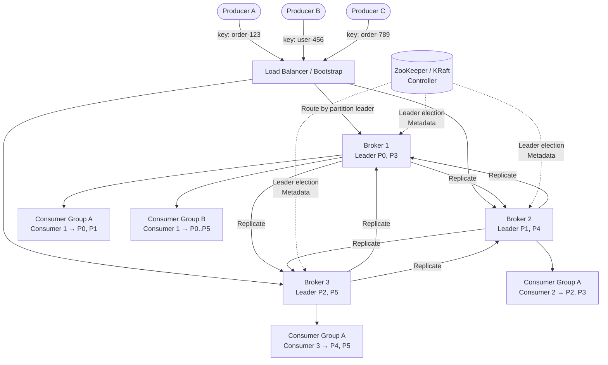

# Case Study: Pub-Sub / Message Queue System (Kafka-Style)

## Quick Summary (TL;DR)
- **Goal**: Design a distributed publish-subscribe messaging system that durably stores ordered streams of records, supports multiple consumer groups, and scales horizontally — essentially a Kafka-style commit log.
- **Scale**: 5 million messages/sec ingestion, 7-day retention by default, petabytes of on-disk storage.
- **Key Decisions**:
  - Use an **append-only commit log** per partition — sequential disk I/O is faster than random access, eliminating the need for in-memory message stores.
  - Use **partitioned topics** with hash-based routing to guarantee per-key ordering while enabling horizontal parallelism.
  - Use **consumer groups** with partition assignment so each message is processed by exactly one consumer within a group, enabling load-balanced consumption.
  - Use **ISR (In-Sync Replicas)** with a configurable `acks` policy to let producers trade off between latency and durability.

---

## 🤓 Noob Jargon Buster

* **Commit Log**: An append-only, ordered, immutable sequence of records — like a database's write-ahead log, but exposed as the primary data structure. Producers append to the end; consumers read from any position using an offset.
* **Topic**: A named feed of messages (e.g., `order-events`). Producers write to a topic; consumers subscribe to it. Think of it as a "category" for related events.
* **Partition**: A topic is split into partitions — each partition is an independent, ordered commit log. Partitions are the unit of parallelism: more partitions = more consumers can read in parallel.
* **Offset**: A monotonically increasing integer that identifies a message's position within a partition. Consumers track their offset to know where they left off.
* **Consumer Group**: A set of consumers that cooperatively read a topic. Kafka assigns each partition to exactly one consumer in the group — so the group collectively reads the full topic without duplicates.
* **ISR (In-Sync Replicas)**: The subset of replicas that are fully caught up with the leader partition. Only ISR members are eligible to become the new leader if the current one fails.
* **Log Compaction**: Instead of deleting old messages by time, retain only the latest value per key. Useful for changelog topics where you want the "current state" of each entity.
* **Rebalance**: When a consumer joins or leaves a group, partitions are redistributed among the remaining consumers. During rebalance, consumption pauses briefly.

> **Cross-reference**: For deeper Kafka internals (producer configs, consumer APIs, serialization, exactly-once transactions), see the detailed notes in [`event-driven/`](../../event-driven/index.md) — chapters 1-9 cover Kafka's architecture end-to-end.

---

## 1. Requirements & Scope

### Functional
1. **Publish**: Producers send messages to named topics. Messages are key-value pairs with optional headers.
2. **Subscribe**: Consumers subscribe to topics and receive messages in order (per partition).
3. **Consumer Groups**: Multiple consumer groups can independently read the same topic at different speeds without interfering.
4. **Retention**: Messages are retained for a configurable duration (default 7 days) or by size, independent of whether they have been consumed.
5. **Replay**: Consumers can reset their offset to re-read historical messages (e.g., reprocess after a bug fix).
6. **Ordering Guarantee**: Messages with the same key are always delivered to the same partition, preserving per-key ordering.

### Non-Functional
- **High Throughput**: Sustain 5 million messages/sec writes across the cluster.
- **Low Latency**: p99 publish latency < 10ms for `acks=1`; p99 end-to-end latency < 50ms.
- **Durability**: No acknowledged message is ever lost — `acks=all` with `min.insync.replicas=2`.
- **Horizontal Scalability**: Add brokers and partitions without downtime.
- **Fault Tolerant**: Survive broker failures with automatic leader election and replica promotion.

---

## 2. Scale Estimation (The Math)

### Throughput (QPS)
- **Peak Ingestion**: 5 million messages/sec across all topics.
- **Average Message Size**: 1 KB (JSON event payload + headers).
- **Ingestion Bandwidth**: $5\text{M msgs/sec} \times 1 \text{ KB} = 5 \text{ GB/sec}$.
- **With Replication Factor 3**: $5 \text{ GB/sec} \times 3 = 15 \text{ GB/sec}$ total disk write throughput across the cluster.

### Storage
- **Daily Ingestion**: $5\text{M msgs/sec} \times 86,400 \text{ sec} \times 1 \text{ KB} = 432 \text{ TB/day}$ (raw, single copy).
- **With RF=3**: $432 \text{ TB} \times 3 = 1.3 \text{ PB/day}$.
- **7-Day Retention**: $1.3 \text{ PB} \times 7 = 9.1 \text{ PB}$ total disk footprint.
- **SDE-2 Insight**: This is why Kafka uses sequential I/O + zero-copy (`sendfile` syscall) — random-access storage at this scale would require SSDs costing 10x more.

### Cluster Sizing
- **Broker Count**: A single broker with 12 HDDs (JBOD) can sustain ~600 MB/sec sequential write. For 15 GB/sec cluster throughput: $\lceil 15,000 / 600 \rceil = 25$ brokers minimum. Budget 30-35 for headroom.
- **Partitions per Topic**: High-throughput topic with 5 consumer instances → at least 5 partitions (1:1 consumer-to-partition). Typically 3x for growth → 15 partitions.

### Memory
- **Page Cache is King**: Kafka doesn't maintain an application-level cache. It relies on the OS page cache. Brokers with 64 GB RAM can cache ~50 GB of hot log segments, serving most consumer reads directly from memory without disk seeks.

---

## 3. System API Design

### A. Produce Messages
- **Endpoint**: `POST /v1/topics/{topic_name}/messages`
- **Request Payload**:
  ```json
  {
    "messages": [
      {
        "key": "order-12345",
        "value": "{\"event\": \"order.created\", \"amount\": 99.99}",
        "headers": { "source": "order-service", "trace_id": "abc-123" }
      }
    ],
    "acks": "all"
  }
  ```
- **Response**: `200 OK` with partition and offset assignments:
  ```json
  {
    "results": [
      { "partition": 7, "offset": 1048576 }
    ]
  }
  ```

### B. Consume Messages
- **Endpoint**: `GET /v1/topics/{topic_name}/messages?group_id=payment-processor&max_records=500`
- **Response**:
  ```json
  {
    "records": [
      {
        "partition": 7,
        "offset": 1048576,
        "key": "order-12345",
        "value": "{\"event\": \"order.created\", \"amount\": 99.99}",
        "timestamp": 1748620800000
      }
    ]
  }
  ```

### C. Commit Offsets
- **Endpoint**: `POST /v1/topics/{topic_name}/offsets`
- **Request Payload**:
  ```json
  {
    "group_id": "payment-processor",
    "offsets": [
      { "partition": 7, "offset": 1048577 }
    ]
  }
  ```

### D. Admin — Create Topic
- **Endpoint**: `POST /v1/admin/topics`
- **Request Payload**:
  ```json
  {
    "name": "order-events",
    "partitions": 12,
    "replication_factor": 3,
    "retention_ms": 604800000,
    "cleanup_policy": "delete"
  }
  ```

---

## 4. Data Model & Storage Design

### On-Disk Log Structure

```
/data/kafka-logs/
  order-events-0/               ← Partition 0
    00000000000000000000.log    ← Segment file (append-only)
    00000000000000000000.index  ← Sparse offset → byte-position index
    00000000000000000000.timeindex  ← Timestamp → offset index
    00000000000001048576.log    ← Next segment (after 1GB or 7 days)
  order-events-1/               ← Partition 1
    ...
```

**Key design choices**:
- **Segment files**: Each partition's log is split into segments (default 1 GB). Old segments are deleted or compacted based on retention policy.
- **Sparse index**: Not every offset is indexed — one entry per 4 KB of log data. Consumer reads use binary search on the index, then a short sequential scan within the segment.
- **Zero-copy transfer**: On read, the broker uses `sendfile()` to transfer data directly from the page cache to the network socket, bypassing user-space copies.

### Offset Storage (Consumer Group State)
- **Internal Topic**: `__consumer_offsets` — a compacted topic partitioned by `hash(group_id) % 50`.
- **Record Format**: Key = `(group_id, topic, partition)`, Value = `(offset, metadata, timestamp)`.
- This means offset commits are just regular Kafka produce operations — leveraging the same durability and replication guarantees.

---

## 5. High-Level Architecture



### Data Flow (Step-by-Step)
1. **Producer** hashes the message key (`murmur2(key) % num_partitions`) to determine the target partition.
2. Producer resolves the **partition leader** from cached metadata (refreshed from any broker) and sends directly to that broker.
3. **Leader broker** appends the message to its local log segment, then replicates to follower brokers.
4. Once `min.insync.replicas` followers acknowledge, the leader responds to the producer (for `acks=all`).
5. **Consumers** in a consumer group are each assigned a subset of partitions by the **Group Coordinator** (a designated broker).
6. Each consumer fetches messages from its assigned partition leaders, processes them, and commits offsets to `__consumer_offsets`.

---

## 6. Deep Dives

### A. Topics & Partitions

A topic is a logical stream; partitions are the physical unit of storage and parallelism.

```
Topic: order-events (6 partitions, RF=3)

  Partition 0: [msg0, msg1, msg2, msg3, ...] → Leader: Broker 1, Followers: Broker 2, 3
  Partition 1: [msg0, msg1, msg2, ...]       → Leader: Broker 2, Followers: Broker 1, 3
  Partition 2: [msg0, msg1, ...]             → Leader: Broker 3, Followers: Broker 1, 2
  ...
```

**How many partitions?** Rule of thumb: `max(target_throughput / per-partition-throughput, consumer_count)`. A single partition can handle ~10 MB/sec writes. For 100 MB/sec topic throughput → 10+ partitions. But don't over-partition — more partitions = more file handles, slower leader elections, and higher end-to-end latency.

### B. Producer Partitioning Strategies

| Strategy | How It Works | When to Use |
|----------|-------------|-------------|
| **Key-based (default)** | `murmur2(key) % partitions` | Need per-key ordering (e.g., all events for order-123 go to same partition) |
| **Round-robin** | Rotate across partitions sequentially | No key; maximize throughput with even distribution |
| **Sticky partitioner** | Batch to one partition until batch is full, then switch | Kafka 2.4+ default for null keys; reduces request count |
| **Custom partitioner** | User-defined logic (e.g., region-based) | Multi-tenant isolation, geo-routing |

**Ordering trap**: If you add partitions to a topic, `murmur2(key) % new_count` changes → the same key maps to a different partition. Existing ordering guarantees break. Mitigation: plan partition count upfront, or use a custom partitioner with a lookup table.

### C. Consumer Groups & Rebalancing

**Partition assignment**: Within a consumer group, each partition is assigned to exactly one consumer. If `partitions > consumers`, some consumers handle multiple partitions. If `consumers > partitions`, excess consumers sit idle.

**Rebalance triggers**:
- Consumer joins or leaves the group
- Consumer fails to send heartbeat within `session.timeout.ms`
- Topic partition count changes

**Rebalance protocols**:

| Protocol | Behavior | Downside |
|----------|----------|----------|
| **Eager (Stop-the-World)** | All consumers revoke all partitions, then reassign | Full consumption pause during rebalance |
| **Cooperative (Incremental)** | Only affected partitions are revoked and reassigned | Minimal disruption; recommended for production |

> **Cross-reference**: See [`event-driven/kafka-chapter-4.md`](../../event-driven/kafka-chapter-4.md) for consumer group internals, `partition.assignment.strategy`, and `ConsumerRebalanceListener` code examples.

### D. Offset Management

Consumers track progress via offsets. Two commit modes:

1. **Auto-commit** (`enable.auto.commit=true`): Offsets are committed every `auto.commit.interval.ms` (default 5s). Simple but risks duplicates — if the consumer crashes between processing and the next auto-commit, messages are re-delivered.
2. **Manual commit**: Consumer explicitly calls `commitSync()` or `commitAsync()` after processing. Gives precise control but requires careful placement — commit *after* processing, not before.

**Reset policies** (`auto.offset.reset`):
- `earliest` — start from the beginning (replay all history)
- `latest` — start from the newest message (skip history)
- `none` — throw an exception if no committed offset exists

### E. Replication & ISR (In-Sync Replicas)

```
Partition 0:
  Leader (Broker 1):   [0, 1, 2, 3, 4, 5, 6, 7, 8, 9]   ← LEO = 10
  Follower (Broker 2): [0, 1, 2, 3, 4, 5, 6, 7, 8, 9]   ← In-sync (ISR)
  Follower (Broker 3): [0, 1, 2, 3, 4, 5, 6]             ← Lagging → removed from ISR

  High-Water Mark (HW) = 7  ← Consumers can only read up to HW
```

**Key mechanics**:
- **Leader Epoch**: Monotonically increasing number that changes with each leader election. Prevents "split-brain" scenarios where a stale leader accepts writes.
- **High-Water Mark (HW)**: The offset up to which all ISR replicas have replicated. Consumers never see messages beyond HW — this prevents reading data that might be lost if the leader crashes.
- **`min.insync.replicas`**: The minimum number of ISR members required for a write to succeed (with `acks=all`). Setting `RF=3, min.insync.replicas=2` tolerates 1 broker failure without data loss or write unavailability.
- **Unclean leader election** (`unclean.leader.election.enable`): If all ISR replicas are dead, should a non-ISR (lagging) replica become leader? `true` = availability over consistency; `false` = partition goes offline until an ISR member recovers. Default: `false` (data safety wins).

### F. Log Compaction

Standard retention (`cleanup.policy=delete`) removes old segments by time or size. Log compaction (`cleanup.policy=compact`) retains only the latest value per key.

```
Before compaction:
  offset 0: key=A, value=v1
  offset 1: key=B, value=v1
  offset 2: key=A, value=v2   ← newer value for A
  offset 3: key=C, value=v1
  offset 4: key=B, value=v2   ← newer value for B

After compaction:
  offset 2: key=A, value=v2
  offset 3: key=C, value=v1
  offset 4: key=B, value=v2
```

**Use cases**: Changelog topics for databases (CDC), KTable state stores in Kafka Streams, configuration distribution. The compacted topic acts as a snapshot of the latest state — new consumers get the "current" state without replaying the full history.

**Tombstones**: Publishing a message with `value=null` marks the key for deletion. After the `delete.retention.ms` window, the tombstone is removed during compaction.

### G. Exactly-Once Semantics (EOS)

Kafka provides three delivery guarantees:

| Guarantee | Mechanism | Trade-off |
|-----------|-----------|-----------|
| **At-most-once** | Commit offset before processing | Fast, but messages can be lost |
| **At-least-once** | Commit offset after processing | Safe, but duplicates possible |
| **Exactly-once** | Idempotent producer + transactional API | Strongest, ~3-5% throughput overhead |

**How EOS works**:

1. **Idempotent Producer** (`enable.idempotence=true`): Each producer gets a PID (Producer ID). Every message carries a sequence number. The broker deduplicates by `(PID, partition, sequence)` — retries don't create duplicates.
2. **Transactional API**: Wraps a consume-transform-produce cycle in a transaction. Either all output messages AND the consumer offset commit succeed atomically, or none do.
   ```
   producer.beginTransaction();
   // consume from input topic, process, produce to output topic
   producer.sendOffsetsToTransaction(offsets, groupMetadata);
   producer.commitTransaction();
   ```
3. **Consumer `isolation.level=read_committed`**: Consumers skip messages from aborted transactions — they only see committed data.

> **Cross-reference**: See [`event-driven/kafka-chapter-3.md`](../../event-driven/kafka-chapter-3.md) for producer idempotency internals and [`event-driven/kafka-chapter-4.md`](../../event-driven/kafka-chapter-4.md) for consumer transaction isolation.

---

## 7. Kafka vs RabbitMQ vs SQS

| Dimension | Kafka | RabbitMQ | AWS SQS |
|-----------|-------|----------|---------|
| **Model** | Distributed commit log | Message broker (AMQP) | Managed message queue |
| **Ordering** | Per-partition ordering guaranteed | Per-queue FIFO (with single consumer) | FIFO queues (with dedup) or standard (best-effort) |
| **Retention** | Retained after consumption (time/size-based) | Deleted after ACK | Deleted after processing (14-day max retention) |
| **Throughput** | Millions/sec (sequential disk I/O) | ~50K-100K/sec per node | ~3K-30K/sec per queue (soft limits) |
| **Consumer Model** | Pull-based (consumer polls) | Push-based (broker pushes to consumer) | Pull-based (long polling) |
| **Replay** | Yes — reset offset to any position | No — once consumed, gone | No — once deleted, gone |
| **Routing** | Topic + partition key | Exchange → Binding → Queue (flexible routing) | Queue name (simple) |
| **Exactly-Once** | Native (idempotent + transactional) | Not native (use dedup at app level) | FIFO queues with dedup ID |
| **Ops Overhead** | High (manage brokers, ZK/KRaft, partitions) | Medium (Erlang runtime, clustering) | Zero (fully managed) |
| **Best For** | Event streaming, log aggregation, CDC | Task queues, RPC, complex routing | Simple decoupling, serverless |

**When to pick what**:
- **Kafka**: You need event replay, high throughput, stream processing, or multiple consumers reading the same data independently.
- **RabbitMQ**: You need flexible routing (topic/fanout exchanges), per-message TTL, priority queues, or request-reply patterns.
- **SQS**: You want zero ops overhead, modest throughput, and simple point-to-point decoupling in AWS.

---

## 8. Operational Concerns

### A. Guaranteeing Ordering

Ordering is guaranteed **within a partition**, not across partitions. Strategies:

1. **Single partition**: Absolute ordering but zero parallelism — only for low-throughput topics.
2. **Key-based partitioning**: All events for the same entity (e.g., `order-123`) go to the same partition. Ordering per entity, parallelism across entities.
3. **Avoid `max.in.flight.requests.per.connection > 1` without idempotency**: If the producer sends batch A then batch B, and batch A fails and retries, batch B may be written first → out-of-order. Fix: enable idempotency (which caps in-flight to 5 with sequence ordering) or set `max.in.flight.requests.per.connection=1`.

### B. Handling Consumer Lag

Consumer lag = `latest offset - consumer's committed offset`. If lag grows, the consumer is falling behind.

**Detection**: Monitor `kafka.consumer:type=consumer-fetch-manager-metrics,client-id=*` JMX metrics, or use `kafka-consumer-groups.sh --describe`.

**Mitigation**:
1. **Scale out consumers**: Add more consumers to the group (up to partition count).
2. **Increase `fetch.min.bytes` and `fetch.max.wait.ms`**: Fetch larger batches less frequently — better throughput.
3. **Optimize processing**: Profile the consumer's message handling. Offload heavy work (e.g., DB writes) to a thread pool.
4. **Backpressure via `max.poll.records`**: Limit records per poll to prevent long processing intervals that trigger rebalances.
5. **Emergency**: Temporarily increase partitions and consumers (with caution about key rebalancing).

### C. Dead Letter Queues (DLQ)

Kafka doesn't have a native DLQ. Implement it at the application level:

```
Consumer reads message from "order-events"
  → Process succeeds → commit offset
  → Process fails (3 retries exhausted)
    → Produce the failed message to "order-events.DLQ" with error metadata
    → Commit offset for original message (so it's not re-delivered)
    → Alert on DLQ depth via monitoring
```

DLQ messages include the original payload plus: failure reason, retry count, timestamp, source partition/offset. A separate DLQ processor can attempt reprocessing or route to manual review.

### D. ZooKeeper vs KRaft

| Aspect | ZooKeeper Mode | KRaft Mode (Kafka 3.3+) |
|--------|---------------|------------------------|
| **Metadata storage** | External ZooKeeper ensemble | Internal Raft-based quorum controller |
| **Scalability** | ZK becomes bottleneck at ~200K partitions | Supports millions of partitions |
| **Ops complexity** | Two separate systems to manage | Single system |
| **Migration** | Legacy default | Production-ready since Kafka 3.6; ZK deprecated in 4.0 |

---

## 9. Why Choose This? (Defending Your Architecture)

### 🧭 Why an append-only log instead of a traditional message queue?
* **Answer**: "Traditional message queues (like RabbitMQ) delete messages after consumption. An append-only log retains messages for a configured period, enabling multiple consumer groups to read independently and at different speeds. This is critical for event sourcing, stream processing, and replaying data after bug fixes. Sequential append also gives us O(1) disk writes — we're limited by disk bandwidth, not seeks."

### 🧭 Why partition the topic instead of having a single ordered stream?
* **Answer**: "A single partition gives perfect global ordering but zero parallelism — throughput is capped at what one broker and one consumer can handle. Partitioning lets us scale linearly: 12 partitions means 12 consumers can process in parallel. We sacrifice global ordering but retain per-partition ordering, which is sufficient when we partition by entity key — all events for the same order are ordered."

### 🧭 Why pull-based consumers instead of push-based?
* **Answer**: "Push-based systems risk overwhelming slow consumers — the broker doesn't know the consumer's processing capacity. Pull-based lets each consumer control its own rate. A fast consumer pulls aggressively; a slow consumer pulls at its pace. This naturally provides backpressure without complex flow-control protocols. The downside — potential idle polling — is solved by long-polling (`fetch.max.wait.ms`)."

### 🧭 Why rely on OS page cache instead of an application-level cache?
* **Answer**: "The JVM's garbage collector would struggle with gigabytes of cached messages — long GC pauses would stall the broker. The OS page cache is managed outside the JVM heap, uses all available RAM, and is evicted using LRU without application involvement. On restart, the page cache survives (the process restarts, not the OS), so the broker instantly resumes serving from cache. This is also why Kafka brokers are intentionally allocated modest JVM heap (6-8 GB) despite having 64+ GB of RAM."

---

## 10. SDE-2 Interview Angles

**Q1: How does Kafka guarantee message ordering, and what breaks it?**

**A**: Kafka guarantees ordering within a single partition. All messages with the same key are hashed to the same partition (`murmur2(key) % partition_count`), so per-entity ordering is preserved. Ordering breaks in three scenarios: (1) the producer has `max.in.flight.requests.per.connection > 1` without idempotency enabled — a retry of batch A can land after batch B; (2) you increase the partition count — the hash mapping changes, and the same key may now go to a different partition; (3) you use round-robin partitioning (no key) — messages scatter across partitions with no ordering relationship.

**Q2: Explain the ISR mechanism and what happens when a broker fails.**

**A**: Each partition has a leader and N-1 follower replicas. Followers continuously fetch from the leader. A follower is in the ISR if it's caught up within `replica.lag.time.max.ms` (default 30s). When the leader dies, the controller elects a new leader from the ISR — this guarantees no data loss because ISR members have all committed messages. With `acks=all` and `min.insync.replicas=2` on a RF=3 topic, we tolerate 1 broker failure. If ISR shrinks below `min.insync.replicas`, producers receive `NotEnoughReplicasException` — the system chooses unavailability over data loss (CP in CAP terms).

**Q3: How would you implement exactly-once processing in a consume-transform-produce pipeline?**

**A**: Three components work together: (1) Enable `enable.idempotence=true` on the producer — this assigns a PID and sequence numbers so the broker deduplicates retries. (2) Use the Transactional API — `beginTransaction()`, produce output messages, call `sendOffsetsToTransaction()` to atomically commit consumer offsets with the produced messages, then `commitTransaction()`. If anything fails, `abortTransaction()` rolls back everything. (3) Set `isolation.level=read_committed` on downstream consumers so they skip messages from aborted transactions. The overhead is ~3-5% throughput reduction due to transaction markers and two-phase commit coordination.

**Q4: A consumer group's lag is growing — walk me through your debugging and mitigation steps.**

**A**: First, identify the lagging partitions: `kafka-consumer-groups.sh --describe --group my-group`. Check if lag is uniform (all partitions lagging = slow processing) or skewed (one partition lagging = hot key). For uniform lag: (1) check consumer processing time per message — profile for slow DB calls or external service latency; (2) reduce `max.poll.records` to prevent `poll()` timeouts triggering rebalances; (3) add more consumers (up to partition count). For skewed lag: the hot partition likely has a disproportionately popular key — consider a custom partitioner that further sub-shards hot keys, or add a random suffix to the key to spread load (at the cost of per-key ordering). As a last resort, increase partitions — but this is irreversible and breaks key-to-partition mapping for existing keys.

**Q5: Compare `cleanup.policy=delete` vs `cleanup.policy=compact`. When would you use each?**

**A**: `delete` removes entire log segments older than `retention.ms` (or when total size exceeds `retention.bytes`). Use it for event streams where historical events lose value over time — click events, logs, metrics. `compact` retains only the latest value per key, regardless of age. Use it for changelog/state topics — e.g., a user-profile topic where you always want the current profile, not the full edit history. Compaction runs in the background: a cleaner thread identifies "dirty" (uncompacted) segments, deduplicates by key, and writes a new cleaned segment. Publishing `key=X, value=null` creates a tombstone — the key is deleted after `delete.retention.ms`. You can combine both: `cleanup.policy=compact,delete` — compact first, then delete segments older than retention.

---

## 11. Common Traps & Mitigations

1. **Over-Partitioning**: Creating 1000 partitions "for future scale" when current throughput needs 10. Each partition = open file handles, memory for index caches, and slower leader elections. Start with `max(throughput_requirement / 10MB_sec, consumer_count)` and scale later.
   - *Mitigation*: Benchmark with realistic load. Kafka can handle partition increases (but not decreases) — start conservative.

2. **Consumer Rebalance Storms**: Consumers with long processing times exceed `max.poll.interval.ms` → get kicked from the group → rejoin → trigger another rebalance → cascade.
   - *Mitigation*: Tune `max.poll.records` to limit work per poll. Use Cooperative Sticky assignor to minimize partition shuffling. Decouple processing from polling using a separate thread pool.

3. **Unbounded Consumer Group Lag on Compacted Topics**: A consumer falls behind and the cleaner compacts messages it hasn't read yet — those intermediate values are lost forever.
   - *Mitigation*: Monitor lag on compacted topics aggressively. The latest value per key is preserved, so no *data* is lost — but intermediate state transitions are gone. If intermediate values matter, use `delete` retention instead.

4. **Producer Timeout on `acks=all` with Degraded ISR**: One slow follower drags replication latency, causing producer timeouts even though the leader is healthy.
   - *Mitigation*: The slow follower will eventually be removed from ISR (after `replica.lag.time.max.ms`). Set `delivery.timeout.ms` to accommodate temporary ISR slowness. Monitor ISR shrink events as a leading indicator of broker health issues.

5. **Message Size Exceeding `max.message.bytes`**: A producer sends a 10 MB message but the broker rejects it (default limit 1 MB).
   - *Mitigation*: Align `max.message.bytes` (broker), `max.request.size` (producer), and `max.partition.fetch.bytes` (consumer). Better yet, store large payloads in object storage (S3) and send only a reference in the Kafka message — the "claim check" pattern.
