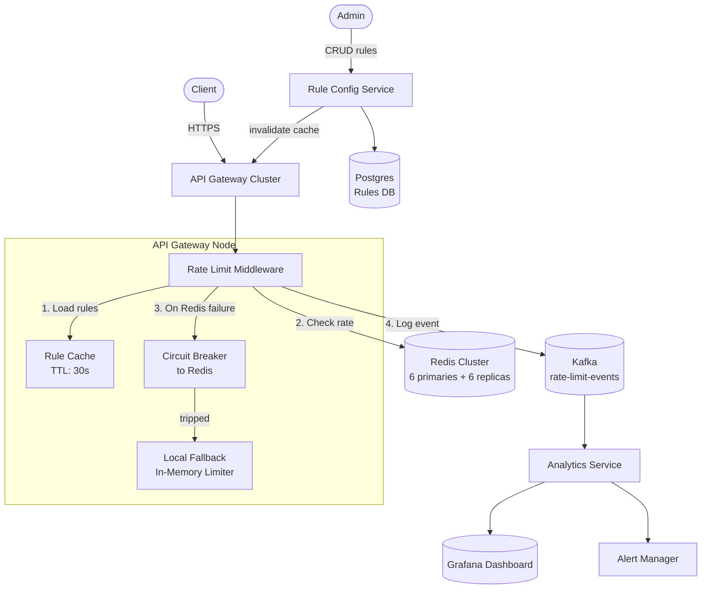
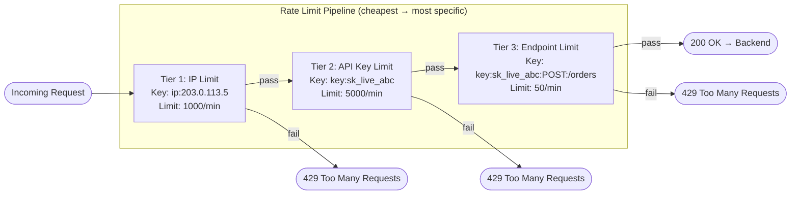
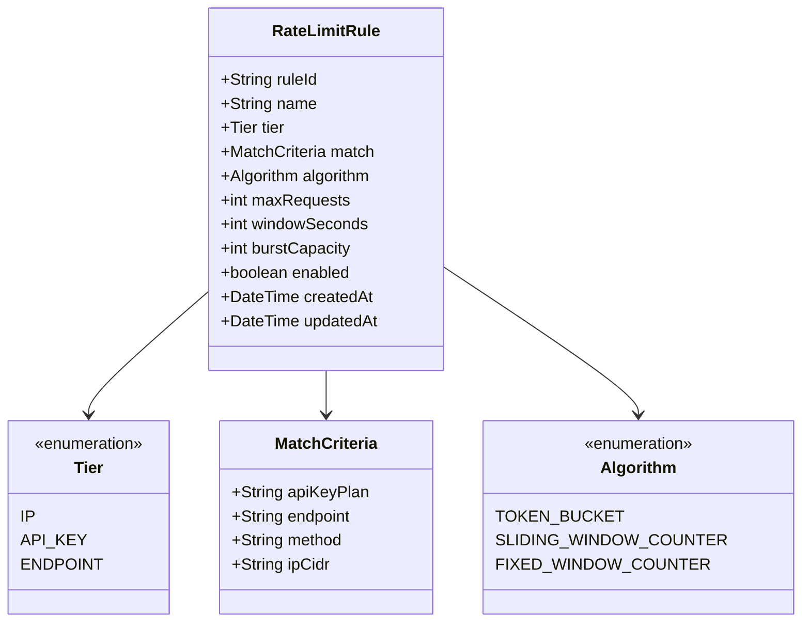
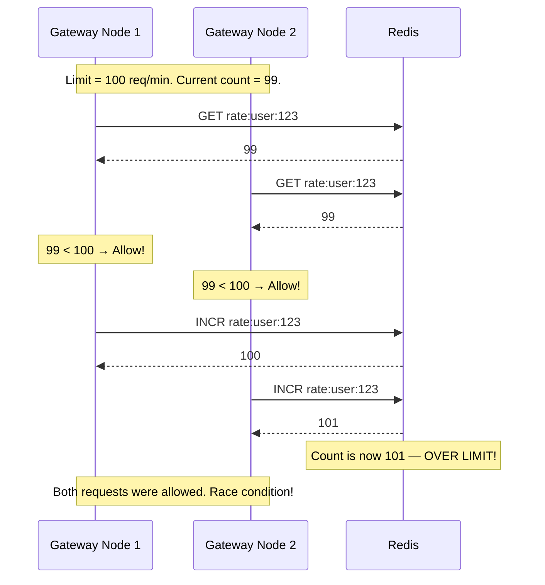
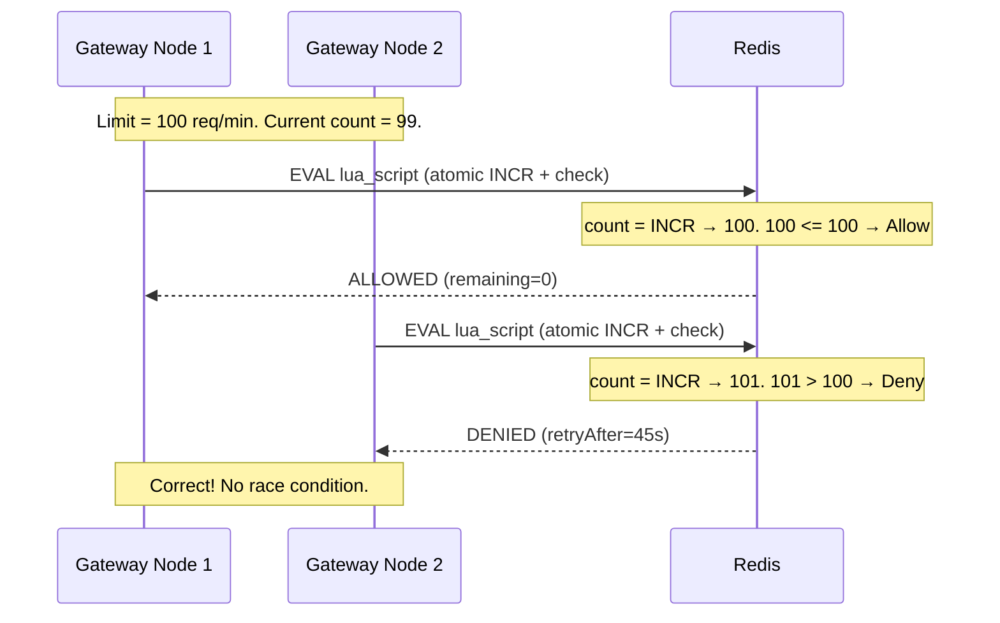
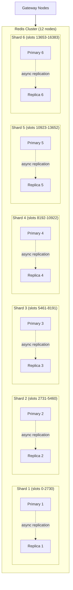
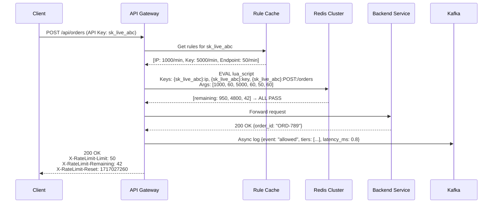

# Case Study: Design a Distributed Rate Limiter (System Design)

## Quick Summary (TL;DR)

- **Goal**: Design a distributed rate limiting service for a cloud API platform that enforces per-client request quotas across a fleet of API gateway nodes.
- **Scale**: 1M active API keys, 500K req/s peak, sub-millisecond check latency. Redis cluster as the shared state store.
- **Key Decisions**:
  - Use **Token Bucket** as the default algorithm (burst-tolerant, low memory, battle-tested by AWS/Stripe).
  - Use **Redis + Lua scripts** for atomic, distributed rate checks — no race conditions, no distributed locks.
  - Apply **multi-tier limiting** (IP → API Key → Endpoint) in a pipeline — cheapest check first.
  - Use a **Rule Configuration Engine** backed by a database with local caching — rules are hot-reloadable without deploys.
  - Stream all rate limit events to **Kafka** for analytics, alerting, and abuse detection.
- **Algorithm details**: See [building-blocks/rate-limiter.md](../building-blocks/rate-limiter.md) for the five algorithms, pseudocode, and comparison table.

---

## Noob Jargon Buster

* **Lua Script (Redis)**: A small program that runs inside Redis itself. Because Redis is single-threaded, a Lua script executes atomically — no other command can interleave. This replaces the need for distributed locks.
* **Hash Slot**: Redis Cluster divides keyspace into 16,384 slots. Each key hashes to a slot, and each slot lives on one node. Use hash tags like `{user:123}` to force related keys to the same slot.
* **Fail-Open vs Fail-Closed**: When the rate limiter is unavailable — fail-open means allow all traffic (preserve availability), fail-closed means reject all traffic (preserve safety). Most systems fail-open.
* **Circuit Breaker**: A pattern that detects repeated failures to an external service (like Redis) and "trips" — temporarily stopping calls and falling back to a default behavior. Prevents cascading failures.
* **Backpressure**: When a downstream system is overwhelmed, it signals upstream to slow down. Rate limiting IS a form of backpressure.

---

## 0. Clarifying Questions (Ask in the Interview)

Before diving into design, clarify scope with the interviewer:

| Question | Why It Matters | Default Assumption |
|----------|----------------|-------------------|
| Single-server or distributed? | Changes state management entirely | Distributed (multi-node gateway) |
| Which dimensions to limit? | IP, user, API key, endpoint, or combo | Multi-tier: IP + API Key + Endpoint |
| Hard limit or soft limit? | Hard = strict reject. Soft = allow small bursts over | Hard limit with Token Bucket burst buffer |
| What happens on rate limiter failure? | Fail-open (allow) or fail-closed (reject) | Fail-open with local fallback |
| Need analytics on rate limit events? | Affects whether we need a streaming pipeline | Yes — Kafka for analytics |
| Multi-region? | Affects consistency model | Single region first, discuss multi-region as extension |
| Real-time rule changes? | Affects config architecture | Yes — hot-reloadable without deploys |

---

## 1. Requirements & Scope

### Functional
1. **Rate Check**: For every incoming API request, check if the client has exceeded their quota. Return allow/deny with remaining quota and retry-after.
2. **Multi-Tier Limiting**: Apply limits by IP, API key, and endpoint independently. A request must pass ALL tiers.
3. **Rule Configuration**: Admins can create/update/delete rate limit rules (algorithm, limit, window) per tier via an API. Changes take effect within seconds.
4. **Standard Headers**: Return `X-RateLimit-Limit`, `X-RateLimit-Remaining`, `X-RateLimit-Reset`, `Retry-After` on every response.
5. **Analytics**: Track rate limit events (allowed, denied, by which tier) for dashboards and abuse detection.

### Non-Functional
- **Ultra-low latency**: Rate check must add < 2ms to request latency (P99).
- **High throughput**: Handle 500K rate checks/sec across the gateway fleet.
- **High availability**: Rate limiter failure must NOT cause API outage (fail-open).
- **Consistency**: Accept small windows of over-limit traffic (eventual consistency) rather than sacrificing availability.

---

## 2. Scale Estimation

### Throughput
- **API Traffic**: 500K req/s peak (200K avg).
- **Rate Checks Per Request**: 3 tiers (IP + API Key + Endpoint) = 1.5M Redis ops/sec peak.
  - Optimization: batch 3 checks into 1 Lua script = 500K Redis ops/sec.

### Storage (Redis)
- **Active API Keys**: 1M.
- **State Per Key**: ~100 bytes (token count, last refill time, key string).
- **Total**: 1M keys x 100 bytes x 3 tiers = **300 MB** base.
- **Redis overhead** (pointers, hash table): ~3x = **~1 GB** effective.
- **Fits in a single Redis node** (typical 16-64 GB), but we use a cluster for throughput.

### Redis Cluster Sizing
- **Single Redis node**: ~100K ops/sec (simple commands).
- **Need**: 500K ops/sec (batched Lua).
- **Nodes**: 500K / 100K = **6 primary nodes** (+ 6 replicas for HA) = 12-node cluster.

### Rule Storage
- **Rules count**: ~10K rules (1K API keys x 10 endpoint-specific rules).
- **Storage**: Postgres (durable) + local cache on each gateway node.

---

## 3. System API Design

### A. Rate Check (Internal — called by API Gateway)

This is an internal function, not an external HTTP API. The gateway middleware calls it on every request.

```
checkRateLimit(clientIp, apiKey, method, path) → RateLimitDecision

RateLimitDecision:
  allowed: boolean
  remaining: int
  retryAfterMs: long
  deniedByTier: string | null   // "ip" | "api_key" | "endpoint"
```

### B. Rule Management API (Admin)

```
POST   /v1/rate-limit/rules          — Create a new rule
GET    /v1/rate-limit/rules           — List all rules
PUT    /v1/rate-limit/rules/{ruleId}  — Update a rule
DELETE /v1/rate-limit/rules/{ruleId}  — Delete a rule
```

**Request Payload (Create/Update)**:
```json
{
  "name": "premium-tier-global",
  "tier": "api_key",
  "match": { "api_key_plan": "premium" },
  "algorithm": "token_bucket",
  "max_requests": 5000,
  "window_seconds": 60,
  "burst_capacity": 7500
}
```

### C. Analytics API

```
GET /v1/rate-limit/analytics?api_key=sk_live_abc&period=1h
```

**Response**:
```json
{
  "api_key": "sk_live_abc",
  "period": "1h",
  "total_requests": 45230,
  "allowed": 44980,
  "denied": 250,
  "denial_rate": 0.55,
  "top_denied_endpoints": [
    { "endpoint": "POST /api/orders", "denied": 180 }
  ]
}
```

---

## 4. High-Level Architecture



---

## 5. Multi-Tier Rate Limiting Pipeline

A request passes through multiple rate limit checks in a pipeline. Each tier has its own key, limit, and algorithm.



**Why this order?**
- **IP check is cheapest**: No auth needed. Blocks DDoS before any computation.
- **API Key check**: Requires parsing the auth header, but still a single key lookup.
- **Endpoint check**: Most specific, most keys — but only reached if the cheaper checks pass.

**Key Design**: All 3 checks are batched into a single Redis Lua script to minimize round-trips:

```lua
-- Single Lua script evaluates all 3 tiers atomically
local results = {}
for i = 1, #KEYS do
    local key = KEYS[i]
    local limit = tonumber(ARGV[i * 2 - 1])
    local window = tonumber(ARGV[i * 2])

    local current = redis.call('INCR', key)
    if current == 1 then
        redis.call('EXPIRE', key, window)
    end
    if current > limit then
        results[i] = 0  -- denied
    else
        results[i] = limit - current  -- remaining
    end
end
return results
```

---

## 6. Deep Dive: Rule Configuration Engine

### Rule Model



### Rule Resolution (Which Rule Applies?)

When a request arrives, the gateway must find the matching rule for each tier. Rules are resolved by specificity:

1. **Exact endpoint match**: `POST /api/orders` for API key `sk_live_abc` → most specific rule wins.
2. **API key plan match**: All `premium` plan keys → default for that plan.
3. **Global default**: Fallback if no specific rule matches.

```yaml
# Example rule config (stored in Postgres, cached locally)
rules:
  - name: "global-ip-limit"
    tier: IP
    match: { ip_cidr: "0.0.0.0/0" }     # all IPs
    algorithm: fixed_window_counter
    max_requests: 1000
    window_seconds: 60

  - name: "premium-api-key"
    tier: API_KEY
    match: { api_key_plan: "premium" }
    algorithm: token_bucket
    max_requests: 5000
    window_seconds: 60
    burst_capacity: 7500

  - name: "order-creation-limit"
    tier: ENDPOINT
    match: { method: "POST", endpoint: "/api/orders" }
    algorithm: sliding_window_counter
    max_requests: 50
    window_seconds: 60
```

### Cache Strategy

- **Postgres** is the source of truth for rules.
- Each gateway node caches rules locally with a **30-second TTL**.
- On rule update, the Rule Config Service publishes an **invalidation event** to the gateway nodes (via Redis Pub/Sub or internal event bus).
- On cache miss, the gateway fetches from Postgres and caches.
- **Cache-aside pattern** — simple and good enough for rules that change infrequently.

---

## 7. Deep Dive: Race Conditions & Atomicity

### The Race Condition (Naive Approach)



### The Fix: Lua Script (Atomic INCR + Check)



**Why Lua works**: Redis processes Lua scripts atomically — no other command can execute between the INCR and the comparison. This eliminates the TOCTOU (Time-of-Check-Time-of-Use) race.

---

## 8. Deep Dive: Redis Cluster Topology



### Hash Tag Trick

For the multi-tier Lua script to work, all 3 keys for a single request must land on the same Redis shard. Use **hash tags**:

```
{user:123}:ip          → hashes on "user:123" → same shard
{user:123}:api_key     → hashes on "user:123" → same shard
{user:123}:endpoint    → hashes on "user:123" → same shard
```

Redis only hashes the content inside `{}`, so all three keys go to the same slot.

**Trade-off**: This can cause hot spots if one user generates massive traffic. Monitor key distribution.

---

## 9. Deep Dive: Failure Modes & Resilience

### Circuit Breaker for Redis

```mermaid
stateDiagram-v2
    [*] --> Closed : Normal operation

    Closed --> Open : 5 consecutive Redis failures
    Open --> HalfOpen : After 10s cooldown
    HalfOpen --> Closed : Probe request succeeds
    HalfOpen --> Open : Probe request fails

    state Closed {
        Note right of Closed : All requests go to Redis
    }
    state Open {
        Note right of Open : Skip Redis, use local fallback
    }
    state HalfOpen {
        Note right of HalfOpen : Send 1 probe request to Redis
    }
```

### Failure Scenarios

| Scenario | Behavior | Impact |
|----------|----------|--------|
| **Redis node down** | Cluster auto-failover to replica (~5s). Circuit breaker trips → local fallback. | Brief over-limit window (~5s) |
| **Redis cluster down** | All gateways fail-open OR use local in-memory rate limiter. | Per-node limits only (not global). Accept temporary inaccuracy. |
| **Network partition** | Gateway can't reach Redis. Circuit breaker trips → local fallback. | Same as cluster down. |
| **Lua script timeout** | Redis kills script after `lua-time-limit`. Request fails-open. | Rare. Tune script complexity. |
| **Rule DB down** | Gateways use cached rules. No new rule updates until recovery. | Stale rules, no outage. |

### Local Fallback Limiter

When the circuit breaker is open, each gateway node runs a local in-memory rate limiter:

- Uses the same algorithm (Token Bucket) but with **per-node limits** = `global_limit / num_nodes`.
- Inaccurate (doesn't see other nodes' traffic) but prevents total loss of rate limiting.
- Logs a warning so ops team knows distributed limiting is degraded.

---

## 10. Monitoring & Alerting

| Metric | Source | Alert Threshold |
|--------|--------|----------------|
| `rate_limit.check_latency_p99` | Gateway | > 2ms |
| `rate_limit.denied_rate` | Kafka analytics | > 5% of total traffic |
| `rate_limit.redis_error_rate` | Gateway | > 1% (triggers circuit breaker investigation) |
| `rate_limit.circuit_breaker_open` | Gateway | Any node → page oncall |
| `rate_limit.rule_cache_miss_rate` | Gateway | > 10% (cache TTL too short or rule churn) |
| `rate_limit.429_by_api_key` | Analytics | Sudden spike for one key → possible abuse |

### Grafana Dashboard Panels

1. **Request rate** — allowed vs denied, by tier.
2. **Top denied API keys** — sorted by 429 count.
3. **Redis latency** — P50, P95, P99 of Lua script execution.
4. **Circuit breaker state** — per gateway node.
5. **Rule cache hit rate** — should be > 99%.

---

## 11. Multi-Region Extension

For a globally distributed API platform:

| Approach | How It Works | Trade-off |
|----------|-------------|-----------|
| **Independent per-region** | Each region has its own Redis cluster. Limits are per-region. | Simple. User hitting 2 regions gets 2x the limit. |
| **Global sync via Kafka** | Each region publishes counts to Kafka. Consumers aggregate globally. | ~seconds lag. Good enough for most use cases. |
| **Global Redis (CRDTs)** | Use Redis Enterprise with Active-Active (CRDT counters). Eventual consistency. | Expensive. Counters may temporarily over-count. |

**Recommendation**: Start with independent per-region. If abuse patterns span regions, add Kafka-based aggregation.

---

## 12. End-to-End Request Flow



---

## Interview Angles

1. **"Walk me through your design"** — Start with clarifying questions (Section 0). State requirements. Do scale estimation. Draw the architecture (gateway + Redis + Kafka). Deep-dive into Lua atomicity and multi-tier pipeline.

2. **"Why Redis over a local counter?"** — Local counters don't share state across gateway nodes. With 10 gateway nodes and a limit of 100/min, each node would allow 100 → the user gets 1000/min. Redis is the shared coordination point.

3. **"What happens when Redis goes down?"** — Circuit breaker trips. Fall back to local in-memory limiter with per-node limits (global_limit / node_count). Fail-open to preserve availability. Log warnings. Accept brief over-limit window.

4. **"How do you avoid race conditions?"** — Redis Lua scripts are atomic. The INCR + check happens in a single script execution — no interleaving possible. This eliminates the TOCTOU race that happens with separate GET + INCR.

5. **"How do you handle hot keys?"** — A viral API key can overwhelm one Redis shard. Mitigations: (a) Monitor key distribution via `CLUSTER KEYSLOT`. (b) For extreme hot keys, use local caching with periodic sync (accuracy trade-off). (c) Rate limit at the gateway before hitting Redis (first-pass local check).

6. **"How would you support rate limiting across regions?"** — Start with independent per-region Redis clusters. If cross-region abuse is a concern, aggregate counts via Kafka with a few seconds of lag. For strict global limits, consider Redis Enterprise Active-Active with CRDT counters.

7. **"How do rule changes propagate?"** — Rules live in Postgres (source of truth). Gateway nodes cache rules with 30s TTL. On admin update, the Rule Config Service publishes an invalidation event. Worst-case propagation delay: 30 seconds. For instant propagation, use Redis Pub/Sub to notify all gateways.

---

## Traps

- **Forgetting distributed state**: Saying "I'll just use an in-memory counter" without mentioning cross-node coordination is a red flag. Always address how state is shared across gateway nodes.
- **Using distributed locks**: `SETNX`-based locks for rate limiting are overkill and add latency. Lua scripts give you atomicity without the complexity of lock management.
- **Fail-closed by default**: Saying "reject all requests if Redis is down" will concern the interviewer. Most production systems fail-open — a brief window of over-limit traffic is better than a full outage.
- **Ignoring headers**: Production rate limiters MUST return `X-RateLimit-Remaining`, `Retry-After`, etc. Forgetting these signals lack of production experience.
- **Single-tier only**: Limiting only by IP misses authenticated abuse. Limiting only by API key misses DDoS. Always layer tiers.
- **Ignoring hot keys**: If all requests for a viral API key hash to one Redis shard, that shard becomes the bottleneck. Mention monitoring and local caching as mitigations.
- **Over-engineering consistency**: Rate limiting is inherently approximate. Pursuing strong consistency (e.g., Raft consensus for every check) would destroy latency. Accept eventual consistency.
- **Forgetting analytics**: A rate limiter without observability is flying blind. Always mention Kafka/streaming for analytics and Grafana for dashboards.
