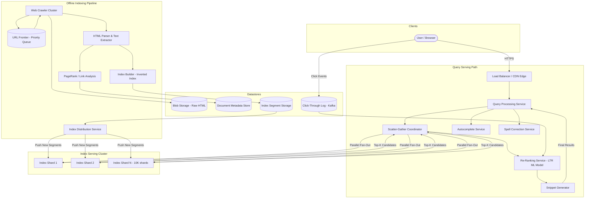
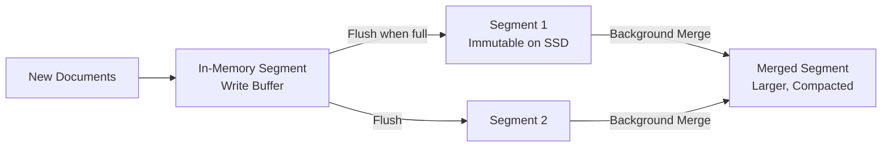
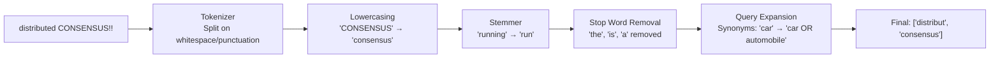
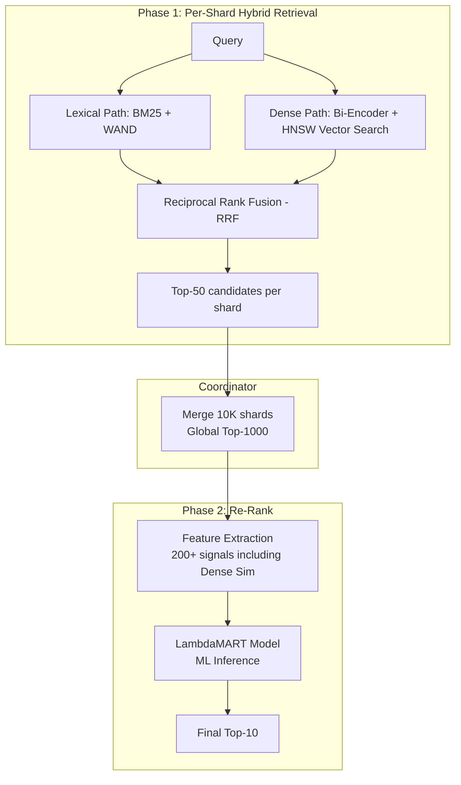
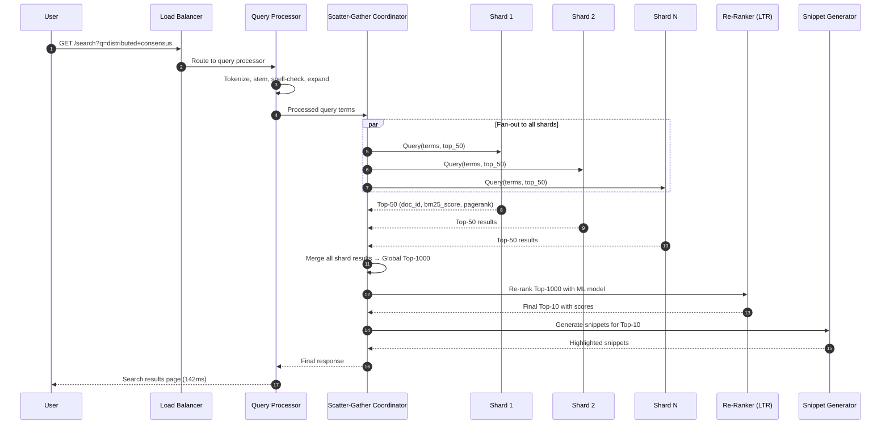
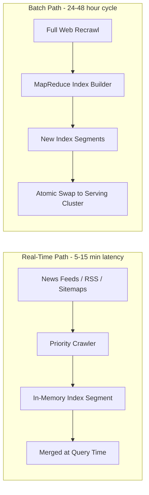

# Case Study: Search Engine (System Design)

## Quick Summary (TL;DR)
- **Goal**: Design a web-scale search engine that crawls billions of web pages, indexes their content, and returns the most relevant results in under 200ms for any free-text query.
- **Scale**: 8.5B queries/day (~100K QPS), 50B+ indexed pages, 100 PB+ of raw crawled data, index refreshed within hours of content changes.
- **Key Decisions**:
  - Use an **inverted index** as the core data structure — maps every unique term to a sorted list of document IDs (postings list), enabling sub-second full-text search across billions of documents.
  - Use a **two-phase retrieval pipeline** — Phase 1 (Candidate Selection) uses cheap BM25/TF-IDF scoring on the inverted index; Phase 2 (Re-ranking) applies expensive ML models (Learning-to-Rank) on only the top-K candidates.
  - Use **sharding by document ID (doc-sharding)** — the index is split across thousands of machines, and every query is scatter-gathered to all shards in parallel.
  - Use a **tiered index architecture** — hot (in-memory, most popular pages), warm (SSD), and cold (disk) tiers to balance latency vs. cost.
  - Use **PageRank + link analysis** as a static quality signal, combined with query-dependent relevance signals (BM25, proximity, freshness) for final ranking.

---

## Noob Jargon Buster

* **Inverted Index**: A data structure that maps each unique word to the list of documents containing it. Think of it as a book's back-of-the-book index — instead of scanning every page for "distributed", you jump straight to the index entry that says "distributed: pages 14, 87, 203".
* **Postings List**: The sorted list of document IDs (and metadata like positions, term frequency) associated with a term in the inverted index. For the term "kafka", the postings list might be `[doc_42, doc_1087, doc_55023, ...]`.
* **TF-IDF (Term Frequency - Inverse Document Frequency)**: A scoring formula. TF measures how often a term appears in a document; IDF measures how rare a term is across all documents. "the" has high TF but low IDF (every document has it). "kubernetes" has lower TF but high IDF (fewer documents mention it), making it more discriminating.
* **BM25 (Best Match 25)**: The industry-standard evolution of TF-IDF. Adds saturation (a term appearing 100 times isn't 100x better than appearing once) and document length normalization (a 50-word page mentioning "kafka" 5 times is more relevant than a 10,000-word page mentioning it 5 times).
* **PageRank**: Google's original algorithm. Each web page has a "rank" based on how many other pages link to it, weighted by the linker's own rank. A link from Wikipedia counts more than a link from a random blog.
* **Scatter-Gather**: A query fan-out pattern. The query coordinator scatters the query to all index shards in parallel, each shard returns its local top-K results, and the coordinator gathers and merges them into a global top-K.
* **Learning-to-Rank (LTR)**: An ML model trained on click-through data that takes hundreds of features (BM25 score, PageRank, freshness, click-through rate, domain authority) and predicts the probability a user will click on each result.
* **Index Segment**: A chunk of the inverted index. New documents are first indexed into small in-memory segments, then periodically merged into larger immutable on-disk segments (similar to LSM-Tree compaction).
* **Tokenizer / Analyzer**: The pipeline that converts raw text into searchable tokens. "Running quickly!" becomes `["run", "quick"]` after lowercasing, stemming, and punctuation removal.

---

## 1. Requirements & Scope

### Functional
1. **Web Crawling**: Continuously discover and download billions of web pages, respecting robots.txt and politeness policies.
2. **Indexing**: Parse crawled HTML, extract text, build and maintain a searchable inverted index.
3. **Query Processing**: Accept free-text queries, tokenize and analyze them, retrieve matching documents from the index.
4. **Ranking**: Score and rank results by relevance using a combination of textual relevance (BM25), link authority (PageRank), freshness, and user engagement signals.
5. **Serving**: Return the top 10 results with title, URL, and snippet in under 200ms.
6. **Autocomplete / Suggestions**: Provide query suggestions as the user types.
7. **Spell Correction**: Detect and correct misspelled queries ("distribuuted systems" → "distributed systems").

### Non-Functional
- **Low Latency**: P99 query latency < 500ms, P50 < 200ms.
- **High Throughput**: Handle 100K QPS sustained, 300K QPS peak.
- **Freshness**: Breaking news pages indexed within 5-15 minutes. Regular pages refreshed within 24-48 hours.
- **Availability**: 99.99% uptime — search is a critical service; even seconds of downtime affect millions of users.
- **Index Completeness**: Cover 50B+ pages across all languages and content types.
- **Relevance Quality**: Measured by NDCG@10 (Normalized Discounted Cumulative Gain) — users should find what they need in the first 3 results 80%+ of the time.

---

## 2. Scale Estimation (The Math)

### Query Throughput
- **Daily queries**: 8.5B/day (Google-scale).
  - Average QPS: $\frac{8,500,000,000}{86,400} \approx 100,000 \text{ QPS}$.
  - Peak QPS: ~300,000 QPS (during major events, election nights, breaking news).
- **Per query**: Touches ~10,000 index shards in parallel, each returning top-50 candidates.

### Index Size
- **Crawled pages**: 50B pages.
- **Average page text**: ~10 KB of extracted text (after HTML stripping).
- **Raw text corpus**: $50\text{B} \times 10\text{ KB} = 500\text{ TB}$.
- **Unique terms**: ~1B unique tokens across all languages.
- **Inverted index size**: Compressed postings lists ≈ 10-20% of raw text → **50-100 TB** of index data.
- **Forward index** (doc metadata: URL, title, snippet, PageRank, language): ~500 bytes/doc × 50B = **25 TB**.

### Storage
- **Raw crawled HTML**: $50\text{B} \times 50\text{ KB avg} = 2.5\text{ EB}$ (exabytes) — stored in distributed blob storage with compression.
- **Index replicas**: 3 replicas × 100 TB = **300 TB** of index storage.
- **Daily crawl ingestion**: ~5B pages recrawled/day × 50 KB = **250 TB/day** of raw HTML.

### Compute
- **Indexing pipeline**: Processing 250 TB/day of HTML → tokenization, link extraction, index building → ~50,000 CPU-cores for indexing.
- **Serving**: 100K QPS × 10K shards = 1B shard-queries/sec → requires ~100,000 serving machines with index partitions in memory/SSD.

---

## 3. System API Design

### A. Search Query
- **Endpoint**: `GET /v1/search`
- **Request**:
  ```
  GET /v1/search?q=distributed+consensus+algorithm&page=1&count=10&lang=en&safe=moderate
  ```
- **Response**:
  ```json
  {
    "query": "distributed consensus algorithm",
    "corrected_query": null,
    "total_results": 14200000,
    "latency_ms": 142,
    "results": [
      {
        "rank": 1,
        "url": "https://raft.github.io/",
        "title": "The Raft Consensus Algorithm",
        "snippet": "Raft is a <b>consensus algorithm</b> that is designed to be easy to understand. It's equivalent to Paxos in fault-tolerance...",
        "domain": "raft.github.io",
        "last_crawled": "2026-05-30T08:00:00Z",
        "score": 0.94
      }
    ],
    "suggestions": ["distributed consensus algorithm raft", "distributed consensus vs paxos"]
  }
  ```

### B. Autocomplete
- **Endpoint**: `GET /v1/suggest?q=distribut&limit=5`
- **Response**:
  ```json
  {
    "suggestions": [
      "distributed systems",
      "distributed database",
      "distributed consensus algorithm",
      "distributed tracing",
      "distributed computing"
    ]
  }
  ```

---

## 4. High-Level Architecture



---

## 5. Deep Dive: Core Components

### 5.1 Inverted Index — The Heart of Search

The inverted index is the single most important data structure. It transforms "find all documents containing word X" from a full scan ($O(N)$ over billions of docs) into a dictionary lookup ($O(1)$ to find the postings list, then $O(K)$ to scan K matching docs).

**Structure:**
```
Term Dictionary (Hash Map / Trie):
  "kafka"      → PostingsList_42
  "consensus"  → PostingsList_87
  "raft"       → PostingsList_103

PostingsList_42 (compressed, sorted by doc_id):
  [doc_5, doc_891, doc_2033, doc_15092, ...]
  Each entry: { doc_id, term_frequency, [positions] }
```

**Positional Index**: Stores the exact positions of each term within the document. This enables:
- **Phrase queries**: `"distributed consensus"` — check that "distributed" appears at position $P$ and "consensus" at position $P+1$.
- **Proximity scoring**: Documents where query terms appear within 5 words of each other score higher than documents where they're 200 words apart.

**Compression**: Postings lists are the dominant storage cost. Since doc_ids are sorted, we store **gaps (delta encoding)** instead of absolute values:
```
Raw:    [5, 891, 2033, 15092]
Deltas: [5, 886, 1142, 13059]
```
Deltas are then compressed with **Variable Byte Encoding (VByte)** or **PForDelta** — achieving 2-4x compression over raw integers.

**Index Segments & Merging** (LSM-Tree inspired):


- New documents are indexed into an in-memory write buffer (like an LSM memtable).
- When the buffer fills, it's flushed to an immutable on-disk segment.
- **Tiered Merge Policy**: To prevent search degradation across too many segments (O(num_segments) lookup penalty), background threads compact segments when a tier contains more than N (e.g., 10) segments of similar size. During compact/merge, obsolete or deleted document entries are garbage collected.
- **FST Term Compression**: The Term Dictionary is stored as a Finite State Transducer (FST). Unlike a traditional hash table, it shares prefixes and suffixes, compressing 1B terms into a compact ~2 GB memory footprint that fits entirely in RAM, eliminating disk seeks for term lookups.
- Queries search all active segments and merge results (newer segments override older ones for the same doc_id).

---

### 5.2 Query Processing Pipeline



**Multi-term query execution** — two strategies:

1. **DAAT (Document-At-A-Time)**: Iterate through the postings lists of all query terms simultaneously using a priority queue. For each document that appears in multiple lists, compute the combined score on the spot. Memory-efficient but slower for complex scoring.

2. **TAAT (Term-At-A-Time)**: Process one term's postings list fully, accumulating partial scores in a hash map, then process the next term. Uses more memory but enables early termination optimizations.

**Early Termination (WAND / Block-Max WAND)**:
Most queries don't need to score every matching document. The WAND (Weak AND) algorithm maintains a running threshold of the minimum score needed to enter the top-K results. It skips entire blocks of postings that provably cannot beat this threshold — reducing documents scored by 90%+.

```
Example: Query "distributed consensus", Top-10 requested

Without WAND: Score all 5M matching documents → sort → return top 10
With WAND:    Score ~50K documents (skip 99% of postings) → return top 10

The threshold rises as better candidates are found, enabling more aggressive skipping.
```

---

### 5.3 Ranking — Two-Phase Pipeline

#### Phase 1: Candidate Selection (Hybrid Retrieval: BM25 + Dense Vectors)
Runs on every index shard, must be fast (~10ms budget per shard).

To retrieve the most relevant candidate documents, we use a hybrid retrieval pipeline that combines **keyword matching** (Lexical Search) and **semantic understanding** (Vector Search).

##### A. Lexical Search (BM25 with WAND)
Uses an inverted index to find exact matches.
*   **BM25 Formula**:
    $$\text{BM25}(D, Q) = \sum_{i=1}^{n} \text{IDF}(q_i) \cdot \frac{f(q_i, D) \cdot (k_1 + 1)}{f(q_i, D) + k_1 \cdot \left(1 - b + b \cdot \frac{|D|}{\text{avgdl}}\right)}$$
    Where $f(q_i, D)$ is the term frequency of $q_i$ in doc $D$, $|D|$ is the document length, and $\text{avgdl}$ is the average document length.
*   **Why BM25?** Prevents keyword-stuffing via **term frequency saturation** ($k_1 = 1.2$) and penalizes long, irrelevant pages via **length normalization** ($b = 0.75$).
*   **Early Termination**: Run the **WAND (Weak AND)** algorithm to bypass checking documents that cannot mathematically enter the local top-K, skipping ~99% of postings list records.

##### B. Semantic Search (Dense Retrieval)
Handles vocabulary mismatch (synonyms, contextual meaning) using vector embeddings:
*   **Bi-Encoder Model**: A lightweight transformer (e.g., DistilBERT) embeds the query into a 768-dimensional vector at runtime. Document vectors are pre-computed offline.
*   **ANN Indexing**: Shards maintain a local Approximate Nearest Neighbor (ANN) index (e.g., **HNSW** or **ScaNN**) containing embedding vectors for high-authority pages (Tier-1 and Tier-2).
*   **Querying**: Vector search retrieves the top-50 closest document vectors using cosine similarity.

##### C. Merging via Reciprocal Rank Fusion (RRF)
To combine candidates from Lexical (BM25) and Dense (Vector) search paths, each shard uses **Reciprocal Rank Fusion (RRF)**:
$$RRF\_Score(D) = \frac{1}{k + r_{lexical}(D)} + \frac{1}{k + r_{dense}(D)}$$
Where $r(D)$ is the rank position of document $D$ in the respective retrieval list, and $k \approx 60$ is a constant. 

Each shard returns its top-50 merged candidates sorted by RRF score to the coordinator.

#### Phase 2: Re-Ranking (Learning-to-Rank ML Model)
Runs on the coordinator after gathering candidates from all shards. Only the top ~1000 merged candidates are re-ranked (expensive ML inference budget).

**Feature Vector per candidate** (200+ features):
| Category | Example Features |
|----------|-----------------|
| Textual Relevance | BM25 score, phrase match, term proximity, title match |
| Link Authority | PageRank, domain authority, inbound link count |
| Freshness | Page age, last-modified date, crawl recency |
| User Engagement | Historical CTR for this URL, dwell time, bounce rate |
| Content Quality | Spam score, ad density, readability grade, HTTPS |
| Query-URL Match | URL contains query terms, exact domain match |

**Model**: Typically a gradient-boosted decision tree (LambdaMART / XGBoost) or a transformer-based cross-encoder for the final top-50.



---

### 5.4 PageRank & Link Analysis

PageRank is a **query-independent, pre-computed static quality signal**. It measures a page's authority based on the web's link graph.

**Core Intuition**: A page is important if many important pages link to it. This creates a recursive definition, solved iteratively:

$$PR(A) = \frac{1-d}{N} + d \sum_{i=1}^{L} \frac{PR(T_i)}{C(T_i)}$$

Where:
- $d = 0.85$ (damping factor — probability a random surfer follows a link vs. jumping to a random page)
- $T_1, ..., T_L$ = pages that link to page $A$
- $C(T_i)$ = number of outbound links from page $T_i$
- $N$ = total number of pages

**Computation at scale**:
- The web link graph has ~50B nodes and ~1T edges.
- PageRank is computed using **MapReduce iterations** (typically 40-50 iterations until convergence).
- Each iteration: for every page, sum contributions from all inbound links, multiply by damping factor.
- At Google scale, this is a multi-hour batch job on thousands of machines.

**Why not use PageRank alone?**
PageRank is query-independent — it doesn't know what the user is searching for. Wikipedia has the highest PageRank for many topics, but if you search "how to configure Nginx reverse proxy", a DigitalOcean tutorial (lower PageRank) is more relevant. PageRank is one signal among many in the LTR model.

---

### 5.5 Index Sharding Strategy — Doc-Sharding vs. Term-Sharding

Two approaches exist. Search engines use **doc-sharding**.

| | Doc-Sharding (Used) | Term-Sharding |
|---|---|---|
| **How** | Each shard holds the complete inverted index for a subset of documents | Each shard holds the complete postings list for a subset of terms |
| **Query pattern** | Every query hits ALL shards (scatter-gather) | Each query term goes to exactly one shard |
| **Fan-out** | High (10K+ shards per query) | Low per term, but requires cross-shard join for multi-term queries |
| **Load balance** | Even — documents distributed uniformly | Skewed — common terms ("the", "is") create hot shards |
| **Failure impact** | Losing one shard = losing 0.01% of results | Losing one shard = entire terms become unsearchable |
| **Index updates** | Easy — update one shard per document | Hard — updating a document touches many term-shards |

**Doc-sharding wins** because:
1. Load is evenly distributed (no hot-term problem).
2. Index updates are localized to one shard.
3. Partial failures degrade gracefully (missing a few docs, not entire vocabulary).
4. Each shard is a self-contained mini search engine — easy to test, replicate, and scale.

---

### 5.6 Scatter-Gather Query Serving



**Tail latency problem**: With 10,000 shards, the overall query latency = the slowest shard. If each shard has 99th percentile latency of 50ms, the probability that at least one shard is slow: $1 - (0.99)^{10000} \approx 1.0$ — virtually guaranteed.

**Mitigations**:
1. **Hedged requests**: Send the query to 2 replicas of each shard, take whichever responds first.
2. **Canary shard**: A small shard is queried first. If the query is pathologically expensive (e.g., single very common term), the coordinator can timeout early and return cached/approximate results.
3. **Tiered timeout**: Hard deadline of 500ms. At 400ms, return whatever results are gathered so far.
4. **Index replicas**: Each shard has 3 replicas. Route to the least-loaded replica.

---

### 5.7 Snippet Generation

The snippet (the 2-3 line text preview under each search result) is generated dynamically at query time based on user query terms.

#### The Latency Challenge
Fetching raw web page text for the top-10 results from a remote document store (Bigtable) or blob storage during the critical query path adds network hops that can easily consume 20-30ms of the 200ms budget.

#### Optimizations & Mitigations
1. **SSD/In-Memory Snippet Cache**: Coordinate nodes maintain a local LRU cache (backed by Redis or fast NVMe SSDs) storing the raw text of the top 1M most frequently accessed documents.
2. **Pre-segmented Document Sentences**: Instead of storing raw unparsed HTML or plain text, pages are parsed into a sequence of **clean, pre-tokenized sentences** during offline indexing. The snippet generator only fetches the first few sentences and matching sentence boundaries, reducing payload size by 90%.
3. **Sliding Window Search**:
   * Find the passage containing the highest density of query terms within a sliding window (~200 characters).
   * Snap boundaries to pre-computed sentence markers so that sentences are not awkwardly cut off mid-word.
   * Highlight matching terms with `<b>` tags. If multiple passages match, show the best 2-3 separated by "...".

---

### 5.8 Spell Correction & Autocomplete

**Spell Correction**:
- **Approach**: Noisy channel model — $P(\text{correction}|\text{query}) \propto P(\text{query}|\text{correction}) \times P(\text{correction})$.
  - $P(\text{query}|\text{correction})$: Edit distance model — "distribuuted" is 1 edit from "distributed".
  - $P(\text{correction})$: Language model — "distributed" appears 50M times in the query log; "distribuuted" appears 0 times.
- **Candidate generation**: For each query term, generate all terms within edit distance 2 from the dictionary. Use a **SymSpell** (symmetric delete) approach: pre-compute all deletion variants at index time, enabling $O(1)$ lookup at query time.

**Autocomplete**:
- **Data structure**: A **trie** built from the top 10M most frequent queries, annotated with query frequency.
- **Serving**: As the user types each character, traverse the trie to find the top-5 completions by frequency.
- **Freshness**: Trending queries (from real-time Kafka stream) are injected into the trie with boosted weights so that "election results 2026" appears during election day.
- **Personalization**: Blend global popularity with user's own search history (stored client-side or in a per-user cache).

---

## 6. Database Design

### A. Document Metadata Store (Distributed KV — Bigtable/HBase)
Stores metadata for every crawled page. Accessed during snippet generation and re-ranking.

```
Row Key: reverse_domain:url_hash
         (e.g., "com.github.raft:a1b2c3d4")

Column Families:
  content:
    - title: "The Raft Consensus Algorithm"
    - text_snippet_cache: "Raft is a consensus algorithm..."
    - language: "en"
    - content_hash: "sha256:abc..."   (dedup detection)

  crawl:
    - last_crawl_time: 1748620800
    - http_status: 200
    - content_type: "text/html"
    - robots_directives: "index,follow"

  link:
    - pagerank: 0.00042
    - inbound_count: 15230
    - outbound_urls: ["https://...", ...]

  quality:
    - spam_score: 0.02
    - ad_ratio: 0.15
    - mobile_friendly: true
```

**Why reverse domain as row key?** Lexicographic ordering groups all pages from the same domain together, enabling efficient domain-level scans (e.g., recrawl all pages from `github.com`) without a secondary index.

### B. URL Frontier (Priority Queue — Redis + Kafka)
The crawler's work queue. Stores URLs to crawl, prioritized by freshness need and page importance.

```
Key: url_frontier:{priority_bucket}
Type: Sorted Set
Score: next_crawl_timestamp
Members: URL strings

Priority buckets:
  0 - Breaking news / real-time feeds (crawl every 5 min)
  1 - High-PageRank pages (crawl every 4 hours)
  2 - Medium importance (crawl every 24 hours)
  3 - Long tail (crawl every 7-30 days)
```

### C. Query Log (Kafka → ClickHouse)
Stores every query and user interaction for ranking model training and analytics.

```sql
CREATE TABLE query_log (
    query_id      UUID,
    query_text    String,
    user_id       Nullable(String),
    timestamp     DateTime,
    results       Array(Tuple(url String, rank UInt8, score Float32)),
    clicked_url   Nullable(String),
    clicked_rank  Nullable(UInt8),
    dwell_time_ms Nullable(UInt32),
    region        LowCardinality(String)
) ENGINE = MergeTree()
PARTITION BY toYYYYMMDD(timestamp)
ORDER BY (timestamp, query_id);
```

### D. Inverted Index Storage (Custom Binary Format on SSD)
The inverted index is not stored in a general-purpose database. It uses a custom binary format optimized for sequential reads during query processing:

```
Segment File Layout:
┌──────────────────────────────────────────────┐
│ Term Dictionary (FST - Finite State Transducer) │  ← O(1) term lookup
├──────────────────────────────────────────────┤
│ Postings Lists (VByte compressed)            │  ← Sequential doc_id scan
├──────────────────────────────────────────────┤
│ Positions Index (for phrase queries)         │  ← Random access per doc
├──────────────────────────────────────────────┤
│ Stored Fields (title, URL, snippet source)   │  ← Fetched for top-K only
├──────────────────────────────────────────────┤
│ Skip List / Block Index                      │  ← WAND block-skip metadata
└──────────────────────────────────────────────┘
```

**FST (Finite State Transducer)**: A compressed trie that maps each term to the byte offset of its postings list. Stores 1B unique terms in ~2 GB of memory, with $O(\text{term length})$ lookup. Used by Lucene/Elasticsearch.

---

## 7. Why Choose This? (Defending Your Architecture)

### Why choose doc-sharding over term-sharding?
> **Answer**: "Term-sharding creates severe hot-shard problems — common terms like 'the' or 'is' would route to a single shard, creating load imbalance. More critically, term-sharding makes multi-term queries expensive because you need cross-shard joins — query 'distributed consensus' needs to intersect postings lists from two different machines over the network. With doc-sharding, each shard is a self-contained mini search engine that can score and return top-K results independently. The scatter-gather pattern is simple and embarrassingly parallel."

### Why choose Hybrid Retrieval (BM25 + Dense Vectors) over pure semantic Vector Search at Phase 1?
> **Answer**: "A pure vector search at 50B document scale is financially and computationally prohibitive. Storing a 768-dimensional float vector for 50B documents requires $50\text{B} \times 768 \times 4\text{ bytes} = 153\text{ TB}$ of raw vector data. Doing exact cosine similarity search across 153 TB at 100K QPS is impossible under 200ms. Approximate Nearest Neighbor (ANN) indexes like HNSW require massive RAM footprints and GPU support. By using a **hybrid approach**, we restrict the dense vector index only to Tier-1 and Tier-2 documents (most popular/relevant pages, ~10% of the corpus) and rely on BM25 with WAND for the long tail. Combining them via Reciprocal Rank Fusion (RRF) gives us semantic capabilities for popular queries and exact keyword matching for the long-tail tail at a fraction of the cost."

### Why use a two-phase ranking pipeline instead of running the ML model on all documents?
> **Answer**: "The LTR model extracts 200+ features per document and runs gradient-boosted tree inference. At 1ms per document, scoring 50B documents would take 50 million seconds. The two-phase pipeline uses BM25 (microseconds per document, with WAND skipping 99% of postings) to narrow 50B documents to 1000 candidates, then spends the expensive ML budget only on those 1000. This gives us the relevance quality of ML ranking at the latency and cost of keyword search."

### Why store the inverted index in a custom format instead of using Elasticsearch/Solr?
> **Answer**: "Elasticsearch is built on Lucene and works well up to ~10B documents on a large cluster. At 50B documents with 100K QPS, we need fine-grained control over segment layout, compression codecs, memory-mapped I/O patterns, and WAND skip-list granularity. General-purpose search engines add abstraction layers (JSON parsing, REST API overhead, cluster coordination) that cost microseconds per query — at 10K shards per query, those microseconds multiply. Custom binary formats with direct memory-mapped access eliminate this overhead."

### Why use Bigtable/HBase for document metadata instead of PostgreSQL?
> **Answer**: "50B rows × 500 bytes = 25 TB of metadata. PostgreSQL's B-Tree indexes would require ~5 TB of index space alone, and random lookups across 25 TB would suffer from disk seek amplification. Bigtable's LSM-Tree storage with Bloom filters gives O(1) point lookups, and the wide-column model lets us store heterogeneous metadata (crawl info, link graph, quality scores) in column families that can be read independently — we don't need to fetch link graph data when generating snippets."

---

## 8. Scaling, Reliability, & Resiliency

### 8.1 Index Replication & Availability
```
Each index shard: 3 replicas across different failure domains (racks/zones)

Query routing:
  - Coordinator routes to least-loaded replica per shard
  - If primary replica fails → seamless failover to secondary
  - If entire zone fails → other zones absorb traffic (over-provisioned by 50%)
```

**Index update propagation**: New index segments are built offline, then atomically swapped into serving replicas. The old segments continue serving queries until all replicas have loaded the new version (blue-green deployment for index segments).

### 8.2 Crawl Politeness & Distributed Rate Limiting
- **Per-host rate limit**: Maximum 1 request/second to any single domain (configurable via robots.txt `Crawl-delay`).
- **Distributed coordination**: Crawl workers use a Redis-based token bucket per domain. Before fetching a URL, the worker acquires a token. If no token is available, the URL is re-enqueued with a delay.
- **DNS caching**: Crawlers cache DNS resolutions for 24 hours (DNS is often the bottleneck for long-tail domains).

### 8.3 Freshness — Real-Time vs. Batch Index Updates


- **Real-time path**: High-priority URLs (news sites, social media) are crawled every few minutes. The new content is indexed into small in-memory segments that are searched alongside the main index.
- **Batch path**: The bulk of the web is recrawled on a 24-48 hour cycle. A MapReduce pipeline builds optimized, compacted index segments that replace the accumulated real-time segments.

### 8.4 Handling Query Spikes (Viral Events)
- **Result caching**: The top 1M most frequent queries are cached (Redis/Memcached) with 5-minute TTL. Cache hit rate: ~30% of all queries (power law distribution).
- **Query deduplication**: If 10,000 users search "election results" within the same second, the coordinator coalesces them into one index query and fans the result to all waiting requests.
- **Degraded mode**: Under extreme load, disable Phase 2 re-ranking and serve BM25-only results. Quality drops slightly but latency is preserved.

---

## 9. End-to-End Query Flow

```
Timeline:

0ms    User types "distributed consensus algorithm" → Browser sends GET /v1/search
5ms    Load balancer routes to nearest query processor.
10ms   Query processor checks result cache → MISS.
15ms   Spell checker: no corrections needed.
       Tokenizer: ["distribut", "consensus", "algorithm"] (stemmed).
       Query expansion: adds synonym "agreement" as optional boost term.
20ms   Scatter-gather coordinator fans out to 10,000 index shards in parallel.
30ms   Each shard runs BM25 + WAND on local inverted index.
       Average shard response: 8ms. P99: 45ms.
       Each shard returns top-50 candidates with (doc_id, bm25_score, pagerank).
70ms   Coordinator receives all shard responses (hedged requests cover slow stragglers).
       Merges 500K candidates into global top-1000 using a min-heap.
80ms   Re-ranker extracts 200+ features for top-1000 candidates.
       LambdaMART model scores each candidate. Inference: ~50ms for 1000 docs.
130ms  Final top-10 selected.
135ms  Snippet generator fetches stored text for top-10 from forward index.
       Highlights query terms in best passage per document.
142ms  Response assembled and sent. Total latency: 142ms.
145ms  Async: log query, results, and later click events to Kafka for LTR model retraining.
```

---

## 10. Common Traps & Pitfalls

| Trap | Why it fails | Correct approach |
|------|-------------|-----------------|
| **Using a relational DB as the inverted index** | B-Tree indexes aren't designed for postings list traversal. JOINing term tables at 100K QPS is impossibly slow | Custom inverted index with compressed postings lists, memory-mapped from SSD |
| **Term-sharding the index** | Creates hot shards for common terms; multi-term queries require cross-shard intersections over the network | Doc-sharding — each shard is a self-contained search engine |
| **Running ML re-ranking on all 50B documents** | 1ms × 50B = 50M seconds per query | Two-phase: BM25 narrows to 1000 candidates, then ML re-ranks only those |
| **Ignoring tail latency in scatter-gather** | With 10K shards, P99 of any one shard becomes the P50 of the overall query | Hedged requests, tiered timeouts, and replica-level load balancing |
| **Pre-computing snippets at index time** | Snippets must be query-specific (highlight different terms for different queries). Storage cost of all possible snippets is unbounded | Generate snippets at query time from stored text, only for top-10 results |
| **Using vector search (ANN) as the primary retrieval** | 50B × 768-dim vectors = 153 TB. ANN indices can't handle this at 100K QPS without massive GPU farms | Use BM25 inverted index for retrieval; use embeddings only in Phase 2 re-ranking |
| **Treating all pages with equal crawl priority** | 80% of queries are answered by 1% of pages. Crawling long-tail pages at the same frequency wastes bandwidth | Priority-based URL frontier: high-PageRank and news pages crawled hourly; long-tail pages crawled weekly |

---

## 11. Bonus: Interview High-Value Extras

- **Personalization without Filter Bubbles**: Search engines blend personalized signals (user's location, search history, language preference) with a minimum diversity requirement. If 8 of top-10 results are from the same domain, force-inject results from other sources to prevent echo chambers.
- **Knowledge Graph / Featured Snippets**: For entity queries ("Barack Obama age"), bypass the document index entirely. Query a structured knowledge graph (extracted from Wikipedia, Wikidata) and render a direct answer card above the organic results.
- **SafeSearch & Content Filtering**: A separate classifier (trained on labeled data) scores pages for adult/harmful content. These scores are stored in the document metadata store and used as negative ranking signals when SafeSearch is enabled.
- **Index Tiering for Cost Optimization**: Not all 50B pages deserve SSD-speed access. Tier 1 (top 1B pages by PageRank) lives in memory/SSD for sub-millisecond access. Tier 2 (next 10B) lives on SSD. Tier 3 (remaining 39B) lives on HDD and is only searched if Tier 1+2 don't produce enough results — most queries never touch Tier 3.
- **Handling Near-Duplicate Pages**: Many websites syndicate identical content (press releases, product descriptions). Use **SimHash** (locality-sensitive hashing) during indexing to detect near-duplicates. Only the highest-PageRank version is kept in the primary index; duplicates are flagged and suppressed from results to avoid wasting result slots.
- **Click-Through Rate Bias Correction**: Naively training the LTR model on click data creates position bias — users click result #1 more than #3 regardless of relevance. Use **Inverse Propensity Weighting (IPW)**: weight each click by $1/P(\text{click}|\text{position})$ to decouple true relevance from positional advantage.
