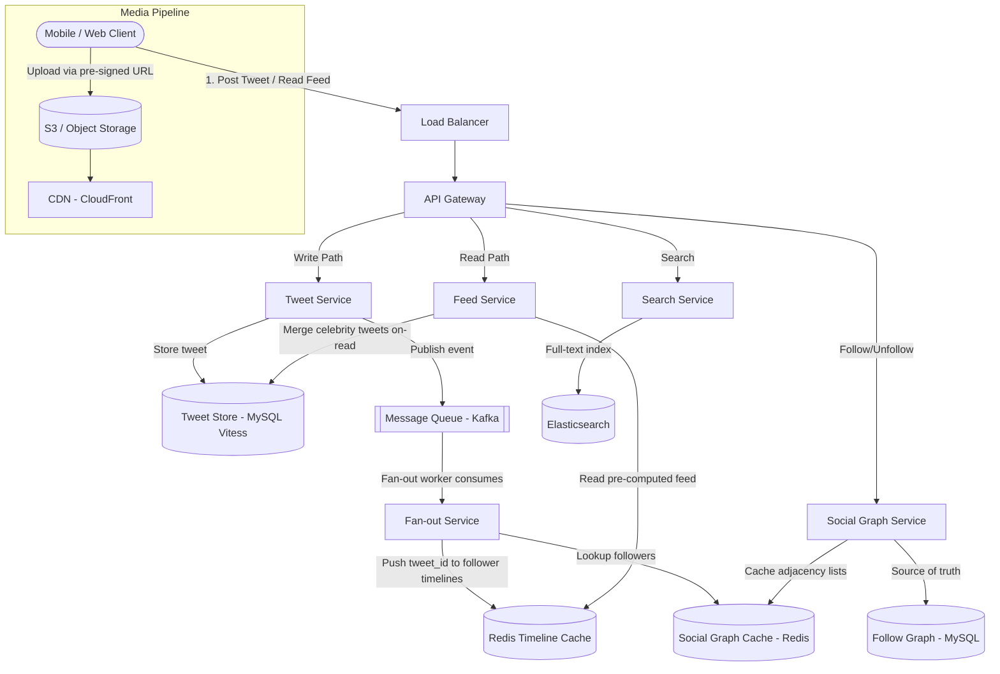
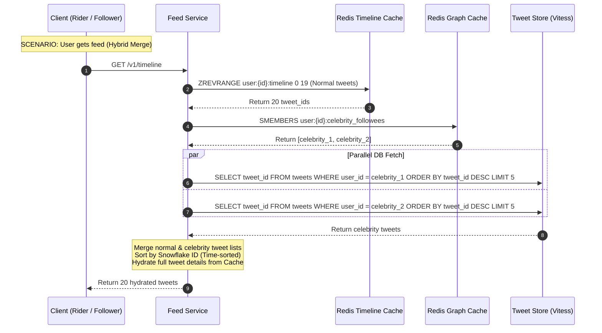
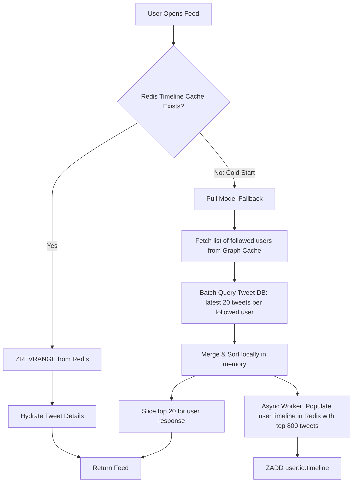

# Case Study: Twitter News Feed (System Design)

## Quick Summary (TL;DR)
- **Goal**: Design a social platform where users post short messages (tweets), follow other users, and consume a personalized timeline (news feed) of tweets from people they follow.
- **Scale**: 500M DAU, 600M tweets/day, 300B timeline reads/day. Timeline generation must be < 200ms.
- **Key Decisions**:
  - Use a **hybrid fan-out** strategy: fan-out-on-write (push model) for normal users (< 500K followers) pre-computed into Redis, and fan-out-on-read (pull model) for celebrities (>= 500K followers) to avoid massive write amplification storms.
  - Store pre-computed timelines in **Redis Sorted Sets** (`ZADD user:{id}:timeline timestamp tweet_id`) for $O(1)$ timeline reads.
  - Use **Snowflake IDs** for globally unique, time-sortable tweet identifiers that double as sort keys.
  - Implement **dual-table follow sharding** (`follows_outbound` and `follows_inbound`) to support fast $O(1)$ queries for both who a user follows and who follows a user.
  - Real-time trending hashtag counts computed via **Apache Flink sliding windows** using a **Count-Min Sketch** probabilistic estimator.

---

## 🤓 Noob Jargon Buster

* **Fan-out-on-write (Push Model)**: When a user tweets, the system immediately pushes that tweet ID into every follower's pre-computed timeline cache.
* **Fan-out-on-read (Pull Model)**: The timeline is not pre-computed. When a user opens their feed, the system fetches tweets from all followed users and merges them in real time.
* **Celebrity / Hot User Problem**: A user with millions of followers. Fanning out to 100M caches per tweet creates massive write amplification and crushes the cache cluster.
* **Snowflake ID**: A 64-bit globally unique, time-sortable ID format containing: 1-bit unused, 41-bit timestamp, 10-bit worker ID, and 12-bit sequence number.
* **Count-Min Sketch**: A space-efficient 2D array probabilistic data structure used to estimate frequency of events (e.g. hashtags) in a stream using multiple hash functions.
* **Dual-Table Sharding**: Replicating a relationship table across different shard keys (e.g., sharding one copy by source and another by target) to prevent cross-shard database scans.

---

## 1. Requirements & Scope

### Functional
1. **Post Tweet**: Users can publish a tweet (text up to 280 chars, optional images/video).
2. **News Feed / Timeline**: Users see a reverse-chronological feed of tweets from users they follow.
3. **Follow / Unfollow**: Users can follow or unfollow other users.
4. **Like & Retweet**: Users can like or retweet any tweet.
5. **Search**: Full-text search across all public tweets.

### Non-Functional
- **Ultra-low latency timeline reads**: Feed must render in `< 200ms`.
- **High Availability**: Feed generation must remain operational during partial failures (AP system).
- **Eventual Consistency**: It is acceptable for a tweet to appear in a follower's feed a few seconds late.
- **High Read-to-Write Ratio**: ~1000:1 (timeline reads vastly outnumber tweet writes).

---

## 2. Scale Estimation (The Math)

### Throughput (QPS)
- **Daily Active Users (DAU)**: 500 Million.
- **Tweets per day**: 600 Million.
  - Write QPS: $\frac{600,000,000}{86,400} \approx 7,000 \text{ tweets/sec}$ (Peak: $\approx 15,000 \text{ tweets/sec}$).
- **Timeline reads per day**: Each user refreshes their feed ~10 times/day = 5 Billion timeline reads/day.
  - Read QPS: $\frac{5,000,000,000}{86,400} \approx 58,000 \text{ reads/sec}$ (Peak: $\approx 120,000 \text{ reads/sec}$).

### Storage (5-Year Plan)
- **Tweet Record Size**: ~300 bytes average.
- **Total Tweets (5 years)**: $600\text{M/day} \times 365 \times 5 \approx 1.1\text{ Trillion tweets}$.
- **Storage Needed**: $1.1\text{T} \times 300 \text{ bytes} \approx 330 \text{ TB}$ (tweets only, excluding media).
- **Media Storage (5-year)**: Assuming 20% of tweets have a 200 KB image: $600\text{M} \times 0.2 \times 200\text{ KB} = 24\text{ TB/day}$.
  $$24\text{ TB/day} \times 365 \times 5 \approx 43.8\text{ PB}$$ (served from object storage + CDN).

### Memory (Caching - Timeline)
- Cache the most recent 800 tweet IDs per user's timeline (each tweet ID = 8 bytes).
- **Per-user cache**: $800 \times 8 \text{ bytes} = 6.4\text{ KB}$.
- **Total for 500M users**: $500\text{M} \times 6.4\text{ KB} = 3.2\text{ TB}$ of Redis memory (sharded across a cluster).

---

## 3. System API Design

### A. Post Tweet
- **Endpoint**: `POST /v1/tweets`
- **Request Payload**:
  ```json
  {
    "content": "Hello world! My first tweet.",
    "media_ids": ["media_001"]
  }
  ```
- **Response**: `201 Created`

### B. Get Home Timeline (News Feed)
- **Endpoint**: `GET /v1/timeline?page_size=20&cursor=1375092384710483967`
- **Response**: List of hydrated tweets.

---

## 4. High-Level Architecture



---

## 5. Deep Dives

### A. Hybrid Fan-out & Feed Aggregation Sequence
To resolve the **celebrity write amplification problem**, the system uses a hybrid model.



---

### B. Cold Start Timeline Hydration
If a user is inactive for $>30$ days, their pre-computed Redis timeline is evicted to save RAM. When they log back in, a cold-start hydration occurs:



---

### C. Social Graph Sharding: Dual-Table Indexing
The follow graph represents relationships: `(follower_id, followee_id)`.
- If sharded only by `follower_id`: Finding who a user follows is efficient (local partition scan), but finding who follows a user (e.g. to perform fan-out writes) requires scanning all partitions in the database, creating a distributed query bottleneck.
- **SDE-2 Solution: Dual-Table Partitioning**:
  1. `follows_outbound`: Column layout `(follower_id, followee_id)`. Sharded by `follower_id`. Used for rendering user timelines and followee lists.
  2. `follows_inbound`: Column layout `(followee_id, follower_id)`. Sharded by `followee_id`. Used by fan-out workers to locate follower groups.
  3. **Write Path Syncing**:
     When User A follows User B: write to `follows_outbound` in partition A, emit a `follow.created` event to Kafka, and an async consumer writes to `follows_inbound` in partition B. This ensures write scaling at the cost of slight eventual consistency.

---

### D. Trending Hashtags: Flink & Count-Min Sketch
At 15,000 tweets/sec, tracking unique hashtags in real-time using SQL database counters or raw in-memory maps leads to write exhaustion and OOM.

#### Count-Min Sketch Mathematical Estimator
A Count-Min Sketch is a 2D array of width $w$ and depth $d$, associated with $d$ independent pairwise hash functions: $h_1, h_2, \dots, h_d$.
1. **Dimensions Selection**:
   - To estimate frequencies within an error factor $\epsilon$ with a probability $1 - \delta$:
     $$w = \lceil \frac{e}{\epsilon} \rceil, \quad d = \lceil \ln(\frac{1}{\delta}) \rceil$$
     - *Example*: For $\epsilon = 0.001$ and $\delta = 0.01$, width $w = 2718$, depth $d = 5$. The total memory size is a tiny $2718 \times 5 \times 4 \text{ bytes (integer counters)} \approx 54\text{ KB}$ — scaling to handle millions of unique hashtags.
2. **Update Path**:
   When a hashtag $x$ is consumed from Kafka by Flink:
   - For each hash function $i \in [1, d]$:
     $$\text{Sketch}[i][h_i(x) \bmod w] \leftarrow \text{Sketch}[i][h_i(x) \bmod w] + 1$$
3. **Estimation Query**:
   To fetch the estimated frequency of hashtag $x$:
   $$\hat{f}_x = \min_{1 \le i \le d} \left( \text{Sketch}[i][h_i(x) \bmod w] \right)$$
   - *Why Min?* Since hash collisions can only overestimate count values, the minimum value across all hash fields yields the most accurate approximation.
4. **Top-K Tracking**:
   Flink maintains a **Min-Heap of size K** in memory. As hashtag estimates are updated, they are pushed to the min-heap. If a hashtag's estimate exceeds the heap minimum, the heap updates.

---

## 6. Database Design

### Primary Tweet Store (MySQL/Vitess)
```sql
CREATE TABLE tweets (
    tweet_id         BIGINT UNSIGNED PRIMARY KEY, -- Snowflake ID
    user_id          BIGINT UNSIGNED NOT NULL,
    content          VARCHAR(280) CHARACTER SET utf8mb4 NOT NULL,
    media_urls       JSON,                        -- CDN links
    reply_to_tweet   BIGINT UNSIGNED,             -- Thread reference
    like_count       INT UNSIGNED DEFAULT 0,
    retweet_count    INT UNSIGNED DEFAULT 0,
    created_at       TIMESTAMP NOT NULL,
    KEY idx_user_created (user_id, created_at DESC)
) ENGINE=InnoDB;
```
*Vitess shards the table horizontally using `user_id` hash partitions to ensure all tweets from a specific user reside on the same node.*

---

## 7. Scaling, Reliability, & Resiliency

### Feed Ranking Pipeline (Algorithmic Timelines)
Rather than raw chronological sort, modern feeds rank tweets based on relevancy:

$$\text{Relevance Score} = w_1 \cdot \text{Recency} + w_2 \cdot \text{Engagement} + w_3 \cdot \text{UserAffinity} - w_4 \cdot \text{Reports}$$

- **Offline Training**: Spark pipelines process historical logs (clicks, likes, comments) daily to train model weights (e.g. XGBoost/Neural Nets) and write user affinity vectors to Cassandra.
- **Online Inference**: When Feed Service aggregates the 800 pre-computed tweet IDs, it fetches the user affinity features from Cassandra, scores the tweets via a fast, containerized inference engine, sorts the top 20, and returns them to the client.

### Inactive User Eviction & Cache Warm-up
To protect Redis cluster RAM, we run an eviction cron:
- If a user has not logged in for 30 days, delete `user:{id}:timeline` from Redis.
- On user reconnect, the API Gateway intercepts the request, triggers the **Cold Start Hydration** worker, and populates the Redis Sorted Set before completing the request.
- Keep a hard limit on sorted sets via `ZREMRANGEBYRANK user:id:timeline 0 -801` to retain only the latest 800 tweet IDs.
