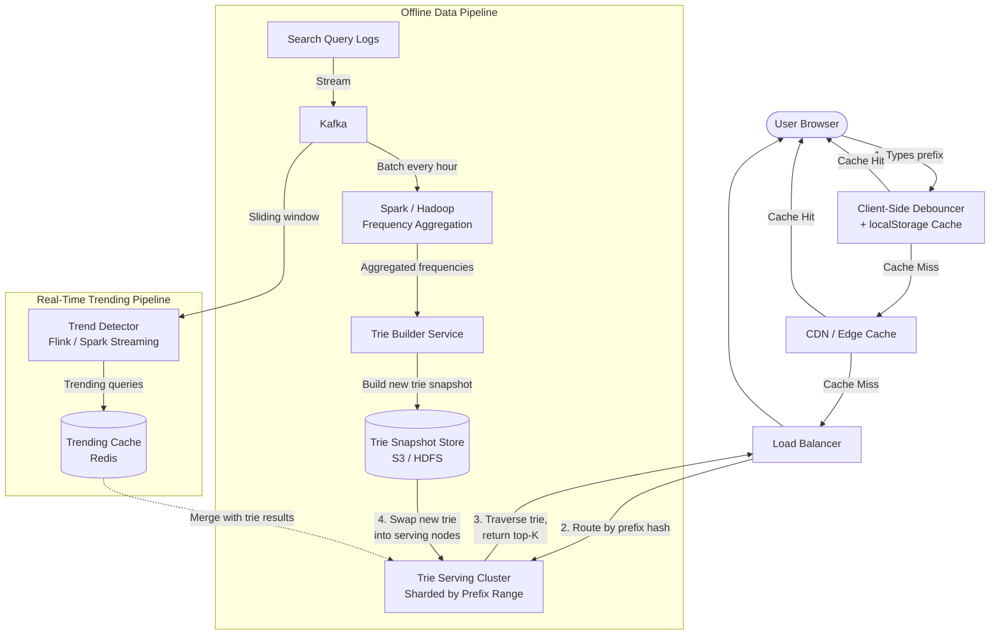
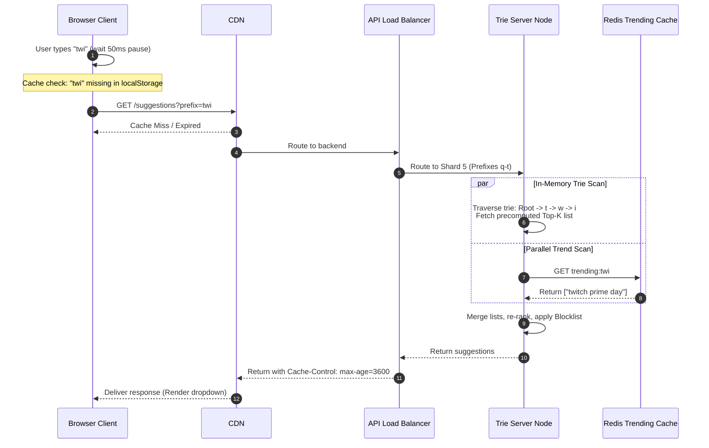
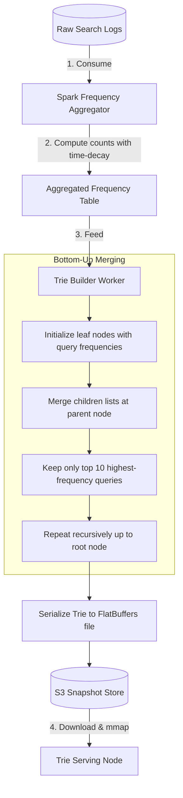

# Case Study: Typeahead / Search Autocomplete (System Design)

## Quick Summary (TL;DR)
- **Goal**: As a user types a query into a search bar, suggest the top-K most relevant completions in real time (< 100ms end-to-end).
- **Scale**: 5 Billion searches/day (Google-scale), ~60K QPS average. Every keystroke can trigger a suggestion request, but client-side debouncing + caching reduce server QPS to ~15K.
- **Key Decisions**:
  - Use a **Trie (Prefix Tree)** as the core data structure, storing precomputed top-K suggestions at each node to avoid subtree traversal at query time.
  - Build tries **offline** via a batch pipeline (Kafka $\rightarrow$ Spark $\rightarrow$ FlatBuffers Trie snapshot) and **swap into serving layer** using POSIX `mmap()` to avoid JVM GC pauses.
  - **Shard tries by prefix range** (e.g., a-f on shard 1, g-m on shard 2) and route requests via a ZooKeeper-managed routing table.
  - Aggressively use **browser-side caching** (localStorage) and **debouncing** (50-200ms) to reduce server load.

---

## 🤓 Noob Jargon Buster

* **Trie (Prefix Tree)**: A tree data structure where each node represents a character. Traversing a path spells out a query.
* **Top-K**: The K most popular suggestions for a given prefix.
* **Debouncing**: Client-side delay that waits for the user to pause typing before triggering a network request.
* **FlatBuffers**: An efficient serialization library that allows reading serialized binary data directly without a parsing/deserialization step.
* **Memory-Mapped File (mmap)**: A system call (`mmap`) mapping a file on disk directly into a process's virtual memory address space, letting the OS manage file paging.
* **Range Partitioning**: Distributing data based on sorting boundaries (e.g. prefixes starting with a-d map to Shard 1).

---

## 1. Requirements & Scope

### Functional
1. **Prefix Matching**: Given a partial query (prefix), return the top-K (e.g., 5) most popular completions.
2. **Low Latency**: Suggestions must appear as the user types (target < 100ms round-trip).
3. **Frequency-Based Ranking**: More frequently searched queries rank higher.
4. **Trending Queries**: Spiking news topics must surface within 5 minutes.

### Non-Functional
- **High Availability**: Autocomplete failure must not block the search page (Fail Open).
- **Scalability**: Handle 60K+ QPS with sub-100ms P99 latency.
- **Consistency**: Eventual consistency is acceptable (trending queries can take a few minutes to sync).

---

## 2. Scale Estimation (The Math)

### Throughput (QPS)
- **Total Searches/Day**: 5 Billion.
- **Average Query Length**: 6 characters typed.
- **Raw Keystroke Requests/Day**: $5\text{B} \times 6 = 30\text{ Billion keystrokes/day}$.
- **Raw QPS**: $\frac{30 \times 10^9}{86,400} \approx 347,000 \text{ req/sec}$.
- **After Debouncing (50ms)**: Reduces load by 60% $\rightarrow$ $\approx 139,000 \text{ req/sec}$.
- **After Browser Caching**: Session hit rate ~80% $\rightarrow$ $\approx 28,000 \text{ req/sec}$ hitting CDN.
- **After CDN Caching (Common prefixes)**: $\approx 15,000 \text{ req/sec}$ reaching the trie servers.

### Memory (Trie Size)
- **Unique Queries**: ~5 Million (after filtering spelling errors & low frequency).
- **Average Query Length**: 20 characters.
- **Total Trie Nodes**: ~100M nodes due to prefix sharing.
- **Node Size**: ~50 bytes base + ~200 bytes for precomputed top-10 suggestions.
- **Total Trie Size**: $100\text{M nodes} \times 250 \text{ bytes} \approx 25 \text{ GB}$ (fits comfortably in memory).

---

## 4. High-Level Architecture



---

## 5. Deep Dives

### A. End-to-End Query Sequence
How a suggestion request is resolved through client, network, and storage tiers:



---

### B. Offline Trie Construction Pipeline
Tries are built offline periodically (e.g. hourly) to filter noise, run aggregations, and compute nodes bottom-up.



---

### C. Trie Serialization & Swapping (FlatBuffers + mmap)
Rebuilding a 25GB trie and loading it on serving nodes can cause massive Java garbage collection (GC) pauses or start-up latencies if parsed naively.

- **FlatBuffers Serialization**: The Trie Builder serializes the node structures into a flat binary format on disk. FlatBuffers layout keeps pointers as byte offsets, meaning data elements can be read directly without parsing.
- **POSIX mmap System Call**: When loading a new trie, the Trie Server maps the snapshot file directly into virtual memory:
  ```java
  FileChannel channel = new RandomAccessFile("trie.bin", "r").getChannel();
  MappedByteBuffer buffer = channel.map(FileChannel.MapMode.READ_ONLY, 0, channel.size());
  ```
  - **Zero-Deserialization**: Zero objects are instantiated on startup. The server queries node coordinates directly from the mapped buffer, avoiding JVM heap GC overhead.
  - **OS-Level Paging**: The OS kernel automatically loads pages of the trie from disk into physical memory on demand (page fault resolution). Cold prefixes that are never queried are kept on disk, reducing actual RAM usage.
  - **Blue-Green Pointer Swaps**: Updates are instant. The node maps the new `trie_v2.bin` file, changes the active pointer, and unmaps `trie_v1.bin` in the background.

---

### D. Prefix-Range Sharding & Routing Coordination
To distribute the 25GB trie across multiple nodes:
1. **Coordination via ZooKeeper**: ZooKeeper stores the partition map mapping prefix ranges to Shards:
   ```
   [a - f] ──► Shard 1 (IP: 10.0.0.1, 10.0.0.2)
   [g - m] ──► Shard 2 (IP: 10.0.0.3)
   ```
2. **Dynamic Splitting**: If a prefix range (e.g. "s") receives high traffic, the Trie Builder splits the range (`[sa - sm]` and `[sn - sz]`), serializes them as distinct FlatBuffer snapshots, and updates ZooKeeper. The routing layer pulls the update and forwards requests accordingly.
