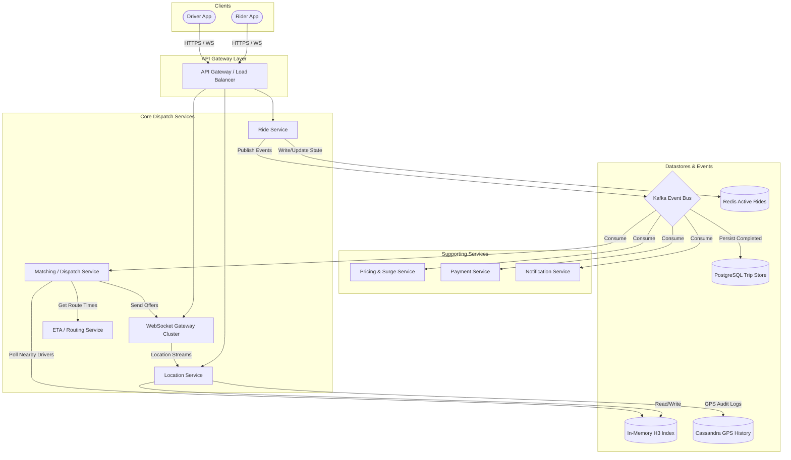
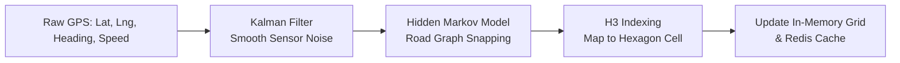
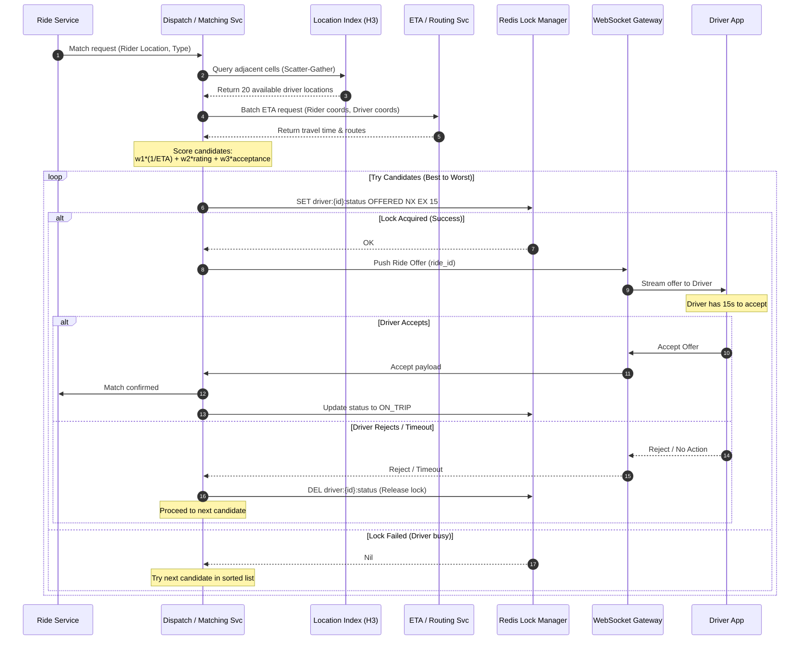
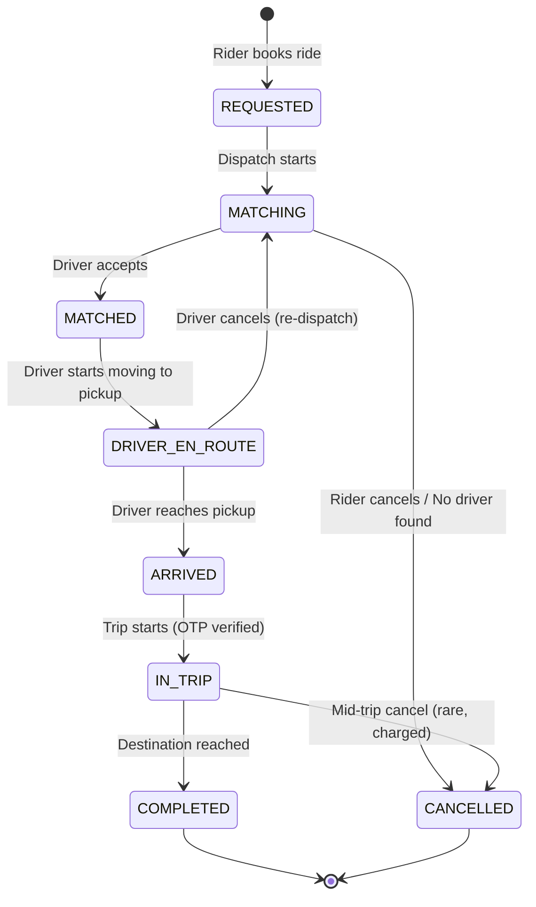
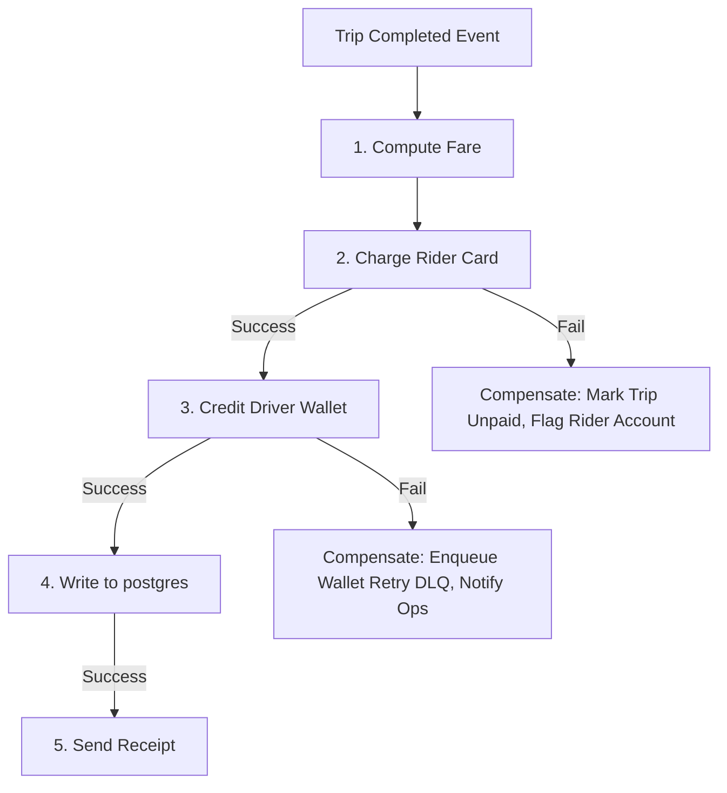

# Case Study: Uber / Ride-Hailing Platform (System Design)

## Quick Summary (TL;DR)
- **Goal**: Design a ride-hailing platform where riders request rides and nearby drivers are matched in real-time, with live tracking, ETA computation, fare calculation, and payments.
- **Scale**: 100M MAU, 20M rides/day, 1M concurrent active drivers broadcasting locations every 4 seconds — ~250K location updates/sec.
- **Key Decisions**:
  - Use a **geospatial index (H3 index + in-memory grid)** to find nearby drivers in $O(1)$ — querying a radius from millions of moving points is the core challenge.
  - Use **WebSockets** for real-time bidirectional communication (driver location push, ride status updates, live ETA).
  - Use **Kafka** as the backbone for ride events — decouples matching, pricing, payments, notifications, and analytics.
  - Use **CQRS** — write path (location ingestion, ride state machine) separated from read path (ETA queries, trip history, analytics).
  - Implement **Saga Pattern** for distributed transaction management across pricing, payments, and ride completion.

---

## 🤓 Noob Jargon Buster

* **Geohash**: A system that encodes latitude/longitude into a short alphanumeric string (e.g., `9q8yyk`). Points sharing a prefix are geographically close.
* **H3 Index**: Uber's open-source hexagonal hierarchical spatial index. Hexagons prevent the corner-distortion problems of square grids (every adjacent cell is exactly the same distance from the center).
* **Geospatial Index**: A data structure optimized for "find all points within X km of this location."
* **ETA (Estimated Time of Arrival)**: How long until the driver reaches the rider, computed using road network topology + traffic, not straight-line distance.
* **Dispatch / Matching**: The algorithm that pairs a ride request with the best available driver considering distance, ETA, rating, and acceptance probability.
* **Surge Pricing**: Dynamic pricing that increases fares when demand > supply in a region, incentivizing more drivers to come online.
* **Kalman Filtering**: A mathematical algorithm that smooths out random GPS sensor noise from mobile devices.
* **Hidden Markov Model (HMM)**: A statistical algorithm used to snap noisy GPS coordinates to actual roads on a map.

---

## 1. Requirements & Scope

### Functional
1. **Rider Requests Ride**: Rider enters pickup & dropoff. System shows ETA and estimated fare.
2. **Driver Matching**: System finds the best nearby driver and sends a ride offer. Driver accepts/rejects within 15 seconds.
3. **Real-Time Tracking**: Both rider and driver see each other's live location on a map.
4. **ETA Computation**: Accurate arrival and trip duration estimates using road network + traffic.
5. **Fare Calculation**: Based on distance, time, surge multiplier, and ride type (Pool, UberX, XL).
6. **Payments**: Charge rider, pay driver. Support cards, wallets, and cash.
7. **Trip History**: Riders and drivers can view past trips with routes, fares, and receipts.

### Non-Functional
- **Low Latency Matching**: Rider should see a matched driver within **5 seconds** of requesting.
- **Location Freshness**: Driver positions must be < **5 seconds stale** for accurate ETAs and map display.
- **High Availability**: The system must survive datacenter failures — a down ride platform means stranded passengers.
- **Consistency on Ride State**: A driver must never be double-dispatched to two rides simultaneously.
- **Handle Peak Load**: New Year's Eve, concert endings, rain — 5–10x traffic spikes.

---

## 2. Scale Estimation (The Math)

### Throughput (QPS)
- **Daily Rides**: 20M/day.
  - Average QPS: $\frac{20,000,000}{86,400} \approx 230 \text{ ride requests/sec}$.
  - Peak QPS: $\approx 2,000 \text{ ride requests/sec}$.
- **Driver Location Updates**: 1M concurrent drivers × 1 update/4 sec = **250,000 writes/sec**.
  - This is the hottest write path in the system.
- **ETA/Map Queries**: ~10x ride requests = $\approx 2,500 \text{ reads/sec}$ average, ~20,000/sec peak.

### Storage
- **Trip Record**: ~1 KB (trip_id, rider_id, driver_id, pickup/dropoff coords, route polyline, fare breakdown, timestamps, ratings).
- **Daily Storage**: $20\text{M} \times 1 \text{ KB} = 20 \text{ GB/day}$.
- **Yearly Storage**: $20 \text{ GB} \times 365 = 7.3 \text{ TB/year}$ (trip history).
- **Location Data**: Ephemeral. 1M drivers × 50 bytes (lat, lng, timestamp, driver_id, status) = **50 MB in-memory snapshot** — refreshed every 4 seconds.

### Memory
- **Driver Location Index (In-Memory)**: 50 MB for all active driver positions — easily fits in RAM.
- **Active Ride State (Redis)**: 500K concurrent rides × 500 bytes = **250 MB** — single Redis node handles this.
- **H3 Grid Cells**: ~1M cells covering operational cities × 8 bytes (pointer/count) = ~8 MB overhead.

---

## 3. System API Design

### A. Request Ride
- **Endpoint**: `POST /v1/rides`
- **Request**:
  ```json
  {
    "rider_id": "u_abc123",
    "pickup": { "lat": 12.9716, "lng": 77.5946 },
    "dropoff": { "lat": 12.9352, "lng": 77.6245 },
    "ride_type": "UBER_X"
  }
  ```
- **Response**:
  ```json
  {
    "ride_id": "ride_789",
    "status": "MATCHING",
    "estimated_fare": { "min": 150, "max": 180, "currency": "INR" },
    "surge_multiplier": 1.2,
    "estimated_pickup_eta_sec": 240
  }
  ```

### B. Driver Location Update (WebSocket / HTTP)
- **Endpoint**: `PUT /v1/drivers/{driver_id}/location`
- **Request**:
  ```json
  {
    "lat": 12.9720,
    "lng": 77.5950,
    "heading": 45,
    "speed_kmh": 30,
    "timestamp": 1756512000
  }
  ```
- **Response**: `204 No Content` (fire-and-forget via WebSocket preferred).

### C. Accept / Reject Ride Offer (Driver)
- **Endpoint**: `POST /v1/rides/{ride_id}/respond`
- **Request**:
  ```json
  {
    "driver_id": "d_xyz789",
    "action": "ACCEPT"
  }
  ```

---

## 4. High-Level Architecture



---

## 5. Deep Dive: Core Components

### 5.1 Location Ingestion & Map Matching
**Problem**: GPS signals are noisy (10–20m drift) and can snap to wrong parallel roads (urban canyons). Ingesting 250K points/sec requires efficient filtering and snapping.



1. **Kalman Filtering**: Computes joint probability distributions of location, velocity, and acceleration to smooth out sudden jumps.
2. **Hidden Markov Models (HMM)**: Analyzes the driver's trajectory over time. It models candidate snap points on nearby road segments as states, calculating transition probabilities (e.g., driving 100km/h on a highway cannot instantly jump to a parallel service road with no junction) to identify the correct road segment.
3. **H3 Cell Allocation**: Converts the snapped coordinate to an H3 Resolution 8 index (~0.7 $km^2$ area) and updates the in-memory grid.

---

### 5.2 Real-Time Dispatch / Matching Service



- **Lock Ordering Optimization**: Evaluating ETA and sorting occurs *before* acquiring the Redis lock. This prevents locking drivers too early (which blocks other dispatches) or wasting computing power querying ETAs for locked drivers.
- **Cross-Shard Border Queries**: Shards are divided based on H3 cell prefixes. If a rider stands on a shard border, the Dispatch service looks up neighboring cells using the consistent hash ring (Ringpop), sends parallel gRPC calls to the owning nodes, and merges the driver candidates.

---

### 5.3 Ride State Machine
Every ride transitions through a strict state machine. Each state transition emits an event to Kafka.



- **Active State (Redis)**: Stored in Redis for microsecond read access by the rider/driver apps during active trips.
- **Cold Storage (PostgreSQL)**: Written to PostgreSQL on completion for transactional records and receipts.

---

### 5.4 Pricing & Surge Calculation
Surge pricing balances supply and demand.
1. **Aggregations**: Flink/Spark streaming pipelines consume ride requests (demand) and driver location ticks (supply) from Kafka.
2. **Surge Multiplier Calculation**:
   $$\text{Ratio} = \frac{\text{Demand (Requests in cell, last 5 min)}}{\text{Supply (Available drivers in cell, now)}}$$
   - If Ratio > 1.5, increase multiplier (e.g., 1.2x, 1.5x), capped at 5.0x.
3. **Lock-In Guarantee**: Surge multipliers are cached per H3 cell. The fare estimated at request time is locked for 10 minutes to prevent checkout bait-and-switch.

---

## 6. Database Design

### A. PostgreSQL (Trip Store - ACID Compliance for Finance)
Stores completed trips. Partitions are split **monthly** on `created_at` to keep active table sizes small and optimize historical backups.

```sql
CREATE TABLE trips (
    trip_id         UUID PRIMARY KEY,
    rider_id        UUID NOT NULL,
    driver_id       UUID NOT NULL,
    status          VARCHAR(20) NOT NULL, -- COMPLETED, CANCELLED
    ride_type       VARCHAR(10) NOT NULL, -- UBER_X, POOL, XL
    pickup_lat      DECIMAL(9,6) NOT NULL,
    pickup_lng      DECIMAL(9,6) NOT NULL,
    dropoff_lat     DECIMAL(9,6) NOT NULL,
    dropoff_lng     DECIMAL(9,6) NOT NULL,
    route_polyline  TEXT,                 -- Encoded route coordinates
    distance_km     DECIMAL(6,2),
    duration_min    DECIMAL(6,2),
    fare_amount     DECIMAL(10,2),
    surge_multiplier DECIMAL(3,2),
    payment_status  VARCHAR(20),          -- CHARGED, FAILED
    requested_at    TIMESTAMP NOT NULL,
    completed_at    TIMESTAMP,
    created_at      TIMESTAMP DEFAULT NOW()
);

-- Indexing Strategy
CREATE INDEX idx_trips_rider ON trips (rider_id, created_at DESC);
CREATE INDEX idx_trips_driver ON trips (driver_id, created_at DESC);
```

### B. Cassandra (GPS Location History - Audit Logs)
Used for route replays, complaints, and trajectory analysis. Requires massive write throughput.

```sql
-- Track points grouped by trip (unbounded partition protection: average trip < 100K points)
CREATE TABLE trip_gps_points (
    trip_id uuid,
    timestamp timestamp,
    lat double,
    lng double,
    speed float,
    heading float,
    PRIMARY KEY (trip_id, timestamp)
) WITH CLUSTERING ORDER BY (timestamp ASC);
```

For long-term driver shifts:
```sql
-- Sharded by driver and daily buckets to avoid unbounded partitions
CREATE TABLE driver_trajectory (
    driver_id uuid,
    date text,           -- YYYY-MM-DD bucket
    timestamp timestamp,
    lat double,
    lng double,
    PRIMARY KEY ((driver_id, date), timestamp)
) WITH CLUSTERING ORDER BY (timestamp ASC);
```

### C. Redis Cache (Active States)
```
Key: driver:loc:{driver_id}
Type: Hash
Fields: { lat, lng, speed, heading, status (AVAILABLE/ON_TRIP/OFFLINE), last_ping }
TTL: 30 seconds
```

---

## 7. Why Choose This? (Defending Your Architecture)

### 🧭 Why choose H3/Geohash grid over database spatial extensions (PostGIS)?
> **Answer**: "Relational spatial indexes (R-Tree/PostGIS) require executing complex geometry queries on disk, which fails at 250,000 writes/sec. Updating static spatial coordinate boundaries in Postgres forces index rebalancing, creating severe lock contention. The H3 index is a stateless, pure mathematical library. Converting coordinates to an H3 cell ID happens entirely in application memory in under a microsecond. This transforms spatial lookup into a simple hash-map lookup, which scales horizontally."

### 🧭 Why choose Cassandra over PostgreSQL for location logs?
> **Answer**: "A 20-minute trip logs 300 coordinates. With 20M trips/day, that is 6 Billion rows of trajectory data daily. PostgreSQL's B-Tree indexing would suffer write exhaustion due to random page splits. Cassandra utilizes LSM-Trees, converting random memory writes into sequential append-only disk operations. Sharding by `trip_id` distributes the load uniformly across the cluster, ensuring O(1) writes and sequential disk-read caching for route replays."

### 🧭 Why choose WebSockets over Server-Sent Events (SSE)?
> **Answer**: "SSE is unidirectional (Server to Client). Since driver apps must stream GPS coordinates up to the server every 4 seconds, and the server must stream matching offers and customer details down, we need high-frequency, bidirectional, low-overhead communication. Opening HTTP POST connections every 4 seconds for driver updates adds massive headers and TCP handshake overhead. WebSockets establish a single persistent TCP tunnel, reducing framing overhead to 2-10 bytes per packet."

### 🧭 Why use Redis for the Active Ride State?
> **Answer**: "Active rides are highly transactional, fast-changing, and short-lived (~15-30 minutes). Reading active coordinates, ETA, and match states from PostgreSQL at peak QPS would saturate our database locks. Redis handles over 100K ops/sec in-memory with sub-millisecond latency. By writing to Redis during the ride and persisting to PostgreSQL only upon trip completion, we decouple the high-throughput operational state from long-term financial storage."

---

## 8. Scaling, Reliability, & Resiliency

### 8.1 Saga Pattern for Ride Completion & Payment Resiliency
When a trip completes, several databases and external systems must update: compute fare, charge card, credit driver wallet, write trip history, and send receipt.



- **Why not 2-Phase Commit (2PC)?**: 2PC is synchronous and locks databases, reducing availability (if the external Payment gateway is slow or down, the Trip DB is locked).
- **Saga Orchestrator**: Uses a state coordinator (via Kafka event-driven choreography). If payment succeeds but wallet credit fails, a compensation transaction is triggered (e.g., retrying via Dead Letter Queue or scheduling a manual audit reconciliation) while completing the ride lifecycle so the driver is freed up.

### 8.2 Ringpop (SWIM Gossip + Consistent Hashing)
- Used to scale the stateless Location Service gateways.
- Each node uses gossip protocols to detect cluster membership.
- Consistent hashing determines which node owns a given H3 cell.
- If a node crashes, Ringpop detects the failure via gossip within seconds, adjusts the ring, and re-routes the location updates to the new owner node.

---

## 9. End-to-End Ride Flow

```
Timeline:

0s   Rider opens app → App gets current GPS → Calls Location Svc via WS/HTTP for nearby drivers.
5s   Rider books → POST /v1/rides → Ride Service writes state to Redis (REQUESTED), emits Kafka 'ride.requested'.
6s   Dispatch Svc consumes event → Queries H3 grid for nearby available drivers → Queries ETA Svc → Scores candidates.
7s   Dispatch Svc tries to lock Best Candidate via Redis SET NX.
     - Succeeds: Pushes offer payload to Driver App via WebSocket.
15s  Driver accepts → POST /v1/rides/respond → Status changes to MATCHED, driver ON_TRIP. WebSocket notifies rider.
15s+ WS streams driver location every 2 sec. ETA Svc computes arrival times.
5m   Driver arrives at pickup → Status ARRIVED. Rider notified.
6m   Trip starts → Driver enters OTP → Status IN_TRIP. Cassandra starts logging trajectory.
20m  Destination reached → Driver ends trip → Status COMPLETED.
     - Saga Orchestrator triggers: Pricing Svc → Payment Svc (Charge) → Wallet Svc (Credit) → Persist to Postgres.
     - Active ride deleted from Redis.
```

---

## 10. Common Traps & Pitfalls

| Trap | Why it fails | Correct approach |
|------|---------------|-----------------|
| **Using PostGIS for live driver location queries** | Re-indexing moving points at 250K writes/sec crashes disk I/O | Keep coordinate mapping in-memory; use mathematical H3 grids |
| **Distributed Locks (e.g. ZooKeeper) for matching** | ZooKeeper consensus overhead (Paxos/Raft writes) is too slow | Redis `SET NX` with 15s TTL for lightweight, atomic lock acquisition |
| **Storing all trajectory points in Postgres** | Fast table growth (Billions/day) exhausts B-Tree indices | Use Cassandra/S3 and partition by `trip_id` |
| **Stale location displays on maps** | Heavy HTTP polling (500K QPS) chokes network cards | Push location updates downstream via WebSocket gateway only when changes exceed 3 meters |
| **Charging cards synchronously on ride completion** | Payment processors can take 5-10 seconds or crash, blocking driver release | Complete trip in state machine immediately; process payment async via Saga Orchestrator |

---

## 11. Bonus: Interview High-Value Extras

- **Map Matching Snapping Recovery**: If a driver has a GPS cold-start (e.g., exiting an underground parking garage), the HMM uses historical shift data to find the nearest likely exit ramp, preventing incorrect snapping to surrounding buildings.
- **Client-Side Dead Reckoning (Interpolation)**: To make the driver's car glide smoothly on the rider's map, the rider's app uses **dead reckoning** (interpolating positions between WebSocket location updates using driver speed and heading), reducing required update frequency and cellular bandwidth.
- **WebSocket Gateway Session Draining**: During deployments, servers are updated using **gradual connection draining** (slowly closing connections over 10 minutes and forcing clients to reconnect to newer nodes), avoiding connection storms.
