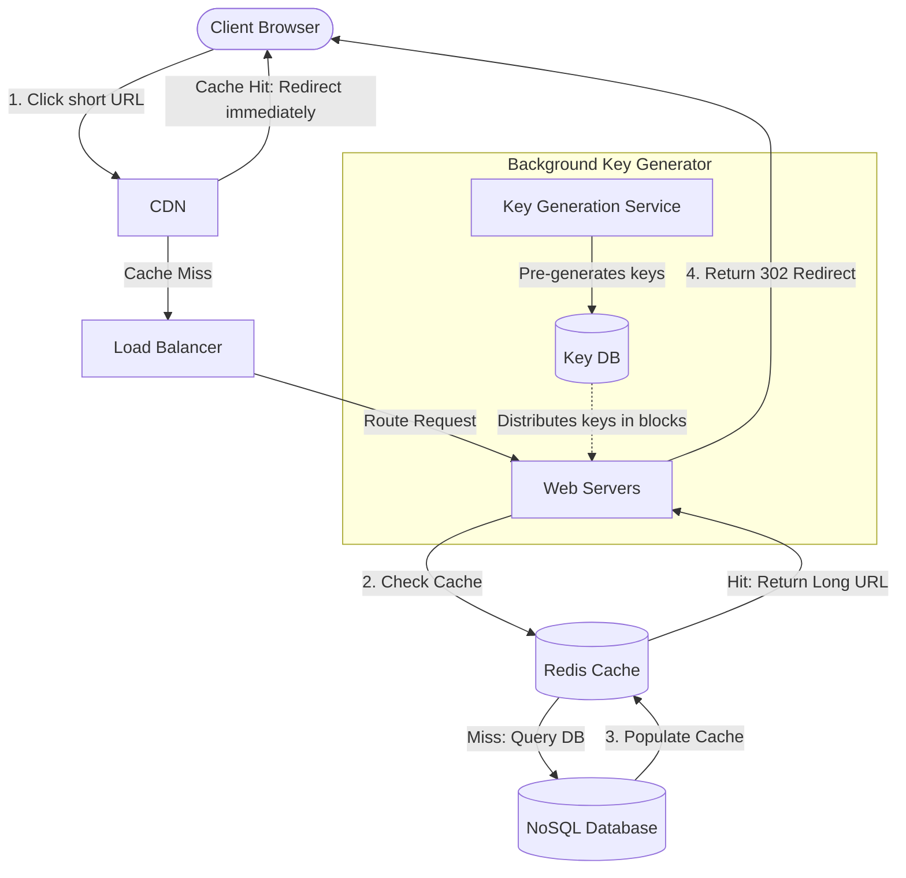

# Case Study: URL Shortener (System Design)

## Quick Summary (TL;DR)
- **Goal**: Convert long URLs (e.g., `https://example.com/very/long/path`) into short aliases (e.g., `https://bit.ly/AbCdEf`).
- **Scale**: 100M new URLs per month (40 writes/sec), 1B redirections per month (400 reads/sec). Storage over 5 years is 3 TB.
- **Key Decisions**:
  - Use **HTTP 302 (Temporary Redirect)** to track analytics (clicks, geolocation, browser types), despite higher server load than HTTP 301.
  - Use a **NoSQL Key-Value Store** (e.g., DynamoDB or Cassandra) because queries are simple key-value lookups (`short_key -> long_url`) with no joins, requiring horizontal scaling.
  - Use a **Key Generation Service (KGS)** to pre-generate unique Base62 short keys, avoiding hash collisions.

---

## 🤓 Noob Jargon Buster

* **HTTP 301 (Permanent Redirect)**: The browser caches the redirect. Next time a user visits the short link, the browser goes directly to the long link without hitting our server.
* **HTTP 302 (Temporary Redirect)**: The browser does *not* cache the redirect. Every click on the short link forces a call to our server first, allowing us to track analytics.
* **Base62 Encoding**: Converting a number into a string using 62 characters (`a-z`, `A-Z`, `0-9`). A 7-character Base62 string yields $62^7 \approx 3.5\text{ Trillion}$ unique combinations.
* **KGS (Key Generation Service)**: A dedicated microservice that pre-computes unique short keys (e.g., `aBcD123`) and saves them in a database to be distributed to web servers on demand.

---

## 1. Requirements & Scope

### Functional
1. **URL Shortening**: Given a long URL, return a unique short alias.
2. **Redirection**: Clicking the short link redirects the user to the original long URL.
3. **Custom Aliases** (Optional): Support custom short links (e.g., `bit.ly/my-promo`).
4. **Expiration**: Links expire after a default TTL (e.g., 2 years) to reclaim storage.

### Non-Functional
- **Ultra-low latency redirection**: Redirection must take `< 100ms`.
- **Highly Available**: If the system is down, all redirected traffic across the internet breaks.
- **High Read-to-Write Ratio**: ~10:1 read (redirection) to write (shortening) traffic.

---

## 2. Scale Estimation (The Math)

An SDE-2 must estimate resource requirements to size the infrastructure:

### Throughput (QPS)
- **New URL Creations**: 100 Million/month.
  - Write QPS: $\frac{100,000,000 \text{ URLs}}{30 \text{ days} \times 86,400 \text{ seconds}} \approx 38.5 \text{ writes/sec}$ (Peak: $\approx 80 \text{ writes/sec}$).
- **Redirection Traffic (Reads)**: 1 Billion/month (10:1 ratio).
  - Read QPS: $\frac{1,000,000,000 \text{ reads}}{30 \times 86,400} \approx 385 \text{ reads/sec}$ (Peak: $\approx 800 \text{ reads/sec}$).

### Storage (5-Year Plan)
- **Record Size**: 500 Bytes.
  - `short_key`: 7 bytes.
  - `long_url`: 450 bytes (average).
  - `created_at` & `expired_at`: 16 bytes.
  - `user_id`: 27 bytes.
- **Total Records (5 years)**: $100\text{M/month} \times 12\text{ months} \times 5\text{ years} = 6\text{ Billion records}$.
- **Storage Needed**: $6\text{ Billion} \times 500 \text{ bytes} \approx 3 \text{ Terabytes (TB)}$.

### Memory (Caching)
- We follow the **80/20 rule**: Cache the top 20% of daily redirect traffic.
- **Daily Reads**: $\approx 33.3\text{M reads/day}$.
- **RAM Needed**: $20\% \times 33.3\text{M reads} \times 500 \text{ bytes} \approx 3.3 \text{ GB}$ of Redis memory.

---

## 3. System API Design

### A. Create Short URL
- **Endpoint**: `POST /v1/urls`
- **Request Payload**:
  ```json
  {
    "long_url": "https://example.com/very/long/path",
    "custom_alias": "my-promo",
    "expire_at": 1819584000
  }
  ```
- **Response Payload**:
  ```json
  {
    "short_url": "https://bit.ly/my-promo",
    "created_at": 1756512000,
    "expire_at": 1819584000
  }
  ```

### B. Redirect Link
- **Endpoint**: `GET /{short_key}`
- **Response Headers**:
  - Status: `302 Found`
  - Location: `https://example.com/very/long/path`

---

## 4. Database Schema Design

Since there are no relationships/joins, and reads are simple key-value queries, a **NoSQL Document/Key-Value Store** (like DynamoDB or MongoDB) is highly performant and easily sharded.

### NoSQL Table: `urls`
- **Hash/Partition Key**: `short_key` (String)
- **Attributes**:
  - `long_url`: String
  - `user_id`: String (Indexed for user history queries)
  - `created_at`: Timestamp
  - `expire_at`: Timestamp (DynamoDB TTL attribute)

---

## 5. High-Level Architecture



---

## 6. Why Choose This? (Defending Your Architecture)

If an interviewer asks "Why did you choose this component or design?", here are your SDE-2 responses:

### 🧭 Why choose NoSQL (DynamoDB/Cassandra) over Relational (PostgreSQL)?
* **Answer**: "The core query pattern for a URL shortener is a simple key-value lookup (`short_key -> long_url`). We do not need multi-table joins, complex search queries, or ACID transactions across multiple records. Relational databases scale vertically, which is expensive, while a NoSQL Key-Value store easily scales horizontally by partitioning data based on the `short_key`. This guarantees consistent sub-millisecond lookups and higher throughput at a fraction of the cost."

### 🧭 Why choose KGS (Key Generation Service) over on-the-fly Hashing (MD5/SHA)?
* **Answer**: "If we hash the long URL on-the-fly (e.g., using MD5 and taking the first 7 characters), we will inevitably run into hash collisions as the database grows to billions of keys. Dealing with collisions at write-time requires querying the database first (read-before-write) or catching duplicate key errors and re-hashing with a salt, adding latency to the write path. Pre-generating keys via KGS eliminates collisions entirely and keeps link generation a fast $O(1)$ in-memory operation on the web server."

### 🧭 Why choose HTTP 302 over HTTP 301 Redirection?
* **Answer**: "HTTP 301 (Permanent Redirect) is cached by the client's browser. While this saves server bandwidth, it prevents us from tracking link clicks after the first redirect. Click analytics (traffic source, location, timestamps) are the primary source of revenue and business value for link shorteners. Using HTTP 302 (Temporary Redirect) ensures every click hits our gateway (or CDN edge), allowing us to capture full telemetry."

---

## 7. SDE-2 Deep Dives & Trade-offs

### A. HTTP 301 vs. HTTP 302 Redirection
- **301 (Permanent)**: 
  - *Pros*: Reduces server load; subsequent clicks are handled locally by the browser cache.
  - *Cons*: We lose all click tracking, analytics, and telemetry (major monetization factor for URL shorteners). Once cached, we cannot change the destination URL.
- **302 (Temporary)**:
  - *Pros*: Every click hits our servers/CDN, giving us 100% accurate metrics (location, time, click counts).
  - *Cons*: Higher traffic on our servers. (Mitigated by putting a CDN or Redis cache in front).
- **Decision**: Choose **HTTP 302** because analytics is a core business requirement.

### B. Key Generation Algorithms
How do we generate the 7-character string (e.g., `AbCdEf`)?

#### Option 1: MD5 Hash of Long URL + Base62
- Hash the long URL to get a 128-bit MD5 string.
- Encode the first 43 bits in Base62 to get a 7-character string.
- *Problem*: **Hash Collisions** can occur (two different long URLs yielding the same 7-character key). If a collision happens, we have to append a salt and re-hash, which adds database overhead.

#### Option 2: Pre-generated Keys via Key Generation Service (KGS)
- A separate service pre-generates unique 7-character keys and saves them in a `key_store` database (e.g., pre-populates 3.5 billion keys).
- When a web server needs to shorten a URL, it grabs a block of keys (e.g., 1,000 keys) from the KGS into local memory.
- *Pros*: **No collisions**, lightning-fast allocation (O(1) local memory lookup).
- *Cons*: KGS is a new service to maintain; requires locking mechanisms so two web servers don't hand out the same key.

---

## 7. Common Traps & Mitigations

1. **Hotspot Redirections**: A viral tweet links to a short URL, causing 10,000 QPS to hit a single DB record.
   - *Mitigation*: The CDN (Cloudflare/CloudFront) caches the redirect route. If the CDN misses, Redis cache holds the record, shielding the database entirely.
2. **KGS Key Duplication**: Two web servers read the same key block from KGS due to network lag.
   - *Mitigation*: Store the keys in Redis or ZooKeeper and use atomic operations (`GET` and `DECR` or distributed locks) to distribute key ranges to servers safely.
3. **Database Growth**: Accumulating billions of dead links.
   - *Mitigation*: Enable DynamoDB TTL. The database will automatically scan and delete expired rows in the background without consuming read capacity.
