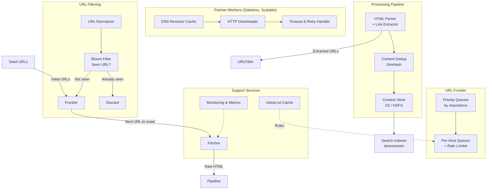

# Case Study: Web Crawler (System Design)

## Quick Summary (TL;DR)
- **Goal**: Design a distributed web crawler that systematically downloads and indexes billions of web pages across the internet (like Googlebot).
- **Scale**: Crawl 1 Billion pages/month, ~400 pages/sec average, ~15 PB of raw HTML/year.
- **Key Decisions**:
  - Use a **distributed URL frontier** with per-host FIFO queues to enforce politeness (don't DDoS any single website).
  - Use **Bloom Filters** for URL deduplication — constant-memory check of "have we seen this URL before?" across billions of URLs.
  - Use **content fingerprinting** (SimHash) to detect near-duplicate pages and avoid wasting storage on mirror sites.
  - Use a **multi-worker architecture** with a central coordination layer (URL frontier) and stateless, horizontally scalable fetcher nodes.

---

## Noob Jargon Buster

* **URL Frontier**: A prioritized, politeness-aware queue system that decides which URLs to crawl next. It's the "brain" of the crawler.
* **Politeness Policy**: A rule that prevents the crawler from sending too many requests to the same host. Typically: at most 1 request per second per domain, and always obey `robots.txt`.
* **robots.txt**: A file at the root of every website (e.g., `example.com/robots.txt`) that tells crawlers which paths they're allowed or forbidden to crawl, and how fast they can crawl.
* **Bloom Filter**: A space-efficient probabilistic data structure that answers "is this element in the set?" with no false negatives (never misses a seen URL) but a small false positive rate (~1%). Uses ~10 bits per element — for 10 billion URLs, that's only ~12 GB of RAM.
* **SimHash**: A fingerprinting algorithm that produces similar hashes for similar documents. Two pages with 90% identical content will have SimHash values that differ by only a few bits, enabling near-duplicate detection.
* **DNS Resolver Cache**: A local cache of domain-name-to-IP mappings. Without it, every URL fetch requires a DNS lookup (50-200ms), which becomes a bottleneck at scale.
* **URL Normalization**: Converting different URL representations to a canonical form (e.g., `HTTP://Example.COM/path/../page` → `http://example.com/page`) to avoid crawling the same page twice.

---

## 1. Requirements & Scope

### Functional
1. **Seed URLs**: Start from a set of seed URLs (e.g., top 10,000 websites) and discover new pages by extracting hyperlinks.
2. **Download & Store**: Fetch HTML content and store it for indexing/processing.
3. **Link Extraction**: Parse downloaded pages to discover new URLs and add them to the crawl queue.
4. **Politeness**: Respect `robots.txt` rules and rate-limit requests per domain.
5. **Recrawl**: Periodically revisit pages to detect content changes (freshness).

### Non-Functional
- **Scalability**: Must handle billions of URLs. Easy to add more crawler nodes.
- **Robustness**: Handle spider traps (infinite loops), malformed HTML, server errors, and timeouts gracefully.
- **Extensibility**: Pluggable modules for link extraction, content processing, deduplication, etc.
- **Politeness**: Never overload any single web server — this is both ethical and practical (avoid getting IP-banned).

---

## 2. Scale Estimation (The Math)

### Throughput
- **Target**: 1 Billion pages/month.
- **Average QPS**: $\frac{1,000,000,000}{30 \times 86,400} \approx 385 \text{ pages/sec}$.
- **Peak QPS**: $\approx 1,000 \text{ pages/sec}$.

### Storage
- **Average Page Size**: 500 KB (HTML + metadata).
- **Monthly Raw Storage**: $1\text{B pages} \times 500\text{ KB} = 500\text{ TB/month}$.
- **With compression** (gzip ~5:1): $\approx 100\text{ TB/month}$.
- **Yearly**: $\approx 1.2\text{ PB/year}$ compressed.

### Bandwidth
- **Outbound**: Minimal (HTTP GET requests).
- **Inbound**: $385 \text{ pages/sec} \times 500\text{ KB} \approx 190\text{ MB/sec} \approx 1.5\text{ Gbps}$.

### URL Set Size
- **Unique URLs discovered**: ~10 Billion over a full crawl cycle.
- **Bloom Filter memory**: 10B URLs × 10 bits/URL = **~12 GB RAM** (at 1% false positive rate).

### Crawler Nodes
- Each node fetches ~10 pages/sec (limited by network RTT, DNS, politeness waits).
- For 400 pages/sec: $\approx 40 \text{ crawler nodes}$.
- For peak 1,000 pages/sec: $\approx 100 \text{ crawler nodes}$.

---

## 3. High-Level Architecture



---

## 4. Core Design Components

### A. URL Frontier — The Crawler's Brain

The URL frontier is the most critical component. It manages two concerns simultaneously: **priority** (what to crawl first) and **politeness** (don't hammer any single host).

```
                    ┌──────────────────────────┐
  Incoming URLs ──► │   Priority Classifier     │
                    │  (PageRank, freshness,     │
                    │   domain authority)        │
                    └──────┬───────────────────┘
                           │
              ┌────────────┼────────────────┐
              ▼            ▼                ▼
        ┌─────────┐  ┌─────────┐     ┌─────────┐
        │ High-P  │  │ Medium  │     │ Low-P   │
        │ Queue   │  │ Queue   │     │ Queue   │
        └────┬────┘  └────┬────┘     └────┬────┘
             │            │               │
             └────────────┼───────────────┘
                          ▼
                ┌──────────────────┐
                │ Host Router      │
                │ (hash URL host   │
                │  → per-host      │
                │    FIFO queue)   │
                └──────┬───────────┘
                       │
         ┌─────────────┼──────────────┐
         ▼             ▼              ▼
   ┌──────────┐  ┌──────────┐  ┌──────────┐
   │ host-A   │  │ host-B   │  │ host-C   │
   │ Queue    │  │ Queue    │  │ Queue    │
   │ (FIFO)   │  │ (FIFO)   │  │ (FIFO)   │
   └──────────┘  └──────────┘  └──────────┘
        │              │              │
        ▼              ▼              ▼
   Rate Limiter:  Rate Limiter:  Rate Limiter:
   1 req/sec      1 req/sec      1 req/sec
```

**Two-stage design**:
1. **Front queues (Priority)**: Incoming URLs are classified by importance (PageRank, freshness score, domain authority) and placed into priority-level queues. The front selects which priority level to pull from next.
2. **Back queues (Politeness)**: URLs are routed by hostname into per-host FIFO queues. Each host queue has a rate limiter (e.g., 1 request/sec). A worker thread is assigned to a host queue, drains a URL, fetches it, then waits before pulling the next URL from the same host.

**Why this matters**: Without per-host queues, a popular domain like `wikipedia.org` (millions of pages) would dominate the crawl, overwhelming Wikipedia's servers while starving other domains.

### B. URL Deduplication — Bloom Filter

Before adding a discovered URL to the frontier, we check: "Have we already crawled or enqueued this URL?"

```
URL → hash_1(URL), hash_2(URL), ..., hash_k(URL)
       │              │                    │
       ▼              ▼                    ▼
  Bit Array:  [0 1 1 0 1 0 0 1 1 0 1 0 0 0 1 ...]
                 ↑           ↑                ↑
              If ALL bits are 1 → "probably seen" (small false positive risk)
              If ANY bit is 0  → "definitely NOT seen"
```

- **10 Billion URLs**, 10 bits/element, 7 hash functions → **~12 GB RAM**, 0.82% false positive rate.
- A false positive means we skip a URL we haven't actually seen — acceptable. A few missed pages won't affect crawl quality.
- **Cannot remove elements** from a standard Bloom Filter. If you need deletion (e.g., to re-crawl expired URLs), use a **Counting Bloom Filter** (4 bits per bucket instead of 1).

**Alternative — Redis Set or RocksDB**:
- For smaller crawls (<100M URLs), a Redis `SADD`/`SISMEMBER` set is simpler.
- For persistence across restarts, use RocksDB (embedded key-value store) with URL hash as key.

### C. Content Deduplication — SimHash

The web is full of near-duplicate pages (mirror sites, printer-friendly versions, URL parameters that don't change content). Storing them wastes space and pollutes search results.

```
Document → Extract features (word shingles)
         → Hash each shingle to a 64-bit value
         → Weight and combine into a single 64-bit SimHash fingerprint

Comparison:
  SimHash("Page A") = 1001101011010110...
  SimHash("Page B") = 1001101011010010...
                                    ^^
  Hamming distance = 2 bits → pages are near-duplicates (threshold: ≤ 3 bits)
```

- **Exact duplicate**: `MD5(content_A) == MD5(content_B)` — trivial.
- **Near-duplicate**: SimHash with Hamming distance ≤ 3 (out of 64 bits) — catches 90%+ similar pages.
- Store fingerprints in a lookup table. On each new page, compute SimHash and compare against existing fingerprints.

### D. HTML Parsing & Link Extraction

After downloading a page, extract:
1. **Hyperlinks** (`<a href="...">`): Candidate URLs for the frontier.
2. **Metadata**: Title, description, canonical URL, language, `rel="nofollow"` tags.
3. **Content**: Stripped text for the search indexer downstream.

**URL Normalization** before adding to frontier:
- Lowercase the scheme and host: `HTTP://Example.COM` → `http://example.com`
- Remove default ports: `:80` for HTTP, `:443` for HTTPS
- Resolve relative paths: `/a/b/../c` → `/a/c`
- Remove fragment identifiers: `#section` (fragments are client-side only)
- Sort query parameters: `?b=2&a=1` → `?a=1&b=2`
- Remove tracking parameters: `utm_source`, `utm_medium`, etc.

### E. robots.txt Handling

Before crawling any page on a domain, fetch and cache `robots.txt`:

```
# Example robots.txt for example.com
User-agent: *
Disallow: /admin/
Disallow: /private/
Crawl-delay: 2          # Wait 2 seconds between requests

User-agent: Googlebot
Allow: /admin/reports/   # Exception for Googlebot
```

- **Cache robots.txt** per domain with a TTL (e.g., 24 hours). Don't re-fetch it before every page.
- Store in a **Redis hash**: `robots:example.com → {rules, crawl_delay, fetched_at}`.
- If a domain has no `robots.txt` (404), assume everything is allowed.
- Always respect `Crawl-delay` — it overrides your default rate limit for that host.

### F. DNS Resolver Cache

DNS lookups are 50-200ms each. At 400 pages/sec, that's a massive bottleneck if every fetch triggers a DNS query.

- Run a **local DNS cache** (e.g., `dnsmasq` or in-process cache) on each crawler node.
- **Cache TTL**: Respect DNS TTL, but set a minimum of 5 minutes to avoid redundant lookups.
- **Pre-resolve**: When a batch of URLs for the same host enters the fetcher, resolve DNS once and reuse for all.
- At 10 billion unique URLs with ~5 million unique domains, the DNS cache is small (~500 MB).

### G. Content Storage

```
Raw HTML  ──►  gzip compress (5:1)  ──►  S3 / HDFS
                                          │
                                     Object key: hash(URL)
                                     Metadata: URL, timestamp,
                                               HTTP status, headers,
                                               SimHash fingerprint
```

- **S3/HDFS** for bulk storage. Object key is `SHA-256(canonical_URL)`.
- **Metadata DB** (PostgreSQL or Cassandra): Maps URL → storage location, crawl timestamp, HTTP status, content hash. Used for recrawl scheduling.
- **Why not store HTML in the database?** HTML is large (500 KB avg) and write-once-read-rarely. Blob storage is 10x cheaper than database storage and optimized for this access pattern.

---

## 5. Handling Tricky Problems

### A. Spider Traps

A spider trap is a website that generates infinite URLs to waste crawler resources:
- **Calendar trap**: `/calendar?date=2025-01-01`, `/calendar?date=2025-01-02`, ... forever.
- **Session ID trap**: Every page appends a unique session ID as a query parameter, making every URL look "new".
- **Infinite depth**: `/a/b/c/d/e/f/g/...` auto-generated nested paths.

**Mitigations**:
1. **Max URL depth**: Limit crawl to 15 levels of path depth per domain.
2. **Max pages per domain**: Cap at 500,000 pages per domain per crawl cycle.
3. **URL pattern detection**: If the frontier detects 1,000+ URLs matching the same path pattern with only a query parameter changing, flag and throttle.
4. **Blacklist**: Maintain a manual blacklist of known trap domains.

### B. Recrawl / Freshness Strategy

Not all pages change at the same rate. A news homepage changes every minute; a university course page might not change for years.

**Adaptive recrawl frequency**:
```
For each URL, track:
  - last_crawl_time
  - content_changed (boolean from last crawl)
  - change_rate (exponential moving average)

Recrawl interval = base_interval / change_rate

  High change rate (news sites):     recrawl every 1 hour
  Medium change rate (blogs):         recrawl every 1 week
  Low change rate (static docs):      recrawl every 1 month
```

- **Priority boost for important pages**: Pages with high PageRank or heavy inbound link counts get recrawled more frequently regardless of change rate.
- **HTTP conditional requests**: Use `If-Modified-Since` or `If-None-Match` (ETag) headers. If the server returns `304 Not Modified`, skip re-downloading — saves bandwidth.

### C. Handling Failures & Retries

```
HTTP Response:
  200 OK             → Process normally
  301/302 Redirect   → Follow redirect (max 5 hops), add final URL to frontier
  404 Not Found      → Mark URL as dead, don't recrawl
  429 Too Many Req   → Back off exponentially for this host
  500 Server Error   → Retry with exponential backoff (max 3 retries)
  Timeout (30s)      → Retry once, then mark as failed

Retry policy:
  - Max 3 retries per URL with exponential backoff (1s, 4s, 16s)
  - After 3 failures, push to dead-letter queue for manual review
  - Never retry 4xx errors (client errors) except 429
```

---

## 6. Why Choose This? (Defending Your Architecture)

### Why use a Bloom Filter over a HashSet for URL dedup?
* **Answer**: "A HashSet of 10 billion URLs would require ~500 GB of RAM (50 bytes/URL for the hash + object overhead). A Bloom Filter achieves the same lookup with ~12 GB at a 1% false positive rate. The trade-off is a small chance of skipping an unseen URL — acceptable because missing 1% of pages doesn't meaningfully impact crawl coverage, and the 40x memory savings means we can run dedup on a single machine instead of a distributed cluster."

### Why use per-host queues instead of a single global queue?
* **Answer**: "A single global queue with multiple workers will inevitably send bursts of requests to popular domains. If 50 workers simultaneously pull wikipedia.org URLs, we'd send 50 concurrent requests to Wikipedia — violating politeness and likely getting our IP banned. Per-host FIFO queues with rate limiters guarantee at most 1 request/second to any domain. The host queue also naturally batches DNS lookups and TCP connection reuse for the same domain."

### Why use SimHash over exact hashing (MD5) for content dedup?
* **Answer**: "MD5 only catches exact byte-for-byte duplicates. But the web is full of near-duplicates — the same article on 10 mirror sites with different headers, footers, or ads. SimHash produces a fingerprint where similar documents hash to similar values. By comparing Hamming distances (threshold ≤ 3 bits out of 64), we catch 90%+ of near-duplicate content that MD5 would miss completely. This saves petabytes of storage and prevents duplicate results in the search index."

### Why separate priority (front) queues from politeness (back) queues?
* **Answer**: "These are orthogonal concerns. Priority decides *what* to crawl next (high-value pages first). Politeness decides *when* to crawl it (rate-limited per host). Merging them into a single queue forces a trade-off: either you respect priority but violate politeness, or you respect politeness but lose priority ordering. The two-stage frontier cleanly separates these concerns — front queues rank by importance, back queues enforce rate limits."

---

## 7. SDE-2 Deep Dives & Trade-offs

### A. BFS vs. DFS Crawl Strategy

| Strategy | Behavior | Pros | Cons |
|----------|----------|------|------|
| **BFS** | Crawl all links at depth 1, then depth 2, etc. | Discovers high-quality pages first (homepages before deep pages) | Large frontier memory; slow to reach deep content |
| **DFS** | Follow one link chain deep before backtracking | Small memory footprint | Gets stuck in spider traps; misses breadth |
| **Priority BFS** (recommended) | BFS but ordered by PageRank/importance | Best pages first; naturally avoids traps | Requires priority scoring infrastructure |

**Decision**: Use **Priority BFS**. Seed URLs (high authority sites) expand breadth-first, but within the frontier, higher-priority URLs are dequeued first.

### B. Single-Machine vs. Distributed Crawler

| Aspect | Single Machine | Distributed |
|--------|---------------|-------------|
| Throughput | ~50-100 pages/sec | 1,000+ pages/sec |
| URL frontier | In-memory priority queue | Distributed queue (Kafka / Redis) |
| URL dedup | Single Bloom Filter in RAM | Partitioned Bloom Filters or Redis |
| Bottleneck | Network bandwidth, CPU for parsing | Coordination overhead |
| Use case | Small site-specific crawls | Web-scale crawling |

**Scaling the frontier**:
- Partition the URL frontier by **domain hash**. All URLs for `*.wikipedia.org` go to the same frontier partition → that partition owns the host queue and rate limiter for Wikipedia.
- Each crawler worker is assigned to one or more frontier partitions. This eliminates coordination: no two workers ever crawl the same domain simultaneously.

### C. Politeness — Crawl Rate Calculation

```
For each domain:
  1. Check robots.txt Crawl-delay → use if specified
  2. Otherwise, estimate from server response time:
     - If avg response time < 100ms  → crawl at 2 req/sec (fast server)
     - If avg response time 100-500ms → crawl at 1 req/sec
     - If avg response time > 500ms   → crawl at 0.5 req/sec (slow server)
  3. Global cap: never exceed 5 req/sec to any single domain
  4. If you receive HTTP 429 or 503 → exponential backoff (double the delay)
```

### D. Checkpointing & Crash Recovery

If a crawler node crashes, you don't want to lose the state of the frontier or re-crawl millions of URLs.

1. **Frontier persistence**: Periodically snapshot the URL frontier to disk (every 5 minutes). On restart, reload from the last snapshot.
2. **Crawl progress log**: Append each successfully crawled URL to a write-ahead log. On recovery, replay the log to reconstruct the Bloom Filter state.
3. **Idempotent fetching**: Even if we accidentally re-fetch a URL after a crash, the content store uses `SHA-256(URL)` as the key — the second write is a no-op overwrite.

### E. DNS Bottleneck Deep Dive

Standard library DNS resolution is typically **synchronous and single-threaded** — a hidden bottleneck:

- Java's `InetAddress.getByName()` blocks the calling thread for 50-200ms.
- With 100 threads, each blocked on DNS for 100ms, throughput caps at 1,000 DNS lookups/sec.
- **Solution**: Use an **async DNS client** (e.g., Netty's `DnsNameResolver` or `c-ares`) that can issue thousands of DNS queries concurrently over UDP without blocking threads.
- Combined with the local DNS cache, DNS becomes negligible in the request path.

---

## 8. Summary: Component Decision Table

| Component | Choice | Rationale |
|-----------|--------|-----------|
| URL Frontier | Two-stage (priority + politeness) | Separates what-to-crawl from when-to-crawl |
| URL Dedup | Bloom Filter (~12 GB for 10B URLs) | 40x cheaper than HashSet; 1% FP is acceptable |
| Content Dedup | SimHash (Hamming distance ≤ 3) | Catches near-duplicates that MD5 misses |
| Politeness | Per-host FIFO queue + rate limiter | Prevents IP bans; respects robots.txt |
| Storage | S3/HDFS (compressed HTML) + metadata DB | Cheap blob storage; metadata for recrawl scheduling |
| DNS | Local async cache (dnsmasq + Netty) | Eliminates 50-200ms DNS lookup per fetch |
| Crawl Strategy | Priority BFS | High-value pages first; avoids spider traps |
| Failure Handling | Exponential backoff + dead-letter queue | Graceful degradation without data loss |

---

## 9. Common Traps & Mitigations

1. **Spider Trap — Infinite URL generation**: A dynamically generated site creates unlimited unique URLs (e.g., calendar with no end date).
   - *Mitigation*: Cap max pages per domain (500K), max URL path depth (15 levels), and detect repetitive URL patterns with regex anomaly detection.

2. **DNS Throughput Bottleneck**: Standard synchronous DNS resolution caps throughput at ~1,000 lookups/sec per thread.
   - *Mitigation*: Use async DNS resolution (Netty / c-ares) + local caching. Pre-resolve batches of URLs for the same domain.

3. **Bloom Filter Cannot Delete**: Once a URL is marked "seen," you can't un-mark it — even if you need to re-crawl it after content changes.
   - *Mitigation*: Use a separate recrawl scheduler (based on the metadata DB) that bypasses the Bloom Filter. The Bloom Filter only gates *newly discovered* URLs.

4. **Content Explosion**: A single page returns 10,000 outlinks (e.g., a sitemap or link farm), flooding the frontier.
   - *Mitigation*: Cap extracted links at 500 per page. Prioritize links within the same domain; deprioritize outlinks to unknown domains.

5. **Crawler Getting IP-Banned**: Even with politeness, aggressive crawling from a single IP gets blocked.
   - *Mitigation*: Rotate across a pool of outbound IPs. Assign each domain to a specific IP (consistent hashing) so the domain sees a single, polite crawler IP — not random IPs that look like a DDoS.
