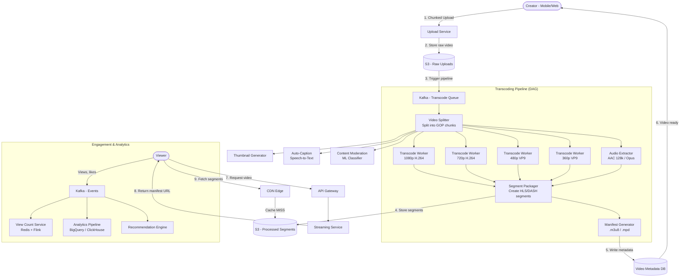

# Case Study: YouTube / Video Streaming Platform (System Design)

## Quick Summary (TL;DR)
- **Goal**: Design a video-sharing and streaming platform supporting upload, transcoding, adaptive-bitrate playback, search, recommendations, and live view counts — at YouTube scale.
- **Scale**: 2B MAU, 500 hours of video uploaded per minute, 1B hours watched per day, 100M+ videos in the catalog.
- **Key Decisions**:
  - Use **chunked resumable uploads** (TUS protocol) so users can resume interrupted uploads without restarting.
  - Use a **DAG-based transcoding pipeline** that produces multiple resolution/codec/bitrate variants in parallel for adaptive streaming.
  - Use **HTTP Adaptive Bitrate Streaming (HLS/DASH)** — the video is split into 2-10 second segments, and the client dynamically switches quality based on network conditions.
  - Use **CDN-first delivery** with geographic pre-warming for popular content — origin servers never serve hot videos directly.

---

## Noob Jargon Buster

* **Transcoding**: Converting a video from one format/resolution/bitrate to another. A single uploaded video is transcoded into 10-20 variants (e.g., 360p/720p/1080p/4K × H.264/VP9/AV1) so every device and network speed can play it.
* **Adaptive Bitrate Streaming (ABR)**: The video player monitors download speed in real-time and automatically switches to a higher or lower quality segment mid-playback. You see this when YouTube quality drops on slow WiFi and sharpens again when speed recovers.
* **HLS (HTTP Live Streaming)**: Apple's ABR protocol. The server provides a `.m3u8` manifest listing all available quality levels and their segment URLs. The player picks segments from the appropriate quality level.
* **DASH (Dynamic Adaptive Streaming over HTTP)**: Google's ABR protocol. Similar to HLS but uses an `.mpd` XML manifest. YouTube uses DASH internally.
* **Manifest File**: A playlist file (`.m3u8` or `.mpd`) that tells the player: "here are all the quality levels available, and here are the URLs for each 4-second segment at each quality level."
* **Video Segment / Chunk**: A small piece of the video (typically 2-10 seconds). Instead of downloading the entire video, the player fetches one segment at a time. This enables quality switching mid-stream and instant seek.
* **Codec**: The compression algorithm for video. H.264 is universally supported; VP9 is 30% more efficient; AV1 is 50% more efficient but slower to encode.
* **Container**: The file wrapper (MP4, WebM, MKV) that holds the video/audio streams and metadata. Think of it as a zip file for media.
* **DAG (Directed Acyclic Graph)**: A workflow model where each step depends on the output of previous steps but never cycles back. Transcoding pipelines are naturally DAGs — you can't compress audio before extracting it from the container.

---

## 1. Requirements & Scope

### Functional
1. **Upload**: Creators upload videos (up to 12 hours, 256 GB).
2. **Transcode**: Convert uploaded video into multiple resolutions, codecs, and bitrates.
3. **Stream**: Viewers watch videos with adaptive quality that adjusts to network speed.
4. **Search**: Find videos by title, description, tags, captions.
5. **Recommendations**: Personalized home feed and "Up Next" sidebar.
6. **Engagement**: Like, comment, subscribe, share, watch later.
7. **Analytics**: View count, watch time, audience retention graph (for creators).

### Non-Functional
- **Low start latency**: Video must begin playing within 2 seconds of clicking.
- **Smooth playback**: Zero buffering events for 95th percentile users on broadband.
- **High availability**: Upload and playback must survive regional outages.
- **Scale**: Handle viral videos (10M concurrent viewers on a single video).
- **Cost efficiency**: Storage and CDN bandwidth are the dominant costs — optimize aggressively.

---

## 2. Scale Estimation (The Math)

### Upload Throughput
- **Upload rate**: 500 hours of video per minute.
- **Average video length**: 5 minutes → $\frac{500 \times 60}{5} = 6,000 \text{ videos/min} \approx 100 \text{ uploads/sec}$.
- **Average raw file size**: 500 MB (1080p, 10 min video).
- **Ingress bandwidth**: $100 \text{ uploads/sec} \times 500\text{ MB} = 50\text{ GB/sec}$ → **400 Gbps** ingest.

### Viewing Throughput
- **Watch time**: 1 Billion hours/day.
- **Average bitrate for viewing**: 5 Mbps (mix of 480p mobile and 1080p desktop).
- **Concurrent viewers**: $\frac{1\text{B hours} \times 3600\text{ sec}}{86,400\text{ sec}} \approx 41.7\text{M concurrent streams}$.
- **Egress bandwidth**: $41.7\text{M} \times 5\text{ Mbps} = 208\text{ Pbps}$ → this is why CDN is mandatory and accounts for ~50% of YouTube's cost.

### Storage
- **Raw uploads**: $6,000 \text{ videos/min} \times 500\text{ MB} = 3\text{ TB/min} = 4.3\text{ PB/day}$.
- **After transcoding** (10 variants per video, varying sizes): ~3x raw → **~13 PB/day** total.
- **With codec efficiency and cold storage tiering**: Cost-managed but still exabyte-scale annually.

### Transcoding Compute
- **Transcoding time**: ~1 minute of compute per minute of video per variant.
- **10 variants per video**: Each 5-min video needs 50 CPU-minutes of transcoding.
- **6,000 videos/min × 50 CPU-min**: 300,000 CPU-minutes per minute → **5,000 transcoding workers** running continuously.

---

## 3. High-Level Architecture



---

## 4. Core Design Components

### A. Video Upload — Chunked Resumable Upload

A 500 MB video upload on mobile can take 10+ minutes. If the connection drops at 90%, the user shouldn't restart from zero.

```
TUS (resumable upload) Protocol:

  1. POST /upload
     → Server returns: upload_url, upload_id

  2. Client splits file into 5 MB chunks

  3. PATCH /upload/{upload_id}
     Headers:
       Content-Range: bytes 0-5242879/524288000
       Content-Type: application/octet-stream
     Body: [5 MB chunk]
     → Server returns: 200 OK, bytes_received: 5242880

  4. (Connection drops at chunk #90)

  5. HEAD /upload/{upload_id}
     → Server returns: bytes_received: 471859200  (90 chunks done)

  6. PATCH /upload/{upload_id}
     Content-Range: bytes 471859200-524287999/524288000
     → Resume from chunk #91
```

**Why not pre-signed S3 URLs (like Instagram)?**
- Instagram handles 2 MB images — a single HTTP PUT works fine.
- YouTube handles 500 MB+ videos — needs resumable, chunked uploads with server-side progress tracking.
- **TUS Protocol vs S3 Multipart Upload**: While S3 Multipart Upload allows resuming by listing successfully uploaded parts (`ListParts` API), it tightly couples the upload client directly to AWS APIs. **TUS** is an open HTTP protocol standard. By using TUS, the upload service remains storage-agnostic, allowing the backend to stream blocks to S3, local SAN/NAS, Google Cloud Storage, or HDFS without modifying the client upload logic.
- Upload Service stores chunks in a temporary staging bucket, assembles them after completion, then moves to the raw storage bucket.

### B. Transcoding Pipeline — DAG-Based Parallel Processing

The transcoding pipeline is the most compute-intensive component. It's modeled as a DAG for parallelism:

```
                    ┌─────────────────┐
                    │  Raw Video File │
                    └────────┬────────┘
                             │
                    ┌────────▼────────┐
                    │  Video Inspector │  (probe codec, resolution, fps, duration)
                    └────────┬────────┘
                             │
                ┌────────────┼────────────┐
                ▼            ▼            ▼
         ┌───────────┐ ┌──────────┐ ┌───────────┐
         │ Video      │ │ Audio    │ │ Subtitle  │
         │ Splitter   │ │ Extract  │ │ Extract / │
         │ (GOP-based)│ │ (demux)  │ │ STT       │
         └─────┬──────┘ └────┬─────┘ └─────┬─────┘
               │              │              │
    ┌──────────┼──────┐       │              │
    ▼          ▼      ▼       ▼              │
 ┌──────┐ ┌──────┐ ┌──────┐ ┌──────┐        │
 │1080p │ │720p  │ │480p  │ │Audio │        │
 │H.264 │ │H.264 │ │VP9   │ │AAC   │        │
 │5Mbps │ │2.5M  │ │1Mbps │ │128k  │        │
 └──┬───┘ └──┬───┘ └──┬───┘ └──┬───┘        │
    │         │        │        │             │
    └────┬────┴────┬───┘        │             │
         ▼         ▼            ▼             ▼
    ┌──────────────────────────────────────────┐
    │        Segment Packager (MP4/fMP4)        │
    │  Split each variant into 4-sec segments   │
    │  Write to S3: /v/{id}/{quality}/{seg_N}   │
    └──────────────────┬───────────────────────┘
                       ▼
              ┌─────────────────┐
              │ Manifest Writer  │
              │ .m3u8 / .mpd     │
              └─────────────────┘
```

**GOP-based splitting**: A GOP (Group of Pictures) is a sequence of frames starting with a keyframe (I-frame). Splitting on GOP boundaries ensures each chunk can be independently decoded, enabling parallel transcoding across workers.

**Why DAG, not sequential?**
- A 10-minute video transcoded sequentially into 10 variants takes 100 CPU-minutes.
- With DAG parallelism: split into 10 GOP chunks × 10 variants = 100 independent tasks. Distributed across workers, total wall-clock time drops to ~2 minutes.

**Transcoding variant matrix**:

| Resolution | Codec | Bitrate | Target |
|-----------|-------|---------|--------|
| 2160p (4K) | VP9 | 12 Mbps | Smart TVs, desktop |
| 1080p | H.264 | 5 Mbps | Desktop, tablets |
| 1080p | VP9 | 3.5 Mbps | Chrome/Android (30% smaller) |
| 720p | H.264 | 2.5 Mbps | Mobile on WiFi |
| 480p | VP9 | 1 Mbps | Mobile on 4G |
| 360p | H.264 | 600 Kbps | Slow connections |
| 240p | H.264 | 300 Kbps | 2G/Edge networks |
| Audio only | AAC | 128 Kbps | Background/music |

### C. Adaptive Bitrate Streaming (HLS/DASH)

The magic that makes YouTube "just work" on any network:

```
Master Manifest (.m3u8):
  #EXTM3U
  #EXT-X-STREAM-INF:BANDWIDTH=5000000,RESOLUTION=1920x1080
  /v/abc123/1080p/playlist.m3u8
  #EXT-X-STREAM-INF:BANDWIDTH=2500000,RESOLUTION=1280x720
  /v/abc123/720p/playlist.m3u8
  #EXT-X-STREAM-INF:BANDWIDTH=1000000,RESOLUTION=854x480
  /v/abc123/480p/playlist.m3u8

Quality-Level Playlist (720p):
  #EXTM3U
  #EXT-X-TARGETDURATION:4
  #EXTINF:4.0,
  /v/abc123/720p/seg_001.ts
  #EXTINF:4.0,
  /v/abc123/720p/seg_002.ts
  #EXTINF:4.0,
  /v/abc123/720p/seg_003.ts
  ...
```

**Playback flow**:
1. Player fetches master manifest → knows all available quality levels.
2. Starts with a conservative quality (480p) for fast start.
3. Downloads segment 1 at 480p, measures download speed.
4. If speed > 2.5 Mbps → switches to 720p for segment 2.
5. If network degrades mid-video → drops to 360p immediately (no buffering).
6. On seek: player calculates which segment contains the target timestamp, fetches it directly.

**Segment duration trade-offs**:

| Segment Length | Pros | Cons |
|---------------|------|------|
| 2 seconds | Fast quality switching, low seek latency | More HTTP requests, more manifest entries |
| 4 seconds (typical) | Good balance | Standard |
| 10 seconds | Fewer requests, better compression | Slow quality adaptation, coarse seek |

### D. Video Metadata Storage

```
Table: videos (PostgreSQL — strong consistency for metadata)
  video_id         UUID (PK)
  creator_id       UUID (FK → users, indexed)
  title            VARCHAR(500)
  description      TEXT
  tags             TEXT[]
  category         VARCHAR(100)
  duration_sec     INT
  status           ENUM: UPLOADING | PROCESSING | ACTIVE | BLOCKED | DELETED
  manifest_url     VARCHAR(500)    -- CDN URL to master .m3u8
  thumbnail_urls   JSONB           -- { "default": "...", "1": "...", "2": "...", "3": "..." }
  view_count       BIGINT          -- periodically synced from Redis
  like_count       BIGINT
  upload_date      TIMESTAMP
  published_at     TIMESTAMP
  visibility       ENUM: PUBLIC | UNLISTED | PRIVATE

Index: (creator_id, published_at DESC)  -- creator's video list
Index: (category, view_count DESC)      -- trending per category
FTS Index: (title, description, tags)   -- search
```

**Why PostgreSQL instead of DynamoDB for video metadata?**
- Video metadata has complex query patterns: full-text search, category filtering, creator dashboards with aggregations.
- Write volume is low (~100 uploads/sec) — PostgreSQL handles this easily.
- Read-heavy queries (video page, search) are cached in Redis/Elasticsearch anyway.

### E. View Count at Scale

"How many views does this video have?" seems simple but is one of the hardest problems at scale.

**Problem**: A viral video gets 100,000 views/sec. Writing `UPDATE videos SET view_count = view_count + 1` at 100K TPS to a single row will kill any database.

```
Architecture:

  Viewer watches video
       │
       ▼
  Client sends "view" event to Kafka
       │
       ▼
  Flink Streaming Job:
    - Tumbling window: 10 seconds
    - Aggregate: COUNT by video_id
    - Output: (video_id, count, window_end)
       │
       ▼
  Redis:  INCRBY view_count:{video_id} {batch_count}
       │
       ▼
  Background sync (every 5 min):
    Flush Redis counts → PostgreSQL (UPDATE videos SET view_count = ...)
```

**View deduplication / fraud detection**:
- Don't count: same user watching <30 seconds, bots, rapid refreshes.
- Use a **HyperLogLog** per video in Redis to estimate unique viewers (12 KB per video, 0.81% error).
- Flag videos with suspicious view patterns (e.g., 90% views from one country with 0 engagement) for manual review.

**Exactly-Once Processing & Fault Tolerance**:
To ensure view counts are neither lost nor double-counted if Flink or Redis fails:
- **Flink Exactly-Once Checkpoints**: Flink uses the Chandy-Lamport distributed snapshotting algorithm to save the state of window aggregates to persistent storage (HDFS/S3) periodically. On failure, Flink resumes from the last checkpoint and replays the Kafka log from the corresponding partition offsets.
- **Idempotent Redis Writes**: Instead of naked `INCRBY` commands (which might run twice if a Flink sink retries after a network blip), we issue atomic updates keyed by the window end timestamp (e.g., `HSETNX view_window:{video_id}:{window_end} count {value}`) or write to Cassandra using lightweight transactions (LWT) to ensure idempotency.

### F. CDN Strategy — Video Delivery at Exabyte Scale

CDN is 50%+ of YouTube's infrastructure cost. Optimizing it is critical:

```
Tiered Caching:

  Viewer ──► Edge PoP (city-level)
               │
               ├─ Cache HIT → serve segment (< 20ms)
               │
               ├─ Cache MISS ──► Regional Shield (country-level)
               │                     │
               │                     ├─ Cache HIT → serve + populate Edge
               │                     │
               │                     ├─ Cache MISS ──► Origin (S3)
               │                                          │
               │                                          └─ Serve + populate Shield + Edge
```

**Optimization strategies**:
1. **Pre-warm popular content**: When a video trends, proactively push its segments to edge PoPs in top-traffic regions before viewers request them.
2. **Long tail in cold storage**: 90% of videos get <100 views. Store their segments in S3 Infrequent Access (50% cheaper). Promote to standard S3 if views spike.
3. **Segment-level caching**: Only the first few segments of a video are popular (most viewers don't finish). Cache segments 1-10 aggressively; let later segments cache on-demand.
4. **Off-peak pre-positioning**: Replicate tomorrow's predicted popular content to edge PoPs during overnight low-traffic windows.

**Cache-Control**:
```
Video segments:     Cache-Control: public, max-age=31536000  (immutable, 1 year)
Manifest files:     Cache-Control: public, max-age=5         (short — may update if new quality added)
Thumbnails:         Cache-Control: public, max-age=86400     (1 day — can change)
```

**ISP Peering & Google Global Cache (GGC)**:
To dramatically cut transit fees, YouTube does not rely purely on public cloud CDN egress. It negotiates **direct ISP peering agreements** and places proprietary hardware nodes (GGC) directly within local Internet Service Providers' (ISPs) datacenters. ISPs host these servers for free because it prevents heavy video traffic from congesting their external transit link, while YouTube benefits by serving over 90% of user bandwidth locally at zero egress cost.

### G. Content Moderation Pipeline

Every uploaded video must be screened before going public:

```
Upload complete
     │
     ▼
  ┌──────────────────────────────┐
  │ Stage 1: Automated ML Scan   │
  │  - Nudity / violence frames  │
  │  - Audio: hate speech (STT)  │
  │  - Copyright: audio fingerp. │
  │    (Content ID system)       │
  └──────────┬───────────────────┘
             │
     ┌───────┼───────┐
     ▼       ▼       ▼
  APPROVE  REVIEW  REJECT
  (auto)   (queue)  (auto)

  ML confidence:
    > 0.95 violation  → auto-reject + notify creator
    0.5 - 0.95        → queue for human review (SLA: 24 hours)
    < 0.5             → auto-approve

  Copyright (Content ID):
    Audio fingerprint match → allow but monetize to copyright holder
    Visual match            → flag for review
```

**Content ID** is a specialized system: every uploaded video's audio/visual track is fingerprinted and compared against a database of copyrighted content. If a match is found, the copyright holder can choose to: block, monetize (take ad revenue), or track.

**Content ID Fingerprinting Indexing**:
Comparing raw video/audio tracks against a reference database of 50M+ files during the real-time transcoding process is an $O(N)$ lookup nightmare. Content ID optimizes this by indexing compact signatures:
- **Audio Fingerprints (Shazam-style)**: We convert audio streams into a spectrogram (time vs frequency graph). We identify local high-energy peaks, group them into pairs (anchor points), and generate hashes representing the time-frequency difference. A reference database stores these hashes as keys, pointing to the owner metadata. Lookup is an $O(1)$ database match.
- **Visual Fingerprints (Vector Embeddings)**: We extract keyframes from the video, convert them to visual embeddings (using a custom Vision Transformer or CNN), and index the vectors. During transcoding, the visual engine performs an Approximate Nearest Neighbor (ANN) search inside a high-throughput vector database (like Milvus or FAISS) to flag copyrighted visual matches in sub-seconds.

---

## 5. Why Choose This? (Defending Your Architecture)

### Why use chunked resumable upload instead of pre-signed S3 PUT?
* **Answer**: "A pre-signed PUT works for small files (Instagram: 2 MB images), but YouTube handles 500 MB+ videos uploaded from mobile networks. A single PUT with a 500 MB body will fail on any network interruption — the entire file must be re-uploaded. Chunked resumable upload (TUS protocol) splits the file into 5 MB chunks with server-side progress tracking. If the connection drops at 90%, the client queries the server for the last received byte offset and resumes from there. Furthermore, unlike S3 Multipart Upload which locks the client into S3 APIs, TUS is an open, storage-agnostic protocol standard, allowing our backend to change underlying storage without rewriting client code. At our upload scale (400 Gbps ingest), eliminating re-uploads saves significant bandwidth and user frustration."

### Why transcode into 10+ variants instead of just 1080p and 480p?
* **Answer**: "Users watch on everything from 4K smart TVs to 2G phones in rural India. If we only offered 1080p and 480p, a user on 3G (1 Mbps) couldn't stream 480p (1 Mbps) without constant buffering. A user on a 4K TV would see upscaled 1080p — blurry. Multiple variants let the ABR algorithm pick exactly the right quality for each user's current bandwidth. Additionally, newer codecs (VP9, AV1) compress 30-50% better than H.264 — serving VP9 to Chrome users saves 30% CDN bandwidth, which at exabyte scale is billions of dollars per year."

### Why use 4-second segments instead of streaming the full file?
* **Answer**: "Streaming a full file means the player must download sequentially from the start. Seeking to minute 45 requires downloading everything before it (or an HTTP Range request, which most CDN caches handle poorly). With 4-second segments, seeking to minute 45 is a single HTTP GET to segment #675 — instant. Segments also enable quality switching mid-stream: the player can fetch segment N at 720p and segment N+1 at 1080p if bandwidth improves. Each segment is independently decodable (starts with a keyframe), so the player never needs prior segments to decode the current one."

### Why use Kafka + Flink for view counts instead of direct database writes?
* **Answer**: "A viral video gets 100K views/sec. Direct `UPDATE ... SET count = count + 1` at 100K TPS on a single database row creates lock contention that crashes the database. By streaming view events into Kafka and aggregating with Flink in 10-second tumbling windows, we batch 1M view events into a single atomic Redis update or Cassandra transaction. Flink's distributed state checkpointing provides exactly-once processing guarantees, preventing double-counting or loss during node crashes. This reduces database write pressure by 99.99% while ensuring count integrity. The trade-off is eventual consistency (up to 10 seconds stale) — perfectly acceptable since approximate counts are expected at scale."

---

## 6. SDE-2 Deep Dives & Trade-offs

### A. Video Start Latency Optimization

The user clicks play — they expect video within 2 seconds. Every millisecond of delay increases abandonment.

**Optimizations**:
1. **Preload first segment**: When the video thumbnail is visible in the feed, preload segment 0 at the lowest quality (240p, ~50 KB). When the user clicks play, playback starts instantly from the preloaded buffer.
2. **Start at low quality**: Always start playback at 480p regardless of bandwidth estimate. Upgrade after segment 1 if bandwidth allows. Users prefer instant-start-then-upgrade over waiting 3 seconds for 1080p to buffer.
3. **CDN proximity**: Serve manifest and first 5 segments from the nearest edge PoP. DNS routing directs to the closest CDN node.
4. **Persistent connections**: The player maintains HTTP/2 connections to the CDN edge — eliminates TCP+TLS handshake (200-400ms) for segment fetches.

### B. Seeking & Byte-Range Optimization

When a user seeks to 1:23:45 in a 2-hour video:

```
1. Player calculates: 1:23:45 = 5025 seconds
2. Segment number: 5025 / 4 = segment #1256
3. Fetch: GET /v/{id}/720p/seg_1256.ts
4. Decode and render (segment starts with keyframe → no dependency on prior segments)
```

**Trick for long videos**: YouTube uses **byte-range requests within segments** for sub-segment precision. The manifest includes byte offsets for each keyframe within a segment, allowing seek accuracy to ~0.5 seconds.

### C. Live Streaming vs. VOD

| Aspect | VOD (Pre-recorded) | Live Streaming |
|--------|-------------------|----------------|
| Transcoding | Offline, minutes/hours | Real-time, < 5 sec latency budget |
| Segments | Pre-generated, cached | Generated on-the-fly, appended to manifest |
| Manifest | Static file | Dynamic, updated every segment duration |
| CDN | Fully cacheable | Edge must poll origin for new segments |
| Seek | Full timeline available | Only rewind to stream start |
| Scale challenge | Storage | Real-time compute + CDN invalidation |

**Live streaming pipeline**:
```
  Camera → RTMP Ingest Server → Real-time Transcoder → Segmenter
                                                          │
                                 Append segment to manifest
                                                          │
                                            CDN edge polls every 2 sec
                                                          │
                                            Viewer fetches latest segment
```

- **Latency target**: 5-15 seconds behind real-time (HLS). For ultra-low latency (auctions, gaming): use WebRTC or LL-HLS (2-3 seconds).
- **DVR window**: Keep last 4 hours of segments for rewind/catch-up.

### D. Recommendation Engine — "Up Next"

The recommendation system drives 70% of YouTube watch time. It's a two-stage pipeline:

```
Stage 1: Candidate Generation (broad, fast)
  - Collaborative filtering: "Users who watched X also watched Y"
  - Content-based: Video embeddings (title + tags + visual features) → nearest neighbors
  - Graph-based: Subscription graph, co-watch graph
  - Output: ~500 candidate videos per user

Stage 2: Ranking (narrow, precise)
  - Features: user watch history, video freshness, engagement rate,
              creator authority, user demographics, time of day
  - Model: Deep neural network (multi-task: predict watch time + like + subscribe)
  - Output: Ranked list of ~30 videos

  Diversity filter: ensure no more than 2 videos from same creator,
                    mix categories, inject some exploration (cold-start videos)
```

### E. Cost Optimization — Storage Tiering

At exabyte scale, storage cost dominates. Not all videos deserve the same storage class:

```
Upload → Standard S3 (hot, $0.023/GB)
  │
  30 days, if views < 100/day
  │
  ▼
S3 Infrequent Access ($0.0125/GB, 46% savings)
  │
  90 days, if views < 10/day
  │
  ▼
S3 Glacier Instant Retrieval ($0.004/GB, 83% savings)
  │
  1 year, if views < 1/day
  │
  ▼
S3 Glacier Deep Archive ($0.00099/GB, 96% savings)
  - Only original file kept (re-transcode on demand if ever needed)
  - Delete lower-quality variants (can regenerate)
```

- **90% of videos** receive <100 views total. These move to cold storage quickly.
- **Re-transcode on demand**: If a cold video suddenly goes viral, pull from Glacier, re-transcode, and push to CDN. Latency: minutes, but this is rare.
- **Delete redundant variants**: For cold videos, keep only original + 480p. Delete 4K/1080p/720p variants. Regenerate if needed.

### F. Copyright — Content ID System

```
Upload:
  1. Extract audio fingerprint (Shazam-like: spectrogram → peaks → hash)
  2. Extract visual fingerprint (perceptual hash per keyframe)
  3. Compare against reference database (50M+ copyrighted works)

Match found:
  Copyright holder's pre-set policy:
    - BLOCK:     Video rejected, creator notified
    - MONETIZE:  Video published, ad revenue goes to copyright holder
    - TRACK:     Video published, copyright holder gets analytics only

  Creator can appeal → human review queue
```

---

## 7. Summary: Component Decision Table

| Component | Choice | Rationale |
|-----------|--------|-----------|
| Upload | Chunked resumable (TUS) | Resume on network failure; handles 500 MB+ files |
| Raw Storage | S3 Standard → tiered lifecycle | 96% cost reduction for long-tail cold videos |
| Transcoding | DAG pipeline, GOP-parallel | 10+ variants in minutes; horizontally scalable |
| Streaming | HLS/DASH adaptive bitrate | Quality adapts to bandwidth; instant seek |
| Segment Length | 4 seconds | Balance of quality switching speed and request overhead |
| Video Metadata | PostgreSQL + Redis cache | Complex queries (search, creator dashboard); low write volume |
| View Counts | Kafka → Flink → Redis → Postgres | Batched aggregation; survives 100K views/sec per video |
| Media Delivery | 3-tier CDN (edge → shield → origin) | 95%+ cache hit; pre-warm trending content |
| Recommendations | Two-stage: candidate gen → ranker | Drives 70% of watch time |
| Content Moderation | ML auto-classify + Content ID | Copyright, safety; human review for edge cases |

---

## 8. Common Traps & Mitigations

1. **Transcoding Backlog During Upload Spikes**: A viral event triggers 10x upload volume. Transcoding queue grows faster than workers can drain.
   - *Mitigation*: Auto-scale transcoding workers (spot/preemptible instances — transcoding is idempotent and retryable). Prioritize by creator tier: partner creators get priority, new accounts get lower priority.

2. **Hot Video CDN Thundering Herd**: A new music video drops — 50M viewers in the first hour. First segments aren't cached at every edge PoP yet.
   - *Mitigation*: Pre-warm the first 10 segments to top 50 PoPs before the premiere starts (scheduled releases). Use origin shield so only 1 request per PoP reaches S3, not 1 per viewer.

3. **View Count Inflation / Botting**: Bot farms inflate view counts to manipulate trending rankings.
   - *Mitigation*: Count only views where user watched >30 seconds. Deduplicate by user_id (HyperLogLog). Rate-limit view events per IP. Freeze public view count during review if anomaly detected — "301+ views" state.

4. **Seek Causes Buffering**: User seeks to minute 45 and waits 3 seconds before playback resumes.
   - *Mitigation*: Ensure segments start on keyframes (IDR frames). Pre-fetch 2 segments ahead of playback cursor. Use HTTP/2 multiplexing to fetch audio + video segments in parallel.

5. **Transcoding Costs Dominate Budget**: 5,000 transcoding workers running 24/7 is expensive.
   - *Mitigation*: Use spot instances (70% cheaper, transcoding is retryable). Don't transcode all variants immediately — generate 480p and 720p first (covers 80% of viewers). Generate 4K and AV1 variants async, only if the video gets >1,000 views in the first 24 hours. Most videos never need 4K.
