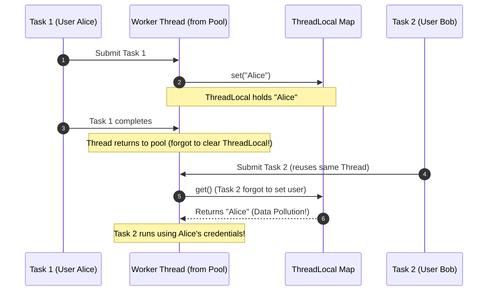
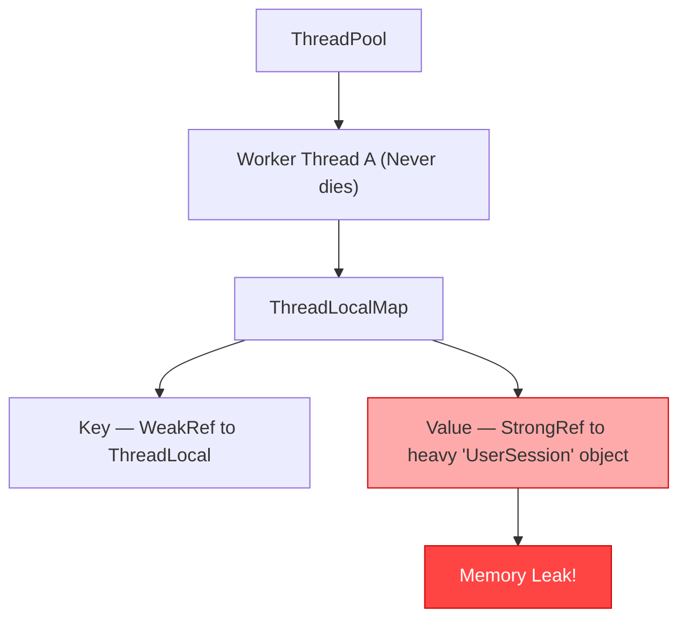

# Advanced Concurrency: Shutdown, Scheduling, ThreadLocal Leaks, and Virtual Threads

This guide breaks down three advanced Java concurrency topics into simple, digestible concepts for beginners.

---

## 1. ThreadPool Shutdown: `shutdown()` vs `awaitTermination()`

When you are done with a thread pool (like a `ThreadPoolExecutor`), you must close it to free up resources. If you don't, the threads will keep running in the background, preventing the JVM from shutting down.

Java provides two main methods for this: `shutdown()` and `awaitTermination()`.

### The Pizza Restaurant Analogy
Imagine you are the manager of a busy pizza restaurant at closing time (10:00 PM):

*   **`shutdown()` (The Lock-the-Door Action)**:
    *   At exactly 10:00 PM, you lock the front doors.
    *   **New customers cannot enter** (new tasks submitted to the pool will be rejected with a `RejectedExecutionException`).
    *   However, the customers already inside the restaurant **are allowed to finish their meals**, and the kitchen staff will finish baking the pizzas already ordered (tasks in the queue and active threads will complete).
    *   *Importantly*: You do not wait around at the door. You lock it and immediately go back to your office (it is **non-blocking** / asynchronous).
*   **`awaitTermination(timeout, unit)` (The Waiting-for-Everyone Action)**:
    *   You sit in the dining room and wait for the restaurant to become completely empty.
    *   You check your watch and set a limit: *"I will wait for up to 30 minutes (the timeout)."*
    *   If all customers leave within 20 minutes, you lock up and go home (returns `true` immediately).
    *   If 30 minutes pass and some stubborn customers are still eating, you stop waiting (returns `false` and resumes execution).
    *   *Importantly*: You are blocked from doing anything else while waiting (it is **blocking** / synchronous).

```mermaid
flowchart TD
    subgraph Active Pool [ThreadPool State]
        RUNNING[1. RUNNING <br>Accepts new tasks. Processes queue.]
        SHUTDOWN[2. SHUTDOWN <br>Rejects new tasks. Processes queue.]
        STOP[3. STOP <br>Rejects new tasks. Clears queue. Interrupts workers.]
        TIDYING[4. TIDYING <br>All tasks finished. Active threads = 0.]
        TERMINATED[5. TERMINATED <br>Shutdown process complete.]
    end

    subgraph Actions [Trigger Actions]
        ActShutdown[Call shutdown()]
        ActShutdownNow[Call shutdownNow()]
    end

    RUNNING -->|ActShutdown| SHUTDOWN
    RUNNING -->|ActShutdownNow| STOP
    SHUTDOWN -->|Queue empty & all threads idle| TIDYING
    SHUTDOWN -->|ActShutdownNow| STOP
    STOP -->|Active threads terminate| TIDYING
    TIDYING -->|terminated() callback completes| TERMINATED

    subgraph AwaitTermination [awaitTermination(timeout)]
        BlockThread[Blocks Calling Thread]
        BlockThread --> CheckTerminated{Is Pool TERMINATED?}
        CheckTerminated -->|Yes| ReturnTrue[Returns true immediately]
        CheckTerminated -->|No| CheckTimeout{Timeout Reached?}
        CheckTimeout -->|Yes| ReturnFalse[Returns false]
        CheckTimeout -->|No| BlockThread
    end
```

---

### Comparison Table

| Feature | `shutdown()` | `awaitTermination()` |
| :--- | :--- | :--- |
| **Is it blocking?** | **No**. Returns immediately. | **Yes**. Blocks the current thread until the pool is empty or timeout is reached. |
| **Does it close the pool?** | **Yes**. Starts the shutdown process. | **No**. It just waits/observes. It doesn't initiate a shutdown itself. |
| **What happens to running tasks?** | Allowed to run to completion. | Allowed to run (while waiting). |
| **What happens to queued tasks?** | Allowed to run to completion. | Allowed to run (while waiting). |
| **Return Value** | `void` | `boolean` (`true` if pool is terminated, `false` if timeout occurred). |

---

### The Graceful Shutdown Pattern (Production Code)
In real-world applications, you should never just call `shutdown()` or `shutdownNow()` and walk away. You should combine them in a standard pattern:

```java
public static void shutdownGracefully(ExecutorService pool) {
    // 1. Stop accepting new tasks
    pool.shutdown(); 
    
    try {
        // 2. Wait up to 60 seconds for existing tasks to finish
        if (!pool.awaitTermination(60, TimeUnit.SECONDS)) {
            System.err.println("Tasks did not finish in 60s! Force-closing...");
            // 3. Cancel currently executing tasks by interrupting them
            pool.shutdownNow(); 
            
            // 4. Wait another 60 seconds for tasks to respond to the interrupt
            if (!pool.awaitTermination(60, TimeUnit.SECONDS)) {
                System.err.println("Pool did not terminate even after shutdownNow()!");
            }
        }
    } catch (InterruptedException ie) {
        // (Re-)Cancel if current thread also interrupted
        pool.shutdownNow();
        // Preserve interrupt status
        Thread.currentThread().interrupt();
    }
}
```

---

## 2. ScheduledThreadPoolExecutor & The ThreadLocal Trap

### Part A: ScheduledThreadPoolExecutor (The Alarm Clock Pool)
A `ScheduledThreadPoolExecutor` (created via `Executors.newScheduledThreadPool(n)`) is a thread pool that can:
1. Run a task after a **delay** (e.g., "Run this in 10 seconds").
2. Run a task **repeatedly** (e.g., "Run this every 5 minutes").

#### How it works under the hood
Instead of a normal queue, it uses a **`DelayQueue`**. Tasks are sorted by their execution time, so the task scheduled to run next is always at the front.

#### Fixed Rate vs Fixed Delay (Crucial Interview Topic)
*   **`scheduleAtFixedRate(runnable, initialDelay, period, unit)`**:
    *   Runs the task at a strict interval (e.g., every 10 seconds), **regardless of when the previous run finished**.
    *   *Risk*: If a task takes 12 seconds to run, but is scheduled every 10 seconds, the runs will start stacking up/overlapping.
*   **`scheduleWithFixedDelay(runnable, initialDelay, delay, unit)`**:
    *   Starts the clock for the next run **only after the current run finishes**.
    *   If a task takes 12 seconds and the delay is 10 seconds, the next task starts 22 seconds after the first one started (12s execution + 10s delay).

---

### Part B: The ThreadLocal Concept (The Personal Glove Box)
`ThreadLocal` allows you to create variables that can only be read and written by the **same thread**.
*   **The Analogy**: Imagine you are a delivery driver renting a car. The car has a glove box (`ThreadLocal`). You put your sunglasses in it. Only you can access them. When another driver rents the same car tomorrow, they should NOT see your sunglasses.

---

### Part C: The Trap — ThreadLocal + ThreadPool = Memory Leaks & Data Pollution
In Java, thread pools **reuse** threads. Worker threads do not die when a task finishes; they wait for the next task.
If you use `ThreadLocal` inside a task executed by a thread pool, you face two major problems:

1.  **Data Pollution (Dirty State)**:
    *   Task 1 runs on Thread A. It sets `ThreadLocalUser.set("Alice")`.
    *   Task 1 completes. Thread A goes back to the pool but **remembers** `"Alice"`.
    *   Task 2 runs on Thread A. It doesn't set a user but calls `ThreadLocalUser.get()`.
    *   Task 2 reads `"Alice"`! This is a massive security risk and bug.



2.  **Memory Leaks (OOM)**:
    *   The `ThreadLocal` map is stored inside the `Thread` object.
    *   If a thread in a pool stays alive forever (like core threads), the objects stored in its `ThreadLocal` will **never be garbage-collected**, even if the tasks that put them there are long gone!



---

### The Code Example & The Solution
You must **always** clean up `ThreadLocal` in a `finally` block using `remove()`.

```java
import java.util.concurrent.*;

public class ThreadLocalPoolDemo {
    // 1. Define a ThreadLocal variable
    private static final ThreadLocal<String> userContext = new ThreadLocal<>();

    public static void main(String[] args) throws InterruptedException {
        // A scheduled pool with 2 worker threads
        ScheduledExecutorService executor = Executors.newScheduledThreadPool(2);

        Runnable task = () -> {
            try {
                // If this is the second run on the same thread, and we forgot to remove it,
                // we might see the old value here!
                String existingUser = userContext.get();
                System.out.println(Thread.currentThread().getName() + " | Existing context: " + existingUser);

                // Set new user context
                String currentUser = "User-" + System.currentTimeMillis() % 1000;
                userContext.set(currentUser);
                System.out.println(Thread.currentThread().getName() + " | Set context to: " + currentUser);

                // Do some business logic...
                
            } finally {
                // CRITICAL SOLUTION: Always clean up to prevent memory leaks and data pollution!
                userContext.remove(); 
                System.out.println(Thread.currentThread().getName() + " | Cleaned up context.");
            }
        };

        // Run the task every 2 seconds
        executor.scheduleAtFixedRate(task, 0, 2, TimeUnit.SECONDS);

        Thread.sleep(7000);
        executor.shutdown();
    }
}
```

---

## 3. Virtual Threads vs Platform Threads (Java 21 Project Loom)

Java 21 introduced **Virtual Threads**, a game-changing feature that completely redefines how we build scalable applications.

### The Restaurant Metaphor
Imagine a restaurant that handles incoming tables (tasks):

*   **Platform Threads (Traditional OS Threads)**:
    *   **The Rule**: Every table gets its own dedicated, personal waiter.
    *   If a table is quiet, looking at the menu, or waiting for food (Blocking I/O), **the waiter just stands there doing nothing**. They cannot help any other table.
    *   If 1,000 tables show up, you must hire 1,000 waiters. This costs a fortune (memory) and crowds the restaurant (CPU context switching overhead).
*   **Virtual Threads (Project Loom)**:
    *   **The Rule**: Tables order on a digital tablet. You only hire 4 actual waiters (**Carrier Threads**).
    *   When table A is reading the menu (Blocking I/O), the waiter goes to help table B.
    *   When table A's food is ready, the waiter returns to serve table A.
    *   The tables feel like they have a dedicated waiter (Virtual Thread), but the actual OS resources are shared dynamically. You can easily support 1,000,000 tables this way!

---

### Architectural Differences

```mermaid
flowchart TD
    subgraph Platform Model [Platform Thread Model (1-to-1)]
        direction TB
        JTA[Java Thread A] -->|1:1 mapping| OST1[OS Thread 1]
        JTB[Java Thread B] -->|1:1 mapping| OST2[OS Thread 2]
    end

    subgraph Virtual Model [Virtual Thread Model (M-to-N)]
        direction TB
        VT1[Virtual Thread 1]
        VT2[Virtual Thread 2]
        VT3[Virtual Thread 3]
        VT4[Virtual Thread 4]
        
        VT1 & VT2 & VT3 & VT4 -->|M:N mapping managed by JVM| CarrierPool[ForkJoinPool Carrier Threads]
        
        CarrierPool -->|1:1 mapping| OST_C1[OS Thread C1]
        CarrierPool -->|1:1 mapping| OST_C2[OS Thread C2]
    end
```

| Feature | Platform Threads (OS Threads) | Virtual Threads (Java 21) |
| :--- | :--- | :--- |
| **Who manages it?** | Operating System (OS). | Java Virtual Machine (JVM). |
| **Memory footprint** | Huge (~1 MB per thread stack). | Tiny (a few hundred bytes to a few KB). |
| **Creation speed** | Slow (requires OS system call). | Fast (almost instant, like creating a normal Java object). |
| **Context Switch Cost** | Expensive (requires OS kernel). | Very cheap (managed entirely inside the JVM). |
| **Maximum Limit** | Thousands (limited by OS RAM/handles). | Millions (limited only by heap space). |

---

### Under the Hood: Mounting, Unmounting, and Carrier Threads
To understand virtual threads, you need to understand three terms:
1.  **Virtual Thread**: The lightweight task wrapper.
2.  **Carrier Thread**: The actual OS thread (from a fork-join pool) that executes the virtual thread.
3.  **Mounting / Unmounting**:
    *   When a virtual thread starts executing, it is **mounted** onto a carrier thread (its execution stack is mapped to the carrier thread's stack).
    *   When the virtual thread blocks (e.g., calls `Thread.sleep()` or waits for a database result), the JVM **unmounts** it. It saves its execution state (stack frame) in the JVM Heap memory and frees the carrier thread to execute another virtual thread.
    *   When the blocking call completes, the JVM schedules the virtual thread again, mounting it on *any* available carrier thread to resume.

#### The Pinning Trap (Critical Warning)
Sometimes, a virtual thread cannot be unmounted from its carrier thread when it blocks. This is called **pinning**.
If a virtual thread gets pinned, the carrier thread is blocked. If all carrier threads get pinned, the application freezes!

**What causes pinning?**
1.  Running code inside a `synchronized` block or method.
2.  Calling native code (via JNI).

> **Version caveat**: As of **JDK 24 (JEP 491)**, `synchronized` no longer pins virtual threads — monitor acquisition was reworked so a virtual thread can unmount while holding a monitor. The `synchronized`-pinning pitfall below is real on Java 21–23 but is largely resolved on JDK 24+. (Native/JNI frames and `Object.wait` in older builds can still pin.)

**How to fix synchronized pinning**:
Replace `synchronized` with `java.util.concurrent.locks.ReentrantLock`.

```java
// BAD: Causes Carrier Thread Pinning!
public synchronized void doWork() {
    dbCall(); // If this blocks, the carrier thread blocks too.
}

// GOOD: Avoids Pinning!
private final ReentrantLock lock = new ReentrantLock();
public void doWork() {
    lock.lock();
    try {
        dbCall(); // JVM can safely unmount virtual thread here
    } finally {
        lock.unlock();
    }
}
```

---

### New Guidelines for Writing Virtual Thread Code

1.  **DO NOT POOL THEM**:
    *   *Old way*: You pooled platform threads (`newFixedThreadPool`) because they were expensive to create.
    *   *New way*: Virtual threads are cheap. Never pool them. If you need to run a task, just use `Executors.newVirtualThreadPerTaskExecutor()` or start a new virtual thread directly with `Thread.startVirtualThread(runnable)`.
2.  **Use for I/O-Bound, NOT CPU-Bound**:
    *   Virtual threads don't make your CPU calculations faster. They only prevent threads from wasting resources while waiting for I/O.
    *   For CPU-heavy work (e.g. video rendering, cryptography), traditional platform threads or parallel streams are still preferred.
3.  **Use Semaphores, Not Pools, for Rate Limiting**:
    *   *Old way*: You limited requests to a database by using a thread pool of size 10.
    *   *New way*: Since you don't pool virtual threads, protect database resources using a `Semaphore(10)`.

```java
import java.util.concurrent.*;

public class VirtualThreadDemo {
    public static void main(String[] args) throws Exception {
        // 1. Create an executor that spawns a new virtual thread for each task
        try (var executor = Executors.newVirtualThreadPerTaskExecutor()) {
            
            for (int i = 1; i <= 10_000; i++) {
                final int taskId = i;
                executor.submit(() -> {
                    // This blocks, but it doesn't block the OS thread!
                    // JVM unmounts this virtual thread and runs another one.
                    try {
                        Thread.sleep(1000); 
                    } catch (InterruptedException e) {
                        Thread.currentThread().interrupt();
                    }
                    System.out.println("Finished task " + taskId + " on " + Thread.currentThread());
                });
            }
        } // Executor close() blocks until all virtual threads finish.
    }
}
```

---

## 4. Quick Interview Q&A Summary

### Q1: Can I use `awaitTermination()` without calling `shutdown()` first?
*   **Answer**: Yes, you *can*, but it is usually useless. If you don't call `shutdown()`, the pool is still in the `RUNNING` state, and it won't terminate. `awaitTermination()` will block for the entire duration of the timeout and then return `false` (unless all threads magically die on their own, which doesn't happen in standard pools). Always call `shutdown()` first.

### Q2: What is the risk of using `ThreadLocal` in a web server like Tomcat?
*   **Answer**: Web servers use thread pools to handle HTTP requests. If you set a `ThreadLocal` variable (like user session details or transaction IDs) during a request and fail to call `.remove()` in `finally`, two things happen:
    1.  **Data leak**: The thread returns to the pool with that data. The next user request processed by that thread will read the previous user's data.
    2.  **Memory leak**: The data object remains referenced in the thread's `ThreadLocalMap` and cannot be garbage-collected, eventually causing an OutOfMemoryError.

### Q3: Why does `ThreadLocal` use a `WeakReference` for its keys under the hood?
*   **Answer**: The keys of the thread-local map are weak references to the `ThreadLocal` object itself. If the `ThreadLocal` object is no longer referenced anywhere else, it is garbage-collected. This prevents memory leaks of the *keys*. However, the *values* are still strongly referenced by the thread, so the value will leak until the thread itself dies or `.remove()` is called explicitly.

### Q4: If virtual threads are so good, will they replace platform threads entirely?
*   **Answer**: No. Virtual threads are designed specifically for **I/O-bound** applications (like web servers handling web API calls, database operations, etc.). For **CPU-bound** workloads (like cryptography, image processing, machine learning), virtual threads offer no benefit because they still need CPU time to run, and there is no I/O wait time to yield. Platform threads remain the right choice for CPU-bound tasks.

### Q5: How do Virtual Threads handle context switching differently?
*   **Answer**: Platform thread context switches are handled by the Operating System, requiring a transition between user mode and kernel mode, saving CPU registers, and flushing cache lines. This is expensive. Virtual thread context switches are handled by the JVM inside user space. It simply saves the virtual thread's stack in the Java heap and mounts a new stack. This is as cheap as calling a few methods in Java.

---

## 5. Self-Assessment: Scenario-Based Practice Questions

Test your understanding with these real-world concurrency scenarios! (Answers are hidden below each question).

### Scenario 1: The Infinite Hang
**Problem**: You have a microservice that calls an external API. You write the following code to shut down the executor handling the API calls during application shutdown:
```java
public void stopService() {
    System.out.println("Stopping executor...");
    try {
        executor.awaitTermination(30, TimeUnit.SECONDS);
    } catch (InterruptedException e) {
        Thread.currentThread().interrupt();
    }
}
```
During testing, you notice that this method blocks for exactly 30 seconds every time, and the application process never actually exits. What did you do wrong?

<details>
<summary><b>Click to see the answer</b></summary>

**Answer**: 
You forgot to call `executor.shutdown()` first! 
`awaitTermination()` does not trigger a shutdown; it only waits for an already shutting-down pool to become empty. Since `shutdown()` was never called, the pool remains in the `RUNNING` state, keeping all worker threads alive. `awaitTermination()` blocks until the 30-second timeout expires, returns `false`, and the process fails to exit because active worker threads are still running.
</details>

### Scenario 2: The Stale Tenant ID
**Problem**: In a multi-tenant SaaS application, you use a `ThreadLocal<String> tenantIdHolder` to store the database tenant ID for the current request. You submit tasks to a `ThreadPoolExecutor` to process reports.
```java
// Inside a ThreadPool worker task:
tenantIdHolder.set(request.getTenantId());
generateReport();
```
During QA testing, Tenant B logs in and occasionally sees reports belonging to Tenant A. How is this possible and how do you fix it?

<details>
<summary><b>Click to see the answer</b></summary>

**Answer**: 
Since the thread pool reuses threads, the worker thread that processed Tenant A's report kept the value `"Tenant-A"` in its `ThreadLocal` storage. When the same thread was reused to process Tenant B's report, if the task failed early or skipped setting the tenant ID, the code called `tenantIdHolder.get()` and read the stale `"Tenant-A"` value.
**The Fix**: Clean up using a `finally` block:
```java
try {
    tenantIdHolder.set(request.getTenantId());
    generateReport();
} finally {
    tenantIdHolder.remove(); // Removes the value from the current thread's map
}
```
</details>

### Scenario 3: The Cryptography Bottleneck
**Problem**: You have a service that decrypts heavy 100MB files using AES decryption. To handle 10,000 decryption requests concurrently, you rewrite the service to use Java 21's Virtual Threads:
```java
try (var executor = Executors.newVirtualThreadPerTaskExecutor()) {
    for (File file : filesToDecrypt) {
        executor.submit(() -> decryptFile(file));
    }
}
```
However, performance is actually slightly *worse* than using a standard Fixed Thread Pool of size equal to your CPU cores. Why did virtual threads fail to improve performance here?

<details>
<summary><b>Click to see the answer</b></summary>

**Answer**: 
AES decryption is a **CPU-bound** task, not an I/O-bound task. The CPU must compute constantly to decrypt the data. 
Virtual threads improve scalability for **I/O-bound** tasks because they can yield (unmount) when waiting for network/disk responses, letting other threads use the CPU. In a CPU-bound task, the thread never waits, so it never yields. Creating 10,000 virtual threads for CPU-bound tasks just adds scheduling overhead inside the JVM without any performance benefit.
</details>

### Scenario 4: The Database Pool Freezes
**Problem**: You migrated your Spring Boot web app to use Virtual Threads for handling HTTP requests. Inside a key service, you use `synchronized` to ensure thread-safe access to a counter before querying the database:
```java
public synchronized void getNextAndQueryDb() {
    counter++;
    databaseClient.fetchUserRecords(); // This makes a network call to the database
}
```
Under heavy load, your application's carrier threads become 100% busy, but database utilization is almost zero, and requests start timing out. What is happening?

<details>
<summary><b>Click to see the answer</b></summary>

**Answer**: 
This is **Carrier Thread Pinning**. 
When a virtual thread executes a `synchronized` block or method and then encounters a blocking operation (like `databaseClient.fetchUserRecords()`), the JVM cannot unmount it from the underlying carrier thread. The carrier thread is pinned and forced to block waiting for the database response. Under heavy load, all carrier threads become pinned, freezing the entire application.
**The Fix**: Replace `synchronized` with a `ReentrantLock`:
```java
private final ReentrantLock lock = new ReentrantLock();

public void getNextAndQueryDb() {
    lock.lock();
    try {
        counter++;
        databaseClient.fetchUserRecords(); // JVM can safely unmount the virtual thread now!
    } finally {
        lock.unlock();
    }
}
```
</details>

### Scenario 5: The ThreadLocal Leak in Scheduled Tasks
**Problem**: You schedule a clean-up task to run every 10 seconds using `ScheduledThreadPoolExecutor`. Inside the task, you use `ThreadLocal` to cache a temporary date format. Over 48 hours, the JVM runs out of memory (OOM) and crashes. Why does the `ThreadLocal` leak memory here even though the scheduled tasks complete successfully?

<details>
<summary><b>Click to see the answer</b></summary>

**Answer**: 
Even though each run of the task completes, the worker threads inside the `ScheduledThreadPoolExecutor` stay alive indefinitely. Because the task never calls `ThreadLocal.remove()`, the cached date format objects remain strongly referenced inside the thread's private `ThreadLocalMap`. Over time, as more worker threads execute tasks and store distinct instances, these objects are never garbage-collected, leading to a memory leak and eventual OOM.
</details>

